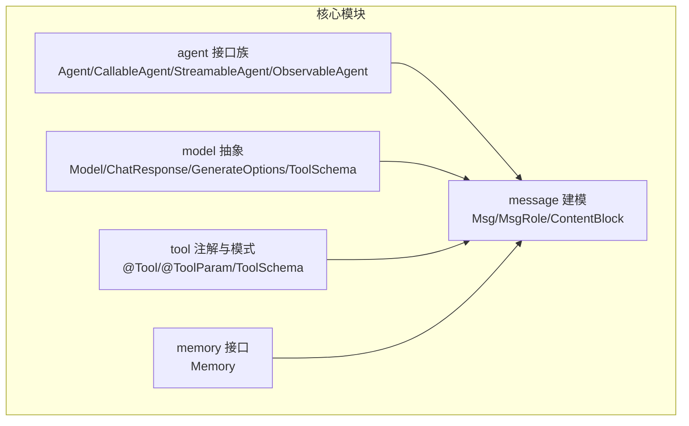
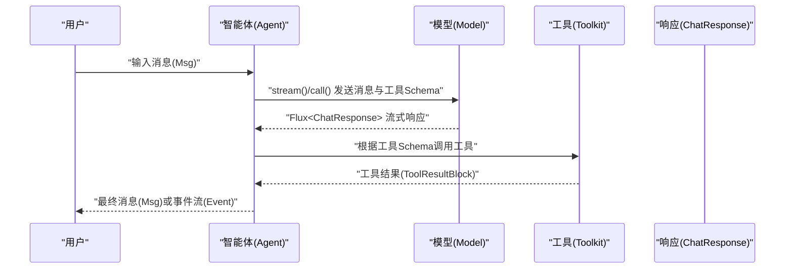
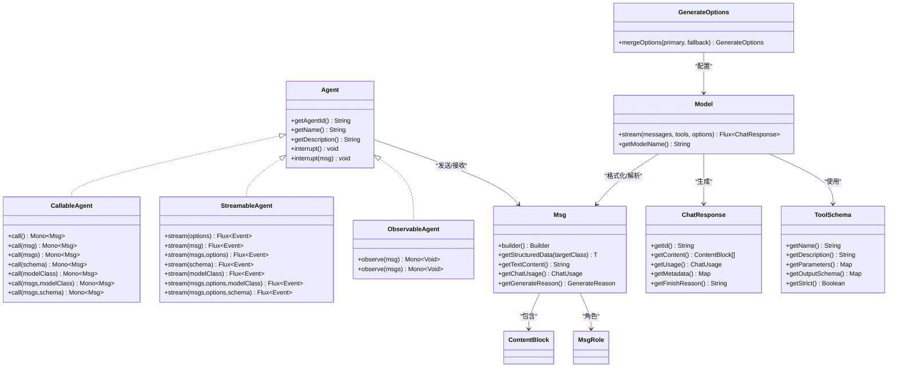

# API 参考

<cite>
**本文引用的文件**   
- [Version.java](file://agentscope-core/src/main/java/io/agentscope/core/Version.java)
- [Agent.java](file://agentscope-core/src/main/java/io/agentscope/core/agent/Agent.java)
- [CallableAgent.java](file://agentscope-core/src/main/java/io/agentscope/core/agent/CallableAgent.java)
- [StreamableAgent.java](file://agentscope-core/src/main/java/io/agentscope/core/agent/StreamableAgent.java)
- [ObservableAgent.java](file://agentscope-core/src/main/java/io/agentscope/core/agent/ObservableAgent.java)
- [Model.java](file://agentscope-core/src/main/java/io/agentscope/core/model/Model.java)
- [ChatResponse.java](file://agentscope-core/src/main/java/io/agentscope/core/model/ChatResponse.java)
- [GenerateOptions.java](file://agentscope-core/src/main/java/io/agentscope/core/model/GenerateOptions.java)
- [ToolSchema.java](file://agentscope-core/src/main/java/io/agentscope/core/model/ToolSchema.java)
- [Tool.java](file://agentscope-core/src/main/java/io/agentscope/core/tool/Tool.java)
- [ToolParam.java](file://agentscope-core/src/main/java/io/agentscope/core/tool/ToolParam.java)
- [Memory.java](file://agentscope-core/src/main/java/io/agentscope/core/memory/Memory.java)
- [Msg.java](file://agentscope-core/src/main/java/io/agentscope/core/message/Msg.java)
- [MsgRole.java](file://agentscope-core/src/main/java/io/agentscope/core/message/MsgRole.java)
- [ContentBlock.java](file://agentscope-core/src/main/java/io/agentscope/core/message/ContentBlock.java)
</cite>

## 目录
1. [简介](#简介)
2. [项目结构](#项目结构)
3. [核心组件](#核心组件)
4. [架构总览](#架构总览)
5. [详细组件分析](#详细组件分析)
6. [依赖关系分析](#依赖关系分析)
7. [性能考量](#性能考量)
8. [故障排查指南](#故障排查指南)
9. [结论](#结论)
10. [附录](#附录)

## 简介
本文件为 AgentScope Java 的完整 API 参考，覆盖智能体、模型、工具、消息与内存等核心模块。内容以“按功能模块组织”的方式呈现，包含类、接口、方法、字段与枚举的详细说明，解释参数、返回值、异常与使用场景，并提供最佳实践与常见陷阱提示。同时给出可执行的调用时序图与数据流图，帮助读者快速定位到相关源码路径。

## 项目结构
AgentScope Java 的核心 API 主要位于 agentscope-core 模块的以下包中：
- agent：智能体接口与能力组合（调用、流式、观察）
- model：模型抽象、响应与生成选项
- tool：工具注解与工具模式定义
- memory：内存接口与状态持久化
- message：消息建模、角色与内容块
- 其他子包：formatter、hook、pipeline、plan、rag、session、shutdown、skill、state、tracing、util 等

**图表来源**
- [Agent.java:41-82](file://agentscope-core/src/main/java/io/agentscope/core/agent/Agent.java#L41-L82)
- [Model.java:22-41](file://agentscope-core/src/main/java/io/agentscope/core/model/Model.java#L22-L41)
- [Tool.java:60-133](file://agentscope-core/src/main/java/io/agentscope/core/tool/Tool.java#L60-L133)
- [Memory.java:29-62](file://agentscope-core/src/main/java/io/agentscope/core/memory/Memory.java#L29-L62)
- [Msg.java:52-655](file://agentscope-core/src/main/java/io/agentscope/core/message/Msg.java#L52-L655)

**章节来源**
- [Agent.java:20-82](file://agentscope-core/src/main/java/io/agentscope/core/agent/Agent.java#L20-L82)
- [Model.java:22-41](file://agentscope-core/src/main/java/io/agentscope/core/model/Model.java#L22-L41)
- [Tool.java:24-133](file://agentscope-core/src/main/java/io/agentscope/core/tool/Tool.java#L24-L133)
- [Memory.java:22-62](file://agentscope-core/src/main/java/io/agentscope/core/memory/Memory.java#L22-L62)
- [Msg.java:38-655](file://agentscope-core/src/main/java/io/agentscope/core/message/Msg.java#L38-L655)

## 核心组件
本节概述各模块的关键类型与其职责边界，便于快速检索与交叉引用。

- 智能体接口族
  - Agent：统一智能体契约，组合调用、流式与观察三种能力；提供中断控制与标识信息
  - CallableAgent：消息处理与结构化输出生成
  - StreamableAgent：事件流式输出（推理、行动、摘要等）
  - ObservableAgent：被动观察消息（不生成回复）

- 模型抽象
  - Model：统一模型接口，负责消息格式化后的流式对话补全
  - ChatResponse：模型响应载体（内容块、用量、元数据、结束原因）
  - GenerateOptions：生成参数与连接配置（温度、采样、工具选择、缓存控制、额外头/体/查询参数等）
  - ToolSchema：工具 JSON Schema 描述（名称、描述、参数、输出模式、严格模式）

- 工具系统
  - @Tool：方法级工具注解，声明工具名、描述、严格模式与结果转换器
  - @ToolParam：参数级注解，要求显式命名、必填与描述
  - ToolSchema：工具模式对象（不可变）

- 内存接口
  - Memory：扩展 StateModule，提供消息增删查清与状态持久化

- 消息与内容块
  - Msg：消息建模（角色、内容块列表、元数据、时间戳、结构化数据读取、用量与生成原因）
  - MsgRole：消息角色枚举（用户、助手、系统、工具）
  - ContentBlock：内容块多态基类（文本、思考、图像、音频、视频、工具调用、工具结果）

**章节来源**
- [Agent.java:20-82](file://agentscope-core/src/main/java/io/agentscope/core/agent/Agent.java#L20-L82)
- [CallableAgent.java:23-139](file://agentscope-core/src/main/java/io/agentscope/core/agent/CallableAgent.java#L23-L139)
- [StreamableAgent.java:23-151](file://agentscope-core/src/main/java/io/agentscope/core/agent/StreamableAgent.java#L23-L151)
- [ObservableAgent.java:22-53](file://agentscope-core/src/main/java/io/agentscope/core/agent/ObservableAgent.java#L22-L53)
- [Model.java:22-41](file://agentscope-core/src/main/java/io/agentscope/core/model/Model.java#L22-L41)
- [ChatResponse.java:23-207](file://agentscope-core/src/main/java/io/agentscope/core/model/ChatResponse.java#L23-L207)
- [GenerateOptions.java:24-874](file://agentscope-core/src/main/java/io/agentscope/core/model/GenerateOptions.java#L24-L874)
- [ToolSchema.java:24-182](file://agentscope-core/src/main/java/io/agentscope/core/model/ToolSchema.java#L24-L182)
- [Tool.java:24-133](file://agentscope-core/src/main/java/io/agentscope/core/tool/Tool.java#L24-L133)
- [ToolParam.java:24-104](file://agentscope-core/src/main/java/io/agentscope/core/tool/ToolParam.java#L24-L104)
- [Memory.java:22-62](file://agentscope-core/src/main/java/io/agentscope/core/memory/Memory.java#L22-L62)
- [Msg.java:38-655](file://agentscope-core/src/main/java/io/agentscope/core/message/Msg.java#L38-L655)
- [MsgRole.java:18-67](file://agentscope-core/src/main/java/io/agentscope/core/message/MsgRole.java#L18-L67)
- [ContentBlock.java:22-61](file://agentscope-core/src/main/java/io/agentscope/core/message/ContentBlock.java#L22-L61)

## 架构总览
AgentScope 的运行时由“消息驱动”贯穿：智能体通过消息进行交互，模型负责将消息格式化并生成响应，工具通过 Schema 被模型调用，内存保存历史，状态模块实现持久化。

**图表来源**
- [Agent.java:41-82](file://agentscope-core/src/main/java/io/agentscope/core/agent/Agent.java#L41-L82)
- [Model.java:22-41](file://agentscope-core/src/main/java/io/agentscope/core/model/Model.java#L22-L41)
- [ChatResponse.java:29-207](file://agentscope-core/src/main/java/io/agentscope/core/model/ChatResponse.java#L29-L207)
- [ToolSchema.java:28-182](file://agentscope-core/src/main/java/io/agentscope/core/model/ToolSchema.java#L28-L182)
- [Msg.java:52-655](file://agentscope-core/src/main/java/io/agentscope/core/message/Msg.java#L52-L655)

## 详细组件分析

### 智能体 API
- 统一接口 Agent
  - 关键方法
    - getAgentId(): 获取智能体唯一标识
    - getName(): 获取智能体名称
    - getDescription(): 获取描述，默认基于 ID 与名称
    - interrupt(): 中断当前执行
    - interrupt(Msg): 带用户消息的中断
  - 设计要点
    - 不在核心接口中内置记忆管理，具体实现（如 ReActAgent）自行管理
    - 结构化输出为特定能力，非通用接口
    - 观察模式用于多智能体协作，接收消息但不生成回复

- 调用接口 CallableAgent
  - 支持多种 call() 重载：单消息、消息列表、带结构化模型或 JSON Schema
  - 返回 Mono<Msg>，支持结构化输出写入消息元数据

- 流式接口 StreamableAgent
  - 支持多种 stream() 重载：默认选项、指定选项、结构化模型或 JSON Schema
  - 返回 Flux<Event>，用于实时事件流（推理、行动、摘要等）

- 观察接口 ObservableAgent
  - observe(Msg/List)：接收消息但不生成回复，返回 Mono<Void>

- 最佳实践
  - 在多智能体协作中优先使用 ObservableAgent 进行上下文共享
  - 使用结构化输出时，明确指定结构化模型类或 JSON Schema，确保下游解析稳定

**章节来源**
- [Agent.java:20-82](file://agentscope-core/src/main/java/io/agentscope/core/agent/Agent.java#L20-L82)
- [CallableAgent.java:23-139](file://agentscope-core/src/main/java/io/agentscope/core/agent/CallableAgent.java#L23-L139)
- [StreamableAgent.java:23-151](file://agentscope-core/src/main/java/io/agentscope/core/agent/StreamableAgent.java#L23-L151)
- [ObservableAgent.java:22-53](file://agentscope-core/src/main/java/io/agentscope/core/agent/ObservableAgent.java#L22-L53)

### 模型 API
- Model 接口
  - stream(messages, tools, options): 流式对话补全，内部使用已配置的格式化器处理消息
  - getModelName(): 获取模型标识，用于日志与统计

- ChatResponse 数据模型
  - 字段：id、content(内容块列表)、usage(用量)、metadata(元数据)、finishReason(结束原因)
  - Builder 支持 id 自动回退（空时生成随机 UUID），兼容部分提供商未返回 id 的场景

- GenerateOptions 配置
  - 连接层：apiKey、baseUrl、endpointPath、modelName、stream
  - 生成参数：temperature、topP、maxTokens、maxCompletionTokens、frequencyPenalty、presencePenalty、thinkingBudget、reasoningEffort、topK、seed、cacheControl、parallelToolCalls
  - 执行配置：executionConfig（超时、重试、退避、错误过滤）
  - 扩展：additionalHeaders、additionalBodyParams、additionalQueryParams
  - 合并策略：mergeOptions(primary, fallback)，逐字段合并，支持 Map 类型深度合并

- ToolSchema 工具模式
  - 字段：name、description、parameters(JSON Schema)、outputSchema(JSON Schema)、strict
  - Builder 提供不可变构建流程

- 使用建议
  - 对于需要缓存提示词的场景，启用 cacheControl 以减少延迟与成本
  - 并行工具调用需结合模型与平台支持，谨慎开启
  - 合理设置 maxTokens 与 maxCompletionTokens，避免与平台语义冲突

**章节来源**
- [Model.java:22-41](file://agentscope-core/src/main/java/io/agentscope/core/model/Model.java#L22-L41)
- [ChatResponse.java:29-207](file://agentscope-core/src/main/java/io/agentscope/core/model/ChatResponse.java#L29-L207)
- [GenerateOptions.java:24-874](file://agentscope-core/src/main/java/io/agentscope/core/model/GenerateOptions.java#L24-L874)
- [ToolSchema.java:24-182](file://agentscope-core/src/main/java/io/agentscope/core/model/ToolSchema.java#L24-L182)

### 工具 API
- @Tool 注解
  - 属性：name、description、strict、converter
  - 要求：所有参数必须标注 @ToolParam（除自动注入的 ToolEmitter），返回类型支持字符串与响应式类型
  - 用途：自动注册到工具箱，生成 JSON Schema 供模型消费

- @ToolParam 注解
  - 属性：name（必需）、required、description
  - 重要性：Java 默认不保留运行时常量名，必须显式声明 name

- ToolSchema
  - 作为工具的 JSON Schema 表达，供模型理解参数与输出约束

- 最佳实践
  - 工具名遵循 snake_case，描述清晰说明用途与返回值
  - 使用自定义 ToolResultConverter 过滤敏感信息、格式化输出或添加元数据
  - 对复杂处理，建议在 converter 中组合多个步骤

**章节来源**
- [Tool.java:24-133](file://agentscope-core/src/main/java/io/agentscope/core/tool/Tool.java#L24-L133)
- [ToolParam.java:24-104](file://agentscope-core/src/main/java/io/agentscope/core/tool/ToolParam.java#L24-L104)
- [ToolSchema.java:24-182](file://agentscope-core/src/main/java/io/agentscope/core/model/ToolSchema.java#L24-L182)

### 内存 API
- Memory 接口
  - addMessage(Msg): 添加消息
  - getMessages(): 获取全部消息
  - deleteMessage(int): 安全删除（越界视为无操作）
  - clear(): 清空所有消息
  - 扩展 StateModule：支持通过会话持久化与恢复状态

- 最佳实践
  - 删除操作应考虑并发修改的安全性，避免抛出异常
  - 结合 Session 机制实现跨进程/重启的状态恢复

**章节来源**
- [Memory.java:22-62](file://agentscope-core/src/main/java/io/agentscope/core/memory/Memory.java#L22-L62)

### 消息与内容块 API
- Msg 消息
  - 字段：id、name、role、content(内容块列表)、metadata、timestamp
  - 工具方法：hasContentBlocks()/getContentBlocks()/getFirstContentBlock()/getStructuredData()/getTextContent()/getChatUsage()/getGenerateReason()/withGenerateReason()
  - Builder：链式配置，支持 textContent、generateReason 等便捷设置

- MsgRole 角色
  - USER、ASSISTANT、SYSTEM、TOOL

- ContentBlock 多态
  - sealed 类型，支持 TextBlock、ThinkingBlock、ImageBlock、AudioBlock、VideoBlock、ToolUseBlock、ToolResultBlock
  - Jackson 多态序列化，使用 type 字段区分

- 最佳实践
  - 使用 Builder 构造消息，确保不可变性与线程安全
  - 结构化数据通过元数据存储，使用 getStructuredData() 安全提取
  - 用量与生成原因通过元数据读取，便于监控与可观测性

**章节来源**
- [Msg.java:38-655](file://agentscope-core/src/main/java/io/agentscope/core/message/Msg.java#L38-L655)
- [MsgRole.java:18-67](file://agentscope-core/src/main/java/io/agentscope/core/message/MsgRole.java#L18-L67)
- [ContentBlock.java:22-61](file://agentscope-core/src/main/java/io/agentscope/core/message/ContentBlock.java#L22-L61)

## 依赖关系分析
下图展示核心类型之间的依赖关系与交互：

**图表来源**
- [Agent.java:41-82](file://agentscope-core/src/main/java/io/agentscope/core/agent/Agent.java#L41-L82)
- [CallableAgent.java:35-139](file://agentscope-core/src/main/java/io/agentscope/core/agent/CallableAgent.java#L35-L139)
- [StreamableAgent.java:36-151](file://agentscope-core/src/main/java/io/agentscope/core/agent/StreamableAgent.java#L36-L151)
- [ObservableAgent.java:36-53](file://agentscope-core/src/main/java/io/agentscope/core/agent/ObservableAgent.java#L36-L53)
- [Model.java:22-41](file://agentscope-core/src/main/java/io/agentscope/core/model/Model.java#L22-L41)
- [ChatResponse.java:29-207](file://agentscope-core/src/main/java/io/agentscope/core/model/ChatResponse.java#L29-L207)
- [GenerateOptions.java:31-874](file://agentscope-core/src/main/java/io/agentscope/core/model/GenerateOptions.java#L31-L874)
- [ToolSchema.java:28-182](file://agentscope-core/src/main/java/io/agentscope/core/model/ToolSchema.java#L28-L182)
- [Msg.java:52-655](file://agentscope-core/src/main/java/io/agentscope/core/message/Msg.java#L52-L655)
- [MsgRole.java:35-67](file://agentscope-core/src/main/java/io/agentscope/core/message/MsgRole.java#L35-L67)
- [ContentBlock.java:54-61](file://agentscope-core/src/main/java/io/agentscope/core/message/ContentBlock.java#L54-L61)

## 性能考量
- 流式输出
  - 使用 Model.stream 与 StreamableAgent.stream 可降低端到端延迟，提升用户体验
  - 注意背压与订阅端处理能力，避免阻塞上游

- 缓存控制
  - 启用 cacheControl 可显著降低重复提示词的延迟与成本，适用于系统消息与最后一条消息

- 工具并行调用
  - parallelToolCalls 可提升工具执行吞吐，但需评估模型与平台对并发的支持与稳定性

- 参数与限额
  - 合理设置 maxTokens/maxCompletionTokens，避免与平台语义冲突导致的请求失败
  - temperature/topP 等参数影响生成质量与稳定性，建议在测试环境充分验证

- 序列化与不可变性
  - Msg 与 ChatResponse 等采用不可变设计，有利于并发安全与调试，但频繁构建会增加 GC 压力，建议复用 Builder 或复用已有实例

[本节为通用指导，无需列出具体文件来源]

## 故障排查指南
- 结构化数据提取失败
  - 症状：调用 getStructuredData() 抛出异常
  - 原因：消息无元数据或缺少结构化输出键
  - 处理：先调用 hasStructuredData() 检查，再进行类型转换

- 用量与生成原因为空
  - 症状：getChatUsage()/getGenerateReason() 返回空
  - 原因：上游未写入元数据或格式不匹配
  - 处理：确认模型侧是否正确填充元数据，或在消息构建时显式设置

- 工具调用参数缺失
  - 症状：模型无法正确解析工具参数
  - 原因：@ToolParam 未标注或 name 与实际不一致
  - 处理：确保每个参数均标注 @ToolParam(name=...)，且与 JSON Schema 一致

- 中断无效或延迟生效
  - 症状：调用 interrupt() 后执行未立即停止
  - 原因：智能体在检查点前继续执行
  - 处理：在关键节点检查中断标志，必要时在业务逻辑中主动检测

**章节来源**
- [Msg.java:266-291](file://agentscope-core/src/main/java/io/agentscope/core/message/Msg.java#L266-L291)
- [Msg.java:410-434](file://agentscope-core/src/main/java/io/agentscope/core/message/Msg.java#L410-L434)
- [ToolParam.java:64-104](file://agentscope-core/src/main/java/io/agentscope/core/tool/ToolParam.java#L64-L104)
- [Agent.java:66-81](file://agentscope-core/src/main/java/io/agentscope/core/agent/Agent.java#L66-L81)

## 结论
AgentScope Java 的 API 以消息为核心，围绕智能体、模型、工具与内存形成清晰的分层与职责边界。通过不可变的消息建模、可插拔的模型与工具模式、以及可扩展的内存与状态模块，开发者可以快速构建从简单对话到复杂多智能体协作的应用。建议在生产环境中结合流式输出、缓存控制与结构化输出策略，持续优化性能与可观测性。

[本节为总结性内容，无需列出具体文件来源]

## 附录

### 版本与兼容性
- 版本信息
  - 版本号：见常量 VERSION
  - User-Agent：统一格式，包含框架版本、JVM 版本与操作系统信息
- 兼容性与迁移
  - 保持接口向后兼容，新增能力以默认方法或可选参数形式提供
  - 对于可能破坏性的变更，将在版本说明中明确标注迁移步骤与替代方案

**章节来源**
- [Version.java:24-44](file://agentscope-core/src/main/java/io/agentscope/core/Version.java#L24-L44)

### API 使用最佳实践清单
- 智能体
  - 明确区分调用、流式与观察三种能力，按场景选择合适接口
  - 在多智能体协作中使用观察模式共享上下文
- 模型
  - 合理设置生成参数，避免与平台语义冲突
  - 使用 cacheControl 与并行工具调用提升效率
- 工具
  - 为每个参数标注 @ToolParam(name=...)，确保 JSON Schema 准确
  - 使用自定义 ToolResultConverter 控制输出与安全
- 消息
  - 使用 Builder 构造消息，避免直接修改
  - 通过元数据传递结构化数据与用量信息
- 内存
  - 删除操作应安全处理越界，避免异常
  - 结合会话实现状态持久化与恢复

[本节为通用指导，无需列出具体文件来源]