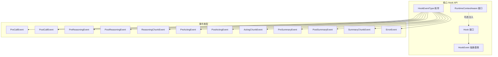
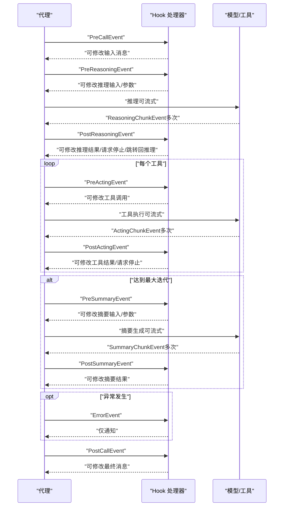
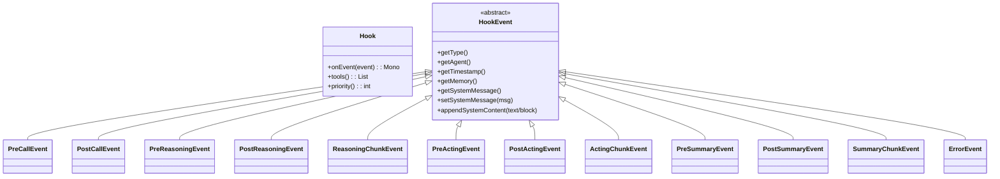
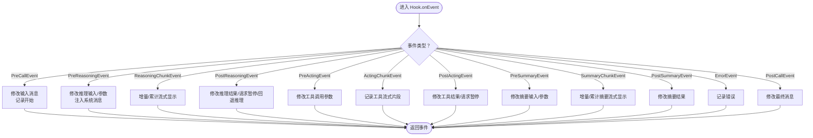

# Hook API

<cite>
**本文引用的文件**
- [Hook.java](file://agentscope-core/src/main/java/io/agentscope/core/hook/Hook.java)
- [HookEvent.java](file://agentscope-core/src/main/java/io/agentscope/core/hook/HookEvent.java)
- [HookEventType.java](file://agentscope-core/src/main/java/io/agentscope/core/hook/HookEventType.java)
- [RuntimeContextAware.java](file://agentscope-core/src/main/java/io/agentscope/core/hook/RuntimeContextAware.java)
- [PreCallEvent.java](file://agentscope-core/src/main/java/io/agentscope/core/hook/PreCallEvent.java)
- [PostCallEvent.java](file://agentscope-core/src/main/java/io/agentscope/core/hook/PostCallEvent.java)
- [PreReasoningEvent.java](file://agentscope-core/src/main/java/io/agentscope/core/hook/PreReasoningEvent.java)
- [PostReasoningEvent.java](file://agentscope-core/src/main/java/io/agentscope/core/hook/PostReasoningEvent.java)
- [ReasoningChunkEvent.java](file://agentscope-core/src/main/java/io/agentscope/core/hook/ReasoningChunkEvent.java)
- [PreActingEvent.java](file://agentscope-core/src/main/java/io/agentscope/core/hook/PreActingEvent.java)
- [PostActingEvent.java](file://agentscope-core/src/main/java/io/agentscope/core/hook/PostActingEvent.java)
- [ActingChunkEvent.java](file://agentscope-core/src/main/java/io/agentscope/core/hook/ActingChunkEvent.java)
- [PreSummaryEvent.java](file://agentscope-core/src/main/java/io/agentscope/core/hook/PreSummaryEvent.java)
- [PostSummaryEvent.java](file://agentscope-core/src/main/java/io/agentscope/core/hook/PostSummaryEvent.java)
- [SummaryChunkEvent.java](file://agentscope-core/src/main/java/io/agentscope/core/hook/SummaryChunkEvent.java)
- [ErrorEvent.java](file://agentscope-core/src/main/java/io/agentscope/core/hook/ErrorEvent.java)
- [StreamingHook.java](file://agentscope-core/src/main/java/io/agentscope/core/agent/StreamingHook.java)
- [StructuredOutputHook.java](file://agentscope-core/src/main/java/io/agentscope/core/agent/StructuredOutputHook.java)
- [PendingToolRecoveryHook.java](file://agentscope-core/src/main/java/io/agentscope/core/hook/PendingToolRecoveryHook.java)
- [TTSHook.java](file://agentscope-core/src/main/java/io/agentscope/core/hook/TTSHook.java)
- [GenericRAGHook.java](file://agentscope-core/src/main/java/io/agentscope/core/rag/GenericRAGHook.java)
- [AutoContextHook.java](file://agentscope-extensions/agentscope-extensions-autocontext-memory/src/main/java/io/agentscope/core/memory/autocontext/AutoContextHook.java)
- [StudioMessageHook.java](file://agentscope-extensions/agentscope-extensions-studio/src/main/java/io/agentscope/core/studio/StudioMessageHook.java)
- [AgentTraceHook.java](file://agentscope-harness/src/main/java/io/agentscope/harness/agent/hook/AgentTraceHook.java)
- [CompactionHook.java](file://agentscope-harness/src/main/java/io/agentscope/harness/agent/hook/CompactionHook.java)
</cite>

## 目录
1. [简介](#简介)
2. [项目结构](#项目结构)
3. [核心组件](#核心组件)
4. [架构总览](#架构总览)
5. [详细组件分析](#详细组件分析)
6. [依赖分析](#依赖分析)
7. [性能考虑](#性能考虑)
8. [故障排查指南](#故障排查指南)
9. [结论](#结论)
10. [附录](#附录)

## 简介
本参考文档面向 AgentScope Java Hook 扩展系统，系统性阐述 Hook 接口设计、事件模型与生命周期、事件类型 API、注册与配置方式、执行顺序与优先级机制，并提供自定义 Hook 的开发方法、最佳实践以及典型使用示例路径。Hook 通过统一的事件分发接口拦截代理执行的关键阶段，支持修改输入消息、推理参数、工具调用与结果等，亦可进行只读的流式输出监听与错误通知。

## 项目结构
Hook API 位于 agentscope-core 模块的 hook 包中，围绕 Hook 接口与一系列事件类型构建。同时，框架在 agent、rag、extensions、harness 等模块提供了多种内置 Hook 实现，便于直接复用或作为自定义 Hook 的参考。

图表来源
- [Hook.java:117-186](file://agentscope-core/src/main/java/io/agentscope/core/hook/Hook.java#L117-L186)
- [HookEvent.java:74-205](file://agentscope-core/src/main/java/io/agentscope/core/hook/HookEvent.java#L74-L205)
- [HookEventType.java:27-63](file://agentscope-core/src/main/java/io/agentscope/core/hook/HookEventType.java#L27-L63)
- [RuntimeContextAware.java:30-39](file://agentscope-core/src/main/java/io/agentscope/core/hook/RuntimeContextAware.java#L30-L39)

章节来源
- [Hook.java:117-186](file://agentscope-core/src/main/java/io/agentscope/core/hook/Hook.java#L117-L186)
- [HookEvent.java:74-205](file://agentscope-core/src/main/java/io/agentscope/core/hook/HookEvent.java#L74-L205)
- [HookEventType.java:27-63](file://agentscope-core/src/main/java/io/agentscope/core/hook/HookEventType.java#L27-L63)
- [RuntimeContextAware.java:30-39](file://agentscope-core/src/main/java/io/agentscope/core/hook/RuntimeContextAware.java#L30-L39)

## 核心组件
- Hook 接口：统一事件处理入口，支持设置优先级与注册工具。
- HookEvent 抽象基类：提供统一上下文（代理实例、时间戳、内存访问、系统消息管理），并限定事件类型集合。
- HookEventType 枚举：定义全部事件类型，覆盖从调用开始到结束的完整生命周期。
- RuntimeContextAware：可选注入当前调用的运行时上下文，用于跨 Hook/工具协作。
- 具体事件类型：按阶段细分为预处理、推理、工具执行、摘要生成、流式片段与错误事件，部分事件可修改，部分为只读通知。

章节来源
- [Hook.java:117-186](file://agentscope-core/src/main/java/io/agentscope/core/hook/Hook.java#L117-L186)
- [HookEvent.java:74-205](file://agentscope-core/src/main/java/io/agentscope/core/hook/HookEvent.java#L74-L205)
- [HookEventType.java:27-63](file://agentscope-core/src/main/java/io/agentscope/core/hook/HookEventType.java#L27-L63)
- [RuntimeContextAware.java:30-39](file://agentscope-core/src/main/java/io/agentscope/core/hook/RuntimeContextAware.java#L30-L39)

## 架构总览
下图展示了 Hook 的统一事件模型与关键事件的触发顺序，体现“预处理—推理—工具执行—摘要”的主流程，以及流式片段与错误事件的插入点。

图表来源
- [PreCallEvent.java:44-80](file://agentscope-core/src/main/java/io/agentscope/core/hook/PreCallEvent.java#L44-L80)
- [PreReasoningEvent.java:47-116](file://agentscope-core/src/main/java/io/agentscope/core/hook/PreReasoningEvent.java#L47-L116)
- [ReasoningChunkEvent.java:60-106](file://agentscope-core/src/main/java/io/agentscope/core/hook/ReasoningChunkEvent.java#L60-L106)
- [PostReasoningEvent.java:51-172](file://agentscope-core/src/main/java/io/agentscope/core/hook/PostReasoningEvent.java#L51-L172)
- [PreActingEvent.java:47-70](file://agentscope-core/src/main/java/io/agentscope/core/hook/PreActingEvent.java#L47-L70)
- [ActingChunkEvent.java:49-76](file://agentscope-core/src/main/java/io/agentscope/core/hook/ActingChunkEvent.java#L49-L76)
- [PostActingEvent.java:50-128](file://agentscope-core/src/main/java/io/agentscope/core/hook/PostActingEvent.java#L50-L128)
- [PreSummaryEvent.java:49-143](file://agentscope-core/src/main/java/io/agentscope/core/hook/PreSummaryEvent.java#L49-L143)
- [SummaryChunkEvent.java:60-106](file://agentscope-core/src/main/java/io/agentscope/core/hook/SummaryChunkEvent.java#L60-L106)
- [PostSummaryEvent.java:47-103](file://agentscope-core/src/main/java/io/agentscope/core/hook/PostSummaryEvent.java#L47-L103)
- [ErrorEvent.java:41-65](file://agentscope-core/src/main/java/io/agentscope/core/hook/ErrorEvent.java#L41-L65)
- [PostCallEvent.java:42-76](file://agentscope-core/src/main/java/io/agentscope/core/hook/PostCallEvent.java#L42-L76)

## 详细组件分析

### Hook 接口与优先级
- 统一事件入口：onEvent(T event)，使用模式匹配处理具体事件类型。
- 可修改事件：PreReasoningEvent、PostReasoningEvent、PreActingEvent、PostActingEvent、PreCallEvent、PostCallEvent、PreSummaryEvent、PostSummaryEvent。
- 通知事件（不可修改）：ReasoningChunkEvent、ActingChunkEvent、SummaryChunkEvent、ErrorEvent。
- 工具注册：tools() 返回 Hook 内置工具，随代理构建自动注册。
- 优先级：priority() 数值越小优先级越高；同优先级按注册顺序执行。

章节来源
- [Hook.java:117-186](file://agentscope-core/src/main/java/io/agentscope/core/hook/Hook.java#L117-L186)

### HookEvent 基类与系统消息生命周期
- 提供通用上下文：代理实例、时间戳、内存访问、系统消息字段。
- 系统消息管理：统一的 systemMsg 字段贯穿事件生命周期，ReActAgent 在每次推理前注入冻结基线，确保钩子每次从同一干净起点开始。
- 修改规则：仅允许通过 setSystemMessage 或 appendSystemContent 进行修改；禁止直接向 inputMessages 注入 SYSTEM 角色消息。

章节来源
- [HookEvent.java:74-205](file://agentscope-core/src/main/java/io/agentscope/core/hook/HookEvent.java#L74-L205)

### HookEventType 事件枚举
- 预处理：PRE_CALL、POST_CALL
- 推理：PRE_REASONING、POST_REASONING、REASONING_CHUNK
- 工具执行：PRE_ACTING、POST_ACTING、ACTING_CHUNK
- 摘要：PRE_SUMMARY、POST_SUMMARY、SUMMARY_CHUNK
- 错误：ERROR

章节来源
- [HookEventType.java:27-63](file://agentscope-core/src/main/java/io/agentscope/core/hook/HookEventType.java#L27-L63)

### 事件类型 API 一览与使用场景

#### 调用前后事件
- PreCallEvent
  - 可修改：setInputMessages(List)
  - 场景：日志、资源初始化、输入过滤/增强
  - 参考路径：[PreCallEvent.java:44-80](file://agentscope-core/src/main/java/io/agentscope/core/hook/PreCallEvent.java#L44-L80)
- PostCallEvent
  - 可修改：setFinalMessage(Msg)
  - 场景：后处理响应、添加元数据、输出净化
  - 参考路径：[PostCallEvent.java:42-76](file://agentscope-core/src/main/java/io/agentscope/core/hook/PostCallEvent.java#L42-L76)

#### 推理阶段事件
- PreReasoningEvent
  - 可修改：setInputMessages(List)、setGenerateOptions(GenerateOptions)
  - 场景：注入提示、动态上下文、结构化输出工具选择
  - 参考路径：[PreReasoningEvent.java:47-116](file://agentscope-core/src/main/java/io/agentscope/core/hook/PreReasoningEvent.java#L47-L116)
- PostReasoningEvent
  - 可修改：setReasoningMessage(Msg)
  - 特性：stopAgent() 请求暂停；gotoReasoning() 回退推理并校验 ToolResult 匹配
  - 场景：工具调用过滤、内容增删、人机协同
  - 参考路径：[PostReasoningEvent.java:51-172](file://agentscope-core/src/main/java/io/agentscope/core/hook/PostReasoningEvent.java#L51-L172)
- ReasoningChunkEvent
  - 不可修改：增量/累计流式片段
  - 场景：实时显示、进度监控、日志记录
  - 参考路径：[ReasoningChunkEvent.java:60-106](file://agentscope-core/src/main/java/io/agentscope/core/hook/ReasoningChunkEvent.java#L60-L106)

#### 工具执行阶段事件
- PreActingEvent
  - 可修改：setToolUse(ToolUseBlock)
  - 场景：参数校验/增强、鉴权、逐工具监控
  - 参考路径：[PreActingEvent.java:47-70](file://agentscope-core/src/main/java/io/agentscope/core/hook/PreActingEvent.java#L47-L70)
- PostActingEvent
  - 可修改：setToolResult(ToolResultBlock)、setToolResultMsg(Msg)
  - 特性：stopAgent() 请求暂停；支持设置结果消息
  - 场景：结果后处理、格式转换、错误处理
  - 参考路径：[PostActingEvent.java:50-128](file://agentscope-core/src/main/java/io/agentscope/core/hook/PostActingEvent.java#L50-L128)
- ActingChunkEvent
  - 不可修改：工具流式片段（非发送给 LLM）
  - 场景：长任务进度、中间结果日志
  - 参考路径：[ActingChunkEvent.java:49-76](file://agentscope-core/src/main/java/io/agentscope/core/hook/ActingChunkEvent.java#L49-L76)

#### 摘要阶段事件
- PreSummaryEvent
  - 可修改：setInputMessages(List)、setGenerateOptions(GenerateOptions)
  - 场景：注入摘要上下文、调整摘要参数
  - 参考路径：[PreSummaryEvent.java:49-143](file://agentscope-core/src/main/java/io/agentscope/core/hook/PreSummaryEvent.java#L49-L143)
- PostSummaryEvent
  - 可修改：setSummaryMessage(Msg)
  - 特性：stopAgent() 请求暂停
  - 场景：摘要净化、元数据附加
  - 参考路径：[PostSummaryEvent.java:47-103](file://agentscope-core/src/main/java/io/agentscope/core/hook/PostSummaryEvent.java#L47-L103)
- SummaryChunkEvent
  - 不可修改：摘要流式片段
  - 场景：摘要实时显示、进度监控
  - 参考路径：[SummaryChunkEvent.java:60-106](file://agentscope-core/src/main/java/io/agentscope/core/hook/SummaryChunkEvent.java#L60-L106)

#### 错误事件
- ErrorEvent
  - 不可修改：仅通知错误对象
  - 场景：错误日志、告警、指标统计
  - 参考路径：[ErrorEvent.java:41-65](file://agentscope-core/src/main/java/io/agentscope/core/hook/ErrorEvent.java#L41-L65)

#### 运行时上下文注入
- RuntimeContextAware：在一次调用期间注入/清理 RuntimeContext，便于跨 Hook/工具共享状态
- 参考路径：[RuntimeContextAware.java:30-39](file://agentscope-core/src/main/java/io/agentscope/core/hook/RuntimeContextAware.java#L30-L39)

### Hook 类图（代码级）

图表来源
- [Hook.java:117-186](file://agentscope-core/src/main/java/io/agentscope/core/hook/Hook.java#L117-L186)
- [HookEvent.java:74-205](file://agentscope-core/src/main/java/io/agentscope/core/hook/HookEvent.java#L74-L205)
- [PreCallEvent.java:44-80](file://agentscope-core/src/main/java/io/agentscope/core/hook/PreCallEvent.java#L44-L80)
- [PostCallEvent.java:42-76](file://agentscope-core/src/main/java/io/agentscope/core/hook/PostCallEvent.java#L42-L76)
- [PreReasoningEvent.java:47-116](file://agentscope-core/src/main/java/io/agentscope/core/hook/PreReasoningEvent.java#L47-L116)
- [PostReasoningEvent.java:51-172](file://agentscope-core/src/main/java/io/agentscope/core/hook/PostReasoningEvent.java#L51-L172)
- [ReasoningChunkEvent.java:60-106](file://agentscope-core/src/main/java/io/agentscope/core/hook/ReasoningChunkEvent.java#L60-L106)
- [PreActingEvent.java:47-70](file://agentscope-core/src/main/java/io/agentscope/core/hook/PreActingEvent.java#L47-L70)
- [PostActingEvent.java:50-128](file://agentscope-core/src/main/java/io/agentscope/core/hook/PostActingEvent.java#L50-L128)
- [ActingChunkEvent.java:49-76](file://agentscope-core/src/main/java/io/agentscope/core/hook/ActingChunkEvent.java#L49-L76)
- [PreSummaryEvent.java:49-143](file://agentscope-core/src/main/java/io/agentscope/core/hook/PreSummaryEvent.java#L49-L143)
- [PostSummaryEvent.java:47-103](file://agentscope-core/src/main/java/io/agentscope/core/hook/PostSummaryEvent.java#L47-L103)
- [SummaryChunkEvent.java:60-106](file://agentscope-core/src/main/java/io/agentscope/core/hook/SummaryChunkEvent.java#L60-L106)
- [ErrorEvent.java:41-65](file://agentscope-core/src/main/java/io/agentscope/core/hook/ErrorEvent.java#L41-L65)

### Hook 执行顺序与优先级机制
- 优先级：数值越小优先级越高；默认优先级为 100。
- 同优先级：按注册顺序执行。
- 系统消息一致性：每次推理前注入冻结基线，保证钩子从相同起点开始，避免跨轮次累积。
- 流式事件：REASONING_CHUNK、ACTING_CHUNK、SUMMARY_CHUNK 为只读通知事件，不改变执行流程。

章节来源
- [Hook.java:167-185](file://agentscope-core/src/main/java/io/agentscope/core/hook/Hook.java#L167-L185)
- [HookEvent.java:43-66](file://agentscope-core/src/main/java/io/agentscope/core/hook/HookEvent.java#L43-L66)

### Hook 注册与配置指南
- 通过 Hook 接口实现自定义处理器，重写 onEvent 并使用模式匹配处理事件类型。
- 如需随代理自动注册工具，重写 tools() 返回工具实例列表。
- 设置优先级 priority() 控制执行顺序；必要时实现 RuntimeContextAware 注入运行时上下文。
- 使用示例参考路径：
  - [Hook.java:42-112](file://agentscope-core/src/main/java/io/agentscope/core/hook/Hook.java#L42-L112)
  - [RuntimeContextAware.java:30-39](file://agentscope-core/src/main/java/io/agentscope/core/hook/RuntimeContextAware.java#L30-L39)

章节来源
- [Hook.java:117-186](file://agentscope-core/src/main/java/io/agentscope/core/hook/Hook.java#L117-L186)
- [RuntimeContextAware.java:30-39](file://agentscope-core/src/main/java/io/agentscope/core/hook/RuntimeContextAware.java#L30-L39)

### 自定义 Hook 开发与最佳实践
- 事件修改原则：仅对具备 setter 的事件进行修改；对只读事件仅做监听与记录。
- 系统消息操作：统一通过 setSystemMessage 或 appendSystemContent 修改；避免直接向 inputMessages 注入 SYSTEM 角色消息。
- 人机协同：利用 PostReasoningEvent 的 gotoReasoning 与 stopAgent，结合 PostActingEvent 的 stopAgent 实现审阅与恢复。
- 工具链路：PreActingEvent 修改 ToolUseBlock 参数，PostActingEvent 修改 ToolResultBlock 结果，保持与工具发射器的流式片段一致。
- 性能与幂等：钩子应尽量轻量，避免阻塞；对重复调用保持幂等。
- 示例参考：
  - [StreamingHook.java](file://agentscope-core/src/main/java/io/agentscope/core/agent/StreamingHook.java)
  - [StructuredOutputHook.java](file://agentscope-core/src/main/java/io/agentscope/core/agent/StructuredOutputHook.java)
  - [PendingToolRecoveryHook.java](file://agentscope-core/src/main/java/io/agentscope/core/hook/PendingToolRecoveryHook.java)
  - [TTSHook.java](file://agentscope-core/src/main/java/io/agentscope/core/hook/TTSHook.java)
  - [GenericRAGHook.java](file://agentscope-core/src/main/java/io/agentscope/core/rag/GenericRAGHook.java)
  - [AutoContextHook.java](file://agentscope-extensions/agentscope-extensions-autocontext-memory/src/main/java/io/agentscope/core/memory/autocontext/AutoContextHook.java)
  - [StudioMessageHook.java](file://agentscope-extensions/agentscope-extensions-studio/src/main/java/io/agentscope/core/studio/StudioMessageHook.java)
  - [AgentTraceHook.java](file://agentscope-harness/src/main/java/io/agentscope/harness/agent/hook/AgentTraceHook.java)
  - [CompactionHook.java](file://agentscope-harness/src/main/java/io/agentscope/harness/agent/hook/CompactionHook.java)

章节来源
- [Hook.java:117-186](file://agentscope-core/src/main/java/io/agentscope/core/hook/Hook.java#L117-L186)
- [PostReasoningEvent.java:99-171](file://agentscope-core/src/main/java/io/agentscope/core/hook/PostReasoningEvent.java#L99-L171)
- [PostActingEvent.java:98-127](file://agentscope-core/src/main/java/io/agentscope/core/hook/PostActingEvent.java#L98-L127)

### 典型流程图：推理与工具执行

图表来源
- [Hook.java:117-186](file://agentscope-core/src/main/java/io/agentscope/core/hook/Hook.java#L117-L186)
- [PreCallEvent.java:44-80](file://agentscope-core/src/main/java/io/agentscope/core/hook/PreCallEvent.java#L44-L80)
- [PreReasoningEvent.java:47-116](file://agentscope-core/src/main/java/io/agentscope/core/hook/PreReasoningEvent.java#L47-L116)
- [ReasoningChunkEvent.java:60-106](file://agentscope-core/src/main/java/io/agentscope/core/hook/ReasoningChunkEvent.java#L60-L106)
- [PostReasoningEvent.java:51-172](file://agentscope-core/src/main/java/io/agentscope/core/hook/PostReasoningEvent.java#L51-L172)
- [PreActingEvent.java:47-70](file://agentscope-core/src/main/java/io/agentscope/core/hook/PreActingEvent.java#L47-L70)
- [ActingChunkEvent.java:49-76](file://agentscope-core/src/main/java/io/agentscope/core/hook/ActingChunkEvent.java#L49-L76)
- [PostActingEvent.java:50-128](file://agentscope-core/src/main/java/io/agentscope/core/hook/PostActingEvent.java#L50-L128)
- [PreSummaryEvent.java:49-143](file://agentscope-core/src/main/java/io/agentscope/core/hook/PreSummaryEvent.java#L49-L143)
- [SummaryChunkEvent.java:60-106](file://agentscope-core/src/main/java/io/agentscope/core/hook/SummaryChunkEvent.java#L60-L106)
- [PostSummaryEvent.java:47-103](file://agentscope-core/src/main/java/io/agentscope/core/hook/PostSummaryEvent.java#L47-L103)
- [ErrorEvent.java:41-65](file://agentscope-core/src/main/java/io/agentscope/core/hook/ErrorEvent.java#L41-L65)
- [PostCallEvent.java:42-76](file://agentscope-core/src/main/java/io/agentscope/core/hook/PostCallEvent.java#L42-L76)

## 依赖分析
- Hook 接口依赖 Reactor Mono 以支持异步事件处理。
- 事件类型依赖消息模型（Msg、ContentBlock）、工具模型（ToolUseBlock、ToolResultBlock）、生成选项（GenerateOptions）与代理/工具包（Agent、Toolkit）。
- 运行时上下文注入接口为可选能力，用于跨组件共享状态。

章节来源
- [Hook.java:18-23](file://agentscope-core/src/main/java/io/agentscope/core/hook/Hook.java#L18-L23)
- [PreReasoningEvent.java:18-24](file://agentscope-core/src/main/java/io/agentscope/core/hook/PreReasoningEvent.java#L18-L24)
- [PostReasoningEvent.java:18-22](file://agentscope-core/src/main/java/io/agentscope/core/hook/PostReasoningEvent.java#L18-L22)
- [PreActingEvent.java:18-22](file://agentscope-core/src/main/java/io/agentscope/core/hook/PreActingEvent.java#L18-L22)
- [PostActingEvent.java:18-23](file://agentscope-core/src/main/java/io/agentscope/core/hook/PostActingEvent.java#L18-L23)
- [PreSummaryEvent.java:18-24](file://agentscope-core/src/main/java/io/agentscope/core/hook/PreSummaryEvent.java#L18-L24)
- [PostSummaryEvent.java:18-21](file://agentscope-core/src/main/java/io/agentscope/core/hook/PostSummaryEvent.java#L18-L21)
- [RuntimeContextAware.java:18](file://agentscope-core/src/main/java/io/agentscope/core/hook/RuntimeContextAware.java#L18)

## 性能考虑
- 钩子应保持轻量，避免在 onEvent 中执行耗时操作；必要时使用异步处理。
- 对只读流式事件，建议采用增量片段处理以减少字符串拼接成本。
- 合理设置优先级，将关键钩子置于高优先级，避免不必要的重复计算。
- 使用 tools() 注册工具时，注意工具实例的创建与销毁开销。

## 故障排查指南
- 系统消息异常：若直接向 inputMessages 注入 SYSTEM 角色消息导致非法状态，请改用 setSystemMessage 或 appendSystemContent。
- 工具结果校验失败：在 PostReasoningEvent 的 gotoReasoning 时，若存在待执行工具调用，必须提供匹配的 ToolResult 片段，否则抛出非法状态异常。
- 钩子未生效：确认已正确设置 priority() 且未被更高优先级钩子覆盖；检查是否实现了 RuntimeContextAware 并在调用期间注入了上下文。
- 错误事件：ErrorEvent 为只读通知，如需处理请在 onEvent 中捕获并记录，避免尝试修改。

章节来源
- [HookEvent.java:43-66](file://agentscope-core/src/main/java/io/agentscope/core/hook/HookEvent.java#L43-L66)
- [PostReasoningEvent.java:113-153](file://agentscope-core/src/main/java/io/agentscope/core/hook/PostReasoningEvent.java#L113-L153)
- [Hook.java:167-185](file://agentscope-core/src/main/java/io/agentscope/core/hook/Hook.java#L167-L185)

## 结论
AgentScope Hook API 通过统一的事件模型与严格的可修改/只读约定，为代理执行提供了强大的可观测性与可扩展性。合理运用事件类型、系统消息管理、优先级与工具注册机制，可实现从日志监控到人机协同的多样化场景。建议在实际工程中遵循“轻钩子、强约束、可追溯”的原则，结合内置 Hook 与扩展 Hook 快速落地业务需求。

## 附录
- 示例参考路径（不含代码内容）：
  - Hook 基础用法与优先级示例：[Hook.java:42-112](file://agentscope-core/src/main/java/io/agentscope/core/hook/Hook.java#L42-L112)
  - 流式显示与增量更新示例：[ReasoningChunkEvent.java:47-58](file://agentscope-core/src/main/java/io/agentscope/core/hook/ReasoningChunkEvent.java#L47-L58)
  - 摘要流式显示示例：[SummaryChunkEvent.java:47-58](file://agentscope-core/src/main/java/io/agentscope/core/hook/SummaryChunkEvent.java#L47-L58)
  - 人机协同与回退推理示例：[PostReasoningEvent.java:99-153](file://agentscope-core/src/main/java/io/agentscope/core/hook/PostReasoningEvent.java#L99-L153)
  - 工具执行流式片段示例：[ActingChunkEvent.java:49-76](file://agentscope-core/src/main/java/io/agentscope/core/hook/ActingChunkEvent.java#L49-L76)
  - 结构化输出与工具注册示例：[StructuredOutputHook.java](file://agentscope-core/src/main/java/io/agentscope/core/agent/StructuredOutputHook.java)
  - RAG 与自动上下文 Hook 示例：[GenericRAGHook.java](file://agentscope-core/src/main/java/io/agentscope/core/rag/GenericRAGHook.java)、[AutoContextHook.java](file://agentscope-extensions/agentscope-extensions-autocontext-memory/src/main/java/io/agentscope/core/memory/autocontext/AutoContextHook.java)
  - Studio 与 Harness 钩子示例：[StudioMessageHook.java](file://agentscope-extensions/agentscope-extensions-studio/src/main/java/io/agentscope/core/studio/StudioMessageHook.java)、[AgentTraceHook.java](file://agentscope-harness/src/main/java/io/agentscope/harness/agent/hook/AgentTraceHook.java)、[CompactionHook.java](file://agentscope-harness/src/main/java/io/agentscope/harness/agent/hook/CompactionHook.java)