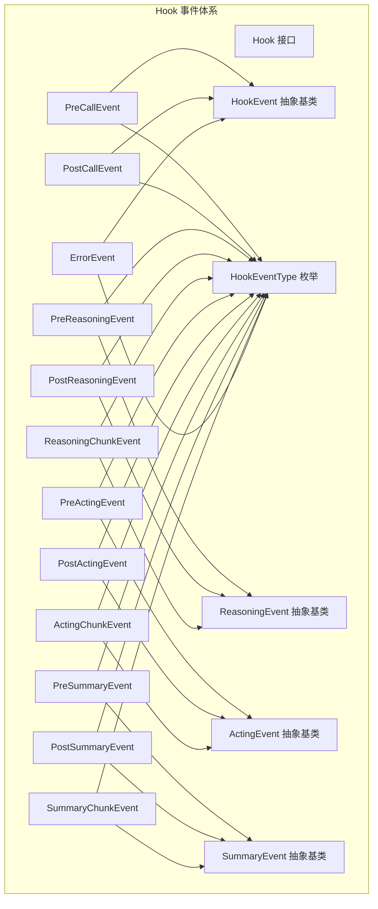
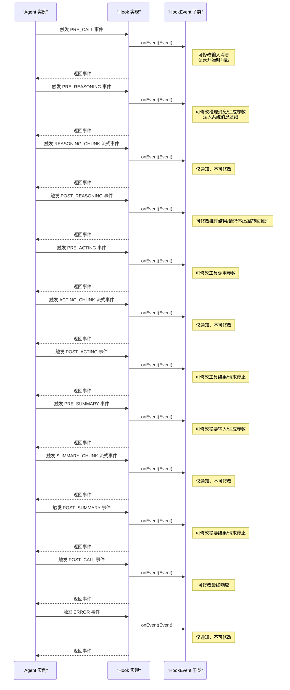
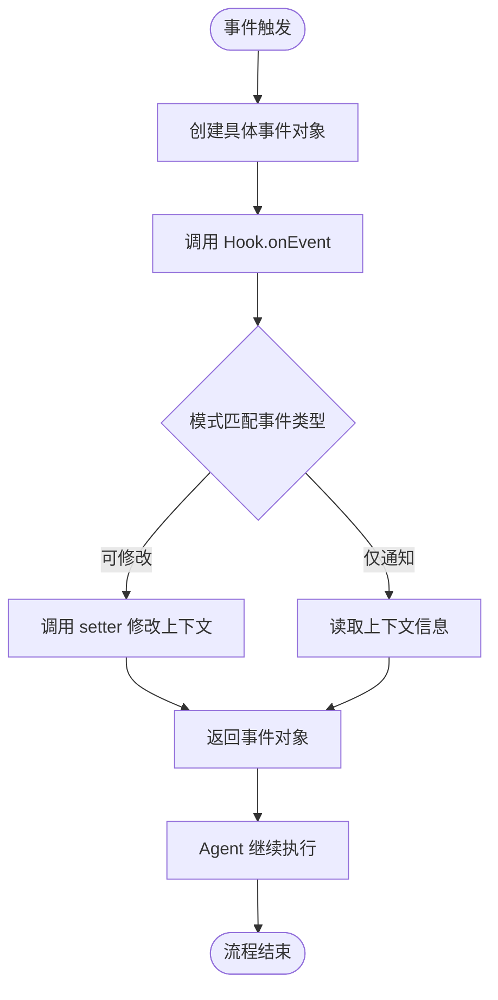
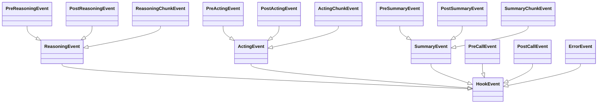

# Hook 事件系统

<cite>
**本文引用的文件**
- [HookEvent.java](file://agentscope-core/src/main/java/io/agentscope/core/hook/HookEvent.java)
- [HookEventType.java](file://agentscope-core/src/main/java/io/agentscope/core/hook/HookEventType.java)
- [Hook.java](file://agentscope-core/src/main/java/io/agentscope/core/hook/Hook.java)
- [PreCallEvent.java](file://agentscope-core/src/main/java/io/agentscope/core/hook/PreCallEvent.java)
- [PostCallEvent.java](file://agentscope-core/src/main/java/io/agentscope/core/hook/PostCallEvent.java)
- [ReasoningEvent.java](file://agentscope-core/src/main/java/io/agentscope/core/hook/ReasoningEvent.java)
- [PreReasoningEvent.java](file://agentscope-core/src/main/java/io/agentscope/core/hook/PreReasoningEvent.java)
- [PostReasoningEvent.java](file://agentscope-core/src/main/java/io/agentscope/core/hook/PostReasoningEvent.java)
- [ReasoningChunkEvent.java](file://agentscope-core/src/main/java/io/agentscope/core/hook/ReasoningChunkEvent.java)
- [ActingEvent.java](file://agentscope-core/src/main/java/io/agentscope/core/hook/ActingEvent.java)
- [PreActingEvent.java](file://agentscope-core/src/main/java/io/agentscope/core/hook/PreActingEvent.java)
- [PostActingEvent.java](file://agentscope-core/src/main/java/io/agentscope/core/hook/PostActingEvent.java)
- [ActingChunkEvent.java](file://agentscope-core/src/main/java/io/agentscope/core/hook/ActingChunkEvent.java)
- [SummaryEvent.java](file://agentscope-core/src/main/java/io/agentscope/core/hook/SummaryEvent.java)
- [PreSummaryEvent.java](file://agentscope-core/src/main/java/io/agentscope/core/hook/PreSummaryEvent.java)
- [PostSummaryEvent.java](file://agentscope-core/src/main/java/io/agentscope/core/hook/PostSummaryEvent.java)
- [SummaryChunkEvent.java](file://agentscope-core/src/main/java/io/agentscope/core/hook/SummaryChunkEvent.java)
- [ErrorEvent.java](file://agentscope-core/src/main/java/io/agentscope/core/hook/ErrorEvent.java)
</cite>

## 目录
1. [简介](#简介)
2. [项目结构](#项目结构)
3. [核心组件](#核心组件)
4. [架构总览](#架构总览)
5. [详细组件分析](#详细组件分析)
6. [依赖关系分析](#依赖关系分析)
7. [性能考量](#性能考量)
8. [故障排查指南](#故障排查指南)
9. [结论](#结论)
10. [附录](#附录)

## 简介
本文件为 Hook 事件系统的全面 API 文档，聚焦于 HookEvent 基类与所有具体事件类型的定义、事件类型枚举 HookEventType 的成员、事件的继承关系与层次结构、事件的创建与传递流程、事件在 Hook 系统中的作用与重要性，并对事件序列化与反序列化进行说明。文档同时提供事件处理流程图与时序图，帮助开发者快速理解并正确使用 Hook 事件系统。

## 项目结构
Hook 事件系统位于 agentscope-core 模块的 io.agentscope.core.hook 包中，采用“基类 + 分层抽象 + 具体事件”的设计模式，通过密封类（sealed class）确保事件类型集合的可控性与可穷尽匹配能力。事件体系围绕以下核心接口与类展开：
- Hook：统一的事件拦截与处理接口，定义优先级与工具注册机制
- HookEventType：事件类型枚举，覆盖从调用开始到结束的全链路阶段
- HookEvent：所有事件的抽象基类，提供通用上下文与系统消息管理能力
- ReasoningEvent、ActingEvent、SummaryEvent：按阶段分组的抽象事件基类
- 各具体事件类：对应不同阶段的输入、输出、流式片段与错误事件

图表来源
- [Hook.java](file://agentscope-core/src/main/java/io/agentscope/core/hook/Hook.java)
- [HookEventType.java](file://agentscope-core/src/main/java/io/agentscope/core/hook/HookEventType.java)
- [HookEvent.java](file://agentscope-core/src/main/java/io/agentscope/core/hook/HookEvent.java)
- [ReasoningEvent.java](file://agentscope-core/src/main/java/io/agentscope/core/hook/ReasoningEvent.java)
- [ActingEvent.java](file://agentscope-core/src/main/java/io/agentscope/core/hook/ActingEvent.java)
- [SummaryEvent.java](file://agentscope-core/src/main/java/io/agentscope/core/hook/SummaryEvent.java)
- [PreCallEvent.java](file://agentscope-core/src/main/java/io/agentscope/core/hook/PreCallEvent.java)
- [PostCallEvent.java](file://agentscope-core/src/main/java/io/agentscope/core/hook/PostCallEvent.java)
- [PreReasoningEvent.java](file://agentscope-core/src/main/java/io/agentscope/core/hook/PreReasoningEvent.java)
- [PostReasoningEvent.java](file://agentscope-core/src/main/java/io/agentscope/core/hook/PostReasoningEvent.java)
- [ReasoningChunkEvent.java](file://agentscope-core/src/main/java/io/agentscope/core/hook/ReasoningChunkEvent.java)
- [PreActingEvent.java](file://agentscope-core/src/main/java/io/agentscope/core/hook/PreActingEvent.java)
- [PostActingEvent.java](file://agentscope-core/src/main/java/io/agentscope/core/hook/PostActingEvent.java)
- [ActingChunkEvent.java](file://agentscope-core/src/main/java/io/agentscope/core/hook/ActingChunkEvent.java)
- [PreSummaryEvent.java](file://agentscope-core/src/main/java/io/agentscope/core/hook/PreSummaryEvent.java)
- [PostSummaryEvent.java](file://agentscope-core/src/main/java/io/agentscope/core/hook/PostSummaryEvent.java)
- [SummaryChunkEvent.java](file://agentscope-core/src/main/java/io/agentscope/core/hook/SummaryChunkEvent.java)
- [ErrorEvent.java](file://agentscope-core/src/main/java/io/agentscope/core/hook/ErrorEvent.java)

章节来源
- [HookEvent.java:29-75](file://agentscope-core/src/main/java/io/agentscope/core/hook/HookEvent.java#L29-L75)
- [HookEventType.java:27-63](file://agentscope-core/src/main/java/io/agentscope/core/hook/HookEventType.java#L27-L63)
- [Hook.java:117-186](file://agentscope-core/src/main/java/io/agentscope/core/hook/Hook.java#L117-L186)

## 核心组件
- Hook 接口
  - 统一事件入口：onEvent(T event)，使用 Java 模式匹配处理具体事件类型
  - 优先级控制：priority() 决定执行顺序（数值越小优先级越高）
  - 工具注册：tools() 返回 Hook 需要注册的工具实例列表
- HookEventType 枚举
  - 覆盖从调用开始到结束的完整生命周期：PRE_CALL、POST_CALL、PRE_REASONING、POST_REASONING、REASONING_CHUNK、PRE_ACTING、POST_ACTING、ACTING_CHUNK、PRE_SUMMARY、POST_SUMMARY、SUMMARY_CHUNK、ERROR
- HookEvent 抽象基类
  - 提供通用上下文：getAgent()、getMemory()、getType()、getTimestamp()
  - 提供系统消息管理：getSystemMessage()、setSystemMessage()、appendSystemContent(...)
  - 事件生命周期内系统消息的冻结与注入机制，保证每次推理/摘要迭代的干净基线
- 分阶段抽象类
  - ReasoningEvent：推理阶段事件的抽象基类，提供模型名与生成参数等上下文
  - ActingEvent：工具执行阶段事件的抽象基类，提供工具包与工具调用上下文
  - SummaryEvent：摘要阶段事件的抽象基类，提供迭代次数与生成参数等上下文

章节来源
- [Hook.java:117-186](file://agentscope-core/src/main/java/io/agentscope/core/hook/Hook.java#L117-L186)
- [HookEventType.java:27-63](file://agentscope-core/src/main/java/io/agentscope/core/hook/HookEventType.java#L27-L63)
- [HookEvent.java:74-75](file://agentscope-core/src/main/java/io/agentscope/core/hook/HookEvent.java#L74-L75)
- [ReasoningEvent.java](file://agentscope-core/src/main/java/io/agentscope/core/hook/ReasoningEvent.java)
- [ActingEvent.java:42-43](file://agentscope-core/src/main/java/io/agentscope/core/hook/ActingEvent.java#L42-L43)
- [SummaryEvent.java](file://agentscope-core/src/main/java/io/agentscope/core/hook/SummaryEvent.java)

## 架构总览
Hook 事件系统通过统一的 Hook 接口拦截 Agent 执行过程中的关键节点，实现非侵入式的横切关注点（如日志、鉴权、结果后处理、人类在环控制等）。事件类型由 HookEventType 枚举统一管理，事件对象由 HookEvent 及其子类承载，最终由 Hook.onEvent 进行处理与可能的修改。

图表来源
- [Hook.java:147](file://agentscope-core/src/main/java/io/agentscope/core/hook/Hook.java#L147)
- [HookEvent.java:43-66](file://agentscope-core/src/main/java/io/agentscope/core/hook/HookEvent.java#L43-L66)
- [PreCallEvent.java:25-42](file://agentscope-core/src/main/java/io/agentscope/core/hook/PreCallEvent.java#L25-L42)
- [PreReasoningEvent.java:26-45](file://agentscope-core/src/main/java/io/agentscope/core/hook/PreReasoningEvent.java#L26-L45)
- [ReasoningChunkEvent.java:24-45](file://agentscope-core/src/main/java/io/agentscope/core/hook/ReasoningChunkEvent.java#L24-L45)
- [PostReasoningEvent.java:26-49](file://agentscope-core/src/main/java/io/agentscope/core/hook/PostReasoningEvent.java#L26-L49)
- [PreActingEvent.java:24-45](file://agentscope-core/src/main/java/io/agentscope/core/hook/PreActingEvent.java#L24-L45)
- [ActingChunkEvent.java:25-47](file://agentscope-core/src/main/java/io/agentscope/core/hook/ActingChunkEvent.java#L25-L47)
- [PostActingEvent.java:25-48](file://agentscope-core/src/main/java/io/agentscope/core/hook/PostActingEvent.java#L25-L48)
- [PreSummaryEvent.java:26-47](file://agentscope-core/src/main/java/io/agentscope/core/hook/PreSummaryEvent.java#L26-L47)
- [SummaryChunkEvent.java:24-45](file://agentscope-core/src/main/java/io/agentscope/core/hook/SummaryChunkEvent.java#L24-L45)
- [PostSummaryEvent.java:24-45](file://agentscope-core/src/main/java/io/agentscope/core/hook/PostSummaryEvent.java#L24-L45)
- [PostCallEvent.java:23-40](file://agentscope-core/src/main/java/io/agentscope/core/hook/PostCallEvent.java#L23-L40)
- [ErrorEvent.java:22-39](file://agentscope-core/src/main/java/io/agentscope/core/hook/ErrorEvent.java#L22-L39)

## 详细组件分析

### HookEventType 事件类型枚举
- 成员说明
  - PRE_CALL：Agent 开始处理前触发
  - POST_CALL：Agent 完成处理后触发
  - PRE_REASONING：LLM 推理前触发
  - POST_REASONING：LLM 推理完成后触发
  - REASONING_CHUNK：推理流式输出片段触发
  - PRE_ACTING：工具执行前触发
  - POST_ACTING：工具执行完成后触发
  - ACTING_CHUNK：工具执行流式输出片段触发
  - PRE_SUMMARY：达到最大迭代次数准备生成摘要前触发
  - POST_SUMMARY：摘要生成完成后触发
  - SUMMARY_CHUNK：摘要流式输出片段触发
  - ERROR：执行过程中发生错误时触发

章节来源
- [HookEventType.java:27-63](file://agentscope-core/src/main/java/io/agentscope/core/hook/HookEventType.java#L27-L63)

### HookEvent 抽象基类
- 作用与职责
  - 提供统一的事件上下文：Agent 实例、内存访问、事件类型、时间戳
  - 提供系统消息管理：统一的 MsgRole.SYSTEM 消息，贯穿推理/摘要迭代，确保每次迭代从干净基线开始
  - 事件可修改性：是否允许修改取决于具体事件类是否提供 setter 方法
- 关键方法
  - getAgent()、getMemory()、getType()、getTimestamp()
  - getSystemMessage()、setSystemMessage()、appendSystemContent(...)
- 生命周期要点
  - 在每个 call() 开始前由 sysPrompt 种子化系统消息
  - PreCall 阶段完成后冻结基线
  - 每次 PreReasoning/PreSummary 前注入冻结基线
  - 在模型推理前将最终系统消息作为第一条消息注入输入

章节来源
- [HookEvent.java:74-75](file://agentscope-core/src/main/java/io/agentscope/core/hook/HookEvent.java#L74-L75)
- [HookEvent.java:140-204](file://agentscope-core/src/main/java/io/agentscope/core/hook/HookEvent.java#L140-L204)

### ReasoningEvent 抽象基类
- 作用与职责
  - 为推理阶段事件提供公共上下文：模型名称、生成选项
  - 支持在 PreReasoning 中覆盖生成选项，在 PostReasoning 中进行结果后处理或人类在环控制
- 关键方法
  - getModelName()、getGenerateOptions()
  - PreReasoning 中可设置自定义生成选项；PostReasoning 中支持请求停止与跳转回推理

章节来源
- [ReasoningEvent.java](file://agentscope-core/src/main/java/io/agentscope/core/hook/ReasoningEvent.java)
- [PreReasoningEvent.java:47-116](file://agentscope-core/src/main/java/io/agentscope/core/hook/PreReasoningEvent.java#L47-L116)
- [PostReasoningEvent.java:51-172](file://agentscope-core/src/main/java/io/agentscope/core/hook/PostReasoningEvent.java#L51-L172)

### ActingEvent 抽象基类
- 作用与职责
  - 为工具执行阶段事件提供公共上下文：工具包 Toolkit、工具调用 ToolUseBlock
  - 支持在 PreActing 修改工具参数、在 PostActing 修改工具结果、在 ActingChunk 获取中间流式片段
- 关键方法
  - getToolkit()、getToolUse()

章节来源
- [ActingEvent.java:42-43](file://agentscope-core/src/main/java/io/agentscope/core/hook/ActingEvent.java#L42-L43)
- [PreActingEvent.java:47-70](file://agentscope-core/src/main/java/io/agentscope/core/hook/PreActingEvent.java#L47-L70)
- [PostActingEvent.java:50-128](file://agentscope-core/src/main/java/io/agentscope/core/hook/PostActingEvent.java#L50-L128)
- [ActingChunkEvent.java:49-76](file://agentscope-core/src/main/java/io/agentscope/core/hook/ActingChunkEvent.java#L49-L76)

### SummaryEvent 抽象基类
- 作用与职责
  - 为摘要阶段事件提供公共上下文：模型名称、生成选项、最大迭代次数、当前迭代数
  - 支持在 PreSummary 修改摘要输入与生成参数，在 PostSummary 修改摘要结果或请求停止
- 关键方法
  - getMaxIterations()、getCurrentIteration()
  - PreSummary 中可设置自定义生成选项；PostSummary 中支持请求停止

章节来源
- [SummaryEvent.java](file://agentscope-core/src/main/java/io/agentscope/core/hook/SummaryEvent.java)
- [PreSummaryEvent.java:49-143](file://agentscope-core/src/main/java/io/agentscope/core/hook/PreSummaryEvent.java#L49-L143)
- [PostSummaryEvent.java:47-103](file://agentscope-core/src/main/java/io/agentscope/core/hook/PostSummaryEvent.java#L47-L103)
- [SummaryChunkEvent.java:60-106](file://agentscope-core/src/main/java/io/agentscope/core/hook/SummaryChunkEvent.java#L60-L106)

### 具体事件类概览与可修改性
- PreCallEvent：可修改输入消息
- PostCallEvent：可修改最终响应消息
- PreReasoningEvent：可修改推理输入消息与生成选项
- PostReasoningEvent：可修改推理结果，支持请求停止与跳转回推理
- ReasoningChunkEvent：仅通知，不可修改
- PreActingEvent：可修改工具调用参数
- PostActingEvent：可修改工具结果，支持请求停止
- ActingChunkEvent：仅通知，不可修改
- PreSummaryEvent：可修改摘要输入与生成选项
- PostSummaryEvent：可修改摘要结果，支持请求停止
- SummaryChunkEvent：仅通知，不可修改
- ErrorEvent：仅通知，不可修改

章节来源
- [PreCallEvent.java:25-42](file://agentscope-core/src/main/java/io/agentscope/core/hook/PreCallEvent.java#L25-L42)
- [PostCallEvent.java:23-40](file://agentscope-core/src/main/java/io/agentscope/core/hook/PostCallEvent.java#L23-L40)
- [PreReasoningEvent.java:26-45](file://agentscope-core/src/main/java/io/agentscope/core/hook/PreReasoningEvent.java#L26-L45)
- [PostReasoningEvent.java:26-49](file://agentscope-core/src/main/java/io/agentscope/core/hook/PostReasoningEvent.java#L26-L49)
- [ReasoningChunkEvent.java:24-45](file://agentscope-core/src/main/java/io/agentscope/core/hook/ReasoningChunkEvent.java#L24-L45)
- [PreActingEvent.java:24-45](file://agentscope-core/src/main/java/io/agentscope/core/hook/PreActingEvent.java#L24-L45)
- [PostActingEvent.java:25-48](file://agentscope-core/src/main/java/io/agentscope/core/hook/PostActingEvent.java#L25-L48)
- [ActingChunkEvent.java:25-47](file://agentscope-core/src/main/java/io/agentscope/core/hook/ActingChunkEvent.java#L25-L47)
- [PreSummaryEvent.java:26-47](file://agentscope-core/src/main/java/io/agentscope/core/hook/PreSummaryEvent.java#L26-L47)
- [PostSummaryEvent.java:24-45](file://agentscope-core/src/main/java/io/agentscope/core/hook/PostSummaryEvent.java#L24-L45)
- [SummaryChunkEvent.java:24-45](file://agentscope-core/src/main/java/io/agentscope/core/hook/SummaryChunkEvent.java#L24-L45)
- [ErrorEvent.java:22-39](file://agentscope-core/src/main/java/io/agentscope/core/hook/ErrorEvent.java#L22-L39)

### 事件创建、传递与处理流程
- 创建
  - 由 Agent 在执行过程中根据阶段自动构造具体事件对象（例如 PreCallEvent、PreReasoningEvent 等）
- 传递
  - 通过 Hook.onEvent 将事件传递给 Hook 实现
- 处理
  - 使用 switch 表达式进行模式匹配，针对不同事件类型执行相应逻辑
  - 对可修改事件进行必要的 setter 调用以影响后续执行
- 返回
  - Hook 返回修改后的事件对象，Agent 继续执行后续流程

图表来源
- [Hook.java:147](file://agentscope-core/src/main/java/io/agentscope/core/hook/Hook.java#L147)
- [PreCallEvent.java:55-80](file://agentscope-core/src/main/java/io/agentscope/core/hook/PreCallEvent.java#L55-L80)
- [PreReasoningEvent.java:61-116](file://agentscope-core/src/main/java/io/agentscope/core/hook/PreReasoningEvent.java#L61-L116)
- [PostReasoningEvent.java:65-172](file://agentscope-core/src/main/java/io/agentscope/core/hook/PostReasoningEvent.java#L65-L172)
- [PreActingEvent.java:57-70](file://agentscope-core/src/main/java/io/agentscope/core/hook/PreActingEvent.java#L57-L70)
- [PostActingEvent.java:64-128](file://agentscope-core/src/main/java/io/agentscope/core/hook/PostActingEvent.java#L64-L128)
- [PreSummaryEvent.java:67-143](file://agentscope-core/src/main/java/io/agentscope/core/hook/PreSummaryEvent.java#L67-L143)
- [PostSummaryEvent.java:60-103](file://agentscope-core/src/main/java/io/agentscope/core/hook/PostSummaryEvent.java#L60-L103)
- [PostCallEvent.java:53-76](file://agentscope-core/src/main/java/io/agentscope/core/hook/PostCallEvent.java#L53-L76)
- [ErrorEvent.java:52-65](file://agentscope-core/src/main/java/io/agentscope/core/hook/ErrorEvent.java#L52-L65)

### 事件序列化与反序列化
- 序列化策略
  - 事件对象通常通过 JSON 序列化用于跨进程/网络传输或持久化
  - 建议使用稳定的字段命名与可空字段处理，避免因字段缺失导致解析失败
- 反序列化策略
  - 反序列化后需校验事件类型与必要字段的完整性
  - 对可修改事件，建议在反序列化后进行一次 Hook 处理，以保持与原生流程一致的行为
- 注意事项
  - 系统消息（systemMsg）与消息块（ContentBlock）应遵循统一的序列化格式
  - 流式事件（ReasoningChunkEvent、ActingChunkEvent、SummaryChunkEvent）仅包含增量/累积片段，需在消费端进行拼接

[本节为通用指导，不直接分析具体文件，故不提供章节来源]

### Hook 系统中的作用与重要性
- 横切关注点实现
  - 日志与监控：在各阶段记录上下文与耗时
  - 安全与鉴权：在 PreActing 对工具参数进行校验与注入
  - 结果后处理：在 PostReasoning/PostActing/PostSummary 对内容进行过滤、转换或增强
  - 人类在环控制：在 PostReasoning/PostActing 请求停止或跳转回推理
- 可扩展性
  - 通过 Hook.priority 控制执行顺序，满足高优先级安全钩子先于业务逻辑执行
  - 通过 Hook.tools 注册工具，使 Hook 与 Agent 的工具生态无缝集成

章节来源
- [Hook.java:31-41](file://agentscope-core/src/main/java/io/agentscope/core/hook/Hook.java#L31-L41)
- [Hook.java:167-185](file://agentscope-core/src/main/java/io/agentscope/core/hook/Hook.java#L167-L185)
- [Hook.java:149-165](file://agentscope-core/src/main/java/io/agentscope/core/hook/Hook.java#L149-L165)

## 依赖关系分析
- 继承关系
  - HookEvent 是所有事件的抽象基类，采用密封类限制子类集合
  - ReasoningEvent、ActingEvent、SummaryEvent 分别代表推理、工具执行、摘要三类事件
  - 具体事件类均直接或间接继承上述抽象类
- 耦合度与内聚性
  - 事件类之间低耦合，通过 Hook 接口统一接入，便于扩展新的事件类型
  - 事件类内部高内聚，每个事件类仅负责自身阶段的上下文与可修改字段
- 循环依赖
  - 未发现循环依赖，事件类之间为单向继承关系

图表来源
- [HookEvent.java:74-75](file://agentscope-core/src/main/java/io/agentscope/core/hook/HookEvent.java#L74-L75)
- [ReasoningEvent.java](file://agentscope-core/src/main/java/io/agentscope/core/hook/ReasoningEvent.java)
- [ActingEvent.java:42-43](file://agentscope-core/src/main/java/io/agentscope/core/hook/ActingEvent.java#L42-L43)
- [SummaryEvent.java](file://agentscope-core/src/main/java/io/agentscope/core/hook/SummaryEvent.java)
- [PreCallEvent.java:44](file://agentscope-core/src/main/java/io/agentscope/core/hook/PreCallEvent.java#L44)
- [PostCallEvent.java:42](file://agentscope-core/src/main/java/io/agentscope/core/hook/PostCallEvent.java#L42)
- [PreReasoningEvent.java:47](file://agentscope-core/src/main/java/io/agentscope/core/hook/PreReasoningEvent.java#L47)
- [PostReasoningEvent.java:51](file://agentscope-core/src/main/java/io/agentscope/core/hook/PostReasoningEvent.java#L51)
- [ReasoningChunkEvent.java:60](file://agentscope-core/src/main/java/io/agentscope/core/hook/ReasoningChunkEvent.java#L60)
- [PreActingEvent.java:47](file://agentscope-core/src/main/java/io/agentscope/core/hook/PreActingEvent.java#L47)
- [PostActingEvent.java:50](file://agentscope-core/src/main/java/io/agentscope/core/hook/PostActingEvent.java#L50)
- [ActingChunkEvent.java:49](file://agentscope-core/src/main/java/io/agentscope/core/hook/ActingChunkEvent.java#L49)
- [PreSummaryEvent.java:49](file://agentscope-core/src/main/java/io/agentscope/core/hook/PreSummaryEvent.java#L49)
- [PostSummaryEvent.java:47](file://agentscope-core/src/main/java/io/agentscope/core/hook/PostSummaryEvent.java#L47)
- [SummaryChunkEvent.java:60](file://agentscope-core/src/main/java/io/agentscope/core/hook/SummaryChunkEvent.java#L60)
- [ErrorEvent.java:41](file://agentscope-core/src/main/java/io/agentscope/core/hook/ErrorEvent.java#L41)

## 性能考量
- 事件处理开销
  - Hook.onEvent 为同步/异步处理单元，建议避免在 Hook 中执行阻塞操作；对于复杂处理可采用异步 Mono 流式处理
- 事件数量与频率
  - 流式事件（REASONING_CHUNK、ACTING_CHUNK、SUMMARY_CHUNK）可能高频触发，Hook 中应避免重复构建大对象
- 系统消息管理
  - 频繁 appendSystemContent 会创建新消息对象，建议批量拼接后再写入，减少对象分配

[本节为通用指导，不直接分析具体文件，故不提供章节来源]

## 故障排查指南
- 系统消息注入错误
  - 现象：直接向输入消息列表注入 MsgRole.SYSTEM 消息导致非法状态异常
  - 处理：改用 HookEvent.appendSystemContent(...) 或 setSystemMessage(...) 进行系统消息管理
- 流式事件误用
  - 现象：尝试修改 ReasoningChunkEvent、ActingChunkEvent、SummaryChunkEvent 的内容
  - 处理：这些事件为只读通知事件，仅能读取增量/累积片段
- 人类在环控制
  - 现象：需要在推理或工具执行后暂停等待人工确认
  - 处理：在 PostReasoningEvent/PostActingEvent 调用 stopAgent()，并在下一次 agent.call() 恢复
- 跳转回推理
  - 现象：需要基于工具结果回退到推理阶段进行二次决策
  - 处理：在 PostReasoningEvent 调用 gotoReasoning(List<Msg>)，并确保 ToolResult 校验通过

章节来源
- [HookEvent.java:63-66](file://agentscope-core/src/main/java/io/agentscope/core/hook/HookEvent.java#L63-L66)
- [ReasoningChunkEvent.java:26](file://agentscope-core/src/main/java/io/agentscope/core/hook/ReasoningChunkEvent.java#L26)
- [ActingChunkEvent.java:27](file://agentscope-core/src/main/java/io/agentscope/core/hook/ActingChunkEvent.java#L27)
- [SummaryChunkEvent.java:26](file://agentscope-core/src/main/java/io/agentscope/core/hook/SummaryChunkEvent.java#L26)
- [PostReasoningEvent.java:99-123](file://agentscope-core/src/main/java/io/agentscope/core/hook/PostReasoningEvent.java#L99-L123)
- [PostReasoningEvent.java:150-153](file://agentscope-core/src/main/java/io/agentscope/core/hook/PostReasoningEvent.java#L150-L153)
- [PostActingEvent.java:98-109](file://agentscope-core/src/main/java/io/agentscope/core/hook/PostActingEvent.java#L98-L109)

## 结论
Hook 事件系统通过严格的密封类设计与清晰的阶段划分，提供了稳定、可扩展且易于使用的横切能力。开发者可通过 Hook 接口在不侵入 Agent 核心逻辑的前提下，实现日志、安全、结果后处理与人类在环控制等多样化需求。合理利用事件的可修改性与系统消息生命周期管理，可在保证一致性的同时提升系统的可观测性与可控性。

[本节为总结性内容，不直接分析具体文件，故不提供章节来源]

## 附录
- 事件类型与可修改性速查
  - PreCallEvent：可修改输入消息
  - PostCallEvent：可修改最终响应
  - PreReasoningEvent：可修改输入消息与生成选项
  - PostReasoningEvent：可修改推理结果，支持停止与跳转
  - ReasoningChunkEvent：仅通知
  - PreActingEvent：可修改工具调用参数
  - PostActingEvent：可修改工具结果，支持停止
  - ActingChunkEvent：仅通知
  - PreSummaryEvent：可修改摘要输入与生成选项
  - PostSummaryEvent：可修改摘要结果，支持停止
  - SummaryChunkEvent：仅通知
  - ErrorEvent：仅通知

[本节为补充信息，不直接分析具体文件，故不提供章节来源]