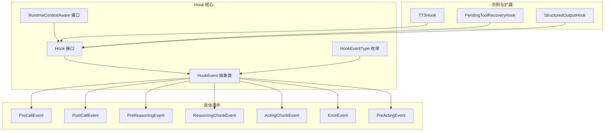
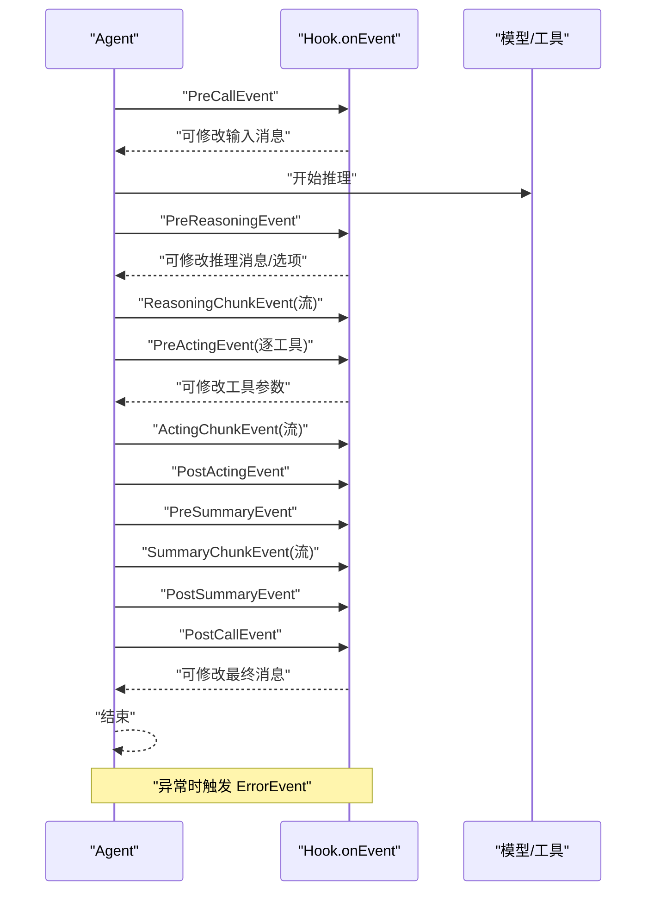
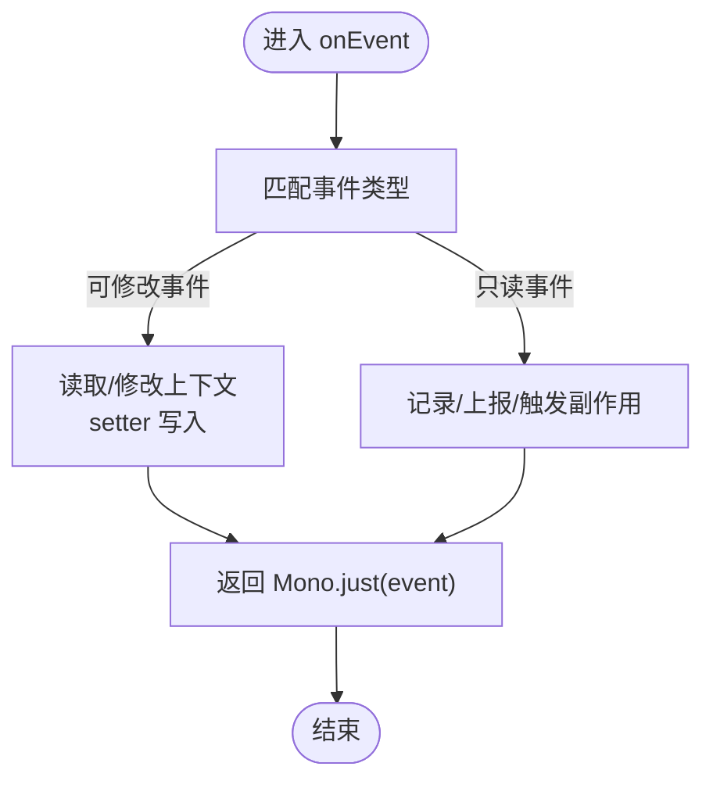
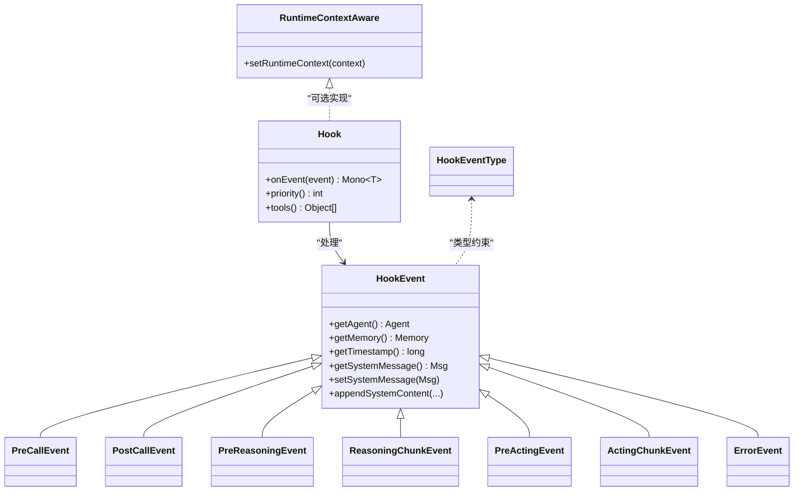

# Hook 接口

<cite>
**本文引用的文件**
- [Hook.java](file://agentscope-core/src/main/java/io/agentscope/core/hook/Hook.java)
- [HookEvent.java](file://agentscope-core/src/main/java/io/agentscope/core/hook/HookEvent.java)
- [HookEventType.java](file://agentscope-core/src/main/java/io/agentscope/core/hook/HookEventType.java)
- [RuntimeContextAware.java](file://agentscope-core/src/main/java/io/agentscope/core/hook/RuntimeContextAware.java)
- [PreCallEvent.java](file://agentscope-core/src/main/java/io/agentscope/core/hook/PreCallEvent.java)
- [PostCallEvent.java](file://agentscope-core/src/main/java/io/agentscope/core/hook/PostCallEvent.java)
- [PreReasoningEvent.java](file://agentscope-core/src/main/java/io/agentscope/core/hook/PreReasoningEvent.java)
- [ReasoningChunkEvent.java](file://agentscope-core/src/main/java/io/agentscope/core/hook/ReasoningChunkEvent.java)
- [ActingChunkEvent.java](file://agentscope-core/src/main/java/io/agentscope/core/hook/ActingChunkEvent.java)
- [ErrorEvent.java](file://agentscope-core/src/main/java/io/agentscope/core/hook/ErrorEvent.java)
- [PreActingEvent.java](file://agentscope-core/src/main/java/io/agentscope/core/hook/PreActingEvent.java)
- [TTSHook.java](file://agentscope-core/src/main/java/io/agentscope/core/hook/TTSHook.java)
- [PendingToolRecoveryHook.java](file://agentscope-core/src/main/java/io/agentscope/core/hook/PendingToolRecoveryHook.java)
- [StructuredOutputHook.java](file://agentscope-core/src/main/java/io/agentscope/core/agent/StructuredOutputHook.java)
</cite>

## 目录
1. [简介](#简介)
2. [项目结构](#项目结构)
3. [核心组件](#核心组件)
4. [架构总览](#架构总览)
5. [详细组件分析](#详细组件分析)
6. [依赖关系分析](#依赖关系分析)
7. [性能考量](#性能考量)
8. [故障排查指南](#故障排查指南)
9. [结论](#结论)
10. [附录](#附录)

## 简介
本文件为 Hook 接口的详细 API 参考与设计说明，面向希望在 Agent 执行生命周期中进行监控、拦截与增强的开发者。Hook 接口通过统一的事件模型 onEvent 拦截 Agent 的各个执行阶段，并允许对可修改事件进行参数注入与结果改写；priority 提供优先级控制以确保关键钩子（如鉴权、恢复）先于业务逻辑执行；tools 提供与 Hook 绑定的工具注册机制，便于在 Agent 构建时自动注入工具。

## 项目结构
与 Hook 接口相关的核心文件组织如下：
- 接口与事件定义：Hook、HookEvent、HookEventType、RuntimeContextAware
- 具体事件类型：PreCallEvent、PostCallEvent、PreReasoningEvent、ReasoningChunkEvent、ActingChunkEvent、ErrorEvent、PreActingEvent
- 示例与扩展 Hook：TTSHook、PendingToolRecoveryHook、StructuredOutputHook

图表来源
- [Hook.java:117-186](file://agentscope-core/src/main/java/io/agentscope/core/hook/Hook.java#L117-L186)
- [HookEvent.java:74-75](file://agentscope-core/src/main/java/io/agentscope/core/hook/HookEvent.java#L74-L75)
- [HookEventType.java:27-63](file://agentscope-core/src/main/java/io/agentscope/core/hook/HookEventType.java#L27-L63)
- [RuntimeContextAware.java:30-39](file://agentscope-core/src/main/java/io/agentscope/core/hook/RuntimeContextAware.java#L30-L39)
- [PreCallEvent.java:44-80](file://agentscope-core/src/main/java/io/agentscope/core/hook/PreCallEvent.java#L44-L80)
- [PostCallEvent.java:42-76](file://agentscope-core/src/main/java/io/agentscope/core/hook/PostCallEvent.java#L42-L76)
- [PreReasoningEvent.java:47-116](file://agentscope-core/src/main/java/io/agentscope/core/hook/PreReasoningEvent.java#L47-L116)
- [ReasoningChunkEvent.java:60-106](file://agentscope-core/src/main/java/io/agentscope/core/hook/ReasoningChunkEvent.java#L60-L106)
- [ActingChunkEvent.java:49-76](file://agentscope-core/src/main/java/io/agentscope/core/hook/ActingChunkEvent.java#L49-L76)
- [ErrorEvent.java:41-65](file://agentscope-core/src/main/java/io/agentscope/core/hook/ErrorEvent.java#L41-L65)
- [PreActingEvent.java:47-70](file://agentscope-core/src/main/java/io/agentscope/core/hook/PreActingEvent.java#L47-L70)
- [TTSHook.java:74-457](file://agentscope-core/src/main/java/io/agentscope/core/hook/TTSHook.java#L74-L457)
- [PendingToolRecoveryHook.java:58-224](file://agentscope-core/src/main/java/io/agentscope/core/hook/PendingToolRecoveryHook.java#L58-L224)
- [StructuredOutputHook.java:61-414](file://agentscope-core/src/main/java/io/agentscope/core/agent/StructuredOutputHook.java#L61-L414)

章节来源
- [Hook.java:25-116](file://agentscope-core/src/main/java/io/agentscope/core/hook/Hook.java#L25-L116)
- [HookEvent.java:29-75](file://agentscope-core/src/main/java/io/agentscope/core/hook/HookEvent.java#L29-L75)
- [HookEventType.java:18-63](file://agentscope-core/src/main/java/io/agentscope/core/hook/HookEventType.java#L18-L63)
- [RuntimeContextAware.java:20-39](file://agentscope-core/src/main/java/io/agentscope/core/hook/RuntimeContextAware.java#L20-L39)

## 核心组件
- Hook 接口
  - onEvent：统一事件入口，接收所有 Agent 执行事件，返回被可能修改后的事件对象，采用响应式 Mono 包装，支持异步与背压。
  - priority：钩子优先级（数值越小优先级越高），默认值为 100；相同优先级按注册顺序执行。
  - tools：返回与该 Hook 绑定的工具列表，默认空列表，用于在 Agent 构建时自动注册到本地 Toolkit。
- HookEvent 抽象类
  - 封印类（sealed），限定事件类型集合，便于 switch 表达式的穷举匹配。
  - 提供统一系统消息字段 systemMsg 及其读写 API，确保在推理链路中一致注入与冻结基线。
  - 提供通用上下文：Agent 实例、时间戳、内存访问等。
- HookEventType 枚举
  - 定义了从开始调用、推理、工具执行、摘要生成到错误发生的完整生命周期事件。
- RuntimeContextAware 接口
  - 可选契约，用于在每次调用期间注入或清除当前运行时上下文，便于跨 Hook/工具共享状态。

章节来源
- [Hook.java:117-186](file://agentscope-core/src/main/java/io/agentscope/core/hook/Hook.java#L117-L186)
- [HookEvent.java:74-205](file://agentscope-core/src/main/java/io/agentscope/core/hook/HookEvent.java#L74-L205)
- [HookEventType.java:27-63](file://agentscope-core/src/main/java/io/agentscope/core/hook/HookEventType.java#L27-L63)
- [RuntimeContextAware.java:30-39](file://agentscope-core/src/main/java/io/agentscope/core/hook/RuntimeContextAware.java#L30-L39)

## 架构总览
下图展示了 Hook 在 Agent 执行中的位置与交互关系：Agent 调用时触发 PreCallEvent → 推理前 PreReasoningEvent → 推理流 ReasoningChunkEvent → 工具调用 PreActingEvent → 工具流 ActingChunkEvent → 结果后 PostActingEvent → 汇总前 PreSummaryEvent → 汇总流 SummaryChunkEvent → 汇总后 PostSummaryEvent → 结束 PostCallEvent；期间任何阶段发生异常会触发 ErrorEvent。

图表来源
- [Hook.java:147](file://agentscope-core/src/main/java/io/agentscope/core/hook/Hook.java#L147)
- [PreCallEvent.java:44](file://agentscope-core/src/main/java/io/agentscope/core/hook/PreCallEvent.java#L44)
- [PreReasoningEvent.java:47](file://agentscope-core/src/main/java/io/agentscope/core/hook/PreReasoningEvent.java#L47)
- [ReasoningChunkEvent.java:60](file://agentscope-core/src/main/java/io/agentscope/core/hook/ReasoningChunkEvent.java#L60)
- [PreActingEvent.java:47](file://agentscope-core/src/main/java/io/agentscope/core/hook/PreActingEvent.java#L47)
- [ActingChunkEvent.java:49](file://agentscope-core/src/main/java/io/agentscope/core/hook/ActingChunkEvent.java#L49)
- [ErrorEvent.java:41](file://agentscope-core/src/main/java/io/agentscope/core/hook/ErrorEvent.java#L41)
- [PostCallEvent.java:42](file://agentscope-core/src/main/java/io/agentscope/core/hook/PostCallEvent.java#L42)

## 详细组件分析

### Hook 接口详解
- 设计理念
  - 单一入口 onEvent：集中处理所有 Agent 事件，避免分散监听点，提升一致性与可维护性。
  - 事件可修改性：通过是否存在 setter 判定事件是否可修改，从而区分通知型与可改写型事件。
  - 统一系统消息：通过 HookEvent 的 systemMsg 字段在推理链路中冻结并注入，保证钩子对系统提示的可控修改。
- 核心方法
  - onEvent(T event)：模式匹配处理具体事件类型，返回 Mono<T> 以支持异步与背压。
  - priority()：默认 100，数值越小优先级越高；同优先级按注册顺序执行。
  - tools()：默认空列表，返回 AgentTool 实例或声明 @Tool 方法的对象，构建时由框架复制并注册到 Agent 本地 Toolkit。
- 最佳实践
  - 优先级规划：将安全/鉴权/恢复类钩子置于较低数值（如 10-50），预处理钩子 51-100，业务钩子 101-500，日志/指标 501-1000。
  - 事件选择：仅在具备 setter 的事件上进行修改；只读事件用于记录与上报。
  - 异常处理：在 onEvent 中捕获并包装异常，必要时转换为 ErrorEvent 上报。
  - 资源管理：在停止或清理时释放外部资源（如播放器、WebSocket）。

章节来源
- [Hook.java:25-116](file://agentscope-core/src/main/java/io/agentscope/core/hook/Hook.java#L25-L116)
- [Hook.java:147-186](file://agentscope-core/src/main/java/io/agentscope/core/hook/Hook.java#L147-L186)

### HookEvent 抽象类与系统消息生命周期
- 系统消息冻结与注入
  - 预调用阶段冻结基线系统消息，随后在每次推理/摘要前注入新鲜副本，避免跨轮次累积。
  - 仅允许通过 setSystemMessage 或 appendSystemContent 进行修改，禁止直接向 inputMessages 注入 SYSTEM 角色消息。
- 常用上下文
  - 获取 Agent、Memory、时间戳；统一的 systemMsg 读写 API。
- 使用建议
  - 子钩子在迭代中追加内容时使用 appendSystemContent，确保不会跨轮次累积。
  - 对 systemMsg 的修改应集中在 PreCallEvent 与 PreReasoningEvent 早期阶段。

章节来源
- [HookEvent.java:29-75](file://agentscope-core/src/main/java/io/agentscope/core/hook/HookEvent.java#L29-L75)
- [HookEvent.java:140-204](file://agentscope-core/src/main/java/io/agentscope/core/hook/HookEvent.java#L140-L204)

### 事件类型与职责边界
- 开始与结束
  - PreCallEvent：可修改输入消息，适合初始化资源、过滤输入、埋点统计。
  - PostCallEvent：可修改最终消息，适合输出后处理、格式化、脱敏。
- 推理阶段
  - PreReasoningEvent：可修改推理消息与生成选项，适合注入提示词、动态上下文、强制工具选择。
  - ReasoningChunkEvent：流式增量内容，适合实时显示与进度监控。
- 工具阶段
  - PreActingEvent：可修改单个工具调用参数，适合鉴权、参数校验、上下文注入。
  - ActingChunkEvent：工具执行流，适合进度展示与长任务监控。
- 摘要与错误
  - Pre/Post SummaryEvent 与 SummaryChunkEvent：摘要生成前后与流式事件。
  - ErrorEvent：异常通知，适合日志、告警与指标采集。

章节来源
- [PreCallEvent.java:24-80](file://agentscope-core/src/main/java/io/agentscope/core/hook/PreCallEvent.java#L24-L80)
- [PostCallEvent.java:22-76](file://agentscope-core/src/main/java/io/agentscope/core/hook/PostCallEvent.java#L22-L76)
- [PreReasoningEvent.java:25-116](file://agentscope-core/src/main/java/io/agentscope/core/hook/PreReasoningEvent.java#L25-L116)
- [ReasoningChunkEvent.java:23-106](file://agentscope-core/src/main/java/io/agentscope/core/hook/ReasoningChunkEvent.java#L23-L106)
- [PreActingEvent.java:23-70](file://agentscope-core/src/main/java/io/agentscope/core/hook/PreActingEvent.java#L23-L70)
- [ActingChunkEvent.java:24-76](file://agentscope-core/src/main/java/io/agentscope/core/hook/ActingChunkEvent.java#L24-L76)
- [ErrorEvent.java:21-65](file://agentscope-core/src/main/java/io/agentscope/core/hook/ErrorEvent.java#L21-L65)

### onEvent 方法实现要求与事件处理机制
- 实现要点
  - 使用 switch 表达式匹配事件类型，针对不同事件做相应处理。
  - 对可修改事件：通过 setter 修改上下文，变更将影响后续执行。
  - 对只读事件：仅用于记录、上报或触发副作用（如播放音频）。
  - 返回 Mono.just(event) 保持事件链路畅通；若需中断或替换，结合事件提供的控制方法（如 stopAgent、gotoReasoning）。
- 处理流程示意

图表来源
- [Hook.java:147](file://agentscope-core/src/main/java/io/agentscope/core/hook/Hook.java#L147)
- [PreCallEvent.java:77](file://agentscope-core/src/main/java/io/agentscope/core/hook/PreCallEvent.java#L77)
- [PreReasoningEvent.java:113](file://agentscope-core/src/main/java/io/agentscope/core/hook/PreReasoningEvent.java#L113)
- [PreActingEvent.java:67](file://agentscope-core/src/main/java/io/agentscope/core/hook/PreActingEvent.java#L67)
- [PostCallEvent.java:73](file://agentscope-core/src/main/java/io/agentscope/core/hook/PostCallEvent.java#L73)

章节来源
- [Hook.java:120-146](file://agentscope-core/src/main/java/io/agentscope/core/hook/Hook.java#L120-L146)

### priority 方法：优先级设置与执行顺序
- 默认优先级：100；数值越小优先级越高。
- 同优先级：按注册顺序执行。
- 建议分层
  - 0-50：关键系统钩子（鉴权、安全）
  - 51-100：高优先级（校验、预处理）
  - 101-500：普通业务钩子
  - 501-1000：低优先级（日志、指标）
- 示例参考
  - PendingToolRecoveryHook 设置为 10，确保在其他钩子之前修复悬挂工具调用。

章节来源
- [Hook.java:167-185](file://agentscope-core/src/main/java/io/agentscope/core/hook/Hook.java#L167-L185)
- [PendingToolRecoveryHook.java:73-76](file://agentscope-core/src/main/java/io/agentscope/core/hook/PendingToolRecoveryHook.java#L73-L76)
- [StructuredOutputHook.java:410-413](file://agentscope-core/src/main/java/io/agentscope/core/agent/StructuredOutputHook.java#L410-L413)

### tools 方法：工具注册机制
- 作用：返回与 Hook 绑定的工具实例列表，构建 Agent 时由框架复制 Builder 的 Toolkit 并逐一注册。
- 返回值：AgentTool 实例或声明 @Tool 方法的对象；默认空列表。
- 注意事项：返回 null 视为空列表；返回不可变列表时需确保可被框架复制。
- 使用场景：将钩子所需的工具（如语音合成、RAG、技能工具）随钩子自动注入到 Agent 本地环境。

章节来源
- [Hook.java:149-165](file://agentscope-core/src/main/java/io/agentscope/core/hook/Hook.java#L149-L165)

### Hook 生命周期管理与错误处理策略
- 生命周期管理
  - 钩子在 Agent 构建时注册，在每次调用开始前注入 RuntimeContext（若实现 RuntimeContextAware），调用结束后清除。
  - 钩子负责自身资源的启动与停止（如播放器、WebSocket），避免阻塞主线程。
- 错误处理
  - 在 onEvent 中捕获异常并转换为 ErrorEvent 上报。
  - 对只读事件（如 ErrorEvent）仅记录与上报，不尝试修改。
  - 对可修改事件（如 PreCallEvent/PreReasoningEvent）可在必要时进行补偿或回退。
- 示例参考
  - TTSHook 在实时模式下中断播放与关闭会话，确保新推理开始时的干净状态。
  - PendingToolRecoveryHook 在 PreCallEvent 时检测并补全悬挂工具调用，避免后续执行失败。

章节来源
- [RuntimeContextAware.java:30-39](file://agentscope-core/src/main/java/io/agentscope/core/hook/RuntimeContextAware.java#L30-L39)
- [TTSHook.java:254-274](file://agentscope-core/src/main/java/io/agentscope/core/hook/TTSHook.java#L254-L274)
- [PendingToolRecoveryHook.java:84-124](file://agentscope-core/src/main/java/io/agentscope/core/hook/PendingToolRecoveryHook.java#L84-L124)

### 典型实现与最佳实践
- 日志与指标
  - 在 PreCallEvent/PostCallEvent 记录调用耗时与输入输出大小；在 ReasoningChunkEvent/ActingChunkEvent 记录流式进度。
- 安全与鉴权
  - 在 PreActingEvent 校验工具参数与权限，必要时修改 ToolUseBlock。
- 结构化输出
  - 使用 StructuredOutputHook 强制模型调用 generate_response 工具，并在完成后压缩中间消息。
- 实时语音
  - 使用 TTSHook 在 ReasoningChunkEvent 流中实时合成语音，支持本地播放与服务器回调两种模式。

章节来源
- [StructuredOutputHook.java:61-414](file://agentscope-core/src/main/java/io/agentscope/core/agent/StructuredOutputHook.java#L61-L414)
- [TTSHook.java:74-457](file://agentscope-core/src/main/java/io/agentscope/core/hook/TTSHook.java#L74-L457)

## 依赖关系分析
- 组件耦合
  - Hook 依赖 HookEvent 与 HookEventType；具体事件继承 HookEvent 并受 HookEventType 约束。
  - RuntimeContextAware 为可选依赖，用于跨钩子共享运行时上下文。
  - 示例 Hook（TTSHook、PendingToolRecoveryHook、StructuredOutputHook）均实现 Hook 接口并按需扩展功能。
- 外部依赖
  - Reactor Mono 用于响应式事件传递与背压。
  - 工具与模型接口（如 Toolkit、DashScopeRealtimeTTSModel）在示例中体现。

图表来源
- [Hook.java:117-186](file://agentscope-core/src/main/java/io/agentscope/core/hook/Hook.java#L117-L186)
- [HookEvent.java:74-205](file://agentscope-core/src/main/java/io/agentscope/core/hook/HookEvent.java#L74-L205)
- [HookEventType.java:27-63](file://agentscope-core/src/main/java/io/agentscope/core/hook/HookEventType.java#L27-L63)
- [RuntimeContextAware.java:30-39](file://agentscope-core/src/main/java/io/agentscope/core/hook/RuntimeContextAware.java#L30-L39)
- [PreCallEvent.java:44-80](file://agentscope-core/src/main/java/io/agentscope/core/hook/PreCallEvent.java#L44-L80)
- [PostCallEvent.java:42-76](file://agentscope-core/src/main/java/io/agentscope/core/hook/PostCallEvent.java#L42-L76)
- [PreReasoningEvent.java:47-116](file://agentscope-core/src/main/java/io/agentscope/core/hook/PreReasoningEvent.java#L47-L116)
- [ReasoningChunkEvent.java:60-106](file://agentscope-core/src/main/java/io/agentscope/core/hook/ReasoningChunkEvent.java#L60-L106)
- [PreActingEvent.java:47-70](file://agentscope-core/src/main/java/io/agentscope/core/hook/PreActingEvent.java#L47-L70)
- [ActingChunkEvent.java:49-76](file://agentscope-core/src/main/java/io/agentscope/core/hook/ActingChunkEvent.java#L49-L76)
- [ErrorEvent.java:41-65](file://agentscope-core/src/main/java/io/agentscope/core/hook/ErrorEvent.java#L41-L65)

## 性能考量
- 异步与背压：onEvent 返回 Mono，建议在钩子内部使用响应式操作符进行背压控制与线程切换，避免阻塞 Agent 主线程。
- 事件粒度：合理拆分钩子，避免单个钩子处理过多事件类型导致逻辑复杂与性能下降。
- 资源复用：对于外部服务（如 TTS、RAG），在钩子内缓存连接与会话，减少频繁创建销毁带来的开销。
- 优先级与顺序：将高频但轻量的钩子置于较高优先级，确保关键路径不受阻塞。

## 故障排查指南
- 系统消息注入异常
  - 症状：向 inputMessages 直接添加 SYSTEM 角色消息导致非法状态异常。
  - 处理：改用 HookEvent 的 appendSystemContent 或 setSystemMessage。
- 钩子未生效
  - 症状：期望的修改未影响后续执行。
  - 处理：确认事件类型具备 setter；检查 priority 是否过低被其他钩子覆盖；核对注册顺序。
- 资源泄漏
  - 症状：播放器或 WebSocket 未正确关闭。
  - 处理：在钩子停止或异常时调用 stop/close，并确保 audioSink 完成发射。
- 悬挂工具调用
  - 症状：工具执行失败后 Agent 无法继续。
  - 处理：启用 PendingToolRecoveryHook 或在 PreCallEvent 自行补全工具结果。

章节来源
- [HookEvent.java:162-204](file://agentscope-core/src/main/java/io/agentscope/core/hook/HookEvent.java#L162-L204)
- [TTSHook.java:312-327](file://agentscope-core/src/main/java/io/agentscope/core/hook/TTSHook.java#L312-L327)
- [PendingToolRecoveryHook.java:84-124](file://agentscope-core/src/main/java/io/agentscope/core/hook/PendingToolRecoveryHook.java#L84-L124)

## 结论
Hook 接口通过统一事件模型与可配置优先级，提供了对 Agent 执行生命周期的细粒度控制。配合 tools 机制与 RuntimeContextAware，开发者可以在不侵入核心逻辑的前提下实现安全、可观测、可扩展的 Agent 能力增强。遵循本文的实现规范与最佳实践，可显著提升系统的稳定性与可维护性。

## 附录
- 事件类型速查
  - PRE_CALL：开始调用，可修改输入消息。
  - PRE_REASONING：推理前，可修改消息与生成选项。
  - REASONING_CHUNK：推理流，增量内容。
  - PRE_ACTING：工具调用前，可修改工具参数。
  - ACTING_CHUNK：工具流，中间结果。
  - POST_ACTING：工具调用后。
  - PRE_SUMMARY / SUMMARY_CHUNK / POST_SUMMARY：摘要前后与流。
  - POST_CALL：结束，可修改最终消息。
  - ERROR：异常通知。
- 优先级建议
  - 0-50：安全/鉴权
  - 51-100：校验/预处理
  - 101-500：业务逻辑
  - 501-1000：日志/指标