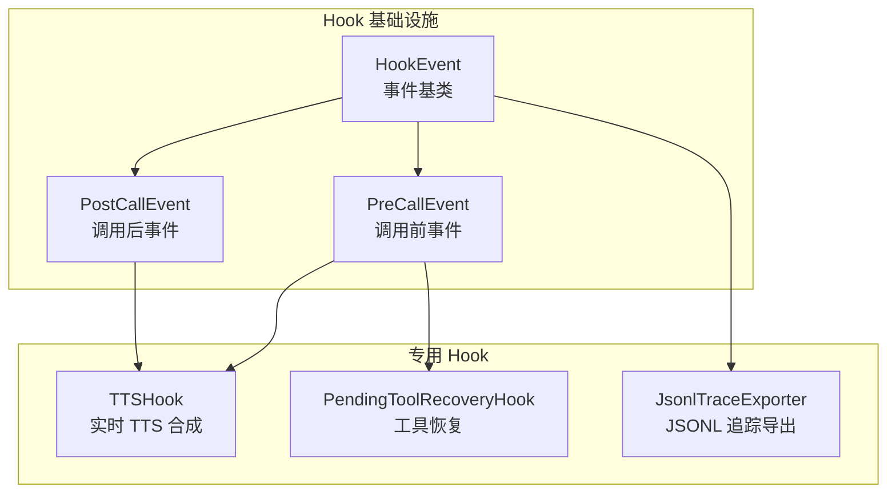
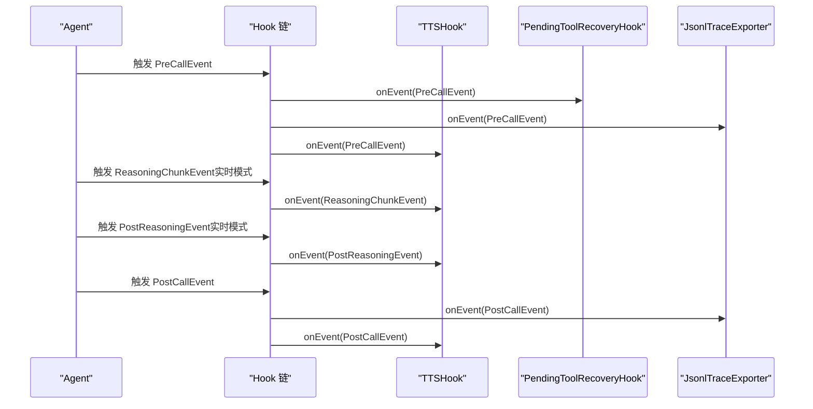
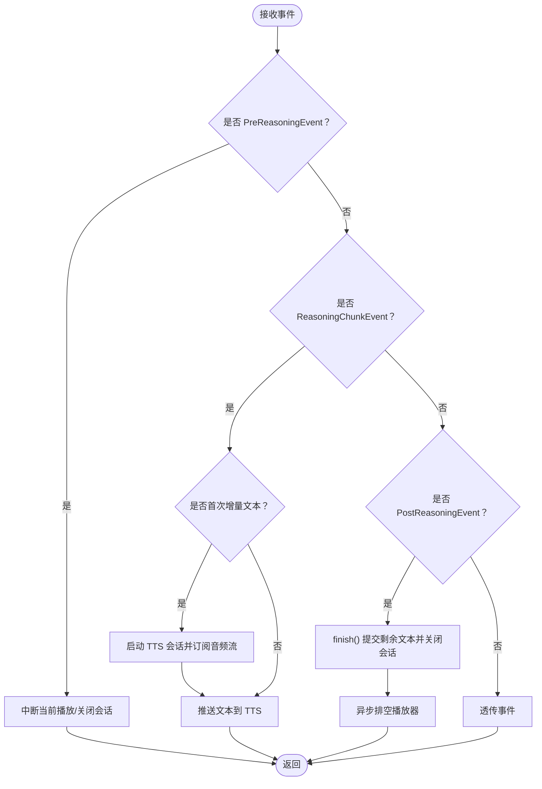
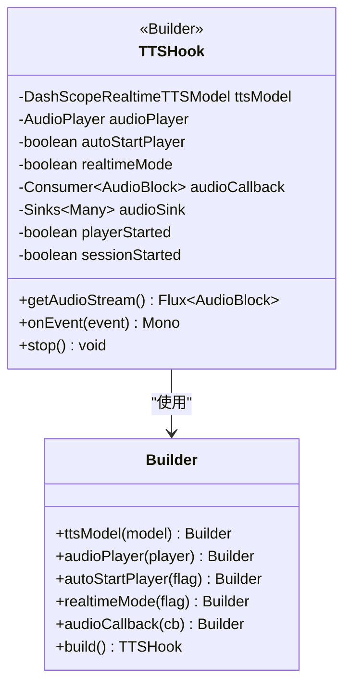
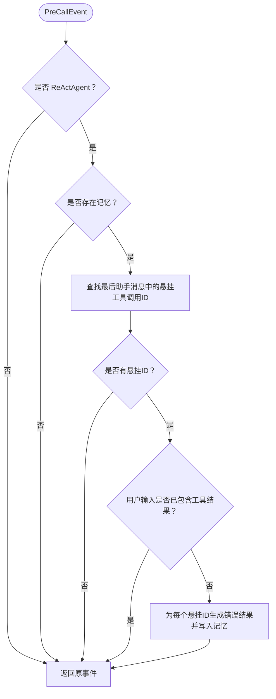
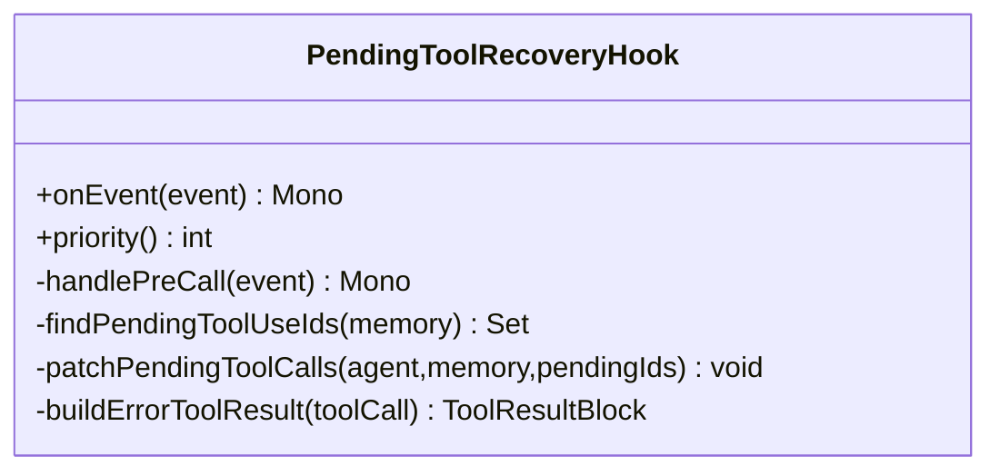
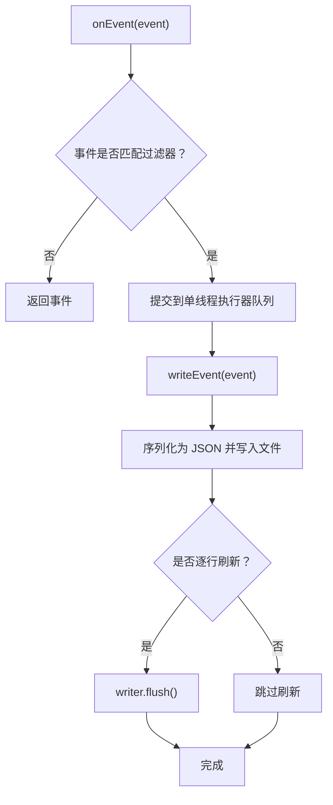
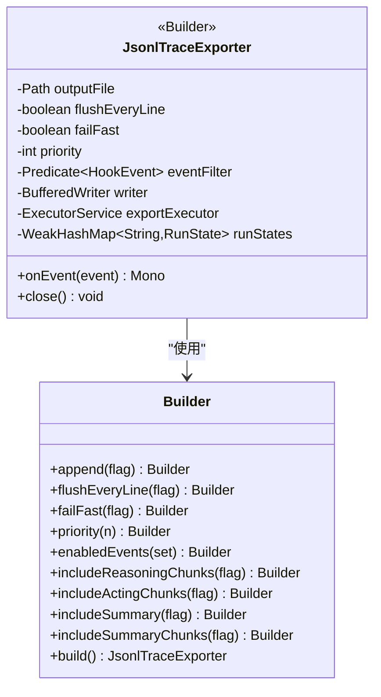
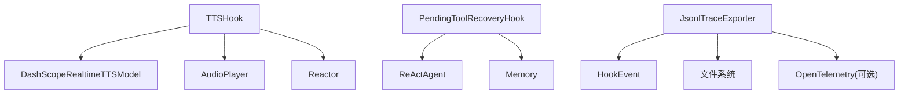

# 专用 Hook 实现

<cite>
**本文引用的文件**
- [TTSHook.java](file://agentscope-core/src/main/java/io/agentscope/core/hook/TTSHook.java)
- [PendingToolRecoveryHook.java](file://agentscope-core/src/main/java/io/agentscope/core/hook/PendingToolRecoveryHook.java)
- [JsonlTraceExporter.java](file://agentscope-core/src/main/java/io/agentscope/core/hook/recorder/JsonlTraceExporter.java)
- [HookEvent.java](file://agentscope-core/src/main/java/io/agentscope/core/hook/HookEvent.java)
- [PreCallEvent.java](file://agentscope-core/src/main/java/io/agentscope/core/hook/PreCallEvent.java)
- [PostCallEvent.java](file://agentscope-core/src/main/java/io/agentscope/core/hook/PostCallEvent.java)
- [TTSHookTest.java](file://agentscope-core/src/test/java/io/agentscope/core/hook/TTSHookTest.java)
- [JsonlTraceExporterTest.java](file://agentscope-core/src/test/java/io/agentscope/core/hook/recorder/JsonlTraceExporterTest.java)
- [tts.md](file://docs/en/task/tts.md)
- [ReActAgent.java](file://agentscope-core/src/main/java/io/agentscope/core/ReActAgent.java)
</cite>

## 目录
1. [简介](#简介)
2. [项目结构](#项目结构)
3. [核心组件](#核心组件)
4. [架构总览](#架构总览)
5. [详细组件分析](#详细组件分析)
6. [依赖分析](#依赖分析)
7. [性能考虑](#性能考虑)
8. [故障排查指南](#故障排查指南)
9. [结论](#结论)
10. [附录](#附录)

## 简介
本文件面向“专用 Hook 实现”的 API 文档与实践指南，聚焦以下三类内置 Hook 的设计、配置与使用：
- TTSHook：实时语音合成 Hook，支持“边生成边播放”的 TTS 流式合成与分发。
- PendingToolRecoveryHook：工具调用恢复 Hook，自动修复悬挂的工具调用状态，避免异常中断。
- JsonlTraceExporter：日志记录 Hook，基于 Hook 事件系统输出 JSONL 格式的可观测性追踪。

文档将从架构、数据流、处理逻辑、配置参数、扩展与自定义、集成示例与最佳实践等维度进行系统化阐述，并提供可视化图示帮助理解。

## 项目结构
与专用 Hook 相关的核心文件组织如下：
- hook 包：定义通用 Hook 接口与事件基类，以及 TTSHook、PendingToolRecoveryHook。
- hook/recorder 包：实现 JsonlTraceExporter，用于事件级日志导出。
- 测试：TTSHookTest、JsonlTraceExporterTest 提供行为验证与使用示例。
- 文档：tts.md 对 TTSHook 的工作原理进行说明。

图表来源
- [HookEvent.java:74-206](file://agentscope-core/src/main/java/io/agentscope/core/hook/HookEvent.java#L74-L206)
- [PreCallEvent.java:44-81](file://agentscope-core/src/main/java/io/agentscope/core/hook/PreCallEvent.java#L44-L81)
- [PostCallEvent.java:42-77](file://agentscope-core/src/main/java/io/agentscope/core/hook/PostCallEvent.java#L42-L77)
- [TTSHook.java:74-458](file://agentscope-core/src/main/java/io/agentscope/core/hook/TTSHook.java#L74-L458)
- [PendingToolRecoveryHook.java:58-225](file://agentscope-core/src/main/java/io/agentscope/core/hook/PendingToolRecoveryHook.java#L58-L225)
- [JsonlTraceExporter.java:82-544](file://agentscope-core/src/main/java/io/agentscope/core/hook/recorder/JsonlTraceExporter.java#L82-L544)

章节来源
- [TTSHook.java:30-73](file://agentscope-core/src/main/java/io/agentscope/core/hook/TTSHook.java#L30-L73)
- [PendingToolRecoveryHook.java:34-57](file://agentscope-core/src/main/java/io/agentscope/core/hook/PendingToolRecoveryHook.java#L34-L57)
- [JsonlTraceExporter.java:67-82](file://agentscope-core/src/main/java/io/agentscope/core/hook/recorder/JsonlTraceExporter.java#L67-L82)

## 核心组件
本节对三个专用 Hook 的职责、关键配置与典型使用场景进行概览说明。

- TTSHook（实时语音合成）
  - 职责：在推理过程中监听增量文本块，通过实时 TTS 模型进行语音合成，并将音频以三种方式分发：本地播放、回调函数、响应式流。
  - 关键模式：实时模式与批处理模式；会话生命周期管理；播放中断与清理。
  - 典型场景：CLI/桌面端本地播放、Web/SSE/WS 推送音频流、前端实时播放控制。

- PendingToolRecoveryHook（工具恢复）
  - 职责：在调用前检测悬挂的工具调用（无对应结果），自动注入错误结果消息，防止后续流程因状态不一致而抛出非法状态异常。
  - 关键模式：高优先级执行、仅对 ReActAgent 生效、仅当用户未提供结果时补丁。
  - 典型场景：工具执行失败或中断后的自动恢复、人机协同（HITL）流程中的人工介入。

- JsonlTraceExporter（日志导出）
  - 职责：将 Hook 事件序列化为 JSONL 行，便于本地调试、离线排障与问题归档。
  - 关键模式：单线程队列保证顺序一致性；可选 OpenTelemetry ID 注入；可配置事件过滤与刷新策略。
  - 典型场景：开发调试、生产问题回溯、合规审计。

章节来源
- [TTSHook.java:74-126](file://agentscope-core/src/main/java/io/agentscope/core/hook/TTSHook.java#L74-L126)
- [PendingToolRecoveryHook.java:58-76](file://agentscope-core/src/main/java/io/agentscope/core/hook/PendingToolRecoveryHook.java#L58-L76)
- [JsonlTraceExporter.java:82-127](file://agentscope-core/src/main/java/io/agentscope/core/hook/recorder/JsonlTraceExporter.java#L82-L127)

## 架构总览
下图展示了专用 Hook 在 Agent 执行生命周期中的位置与交互关系，以及事件驱动的数据流。

图表来源
- [PreCallEvent.java:44-81](file://agentscope-core/src/main/java/io/agentscope/core/hook/PreCallEvent.java#L44-L81)
- [PostCallEvent.java:42-77](file://agentscope-core/src/main/java/io/agentscope/core/hook/PostCallEvent.java#L42-L77)
- [TTSHook.java:119-171](file://agentscope-core/src/main/java/io/agentscope/core/hook/TTSHook.java#L119-L171)
- [PendingToolRecoveryHook.java:62-70](file://agentscope-core/src/main/java/io/agentscope/core/hook/PendingToolRecoveryHook.java#L62-L70)
- [JsonlTraceExporter.java:129-148](file://agentscope-core/src/main/java/io/agentscope/core/hook/recorder/JsonlTraceExporter.java#L129-L148)

## 详细组件分析

### TTSHook（实时语音合成）
- 设计要点
  - 支持两种模式：实时模式（边推理边合成）、批处理模式（推理完成后再合成）。
  - 会话生命周期：首次增量文本触发会话启动与音频流订阅；推理结束触发 finish 并异步排空播放器。
  - 多路分发：本地播放器、回调函数、响应式流（SSE/WS）。
  - 中断策略：新推理开始时中断本地播放并关闭 TTS 会话，但保留前端音频流 Sink 以便前端自行控制。

- 关键配置参数（Builder）
  - ttsModel：必需，实时 TTS 模型实例。
  - audioPlayer：可选，本地播放器；若未设置且未设置回调，则自动创建默认播放器。
  - autoStartPlayer：是否自动启动播放器，默认开启。
  - realtimeMode：是否启用实时模式，默认开启。
  - audioCallback：音频回调，适合服务端推送。

- 使用场景
  - 本地 CLI/桌面：直接使用本地播放器。
  - Web/SSE：通过回调或响应式流将音频块推送到前端。
  - 开发调试：获取响应式音频流进行自定义处理。

- 事件处理流程（实时模式）

图表来源
- [TTSHook.java:128-171](file://agentscope-core/src/main/java/io/agentscope/core/hook/TTSHook.java#L128-L171)
- [TTSHook.java:173-197](file://agentscope-core/src/main/java/io/agentscope/core/hook/TTSHook.java#L173-L197)
- [TTSHook.java:254-274](file://agentscope-core/src/main/java/io/agentscope/core/hook/TTSHook.java#L254-L274)
- [TTSHook.java:283-289](file://agentscope-core/src/main/java/io/agentscope/core/hook/TTSHook.java#L283-L289)

- 类关系与方法概览

图表来源
- [TTSHook.java:74-98](file://agentscope-core/src/main/java/io/agentscope/core/hook/TTSHook.java#L74-L98)
- [TTSHook.java:341-456](file://agentscope-core/src/main/java/io/agentscope/core/hook/TTSHook.java#L341-L456)

- 集成示例与最佳实践
  - 本地播放：通过 Builder 设置 audioPlayer，或在未设置回调时自动创建默认播放器。
  - 服务端推送：通过 audioCallback 或 getAudioStream 将音频块发送至 SSE/WS。
  - 注意事项：实时模式下建议配合合理的背压策略与前端播放控制；批处理模式适合一次性合成与缓存。

章节来源
- [TTSHook.java:30-73](file://agentscope-core/src/main/java/io/agentscope/core/hook/TTSHook.java#L30-L73)
- [TTSHook.java:119-171](file://agentscope-core/src/main/java/io/agentscope/core/hook/TTSHook.java#L119-L171)
- [TTSHook.java:173-197](file://agentscope-core/src/main/java/io/agentscope/core/hook/TTSHook.java#L173-L197)
- [TTSHook.java:202-226](file://agentscope-core/src/main/java/io/agentscope/core/hook/TTSHook.java#L202-L226)
- [TTSHook.java:254-274](file://agentscope-core/src/main/java/io/agentscope/core/hook/TTSHook.java#L254-L274)
- [TTSHook.java:283-307](file://agentscope-core/src/main/java/io/agentscope/core/hook/TTSHook.java#L283-L307)
- [TTSHook.java:312-327](file://agentscope-core/src/main/java/io/agentscope/core/hook/TTSHook.java#L312-L327)
- [TTSHookTest.java:66-96](file://agentscope-core/src/test/java/io/agentscope/core/hook/TTSHookTest.java#L66-L96)
- [tts.md:27-37](file://docs/en/task/tts.md#L27-L37)

### PendingToolRecoveryHook（工具恢复）
- 设计要点
  - 仅在 ReActAgent 上生效，优先级较高，确保在其他依赖内存状态的 Hook 之前运行。
  - 在 PreCallEvent 时扫描记忆中的最后一条助手消息，识别尚未有对应结果的工具调用 ID。
  - 若用户输入不含工具结果，则自动注入错误结果消息，避免后续流程抛出非法状态异常。

- 关键配置与行为
  - 默认注册于 ReActAgent.Builder，可通过 enablePendingToolRecovery 控制开关。
  - 仅在存在悬挂工具调用且用户未提供结果时才进行补丁。

- 事件处理流程

图表来源
- [PendingToolRecoveryHook.java:62-70](file://agentscope-core/src/main/java/io/agentscope/core/hook/PendingToolRecoveryHook.java#L62-L70)
- [PendingToolRecoveryHook.java:84-124](file://agentscope-core/src/main/java/io/agentscope/core/hook/PendingToolRecoveryHook.java#L84-L124)
- [PendingToolRecoveryHook.java:133-161](file://agentscope-core/src/main/java/io/agentscope/core/hook/PendingToolRecoveryHook.java#L133-L161)
- [PendingToolRecoveryHook.java:171-203](file://agentscope-core/src/main/java/io/agentscope/core/hook/PendingToolRecoveryHook.java#L171-L203)

- 类关系与方法概览

图表来源
- [PendingToolRecoveryHook.java:58-225](file://agentscope-core/src/main/java/io/agentscope/core/hook/PendingToolRecoveryHook.java#L58-L225)

- 集成示例与最佳实践
  - 默认启用：ReActAgent.Builder 默认注册该 Hook，适合大多数自动化流程。
  - 自定义策略：如需人工介入或特殊错误处理，可在构建器中禁用并自行实现恢复逻辑。
  - 与 ReActAgent 的协作：若禁用自动恢复且仍存在悬挂工具调用，将在后续流程中抛出非法状态异常。

章节来源
- [PendingToolRecoveryHook.java:34-57](file://agentscope-core/src/main/java/io/agentscope/core/hook/PendingToolRecoveryHook.java#L34-L57)
- [PendingToolRecoveryHook.java:62-76](file://agentscope-core/src/main/java/io/agentscope/core/hook/PendingToolRecoveryHook.java#L62-L76)
- [PendingToolRecoveryHook.java:84-124](file://agentscope-core/src/main/java/io/agentscope/core/hook/PendingToolRecoveryHook.java#L84-L124)
- [ReActAgent.java:1368-1386](file://agentscope-core/src/main/java/io/agentscope/core/ReActAgent.java#L1368-L1386)

### JsonlTraceExporter（JSONL 追踪导出）
- 设计要点
  - 基于 Hook 事件系统的 JSONL 导出器，每条事件一行 JSON。
  - 单线程执行器保证写入顺序、runId/turnId/stepId 一致性。
  - 可配置事件类型过滤、刷新策略、失败策略（best-effort 或 fail-fast）。
  - 可选注入 OpenTelemetry ID（trace_id/span_id）。

- 关键配置参数（Builder）
  - outputFile：输出文件路径（必填）。
  - append：是否追加，默认开启。
  - flushEveryLine：逐行刷新，默认开启。
  - failFast：导出失败是否中断执行，默认关闭（best-effort）。
  - priority：Hook 优先级，默认较低，适合日志类 Hook。
  - enabledEvents：启用的事件集合，默认包含关键事件。
  - includeReasoningChunks/includeActingChunks/includeSummary/includeSummaryChunks：按需启用流式事件与摘要事件。

- 写入流程

图表来源
- [JsonlTraceExporter.java:129-148](file://agentscope-core/src/main/java/io/agentscope/core/hook/recorder/JsonlTraceExporter.java#L129-L148)
- [JsonlTraceExporter.java:150-172](file://agentscope-core/src/main/java/io/agentscope/core/hook/recorder/JsonlTraceExporter.java#L150-L172)
- [JsonlTraceExporter.java:174-247](file://agentscope-core/src/main/java/io/agentscope/core/hook/recorder/JsonlTraceExporter.java#L174-L247)

- 类关系与方法概览

图表来源
- [JsonlTraceExporter.java:82-118](file://agentscope-core/src/main/java/io/agentscope/core/hook/recorder/JsonlTraceExporter.java#L82-L118)
- [JsonlTraceExporter.java:436-542](file://agentscope-core/src/main/java/io/agentscope/core/hook/recorder/JsonlTraceExporter.java#L436-L542)

- 集成示例与最佳实践
  - 开发调试：开启逐行刷新与常用事件类型，便于实时查看。
  - 生产环境：关闭逐行刷新以提升吞吐，必要时启用 fail-fast 保障数据完整性。
  - 事件选择：根据需要启用流式事件与摘要事件，避免日志过大。

章节来源
- [JsonlTraceExporter.java:67-82](file://agentscope-core/src/main/java/io/agentscope/core/hook/recorder/JsonlTraceExporter.java#L67-L82)
- [JsonlTraceExporter.java:129-148](file://agentscope-core/src/main/java/io/agentscope/core/hook/recorder/JsonlTraceExporter.java#L129-L148)
- [JsonlTraceExporter.java:174-247](file://agentscope-core/src/main/java/io/agentscope/core/hook/recorder/JsonlTraceExporter.java#L174-L247)
- [JsonlTraceExporter.java:297-331](file://agentscope-core/src/main/java/io/agentscope/core/hook/recorder/JsonlTraceExporter.java#L297-L331)
- [JsonlTraceExporterTest.java:77-172](file://agentscope-core/src/test/java/io/agentscope/core/hook/recorder/JsonlTraceExporterTest.java#L77-L172)

## 依赖分析
- 组件耦合
  - TTSHook 依赖实时 TTS 模型与音频播放器，同时通过回调与响应式流与外部系统解耦。
  - PendingToolRecoveryHook 依赖 ReActAgent 的记忆接口，仅在特定条件下修改内存状态。
  - JsonlTraceExporter 依赖 Hook 事件系统与文件 IO，通过单线程执行器保证顺序一致性。

- 外部依赖
  - Reactor：用于事件链路的响应式处理与背压控制。
  - OpenTelemetry（可选）：在可用时注入 trace_id/span_id，便于关联分布式追踪。

图表来源
- [TTSHook.java:78-82](file://agentscope-core/src/main/java/io/agentscope/core/hook/TTSHook.java#L78-L82)
- [PendingToolRecoveryHook.java:85-93](file://agentscope-core/src/main/java/io/agentscope/core/hook/PendingToolRecoveryHook.java#L85-L93)
- [JsonlTraceExporter.java:86-86](file://agentscope-core/src/main/java/io/agentscope/core/hook/recorder/JsonlTraceExporter.java#L86-L86)

## 性能考虑
- TTSHook
  - 实时模式下，WebSocket 推送与本地播放可能产生并发压力，建议合理设置采样率与缓冲策略，避免阻塞主线程。
  - 异步排空播放器避免阻塞调用方，提高响应速度。

- PendingToolRecoveryHook
  - 仅在 PreCallEvent 时扫描与注入，开销较小；高优先级确保其先于其他依赖内存状态的 Hook 执行。

- JsonlTraceExporter
  - 单线程执行器保证顺序一致性，但可能成为瓶颈；建议在生产环境关闭逐行刷新，或限制启用的事件类型。
  - fail-fast 可在开发阶段快速暴露问题，但在生产应谨慎使用以免影响主流程。

## 故障排查指南
- TTSHook
  - 症状：音频卡顿或重复播放。
  - 排查：确认 PreReasoningEvent 是否正确触发中断；检查 audioSink 是否被前端消费；验证播放器 drain 是否异步执行。
  - 参考：[TTSHook.java:254-274](file://agentscope-core/src/main/java/io/agentscope/core/hook/TTSHook.java#L254-L274)，[TTSHook.java:283-289](file://agentscope-core/src/main/java/io/agentscope/core/hook/TTSHook.java#L283-L289)

- PendingToolRecoveryHook
  - 症状：工具执行失败后流程崩溃。
  - 排查：确认是否启用自动恢复；检查记忆中是否存在悬挂工具调用；核对用户输入是否包含工具结果。
  - 参考：[PendingToolRecoveryHook.java:84-124](file://agentscope-core/src/main/java/io/agentscope/core/hook/PendingToolRecoveryHook.java#L84-L124)，[ReActAgent.java:1368-1386](file://agentscope-core/src/main/java/io/agentscope/core/ReActAgent.java#L1368-L1386)

- JsonlTraceExporter
  - 症状：导出失败或日志缺失。
  - 排查：检查 failFast 配置；确认事件过滤器是否启用了相应事件类型；验证文件权限与磁盘空间。
  - 参考：[JsonlTraceExporter.java:129-148](file://agentscope-core/src/main/java/io/agentscope/core/hook/recorder/JsonlTraceExporter.java#L129-L148)，[JsonlTraceExporterTest.java:217-244](file://agentscope-core/src/test/java/io/agentscope/core/hook/recorder/JsonlTraceExporterTest.java#L217-L244)

章节来源
- [TTSHook.java:254-274](file://agentscope-core/src/main/java/io/agentscope/core/hook/TTSHook.java#L254-L274)
- [TTSHook.java:283-289](file://agentscope-core/src/main/java/io/agentscope/core/hook/TTSHook.java#L283-L289)
- [PendingToolRecoveryHook.java:84-124](file://agentscope-core/src/main/java/io/agentscope/core/hook/PendingToolRecoveryHook.java#L84-L124)
- [ReActAgent.java:1368-1386](file://agentscope-core/src/main/java/io/agentscope/core/ReActAgent.java#L1368-L1386)
- [JsonlTraceExporter.java:129-148](file://agentscope-core/src/main/java/io/agentscope/core/hook/recorder/JsonlTraceExporter.java#L129-L148)
- [JsonlTraceExporterTest.java:217-244](file://agentscope-core/src/test/java/io/agentscope/core/hook/recorder/JsonlTraceExporterTest.java#L217-L244)

## 结论
- TTSHook 提供了灵活的实时语音合成能力，适用于本地播放与服务端推送两种场景。
- PendingToolRecoveryHook 通过自动补丁机制提升了工具执行失败场景下的健壮性。
- JsonlTraceExporter 以 JSONL 形式记录 Hook 事件，满足调试与审计需求。
- 建议结合业务场景选择合适的 Hook 组合，并在生产环境中关注性能与可靠性配置。

## 附录
- 集成示例参考
  - TTSHook：参见单元测试中的构建与使用示例。
    - [TTSHookTest.java:66-96](file://agentscope-core/src/test/java/io/agentscope/core/hook/TTSHookTest.java#L66-L96)
    - [TTSHookTest.java:102-108](file://agentscope-core/src/test/java/io/agentscope/core/hook/TTSHookTest.java#L102-L108)
  - JsonlTraceExporter：参见测试用例中的事件过滤、并发导出与 OTel ID 注入。
    - [JsonlTraceExporterTest.java:77-172](file://agentscope-core/src/test/java/io/agentscope/core/hook/recorder/JsonlTraceExporterTest.java#L77-L172)
    - [JsonlTraceExporterTest.java:217-244](file://agentscope-core/src/test/java/io/agentscope/core/hook/recorder/JsonlTraceExporterTest.java#L217-L244)
    - [JsonlTraceExporterTest.java:336-360](file://agentscope-core/src/test/java/io/agentscope/core/hook/recorder/JsonlTraceExporterTest.java#L336-L360)