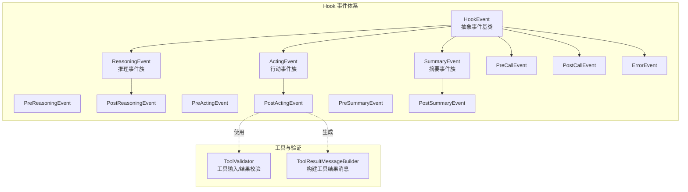
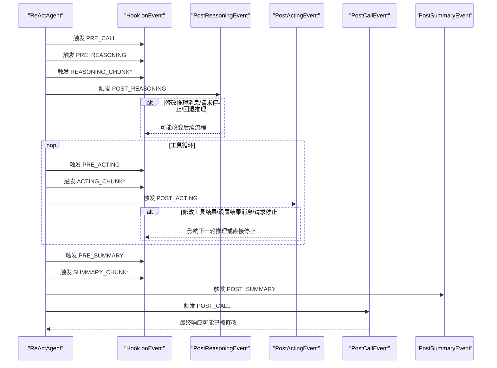
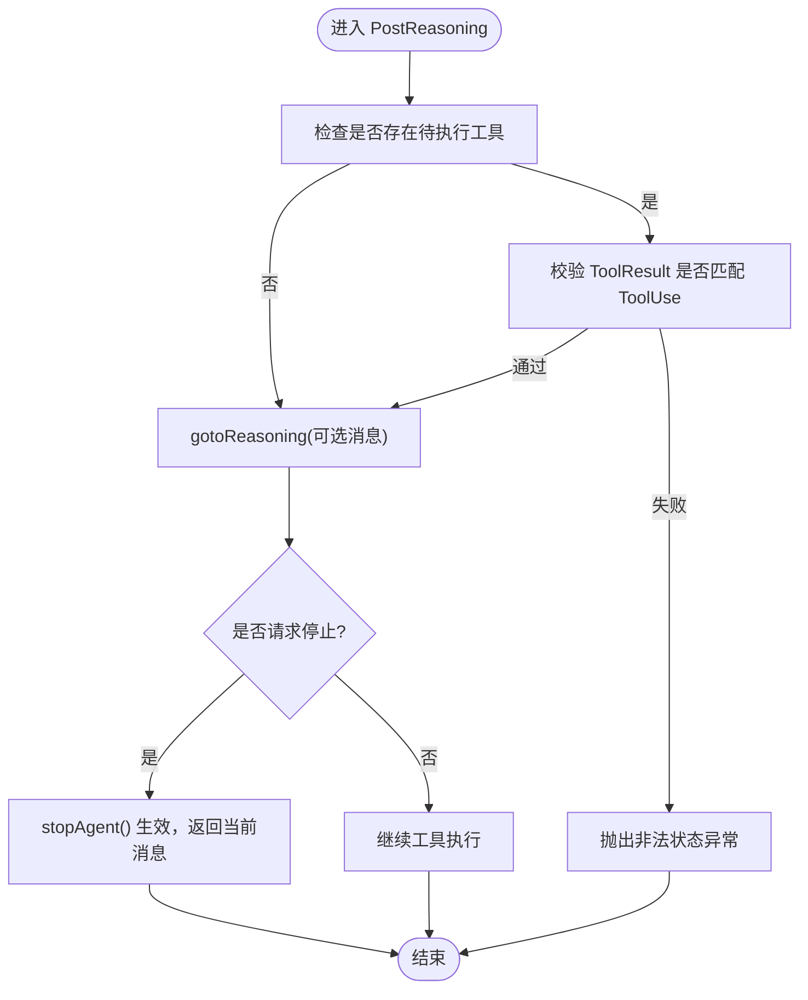
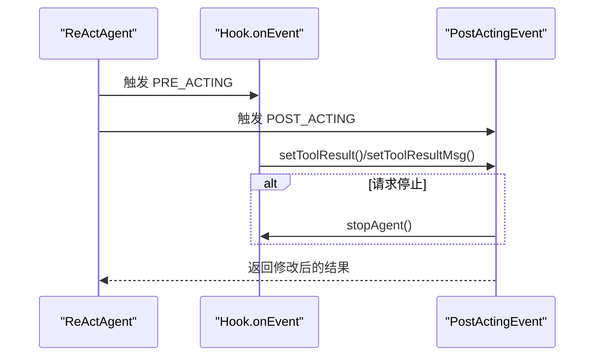
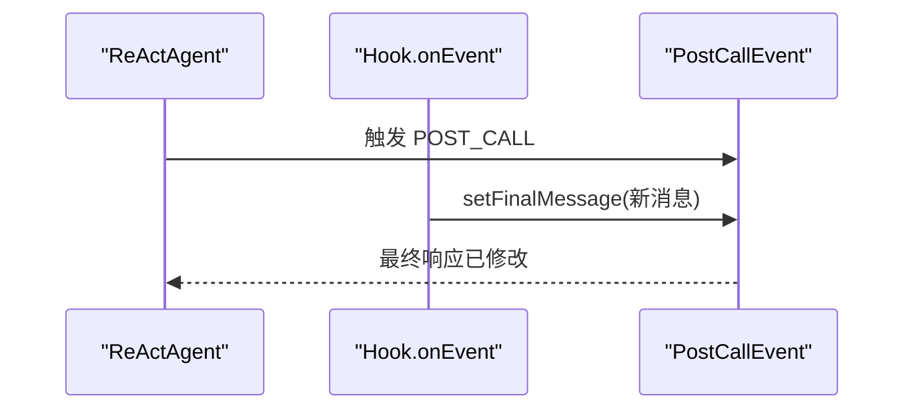
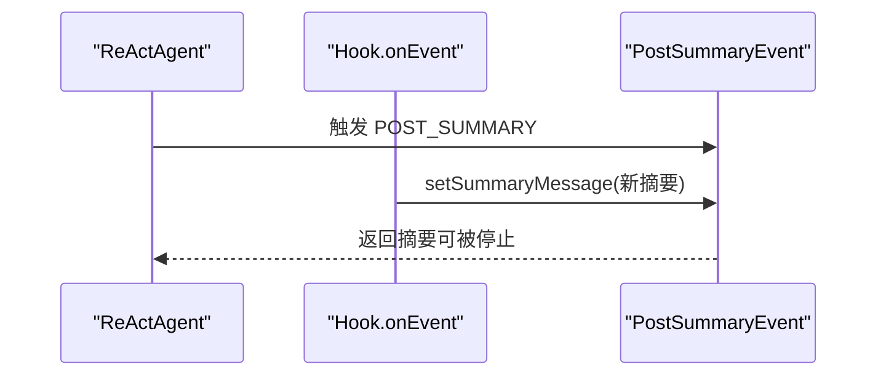
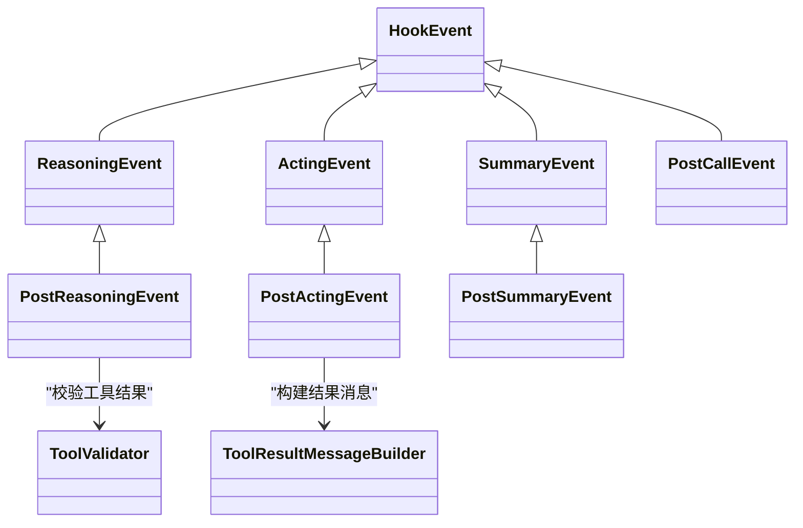

# 后执行事件

<cite>
**本文引用的文件**
- [PostReasoningEvent.java](file://agentscope-core/src/main/java/io/agentscope/core/hook/PostReasoningEvent.java)
- [PostActingEvent.java](file://agentscope-core/src/main/java/io/agentscope/core/hook/PostActingEvent.java)
- [PostCallEvent.java](file://agentscope-core/src/main/java/io/agentscope/core/hook/PostCallEvent.java)
- [PostSummaryEvent.java](file://agentscope-core/src/main/java/io/agentscope/core/hook/PostSummaryEvent.java)
- [HookEvent.java](file://agentscope-core/src/main/java/io/agentscope/core/hook/HookEvent.java)
- [ReasoningEvent.java](file://agentscope-core/src/main/java/io/agentscope/core/hook/ReasoningEvent.java)
- [ActingEvent.java](file://agentscope-core/src/main/java/io/agentscope/core/hook/ActingEvent.java)
- [SummaryEvent.java](file://agentscope-core/src/main/java/io/agentscope/core/hook/SummaryEvent.java)
- [HookEventType.java](file://agentscope-core/src/main/java/io/agentscope/core/hook/HookEventType.java)
- [Hook.java](file://agentscope-core/src/main/java/io/agentscope/core/hook/Hook.java)
- [ToolValidator.java](file://agentscope-core/src/main/java/io/agentscope/core/tool/ToolValidator.java)
- [ToolResultMessageBuilder.java](file://agentscope-core/src/main/java/io/agentscope/core/tool/ToolResultMessageBuilder.java)
- [ReActAgent.java](file://agentscope-core/src/main/java/io/agentscope/core/ReActAgent.java)
- [hook.md](file://docs/en/task/hook.md)
- [HookStopAgentTest.java](file://agentscope-core/src/test/java/io/agentscope/core/hook/HookStopAgentTest.java)
- [HookEventTest.java](file://agentscope-core/src/test/java/io/agentscope/core/hook/HookEventTest.java)
- [UserAgentTest.java](file://agentscope-core/src/test/java/io/agentscope/core/agent/user/UserAgentTest.java)
</cite>

## 目录
1. [简介](#简介)
2. [项目结构](#项目结构)
3. [核心组件](#核心组件)
4. [架构总览](#架构总览)
5. [详细组件分析](#详细组件分析)
6. [依赖分析](#依赖分析)
7. [性能考虑](#性能考虑)
8. [故障排查指南](#故障排查指南)
9. [结论](#结论)
10. [附录](#附录)

## 简介
本文件聚焦于“后执行事件”系列，系统性地梳理并说明以下四个事件的用途、触发时机、返回值处理与修改方法：
- PostReasoningEvent：推理完成后触发，用于修改 LLM 推理结果、请求停止或回退到推理阶段
- PostActingEvent：工具执行完成后触发，用于修改单次工具调用的结果、设置结果消息、请求停止
- PostCallEvent：一次完整调用结束后触发，用于修改最终响应消息
- PostSummaryEvent：摘要生成完成后触发，用于修改摘要消息、请求停止

文档同时提供事件修改方法的使用指南（如 setReasoningMessage、setToolResult、setFinalMessage 等），并结合真实场景与测试用例，解释后执行事件对最终输出的影响与控制机制。

## 项目结构
后执行事件位于 agentscope-core 模块的 hook 包中，围绕 HookEvent 抽象事件体系构建，并通过 Hook 接口统一拦截与修改事件。相关工具类（如 ToolValidator）用于校验工具结果与待执行工具的匹配关系，确保在回退推理或人类在环流程中的数据一致性。

图表来源
- [HookEvent.java:74-205](file://agentscope-core/src/main/java/io/agentscope/core/hook/HookEvent.java#L74-L205)
- [ReasoningEvent.java:42-82](file://agentscope-core/src/main/java/io/agentscope/core/hook/ReasoningEvent.java#L42-L82)
- [ActingEvent.java:42-79](file://agentscope-core/src/main/java/io/agentscope/core/hook/ActingEvent.java#L42-L79)
- [SummaryEvent.java:43-83](file://agentscope-core/src/main/java/io/agentscope/core/hook/SummaryEvent.java#L43-L83)
- [PostReasoningEvent.java:51-173](file://agentscope-core/src/main/java/io/agentscope/core/hook/PostReasoningEvent.java#L51-L173)
- [PostActingEvent.java:50-129](file://agentscope-core/src/main/java/io/agentscope/core/hook/PostActingEvent.java#L50-L129)
- [PostCallEvent.java:42-77](file://agentscope-core/src/main/java/io/agentscope/core/hook/PostCallEvent.java#L42-L77)
- [PostSummaryEvent.java:47-104](file://agentscope-core/src/main/java/io/agentscope/core/hook/PostSummaryEvent.java#L47-L104)
- [ToolValidator.java:227-263](file://agentscope-core/src/main/java/io/agentscope/core/tool/ToolValidator.java#L227-L263)
- [ToolResultMessageBuilder.java:40-52](file://agentscope-core/src/main/java/io/agentscope/core/tool/ToolResultMessageBuilder.java#L40-L52)

章节来源
- [HookEvent.java:74-205](file://agentscope-core/src/main/java/io/agentscope/core/hook/HookEvent.java#L74-L205)
- [HookEventType.java:27-63](file://agentscope-core/src/main/java/io/agentscope/core/hook/HookEventType.java#L27-L63)

## 核心组件
- PostReasoningEvent：推理完成后触发，可修改推理消息、请求停止、或回退到推理阶段（携带工具结果或提示）
- PostActingEvent：工具执行完成后触发，可修改工具结果、设置结果消息、请求停止
- PostCallEvent：一次调用结束时触发，可修改最终响应消息
- PostSummaryEvent：摘要生成完成后触发，可修改摘要消息、请求停止

章节来源
- [PostReasoningEvent.java:51-173](file://agentscope-core/src/main/java/io/agentscope/core/hook/PostReasoningEvent.java#L51-L173)
- [PostActingEvent.java:50-129](file://agentscope-core/src/main/java/io/agentscope/core/hook/PostActingEvent.java#L50-L129)
- [PostCallEvent.java:42-77](file://agentscope-core/src/main/java/io/agentscope/core/hook/PostCallEvent.java#L42-L77)
- [PostSummaryEvent.java:47-104](file://agentscope-core/src/main/java/io/agentscope/core/hook/PostSummaryEvent.java#L47-L104)

## 架构总览
后执行事件作为 Hook 事件体系的一部分，在 ReActAgent 执行流中按阶段触发。Hook 接口统一接收事件并决定是否修改事件状态，从而影响后续执行路径（例如提前停止、回退推理、修改最终输出等）。

图表来源
- [Hook.java:117-187](file://agentscope-core/src/main/java/io/agentscope/core/hook/Hook.java#L117-L187)
- [HookEventType.java:27-63](file://agentscope-core/src/main/java/io/agentscope/core/hook/HookEventType.java#L27-L63)
- [PostReasoningEvent.java:51-173](file://agentscope-core/src/main/java/io/agentscope/core/hook/PostReasoningEvent.java#L51-L173)
- [PostActingEvent.java:50-129](file://agentscope-core/src/main/java/io/agentscope/core/hook/PostActingEvent.java#L50-L129)
- [PostCallEvent.java:42-77](file://agentscope-core/src/main/java/io/agentscope/core/hook/PostCallEvent.java#L42-L77)
- [PostSummaryEvent.java:47-104](file://agentscope-core/src/main/java/io/agentscope/core/hook/PostSummaryEvent.java#L47-L104)

## 详细组件分析

### PostReasoningEvent（推理完成后）
- 触发时机：LLM 推理完成之后，进入工具调用前
- 主要用途
  - 修改推理结果消息（如过滤/修改工具调用、增删内容块、修改文本/思考内容、添加元数据）
  - 请求停止（stopAgent）：返回当前包含 ToolUseBlocks 的消息，等待人工审阅后再继续
  - 回退到推理阶段（gotoReasoning）：在无待执行工具时可直接回退；若有待执行工具，需提供匹配的 ToolResult 块并通过校验
- 关键方法
  - setReasoningMessage(Msg)：替换推理结果消息
  - stopAgent() / isStopRequested()：请求停止并查询停止状态
  - gotoReasoning(...) / isGotoReasoningRequested() / getGotoReasoningMsgs()：请求回退推理并携带消息
- 返回值处理
  - 若调用 stopAgent()，Agent 将在当前推理阶段结束，返回包含 ToolUseBlocks 的消息
  - 若调用 gotoReasoning(...)，Agent 将把提供的消息加入记忆并重新进行一轮推理
- 与工具校验的关系
  - gotoReasoning(...) 内部会调用工具校验，确保 ToolResult 与 ToolUse 匹配，否则抛出非法状态异常

图表来源
- [PostReasoningEvent.java:150-153](file://agentscope-core/src/main/java/io/agentscope/core/hook/PostReasoningEvent.java#L150-L153)
- [ToolValidator.java:227-263](file://agentscope-core/src/main/java/io/agentscope/core/tool/ToolValidator.java#L227-L263)

章节来源
- [PostReasoningEvent.java:51-173](file://agentscope-core/src/main/java/io/agentscope/core/hook/PostReasoningEvent.java#L51-L173)
- [ToolValidator.java:227-263](file://agentscope-core/src/main/java/io/agentscope/core/tool/ToolValidator.java#L227-L263)

### PostActingEvent（工具执行完成后）
- 触发时机：每次工具执行完成后触发（按工具逐一触发）
- 主要用途
  - 修改工具执行结果（如后处理、过滤、格式转换、错误包装）
  - 设置工具结果消息（便于回退推理或人类在环审阅）
  - 请求停止（stopAgent）：返回当前包含 ToolResult 的消息，等待人工审阅后再继续
- 关键方法
  - getToolResult() / setToolResult(ToolResultBlock)：读取/修改工具结果
  - getToolResultMsg() / setToolResultMsg(Msg)：读取/设置工具结果消息
  - stopAgent() / isStopRequested()：请求停止并查询停止状态
- 返回值处理
  - 修改后的 ToolResult 会影响后续推理或直接触发停止
  - 设置 ToolResultMsg 可以将结果消息注入记忆，供后续流程使用

图表来源
- [PostActingEvent.java:50-129](file://agentscope-core/src/main/java/io/agentscope/core/hook/PostActingEvent.java#L50-L129)
- [ToolResultMessageBuilder.java:40-52](file://agentscope-core/src/main/java/io/agentscope/core/tool/ToolResultMessageBuilder.java#L40-L52)

章节来源
- [PostActingEvent.java:50-129](file://agentscope-core/src/main/java/io/agentscope/core/hook/PostActingEvent.java#L50-L129)
- [ToolResultMessageBuilder.java:40-52](file://agentscope-core/src/main/java/io/agentscope/core/tool/ToolResultMessageBuilder.java#L40-L52)

### PostCallEvent（调用完成后）
- 触发时机：一次完整调用结束后触发
- 主要用途
  - 修改最终响应消息（如后处理、加元数据、格式化、过滤）
- 关键方法
  - getFinalMessage() / setFinalMessage(Msg)：读取/修改最终消息
- 返回值处理
  - 修改后的最终消息即为本次调用的对外输出

图表来源
- [PostCallEvent.java:42-77](file://agentscope-core/src/main/java/io/agentscope/core/hook/PostCallEvent.java#L42-L77)

章节来源
- [PostCallEvent.java:42-77](file://agentscope-core/src/main/java/io/agentscope/core/hook/PostCallEvent.java#L42-L77)

### PostSummaryEvent（摘要完成后）
- 触发时机：达到最大迭代次数后进行摘要生成，摘要完成后触发
- 主要用途
  - 修改摘要消息（如过滤、格式化、添加元数据）
  - 请求停止（stopAgent）：通常用于日志或指标信号
- 关键方法
  - getSummaryMessage() / setSummaryMessage(Msg)：读取/修改摘要消息
  - stopAgent() / isStopRequested()：请求停止并查询停止状态

图表来源
- [PostSummaryEvent.java:47-104](file://agentscope-core/src/main/java/io/agentscope/core/hook/PostSummaryEvent.java#L47-L104)

章节来源
- [PostSummaryEvent.java:47-104](file://agentscope-core/src/main/java/io/agentscope/core/hook/PostSummaryEvent.java#L47-L104)

## 依赖分析
- 事件继承关系
  - PostReasoningEvent 继承自 ReasoningEvent（推理事件族）
  - PostActingEvent 继承自 ActingEvent（行动事件族）
  - PostCallEvent 直接继承自 HookEvent（通用事件）
  - PostSummaryEvent 继承自 SummaryEvent（摘要事件族）
- 工具校验与消息构建
  - PostReasoningEvent 的 gotoReasoning(...) 依赖 ToolValidator.validateToolResultMatch(...)
  - PostActingEvent 的结果消息可通过 ToolResultMessageBuilder.buildToolResultMsg(...) 构建
- 执行控制
  - stopAgent()/isStopRequested() 在多个后执行事件中提供一致的停止语义
  - Hook 接口统一拦截所有事件，决定是否修改事件状态

图表来源
- [HookEvent.java:74-205](file://agentscope-core/src/main/java/io/agentscope/core/hook/HookEvent.java#L74-L205)
- [ReasoningEvent.java:42-82](file://agentscope-core/src/main/java/io/agentscope/core/hook/ReasoningEvent.java#L42-L82)
- [ActingEvent.java:42-79](file://agentscope-core/src/main/java/io/agentscope/core/hook/ActingEvent.java#L42-L79)
- [SummaryEvent.java:43-83](file://agentscope-core/src/main/java/io/agentscope/core/hook/SummaryEvent.java#L43-L83)
- [PostReasoningEvent.java:51-173](file://agentscope-core/src/main/java/io/agentscope/core/hook/PostReasoningEvent.java#L51-L173)
- [PostActingEvent.java:50-129](file://agentscope-core/src/main/java/io/agentscope/core/hook/PostActingEvent.java#L50-L129)
- [PostCallEvent.java:42-77](file://agentscope-core/src/main/java/io/agentscope/core/hook/PostCallEvent.java#L42-L77)
- [PostSummaryEvent.java:47-104](file://agentscope-core/src/main/java/io/agentscope/core/hook/PostSummaryEvent.java#L47-L104)
- [ToolValidator.java:227-263](file://agentscope-core/src/main/java/io/agentscope/core/tool/ToolValidator.java#L227-L263)
- [ToolResultMessageBuilder.java:40-52](file://agentscope-core/src/main/java/io/agentscope/core/tool/ToolResultMessageBuilder.java#L40-L52)

章节来源
- [HookEvent.java:74-205](file://agentscope-core/src/main/java/io/agentscope/core/hook/HookEvent.java#L74-L205)
- [HookEventType.java:27-63](file://agentscope-core/src/main/java/io/agentscope/core/hook/HookEventType.java#L27-L63)

## 性能考虑
- 后执行事件的修改操作仅影响后续流程，不会重复计算模型或工具调用，因此开销主要来自业务逻辑处理（如结果过滤、格式转换、消息构建）
- 频繁调用 stopAgent() 可能导致多次往返交互，应谨慎使用
- gotoReasoning(...) 的工具结果校验涉及集合操作与 ID 对比，建议在 Hook 中尽量减少不必要的消息构造

## 故障排查指南
- 调用 gotoReasoning(...) 抛出非法状态异常
  - 可能原因：存在待执行工具但未提供匹配的 ToolResult
  - 解决方案：确保传入的消息包含与 ToolUse ID 完全匹配的 ToolResult
  - 参考
    - [PostReasoningEvent.java:150-153](file://agentscope-core/src/main/java/io/agentscope/core/hook/PostReasoningEvent.java#L150-L153)
    - [ToolValidator.java:227-263](file://agentscope-core/src/main/java/io/agentscope/core/tool/ToolValidator.java#L227-L263)
- setFinalMessage(null) 抛出空指针异常
  - 可能原因：最终消息不允许为空
  - 解决方案：确保传入非空消息
  - 参考
    - [PostCallEvent.java:73-75](file://agentscope-core/src/main/java/io/agentscope/core/hook/PostCallEvent.java#L73-L75)
- Hook 中误用系统消息注入
  - 可能原因：直接向输入消息注入系统角色消息
  - 解决方案：使用 HookEvent 提供的系统消息 API（setSystemMessage/appendSystemContent）
  - 参考
    - [HookEvent.java:54-71](file://agentscope-core/src/main/java/io/agentscope/core/hook/HookEvent.java#L54-L71)
- 人类在环停止后未恢复
  - 可能原因：未正确调用 agent.call() 恢复
  - 解决方案：在 stopAgent() 后由用户手动调用 agent.call() 继续
  - 参考
    - [PostReasoningEvent.java:99-101](file://agentscope-core/src/main/java/io/agentscope/core/hook/PostReasoningEvent.java#L99-L101)
    - [PostActingEvent.java:98-100](file://agentscope-core/src/main/java/io/agentscope/core/hook/PostActingEvent.java#L98-L100)

章节来源
- [PostReasoningEvent.java:99-153](file://agentscope-core/src/main/java/io/agentscope/core/hook/PostReasoningEvent.java#L99-L153)
- [PostActingEvent.java:98-127](file://agentscope-core/src/main/java/io/agentscope/core/hook/PostActingEvent.java#L98-L127)
- [PostCallEvent.java:73-75](file://agentscope-core/src/main/java/io/agentscope/core/hook/PostCallEvent.java#L73-L75)
- [ToolValidator.java:227-263](file://agentscope-core/src/main/java/io/agentscope/core/tool/ToolValidator.java#L227-L263)
- [HookEvent.java:54-71](file://agentscope-core/src/main/java/io/agentscope/core/hook/HookEvent.java#L54-L71)

## 结论
后执行事件提供了强大的后置控制能力：可在推理、工具执行、最终输出与摘要阶段对结果进行修改与拦截，支持人类在环审阅与流程回退。通过统一的 Hook 接口与明确的修改方法（如 setReasoningMessage、setToolResult、setFinalMessage、setSummaryMessage），开发者可以灵活地定制 Agent 的行为，同时借助工具校验与消息构建工具保障数据一致性与可追溯性。

## 附录

### 事件修改方法使用指南
- PostReasoningEvent
  - setReasoningMessage(Msg)：替换推理结果消息
  - stopAgent()/isStopRequested()：请求停止并查询状态
  - gotoReasoning(...)/isGotoReasoningRequested()/getGotoReasoningMsgs()：回退推理并携带消息
  - 参考
    - [PostReasoningEvent.java:85-171](file://agentscope-core/src/main/java/io/agentscope/core/hook/PostReasoningEvent.java#L85-L171)
- PostActingEvent
  - setToolResult(ToolResultBlock)：修改工具结果
  - setToolResultMsg(Msg)：设置工具结果消息
  - stopAgent()/isStopRequested()：请求停止并查询状态
  - 参考
    - [PostActingEvent.java:84-127](file://agentscope-core/src/main/java/io/agentscope/core/hook/PostActingEvent.java#L84-L127)
- PostCallEvent
  - setFinalMessage(Msg)：修改最终响应消息
  - 参考
    - [PostCallEvent.java:73-75](file://agentscope-core/src/main/java/io/agentscope/core/hook/PostCallEvent.java#L73-L75)
- PostSummaryEvent
  - setSummaryMessage(Msg)：修改摘要消息
  - stopAgent()/isStopRequested()：请求停止并查询状态
  - 参考
    - [PostSummaryEvent.java:80-102](file://agentscope-core/src/main/java/io/agentscope/core/hook/PostSummaryEvent.java#L80-L102)

### 实际应用场景与示例（基于测试与文档）
- 在 PostCallEvent 中为最终消息添加元数据
  - 示例参考
    - [UserAgentTest.java:555-579](file://agentscope-core/src/test/java/io/agentscope/core/agent/user/UserAgentTest.java#L555-L579)
- 在 PostActingEvent 中修改工具结果并设置结果消息
  - 示例参考
    - [HookEventTest.java:295-312](file://agentscope-core/src/test/java/io/agentscope/core/hook/HookEventTest.java#L295-L312)
- 在 PostReasoningEvent 中请求停止以便人工审阅工具调用
  - 示例参考
    - [HookStopAgentTest.java:99-128](file://agentscope-core/src/test/java/io/agentscope/core/hook/HookStopAgentTest.java#L99-L128)
- 事件类型与可修改性概览
  - 参考
    - [hook.md:14-29](file://docs/en/task/hook.md#L14-L29)