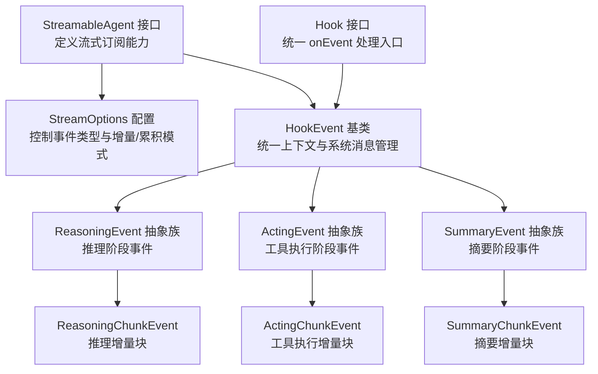
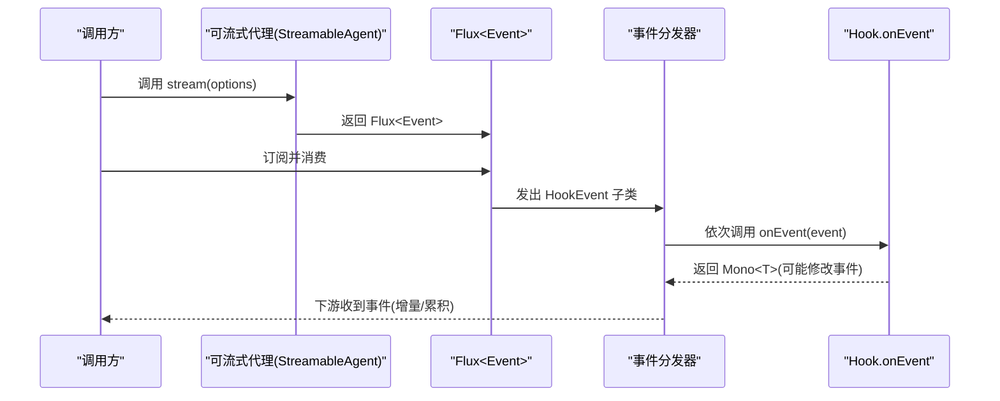
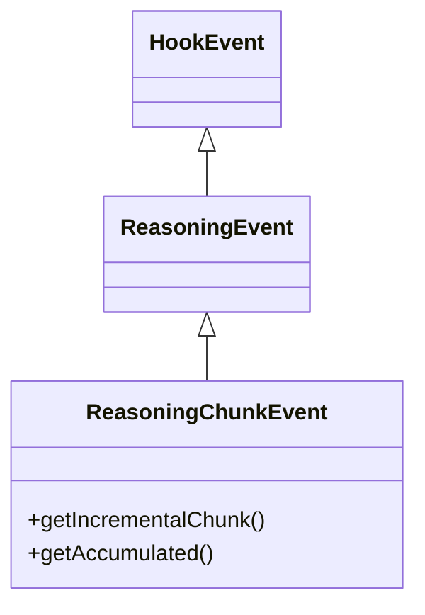
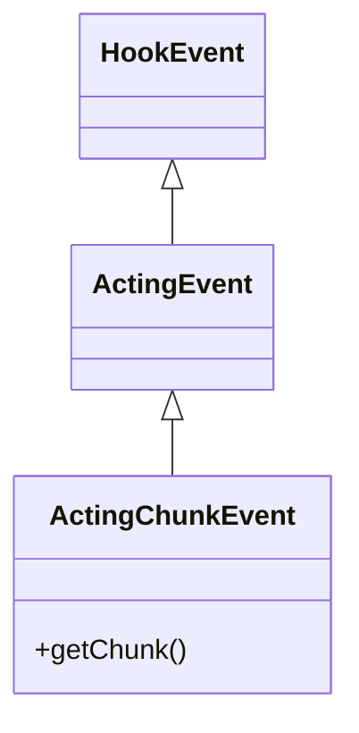
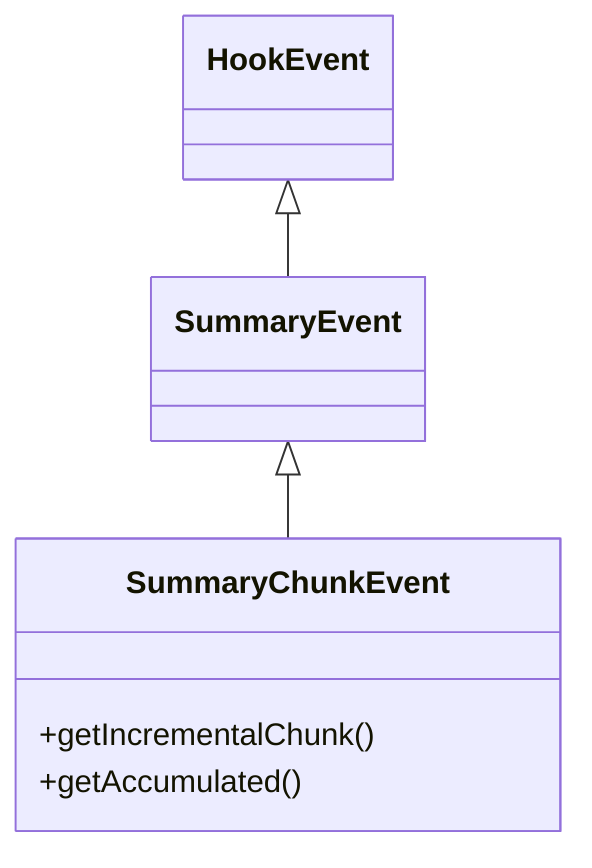
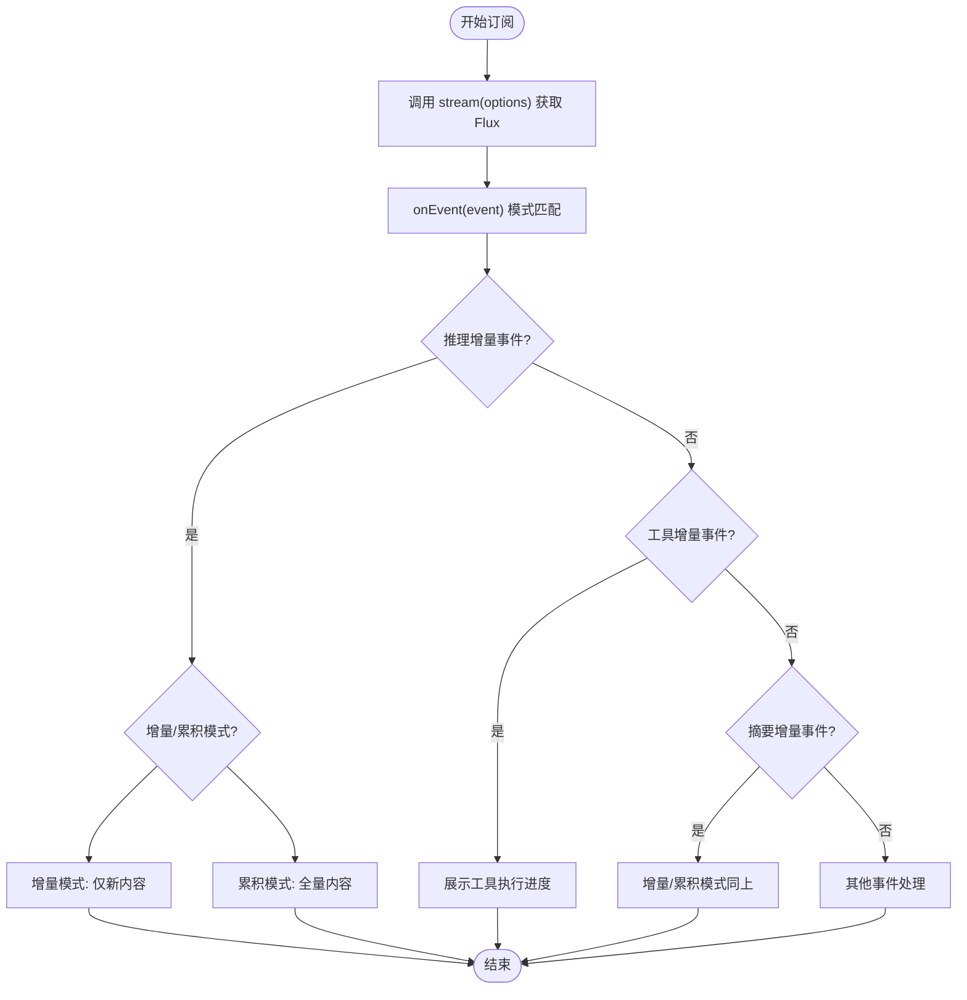
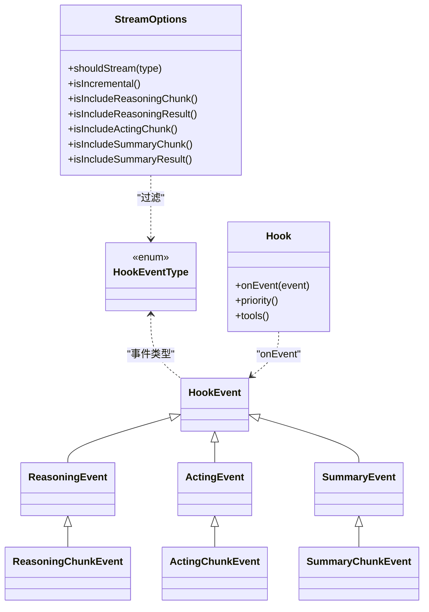

# 流式事件

<cite>
**本文引用的文件**
- [ReasoningChunkEvent.java](file://agentscope-core/src/main/java/io/agentscope/core/hook/ReasoningChunkEvent.java)
- [ActingChunkEvent.java](file://agentscope-core/src/main/java/io/agentscope/core/hook/ActingChunkEvent.java)
- [SummaryChunkEvent.java](file://agentscope-core/src/main/java/io/agentscope/core/hook/SummaryChunkEvent.java)
- [ReasoningEvent.java](file://agentscope-core/src/main/java/io/agentscope/core/hook/ReasoningEvent.java)
- [ActingEvent.java](file://agentscope-core/src/main/java/io/agentscope/core/hook/ActingEvent.java)
- [SummaryEvent.java](file://agentscope-core/src/main/java/io/agentscope/core/hook/SummaryEvent.java)
- [HookEvent.java](file://agentscope-core/src/main/java/io/agentscope/core/hook/HookEvent.java)
- [HookEventType.java](file://agentscope-core/src/main/java/io/agentscope/core/hook/HookEventType.java)
- [Hook.java](file://agentscope-core/src/main/java/io/agentscope/core/hook/Hook.java)
- [StreamableAgent.java](file://agentscope-core/src/main/java/io/agentscope/core/agent/StreamableAgent.java)
- [StreamOptions.java](file://agentscope-core/src/main/java/io/agentscope/core/agent/StreamOptions.java)
</cite>

## 目录
1. [简介](#简介)
2. [项目结构](#项目结构)
3. [核心组件](#核心组件)
4. [架构总览](#架构总览)
5. [详细组件分析](#详细组件分析)
6. [依赖分析](#依赖分析)
7. [性能考虑](#性能考虑)
8. [故障排查指南](#故障排查指南)
9. [结论](#结论)
10. [附录](#附录)

## 简介
本文件聚焦于 AgentScopeJava 中的“流式事件”体系，系统性阐述 ReasoningChunkEvent、ActingChunkEvent 与 SummaryChunkEvent 的流式处理机制与使用方法。内容涵盖：
- 流式数据的接收与处理方式
- 流式事件的监听与消费模式
- 实时处理与缓冲策略
- 在长文本生成与工具执行中的应用场景
- 最佳实践与性能优化建议

## 项目结构
围绕流式事件的关键代码位于 agentscope-core 模块的 hook 与 agent 包中，采用“事件分层 + 钩子拦截”的设计：上层通过 StreamableAgent 的 stream 接口发起流式订阅，底层由 Hook 体系统一接收与分发各类 HookEvent（含 ReasoningChunkEvent、ActingChunkEvent、SummaryChunkEvent 等）。

图表来源
- [StreamableAgent.java:36-152](file://agentscope-core/src/main/java/io/agentscope/core/agent/StreamableAgent.java#L36-L152)
- [StreamOptions.java:62-371](file://agentscope-core/src/main/java/io/agentscope/core/agent/StreamOptions.java#L62-L371)
- [HookEvent.java:74-206](file://agentscope-core/src/main/java/io/agentscope/core/hook/HookEvent.java#L74-L206)
- [ReasoningEvent.java:42-83](file://agentscope-core/src/main/java/io/agentscope/core/hook/ReasoningEvent.java#L42-L83)
- [ActingEvent.java:42-80](file://agentscope-core/src/main/java/io/agentscope/core/hook/ActingEvent.java#L42-L80)
- [SummaryEvent.java:43-84](file://agentscope-core/src/main/java/io/agentscope/core/hook/SummaryEvent.java#L43-L84)
- [ReasoningChunkEvent.java:60-107](file://agentscope-core/src/main/java/io/agentscope/core/hook/ReasoningChunkEvent.java#L60-L107)
- [ActingChunkEvent.java:49-77](file://agentscope-core/src/main/java/io/agentscope/core/hook/ActingChunkEvent.java#L49-L77)
- [SummaryChunkEvent.java:60-107](file://agentscope-core/src/main/java/io/agentscope/core/hook/SummaryChunkEvent.java#L60-L107)
- [Hook.java:117-187](file://agentscope-core/src/main/java/io/agentscope/core/hook/Hook.java#L117-L187)

章节来源
- [StreamableAgent.java:36-152](file://agentscope-core/src/main/java/io/agentscope/core/agent/StreamableAgent.java#L36-L152)
- [StreamOptions.java:62-371](file://agentscope-core/src/main/java/io/agentscope/core/agent/StreamOptions.java#L62-L371)
- [HookEvent.java:74-206](file://agentscope-core/src/main/java/io/agentscope/core/hook/HookEvent.java#L74-L206)
- [ReasoningEvent.java:42-83](file://agentscope-core/src/main/java/io/agentscope/core/hook/ReasoningEvent.java#L42-L83)
- [ActingEvent.java:42-80](file://agentscope-core/src/main/java/io/agentscope/core/hook/ActingEvent.java#L42-L80)
- [SummaryEvent.java:43-84](file://agentscope-core/src/main/java/io/agentscope/core/hook/SummaryEvent.java#L43-L84)
- [ReasoningChunkEvent.java:60-107](file://agentscope-core/src/main/java/io/agentscope/core/hook/ReasoningChunkEvent.java#L60-L107)
- [ActingChunkEvent.java:49-77](file://agentscope-core/src/main/java/io/agentscope/core/hook/ActingChunkEvent.java#L49-L77)
- [SummaryChunkEvent.java:60-107](file://agentscope-core/src/main/java/io/agentscope/core/hook/SummaryChunkEvent.java#L60-L107)
- [Hook.java:117-187](file://agentscope-core/src/main/java/io/agentscope/core/hook/Hook.java#L117-L187)

## 核心组件
- 流式订阅接口：StreamableAgent 定义了多种 stream(...) 方法，支持单条或多条消息输入、结构化输出与 JSON Schema 输出，并返回 Flux<Event> 以实现事件驱动的实时消费。
- 流式配置：StreamOptions 提供事件类型过滤、增量/累积模式、以及针对推理、工具执行、摘要三类事件的细分开关，便于按需裁剪流式输出。
- 事件基类与分层：HookEvent 统一提供 agent、memory、timestamp、systemMsg 等上下文；ReasoningEvent/ActingEvent/SummaryEvent 分别承载推理、工具执行、摘要阶段的通用属性；各阶段的 ChunkEvent 则承载增量块与累计块。
- 钩子拦截：Hook.onEvent(T event) 是统一的事件处理入口，支持优先级排序与工具注入，是流式事件监听与消费的核心。

章节来源
- [StreamableAgent.java:36-152](file://agentscope-core/src/main/java/io/agentscope/core/agent/StreamableAgent.java#L36-L152)
- [StreamOptions.java:62-371](file://agentscope-core/src/main/java/io/agentscope/core/agent/StreamOptions.java#L62-L371)
- [HookEvent.java:74-206](file://agentscope-core/src/main/java/io/agentscope/core/hook/HookEvent.java#L74-L206)
- [Hook.java:117-187](file://agentscope-core/src/main/java/io/agentscope/core/hook/Hook.java#L117-L187)

## 架构总览
下图展示从流式订阅到事件分发与消费的整体流程，强调“配置—订阅—事件—拦截—渲染”的闭环。

图表来源
- [StreamableAgent.java:131-152](file://agentscope-core/src/main/java/io/agentscope/core/agent/StreamableAgent.java#L131-L152)
- [Hook.java:147-147](file://agentscope-core/src/main/java/io/agentscope/core/hook/Hook.java#L147-L147)
- [HookEvent.java:74-206](file://agentscope-core/src/main/java/io/agentscope/core/hook/HookEvent.java#L74-L206)

## 详细组件分析

### ReasoningChunkEvent（推理增量事件）
- 角色定位：在模型推理过程中，作为“增量块”与“累计块”的载体，用于实时显示推理过程或记录日志。
- 数据结构要点：
  - 增量块：仅包含本次新增的内容片段，适合追加式 UI 展示。
  - 累计块：包含自开始以来的全部内容，适合全量替换式 UI 更新。
- 使用场景：
  - 实时聊天界面的打字机效果
  - 进度监控与日志记录
  - 结合 StreamOptions 的增量/累积模式进行灵活展示

图表来源
- [ReasoningChunkEvent.java:60-107](file://agentscope-core/src/main/java/io/agentscope/core/hook/ReasoningChunkEvent.java#L60-L107)
- [ReasoningEvent.java:42-83](file://agentscope-core/src/main/java/io/agentscope/core/hook/ReasoningEvent.java#L42-L83)
- [HookEvent.java:74-206](file://agentscope-core/src/main/java/io/agentscope/core/hook/HookEvent.java#L74-L206)

章节来源
- [ReasoningChunkEvent.java:23-107](file://agentscope-core/src/main/java/io/agentscope/core/hook/ReasoningChunkEvent.java#L23-L107)
- [ReasoningEvent.java:22-83](file://agentscope-core/src/main/java/io/agentscope/core/hook/ReasoningEvent.java#L22-L83)
- [HookEvent.java:29-206](file://agentscope-core/src/main/java/io/agentscope/core/hook/HookEvent.java#L29-L206)

### ActingChunkEvent（工具执行增量事件）
- 角色定位：在工具执行期间，由工具发射器（ToolEmitter）发出的中间结果增量块，用于展示工具执行进度或记录中间状态。
- 关键点：
  - 该增量块仅用于内部展示/监控，不会发送给大模型；最终工具返回值才会参与后续对话。
  - 可结合工具链路的耗时与状态进行可视化反馈。
- 应用场景：
  - 文件读写、网络请求、数据库查询等长任务的进度提示
  - 日志采集与中间结果归档

图表来源
- [ActingChunkEvent.java:49-77](file://agentscope-core/src/main/java/io/agentscope/core/hook/ActingChunkEvent.java#L49-L77)
- [ActingEvent.java:42-80](file://agentscope-core/src/main/java/io/agentscope/core/hook/ActingEvent.java#L42-L80)
- [HookEvent.java:74-206](file://agentscope-core/src/main/java/io/agentscope/core/hook/HookEvent.java#L74-L206)

章节来源
- [ActingChunkEvent.java:24-77](file://agentscope-core/src/main/java/io/agentscope/core/hook/ActingChunkEvent.java#L24-L77)
- [ActingEvent.java:22-80](file://agentscope-core/src/main/java/io/agentscope/core/hook/ActingEvent.java#L22-L80)
- [HookEvent.java:29-206](file://agentscope-core/src/main/java/io/agentscope/core/hook/HookEvent.java#L29-L206)

### SummaryChunkEvent（摘要增量事件）
- 角色定位：当 ReActAgent 达到最大迭代次数后，生成摘要阶段的增量块与累计块，用于实时展示摘要生成进度。
- 使用场景：
  - 长对话/复杂任务的阶段性总结
  - 用户界面的“生成摘要中…”提示与内容预览

图表来源
- [SummaryChunkEvent.java:60-107](file://agentscope-core/src/main/java/io/agentscope/core/hook/SummaryChunkEvent.java#L60-L107)
- [SummaryEvent.java:43-84](file://agentscope-core/src/main/java/io/agentscope/core/hook/SummaryEvent.java#L43-L84)
- [HookEvent.java:74-206](file://agentscope-core/src/main/java/io/agentscope/core/hook/HookEvent.java#L74-L206)

章节来源
- [SummaryChunkEvent.java:23-107](file://agentscope-core/src/main/java/io/agentscope/core/hook/SummaryChunkEvent.java#L23-L107)
- [SummaryEvent.java:22-84](file://agentscope-core/src/main/java/io/agentscope/core/hook/SummaryEvent.java#L22-L84)
- [HookEvent.java:29-206](file://agentscope-core/src/main/java/io/agentscope/core/hook/HookEvent.java#L29-L206)

### 流式事件监听与消费模式
- 统一入口：Hook.onEvent(T event) 支持对任意 HookEvent 子类进行模式匹配与处理，返回 Mono<T> 以允许修改事件（若事件可修改）。
- 优先级：Hook.priority() 控制多个钩子的执行顺序，数值越小优先级越高。
- 工具注入：Hook.tools() 可在构建阶段注册额外工具，扩展事件处理能力。
- 典型消费路径：
  - 订阅 StreamableAgent.stream(...)
  - 在 Hook.onEvent 中根据事件类型分支处理
  - 对 ReasoningChunkEvent/SummaryChunkEvent 使用增量/累计两种模式
  - 对 ActingChunkEvent 展示工具执行进度

图表来源
- [Hook.java:117-187](file://agentscope-core/src/main/java/io/agentscope/core/hook/Hook.java#L117-L187)
- [StreamOptions.java:253-371](file://agentscope-core/src/main/java/io/agentscope/core/agent/StreamOptions.java#L253-L371)
- [ReasoningChunkEvent.java:60-107](file://agentscope-core/src/main/java/io/agentscope/core/hook/ReasoningChunkEvent.java#L60-L107)
- [ActingChunkEvent.java:49-77](file://agentscope-core/src/main/java/io/agentscope/core/hook/ActingChunkEvent.java#L49-L77)
- [SummaryChunkEvent.java:60-107](file://agentscope-core/src/main/java/io/agentscope/core/hook/SummaryChunkEvent.java#L60-L107)

章节来源
- [Hook.java:117-187](file://agentscope-core/src/main/java/io/agentscope/core/hook/Hook.java#L117-L187)
- [StreamOptions.java:253-371](file://agentscope-core/src/main/java/io/agentscope/core/agent/StreamOptions.java#L253-L371)

### 流式输出的实时处理与缓冲机制
- 增量/累积模式：通过 StreamOptions.isIncremental() 控制每次事件仅传递新增内容或全量累计内容，避免重复拼接与内存压力。
- 事件过滤：针对推理/摘要两类事件，可通过 includeReasoningChunk/includeReasoningResult 与 includeSummaryChunk/includeSummaryResult 精细控制是否包含中间增量或最终结果，减少下游渲染负担。
- 系统消息一致性：HookEvent 统一维护 systemMsg，确保每次推理/摘要阶段均基于一致的系统消息基线，避免跨轮次污染。

章节来源
- [StreamOptions.java:62-371](file://agentscope-core/src/main/java/io/agentscope/core/agent/StreamOptions.java#L62-L371)
- [HookEvent.java:74-206](file://agentscope-core/src/main/java/io/agentscope/core/hook/HookEvent.java#L74-L206)

### 在长文本生成与工具执行中的应用
- 长文本生成：
  - 使用 ReasoningChunkEvent 的增量块实现“打字机”式实时展示，提升交互体验。
  - 使用累积块进行全文预览与回放，满足编辑与校对需求。
- 工具执行：
  - 使用 ActingChunkEvent 展示文件上传/下载、数据库查询、外部 API 请求等长任务的实时进度。
  - 将最终工具结果合并入后续对话，保证 LLM 输入的完整性。

章节来源
- [ReasoningChunkEvent.java:23-107](file://agentscope-core/src/main/java/io/agentscope/core/hook/ReasoningChunkEvent.java#L23-L107)
- [ActingChunkEvent.java:24-77](file://agentscope-core/src/main/java/io/agentscope/core/hook/ActingChunkEvent.java#L24-L77)
- [SummaryChunkEvent.java:23-107](file://agentscope-core/src/main/java/io/agentscope/core/hook/SummaryChunkEvent.java#L23-L107)

## 依赖分析
- 事件继承层次清晰：HookEvent 为所有事件的根基，ReasoningEvent/ActingEvent/SummaryEvent 三族抽象分别覆盖推理、工具执行、摘要阶段；各族下的 ChunkEvent 承载增量块与累计块。
- 配置与事件解耦：StreamOptions 仅负责筛选与模式控制，不侵入事件语义，便于在不同后端与协议间复用。
- 钩子与事件解耦：Hook.onEvent 通过泛型与模式匹配实现对任意事件类型的统一处理，支持优先级与工具注入。

图表来源
- [HookEventType.java:27-63](file://agentscope-core/src/main/java/io/agentscope/core/hook/HookEventType.java#L27-L63)
- [HookEvent.java:74-206](file://agentscope-core/src/main/java/io/agentscope/core/hook/HookEvent.java#L74-L206)
- [ReasoningEvent.java:42-83](file://agentscope-core/src/main/java/io/agentscope/core/hook/ReasoningEvent.java#L42-L83)
- [ActingEvent.java:42-80](file://agentscope-core/src/main/java/io/agentscope/core/hook/ActingEvent.java#L42-L80)
- [SummaryEvent.java:43-84](file://agentscope-core/src/main/java/io/agentscope/core/hook/SummaryEvent.java#L43-L84)
- [ReasoningChunkEvent.java:60-107](file://agentscope-core/src/main/java/io/agentscope/core/hook/ReasoningChunkEvent.java#L60-L107)
- [ActingChunkEvent.java:49-77](file://agentscope-core/src/main/java/io/agentscope/core/hook/ActingChunkEvent.java#L49-L77)
- [SummaryChunkEvent.java:60-107](file://agentscope-core/src/main/java/io/agentscope/core/hook/SummaryChunkEvent.java#L60-L107)
- [Hook.java:117-187](file://agentscope-core/src/main/java/io/agentscope/core/hook/Hook.java#L117-L187)
- [StreamOptions.java:62-371](file://agentscope-core/src/main/java/io/agentscope/core/agent/StreamOptions.java#L62-L371)

章节来源
- [HookEventType.java:18-63](file://agentscope-core/src/main/java/io/agentscope/core/hook/HookEventType.java#L18-L63)
- [Hook.java:117-187](file://agentscope-core/src/main/java/io/agentscope/core/hook/Hook.java#L117-L187)
- [StreamOptions.java:62-371](file://agentscope-core/src/main/java/io/agentscope/core/agent/StreamOptions.java#L62-L371)

## 性能考虑
- 合理选择增量/累积模式：在高频流式场景下，优先使用增量模式以降低序列化与渲染成本；需要全量预览时再切换为累积模式。
- 精准过滤事件：通过 StreamOptions 的 include*Chunk/include*Result 开关，屏蔽不必要的中间事件，减少下游处理压力。
- 优先级与工具注入：将关键钩子（如鉴权、限流）设置更高优先级，避免低优先级钩子造成阻塞。
- 内存与背压：在消费端使用合适的背压策略与缓冲区大小，防止内存抖动；必要时对高频事件进行去重或合并。
- 系统消息复用：利用 HookEvent 的 systemMsg 机制，避免重复拼接系统消息，降低 CPU 与内存开销。

## 故障排查指南
- 事件未到达：检查 StreamOptions 是否正确启用对应事件类型与模式；确认 Hook.priority() 设置是否导致被前置钩子提前终止。
- 显示异常（重复/错位）：核对增量/累积模式配置；确保 UI 渲染逻辑与事件语义一致（增量仅追加，累积可替换）。
- 工具进度不更新：确认工具链路确实在执行中发出增量块；检查工具是否正确实现 ToolEmitter 接口。
- 系统消息污染：避免直接向输入消息列表注入 SYSTEM 角色消息，应使用 HookEvent 的 appendSystemContent/setSystemMessage 接口。

章节来源
- [StreamOptions.java:62-371](file://agentscope-core/src/main/java/io/agentscope/core/agent/StreamOptions.java#L62-L371)
- [HookEvent.java:140-206](file://agentscope-core/src/main/java/io/agentscope/core/hook/HookEvent.java#L140-L206)
- [Hook.java:117-187](file://agentscope-core/src/main/java/io/agentscope/core/hook/Hook.java#L117-L187)

## 结论
ReasoningChunkEvent、ActingChunkEvent 与 SummaryChunkEvent 构成了 AgentScopeJava 流式事件体系的核心，配合 StreamableAgent 的流式订阅与 StreamOptions 的精细配置，能够高效支撑长文本生成与工具执行的实时展示与监控。通过 Hook 的统一拦截与优先级控制，开发者可以灵活地插入业务逻辑、优化性能并保障系统稳定性。

## 附录
- 事件类型枚举：HookEventType 定义了 PRE_CALL、POST_CALL、PRE_REASONING、POST_REASONING、REASONING_CHUNK、PRE_ACTING、POST_ACTING、ACTING_CHUNK、PRE_SUMMARY、POST_SUMMARY、SUMMARY_CHUNK、ERROR 等，覆盖代理生命周期与三类阶段的完整流式事件。
- 事件上下文：HookEvent 统一提供 agent、memory、timestamp、systemMsg 等上下文，确保事件处理的一致性与可追溯性。

章节来源
- [HookEventType.java:18-63](file://agentscope-core/src/main/java/io/agentscope/core/hook/HookEventType.java#L18-L63)
- [HookEvent.java:29-206](file://agentscope-core/src/main/java/io/agentscope/core/hook/HookEvent.java#L29-L206)