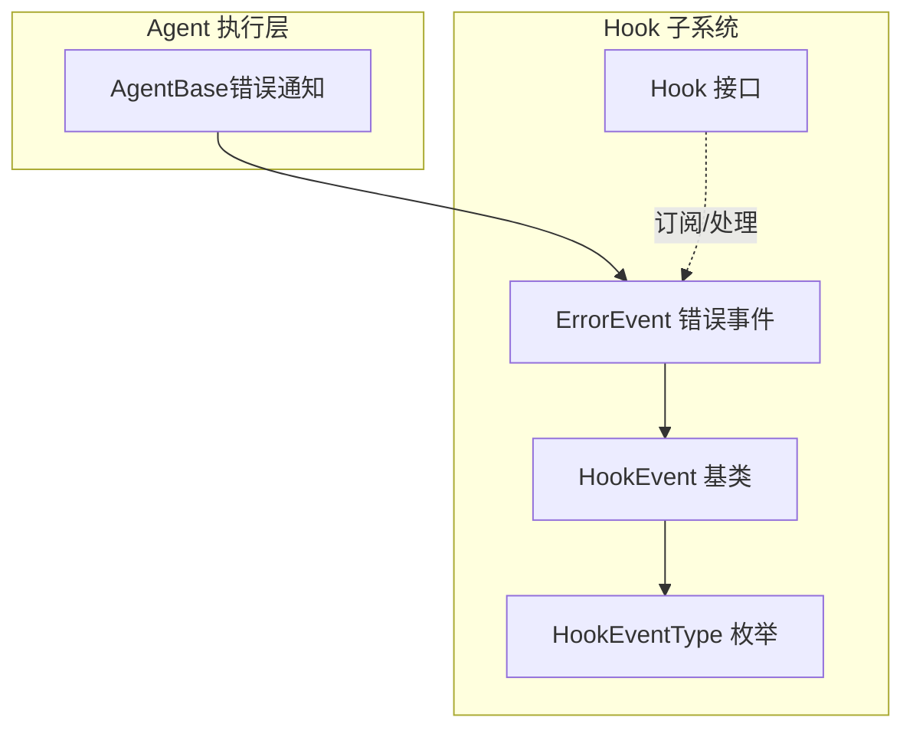
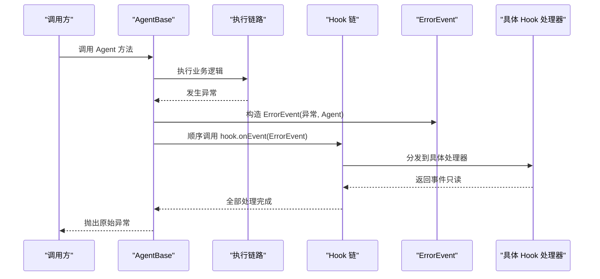
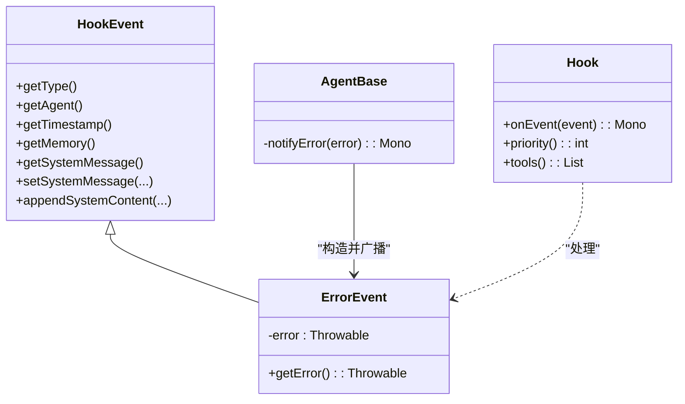

# 错误事件

<cite>
**本文引用的文件列表**
- [ErrorEvent.java](file://agentscope-core/src/main/java/io/agentscope/core/hook/ErrorEvent.java)
- [HookEvent.java](file://agentscope-core/src/main/java/io/agentscope/core/hook/HookEvent.java)
- [HookEventType.java](file://agentscope-core/src/main/java/io/agentscope/core/hook/HookEventType.java)
- [Hook.java](file://agentscope-core/src/main/java/io/agentscope/core/hook/Hook.java)
- [AgentBase.java](file://agentscope-core/src/main/java/io/agentscope/core/agent/AgentBase.java)
- [ExceptionUtils.java](file://agentscope-core/src/main/java/io/agentscope/core/util/ExceptionUtils.java)
- [CompositeAgentException.java](file://agentscope-core/src/main/java/io/agentscope/core/exception/CompositeAgentException.java)
- [hook.md](file://docs/en/task/hook.md)
- [HookEventTest.java](file://agentscope-core/src/test/java/io/agentscope/core/hook/HookEventTest.java)
- [ObservationHook.java](file://agentscope-examples/advanced/src/main/java/io/agentscope/examples/advanced/hitl/ObservationHook.java)
- [InterruptionExample.java](file://agentscope-examples/quickstart/src/main/java/io/agentscope/examples/quickstart/InterruptionExample.java)
- [JsonlTraceExporterTest.java](file://agentscope-core/src/test/java/io/agentscope/core/hook/recorder/JsonlTraceExporterTest.java)
- [A2aAgent.java](file://agentscope-extensions/agentscope-extensions-a2a/agentscope-extensions-a2a-client/src/main/java/io/agentscope/core/a2a/agent/A2aAgent.java)
</cite>

## 目录
1. [简介](#简介)
2. [项目结构与定位](#项目结构与定位)
3. [核心组件](#核心组件)
4. [架构总览](#架构总览)
5. [详细组件分析](#详细组件分析)
6. [依赖关系分析](#依赖关系分析)
7. [性能与可靠性考量](#性能与可靠性考量)
8. [故障排查指南](#故障排查指南)
9. [结论](#结论)
10. [附录：最佳实践与调试技巧](#附录最佳实践与调试技巧)

## 简介
本篇文档围绕 ErrorEvent 错误事件展开，系统性阐述其在 Hook 系统中的职责、数据结构、监听与处理模式、错误恢复与重试策略、以及在整个 Hook 生命周期中的传播与处理流程。同时提供最佳实践与调试技巧，帮助开发者在复杂多 Agent 场景中稳定地捕获与处置异常。

## 项目结构与定位
- ErrorEvent 属于 Hook 子系统，用于在 Agent 执行过程中发生异常时进行通知。
- 它继承自 HookEvent，遵循统一的事件模型与生命周期管理。
- 在 AgentBase 中，当执行链路出现非中断类异常时，会构造 ErrorEvent 并广播给所有已注册 Hook；随后将原始异常重新抛出，保证上层调用能感知失败并进行必要的清理或回滚。

图表来源
- [ErrorEvent.java:41-65](file://agentscope-core/src/main/java/io/agentscope/core/hook/ErrorEvent.java#L41-L65)
- [HookEvent.java:74-75](file://agentscope-core/src/main/java/io/agentscope/core/hook/HookEvent.java#L74-L75)
- [HookEventType.java:27-63](file://agentscope-core/src/main/java/io/agentscope/core/hook/HookEventType.java#L27-L63)
- [Hook.java:117-187](file://agentscope-core/src/main/java/io/agentscope/core/hook/Hook.java#L117-L187)
- [AgentBase.java:749-752](file://agentscope-core/src/main/java/io/agentscope/core/agent/AgentBase.java#L749-L752)

章节来源
- [ErrorEvent.java:21-40](file://agentscope-core/src/main/java/io/agentscope/core/hook/ErrorEvent.java#L21-L40)
- [HookEvent.java:29-75](file://agentscope-core/src/main/java/io/agentscope/core/hook/HookEvent.java#L29-L75)
- [HookEventType.java:18-63](file://agentscope-core/src/main/java/io/agentscope/core/hook/HookEventType.java#L18-L63)
- [Hook.java:25-41](file://agentscope-core/src/main/java/io/agentscope/core/hook/Hook.java#L25-L41)
- [AgentBase.java:749-752](file://agentscope-core/src/main/java/io/agentscope/core/agent/AgentBase.java#L749-L752)

## 核心组件
- ErrorEvent：表示在 Agent 执行期间发生的错误事件，仅用于通知，不可修改。
- HookEvent：所有 Hook 事件的抽象基类，提供通用上下文（Agent、时间戳、系统消息等）。
- HookEventType：枚举所有事件类型，其中包含 ERROR。
- Hook：统一的事件拦截与处理接口，onEvent 支持对不同事件类型进行模式匹配。
- AgentBase：在执行链路中捕获异常并触发 ErrorEvent 广播。

章节来源
- [ErrorEvent.java:41-65](file://agentscope-core/src/main/java/io/agentscope/core/hook/ErrorEvent.java#L41-L65)
- [HookEvent.java:74-205](file://agentscope-core/src/main/java/io/agentscope/core/hook/HookEvent.java#L74-L205)
- [HookEventType.java:27-63](file://agentscope-core/src/main/java/io/agentscope/core/hook/HookEventType.java#L27-L63)
- [Hook.java:117-147](file://agentscope-core/src/main/java/io/agentscope/core/hook/Hook.java#L117-L147)
- [AgentBase.java:749-752](file://agentscope-core/src/main/java/io/agentscope/core/agent/AgentBase.java#L749-L752)

## 架构总览
下图展示了从 Agent 执行到错误事件传播的关键路径：AgentBase 捕获异常后构造 ErrorEvent，并通过 Hook 链逐个传递；每个 Hook 可以记录日志、发送告警、统计指标或进行其他处理；最终异常被重新抛出，确保调用方感知失败。

图表来源
- [AgentBase.java:749-752](file://agentscope-core/src/main/java/io/agentscope/core/agent/AgentBase.java#L749-L752)
- [Hook.java:147-147](file://agentscope-core/src/main/java/io/agentscope/core/hook/Hook.java#L147-L147)
- [ErrorEvent.java:52-55](file://agentscope-core/src/main/java/io/agentscope/core/hook/ErrorEvent.java#L52-L55)

章节来源
- [AgentBase.java:749-752](file://agentscope-core/src/main/java/io/agentscope/core/agent/AgentBase.java#L749-L752)
- [Hook.java:117-147](file://agentscope-core/src/main/java/io/agentscope/core/hook/Hook.java#L117-L147)
- [ErrorEvent.java:41-65](file://agentscope-core/src/main/java/io/agentscope/core/hook/ErrorEvent.java#L41-L65)

## 详细组件分析

### ErrorEvent 数据结构与语义
- 继承关系：ErrorEvent 继承自 HookEvent，事件类型固定为 ERROR。
- 不可修改性：ErrorEvent 仅用于通知，不提供 setter，属于只读事件。
- 关键字段：
  - 错误对象：Throwable，表示实际发生的异常。
  - 上下文：可通过 HookEvent 提供的 getAgent()/getMemory()/getTimestamp() 获取 Agent 实例、内存与时间戳。
- 使用场景：日志记录、告警通知、指标采集、自定义错误处理。

章节来源
- [ErrorEvent.java:21-40](file://agentscope-core/src/main/java/io/agentscope/core/hook/ErrorEvent.java#L21-L40)
- [ErrorEvent.java:41-65](file://agentscope-core/src/main/java/io/agentscope/core/hook/ErrorEvent.java#L41-L65)
- [HookEvent.java:74-138](file://agentscope-core/src/main/java/io/agentscope/core/hook/HookEvent.java#L74-L138)

### 错误捕获与传播流程
- 捕获点：AgentBase 在执行链路中捕获异常，区分中断异常与普通异常。
- 传播路径：对非中断异常，构造 ErrorEvent，按 Hook 优先级顺序调用 onEvent；完成后将原始异常重新抛出。
- Hook 处理：各 Hook 可根据事件类型进行分支处理，ErrorEvent 通常用于记录与上报。

章节来源
- [AgentBase.java:449-457](file://agentscope-core/src/main/java/io/agentscope/core/agent/AgentBase.java#L449-L457)
- [AgentBase.java:749-752](file://agentscope-core/src/main/java/io/agentscope/core/agent/AgentBase.java#L749-L752)
- [Hook.java:147-147](file://agentscope-core/src/main/java/io/agentscope/core/hook/Hook.java#L147-L147)

### 错误事件监听与处理模式
- 统一入口：Hook.onEvent 支持对任意 HookEvent 进行模式匹配，包括 ErrorEvent。
- 典型处理：在 Hook 内部判断 event instanceof ErrorEvent，读取 getError() 与 getAgent()，输出日志或上报。
- 示例参考：
  - 文档示例：展示如何在 Hook 中识别并处理 ErrorEvent。
  - 示例应用：ObservationHook 与 InterruptionExample 中均包含对 ErrorEvent 的处理分支。

章节来源
- [hook.md:214-250](file://docs/en/task/hook.md#L214-L250)
- [ObservationHook.java:76-94](file://agentscope-examples/advanced/src/main/java/io/agentscope/examples/advanced/hitl/ObservationHook.java#L76-L94)
- [InterruptionExample.java:164-197](file://agentscope-examples/quickstart/src/main/java/io/agentscope/examples/quickstart/InterruptionExample.java#L164-L197)

### 错误信息结构与包含的数据
- ErrorEvent 本身包含：
  - 错误对象：Throwable，可获取异常类型与消息。
  - Agent 上下文：Agent 实例，便于定位来源。
  - 时间戳：事件创建时间，便于审计与排序。
  - 内存上下文：通过 HookEvent.getMemory() 访问 Agent 的内存（若存在）。
- 工具支持：ExceptionUtils 提供从 Throwable 中提取最友好错误消息的能力，便于在日志与告警中呈现。

章节来源
- [ErrorEvent.java:62-64](file://agentscope-core/src/main/java/io/agentscope/core/hook/ErrorEvent.java#L62-L64)
- [HookEvent.java:115-138](file://agentscope-core/src/main/java/io/agentscope/core/hook/HookEvent.java#L115-L138)
- [ExceptionUtils.java:40-59](file://agentscope-core/src/main/java/io/agentscope/core/util/ExceptionUtils.java#L40-L59)

### 错误恢复与重试策略
- 错误事件本身是只读通知，不直接承担恢复逻辑；但可与重试策略协同工作：
  - 工具层重试：工具调用可配置最大尝试次数、初始退避、最大退避与过滤条件，基于 Retry.backoff 应用指数退避与抖动。
  - 执行配置：ExecutionConfig 提供可重试错误的判定规则（如 429/5xx、超时、网络 IO 等），并支持自定义过滤器。
  - A2A 扩展：在 A2A 客户端生命周期中，遇到 ErrorEvent 时释放资源并记录错误，避免资源泄漏。
- 注意：ErrorEvent 仅用于“观察”与“上报”，真正的恢复与重试应在工具层或业务层实现。

章节来源
- [ToolExecutor.java:366-402](file://agentscope-core/src/main/java/io/agentscope/core/tool/ToolExecutor.java#L366-L402)
- [ExecutionConfig.java:63-134](file://agentscope-core/src/main/java/io/agentscope/core/model/ExecutionConfig.java#L63-L134)
- [A2aAgent.java:223-245](file://agentscope-extensions/agentscope-extensions-a2a/agentscope-extensions-a2a-client/src/main/java/io/agentscope/core/a2a/agent/A2aAgent.java#L223-L245)

### 错误事件在 Hook 系统中的传播与处理流程
- 事件类型：ERROR。
- 触发时机：Agent 执行期间发生异常且非中断。
- 传播方式：Flux/Stream 风格遍历已注册 Hook，依次调用 onEvent；每个 Hook 可选择消费或透传事件。
- 结束行为：全部 Hook 处理完成后，Agent 将原始异常重新抛出，保证调用方可见失败。

章节来源
- [HookEventType.java:61-62](file://agentscope-core/src/main/java/io/agentscope/core/hook/HookEventType.java#L61-L62)
- [AgentBase.java:749-752](file://agentscope-core/src/main/java/io/agentscope/core/agent/AgentBase.java#L749-L752)
- [Hook.java:147-147](file://agentscope-core/src/main/java/io/agentscope/core/hook/Hook.java#L147-L147)

### 测试与验证要点
- 构造与访问：验证 ErrorEvent 类型为 ERROR，且可正确获取错误对象与消息。
- 空值校验：构造参数为空时应抛出空指针异常。
- 事件序列：JsonlTraceExporter 测试覆盖了包含 ERROR 的完整事件序列，确保导出与序列化正常。

章节来源
- [HookEventTest.java:340-361](file://agentscope-core/src/test/java/io/agentscope/core/hook/HookEventTest.java#L340-L361)
- [JsonlTraceExporterTest.java:140-141](file://agentscope-core/src/test/java/io/agentscope/core/hook/recorder/JsonlTraceExporterTest.java#L140-L141)

## 依赖关系分析
- 组件耦合：
  - ErrorEvent 依赖 HookEventType 与 Agent。
  - HookEvent 提供统一上下文与系统消息 API。
  - AgentBase 作为错误捕获与广播的桥接层。
- 外部集成：
  - Hook 接口统一接收所有事件类型，包括 ErrorEvent。
  - 工具层与模型层的异常可被上层转换为 ErrorEvent 广播。

图表来源
- [HookEvent.java:74-205](file://agentscope-core/src/main/java/io/agentscope/core/hook/HookEvent.java#L74-L205)
- [ErrorEvent.java:41-65](file://agentscope-core/src/main/java/io/agentscope/core/hook/ErrorEvent.java#L41-L65)
- [Hook.java:117-187](file://agentscope-core/src/main/java/io/agentscope/core/hook/Hook.java#L117-L187)
- [AgentBase.java:749-752](file://agentscope-core/src/main/java/io/agentscope/core/agent/AgentBase.java#L749-L752)

章节来源
- [HookEvent.java:74-205](file://agentscope-core/src/main/java/io/agentscope/core/hook/HookEvent.java#L74-L205)
- [ErrorEvent.java:41-65](file://agentscope-core/src/main/java/io/agentscope/core/hook/ErrorEvent.java#L41-L65)
- [Hook.java:117-187](file://agentscope-core/src/main/java/io/agentscope/core/hook/Hook.java#L117-L187)
- [AgentBase.java:749-752](file://agentscope-core/src/main/java/io/agentscope/core/agent/AgentBase.java#L749-L752)

## 性能与可靠性考量
- 事件只读设计：ErrorEvent 不允许修改，避免 Hook 间互相篡改错误上下文，降低并发风险。
- Hook 顺序与优先级：Hook 的执行顺序影响错误处理的时机与成本，建议将关键监控与告警置于较高优先级。
- 异常链追踪：通过 ExceptionUtils 提取最友好错误消息，减少日志噪音，提升可观测性。
- 资源释放：在 A2A 客户端中，遇到 ErrorEvent 时主动释放资源，防止连接泄漏。

章节来源
- [Hook.java:31-41](file://agentscope-core/src/main/java/io/agentscope/core/hook/Hook.java#L31-L41)
- [ExceptionUtils.java:40-59](file://agentscope-core/src/main/java/io/agentscope/core/util/ExceptionUtils.java#L40-L59)
- [A2aAgent.java:236-243](file://agentscope-extensions/agentscope-extensions-a2a/agentscope-extensions-a2a-client/src/main/java/io/agentscope/core/a2a/agent/A2aAgent.java#L236-L243)

## 故障排查指南
- 如何确认是否触发了 ErrorEvent：
  - 在 Hook 中添加对 ErrorEvent 的分支处理，打印 getAgent().getName() 与 getError().getMessage()。
  - 参考示例：ObservationHook 与 InterruptionExample。
- 如何验证事件序列：
  - 使用 JsonlTraceExporterTest 中的断言，确认 ERROR 事件出现在完整序列中。
- 如何定位异常来源：
  - 利用 HookEvent.getMemory() 获取 Agent 内存上下文（若存在），结合时间戳与 Agent 名称进行关联分析。
- 如何避免重复处理：
  - ErrorEvent 是只读事件，Hook 中不应对其进行修改；如需变更行为，请在上游工具层或业务层实现重试与补偿。

章节来源
- [ObservationHook.java:86-97](file://agentscope-examples/advanced/src/main/java/io/agentscope/examples/advanced/hitl/ObservationHook.java#L86-L97)
- [InterruptionExample.java:191-193](file://agentscope-examples/quickstart/src/main/java/io/agentscope/examples/quickstart/InterruptionExample.java#L191-L193)
- [JsonlTraceExporterTest.java:163-164](file://agentscope-core/src/test/java/io/agentscope/core/hook/recorder/JsonlTraceExporterTest.java#L163-L164)
- [HookEvent.java:133-138](file://agentscope-core/src/main/java/io/agentscope/core/hook/HookEvent.java#L133-L138)

## 结论
ErrorEvent 作为 Hook 子系统中的关键通知事件，提供了统一、只读、可扩展的错误观测能力。它不承担恢复职责，但通过与 Hook 链、工具层重试策略及资源释放机制协同，能够构建稳健的错误处理闭环。配合完善的日志与指标体系，开发者可在复杂多 Agent 场景中快速定位问题并保障系统稳定性。

## 附录：最佳实践与调试技巧
- 最佳实践
  - 在 Hook 中显式处理 ErrorEvent，记录 Agent 名称、错误类型与消息摘要。
  - 对可重试错误采用指数退避与抖动策略，避免雪崩效应。
  - 在 A2A 客户端中，遇到 ErrorEvent 时立即释放资源并记录错误详情。
  - 使用 CompositeAgentException 汇总多 Agent 的异常信息，便于问题归因。
- 调试技巧
  - 使用 JsonlTraceExporter 导出完整事件序列，核对 ERROR 是否出现在预期位置。
  - 通过 ExceptionUtils 提取异常消息，避免日志中出现空消息或堆栈过长导致的性能问题。
  - 在开发环境提高 Hook 优先级，确保错误事件能尽早被捕获与记录。

章节来源
- [CompositeAgentException.java:22-84](file://agentscope-core/src/main/java/io/agentscope/core/exception/CompositeAgentException.java#L22-L84)
- [JsonlTraceExporterTest.java:140-141](file://agentscope-core/src/test/java/io/agentscope/core/hook/recorder/JsonlTraceExporterTest.java#L140-L141)
- [ExceptionUtils.java:40-59](file://agentscope-core/src/main/java/io/agentscope/core/util/ExceptionUtils.java#L40-L59)