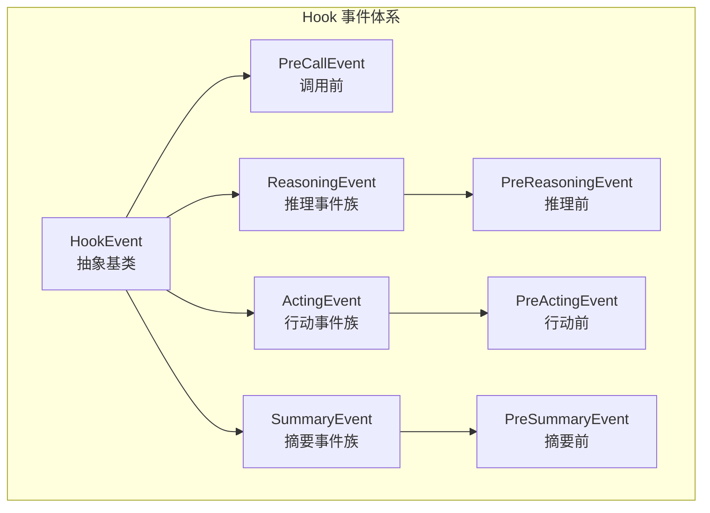
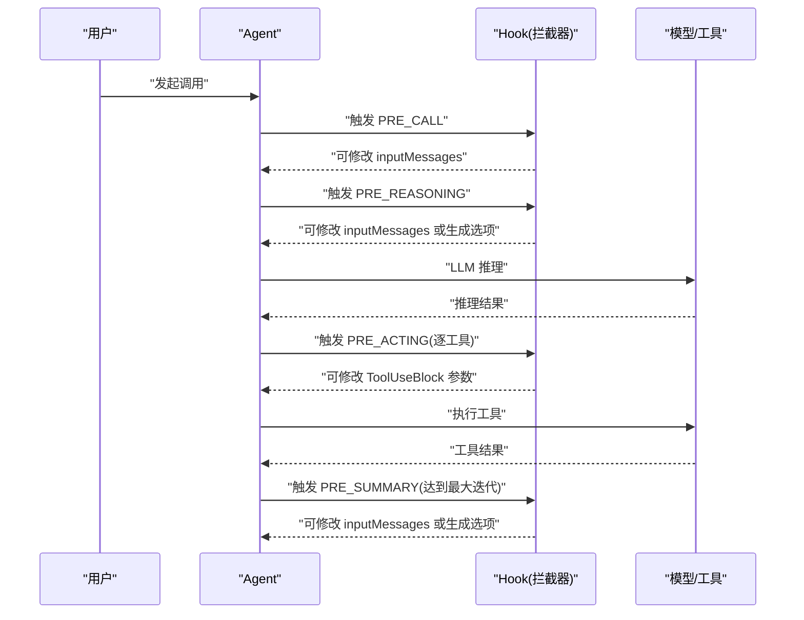
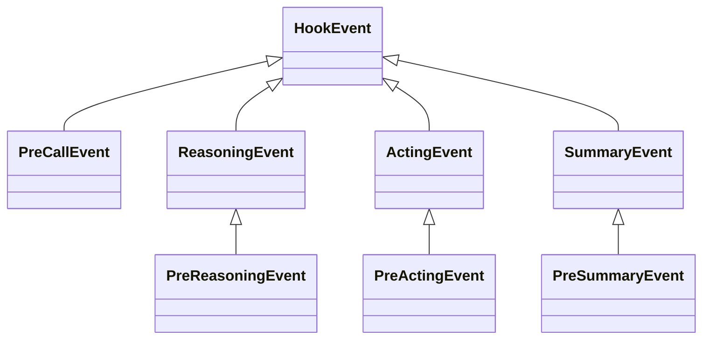

# 预执行事件

<cite>
**本文引用的文件**
- [PreReasoningEvent.java](file://agentscope-core/src/main/java/io/agentscope/core/hook/PreReasoningEvent.java)
- [PreActingEvent.java](file://agentscope-core/src/main/java/io/agentscope/core/hook/PreActingEvent.java)
- [PreCallEvent.java](file://agentscope-core/src/main/java/io/agentscope/core/hook/PreCallEvent.java)
- [PreSummaryEvent.java](file://agentscope-core/src/main/java/io/agentscope/core/hook/PreSummaryEvent.java)
- [ReasoningEvent.java](file://agentscope-core/src/main/java/io/agentscope/core/hook/ReasoningEvent.java)
- [ActingEvent.java](file://agentscope-core/src/main/java/io/agentscope/core/hook/ActingEvent.java)
- [SummaryEvent.java](file://agentscope-core/src/main/java/io/agentscope/core/hook/SummaryEvent.java)
- [HookEvent.java](file://agentscope-core/src/main/java/io/agentscope/core/hook/HookEvent.java)
- [HookEventType.java](file://agentscope-core/src/main/java/io/agentscope/core/hook/HookEventType.java)
- [Hook.java](file://agentscope-core/src/main/java/io/agentscope/core/hook/Hook.java)
- [PostReasoningEvent.java](file://agentscope-core/src/main/java/io/agentscope/core/hook/PostReasoningEvent.java)
- [PostActingEvent.java](file://agentscope-core/src/main/java/io/agentscope/core/hook/PostActingEvent.java)
- [PostCallEvent.java](file://agentscope-core/src/main/java/io/agentscope/core/hook/PostCallEvent.java)
- [ReasoningChunkEvent.java](file://agentscope-core/src/main/java/io/agentscope/core/hook/ReasoningChunkEvent.java)
- [ActingChunkEvent.java](file://agentscope-core/src/main/java/io/agentscope/core/hook/ActingChunkEvent.java)
- [SummaryChunkEvent.java](file://agentscope-core/src/main/java/io/agentscope/core/hook/SummaryChunkEvent.java)
- [ErrorEvent.java](file://agentscope-core/src/main/java/io/agentscope/core/hook/ErrorEvent.java)
- [HookEventTest.java](file://agentscope-core/src/test/java/io/agentscope/core/hook/HookEventTest.java)
- [HookE2ETest.java](file://agentscope-core/src/test/java/io/agentscope/core/e2e/HookE2ETest.java)
- [ReActAgentSystemMsgTest.java](file://agentscope-core/src/test/java/io/agentscope/core/hook/ReActAgentSystemMsgTest.java)
</cite>

## 目录
1. [简介](#简介)
2. [项目结构](#项目结构)
3. [核心组件](#核心组件)
4. [架构总览](#架构总览)
5. [详细组件分析](#详细组件分析)
6. [依赖分析](#依赖分析)
7. [性能考虑](#性能考虑)
8. [故障排查指南](#故障排查指南)
9. [结论](#结论)
10. [附录](#附录)

## 简介
本文件聚焦于“预执行事件”系列的 API 文档，系统性阐述 PreReasoningEvent（推理前）、PreActingEvent（行动前）、PreCallEvent（调用前）与 PreSummaryEvent（摘要前）的用途、参数、触发时机、上下文信息、事件修改方法以及在智能体生命周期中的作用。同时提供拦截与修改的实际应用场景与参考路径，并通过图示展示事件之间的关系与数据流。

## 项目结构
预执行事件位于 agentscope-core 模块的 hook 包中，围绕 HookEvent 抽象基类展开，形成“调用前-推理前-行动前-摘要前”的多层拦截点，配合 Hook 接口实现统一的事件分发与优先级控制。

图表来源
- [HookEvent.java:74-75](file://agentscope-core/src/main/java/io/agentscope/core/hook/HookEvent.java#L74-L75)
- [PreCallEvent.java](file://agentscope-core/src/main/java/io/agentscope/core/hook/PreCallEvent.java#L44)
- [ReasoningEvent.java:42-43](file://agentscope-core/src/main/java/io/agentscope/core/hook/ReasoningEvent.java#L42-L43)
- [ActingEvent.java:42-43](file://agentscope-core/src/main/java/io/agentscope/core/hook/ActingEvent.java#L42-L43)
- [SummaryEvent.java:43-44](file://agentscope-core/src/main/java/io/agentscope/core/hook/SummaryEvent.java#L43-L44)
- [PreReasoningEvent.java](file://agentscope-core/src/main/java/io/agentscope/core/hook/PreReasoningEvent.java#L47)
- [PreActingEvent.java](file://agentscope-core/src/main/java/io/agentscope/core/hook/PreActingEvent.java#L47)
- [PreSummaryEvent.java](file://agentscope-core/src/main/java/io/agentscope/core/hook/PreSummaryEvent.java#L49)

章节来源
- [HookEvent.java:29-73](file://agentscope-core/src/main/java/io/agentscope/core/hook/HookEvent.java#L29-L73)
- [HookEventType.java:18-63](file://agentscope-core/src/main/java/io/agentscope/core/hook/HookEventType.java#L18-L63)

## 核心组件
- HookEvent：所有事件的抽象基类，提供统一的上下文访问（Agent、Memory、时间戳、系统消息字段），并定义系统消息的注入与冻结机制。
- HookEventType：事件类型枚举，涵盖 PRE_CALL、PRE_REASONING、PRE_ACTING、PRE_SUMMARY 等。
- Hook 接口：统一的事件拦截入口，支持优先级与工具注册。
- 事件族：
  - PreCallEvent：拦截 Agent 调用开始阶段的消息输入。
  - PreReasoningEvent：拦截 LLM 推理前的消息与生成选项。
  - PreActingEvent：拦截单个工具调用前的 ToolUseBlock。
  - PreSummaryEvent：拦截 ReActAgent 达到最大迭代次数时的摘要生成前的消息与生成选项。

章节来源
- [HookEvent.java:74-205](file://agentscope-core/src/main/java/io/agentscope/core/hook/HookEvent.java#L74-L205)
- [HookEventType.java:27-63](file://agentscope-core/src/main/java/io/agentscope/core/hook/HookEventType.java#L27-L63)
- [Hook.java:117-186](file://agentscope-core/src/main/java/io/agentscope/core/hook/Hook.java#L117-L186)
- [PreCallEvent.java](file://agentscope-core/src/main/java/io/agentscope/core/hook/PreCallEvent.java#L44)
- [PreReasoningEvent.java](file://agentscope-core/src/main/java/io/agentscope/core/hook/PreReasoningEvent.java#L47)
- [PreActingEvent.java](file://agentscope-core/src/main/java/io/agentscope/core/hook/PreActingEvent.java#L47)
- [PreSummaryEvent.java](file://agentscope-core/src/main/java/io/agentscope/core/hook/PreSummaryEvent.java#L49)

## 架构总览
下图展示了预执行事件在智能体生命周期中的触发顺序与修改能力：

图表来源
- [HookEventType.java:27-63](file://agentscope-core/src/main/java/io/agentscope/core/hook/HookEventType.java#L27-L63)
- [Hook.java:42-112](file://agentscope-core/src/main/java/io/agentscope/core/hook/Hook.java#L42-L112)
- [PreCallEvent.java:24-43](file://agentscope-core/src/main/java/io/agentscope/core/hook/PreCallEvent.java#L24-L43)
- [PreReasoningEvent.java:25-46](file://agentscope-core/src/main/java/io/agentscope/core/hook/PreReasoningEvent.java#L25-L46)
- [PreActingEvent.java:23-46](file://agentscope-core/src/main/java/io/agentscope/core/hook/PreActingEvent.java#L23-L46)
- [PreSummaryEvent.java:25-47](file://agentscope-core/src/main/java/io/agentscope/core/hook/PreSummaryEvent.java#L25-L47)

## 详细组件分析

### PreCallEvent（调用前）
- 触发时机：Agent 开始处理调用时，用于拦截输入消息。
- 上下文信息：
  - Agent 实例
  - Memory（可能为空）
  - 输入消息列表（可修改）
- 修改方法：
  - setInputMessages(List<Msg>)：替换即将进入 Agent 的消息列表。
- 典型场景：
  - 记录调用开始
  - 初始化执行资源
  - 过滤或修改输入消息
- 参考路径：
  - [构造与访问:55-60](file://agentscope-core/src/main/java/io/agentscope/core/hook/PreCallEvent.java#L55-L60)
  - [获取输入消息:67-68](file://agentscope-core/src/main/java/io/agentscope/core/hook/PreCallEvent.java#L67-L68)
  - [设置输入消息:77-79](file://agentscope-core/src/main/java/io/agentscope/core/hook/PreCallEvent.java#L77-L79)

章节来源
- [PreCallEvent.java:24-43](file://agentscope-core/src/main/java/io/agentscope/core/hook/PreCallEvent.java#L24-L43)
- [HookEventTest.java:100-120](file://agentscope-core/src/test/java/io/agentscope/core/hook/HookEventTest.java#L100-L120)

### PreReasoningEvent（推理前）
- 触发时机：每次 LLM 推理前（包括 ReActAgent 的每轮迭代）。
- 上下文信息：
  - Agent 实例
  - Memory
  - 模型名称（model name）
  - 生成选项（GenerateOptions）
  - 即将发送给 LLM 的消息列表（可修改）
  - 有效生成选项（可被覆盖）
- 修改方法：
  - setInputMessages(List<Msg>)：修改即将发送给 LLM 的消息列表。
  - setGenerateOptions(GenerateOptions)：覆盖本次推理的生成选项（如 tool_choice）。
- 典型场景：
  - 注入提示词或额外上下文
  - 过滤或修改现有消息
  - 动态添加系统指令
  - 记录推理输入
- 参考路径：
  - [构造与字段:61-70](file://agentscope-core/src/main/java/io/agentscope/core/hook/PreReasoningEvent.java#L61-L70)
  - [获取/设置输入消息:77-89](file://agentscope-core/src/main/java/io/agentscope/core/hook/PreReasoningEvent.java#L77-L89)
  - [获取有效生成选项:99-103](file://agentscope-core/src/main/java/io/agentscope/core/hook/PreReasoningEvent.java#L99-L103)
  - [设置生成选项:113-115](file://agentscope-core/src/main/java/io/agentscope/core/hook/PreReasoningEvent.java#L113-L115)

章节来源
- [PreReasoningEvent.java:25-46](file://agentscope-core/src/main/java/io/agentscope/core/hook/PreReasoningEvent.java#L25-L46)
- [ReasoningEvent.java:42-82](file://agentscope-core/src/main/java/io/agentscope/core/hook/ReasoningEvent.java#L42-L82)
- [HookEvent.java:43-67](file://agentscope-core/src/main/java/io/agentscope/core/hook/HookEvent.java#L43-L67)
- [HookEventTest.java:155-199](file://agentscope-core/src/test/java/io/agentscope/core/hook/HookEventTest.java#L155-L199)

### PreActingEvent（行动前）
- 触发时机：每个工具调用前（若一次推理包含多个工具调用，则会多次触发）。
- 上下文信息：
  - Agent 实例
  - Memory
  - Toolkit 实例
  - 即将执行的 ToolUseBlock（可修改）
- 修改方法：
  - setToolUse(ToolUseBlock)：修改工具调用参数。
- 典型场景：
  - 验证或修改单个工具的参数
  - 为工具调用附加认证或上下文
  - 实施按工具的授权检查
  - 记录或监控单个工具调用
- 参考路径：
  - [构造与字段:57-59](file://agentscope-core/src/main/java/io/agentscope/core/hook/PreActingEvent.java#L57-L59)
  - [设置 ToolUseBlock:67-69](file://agentscope-core/src/main/java/io/agentscope/core/hook/PreActingEvent.java#L67-L69)

章节来源
- [PreActingEvent.java:23-46](file://agentscope-core/src/main/java/io/agentscope/core/hook/PreActingEvent.java#L23-L46)
- [ActingEvent.java:42-79](file://agentscope-core/src/main/java/io/agentscope/core/hook/ActingEvent.java#L42-L79)
- [HookE2ETest.java:170-184](file://agentscope-core/src/test/java/io/agentscope/core/e2e/HookE2ETest.java#L170-L184)

### PreSummaryEvent（摘要前）
- 触发时机：ReActAgent 达到最大迭代次数时，准备生成摘要前。
- 上下文信息：
  - Agent 实例
  - Memory
  - 模型名称
  - 生成选项
  - 即将发送给 LLM 的摘要消息列表（可修改）
  - 最大迭代次数
  - 当前迭代次数
  - 有效生成选项（可被覆盖）
- 修改方法：
  - setInputMessages(List<Msg>)：修改摘要输入消息。
  - setGenerateOptions(GenerateOptions)：覆盖本次摘要的生成选项。
- 典型场景：
  - 向摘要提示注入额外上下文
  - 修改摘要系统指令
  - 改变摘要生成参数
  - 记录摘要生成输入
- 参考路径：
  - [构造与字段:67-80](file://agentscope-core/src/main/java/io/agentscope/core/hook/PreSummaryEvent.java#L67-L80)
  - [获取/设置输入消息:87-99](file://agentscope-core/src/main/java/io/agentscope/core/hook/PreSummaryEvent.java#L87-L99)
  - [获取最大/当前迭代:106-117](file://agentscope-core/src/main/java/io/agentscope/core/hook/PreSummaryEvent.java#L106-L117)
  - [获取有效生成选项:127-131](file://agentscope-core/src/main/java/io/agentscope/core/hook/PreSummaryEvent.java#L127-L131)
  - [设置生成选项:140-142](file://agentscope-core/src/main/java/io/agentscope/core/hook/PreSummaryEvent.java#L140-L142)

章节来源
- [PreSummaryEvent.java:25-47](file://agentscope-core/src/main/java/io/agentscope/core/hook/PreSummaryEvent.java#L25-L47)
- [SummaryEvent.java:43-83](file://agentscope-core/src/main/java/io/agentscope/core/hook/SummaryEvent.java#L43-L83)
- [SummaryEventTest.java:353-366](file://agentscope-core/src/test/java/io/agentscope/core/hook/SummaryEventTest.java#L353-L366)

### 事件修改方法与使用指南
- setInputMessages(List<Msg>)：在 PreCallEvent、PreReasoningEvent、PreSummaryEvent 中可用，用于替换即将发送的消息列表。注意不要直接向输入消息中注入 SYSTEM 角色消息，应通过 HookEvent 的系统消息 API 安全注入。
- setToolUse(ToolUseBlock)：在 PreActingEvent 中可用，用于修改工具调用参数。
- setGenerateOptions(GenerateOptions)：在 PreReasoningEvent、PreSummaryEvent 中可用，用于覆盖本次调用的生成选项（如 tool_choice）。
- 系统消息注入：通过 HookEvent 的系统消息 API（setSystemMessage、appendSystemContent）安全地注入 SYSTEM 消息，避免运行时异常。

章节来源
- [HookEvent.java:43-67](file://agentscope-core/src/main/java/io/agentscope/core/hook/HookEvent.java#L43-L67)
- [HookEvent.java:140-204](file://agentscope-core/src/main/java/io/agentscope/core/hook/HookEvent.java#L140-L204)
- [PreCallEvent.java:77-79](file://agentscope-core/src/main/java/io/agentscope/core/hook/PreCallEvent.java#L77-L79)
- [PreReasoningEvent.java:87-89](file://agentscope-core/src/main/java/io/agentscope/core/hook/PreReasoningEvent.java#L87-L89)
- [PreReasoningEvent.java:113-115](file://agentscope-core/src/main/java/io/agentscope/core/hook/PreReasoningEvent.java#L113-L115)
- [PreActingEvent.java:67-69](file://agentscope-core/src/main/java/io/agentscope/core/hook/PreActingEvent.java#L67-L69)
- [PreSummaryEvent.java:97-99](file://agentscope-core/src/main/java/io/agentscope/core/hook/PreSummaryEvent.java#L97-L99)
- [PreSummaryEvent.java:140-142](file://agentscope-core/src/main/java/io/agentscope/core/hook/PreSummaryEvent.java#L140-L142)

### 预执行事件的应用场景与参考路径
- 在 PreReasoningEvent 中注入“分步思考”提示，增强推理稳定性。
- 在 PreActingEvent 中对工具参数进行二次校验或补全。
- 在 PreCallEvent 中对用户输入进行敏感词过滤或脱敏处理。
- 在 PreSummaryEvent 中根据迭代次数动态调整摘要策略。

章节来源
- [Hook.java:42-112](file://agentscope-core/src/main/java/io/agentscope/core/hook/Hook.java#L42-L112)
- [HookE2ETest.java:170-184](file://agentscope-core/src/test/java/io/agentscope/core/e2e/HookE2ETest.java#L170-L184)
- [ReActAgentSystemMsgTest.java:223-231](file://agentscope-core/src/test/java/io/agentscope/core/hook/ReActAgentSystemMsgTest.java#L223-L231)

## 依赖分析
- 继承关系：
  - PreCallEvent → HookEvent
  - ReasoningEvent → HookEvent（PreReasoningEvent、PostReasoningEvent、ReasoningChunkEvent）
  - ActingEvent → HookEvent（PreActingEvent、PostActingEvent、ActingChunkEvent）
  - SummaryEvent → HookEvent（PreSummaryEvent、SummaryChunkEvent、PostSummaryEvent）
- 关键依赖：
  - Agent：事件上下文中的核心主体。
  - Memory：代理的记忆快照，便于在事件中读取历史对话。
  - Toolkit：工具集，用于 PreActingEvent 的工具调用上下文。
  - GenerateOptions：生成参数，可在 PreReasoningEvent 与 PreSummaryEvent 中覆盖。
- 事件类型枚举：统一管理事件类型，便于 Hook 分发与匹配。

图表来源
- [HookEvent.java:74-75](file://agentscope-core/src/main/java/io/agentscope/core/hook/HookEvent.java#L74-L75)
- [PreCallEvent.java](file://agentscope-core/src/main/java/io/agentscope/core/hook/PreCallEvent.java#L44)
- [ReasoningEvent.java:42-43](file://agentscope-core/src/main/java/io/agentscope/core/hook/ReasoningEvent.java#L42-L43)
- [PreReasoningEvent.java](file://agentscope-core/src/main/java/io/agentscope/core/hook/PreReasoningEvent.java#L47)
- [ActingEvent.java:42-43](file://agentscope-core/src/main/java/io/agentscope/core/hook/ActingEvent.java#L42-L43)
- [PreActingEvent.java](file://agentscope-core/src/main/java/io/agentscope/core/hook/PreActingEvent.java#L47)
- [SummaryEvent.java:43-44](file://agentscope-core/src/main/java/io/agentscope/core/hook/SummaryEvent.java#L43-L44)
- [PreSummaryEvent.java](file://agentscope-core/src/main/java/io/agentscope/core/hook/PreSummaryEvent.java#L49)

章节来源
- [HookEvent.java:74-205](file://agentscope-core/src/main/java/io/agentscope/core/hook/HookEvent.java#L74-L205)
- [HookEventType.java:27-63](file://agentscope-core/src/main/java/io/agentscope/core/hook/HookEventType.java#L27-L63)

## 性能考虑
- 事件拦截链的优先级：Hook 的 priority 值越小优先级越高，建议将关键钩子（如鉴权、限流）置于较高优先级，避免后续钩子重复处理。
- 修改操作的最小化：仅在必要时修改事件内容，减少不必要的消息复制与工具参数重写。
- 流式事件的处理：对于 ReasoningChunkEvent、ActingChunkEvent、SummaryChunkEvent 等通知型事件，避免在钩子中进行阻塞操作，确保流式输出的实时性。

## 故障排查指南
- 空值校验异常：构造函数与 setter 对空值均进行严格校验，若出现 NullPointerException，请检查传入参数是否为 null。
- 系统消息注入错误：禁止直接向输入消息注入 SYSTEM 角色消息；应使用 HookEvent 的系统消息 API（setSystemMessage、appendSystemContent）。
- 事件类型不匹配：确认 Hook.onEvent 使用模式匹配正确区分事件类型，避免误改只读事件。
- 示例参考：
  - [PreCallEvent 空值校验测试:117-119](file://agentscope-core/src/test/java/io/agentscope/core/hook/HookEventTest.java#L117-L119)
  - [PreReasoningEvent 空值校验测试:184-198](file://agentscope-core/src/test/java/io/agentscope/core/hook/HookEventTest.java#L184-L198)
  - [PreActingEvent 修改测试:263-277](file://agentscope-core/src/test/java/io/agentscope/core/hook/HookEventTest.java#L263-L277)
  - [PreSummaryEvent 空值与生成选项测试:333-351](file://agentscope-core/src/test/java/io/agentscope/core/hook/SummaryEventTest.java#L333-L351)
  - [系统消息注入行为验证:223-231](file://agentscope-core/src/test/java/io/agentscope/core/hook/ReActAgentSystemMsgTest.java#L223-L231)

章节来源
- [HookEventTest.java:100-142](file://agentscope-core/src/test/java/io/agentscope/core/hook/HookEventTest.java#L100-L142)
- [HookEventTest.java:155-199](file://agentscope-core/src/test/java/io/agentscope/core/hook/HookEventTest.java#L155-L199)
- [HookEventTest.java:245-277](file://agentscope-core/src/test/java/io/agentscope/core/hook/HookEventTest.java#L245-L277)
- [SummaryEventTest.java:333-351](file://agentscope-core/src/test/java/io/agentscope/core/hook/SummaryEventTest.java#L333-L351)
- [ReActAgentSystemMsgTest.java:223-231](file://agentscope-core/src/test/java/io/agentscope/core/hook/ReActAgentSystemMsgTest.java#L223-L231)

## 结论
预执行事件为智能体提供了强大的可拦截与可修改能力，贯穿调用、推理、行动与摘要生成的关键节点。通过 Hook 接口与统一的事件模型，开发者可以安全地注入上下文、校验参数、实施授权与审计，从而在不侵入核心逻辑的前提下实现灵活的业务定制与可观测性增强。

## 附录
- Hook 优先级建议范围：
  - 0-50：关键系统钩子（鉴权、安全）
  - 51-100：高优先级钩子（校验、预处理）
  - 101-500：普通业务钩子
  - 501-1000：低优先级钩子（日志、指标）
- 事件生命周期要点：
  - HookEvent 统一管理系统消息，确保每次推理前的系统消息基线一致且可增量追加。
  - 预执行事件在对应阶段前触发，允许修改输入消息与生成选项；行动前事件针对单个工具调用，支持参数级修改。

章节来源
- [Hook.java:173-185](file://agentscope-core/src/main/java/io/agentscope/core/hook/Hook.java#L173-L185)
- [HookEvent.java:43-67](file://agentscope-core/src/main/java/io/agentscope/core/hook/HookEvent.java#L43-L67)