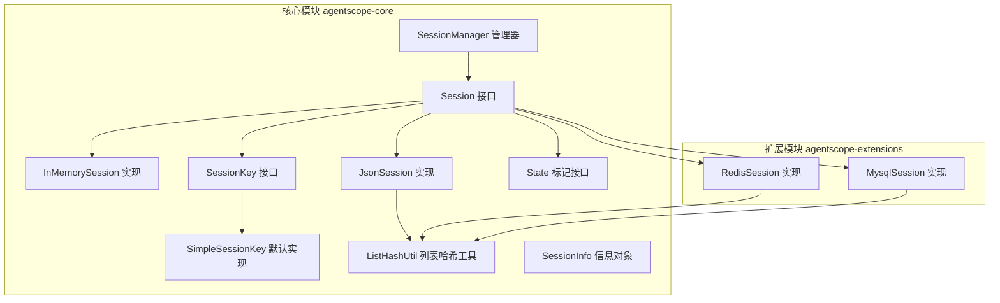
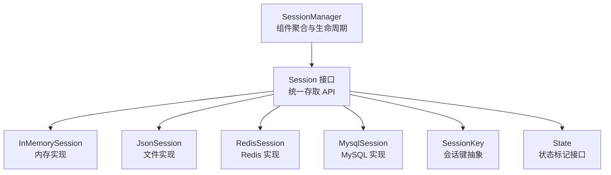
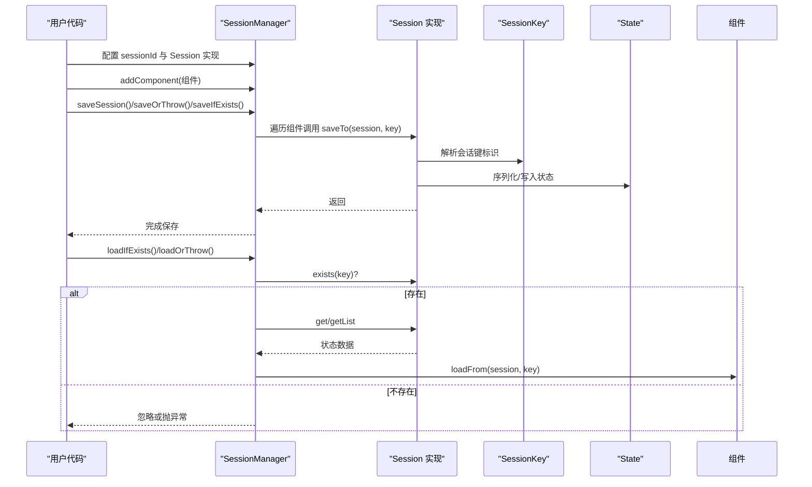
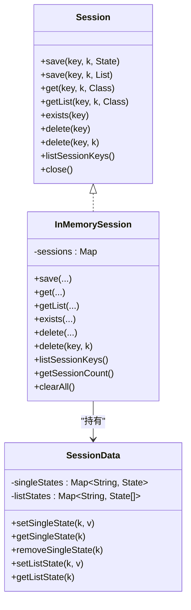
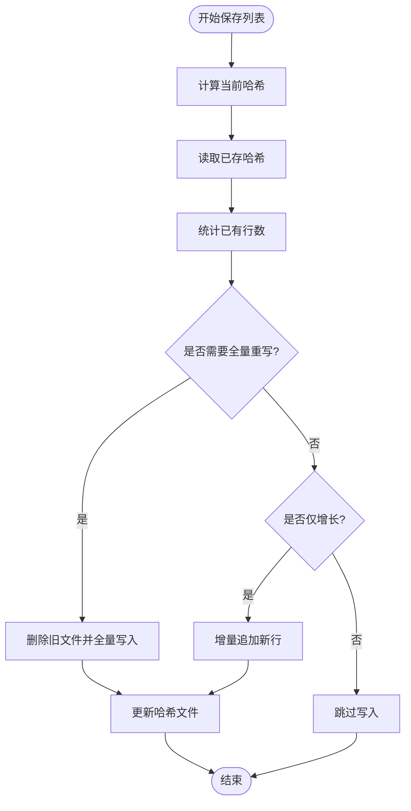
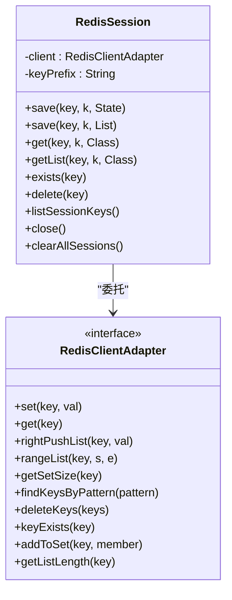
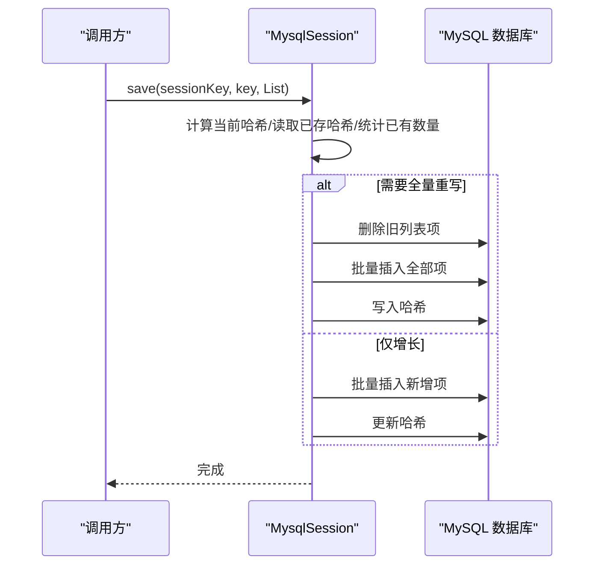
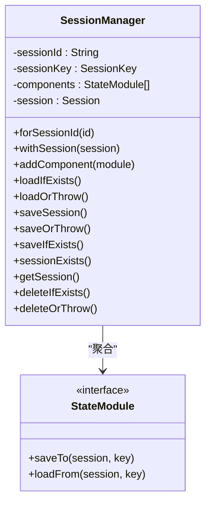
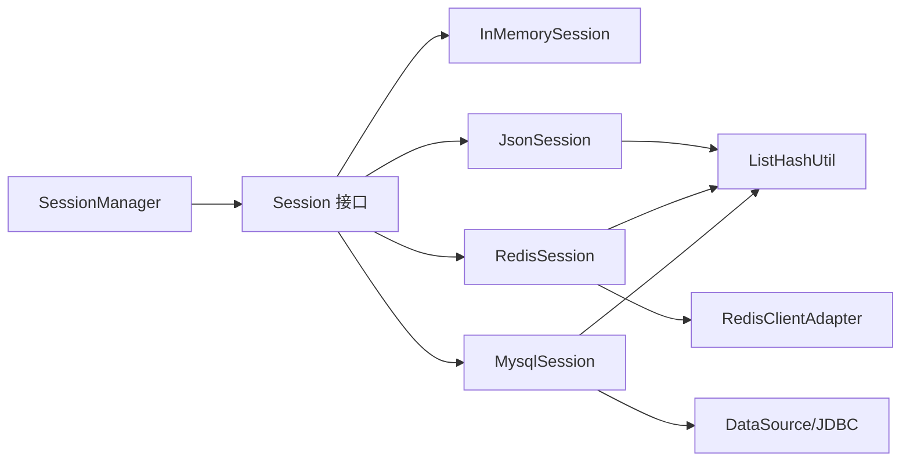

# 会话 API

<cite>
**本文引用的文件**
- [Session.java](file://agentscope-core/src/main/java/io/agentscope/core/session/Session.java)
- [InMemorySession.java](file://agentscope-core/src/main/java/io/agentscope/core/session/InMemorySession.java)
- [JsonSession.java](file://agentscope-core/src/main/java/io/agentscope/core/session/JsonSession.java)
- [RedisSession.java](file://agentscope-extensions/agentscope-extensions-session-redis/src/main/java/io/agentscope/core/session/redis/RedisSession.java)
- [MysqlSession.java](file://agentscope-extensions/agentscope-extensions-session-mysql/src/main/java/io/agentscope/core/session/mysql/MysqlSession.java)
- [ListHashUtil.java](file://agentscope-core/src/main/java/io/agentscope/core/session/ListHashUtil.java)
- [SessionManager.java](file://agentscope-core/src/main/java/io/agentscope/core/session/SessionManager.java)
- [SessionInfo.java](file://agentscope-core/src/main/java/io/agentscope/core/session/SessionInfo.java)
- [SessionKey.java](file://agentscope-core/src/main/java/io/agentscope/core/state/SessionKey.java)
- [SimpleSessionKey.java](file://agentscope-core/src/main/java/io/agentscope/core/state/SimpleSessionKey.java)
- [State.java](file://agentscope-core/src/main/java/io/agentscope/core/state/State.java)
- [SessionManagerTest.java](file://agentscope-core/src/test/java/io/agentscope/core/session/SessionManagerTest.java)
- [JsonSessionNewApiTest.java](file://agentscope-core/src/test/java/io/agentscope/core/session/JsonSessionNewApiTest.java)
</cite>

## 目录
1. [简介](#简介)
2. [项目结构](#项目结构)
3. [核心组件](#核心组件)
4. [架构总览](#架构总览)
5. [详细组件分析](#详细组件分析)
6. [依赖关系分析](#依赖关系分析)
7. [性能考量](#性能考量)
8. [故障排查指南](#故障排查指南)
9. [结论](#结论)
10. [附录](#附录)

## 简介
本参考文档面向 AgentScope Java 的会话管理 API，系统性阐述 Session 接口及其多种实现（内存、JSON 文件、MySQL、Redis），并给出会话管理的完整流程、持久化与状态恢复策略、配置与最佳实践、键管理与清理等关键主题。文档同时提供基于源码路径的示例定位，帮助读者快速在工程中落地使用。

## 项目结构
围绕会话能力的核心代码位于 agentscope-core 模块的 session 包，扩展实现位于 agentscope-extensions 对应子模块。状态模型与会话键定义位于 agentscope-core 的 state 包。

图示来源
- [Session.java:53-146](file://agentscope-core/src/main/java/io/agentscope/core/session/Session.java#L53-L146)
- [InMemorySession.java:58-250](file://agentscope-core/src/main/java/io/agentscope/core/session/InMemorySession.java#L58-L250)
- [JsonSession.java:58-510](file://agentscope-core/src/main/java/io/agentscope/core/session/JsonSession.java#L58-L510)
- [RedisSession.java:179-484](file://agentscope-extensions/agentscope-extensions-session-redis/src/main/java/io/agentscope/core/session/redis/RedisSession.java#L179-L484)
- [MysqlSession.java:70-847](file://agentscope-extensions/agentscope-extensions-session-mysql/src/main/java/io/agentscope/core/session/mysql/MysqlSession.java#L70-L847)
- [SessionManager.java:61-261](file://agentscope-core/src/main/java/io/agentscope/core/session/SessionManager.java#L61-L261)
- [SessionKey.java:46-63](file://agentscope-core/src/main/java/io/agentscope/core/state/SessionKey.java#L46-L63)
- [SimpleSessionKey.java:37-71](file://agentscope-core/src/main/java/io/agentscope/core/state/SimpleSessionKey.java#L37-L71)
- [State.java:18-48](file://agentscope-core/src/main/java/io/agentscope/core/state/State.java#L18-L48)
- [ListHashUtil.java:49-173](file://agentscope-core/src/main/java/io/agentscope/core/session/ListHashUtil.java#L49-L173)
- [SessionInfo.java:25-94](file://agentscope-core/src/main/java/io/agentscope/core/session/SessionInfo.java#L25-L94)

章节来源
- [Session.java:24-52](file://agentscope-core/src/main/java/io/agentscope/core/session/Session.java#L24-L52)
- [SessionManager.java:24-60](file://agentscope-core/src/main/java/io/agentscope/core/session/SessionManager.java#L24-L60)

## 核心组件
- Session 接口：定义统一的会话存取 API，支持单值保存/读取、列表增量/全量写入、存在性检查、删除、列出所有会话键、关闭资源等。
- SessionManager：提供面向组件的会话管理入口，通过链式 API 将多个 StateModule 组件一次性加载/保存，简化调用。
- 多实现：
  - InMemorySession：内存存储，线程安全，适合单进程、无需跨重启持久化的场景。
  - JsonSession：文件系统 JSON/JSONL 存储，支持增量追加与哈希检测，适合本地开发与小规模部署。
  - RedisSession：多客户端适配（Jedis/Lettuce/Redisson），键空间设计清晰，适合分布式与高并发场景。
  - MysqlSession：关系型数据库存储，支持增量插入、哈希检测、自动建库建表或严格校验模式。
- ListHashUtil：列表变更检测工具，用于判断是否需要全量重写或仅增量追加。
- 键与状态模型：SessionKey 定义会话标识抽象；State 为可持久化状态标记接口；SimpleSessionKey 提供默认字符串标识。

章节来源
- [Session.java:53-146](file://agentscope-core/src/main/java/io/agentscope/core/session/Session.java#L53-L146)
- [SessionManager.java:61-261](file://agentscope-core/src/main/java/io/agentscope/core/session/SessionManager.java#L61-L261)
- [InMemorySession.java:58-250](file://agentscope-core/src/main/java/io/agentscope/core/session/InMemorySession.java#L58-L250)
- [JsonSession.java:58-510](file://agentscope-core/src/main/java/io/agentscope/core/session/JsonSession.java#L58-L510)
- [RedisSession.java:179-484](file://agentscope-extensions/agentscope-extensions-session-redis/src/main/java/io/agentscope/core/session/redis/RedisSession.java#L179-L484)
- [MysqlSession.java:70-847](file://agentscope-extensions/agentscope-extensions-session-mysql/src/main/java/io/agentscope/core/session/mysql/MysqlSession.java#L70-L847)
- [ListHashUtil.java:49-173](file://agentscope-core/src/main/java/io/agentscope/core/session/ListHashUtil.java#L49-L173)
- [SessionKey.java:46-63](file://agentscope-core/src/main/java/io/agentscope/core/state/SessionKey.java#L46-L63)
- [SimpleSessionKey.java:37-71](file://agentscope-core/src/main/java/io/agentscope/core/state/SimpleSessionKey.java#L37-L71)
- [State.java:18-48](file://agentscope-core/src/main/java/io/agentscope/core/state/State.java#L18-L48)

## 架构总览
下图展示了会话管理的整体架构：上层通过 SessionManager 聚合多个 StateModule，底层由具体 Session 实现负责数据持久化；键与状态模型贯穿于整个流程。

图示来源
- [SessionManager.java:61-261](file://agentscope-core/src/main/java/io/agentscope/core/session/SessionManager.java#L61-L261)
- [Session.java:53-146](file://agentscope-core/src/main/java/io/agentscope/core/session/Session.java#L53-L146)
- [InMemorySession.java:58-250](file://agentscope-core/src/main/java/io/agentscope/core/session/InMemorySession.java#L58-L250)
- [JsonSession.java:58-510](file://agentscope-core/src/main/java/io/agentscope/core/session/JsonSession.java#L58-L510)
- [RedisSession.java:179-484](file://agentscope-extensions/agentscope-extensions-session-redis/src/main/java/io/agentscope/core/session/redis/RedisSession.java#L179-L484)
- [MysqlSession.java:70-847](file://agentscope-extensions/agentscope-extensions-session-mysql/src/main/java/io/agentscope/core/session/mysql/MysqlSession.java#L70-L847)
- [SessionKey.java:46-63](file://agentscope-core/src/main/java/io/agentscope/core/state/SessionKey.java#L46-L63)
- [State.java:18-48](file://agentscope-core/src/main/java/io/agentscope/core/state/State.java#L18-L48)

## 详细组件分析

### Session 接口与会话管理流程
- 方法概览
  - 单值存取：save(SessionKey, String, State)，get(SessionKey, String, Class)
  - 列表存取：save(SessionKey, String, List)，getList(SessionKey, String, Class)
  - 生命周期：exists(SessionKey)，delete(SessionKey)，delete(SessionKey, String)，listSessionKeys()
  - 资源管理：close()
- 典型流程
  - 初始化：选择具体 Session 实现（如 JsonSession/RedisSession/MysqlSession）
  - 加载：exists 检查是否存在；存在则通过 SessionManager 或直接调用 get/getList
  - 保存：通过 SessionManager.addComponent 并 saveSession/saveOrThrow/saveIfExists
  - 清理：delete/deleteIfExists/deleteOrThrow
- 关键行为差异
  - 列表保存策略：JsonSession 支持增量追加与全量重写；InMemorySession 替换整列
  - 变更检测：各实现普遍依赖 ListHashUtil 进行哈希比对，决定是否需要全量重写

图示来源
- [SessionManager.java:130-202](file://agentscope-core/src/main/java/io/agentscope/core/session/SessionManager.java#L130-L202)
- [Session.java:55-104](file://agentscope-core/src/main/java/io/agentscope/core/session/Session.java#L55-L104)
- [SessionKey.java:48-61](file://agentscope-core/src/main/java/io/agentscope/core/state/SessionKey.java#L48-L61)

章节来源
- [Session.java:53-146](file://agentscope-core/src/main/java/io/agentscope/core/session/Session.java#L53-L146)
- [SessionManager.java:61-261](file://agentscope-core/src/main/java/io/agentscope/core/session/SessionManager.java#L61-L261)

### InMemorySession（内存实现）
- 特点
  - 基于并发安全 Map 存储，线程安全；单值保存为替换，列表保存为整列替换
  - 不跨进程/进程重启持久化，适合测试或单实例场景
- 关键方法
  - save(SessionKey, key, State/ List)：替换/整列替换
  - get/getList：类型校验后返回
  - delete(SessionKey, key)：按键删除单值
  - listSessionKeys：从键集合转换
- 适用场景
  - 单机应用、临时状态、单元测试

图示来源
- [Session.java:53-146](file://agentscope-core/src/main/java/io/agentscope/core/session/Session.java#L53-L146)
- [InMemorySession.java:58-250](file://agentscope-core/src/main/java/io/agentscope/core/session/InMemorySession.java#L58-L250)

章节来源
- [InMemorySession.java:28-222](file://agentscope-core/src/main/java/io/agentscope/core/session/InMemorySession.java#L28-L222)

### JsonSession（文件实现）
- 特点
  - 每个会话一个目录，单值以 .json 存储，列表以 .jsonl 存储
  - 列表采用哈希检测与增量追加策略，避免全量写入
  - 支持自定义存储目录，文件名安全处理（特殊字符转义）
- 关键方法
  - save(key, k, State)：写入单值 JSON
  - save(key, k, List)：计算哈希，必要时全量重写，否则增量追加
  - get/getList：读取 JSON/JSONL
  - delete：递归删除会话目录
  - listSessionKeys：扫描目录获取会话键
- 适用场景
  - 本地开发、小规模生产、跨进程共享但不强一致要求

图示来源
- [JsonSession.java:127-162](file://agentscope-core/src/main/java/io/agentscope/core/session/JsonSession.java#L127-L162)
- [ListHashUtil.java:148-171](file://agentscope-core/src/main/java/io/agentscope/core/session/ListHashUtil.java#L148-L171)

章节来源
- [JsonSession.java:42-510](file://agentscope-core/src/main/java/io/agentscope/core/session/JsonSession.java#L42-L510)
- [ListHashUtil.java:49-173](file://agentscope-core/src/main/java/io/agentscope/core/session/ListHashUtil.java#L49-L173)

### RedisSession（Redis 实现）
- 特点
  - 支持 Jedis/Lettuce/Redisson 多客户端适配
  - 键命名规范：单值 {prefix}{sessionId}:{key}，列表 {prefix}{sessionId}:{key}:list，哈希 {prefix}{sessionId}:{key}:list:_hash，会话键集合 {prefix}{sessionId}:_keys
  - 列表同样采用哈希检测与增量追加策略
- 关键方法
  - save(key, k, State/ List)：字符串/列表写入，维护会话键集合
  - get/getList：读取 JSON 字符串并反序列化
  - delete：遍历跟踪键集合，删除相关键
  - listSessionKeys：通过模式匹配 {prefix}*:_keys 提取会话 ID
  - close：关闭底层客户端
- 适用场景
  - 分布式系统、高并发、需要原子性与一致性保障

图示来源
- [RedisSession.java:179-484](file://agentscope-extensions/agentscope-extensions-session-redis/src/main/java/io/agentscope/core/session/redis/RedisSession.java#L179-L484)

章节来源
- [RedisSession.java:39-484](file://agentscope-extensions/agentscope-extensions-session-redis/src/main/java/io/agentscope/core/session/redis/RedisSession.java#L39-L484)

### MysqlSession（MySQL 实现）
- 特点
  - 表结构：session_id、state_key、item_index、state_data，主键复合索引
  - 列表采用“仅追加”策略（批量插入新项），通过哈希检测判断是否需要全量重写
  - 支持自动建库建表或严格存在性校验；SQL 注入防护（参数化查询）
- 关键方法
  - save(key, k, State/ List)：单值 UPSERT，列表按需全量重写或增量插入
  - get/getList：按主键或排序读取
  - exists/delete/listSessionKeys：基于表记录的查询与清理
  - truncateAllSessions：清空表（DDL，隐式提交）
- 适用场景
  - 需要强一致性的关系型存储、审计与回溯需求

图示来源
- [MysqlSession.java:374-418](file://agentscope-extensions/agentscope-extensions-session-mysql/src/main/java/io/agentscope/core/session/mysql/MysqlSession.java#L374-L418)
- [ListHashUtil.java:148-171](file://agentscope-core/src/main/java/io/agentscope/core/session/ListHashUtil.java#L148-L171)

章节来源
- [MysqlSession.java:36-847](file://agentscope-extensions/agentscope-extensions-session-mysql/src/main/java/io/agentscope/core/session/mysql/MysqlSession.java#L36-L847)
- [ListHashUtil.java:49-173](file://agentscope-core/src/main/java/io/agentscope/core/session/ListHashUtil.java#L49-L173)

### SessionManager（会话管理器）
- 功能
  - 以 sessionId 为中心，注入任意 Session 实现
  - addComponent 聚合多个 StateModule，统一 saveTo/loadFrom
  - 提供 loadIfExists/loadOrThrow/saveSession/saveOrThrow/saveIfExists/sessionExists/deleteIfExists/deleteOrThrow 等高级操作
- 使用建议
  - 在应用启动时初始化 SessionManager，注入合适的 Session 实现
  - 将各业务组件注册到 SessionManager，集中进行加载/保存

图示来源
- [SessionManager.java:61-261](file://agentscope-core/src/main/java/io/agentscope/core/session/SessionManager.java#L61-L261)

章节来源
- [SessionManager.java:24-261](file://agentscope-core/src/main/java/io/agentscope/core/session/SessionManager.java#L24-L261)

### 会话键管理与状态模型
- SessionKey
  - toIdentifier：将复杂键结构序列化为字符串标识，便于存储层使用
  - 自定义实现可用于多租户等场景
- SimpleSessionKey
  - 默认字符串键，toIdentifier 直接返回 sessionId
- State
  - 可持久化状态标记接口，推荐使用不可变记录类型

章节来源
- [SessionKey.java:46-63](file://agentscope-core/src/main/java/io/agentscope/core/state/SessionKey.java#L46-L63)
- [SimpleSessionKey.java:37-71](file://agentscope-core/src/main/java/io/agentscope/core/state/SimpleSessionKey.java#L37-L71)
- [State.java:18-48](file://agentscope-core/src/main/java/io/agentscope/core/state/State.java#L18-L48)

## 依赖关系分析
- 耦合与内聚
  - Session 接口与各实现之间为高内聚低耦合设计，通过统一 API 适配不同存储介质
  - SessionManager 与 StateModule 通过回调接口解耦，便于扩展
- 外部依赖
  - RedisSession 依赖 Jedis/Lettuce/Redisson 客户端适配器
  - MysqlSession 依赖 DataSource 与 JDBC
  - JsonSession 依赖文件系统与 JSON 编解码
- 循环依赖
  - 未发现循环依赖；各实现独立实现 Session 接口

图示来源
- [SessionManager.java:61-261](file://agentscope-core/src/main/java/io/agentscope/core/session/SessionManager.java#L61-L261)
- [Session.java:53-146](file://agentscope-core/src/main/java/io/agentscope/core/session/Session.java#L53-L146)
- [RedisSession.java:179-484](file://agentscope-extensions/agentscope-extensions-session-redis/src/main/java/io/agentscope/core/session/redis/RedisSession.java#L179-L484)
- [MysqlSession.java:70-847](file://agentscope-extensions/agentscope-extensions-session-mysql/src/main/java/io/agentscope/core/session/mysql/MysqlSession.java#L70-L847)
- [JsonSession.java:58-510](file://agentscope-core/src/main/java/io/agentscope/core/session/JsonSession.java#L58-L510)
- [ListHashUtil.java:49-173](file://agentscope-core/src/main/java/io/agentscope/core/session/ListHashUtil.java#L49-L173)

章节来源
- [SessionManager.java:61-261](file://agentscope-core/src/main/java/io/agentscope/core/session/SessionManager.java#L61-L261)
- [Session.java:53-146](file://agentscope-core/src/main/java/io/agentscope/core/session/Session.java#L53-L146)

## 性能考量
- 列表写入策略
  - JsonSession/RedisSession/MysqlSession 均采用哈希检测与增量追加，避免全量写入带来的 IO 放大
- 存储介质特性
  - InMemorySession 无磁盘/网络开销，但不具备持久化能力
  - JsonSession 适合中小规模数据与本地场景
  - RedisSession 适合高并发与低延迟场景
  - MysqlSession 适合需要强一致与审计的场景
- 资源管理
  - 合理设置 Session 实现的连接池与超时参数
  - 使用 SessionManager 的 close 或实现的 close 释放资源

## 故障排查指南
- 常见问题
  - 未配置 Session：调用 SessionManager 的 save/load/delete 等方法会抛出非法状态异常
  - 会话不存在：loadOrThrow/deleteOrThrow 会抛出参数异常
  - 文件权限/路径错误：JsonSession 在创建目录或写入文件时可能抛出运行时异常
  - Redis/Mysql 连接失败：底层客户端异常会被包装为运行时异常
- 定位方法
  - 检查 SessionManager 的 withSession 是否正确传入
  - 检查 Session 实现的构造参数（目录、连接池、键前缀等）
  - 查看测试用例中的断言与异常场景，参考其使用方式

章节来源
- [SessionManagerTest.java:196-247](file://agentscope-core/src/test/java/io/agentscope/core/session/SessionManagerTest.java#L196-L247)
- [JsonSessionNewApiTest.java:220-258](file://agentscope-core/src/test/java/io/agentscope/core/session/JsonSessionNewApiTest.java#L220-L258)

## 结论
AgentScope Java 的会话 API 通过统一接口与管理器，屏蔽了不同存储介质的差异，提供了从单值到列表、从加载到保存、从存在性检查到清理的完整能力。结合哈希检测与增量策略，既保证了性能又兼顾了数据一致性。根据部署环境与一致性需求选择合适的实现（内存/文件/Redis/MySQL），并在工程中通过 SessionManager 统一接入，即可快速构建可靠的会话持久化与状态恢复体系。

## 附录
- 示例定位（代码片段路径）
  - 使用 SessionManager 保存与加载：[SessionManagerTest.java:84-127](file://agentscope-core/src/test/java/io/agentscope/core/session/SessionManagerTest.java#L84-L127)
  - JsonSession 新 API 测试（单值/列表/存在性/删除/枚举）：[JsonSessionNewApiTest.java:55-352](file://agentscope-core/src/test/java/io/agentscope/core/session/JsonSessionNewApiTest.java#L55-L352)
  - InMemorySession 列表替换语义说明：[InMemorySession.java:76-92](file://agentscope-core/src/main/java/io/agentscope/core/session/InMemorySession.java#L76-L92)
  - JsonSession 列表增量/全量策略：[JsonSession.java:127-162](file://agentscope-core/src/main/java/io/agentscope/core/session/JsonSession.java#L127-L162)
  - RedisSession 键命名与清理逻辑：[RedisSession.java:317-349](file://agentscope-extensions/agentscope-extensions-session-redis/src/main/java/io/agentscope/core/session/redis/RedisSession.java#L317-L349)
  - MysqlSession 列表全量重写与增量插入：[MysqlSession.java:374-418](file://agentscope-extensions/agentscope-extensions-session-mysql/src/main/java/io/agentscope/core/session/mysql/MysqlSession.java#L374-L418)
  - 列表哈希检测工具：[ListHashUtil.java:148-171](file://agentscope-core/src/main/java/io/agentscope/core/session/ListHashUtil.java#L148-L171)
  - 会话信息对象（大小/修改时间/组件数）：[SessionInfo.java:25-94](file://agentscope-core/src/main/java/io/agentscope/core/session/SessionInfo.java#L25-L94)