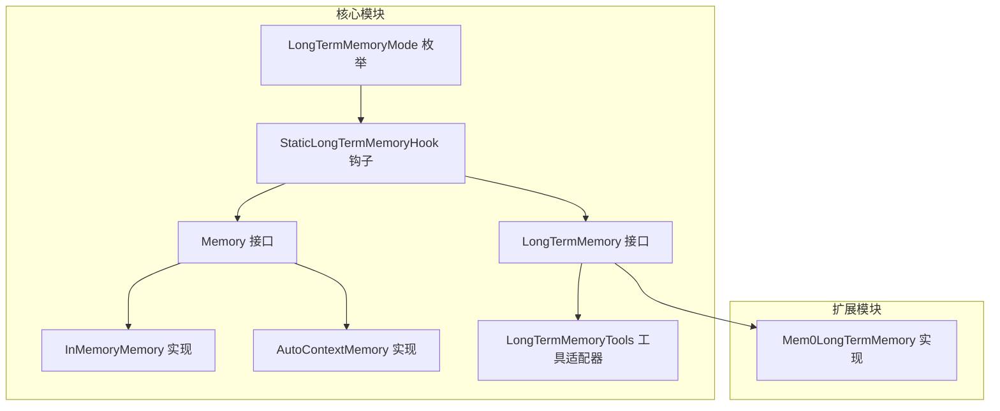
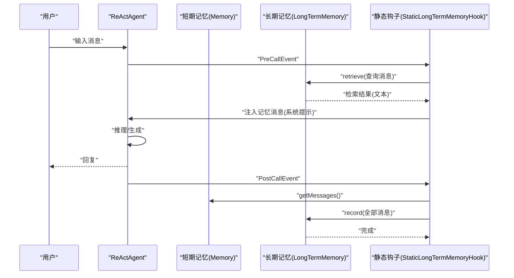
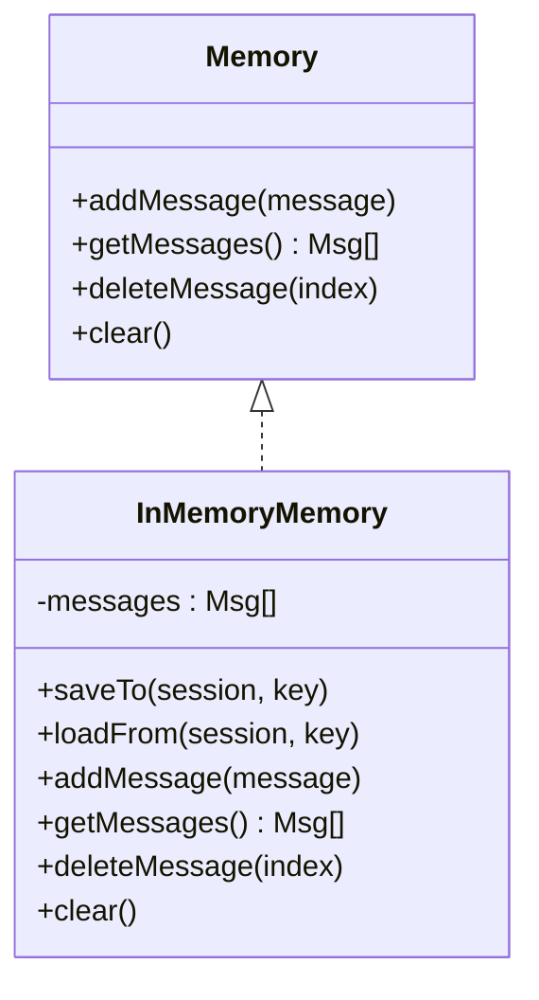
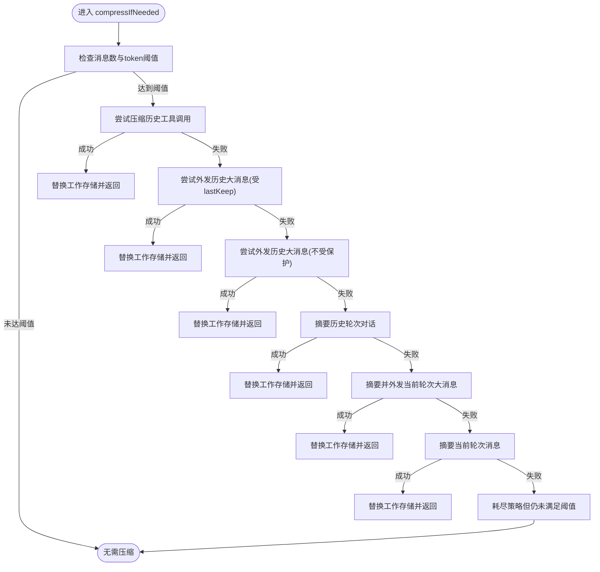
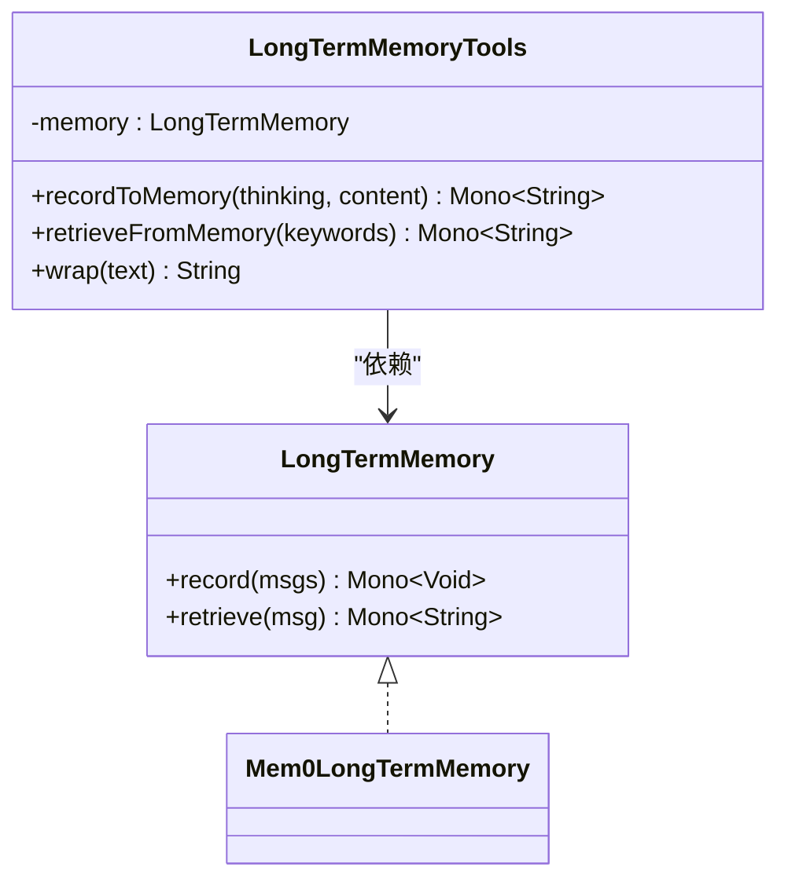
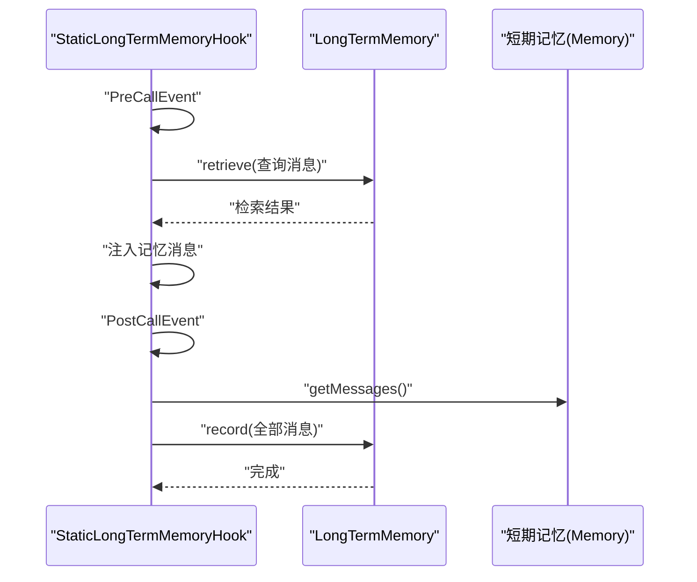
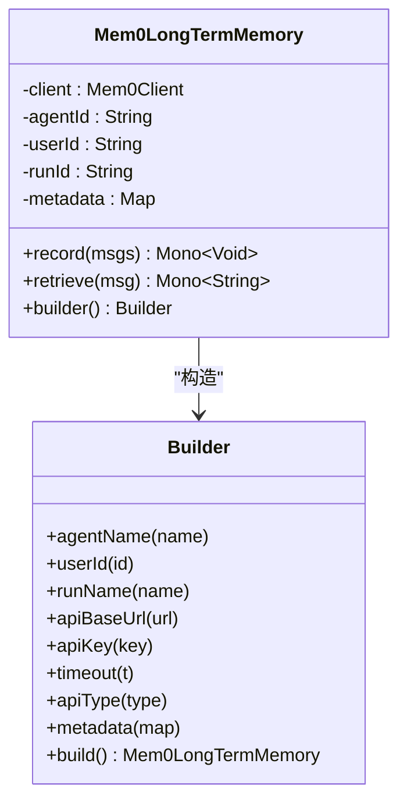
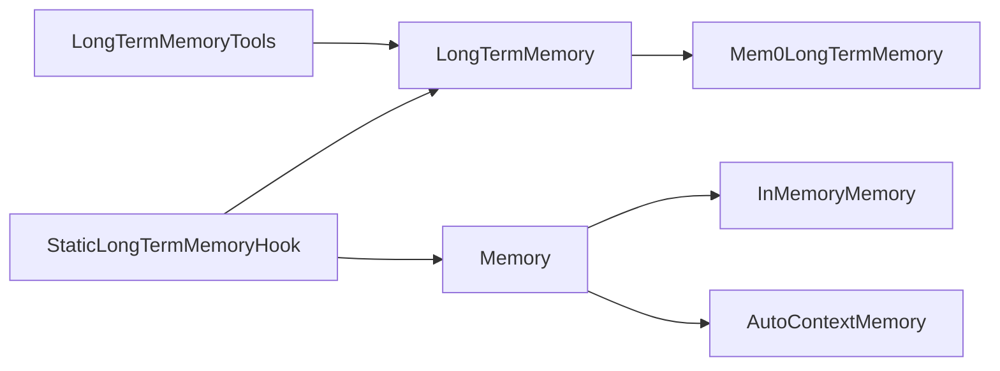

# 内存 API

<cite>
**本文引用的文件列表**
- [Memory.java](file://agentscope-core/src/main/java/io/agentscope/core/memory/Memory.java)
- [InMemoryMemory.java](file://agentscope-core/src/main/java/io/agentscope/core/memory/InMemoryMemory.java)
- [LongTermMemory.java](file://agentscope-core/src/main/java/io/agentscope/core/memory/LongTermMemory.java)
- [LongTermMemoryMode.java](file://agentscope-core/src/main/java/io/agentscope/core/memory/LongTermMemoryMode.java)
- [LongTermMemoryTools.java](file://agentscope-core/src/main/java/io/agentscope/core/memory/LongTermMemoryTools.java)
- [StaticLongTermMemoryHook.java](file://agentscope-core/src/main/java/io/agentscope/core/memory/StaticLongTermMemoryHook.java)
- [Mem0LongTermMemory.java](file://agentscope-extensions/agentscope-extensions-mem0/src/main/java/io/agentscope/core/memory/mem0/Mem0LongTermMemory.java)
- [AutoContextMemory.java](file://agentscope-extensions/agentscope-extensions-autocontext-memory/src/main/java/io/agentscope/core/memory/autocontext/AutoContextMemory.java)
- [InMemoryMemoryTest.java](file://agentscope-core/src/test/java/io/agentscope/core/memory/InMemoryMemoryTest.java)
- [LongTermMemoryToolsTest.java](file://agentscope-core/src/test/java/io/agentscope/core/memory/LongTermMemoryToolsTest.java)
- [ReActAgentLongTermMemoryConfigTest.java](file://agentscope-core/src/test/java/io/agentscope/core/agent/ReActAgentLongTermMemoryConfigTest.java)
- [Mem0Example.java](file://agentscope-examples/advanced/src/main/java/io/agentscope/examples/advanced/Mem0Example.java)
- [memory.md（英文）](file://docs/en/task/memory.md)
</cite>

## 目录
1. [简介](#简介)
2. [项目结构与定位](#项目结构与定位)
3. [核心组件总览](#核心组件总览)
4. [架构概览](#架构概览)
5. [详细组件分析](#详细组件分析)
6. [依赖关系分析](#依赖关系分析)
7. [性能与优化建议](#性能与优化建议)
8. [故障排查指南](#故障排查指南)
9. [结论](#结论)
10. [附录：API 使用示例与配置](#附录api-使用示例与配置)

## 简介
本文件为 AgentScope Java 内存管理 API 的权威参考，覆盖以下主题：
- Memory 接口及其方法语义与实现类 InMemoryMemory、AutoContextMemory 的行为差异
- 长期记忆接口 LongTermMemory 及其工具适配器 LongTermMemoryTools 的职责与用法
- 长期记忆模式 LongTermMemoryMode 的三种控制策略
- 框架自动钩子 StaticLongTermMemoryHook 的工作流程与异步记录策略
- 外部长期记忆实现示例（Mem0）
- 最佳实践、性能优化与持久化/状态恢复要点
- 完整的 API 使用示例与配置指南

## 项目结构与定位
- 核心内存接口与实现位于 agentscope-core 模块的 memory 包中
- 长期记忆扩展实现位于 agentscope-extensions 下的对应子模块（如 mem0、autocontext-memory）
- 示例与测试分别位于 examples 与 test 目录，便于快速上手与验证

图表来源
- [Memory.java:29-62](file://agentscope-core/src/main/java/io/agentscope/core/memory/Memory.java#L29-L62)
- [InMemoryMemory.java:33-127](file://agentscope-core/src/main/java/io/agentscope/core/memory/InMemoryMemory.java#L33-L127)
- [AutoContextMemory.java:81-800](file://agentscope-extensions/agentscope-extensions-autocontext-memory/src/main/java/io/agentscope/core/memory/autocontext/AutoContextMemory.java#L81-L800)
- [LongTermMemory.java:67-107](file://agentscope-core/src/main/java/io/agentscope/core/memory/LongTermMemory.java#L67-L107)
- [LongTermMemoryTools.java:65-214](file://agentscope-core/src/main/java/io/agentscope/core/memory/LongTermMemoryTools.java#L65-L214)
- [LongTermMemoryMode.java:52-68](file://agentscope-core/src/main/java/io/agentscope/core/memory/LongTermMemoryMode.java#L52-L68)
- [StaticLongTermMemoryHook.java:75-298](file://agentscope-core/src/main/java/io/agentscope/core/memory/StaticLongTermMemoryHook.java#L75-L298)
- [Mem0LongTermMemory.java:113-440](file://agentscope-extensions/agentscope-extensions-mem0/src/main/java/io/agentscope/core/memory/mem0/Mem0LongTermMemory.java#L113-L440)

章节来源
- [Memory.java:22-62](file://agentscope-core/src/main/java/io/agentscope/core/memory/Memory.java#L22-L62)
- [LongTermMemory.java:22-107](file://agentscope-core/src/main/java/io/agentscope/core/memory/LongTermMemory.java#L22-L107)
- [LongTermMemoryMode.java:18-68](file://agentscope-core/src/main/java/io/agentscope/core/memory/LongTermMemoryMode.java#L18-L68)
- [LongTermMemoryTools.java:27-214](file://agentscope-core/src/main/java/io/agentscope/core/memory/LongTermMemoryTools.java#L27-L214)
- [StaticLongTermMemoryHook.java:35-298](file://agentscope-core/src/main/java/io/agentscope/core/memory/StaticLongTermMemoryHook.java#L35-L298)
- [Mem0LongTermMemory.java:27-440](file://agentscope-extensions/agentscope-extensions-mem0/src/main/java/io/agentscope/core/memory/mem0/Mem0LongTermMemory.java#L27-L440)
- [AutoContextMemory.java:47-800](file://agentscope-extensions/agentscope-extensions-autocontext-memory/src/main/java/io/agentscope/core/memory/autocontext/AutoContextMemory.java#L47-L800)

## 核心组件总览
- Memory 接口：定义短期记忆的基本能力（添加消息、读取消息、删除指定索引消息、清空），并继承状态模块接口以便会话持久化。
- InMemoryMemory：基于线程安全集合的内存实现，支持保存/加载到会话，适合单进程/单实例场景。
- AutoContextMemory：在 Memory 基础上提供智能压缩与上下文管理，适用于长对话与高 token 场景。
- LongTermMemory 接口：定义长期记忆的记录与检索能力，返回响应式 Mono，便于非阻塞集成。
- LongTermMemoryTools：将核心 API 适配为可被代理使用的工具函数，便于 AGENT_CONTROL 模式下由代理主动操作长期记忆。
- LongTermMemoryMode：控制长期记忆的管理模式（AGENT_CONTROL、STATIC_CONTROL、BOTH）。
- StaticLongTermMemoryHook：框架级钩子，在推理前注入检索到的记忆，在推理后记录对话，支持同步/异步记录。
- Mem0LongTermMemory：基于 Mem0 的长期记忆实现，支持多租户元数据隔离、向量检索与 LLM 提取。

章节来源
- [Memory.java:29-62](file://agentscope-core/src/main/java/io/agentscope/core/memory/Memory.java#L29-L62)
- [InMemoryMemory.java:33-127](file://agentscope-core/src/main/java/io/agentscope/core/memory/InMemoryMemory.java#L33-L127)
- [AutoContextMemory.java:81-800](file://agentscope-extensions/agentscope-extensions-autocontext-memory/src/main/java/io/agentscope/core/memory/autocontext/AutoContextMemory.java#L81-L800)
- [LongTermMemory.java:67-107](file://agentscope-core/src/main/java/io/agentscope/core/memory/LongTermMemory.java#L67-L107)
- [LongTermMemoryTools.java:65-214](file://agentscope-core/src/main/java/io/agentscope/core/memory/LongTermMemoryTools.java#L65-L214)
- [LongTermMemoryMode.java:52-68](file://agentscope-core/src/main/java/io/agentscope/core/memory/LongTermMemoryMode.java#L52-L68)
- [StaticLongTermMemoryHook.java:75-298](file://agentscope-core/src/main/java/io/agentscope/core/memory/StaticLongTermMemoryHook.java#L75-L298)
- [Mem0LongTermMemory.java:113-440](file://agentscope-extensions/agentscope-extensions-mem0/src/main/java/io/agentscope/core/memory/mem0/Mem0LongTermMemory.java#L113-L440)

## 架构概览
短期记忆与长期记忆在 ReActAgent 中协同工作：
- 短期记忆负责当前会话的历史，通过会话持久化实现状态恢复
- 长期记忆负责跨会话的知识沉淀与检索，支持自动或代理主动控制

图表来源
- [StaticLongTermMemoryHook.java:151-259](file://agentscope-core/src/main/java/io/agentscope/core/memory/StaticLongTermMemoryHook.java#L151-L259)
- [LongTermMemory.java:69-106](file://agentscope-core/src/main/java/io/agentscope/core/memory/LongTermMemory.java#L69-L106)
- [Memory.java:31-61](file://agentscope-core/src/main/java/io/agentscope/core/memory/Memory.java#L31-L61)

章节来源
- [StaticLongTermMemoryHook.java:121-259](file://agentscope-core/src/main/java/io/agentscope/core/memory/StaticLongTermMemoryHook.java#L121-L259)
- [LongTermMemory.java:69-106](file://agentscope-core/src/main/java/io/agentscope/core/memory/LongTermMemory.java#L69-L106)
- [Memory.java:31-61](file://agentscope-core/src/main/java/io/agentscope/core/memory/Memory.java#L31-L61)
- [memory.md（英文）:1-25](file://docs/en/task/memory.md#L1-L25)

## 详细组件分析

### Memory 接口与 InMemoryMemory 实现
- 接口职责
  - addMessage：添加一条消息
  - getMessages：返回所有非空消息（过滤 null）
  - deleteMessage：按索引删除消息；越界视为无操作
  - clear：清空所有消息
- InMemoryMemory 特性
  - 使用线程安全集合存储消息，保证并发读写安全
  - 实现状态模块接口，支持保存/加载到会话，键名采用统一前缀
  - 删除与清空均为无异常的安全操作，避免并发修改导致的不一致

图表来源
- [Memory.java:29-62](file://agentscope-core/src/main/java/io/agentscope/core/memory/Memory.java#L29-L62)
- [InMemoryMemory.java:33-127](file://agentscope-core/src/main/java/io/agentscope/core/memory/InMemoryMemory.java#L33-L127)

章节来源
- [Memory.java:31-61](file://agentscope-core/src/main/java/io/agentscope/core/memory/Memory.java#L31-L61)
- [InMemoryMemory.java:57-126](file://agentscope-core/src/main/java/io/agentscope/core/memory/InMemoryMemory.java#L57-L126)
- [InMemoryMemoryTest.java:37-175](file://agentscope-core/src/test/java/io/agentscope/core/memory/InMemoryMemoryTest.java#L37-L175)

### AutoContextMemory：智能上下文压缩与管理
- 设计目标
  - 在对话历史超过阈值时自动触发压缩策略，降低 token 使用
  - 保留关键信息，避免简单截断
  - 支持内容外发（offload）与摘要生成，配合 UUID 进行按需加载
- 存储结构
  - workingMemoryStorage：用于实际对话的压缩/外发后的消息
  - originalMemoryStorage：完整未压缩的历史副本，用于追踪与回溯
- 压缩策略（顺序执行）
  1) 压缩历史轮次的工具调用
  2) 外发历史轮次大消息（受 lastKeep 保护）
  3) 外发历史轮次大消息（不受 lastKeep 保护）
  4) 摘要历史轮次对话
  5) 摘要并外发当前轮次大消息
  6) 摘要当前轮次消息
- 关键方法
  - addMessage/getMessages：维护双存储并提供只读视图
  - compressIfNeeded：根据阈值触发压缩策略，返回是否发生压缩
  - 其他内部方法负责工具调用压缩、大消息摘要、外发与元数据记录等

图表来源
- [AutoContextMemory.java:184-305](file://agentscope-extensions/agentscope-extensions-autocontext-memory/src/main/java/io/agentscope/core/memory/autocontext/AutoContextMemory.java#L184-L305)

章节来源
- [AutoContextMemory.java:47-800](file://agentscope-extensions/agentscope-extensions-autocontext-memory/src/main/java/io/agentscope/core/memory/autocontext/AutoContextMemory.java#L47-L800)

### LongTermMemory 接口与工具适配器
- LongTermMemory
  - record(List<Msg>)：记录消息到长期存储，异步返回 Mono<Void>
  - retrieve(Msg)：基于查询消息检索相关记忆，异步返回 Mono<String>
- LongTermMemoryTools
  - 将 record/retrieve 适配为代理可用的工具函数
  - recordToMemory：接收“思考”和“要点列表”，构建消息并调用底层 record
  - retrieveFromMemory：接收关键词列表，拼接为查询消息并调用底层 retrieve，包装检索结果
  - wrap：对检索结果进行标签包裹，便于代理识别

图表来源
- [LongTermMemory.java:67-107](file://agentscope-core/src/main/java/io/agentscope/core/memory/LongTermMemory.java#L67-L107)
- [LongTermMemoryTools.java:65-214](file://agentscope-core/src/main/java/io/agentscope/core/memory/LongTermMemoryTools.java#L65-L214)
- [Mem0LongTermMemory.java:113-440](file://agentscope-extensions/agentscope-extensions-mem0/src/main/java/io/agentscope/core/memory/mem0/Mem0LongTermMemory.java#L113-L440)

章节来源
- [LongTermMemory.java:69-106](file://agentscope-core/src/main/java/io/agentscope/core/memory/LongTermMemory.java#L69-L106)
- [LongTermMemoryTools.java:94-212](file://agentscope-core/src/main/java/io/agentscope/core/memory/LongTermMemoryTools.java#L94-L212)
- [LongTermMemoryToolsTest.java:52-337](file://agentscope-core/src/test/java/io/agentscope/core/memory/LongTermMemoryToolsTest.java#L52-L337)

### 长期记忆模式与框架钩子
- LongTermMemoryMode
  - AGENT_CONTROL：代理主动控制记忆（注册工具）
  - STATIC_CONTROL：框架自动控制记忆（钩子自动检索/记录）
  - BOTH：结合两者，推荐默认
- StaticLongTermMemoryHook
  - PreCallEvent：从输入消息提取最后一条用户消息作为查询，调用 retrieve 并将结果以系统消息形式注入
  - PostCallEvent：从短期记忆读取全部消息，调用 record 记录到长期存储
  - 支持同步/异步记录，异步路径使用有界调度器限制并发与队列长度，避免背压无限增长

图表来源
- [StaticLongTermMemoryHook.java:151-259](file://agentscope-core/src/main/java/io/agentscope/core/memory/StaticLongTermMemoryHook.java#L151-L259)

章节来源
- [LongTermMemoryMode.java:29-68](file://agentscope-core/src/main/java/io/agentscope/core/memory/LongTermMemoryMode.java#L29-L68)
- [StaticLongTermMemoryHook.java:75-298](file://agentscope-core/src/main/java/io/agentscope/core/memory/StaticLongTermMemoryHook.java#L75-L298)
- [ReActAgentLongTermMemoryConfigTest.java:149-174](file://agentscope-core/src/test/java/io/agentscope/core/agent/ReActAgentLongTermMemoryConfigTest.java#L149-L174)

### Mem0 长期记忆实现
- 特性
  - 基于向量检索与 LLM 推理的记忆提取
  - 多租户隔离：agentId、userId、runId 三元元数据
  - 自定义元数据 filters：检索时自动合并
  - 异步非阻塞：基于 Reactor Mono
- 关键点
  - record：过滤空消息，转换为 Mem0Message，发送至 Mem0 API
  - retrieve：构建搜索请求，返回合并后的检索文本
  - Builder：支持 apiBaseUrl、apiKey、apiType、timeout、metadata 等配置

图表来源
- [Mem0LongTermMemory.java:113-440](file://agentscope-extensions/agentscope-extensions-mem0/src/main/java/io/agentscope/core/memory/mem0/Mem0LongTermMemory.java#L113-L440)

章节来源
- [Mem0LongTermMemory.java:27-440](file://agentscope-extensions/agentscope-extensions-mem0/src/main/java/io/agentscope/core/memory/mem0/Mem0LongTermMemory.java#L27-L440)
- [Mem0Example.java:33-99](file://agentscope-examples/advanced/src/main/java/io/agentscope/examples/advanced/Mem0Example.java#L33-L99)

## 依赖关系分析
- 组件耦合
  - Memory 与 InMemoryMemory、AutoContextMemory：实现关系
  - LongTermMemory 与 Mem0LongTermMemory：实现关系
  - LongTermMemoryTools 依赖 LongTermMemory
  - StaticLongTermMemoryHook 同时依赖 LongTermMemory 与 Memory，并在事件流中协调
- 外部依赖
  - Reactor Mono：用于非阻塞异步
  - 日志：用于异步记录失败等告警
  - 会话与状态模块：用于短期记忆的持久化与恢复

图表来源
- [Memory.java:29-62](file://agentscope-core/src/main/java/io/agentscope/core/memory/Memory.java#L29-L62)
- [InMemoryMemory.java:33-127](file://agentscope-core/src/main/java/io/agentscope/core/memory/InMemoryMemory.java#L33-L127)
- [AutoContextMemory.java:81-800](file://agentscope-extensions/agentscope-extensions-autocontext-memory/src/main/java/io/agentscope/core/memory/autocontext/AutoContextMemory.java#L81-L800)
- [LongTermMemory.java:67-107](file://agentscope-core/src/main/java/io/agentscope/core/memory/LongTermMemory.java#L67-L107)
- [LongTermMemoryTools.java:65-214](file://agentscope-core/src/main/java/io/agentscope/core/memory/LongTermMemoryTools.java#L65-L214)
- [StaticLongTermMemoryHook.java:75-298](file://agentscope-core/src/main/java/io/agentscope/core/memory/StaticLongTermMemoryHook.java#L75-L298)
- [Mem0LongTermMemory.java:113-440](file://agentscope-extensions/agentscope-extensions-mem0/src/main/java/io/agentscope/core/memory/mem0/Mem0LongTermMemory.java#L113-L440)

章节来源
- [StaticLongTermMemoryHook.java:108-119](file://agentscope-core/src/main/java/io/agentscope/core/memory/StaticLongTermMemoryHook.java#L108-L119)

## 性能与优化建议
- 短期记忆（InMemoryMemory）
  - 使用线程安全集合，适合单实例场景；若需要分布式共享，应结合外部会话存储（如 JSON/Redis 等）
  - 对频繁读取场景，注意 getMessages 返回的是复制列表，避免外部持有过久导致锁竞争
- 长期记忆（Mem0）
  - 异步记录：在高吞吐场景启用异步记录，避免阻塞主推理链路
  - 有界调度器：异步记录使用有界弹性调度器，防止任务积压导致资源耗尽
  - 元数据过滤：合理设置 metadata/filters，减少检索范围，提升检索效率
- 上下文压缩（AutoContextMemory）
  - 合理设置阈值（消息数、token 比例、大消息阈值），避免过度压缩影响理解
  - 利用 offload 与摘要，平衡上下文窗口与信息完整性
  - 记录压缩事件，便于后续分析与调参

章节来源
- [StaticLongTermMemoryHook.java:78-83](file://agentscope-core/src/main/java/io/agentscope/core/memory/StaticLongTermMemoryHook.java#L78-L83)
- [StaticLongTermMemoryHook.java:226-245](file://agentscope-core/src/main/java/io/agentscope/core/memory/StaticLongTermMemoryHook.java#L226-L245)
- [AutoContextMemory.java:184-305](file://agentscope-extensions/agentscope-extensions-autocontext-memory/src/main/java/io/agentscope/core/memory/autocontext/AutoContextMemory.java#L184-L305)

## 故障排查指南
- 记忆检索失败
  - 检查 LongTermMemory 实现的网络连通性与鉴权配置
  - 查看钩子日志中的警告信息，确认检索/记录错误已被降级处理
- 异步记录未生效
  - 确认已启用异步记录，检查有界调度器是否饱和（新任务会被丢弃）
  - 观察日志中关于异步记录失败的告警
- 工具调用无效
  - AGENT_CONTROL 模式下确保工具已正确注册
  - 检查 LongTermMemoryTools 的参数校验（空内容、空关键词等）

章节来源
- [StaticLongTermMemoryHook.java:188-195](file://agentscope-core/src/main/java/io/agentscope/core/memory/StaticLongTermMemoryHook.java#L188-L195)
- [StaticLongTermMemoryHook.java:235-242](file://agentscope-core/src/main/java/io/agentscope/core/memory/StaticLongTermMemoryHook.java#L235-L242)
- [LongTermMemoryToolsTest.java:168-177](file://agentscope-core/src/test/java/io/agentscope/core/memory/LongTermMemoryToolsTest.java#L168-L177)
- [LongTermMemoryToolsTest.java:252-261](file://agentscope-core/src/test/java/io/agentscope/core/memory/LongTermMemoryToolsTest.java#L252-L261)

## 结论
- Memory 提供短期记忆的最小可用能力，InMemoryMemory 适合本地/单实例场景，AutoContextMemory 适合长对话与高 token 场景
- LongTermMemory 与 StaticLongTermMemoryHook 构成框架级长期记忆基础设施，Mem0LongTermMemory 提供企业级实现
- 通过 LongTermMemoryMode 与工具适配器，可在自动与代理可控之间灵活切换
- 建议在生产环境优先采用 BOTH 模式，结合异步记录与上下文压缩策略，获得最佳的稳定性与性能

## 附录：API 使用示例与配置

### 短期记忆（InMemoryMemory）使用要点
- 添加/读取/删除/清空消息
- 通过会话保存/加载，实现状态恢复
- 测试用例展示了线程安全、边界条件与空列表处理

章节来源
- [InMemoryMemory.java:57-126](file://agentscope-core/src/main/java/io/agentscope/core/memory/InMemoryMemory.java#L57-L126)
- [InMemoryMemoryTest.java:37-175](file://agentscope-core/src/test/java/io/agentscope/core/memory/InMemoryMemoryTest.java#L37-L175)

### 长期记忆（Mem0）使用示例
- 构建器配置：agentName、userId、apiBaseUrl、apiKey、apiType、metadata、timeout
- 在 ReActAgent 中以 STATIC_CONTROL 或 BOTH 模式集成
- 示例程序演示了如何创建代理并循环交互

章节来源
- [Mem0LongTermMemory.java:299-437](file://agentscope-extensions/agentscope-extensions-mem0/src/main/java/io/agentscope/core/memory/mem0/Mem0LongTermMemory.java#L299-L437)
- [Mem0Example.java:33-99](file://agentscope-examples/advanced/src/main/java/io/agentscope/examples/advanced/Mem0Example.java#L33-L99)

### 工具适配器（LongTermMemoryTools）使用要点
- recordToMemory：传入“思考”和“要点列表”，自动构建消息并调用 record
- retrieveFromMemory：传入关键词列表，自动拼接为查询消息并调用 retrieve，包装结果
- 参数校验与错误处理：空内容/空关键词返回提示，异常捕获并返回友好信息

章节来源
- [LongTermMemoryTools.java:101-212](file://agentscope-core/src/main/java/io/agentscope/core/memory/LongTermMemoryTools.java#L101-L212)
- [LongTermMemoryToolsTest.java:67-337](file://agentscope-core/src/test/java/io/agentscope/core/memory/LongTermMemoryToolsTest.java#L67-L337)

### 长期记忆模式选择
- AGENT_CONTROL：代理主动控制记忆，适合高级代理
- STATIC_CONTROL：框架自动控制，适合简单场景
- BOTH：推荐默认，兼顾自动与可控

章节来源
- [LongTermMemoryMode.java:29-68](file://agentscope-core/src/main/java/io/agentscope/core/memory/LongTermMemoryMode.java#L29-L68)

### 框架钩子（StaticLongTermMemoryHook）配置
- PreCallEvent：检索并注入记忆
- PostCallEvent：记录全部消息
- 异步记录：有界调度器，避免背压
- 优先级：较高，确保在其他处理之前完成记忆注入

章节来源
- [StaticLongTermMemoryHook.java:121-259](file://agentscope-core/src/main/java/io/agentscope/core/memory/StaticLongTermMemoryHook.java#L121-L259)