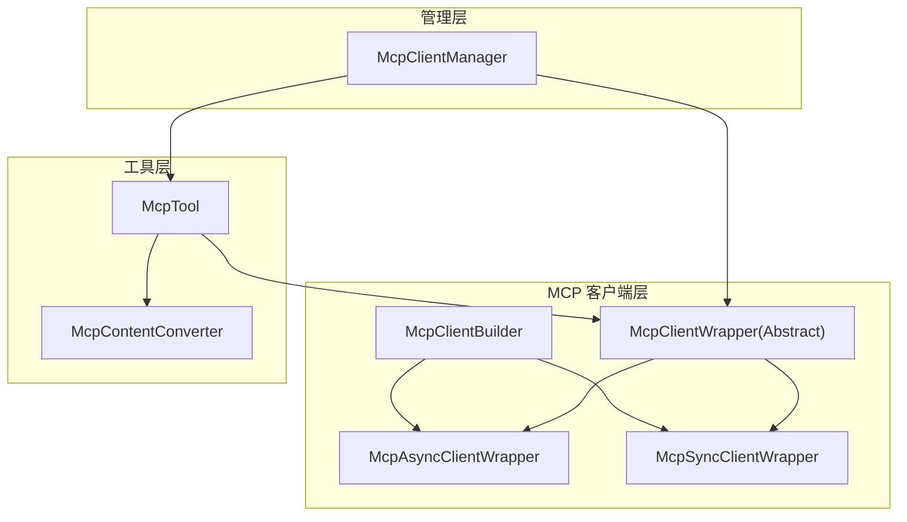
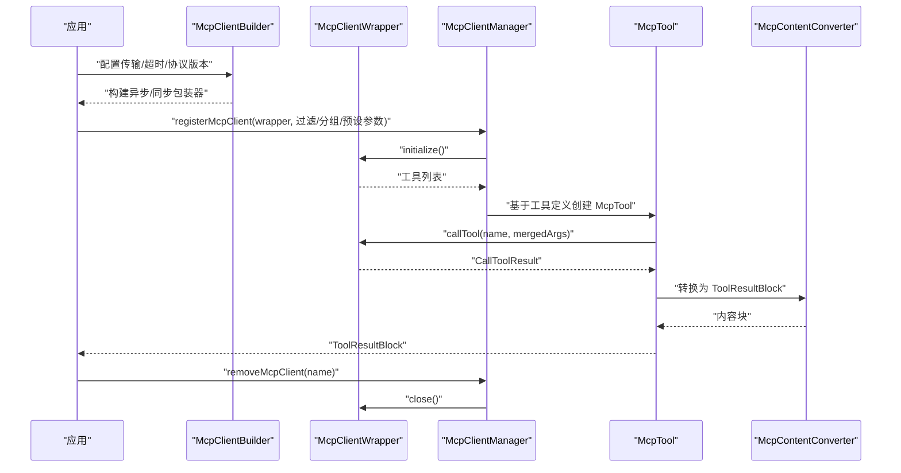
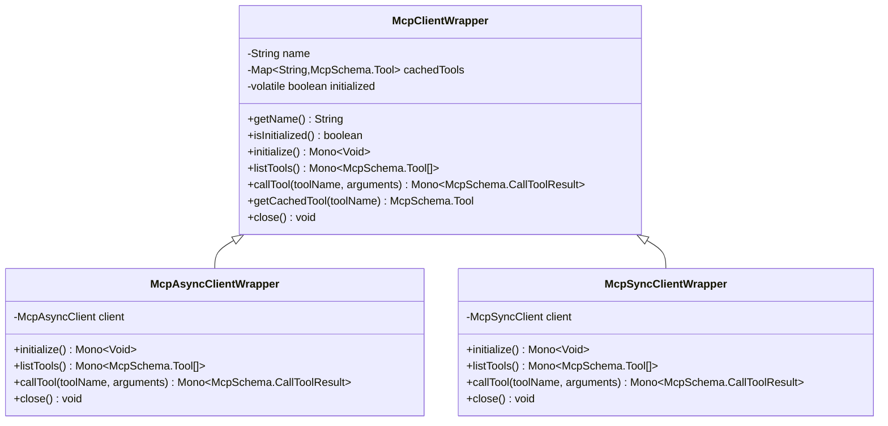
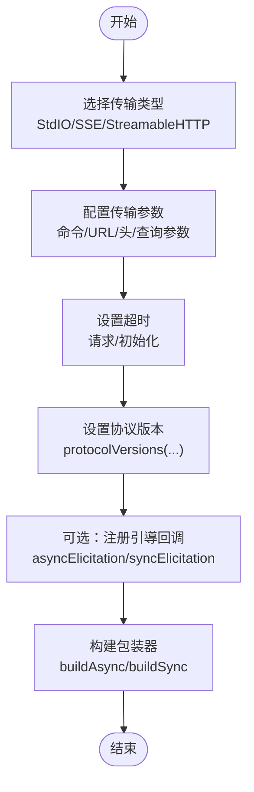
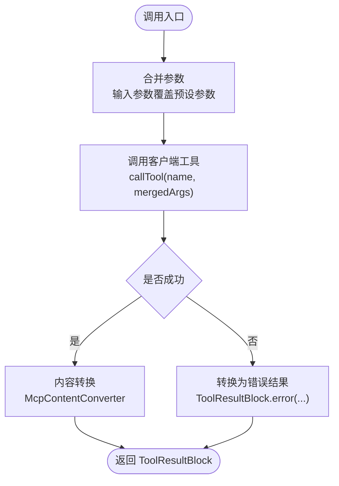
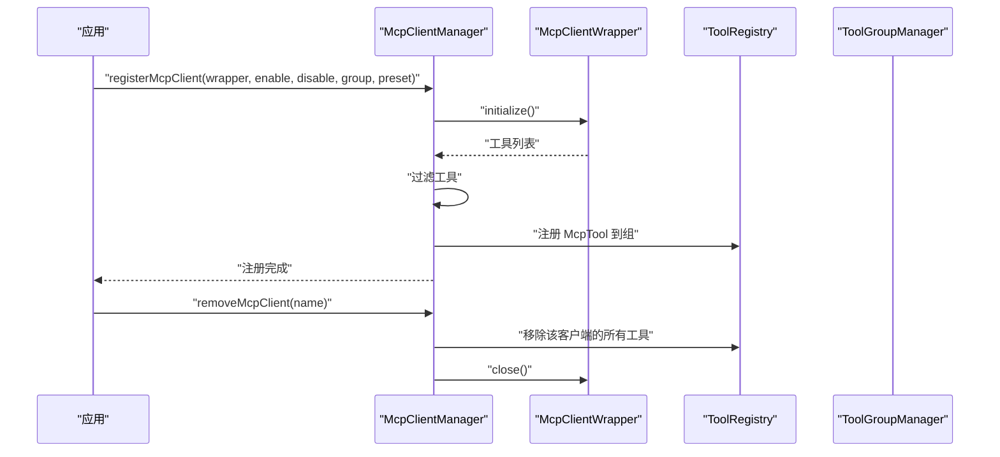
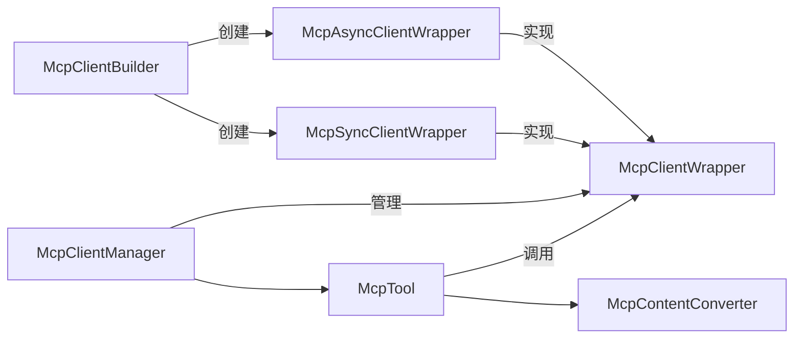

# MCP 客户端集成

<cite>
**本文引用的文件**
- [McpClientWrapper.java](file://agentscope-core/src/main/java/io/agentscope/core/tool/mcp/McpClientWrapper.java)
- [McpAsyncClientWrapper.java](file://agentscope-core/src/main/java/io/agentscope/core/tool/mcp/McpAsyncClientWrapper.java)
- [McpSyncClientWrapper.java](file://agentscope-core/src/main/java/io/agentscope/core/tool/mcp/McpSyncClientWrapper.java)
- [McpClientBuilder.java](file://agentscope-core/src/main/java/io/agentscope/core/tool/mcp/McpClientBuilder.java)
- [McpTool.java](file://agentscope-core/src/main/java/io/agentscope/core/tool/mcp/McpTool.java)
- [McpContentConverter.java](file://agentscope-core/src/main/java/io/agentscope/core/tool/mcp/McpContentConverter.java)
- [McpClientManager.java](file://agentscope-core/src/main/java/io/agentscope/core/tool/McpClientManager.java)
- [McpClientWrapperTest.java](file://agentscope-core/src/test/java/io/agentscope/core/tool/mcp/McpClientWrapperTest.java)
- [McpToolTest.java](file://agentscope-core/src/test/java/io/agentscope/core/tool/mcp/McpToolTest.java)
</cite>

## 目录
1. [简介](#简介)
2. [项目结构](#项目结构)
3. [核心组件](#核心组件)
4. [架构总览](#架构总览)
5. [详细组件分析](#详细组件分析)
6. [依赖关系分析](#依赖关系分析)
7. [性能考虑](#性能考虑)
8. [故障排查指南](#故障排查指南)
9. [结论](#结论)
10. [附录：完整集成示例与最佳实践](#附录完整集成示例与最佳实践)

## 简介
本文件面向 AgentScope Java 的 MCP（模型上下文协议）客户端集成，提供面向开发者的全面 API 文档。内容覆盖 MCP 客户端的注册与管理 API（registerMcpClient() 与 removeMcpClient()）、客户端包装器的配置与使用（连接、工具发现、生命周期管理）、MCP 工具的创建与调用机制（参数映射与结果处理），并给出可直接落地的集成示例、配置选项与性能优化建议。

## 项目结构
MCP 集成位于 agentscope-core 模块的 tool/mcp 包中，核心类包括：
- 客户端包装器抽象层与实现：McpClientWrapper、McpAsyncClientWrapper、McpSyncClientWrapper
- 客户端构建器：McpClientBuilder（支持 StdIO、SSE、StreamableHTTP 三种传输）
- 工具桥接：McpTool（将 MCP 工具桥接到 AgentScope 工具体系）
- 内容转换：McpContentConverter（MCP 结果到 AgentScope 内容块的转换）
- 客户端管理：McpClientManager（注册/移除 MCP 客户端及工具）

图表来源
- [McpClientWrapper.java:40-121](file://agentscope-core/src/main/java/io/agentscope/core/tool/mcp/McpClientWrapper.java#L40-L121)
- [McpAsyncClientWrapper.java:40-180](file://agentscope-core/src/main/java/io/agentscope/core/tool/mcp/McpAsyncClientWrapper.java#L40-L180)
- [McpSyncClientWrapper.java:41-189](file://agentscope-core/src/main/java/io/agentscope/core/tool/mcp/McpSyncClientWrapper.java#L41-L189)
- [McpClientBuilder.java:94-791](file://agentscope-core/src/main/java/io/agentscope/core/tool/mcp/McpClientBuilder.java#L94-L791)
- [McpTool.java:57-282](file://agentscope-core/src/main/java/io/agentscope/core/tool/mcp/McpTool.java#L57-L282)
- [McpContentConverter.java:41-205](file://agentscope-core/src/main/java/io/agentscope/core/tool/mcp/McpContentConverter.java#L41-L205)
- [McpClientManager.java:36-289](file://agentscope-core/src/main/java/io/agentscope/core/tool/McpClientManager.java#L36-L289)

章节来源
- [McpClientWrapper.java:24-121](file://agentscope-core/src/main/java/io/agentscope/core/tool/mcp/McpClientWrapper.java#L24-L121)
- [McpClientBuilder.java:54-93](file://agentscope-core/src/main/java/io/agentscope/core/tool/mcp/McpClientBuilder.java#L54-L93)

## 核心组件
- 抽象客户端包装器：McpClientWrapper 提供统一接口，负责客户端初始化、工具列表缓存、工具调用与资源关闭。
- 异步包装器：McpAsyncClientWrapper 基于 Reactor Mono，适配异步 MCP 客户端。
- 同步包装器：McpSyncClientWrapper 将阻塞式 MCP 客户端封装为非阻塞 Mono，使用 boundedElastic 调度器。
- 客户端构建器：McpClientBuilder 提供 Fluent API，支持 StdIO、SSE、StreamableHTTP 三类传输，可配置超时、协议版本、HTTP 头与查询参数等。
- MCP 工具：McpTool 实现 AgentScope 的 AgentTool 接口，负责参数合并、调用 MCP 客户端、结果转换。
- 内容转换器：McpContentConverter 将 MCP 返回内容转换为 AgentScope 的内容块（文本、图片等）。
- 客户端管理器：McpClientManager 提供 registerMcpClient()/removeMcpClient()，完成客户端初始化、工具发现、注册与清理。

章节来源
- [McpClientWrapper.java:40-121](file://agentscope-core/src/main/java/io/agentscope/core/tool/mcp/McpClientWrapper.java#L40-L121)
- [McpAsyncClientWrapper.java:40-180](file://agentscope-core/src/main/java/io/agentscope/core/tool/mcp/McpAsyncClientWrapper.java#L40-L180)
- [McpSyncClientWrapper.java:41-189](file://agentscope-core/src/main/java/io/agentscope/core/tool/mcp/McpSyncClientWrapper.java#L41-L189)
- [McpClientBuilder.java:94-791](file://agentscope-core/src/main/java/io/agentscope/core/tool/mcp/McpClientBuilder.java#L94-L791)
- [McpTool.java:57-282](file://agentscope-core/src/main/java/io/agentscope/core/tool/mcp/McpTool.java#L57-L282)
- [McpContentConverter.java:41-205](file://agentscope-core/src/main/java/io/agentscope/core/tool/mcp/McpContentConverter.java#L41-L205)
- [McpClientManager.java:36-289](file://agentscope-core/src/main/java/io/agentscope/core/tool/McpClientManager.java#L36-L289)

## 架构总览
下图展示从客户端构建到工具调用的端到端流程，以及管理器对客户端与工具的生命周期管理。

图表来源
- [McpClientBuilder.java:421-496](file://agentscope-core/src/main/java/io/agentscope/core/tool/mcp/McpClientBuilder.java#L421-L496)
- [McpClientWrapper.java:85-102](file://agentscope-core/src/main/java/io/agentscope/core/tool/mcp/McpClientWrapper.java#L85-L102)
- [McpClientManager.java:129-210](file://agentscope-core/src/main/java/io/agentscope/core/tool/McpClientManager.java#L129-L210)
- [McpTool.java:172-192](file://agentscope-core/src/main/java/io/agentscope/core/tool/mcp/McpTool.java#L172-L192)
- [McpContentConverter.java:56-71](file://agentscope-core/src/main/java/io/agentscope/core/tool/mcp/McpContentConverter.java#L56-L71)

## 详细组件分析

### 客户端包装器与生命周期
- 初始化：initialize() 在首次调用时建立连接、拉取工具清单并缓存；重复初始化幂等。
- 工具发现：listTools() 返回当前可用工具列表；需在初始化后调用。
- 工具调用：callTool() 发送请求并返回结果；内部对错误结果进行日志记录。
- 关闭：close() 支持优雅关闭，失败则强制关闭；清空缓存并重置初始化状态。

图表来源
- [McpClientWrapper.java:40-121](file://agentscope-core/src/main/java/io/agentscope/core/tool/mcp/McpClientWrapper.java#L40-L121)
- [McpAsyncClientWrapper.java:40-180](file://agentscope-core/src/main/java/io/agentscope/core/tool/mcp/McpAsyncClientWrapper.java#L40-L180)
- [McpSyncClientWrapper.java:41-189](file://agentscope-core/src/main/java/io/agentscope/core/tool/mcp/McpSyncClientWrapper.java#L41-L189)

章节来源
- [McpClientWrapper.java:85-120](file://agentscope-core/src/main/java/io/agentscope/core/tool/mcp/McpClientWrapper.java#L85-L120)
- [McpAsyncClientWrapper.java:65-154](file://agentscope-core/src/main/java/io/agentscope/core/tool/mcp/McpAsyncClientWrapper.java#L65-L154)
- [McpSyncClientWrapper.java:67-165](file://agentscope-core/src/main/java/io/agentscope/core/tool/mcp/McpSyncClientWrapper.java#L67-L165)

### 客户端构建器（McpClientBuilder）
- 传输类型
  - StdIO：本地进程通信，支持命令、参数与环境变量。
  - SSE：HTTP Server-Sent Events，支持自定义 HttpClient（如 HTTP/2）、请求头与查询参数。
  - StreamableHTTP：HTTP 流式传输，同样支持自定义 HttpClient、请求头与查询参数。
- 超时配置：requestTimeout 与 initializationTimeout。
- 协议版本：protocolVersions 可声明支持的 MCP 版本，解决服务端新版本导致的连接失败问题。
- 引导能力：asyncElicitation()/syncElicitation() 注册服务器主动请求处理回调。
- 构建产物：buildAsync()/buildSync() 返回对应的包装器实例。

图表来源
- [McpClientBuilder.java:131-496](file://agentscope-core/src/main/java/io/agentscope/core/tool/mcp/McpClientBuilder.java#L131-L496)

章节来源
- [McpClientBuilder.java:117-496](file://agentscope-core/src/main/java/io/agentscope/core/tool/mcp/McpClientBuilder.java#L117-L496)

### MCP 工具（McpTool）与参数映射
- 参数合并策略：输入参数优先于预设参数；预设参数通过构造函数传入。
- 输出模式：支持输出模式 schema 的传递与保留。
- 错误处理：调用异常会被捕获并转换为错误型 ToolResultBlock，避免中断流程。
- 参数模式转换：convertMcpSchemaToParameters() 将 MCP 的 JsonSchema 转换为 AgentScope 的参数格式，支持 $defs 与 definitions 的保留。

图表来源
- [McpTool.java:172-192](file://agentscope-core/src/main/java/io/agentscope/core/tool/mcp/McpTool.java#L172-L192)
- [McpContentConverter.java:56-71](file://agentscope-core/src/main/java/io/agentscope/core/tool/mcp/McpContentConverter.java#L56-L71)

章节来源
- [McpTool.java:172-229](file://agentscope-core/src/main/java/io/agentscope/core/tool/mcp/McpTool.java#L172-L229)
- [McpToolTest.java:212-242](file://agentscope-core/src/test/java/io/agentscope/core/tool/mcp/McpToolTest.java#L212-L242)

### 客户端管理（McpClientManager）
- 注册 API
  - registerMcpClient(wrapper)
  - registerMcpClient(wrapper, enableTools)
  - registerMcpClient(wrapper, enableTools, disableTools)
  - registerMcpClient(wrapper, enableTools, disableTools, groupName)
  - registerMcpClient(wrapper, enableTools, disableTools, groupName, presetParametersMapping)
- 移除 API：removeMcpClient(name)，清理工具注册并关闭客户端。
- 过滤逻辑：根据 enableTools/disabledTools 决定是否注册；支持按组名分配。
- 预设参数映射：为特定工具注入预设参数，参与参数合并。

图表来源
- [McpClientManager.java:129-210](file://agentscope-core/src/main/java/io/agentscope/core/tool/McpClientManager.java#L129-L210)

章节来源
- [McpClientManager.java:72-210](file://agentscope-core/src/main/java/io/agentscope/core/tool/McpClientManager.java#L72-L210)

## 依赖关系分析
- McpClientWrapper 为抽象基类，McpAsyncClientWrapper 与 McpSyncClientWrapper 分别适配异步与同步底层客户端。
- McpTool 依赖 McpClientWrapper 进行远程调用，并通过 McpContentConverter 转换结果。
- McpClientManager 负责客户端生命周期与工具注册，协调 ToolRegistry 与 ToolGroupManager。
- McpClientBuilder 作为工厂，生成不同传输类型的包装器实例。

图表来源
- [McpClientBuilder.java:421-496](file://agentscope-core/src/main/java/io/agentscope/core/tool/mcp/McpClientBuilder.java#L421-L496)
- [McpClientWrapper.java:40-121](file://agentscope-core/src/main/java/io/agentscope/core/tool/mcp/McpClientWrapper.java#L40-L121)
- [McpTool.java:57-282](file://agentscope-core/src/main/java/io/agentscope/core/tool/mcp/McpTool.java#L57-L282)
- [McpContentConverter.java:41-205](file://agentscope-core/src/main/java/io/agentscope/core/tool/mcp/McpContentConverter.java#L41-L205)
- [McpClientManager.java:36-289](file://agentscope-core/src/main/java/io/agentscope/core/tool/McpClientManager.java#L36-L289)

## 性能考虑
- 异步优先：优先使用 buildAsync() 与 McpAsyncClientWrapper，避免阻塞事件循环。
- 调度隔离：McpSyncClientWrapper 使用 boundedElastic 调度器执行阻塞操作，降低对主线程影响。
- 连接复用：初始化后缓存工具清单，减少重复查询；合理设置 initializationTimeout 与 requestTimeout。
- 协议版本兼容：通过 protocolVersions 声明支持的服务端版本，避免因版本不匹配导致的反复握手失败。
- 资源回收：及时调用 removeMcpClient() 以移除工具并关闭客户端，防止资源泄漏。

## 故障排查指南
- 初始化失败
  - 检查传输配置（URL/命令/参数/环境变量）与网络连通性。
  - 若服务端协议版本较新，确认已通过 protocolVersions 声明支持。
- 工具不可用
  - 确认客户端已初始化且工具列表非空。
  - 使用 enableTools/disableTools 精确控制工具注册范围。
- 调用异常
  - 查看日志中的错误消息；McpTool 会将异常转换为错误型 ToolResultBlock。
  - 检查参数合并是否正确（输入参数应覆盖预设参数）。
- 资源未释放
  - 确保在应用停止或不再需要时调用 removeMcpClient() 并等待关闭完成。

章节来源
- [McpClientWrapperTest.java:136-170](file://agentscope-core/src/test/java/io/agentscope/core/tool/mcp/McpClientWrapperTest.java#L136-L170)
- [McpToolTest.java:271-302](file://agentscope-core/src/test/java/io/agentscope/core/tool/mcp/McpToolTest.java#L271-L302)

## 结论
AgentScope 的 MCP 集成提供了从客户端构建、工具发现、工具注册到调用与结果转换的完整链路。通过 McpClientManager 的注册/移除 API，开发者可以统一接入与管理外部 MCP 工具；通过 McpClientBuilder 的灵活配置，可适配多种部署形态与网络环境；通过 McpTool 的参数映射与错误兜底，确保工具调用的稳定性与一致性。

## 附录：完整集成示例与最佳实践
以下为可直接参考的集成步骤与要点（以路径代替具体代码）：

- 客户端初始化
  - 选择传输类型并配置参数：[McpClientBuilder.java:131-285](file://agentscope-core/src/main/java/io/agentscope/core/tool/mcp/McpClientBuilder.java#L131-L285)
  - 设置超时与协议版本：[McpClientBuilder.java:293-341](file://agentscope-core/src/main/java/io/agentscope/core/tool/mcp/McpClientBuilder.java#L293-L341)
  - 构建异步/同步包装器：[McpClientBuilder.java:421-496](file://agentscope-core/src/main/java/io/agentscope/core/tool/mcp/McpClientBuilder.java#L421-L496)

- 注册 MCP 客户端与工具
  - 基础注册：[McpClientManager.java:129-210](file://agentscope-core/src/main/java/io/agentscope/core/tool/McpClientManager.java#L129-L210)
  - 过滤与分组：[McpClientManager.java:129-210](file://agentscope-core/src/main/java/io/agentscope/core/tool/McpClientManager.java#L129-L210)
  - 预设参数映射：[McpClientManager.java:129-210](file://agentscope-core/src/main/java/io/agentscope/core/tool/McpClientManager.java#L129-L210)

- 创建与调用 MCP 工具
  - 参数合并与调用：[McpTool.java:172-192](file://agentscope-core/src/main/java/io/agentscope/core/tool/mcp/McpTool.java#L172-L192)
  - 参数模式转换：[McpTool.java:237-280](file://agentscope-core/src/main/java/io/agentscope/core/tool/mcp/McpTool.java#L237-L280)

- 结果处理与内容转换
  - 调用结果转内容块：[McpContentConverter.java:56-71](file://agentscope-core/src/main/java/io/agentscope/core/tool/mcp/McpContentConverter.java#L56-L71)

- 生命周期管理
  - 注销与清理：[McpClientManager.java:218-244](file://agentscope-core/src/main/java/io/agentscope/core/tool/McpClientManager.java#L218-L244)
  - 客户端关闭与幂等：[McpClientWrapper.java:118-120](file://agentscope-core/src/main/java/io/agentscope/core/tool/mcp/McpClientWrapper.java#L118-L120)

- 最佳实践
  - 优先使用异步包装器与异步调用链路，避免阻塞。
  - 明确工具白名单/黑名单，结合分组管理工具集合。
  - 对关键工具设置预设参数，减少调用方重复传参。
  - 合理设置超时与协议版本，提升连接成功率与稳定性。
  - 在应用生命周期末尾调用 removeMcpClient()，确保资源回收。

章节来源
- [McpClientBuilder.java:131-496](file://agentscope-core/src/main/java/io/agentscope/core/tool/mcp/McpClientBuilder.java#L131-L496)
- [McpClientManager.java:129-244](file://agentscope-core/src/main/java/io/agentscope/core/tool/McpClientManager.java#L129-L244)
- [McpTool.java:172-280](file://agentscope-core/src/main/java/io/agentscope/core/tool/mcp/McpTool.java#L172-L280)
- [McpContentConverter.java:56-71](file://agentscope-core/src/main/java/io/agentscope/core/tool/mcp/McpContentConverter.java#L56-L71)
- [McpClientWrapper.java:118-120](file://agentscope-core/src/main/java/io/agentscope/core/tool/mcp/McpClientWrapper.java#L118-L120)