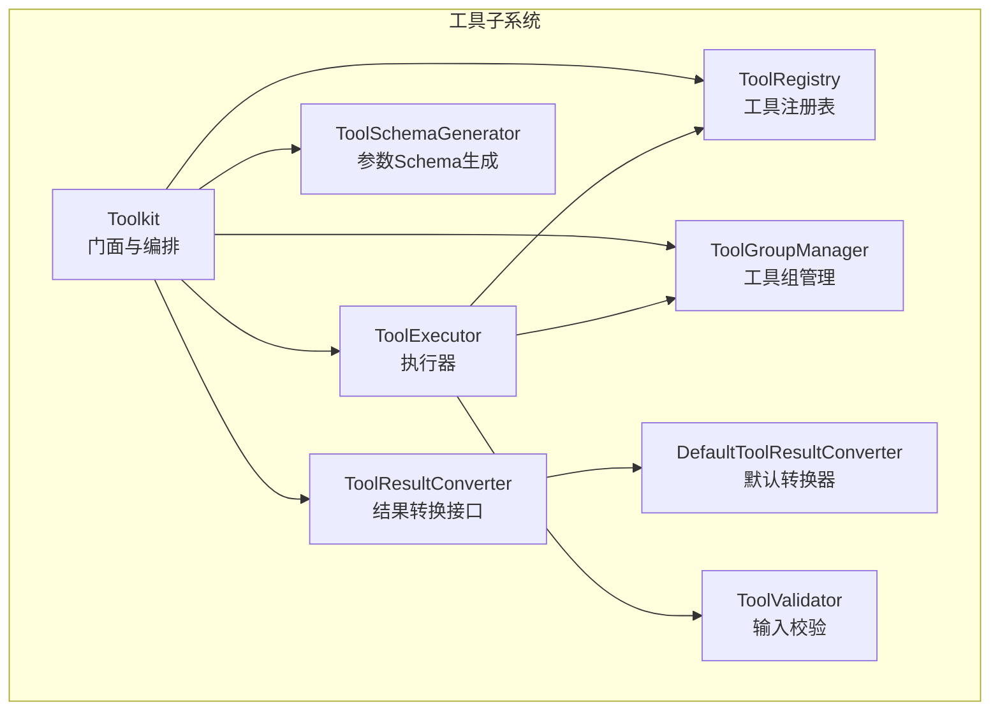
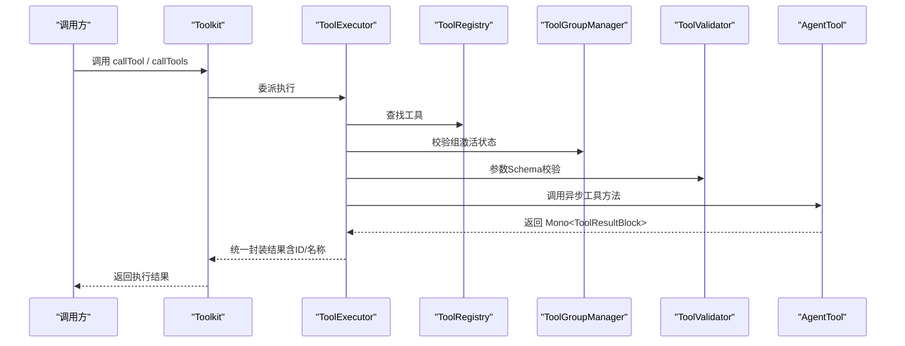
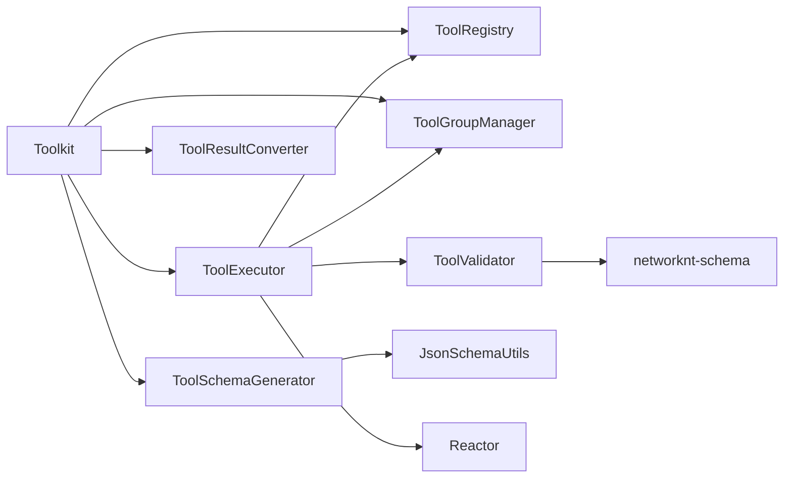

# 工具 API

<cite>
**本文引用的文件**
- [Toolkit.java](file://agentscope-core/src/main/java/io/agentscope/core/tool/Toolkit.java)
- [Tool.java](file://agentscope-core/src/main/java/io/agentscope/core/tool/Tool.java)
- [ToolParam.java](file://agentscope-core/src/main/java/io/agentscope/core/tool/ToolParam.java)
- [ToolExecutionContext.java](file://agentscope-core/src/main/java/io/agentscope/core/tool/ToolExecutionContext.java)
- [ToolGroup.java](file://agentscope-core/src/main/java/io/agentscope/core/tool/ToolGroup.java)
- [ToolResultConverter.java](file://agentscope-core/src/main/java/io/agentscope/core/tool/ToolResultConverter.java)
- [DefaultToolResultConverter.java](file://agentscope-core/src/main/java/io/agentscope/core/tool/DefaultToolResultConverter.java)
- [ToolExecutor.java](file://agentscope-core/src/main/java/io/agentscope/core/tool/ToolExecutor.java)
- [ToolRegistry.java](file://agentscope-core/src/main/java/io/agentscope/core/tool/ToolRegistry.java)
- [ToolSchemaGenerator.java](file://agentscope-core/src/main/java/io/agentscope/core/tool/ToolSchemaGenerator.java)
- [ToolValidator.java](file://agentscope-core/src/main/java/io/agentscope/core/tool/ToolValidator.java)
</cite>

## 目录
1. [简介](#简介)
2. [项目结构](#项目结构)
3. [核心组件](#核心组件)
4. [架构总览](#架构总览)
5. [详细组件分析](#详细组件分析)
6. [依赖分析](#依赖分析)
7. [性能考量](#性能考量)
8. [故障排查指南](#故障排查指南)
9. [结论](#结论)
10. [附录：开发与示例指引](#附录开发与示例指引)

## 简介
本文件为 AgentScope Java 工具系统 API 的权威参考文档，面向开发者与集成者，系统性阐述工具注册、执行、上下文传递、结果转换与工具组管理等能力。重点覆盖：
- Toolkit 类的公共 API：工具注册、外部工具、工具组、执行配置、流式回调、深拷贝等
- Tool 接口与注解体系：@Tool、@ToolParam 的设计与实现约束
- ToolExecutionContext 的使用与最佳实践
- 工具执行链路、参数校验、结果转换与错误处理
- 自定义工具开发与扩展机制

## 项目结构
工具系统位于 agentscope-core 模块的 tool 包中，围绕 Toolkit 作为门面，内部通过 ToolRegistry、ToolGroupManager、ToolExecutor、ToolSchemaGenerator、ToolValidator 等协作完成工具生命周期管理与执行。

图表来源
- [Toolkit.java:66-117](file://agentscope-core/src/main/java/io/agentscope/core/tool/Toolkit.java#L66-L117)
- [ToolRegistry.java:40-58](file://agentscope-core/src/main/java/io/agentscope/core/tool/ToolRegistry.java#L40-L58)
- [ToolGroupManager.java:31-46](file://agentscope-core/src/main/java/io/agentscope/core/tool/ToolGroupManager.java#L31-L46)
- [ToolExecutor.java:57-94](file://agentscope-core/src/main/java/io/agentscope/core/tool/ToolExecutor.java#L57-L94)
- [ToolSchemaGenerator.java:34-50](file://agentscope-core/src/main/java/io/agentscope/core/tool/ToolSchemaGenerator.java#L34-L50)
- [ToolValidator.java:47-56](file://agentscope-core/src/main/java/io/agentscope/core/tool/ToolValidator.java#L47-L56)
- [ToolResultConverter.java:48-58](file://agentscope-core/src/main/java/io/agentscope/core/tool/ToolResultConverter.java#L48-L58)
- [DefaultToolResultConverter.java:39-42](file://agentscope-core/src/main/java/io/agentscope/core/tool/DefaultToolResultConverter.java#L39-L42)

章节来源
- [Toolkit.java:37-65](file://agentscope-core/src/main/java/io/agentscope/core/tool/Toolkit.java#L37-L65)
- [ToolRegistry.java:23-39](file://agentscope-core/src/main/java/io/agentscope/core/tool/ToolRegistry.java#L23-L39)
- [ToolGroupManager.java:28-31](file://agentscope-core/src/main/java/io/agentscope/core/tool/ToolGroupManager.java#L28-L31)
- [ToolExecutor.java:39-56](file://agentscope-core/src/main/java/io/agentscope/core/tool/ToolExecutor.java#L39-L56)
- [ToolSchemaGenerator.java:28-34](file://agentscope-core/src/main/java/io/agentscope/core/tool/ToolSchemaGenerator.java#L28-L34)
- [ToolValidator.java:38-47](file://agentscope-core/src/main/java/io/agentscope/core/tool/ToolValidator.java#L38-L47)
- [ToolResultConverter.java:21-28](file://agentscope-core/src/main/java/io/agentscope/core/tool/ToolResultConverter.java#L21-L28)

## 核心组件
- Toolkit：工具系统门面，负责注册、检索、执行、分组、外部工具、元工具、预设参数更新、深拷贝与流式回调设置
- Tool 注解：声明工具方法，支持名称、描述、严格模式与自定义结果转换器
- ToolParam 注解：声明工具参数，提供名称、是否必填、描述
- ToolExecutionContext：工具调用上下文，支持多存储层优先级解析与合并
- ToolGroup：工具组模型，支持激活状态与工具集合
- ToolExecutor：统一执行器，封装并发、超时、重试、优雅停机保护、流式回调
- ToolRegistry：线程安全的工具注册表
- ToolSchemaGenerator：基于方法签名与注解生成 JSON Schema
- ToolValidator：输入参数 JSON Schema 校验与 HITL 结果匹配校验
- ToolResultConverter 及默认实现：将工具返回值转换为 ToolResultBlock

章节来源
- [Toolkit.java:66-117](file://agentscope-core/src/main/java/io/agentscope/core/tool/Toolkit.java#L66-L117)
- [Tool.java:24-56](file://agentscope-core/src/main/java/io/agentscope/core/tool/Tool.java#L24-L56)
- [ToolParam.java:24-58](file://agentscope-core/src/main/java/io/agentscope/core/tool/ToolParam.java#L24-L58)
- [ToolExecutionContext.java:23-47](file://agentscope-core/src/main/java/io/agentscope/core/tool/ToolExecutionContext.java#L23-L47)
- [ToolGroup.java:22-42](file://agentscope-core/src/main/java/io/agentscope/core/tool/ToolGroup.java#L22-L42)
- [ToolExecutor.java:39-56](file://agentscope-core/src/main/java/io/agentscope/core/tool/ToolExecutor.java#L39-L56)
- [ToolRegistry.java:23-40](file://agentscope-core/src/main/java/io/agentscope/core/tool/ToolRegistry.java#L23-L40)
- [ToolSchemaGenerator.java:28-34](file://agentscope-core/src/main/java/io/agentscope/core/tool/ToolSchemaGenerator.java#L28-L34)
- [ToolValidator.java:38-47](file://agentscope-core/src/main/java/io/agentscope/core/tool/ToolValidator.java#L38-L47)
- [ToolResultConverter.java:21-28](file://agentscope-core/src/main/java/io/agentscope/core/tool/ToolResultConverter.java#L21-L28)
- [DefaultToolResultConverter.java:26-38](file://agentscope-core/src/main/java/io/agentscope/core/tool/DefaultToolResultConverter.java#L26-L38)

## 架构总览
下图展示 Toolkit 如何协调各子系统完成一次工具调用：

图表来源
- [Toolkit.java:489-524](file://agentscope-core/src/main/java/io/agentscope/core/tool/Toolkit.java#L489-L524)
- [ToolExecutor.java:166-264](file://agentscope-core/src/main/java/io/agentscope/core/tool/ToolExecutor.java#L166-L264)
- [ToolRegistry.java:66-71](file://agentscope-core/src/main/java/io/agentscope/core/tool/ToolRegistry.java#L66-L71)
- [ToolGroupManager.java:231-245](file://agentscope-core/src/main/java/io/agentscope/core/tool/ToolGroupManager.java#L231-L245)
- [ToolValidator.java:77-104](file://agentscope-core/src/main/java/io/agentscope/core/tool/ToolValidator.java#L77-L104)

## 详细组件分析

### Toolkit：工具系统门面 API
- 构造与配置
  - 默认构造：使用默认配置
  - 带配置构造：可注入自定义执行器或并发策略
- 工具注册
  - registerTool(Object)：扫描对象中的 @Tool 方法并注册
  - registerAgentTool(AgentTool)：注册 AgentTool 实例
  - registration()：流式注册构建器，支持工具对象、AgentTool、MCP 客户端、子代理、分组、预设参数、扩展模型等
  - registerSchema/registerSchemas：注册仅 Schema 的外部工具
  - isExternalTool：判断是否为外部工具（SchemaOnlyTool）
- 工具查询与清单
  - getTool/getToolNames：按名获取工具或列出所有已注册工具名
- 执行入口
  - callTool(ToolCallParam)：单工具异步执行
  - callTools(List<ToolUseBlock>, ExecutionConfig, Agent, ToolExecutionContext)：批量执行，支持并行/串行、超时与重试
- 流式回调
  - setChunkCallback：用户级流式回调
  - setInternalChunkCallback：框架内部回调（不覆盖用户回调）
- 工具组管理
  - createToolGroup/updateToolGroups/removeTool/removeToolGroups/getActiveGroups/setActiveGroups/getToolGroup：创建、激活/停用、删除、查询与恢复
- 元工具与预设参数
  - registerMetaTool：注册动态控制工具组的元工具 reset_equipped_tools
  - updateToolPresetParameters：运行时更新工具预设参数
- 深拷贝
  - copy：深拷贝 Toolkit，保留用户回调

章节来源
- [Toolkit.java:83-117](file://agentscope-core/src/main/java/io/agentscope/core/tool/Toolkit.java#L83-L117)
- [Toolkit.java:146-148](file://agentscope-core/src/main/java/io/agentscope/core/tool/Toolkit.java#L146-L148)
- [Toolkit.java:154-197](file://agentscope-core/src/main/java/io/agentscope/core/tool/Toolkit.java#L154-L197)
- [Toolkit.java:203-243](file://agentscope-core/src/main/java/io/agentscope/core/tool/Toolkit.java#L203-L243)
- [Toolkit.java:294-324](file://agentscope-core/src/main/java/io/agentscope/core/tool/Toolkit.java#L294-L324)
- [Toolkit.java:332-334](file://agentscope-core/src/main/java/io/agentscope/core/tool/Toolkit.java#L332-L334)
- [Toolkit.java:445-463](file://agentscope-core/src/main/java/io/agentscope/core/tool/Toolkit.java#L445-L463)
- [Toolkit.java:489-524](file://agentscope-core/src/main/java/io/agentscope/core/tool/Toolkit.java#L489-L524)
- [Toolkit.java:561-574](file://agentscope-core/src/main/java/io/agentscope/core/tool/Toolkit.java#L561-L574)
- [Toolkit.java:586-594](file://agentscope-core/src/main/java/io/agentscope/core/tool/Toolkit.java#L586-L594)
- [Toolkit.java:601-622](file://agentscope-core/src/main/java/io/agentscope/core/tool/Toolkit.java#L601-L622)
- [Toolkit.java:632-641](file://agentscope-core/src/main/java/io/agentscope/core/tool/Toolkit.java#L632-L641)
- [Toolkit.java:652-665](file://agentscope-core/src/main/java/io/agentscope/core/tool/Toolkit.java#L652-L665)
- [Toolkit.java:685-692](file://agentscope-core/src/main/java/io/agentscope/core/tool/Toolkit.java#L685-L692)
- [Toolkit.java:705-713](file://agentscope-core/src/main/java/io/agentscope/core/tool/Toolkit.java#L705-L713)
- [Toolkit.java:725-738](file://agentscope-core/src/main/java/io/agentscope/core/tool/Toolkit.java#L725-L738)

### Tool 注解与参数注解
- Tool 注解
  - name：工具名（为空则使用方法名），建议 snake_case
  - description：工具描述，用于 LLM 决策
  - strict：启用严格模式（强约束参数 Schema）
  - converter：自定义结果转换器类型，默认使用 DefaultToolResultConverter
- ToolParam 注解
  - name：参数名（必须，因运行时默认不保留参数名）
  - required：是否必填
  - description：参数描述，帮助 LLM 提供正确值

章节来源
- [Tool.java:60-133](file://agentscope-core/src/main/java/io/agentscope/core/tool/Tool.java#L60-L133)
- [ToolParam.java:62-104](file://agentscope-core/src/main/java/io/agentscope/core/tool/ToolParam.java#L62-L104)

### ToolExecutionContext：上下文解析与合并
- 两层架构：外部接口 + 存储层（ContextStore）
- 优先级链：调用层 → Agent 层 → Toolkit 层 → Spring（最高到最低）
- 关键能力
  - get(key,type)/get(type)：按键或类型解析对象
  - contains(...)：存在性检查
  - merge(...)：合并多个上下文，保持优先级顺序
  - builder：注册对象（单例/多实例/显式类型），添加自定义存储
- 最佳实践
  - 使用 builder.register 注册跨模块共享对象
  - 合理拆分上下文层级，避免过度耦合
  - 对于需要在工具内自动注入的 POJO，确保类型唯一或使用键区分

章节来源
- [ToolExecutionContext.java:23-47](file://agentscope-core/src/main/java/io/agentscope/core/tool/ToolExecutionContext.java#L23-L47)
- [ToolExecutionContext.java:67-94](file://agentscope-core/src/main/java/io/agentscope/core/tool/ToolExecutionContext.java#L67-L94)
- [ToolExecutionContext.java:144-162](file://agentscope-core/src/main/java/io/agentscope/core/tool/ToolExecutionContext.java#L144-L162)
- [ToolExecutionContext.java:201-305](file://agentscope-core/src/main/java/io/agentscope/core/tool/ToolExecutionContext.java#L201-L305)

### 工具组管理：ToolGroup 与 ToolGroupManager
- ToolGroup
  - 名称、描述、激活状态、工具集合
  - Builder 支持快速构建
- ToolGroupManager
  - 创建/更新/删除工具组
  - 维护工具到组的索引与活跃组列表
  - 校验工具是否处于活跃组（未分组视为默认激活）
  - 备注生成：激活/全部组信息
  - 深拷贝：复制组状态与映射

章节来源
- [ToolGroup.java:22-42](file://agentscope-core/src/main/java/io/agentscope/core/tool/ToolGroup.java#L22-L42)
- [ToolGroupManager.java:31-46](file://agentscope-core/src/main/java/io/agentscope/core/tool/ToolGroupManager.java#L31-L46)
- [ToolGroupManager.java:47-103](file://agentscope-core/src/main/java/io/agentscope/core/tool/ToolGroupManager.java#L47-L103)
- [ToolGroupManager.java:231-245](file://agentscope-core/src/main/java/io/agentscope/core/tool/ToolGroupManager.java#L231-L245)
- [ToolGroupManager.java:354-379](file://agentscope-core/src/main/java/io/agentscope/core/tool/ToolGroupManager.java#L354-L379)

### 执行器：ToolExecutor
- 单工具执行 execute
  - 解析工具、校验组激活、Schema 校验、合并上下文与预设参数、构建执行参数、调用 AgentTool.callAsync
  - 异常处理：ToolSuspendException 转换为挂起结果；其他异常包装为错误结果
- 批量执行 executeAll
  - 并行/串行策略、订阅调度（Reactor 或自定义 ExecutorService）、超时、重试、优雅停机保护
  - 结果附加 ID 与名称，统一错误处理
- 流式回调
  - 用户回调与内部回调可同时生效，互不覆盖
- 基础设施
  - 调度：boundedElastic 或自定义线程池
  - 超时：Duration
  - 重试：Backoff、抖动、过滤条件
  - 停机保护：与全局优雅停机信号竞速

章节来源
- [ToolExecutor.java:166-264](file://agentscope-core/src/main/java/io/agentscope/core/tool/ToolExecutor.java#L166-L264)
- [ToolExecutor.java:278-304](file://agentscope-core/src/main/java/io/agentscope/core/tool/ToolExecutor.java#L278-L304)
- [ToolExecutor.java:309-341](file://agentscope-core/src/main/java/io/agentscope/core/tool/ToolExecutor.java#L309-L341)
- [ToolExecutor.java:345-420](file://agentscope-core/src/main/java/io/agentscope/core/tool/ToolExecutor.java#L345-L420)

### 注册表与结果转换
- ToolRegistry
  - 线程安全：ConcurrentHashMap
  - 能力：注册/查找工具与注册函数、移除、批量复制
- ToolResultConverter 与 DefaultToolResultConverter
  - convert：将任意返回值转为 ToolResultBlock
  - 默认行为：空值转 "null" 文本、void 转 "Done" 文本、已为 ToolResultBlock 的直接透传、序列化失败回退 toString()

章节来源
- [ToolRegistry.java:40-58](file://agentscope-core/src/main/java/io/agentscope/core/tool/ToolRegistry.java#L40-L58)
- [ToolRegistry.java:109-131](file://agentscope-core/src/main/java/io/agentscope/core/tool/ToolRegistry.java#L109-L131)
- [ToolResultConverter.java:48-58](file://agentscope-core/src/main/java/io/agentscope/core/tool/ToolResultConverter.java#L48-L58)
- [DefaultToolResultConverter.java:39-98](file://agentscope-core/src/main/java/io/agentscope/core/tool/DefaultToolResultConverter.java#L39-L98)

### 参数 Schema 生成与输入校验
- ToolSchemaGenerator
  - 基于 @Tool 方法签名与 @ToolParam 注解生成 JSON Schema
  - 支持排除参数（如预设参数）以避免暴露给 LLM
  - 将 $defs 提升至根级别，保证 $ref 解析
- ToolValidator
  - validateInput：使用 networknt-schema 进行参数校验，支持嵌套对象/数组、枚举、长度/范围、正则等
  - normalizeOptionalNullFields：将显式 null 视为省略的可选字段，保留必填字段校验
  - validateToolResultMatch：HITL 场景校验 ToolResult 与 ToolUse 的 ID 匹配

章节来源
- [ToolSchemaGenerator.java:34-93](file://agentscope-core/src/main/java/io/agentscope/core/tool/ToolSchemaGenerator.java#L34-L93)
- [ToolSchemaGenerator.java:124-136](file://agentscope-core/src/main/java/io/agentscope/core/tool/ToolSchemaGenerator.java#L124-L136)
- [ToolValidator.java:77-104](file://agentscope-core/src/main/java/io/agentscope/core/tool/ToolValidator.java#L77-L104)
- [ToolValidator.java:112-179](file://agentscope-core/src/main/java/io/agentscope/core/tool/ToolValidator.java#L112-L179)
- [ToolValidator.java:227-263](file://agentscope-core/src/main/java/io/agentscope/core/tool/ToolValidator.java#L227-L263)

## 依赖分析
- 组件耦合
  - Toolkit 高内聚地组合 ToolRegistry、ToolGroupManager、ToolExecutor、ToolSchemaGenerator、ToolValidator、ToolResultConverter
  - ToolExecutor 依赖 TracerRegistry、GracefulShutdownManager、Reactor 调度与重试
  - ToolSchemaGenerator 依赖 JsonSchemaUtils 生成复杂泛型类型的 Schema
- 外部依赖
  - networknt-schema：JSON Schema 校验
  - Reactor：异步执行与调度
  - Jackson：JSON 序列化与反序列化

图表来源
- [Toolkit.java:70-79](file://agentscope-core/src/main/java/io/agentscope/core/tool/Toolkit.java#L70-L79)
- [ToolExecutor.java:22-37](file://agentscope-core/src/main/java/io/agentscope/core/tool/ToolExecutor.java#L22-L37)
- [ToolSchemaGenerator.java:18-26](file://agentscope-core/src/main/java/io/agentscope/core/tool/ToolSchemaGenerator.java#L18-L26)
- [ToolValidator.java:22-36](file://agentscope-core/src/main/java/io/agentscope/core/tool/ToolValidator.java#L22-L36)

章节来源
- [Toolkit.java:70-79](file://agentscope-core/src/main/java/io/agentscope/core/tool/Toolkit.java#L70-L79)
- [ToolExecutor.java:22-37](file://agentscope-core/src/main/java/io/agentscope/core/tool/ToolExecutor.java#L22-L37)
- [ToolSchemaGenerator.java:18-26](file://agentscope-core/src/main/java/io/agentscope/core/tool/ToolSchemaGenerator.java#L18-L26)
- [ToolValidator.java:22-36](file://agentscope-core/src/main/java/io/agentscope/core/tool/ToolValidator.java#L22-L36)

## 性能考量
- 并发与调度
  - 默认使用 boundedElastic 调度器，适合 I/O 密集工具
  - 可注入自定义 ExecutorService 以复用线程池或限制并发
- 超时与重试
  - 通过 ExecutionConfig 设置超时与重试次数/退避策略，避免长尾阻塞
- 结果转换
  - 默认转换器对大对象序列化有成本，必要时实现自定义转换器进行裁剪或压缩
- 上下文合并
  - 合并过多上下文会增加解析开销，建议按需合并与分层

## 故障排查指南
- 工具未找到或未激活
  - 现象：返回错误结果或被拒绝
  - 排查：确认工具已注册、分组处于激活状态、未被删除
- 参数校验失败
  - 现象：返回参数错误提示
  - 排查：核对 @ToolParam 描述与必填项、Schema 生成是否符合预期
- 流式回调未触发
  - 现象：工具产生中间结果但未收到回调
  - 排查：确认 setChunkCallback 是否正确设置；内部回调不会覆盖用户回调
- 批量执行异常
  - 现象：部分工具失败
  - 排查：检查 ExecutionConfig 超时/重试配置；查看日志中的重试记录与错误消息
- 优雅停机导致提前终止
  - 现象：工具执行被中断
  - 排查：关注停机信号触发时间点与工具耗时

章节来源
- [ToolExecutor.java:194-199](file://agentscope-core/src/main/java/io/agentscope/core/tool/ToolExecutor.java#L194-L199)
- [ToolExecutor.java:204-212](file://agentscope-core/src/main/java/io/agentscope/core/tool/ToolExecutor.java#L204-L212)
- [ToolExecutor.java:121-136](file://agentscope-core/src/main/java/io/agentscope/core/tool/ToolExecutor.java#L121-L136)
- [ToolExecutor.java:352-402](file://agentscope-core/src/main/java/io/agentscope/core/tool/ToolExecutor.java#L352-L402)

## 结论
Toolkit 将工具注册、执行、上下文、分组与结果转换整合为统一门面，配合 Tool 注解体系与 Schema 生成/校验，形成从“声明到执行”的闭环。通过 ToolExecutionContext 的多存储层优先级与 ToolExecutor 的基础设施能力，系统在灵活性与可靠性之间取得平衡。建议在实际工程中：
- 明确工具分组策略，按功能域划分工具组
- 为复杂工具提供自定义 ToolResultConverter
- 合理配置 ExecutionConfig，结合流式回调提升可观测性
- 使用 registration() 构建器进行一次性、可读性强的注册

## 附录：开发与示例指引
- 开发自定义工具
  - 在工具类上标注 @Tool，方法参数使用 @ToolParam 注解
  - 返回值可为字符串、Mono<String> 或其他响应式类型；必要时指定自定义 converter
  - 使用 ToolExecutionContext 注入上下文对象
- 注册工具
  - 使用 Toolkit.registerTool 或 registration().tool(...).apply()
  - 支持分组、预设参数、扩展模型与 MCP 客户端注册
- 执行工具
  - 单工具：callTool(ToolCallParam)
  - 批量：callTools(ToolUseBlocks, ExecutionConfig, Agent, ToolExecutionContext)
- 工具组管理
  - createToolGroup → updateToolGroups → setActiveGroups
  - 删除工具/组时注意配置允许删除的开关
- 结果转换
  - 默认转换器满足大多数场景；敏感数据或大结果建议自定义转换器

章节来源
- [Tool.java:24-56](file://agentscope-core/src/main/java/io/agentscope/core/tool/Tool.java#L24-L56)
- [ToolParam.java:24-58](file://agentscope-core/src/main/java/io/agentscope/core/tool/ToolParam.java#L24-L58)
- [Toolkit.java:146-148](file://agentscope-core/src/main/java/io/agentscope/core/tool/Toolkit.java#L146-L148)
- [Toolkit.java:489-524](file://agentscope-core/src/main/java/io/agentscope/core/tool/Toolkit.java#L489-L524)
- [ToolGroupManager.java:47-103](file://agentscope-core/src/main/java/io/agentscope/core/tool/ToolGroupManager.java#L47-L103)
- [DefaultToolResultConverter.java:39-98](file://agentscope-core/src/main/java/io/agentscope/core/tool/DefaultToolResultConverter.java#L39-L98)