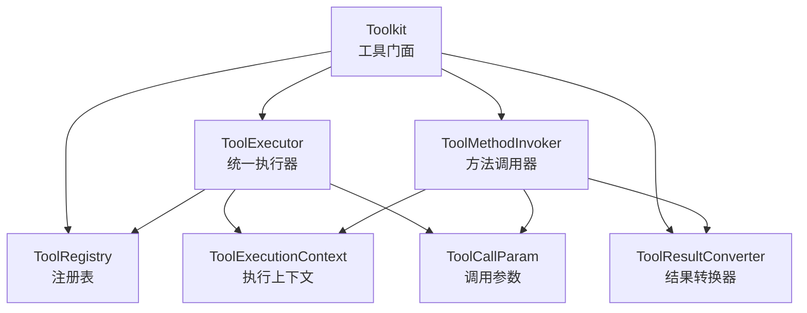
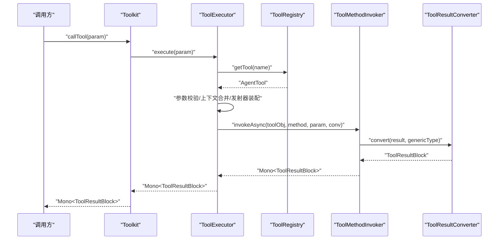
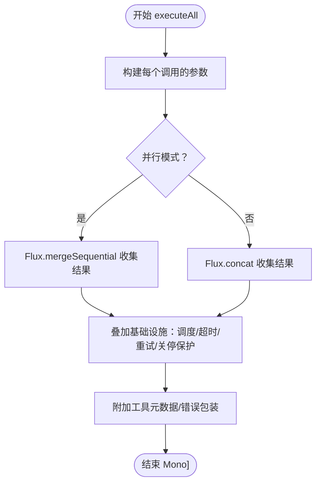
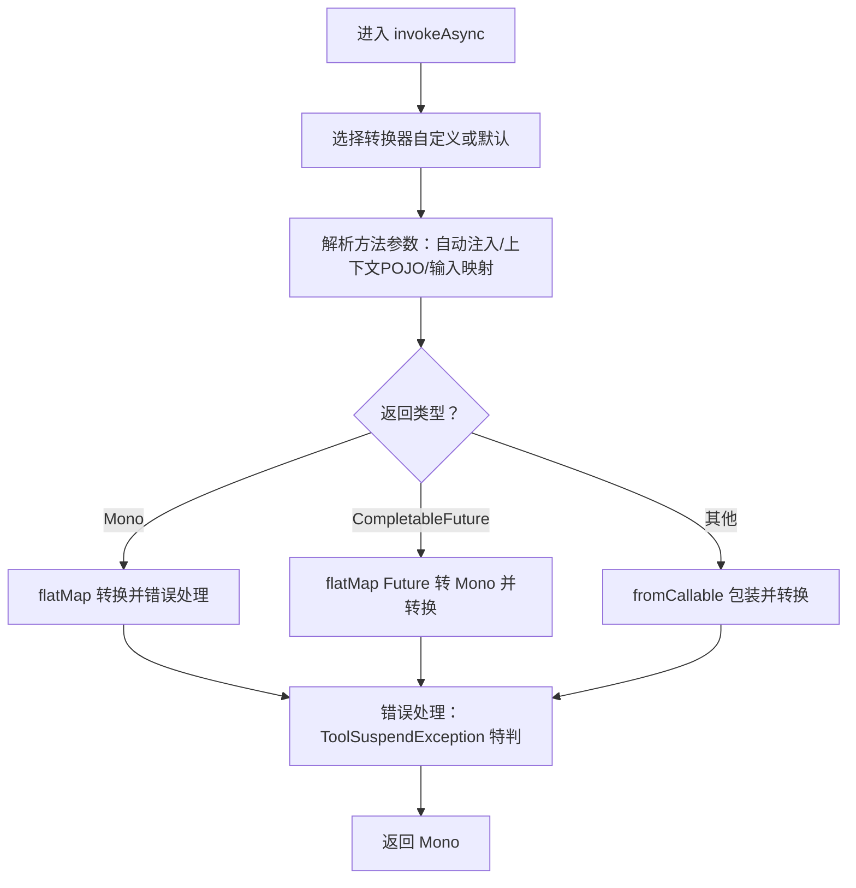
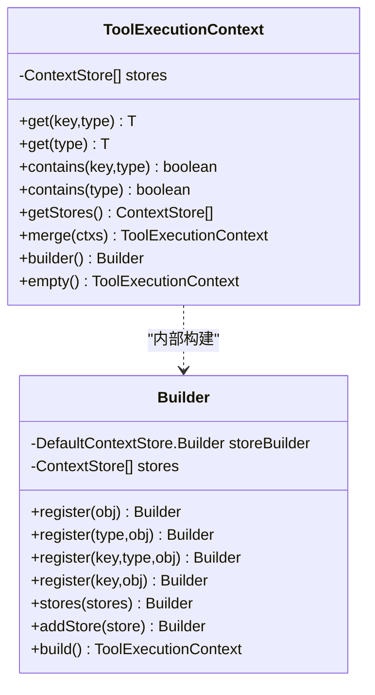
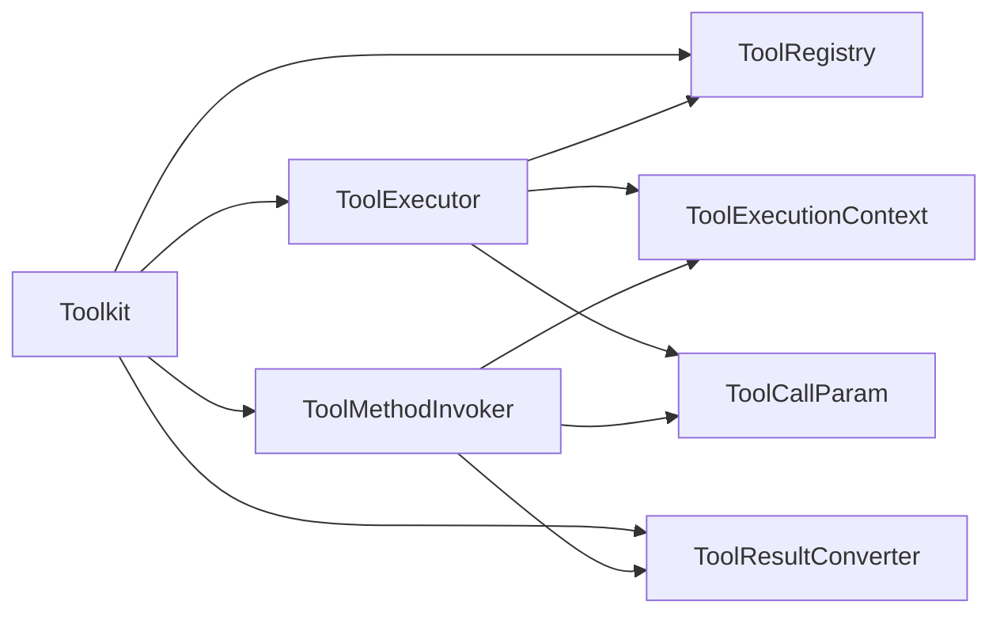

# 工具执行与调用

<cite>
**本文引用的文件**
- [ToolExecutionContext.java](file://agentscope-core/src/main/java/io/agentscope/core/tool/ToolExecutionContext.java)
- [ToolCallParam.java](file://agentscope-core/src/main/java/io/agentscope/core/tool/ToolCallParam.java)
- [ToolExecutor.java](file://agentscope-core/src/main/java/io/agentscope/core/tool/ToolExecutor.java)
- [ToolMethodInvoker.java](file://agentscope-core/src/main/java/io/agentscope/core/tool/ToolMethodInvoker.java)
- [Toolkit.java](file://agentscope-core/src/main/java/io/agentscope/core/tool/Toolkit.java)
- [ToolRegistry.java](file://agentscope-core/src/main/java/io/agentscope/core/tool/ToolRegistry.java)
- [ToolParam.java](file://agentscope-core/src/main/java/io/agentscope/core/tool/ToolParam.java)
- [ToolResultConverter.java](file://agentscope-core/src/main/java/io/agentscope/core/tool/ToolResultConverter.java)
- [DefaultToolResultConverter.java](file://agentscope-core/src/main/java/io/agentscope/core/tool/DefaultToolResultConverter.java)
</cite>

## 目录
1. [简介](#简介)
2. [项目结构](#项目结构)
3. [核心组件](#核心组件)
4. [架构总览](#架构总览)
5. [详细组件分析](#详细组件分析)
6. [依赖关系分析](#依赖关系分析)
7. [性能考量](#性能考量)
8. [故障排查指南](#故障排查指南)
9. [结论](#结论)
10. [附录](#附录)

## 简介
本文件面向 AgentScope Java 工具执行系统，聚焦于工具执行的核心 API 与执行流程，包括：
- 单工具与批量工具执行入口：callTool() 与 callTools()
- 执行上下文 ToolExecutionContext 的创建、合并与注入
- 工具调用参数 ToolCallParam 的构建与校验
- 工具方法调用器 ToolMethodInvoker 的方法解析、参数转换与结果处理
- 并行/串行执行、超时与重试机制
- 错误处理与异常管理策略

## 项目结构
围绕工具执行的关键类位于 agentscope-core 模块的 tool 包中，采用“门面 + 子系统”的分层设计：
- Toolkit：对外门面，负责注册、检索、执行与配置管理
- ToolExecutor：统一执行器，封装调度、超时、重试、关闭保护等基础设施
- ToolMethodInvoker：反射调用器，负责方法解析、参数注入与类型转换
- ToolExecutionContext：上下文容器，支持多存储层与优先级解析
- ToolCallParam：调用参数载体，封装工具调用所需信息
- ToolRegistry：内部注册表，维护工具与元数据映射
- ToolResultConverter：结果转换器接口及默认实现

图表来源
- [Toolkit.java:66-117](file://agentscope-core/src/main/java/io/agentscope/core/tool/Toolkit.java#L66-L117)
- [ToolExecutor.java:57-94](file://agentscope-core/src/main/java/io/agentscope/core/tool/ToolExecutor.java#L57-L94)
- [ToolMethodInvoker.java:37-43](file://agentscope-core/src/main/java/io/agentscope/core/tool/ToolMethodInvoker.java#L37-L43)
- [ToolExecutionContext.java:48-57](file://agentscope-core/src/main/java/io/agentscope/core/tool/ToolExecutionContext.java#L48-L57)
- [ToolCallParam.java:44-58](file://agentscope-core/src/main/java/io/agentscope/core/tool/ToolCallParam.java#L44-L58)

章节来源
- [Toolkit.java:37-65](file://agentscope-core/src/main/java/io/agentscope/core/tool/Toolkit.java#L37-L65)

## 核心组件
- Toolkit
  - 提供 callTool() 与 callTools() 入口，负责配置合并、执行器委派与回调设置
  - 维护注册表、组管理、MCP 客户端与模式生成
- ToolExecutor
  - 单工具执行：参数校验、上下文合并、发射器装配、调用与异常转换
  - 批量执行：串行/并行控制、调度、超时、重试、优雅关停保护
- ToolMethodInvoker
  - 反射调用：自动注入 ToolEmitter、Agent、ToolExecutionContext、RuntimeContext
  - 参数转换：按注解 ToolParam 映射输入；按泛型类型进行 JSON 转换；字符串回退
  - 结果转换：委托 ToolResultConverter
- ToolExecutionContext
  - 多存储层优先级解析（调用链 → 代理 → 工具包 → Spring）
  - 支持单例/键值/显式类型注册与合并
- ToolCallParam
  - 封装 ToolUseBlock、输入参数、Agent、上下文、发射器
  - 提供不可变访问与 Builder 构建
- ToolRegistry
  - 线程安全注册表，维护 AgentTool 与 RegisteredToolFunction 映射
- ToolParam
  - 方法参数注解，用于生成工具参数 Schema
- ToolResultConverter / DefaultToolResultConverter
  - 自定义结果转换接口与默认 JSON 序列化实现

章节来源
- [Toolkit.java:489-524](file://agentscope-core/src/main/java/io/agentscope/core/tool/Toolkit.java#L489-L524)
- [ToolExecutor.java:166-264](file://agentscope-core/src/main/java/io/agentscope/core/tool/ToolExecutor.java#L166-L264)
- [ToolMethodInvoker.java:54-121](file://agentscope-core/src/main/java/io/agentscope/core/tool/ToolMethodInvoker.java#L54-L121)
- [ToolExecutionContext.java:67-134](file://agentscope-core/src/main/java/io/agentscope/core/tool/ToolExecutionContext.java#L67-L134)
- [ToolCallParam.java:65-106](file://agentscope-core/src/main/java/io/agentscope/core/tool/ToolCallParam.java#L65-L106)
- [ToolRegistry.java:42-84](file://agentscope-core/src/main/java/io/agentscope/core/tool/ToolRegistry.java#L42-L84)
- [ToolParam.java:62-104](file://agentscope-core/src/main/java/io/agentscope/core/tool/ToolParam.java#L62-L104)
- [ToolResultConverter.java:48-58](file://agentscope-core/src/main/java/io/agentscope/core/tool/ToolResultConverter.java#L48-L58)
- [DefaultToolResultConverter.java:39-59](file://agentscope-core/src/main/java/io/agentscope/core/tool/DefaultToolResultConverter.java#L39-L59)

## 架构总览
下图展示从 Toolkit 到执行器与调用器的整体调用链路，以及关键基础设施（调度、超时、重试、关闭保护）的叠加。

图表来源
- [Toolkit.java:489-491](file://agentscope-core/src/main/java/io/agentscope/core/tool/Toolkit.java#L489-L491)
- [ToolExecutor.java:166-264](file://agentscope-core/src/main/java/io/agentscope/core/tool/ToolExecutor.java#L166-L264)
- [ToolMethodInvoker.java:54-121](file://agentscope-core/src/main/java/io/agentscope/core/tool/ToolMethodInvoker.java#L54-L121)
- [ToolResultConverter.java:50-57](file://agentscope-core/src/main/java/io/agentscope/core/tool/ToolResultConverter.java#L50-L57)

## 详细组件分析

### Toolkit：工具门面与执行入口
- 单工具执行：callTool(ToolCallParam) 直接委派给 ToolExecutor.execute()
- 批量执行：callTools(List<ToolUseBlock>, ExecutionConfig, Agent, ToolExecutionContext)
  - 合并配置：agent-level > toolkit-level > system defaults
  - 串行/并行：由 ToolkitConfig 控制
- 回调设置：setChunkCallback()/setInternalChunkCallback() 用于流式输出
- 注册与组管理：registration() 构建器、createToolGroup()/updateToolGroups()/removeTool()

章节来源
- [Toolkit.java:489-524](file://agentscope-core/src/main/java/io/agentscope/core/tool/Toolkit.java#L489-L524)
- [Toolkit.java:437-463](file://agentscope-core/src/main/java/io/agentscope/core/tool/Toolkit.java#L437-L463)
- [Toolkit.java:561-594](file://agentscope-core/src/main/java/io/agentscope/core/tool/Toolkit.java#L561-L594)

### ToolExecutor：统一执行器与基础设施
- 单工具执行 execute(ToolCallParam)
  - 工具查找与激活检查
  - Schema 校验（ToolValidator）
  - 上下文合并（ToolExecutionContext.merge(param.context, toolkit.defaultContext)）
  - 发射器装配（DefaultToolEmitter + 用户/内部回调）
  - 预设参数合并（preset > input）
  - 调用 AgentTool.callAsync()，异常转换（含 ToolSuspendException）
- 批量执行 executeAll(List<ToolUseBlock>, parallel, ExecutionConfig, Agent, ToolExecutionContext)
  - 串行：Flux.concat；并行：Flux.mergeSequential
  - 基础设施叠加：applyScheduling → applyTimeout → applyRetry → applyShutdownGuard
- 超时与重试
  - Timeout：基于 Mono.timeout
  - Retry：指数退避，可配置最大尝试次数、初始/最大退避、过滤条件
- 关闭保护：与全局优雅关停信号竞速，触发则取消并返回错误

图表来源
- [ToolExecutor.java:278-304](file://agentscope-core/src/main/java/io/agentscope/core/tool/ToolExecutor.java#L278-L304)
- [ToolExecutor.java:309-341](file://agentscope-core/src/main/java/io/agentscope/core/tool/ToolExecutor.java#L309-L341)
- [ToolExecutor.java:345-419](file://agentscope-core/src/main/java/io/agentscope/core/tool/ToolExecutor.java#L345-L419)

章节来源
- [ToolExecutor.java:166-264](file://agentscope-core/src/main/java/io/agentscope/core/tool/ToolExecutor.java#L166-L264)
- [ToolExecutor.java:278-341](file://agentscope-core/src/main/java/io/agentscope/core/tool/ToolExecutor.java#L278-L341)
- [ToolExecutor.java:345-419](file://agentscope-core/src/main/java/io/agentscope/core/tool/ToolExecutor.java#L345-L419)

### ToolMethodInvoker：方法解析与参数转换
- 自动注入
  - ToolEmitter、Agent、ToolExecutionContext、RuntimeContext
  - 用户自定义 POJO：从 ToolExecutionContext 解析（按类型优先）
- 参数映射
  - ToolParam 注解指定参数名；否则使用方法签名名称
  - 类型转换：优先直接赋值；否则通过 JsonCodec 保留泛型；最后字符串回退
- 返回值处理
  - 支持同步、Mono、CompletableFuture 三种返回形式
  - 结果统一交由 ToolResultConverter 转换为 ToolResultBlock
- 异常处理
  - 特判 ToolSuspendException 并向上抛出，以便上层正确处理挂起状态
  - 其他异常包装为 ToolResultBlock.error

图表来源
- [ToolMethodInvoker.java:54-121](file://agentscope-core/src/main/java/io/agentscope/core/tool/ToolMethodInvoker.java#L54-L121)
- [ToolMethodInvoker.java:144-185](file://agentscope-core/src/main/java/io/agentscope/core/tool/ToolMethodInvoker.java#L144-L185)
- [ToolMethodInvoker.java:337-368](file://agentscope-core/src/main/java/io/agentscope/core/tool/ToolMethodInvoker.java#L337-L368)

章节来源
- [ToolMethodInvoker.java:144-185](file://agentscope-core/src/main/java/io/agentscope/core/tool/ToolMethodInvoker.java#L144-L185)
- [ToolMethodInvoker.java:271-303](file://agentscope-core/src/main/java/io/agentscope/core/tool/ToolMethodInvoker.java#L271-L303)
- [ToolMethodInvoker.java:337-368](file://agentscope-core/src/main/java/io/agentscope/core/tool/ToolMethodInvoker.java#L337-L368)

### ToolExecutionContext：执行上下文与注入
- 两层架构：外部接口 + 存储层（ContextStore）
- 优先级链：调用上下文 → 代理上下文 → 工具包默认 → Spring（最高到最低）
- 查询与存在性检查：按 key/type 或仅 type 获取对象
- 合并：merge(ToolExecutionContext...) 将多个上下文按优先顺序合并
- 构建：builder().register(...) 系列方法支持单例/键值/显式类型注册；addStore() 支持自定义存储

图表来源
- [ToolExecutionContext.java:48-198](file://agentscope-core/src/main/java/io/agentscope/core/tool/ToolExecutionContext.java#L48-L198)
- [ToolExecutionContext.java:200-305](file://agentscope-core/src/main/java/io/agentscope/core/tool/ToolExecutionContext.java#L200-L305)

章节来源
- [ToolExecutionContext.java:67-134](file://agentscope-core/src/main/java/io/agentscope/core/tool/ToolExecutionContext.java#L67-L134)
- [ToolExecutionContext.java:144-162](file://agentscope-core/src/main/java/io/agentscope/core/tool/ToolExecutionContext.java#L144-L162)
- [ToolExecutionContext.java:169-180](file://agentscope-core/src/main/java/io/agentscope/core/tool/ToolExecutionContext.java#L169-L180)

### ToolCallParam：调用参数构建与使用
- 字段：ToolUseBlock、输入 Map、Agent、ToolExecutionContext、ToolEmitter
- 不可变访问：getInput() 返回不可变视图
- 默认发射器：未设置时使用 NoOpToolEmitter
- Builder：toolUseBlock()/input()/agent()/context()/emitter()/build()

章节来源
- [ToolCallParam.java:65-106](file://agentscope-core/src/main/java/io/agentscope/core/tool/ToolCallParam.java#L65-L106)
- [ToolCallParam.java:135-191](file://agentscope-core/src/main/java/io/agentscope/core/tool/ToolCallParam.java#L135-L191)

### ToolRegistry：工具注册与查询
- 线程安全：ConcurrentHashMap 实现
- 能力：注册、按名查询、查询 RegisteredToolFunction、复制到新注册表、原子移除

章节来源
- [ToolRegistry.java:42-84](file://agentscope-core/src/main/java/io/agentscope/core/tool/ToolRegistry.java#L42-L84)
- [ToolRegistry.java:109-131](file://agentscope-core/src/main/java/io/agentscope/core/tool/ToolRegistry.java#L109-L131)
- [ToolRegistry.java:147-154](file://agentscope-core/src/main/java/io/agentscope/core/tool/ToolRegistry.java#L147-L154)

### ToolParam：方法参数注解
- 必填属性 name：用于映射 LLM 提供的参数名
- 可选属性 required、description：辅助生成 Schema 与提示 LLM

章节来源
- [ToolParam.java:62-104](file://agentscope-core/src/main/java/io/agentscope/core/tool/ToolParam.java#L62-L104)

### ToolResultConverter 与 DefaultToolResultConverter：结果转换
- 接口：convert(result, returnType) → ToolResultBlock
- 默认实现：空值转 “null” 文本、void 转 “Done” 文本、对象 JSON 序列化，失败回退 toString()

章节来源
- [ToolResultConverter.java:48-58](file://agentscope-core/src/main/java/io/agentscope/core/tool/ToolResultConverter.java#L48-L58)
- [DefaultToolResultConverter.java:44-59](file://agentscope-core/src/main/java/io/agentscope/core/tool/DefaultToolResultConverter.java#L44-L59)

## 依赖关系分析
- Toolkit 依赖 ToolExecutor、ToolRegistry、ToolMethodInvoker、ToolResultConverter、ToolSchemaProvider、MetaToolFactory、McpClientManager
- ToolExecutor 依赖 ToolRegistry、ToolExecutionContext、ToolCallParam、ToolEmitter、TracerRegistry、GracefulShutdownManager、ExecutionConfig
- ToolMethodInvoker 依赖 ToolResultConverter、ToolCallParam、ToolExecutionContext、JsonUtils、ExceptionUtils
- ToolExecutionContext 依赖 ContextStore、DefaultContextStore

图表来源
- [Toolkit.java:70-117](file://agentscope-core/src/main/java/io/agentscope/core/tool/Toolkit.java#L70-L117)
- [ToolExecutor.java:61-94](file://agentscope-core/src/main/java/io/agentscope/core/tool/ToolExecutor.java#L61-L94)
- [ToolMethodInvoker.java:39-43](file://agentscope-core/src/main/java/io/agentscope/core/tool/ToolMethodInvoker.java#L39-L43)

章节来源
- [Toolkit.java:70-117](file://agentscope-core/src/main/java/io/agentscope/core/tool/Toolkit.java#L70-L117)
- [ToolExecutor.java:61-94](file://agentscope-core/src/main/java/io/agentscope/core/tool/ToolExecutor.java#L61-L94)
- [ToolMethodInvoker.java:39-43](file://agentscope-core/src/main/java/io/agentscope/core/tool/ToolMethodInvoker.java#L39-L43)

## 性能考量
- 并发模型
  - 默认使用 Reactor boundedElastic 调度；可通过自定义 ExecutorService 替换
  - 批量执行并行模式通过 Flux.mergeSequential 实现，串行模式通过 Flux.concat
- 超时与重试
  - 单工具与批量执行均支持超时与指数退避重试，避免资源长时间占用
- 结果序列化
  - 默认转换器采用 JSON 序列化，大对象可能带来开销；可自定义转换器进行压缩或过滤
- 上下文解析
  - 多存储层合并与优先级查询存在遍历成本，建议合理组织上下文规模与层级

## 故障排查指南
- 工具未找到或未激活
  - 现象：返回 ToolResultBlock.error("Tool not found...")
  - 排查：确认工具已注册且处于激活组内
- 参数校验失败
  - 现象：返回 ToolResultBlock.error("Parameter validation failed...")
  - 排查：核对 ToolUseBlock.content 与工具 Schema；确保 ToolParam 注解完整
- 工具挂起（Suspend）
  - 现象：返回 ToolResultBlock.suspended(...)
  - 处理：上层根据挂起原因决定后续流程（如外部执行）
- 超时与重试
  - 现象：批量执行出现超时错误或多次重试日志
  - 处理：调整 ExecutionConfig 的超时与最大尝试次数；优化工具实现
- 优雅关停
  - 现象：系统关停信号触发导致工具执行被取消
  - 处理：关注关停流程与资源回收；必要时缩短工具执行时间

章节来源
- [ToolExecutor.java:187-212](file://agentscope-core/src/main/java/io/agentscope/core/tool/ToolExecutor.java#L187-L212)
- [ToolExecutor.java:245-263](file://agentscope-core/src/main/java/io/agentscope/core/tool/ToolExecutor.java#L245-L263)
- [ToolExecutor.java:352-402](file://agentscope-core/src/main/java/io/agentscope/core/tool/ToolExecutor.java#L352-L402)
- [ToolExecutor.java:409-419](file://agentscope-core/src/main/java/io/agentscope/core/tool/ToolExecutor.java#L409-L419)

## 结论
AgentScope Java 工具执行系统以 Toolkit 为核心门面，结合 ToolExecutor 的基础设施能力与 ToolMethodInvoker 的反射调用机制，实现了：
- 清晰的单/批量执行入口
- 可扩展的上下文注入与合并
- 类型安全的参数映射与结果转换
- 可配置的并行/串行、超时与重试、关停保护
在工程实践中，建议：
- 使用 ToolParam 完整标注工具参数，提升 Schema 准确性
- 合理组织 ToolExecutionContext，避免过多存储层导致解析开销
- 为耗时工具配置合适的超时与重试策略
- 通过自定义 ToolResultConverter 优化结果呈现与传输

## 附录

### API 使用要点与示例路径
- 单工具执行
  - 入口：[Toolkit.callTool:489-491](file://agentscope-core/src/main/java/io/agentscope/core/tool/Toolkit.java#L489-L491)
  - 参数构建：[ToolCallParam.builder:113-191](file://agentscope-core/src/main/java/io/agentscope/core/tool/ToolCallParam.java#L113-L191)
  - 上下文创建与合并：[ToolExecutionContext.builder/merge:169-162](file://agentscope-core/src/main/java/io/agentscope/core/tool/ToolExecutionContext.java#L169-L162)
- 批量工具执行
  - 入口：[Toolkit.callTools:510-524](file://agentscope-core/src/main/java/io/agentscope/core/tool/Toolkit.java#L510-L524)
  - 并行/串行：[ToolExecutor.executeAll:278-304](file://agentscope-core/src/main/java/io/agentscope/core/tool/ToolExecutor.java#L278-L304)
  - 超时与重试：[ToolExecutor.applyTimeout/applyRetry:352-402](file://agentscope-core/src/main/java/io/agentscope/core/tool/ToolExecutor.java#L352-L402)
- 结果转换
  - 接口与默认实现：[ToolResultConverter/DefaultToolResultConverter:48-58](file://agentscope-core/src/main/java/io/agentscope/core/tool/ToolResultConverter.java#L48-L58), [DefaultToolResultConverter:39-59](file://agentscope-core/src/main/java/io/agentscope/core/tool/DefaultToolResultConverter.java#L39-L59)