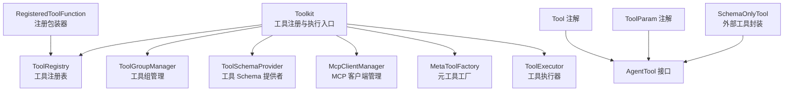
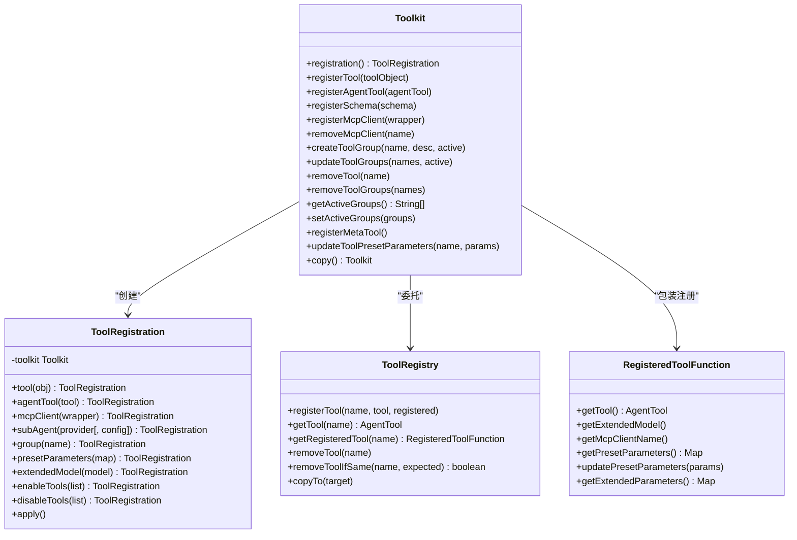
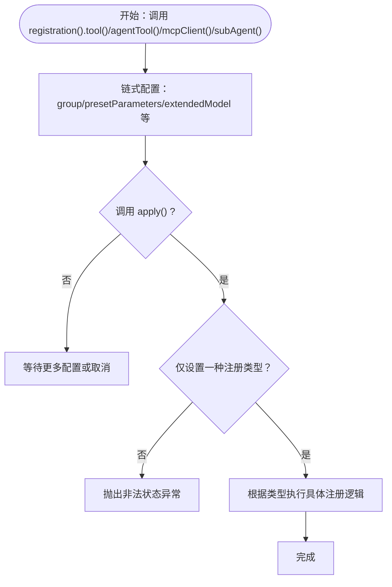
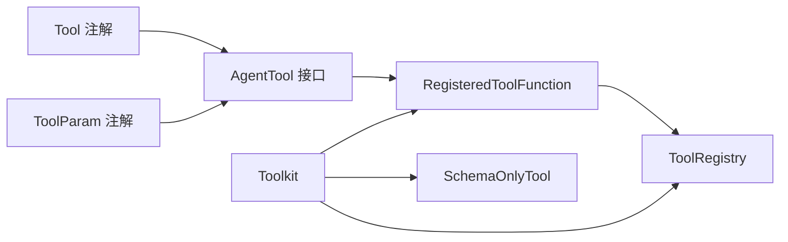

# 工具注册与管理

<cite>
**本文引用的文件**
- [Toolkit.java](file://agentscope-core/src/main/java/io/agentscope/core/tool/Toolkit.java)
- [Tool.java](file://agentscope-core/src/main/java/io/agentscope/core/tool/Tool.java)
- [ToolParam.java](file://agentscope-core/src/main/java/io/agentscope/core/tool/ToolParam.java)
- [AgentTool.java](file://agentscope-core/src/main/java/io/agentscope/core/tool/AgentTool.java)
- [SchemaOnlyTool.java](file://agentscope-core/src/main/java/io/agentscope/core/tool/SchemaOnlyTool.java)
- [RegisteredToolFunction.java](file://agentscope-core/src/main/java/io/agentscope/core/tool/RegisteredToolFunction.java)
- [ToolRegistry.java](file://agentscope-core/src/main/java/io/agentscope/core/tool/ToolRegistry.java)
- [ToolCallingExample.java](file://agentscope-examples/quickstart/src/main/java/io/agentscope/examples/quickstart/ToolCallingExample.java)
- [ToolGroupExample.java](file://agentscope-examples/quickstart/src/main/java/io/agentscope/examples/quickstart/ToolGroupExample.java)
- [McpToolExample.java](file://agentscope-examples/quickstart/src/main/java/io/agentscope/examples/quickstart/McpToolExample.java)
- [ToolkitTest.java](file://agentscope-core/src/test/java/io/agentscope/core/tool/ToolkitTest.java)
</cite>

## 目录
1. [简介](#简介)
2. [项目结构](#项目结构)
3. [核心组件](#核心组件)
4. [架构总览](#架构总览)
5. [详细组件分析](#详细组件分析)
6. [依赖关系分析](#依赖关系分析)
7. [性能考虑](#性能考虑)
8. [故障排查指南](#故障排查指南)
9. [结论](#结论)
10. [附录：完整示例路径](#附录完整示例路径)

## 简介
本文件面向 AgentScope Java 的工具注册与管理系统，聚焦于 Toolkit 类中的工具注册 API（如 registerTool()、registerAgentTool()、registerSchema()）与 ToolRegistration 构建器模式的使用。文档将系统阐述：
- 注册 API 的职责边界与调用流程
- 参数校验、预设参数注入与组管理机制
- 不同类型工具的注册方式：注解工具、Schema 工具、外部工具、MCP 客户端工具
- 工具注册后的状态管理与生命周期控制

## 项目结构
围绕工具注册与管理的关键模块如下：
- 工具接口与注解：AgentTool、Tool、ToolParam
- 工具注册与包装：RegisteredToolFunction、ToolRegistry
- 工具注册入口与构建器：Toolkit、ToolRegistration
- 外部工具支持：SchemaOnlyTool
- 示例与测试：示例应用与单元测试覆盖典型场景

图表来源
- [Toolkit.java:66-117](file://agentscope-core/src/main/java/io/agentscope/core/tool/Toolkit.java#L66-L117)
- [Tool.java:24-56](file://agentscope-core/src/main/java/io/agentscope/core/tool/Tool.java#L24-L56)
- [ToolParam.java:24-58](file://agentscope-core/src/main/java/io/agentscope/core/tool/ToolParam.java#L24-L58)
- [AgentTool.java:22-40](file://agentscope-core/src/main/java/io/agentscope/core/tool/AgentTool.java#L22-L40)
- [SchemaOnlyTool.java:26-58](file://agentscope-core/src/main/java/io/agentscope/core/tool/SchemaOnlyTool.java#L26-L58)
- [RegisteredToolFunction.java:22-56](file://agentscope-core/src/main/java/io/agentscope/core/tool/RegisteredToolFunction.java#L22-L56)
- [ToolRegistry.java:23-40](file://agentscope-core/src/main/java/io/agentscope/core/tool/ToolRegistry.java#L23-L40)

章节来源
- [Toolkit.java:37-65](file://agentscope-core/src/main/java/io/agentscope/core/tool/Toolkit.java#L37-L65)
- [Tool.java:24-56](file://agentscope-core/src/main/java/io/agentscope/core/tool/Tool.java#L24-L56)
- [ToolParam.java:24-58](file://agentscope-core/src/main/java/io/agentscope/core/tool/ToolParam.java#L24-L58)
- [AgentTool.java:22-40](file://agentscope-core/src/main/java/io/agentscope/core/tool/AgentTool.java#L22-L40)
- [SchemaOnlyTool.java:26-58](file://agentscope-core/src/main/java/io/agentscope/core/tool/SchemaOnlyTool.java#L26-L58)
- [RegisteredToolFunction.java:22-56](file://agentscope-core/src/main/java/io/agentscope/core/tool/RegisteredToolFunction.java#L22-L56)
- [ToolRegistry.java:23-40](file://agentscope-core/src/main/java/io/agentscope/core/tool/ToolRegistry.java#L23-L40)

## 核心组件
- Toolkit：工具注册、检索、执行与组管理的门面；内部委托 ToolRegistry、ToolGroupManager、ToolSchemaProvider、McpClientManager、MetaToolFactory、ToolExecutor 等组件协作。
- Tool 注解：标记方法为可被发现的工具，并提供名称、描述、严格模式与自定义结果转换器配置。
- ToolParam 注解：为工具方法参数提供 JSON Schema 元数据（名称、是否必填、描述）。
- AgentTool 接口：统一的工具抽象，定义名称、描述、参数 Schema、输出 Schema（可选）、异步调用接口。
- RegisteredToolFunction：对 AgentTool 的注册包装，承载扩展模型、MCP 客户端名与预设参数。
- ToolRegistry：线程安全的工具注册表，维护工具实现与其注册信息映射。
- SchemaOnlyTool：仅包含 Schema 的外部工具实现，用于声明式工具但不由框架执行。

章节来源
- [Toolkit.java:66-117](file://agentscope-core/src/main/java/io/agentscope/core/tool/Toolkit.java#L66-L117)
- [Tool.java:60-133](file://agentscope-core/src/main/java/io/agentscope/core/tool/Tool.java#L60-L133)
- [ToolParam.java:62-104](file://agentscope-core/src/main/java/io/agentscope/core/tool/ToolParam.java#L62-L104)
- [AgentTool.java:40-119](file://agentscope-core/src/main/java/io/agentscope/core/tool/AgentTool.java#L40-L119)
- [RegisteredToolFunction.java:28-76](file://agentscope-core/src/main/java/io/agentscope/core/tool/RegisteredToolFunction.java#L28-L76)
- [ToolRegistry.java:40-58](file://agentscope-core/src/main/java/io/agentscope/core/tool/ToolRegistry.java#L40-L58)
- [SchemaOnlyTool.java:58-77](file://agentscope-core/src/main/java/io/agentscope/core/tool/SchemaOnlyTool.java#L58-L77)

## 架构总览
下图展示了工具注册与执行在 Toolkit 内部的协作关系：

图表来源
- [Toolkit.java:146-148](file://agentscope-core/src/main/java/io/agentscope/core/tool/Toolkit.java#L146-L148)
- [Toolkit.java:746-983](file://agentscope-core/src/main/java/io/agentscope/core/tool/Toolkit.java#L746-L983)
- [ToolRegistry.java:40-155](file://agentscope-core/src/main/java/io/agentscope/core/tool/ToolRegistry.java#L40-L155)
- [RegisteredToolFunction.java:28-142](file://agentscope-core/src/main/java/io/agentscope/core/tool/RegisteredToolFunction.java#L28-L142)

## 详细组件分析

### 注册 API 深入解析
- registerTool(Object toolObject)
  - 扫描对象中带有 @Tool 注解的方法，自动注册为工具；若传入的是 AgentTool 实例，则走 registerAgentTool 分支。
  - 支持通过 Tool 注解的 name、description、strict、converter 等属性生成工具元数据。
  - 预设参数按工具名映射注入，schema 中排除预设参数字段。
- registerAgentTool(AgentTool tool)
  - 直接注册 AgentTool 实例，支持指定组、扩展模型与 MCP 客户端名。
  - 将 RegisteredToolFunction 包装后存入 ToolRegistry。
- registerSchema(ToolSchema schema)
  - 注册仅包含 Schema 的外部工具（SchemaOnlyTool），框架不会执行此类工具，而是返回“挂起”消息提示用户外部执行。
- registerMcpClient(McpClientWrapper wrapper)
  - 委托 McpClientManager 完成 MCP 客户端注册与工具同步，支持启用/禁用特定工具、组与预设参数。

章节来源
- [Toolkit.java:154-197](file://agentscope-core/src/main/java/io/agentscope/core/tool/Toolkit.java#L154-L197)
- [Toolkit.java:203-243](file://agentscope-core/src/main/java/io/agentscope/core/tool/Toolkit.java#L203-L243)
- [Toolkit.java:294-296](file://agentscope-core/src/main/java/io/agentscope/core/tool/Toolkit.java#L294-L296)
- [Toolkit.java:537-549](file://agentscope-core/src/main/java/io/agentscope/core/tool/Toolkit.java#L537-L549)

### ToolRegistration 构建器模式
- 职责：以链式 API 统一多种注册场景，避免方法重载爆炸，集中参数校验与应用逻辑。
- 关键能力：
  - 工具对象注册：tool(...)
  - AgentTool 实例注册：agentTool(...)
  - MCP 客户端注册：mcpClient(...)，配合 enableTools()/disableTools() 过滤工具
  - 子代理工具注册：subAgent(...)
  - 组与预设参数：group(...)、presetParameters(...)
  - 扩展模型：extendedModel(...)
  - 应用：apply() 执行最终注册，内置互斥与完整性校验
- 参数校验与约束：
  - apply() 前必须设置且仅能设置一种注册类型（tool、agentTool、mcpClient、subAgent）
  - 若未设置任何类型，抛出异常
  - 预设参数按工具名映射，schema 中不暴露预设参数
  - 组名存在性校验由 ToolGroupManager 完成

图表来源
- [Toolkit.java:942-983](file://agentscope-core/src/main/java/io/agentscope/core/tool/Toolkit.java#L942-L983)
- [Toolkit.java:746-983](file://agentscope-core/src/main/java/io/agentscope/core/tool/Toolkit.java#L746-L983)

章节来源
- [Toolkit.java:746-983](file://agentscope-core/src/main/java/io/agentscope/core/tool/Toolkit.java#L746-L983)

### 参数验证、预设参数与组管理
- 参数验证
  - 工具对象与 AgentTool 实例均进行非空校验
  - 组名存在性校验（当指定组时）
  - Tool 注解的 converter 必须可实例化（默认构造或带 ObjectMapper 构造）
- 预设参数处理
  - 预设参数在注册时写入 RegisteredToolFunction
  - schema 生成时排除预设参数字段，确保对外暴露的参数集合不含敏感或上下文参数
  - 运行时可通过 updateToolPresetParameters 动态更新，不影响已注册工具实例
- 组管理
  - createToolGroup()/updateToolGroups()/removeToolGroups() 控制工具组激活状态
  - getActiveGroups()/setActiveGroups() 查询与恢复组状态
  - 当 allowToolDeletion=false 时，删除/禁用行为会被忽略并记录警告

章节来源
- [Toolkit.java:166-168](file://agentscope-core/src/main/java/io/agentscope/core/tool/Toolkit.java#L166-L168)
- [Toolkit.java:222-225](file://agentscope-core/src/main/java/io/agentscope/core/tool/Toolkit.java#L222-L225)
- [Toolkit.java:370-376](file://agentscope-core/src/main/java/io/agentscope/core/tool/Toolkit.java#L370-L376)
- [Toolkit.java:694-713](file://agentscope-core/src/main/java/io/agentscope/core/tool/Toolkit.java#L694-L713)
- [Toolkit.java:561-594](file://agentscope-core/src/main/java/io/agentscope/core/tool/Toolkit.java#L561-L594)
- [Toolkit.java:632-641](file://agentscope-core/src/main/java/io/agentscope/core/tool/Toolkit.java#L632-L641)

### 外部工具与 Schema 工具
- SchemaOnlyTool
  - 仅持有工具名称、描述、参数 Schema 与严格模式标志
  - callAsync 总是抛出 ToolSuspendException，促使框架返回“挂起”消息给用户
- registerSchema(ToolSchema)
  - 将 ToolSchema 包装为 SchemaOnlyTool 并注册，便于声明外部工具

章节来源
- [SchemaOnlyTool.java:58-154](file://agentscope-core/src/main/java/io/agentscope/core/tool/SchemaOnlyTool.java#L58-L154)
- [Toolkit.java:294-296](file://agentscope-core/src/main/java/io/agentscope/core/tool/Toolkit.java#L294-L296)

### 执行与生命周期
- callTool(ToolCallParam)/callTools(...)：委托 ToolExecutor 执行单个或多个工具调用，合并执行配置（超时、重试等），支持流式分片回调
- copy()：深拷贝 Toolkit，保留用户自定义分片回调，便于在 ReActAgent 中传递与复用
- 生命周期要点：注册后即刻可用；组状态变化会即时影响可调用性；允许动态更新预设参数；支持原子替换与移除

章节来源
- [Toolkit.java:489-524](file://agentscope-core/src/main/java/io/agentscope/core/tool/Toolkit.java#L489-L524)
- [Toolkit.java:725-738](file://agentscope-core/src/main/java/io/agentscope/core/tool/Toolkit.java#L725-L738)

## 依赖关系分析
- Toolkit 对 Tool 注解、ToolParam 注解、AgentTool 接口、RegisteredToolFunction、ToolRegistry、McpClientManager、MetaToolFactory、ToolExecutor 存在直接依赖
- 注册流程中，RegisteredToolFunction 作为包装器承载扩展模型与预设参数，ToolRegistry 负责存储与查询
- 外部工具通过 SchemaOnlyTool 与 isExternalTool 判定，避免框架执行

图表来源
- [Tool.java:60-133](file://agentscope-core/src/main/java/io/agentscope/core/tool/Tool.java#L60-L133)
- [ToolParam.java:62-104](file://agentscope-core/src/main/java/io/agentscope/core/tool/ToolParam.java#L62-L104)
- [AgentTool.java:40-119](file://agentscope-core/src/main/java/io/agentscope/core/tool/AgentTool.java#L40-L119)
- [RegisteredToolFunction.java:28-76](file://agentscope-core/src/main/java/io/agentscope/core/tool/RegisteredToolFunction.java#L28-L76)
- [ToolRegistry.java:40-58](file://agentscope-core/src/main/java/io/agentscope/core/tool/ToolRegistry.java#L40-L58)
- [SchemaOnlyTool.java:58-77](file://agentscope-core/src/main/java/io/agentscope/core/tool/SchemaOnlyTool.java#L58-L77)
- [Toolkit.java:66-117](file://agentscope-core/src/main/java/io/agentscope/core/tool/Toolkit.java#L66-L117)

章节来源
- [Toolkit.java:66-117](file://agentscope-core/src/main/java/io/agentscope/core/tool/Toolkit.java#L66-L117)
- [ToolRegistry.java:40-58](file://agentscope-core/src/main/java/io/agentscope/core/tool/ToolRegistry.java#L40-L58)
- [RegisteredToolFunction.java:28-76](file://agentscope-core/src/main/java/io/agentscope/core/tool/RegisteredToolFunction.java#L28-L76)
- [SchemaOnlyTool.java:58-77](file://agentscope-core/src/main/java/io/agentscope/core/tool/SchemaOnlyTool.java#L58-L77)

## 性能考虑
- 注册阶段：基于反射扫描 @Tool 方法，建议在应用启动时集中注册，避免运行期频繁反射开销
- 执行阶段：ToolExecutor 支持并行/串行策略与执行配置合并，合理设置并发度与超时重试可提升吞吐
- Schema 生成：参数 Schema 通过 ToolSchemaGenerator 生成，避免重复计算可缓存结果（框架内部已优化）
- 流式回调：setChunkCallback/setInternalChunkCallback 仅在需要时设置，避免不必要的事件派发

## 故障排查指南
- “未设置任何注册类型”或“设置了多种注册类型”
  - 现象：调用 apply() 抛出非法状态异常
  - 处理：确保仅调用 tool()/agentTool()/mcpClient()/subAgent() 中的一种
- “工具组未激活导致调用失败”
  - 现象：调用返回错误响应，提示未授权或不可用
  - 处理：确认组状态，使用 updateToolGroups 或 meta-tool 激活所需组
- “删除/禁用被忽略”
  - 现象：当 allowToolDeletion=false 时，removeTool/removeToolGroups/updateToolGroups(false) 无效
  - 处理：调整 ToolkitConfig 或在允许删除的场景下操作
- “预设参数未生效”
  - 现象：schema 中出现预设参数或运行时未注入
  - 处理：确认 presetParameters 映射正确，schema 生成时会排除预设参数；必要时使用 updateToolPresetParameters 动态更新

章节来源
- [ToolkitTest.java:763-800](file://agentscope-core/src/test/java/io/agentscope/core/tool/ToolkitTest.java#L763-L800)
- [ToolkitTest.java:330-350](file://agentscope-core/src/test/java/io/agentscope/core/tool/ToolkitTest.java#L330-L350)
- [ToolkitTest.java:352-372](file://agentscope-core/src/test/java/io/agentscope/core/tool/ToolkitTest.java#L352-L372)
- [ToolkitTest.java:605-714](file://agentscope-core/src/test/java/io/agentscope/core/tool/ToolkitTest.java#L605-L714)

## 结论
Toolkit 通过清晰的注册 API 与 ToolRegistration 构建器模式，统一了注解工具、AgentTool 实例、Schema 工具与 MCP 客户端的注册流程。结合 RegisteredToolFunction 的预设参数注入、ToolRegistry 的线程安全存储与 ToolGroupManager 的组管理，实现了灵活可控的工具生命周期管理。配合 ToolExecutor 的执行策略与流式回调，满足多场景下的工具编排需求。

## 附录：完整示例路径
- 注解工具注册与调用
  - [ToolCallingExample.java:44-75](file://agentscope-examples/quickstart/src/main/java/io/agentscope/examples/quickstart/ToolCallingExample.java#L44-L75)
- 工具组与元工具（动态组管理）
  - [ToolGroupExample.java:77-102](file://agentscope-examples/quickstart/src/main/java/io/agentscope/examples/quickstart/ToolGroupExample.java#L77-L102)
  - [ToolGroupExample.java:104-131](file://agentscope-examples/quickstart/src/main/java/io/agentscope/examples/quickstart/ToolGroupExample.java#L104-L131)
- MCP 客户端工具注册
  - [McpToolExample.java:50-78](file://agentscope-examples/quickstart/src/main/java/io/agentscope/examples/quickstart/McpToolExample.java#L50-L78)
  - [McpToolExample.java:105-168](file://agentscope-examples/quickstart/src/main/java/io/agentscope/examples/quickstart/McpToolExample.java#L105-L168)
- 单元测试覆盖关键行为
  - [ToolkitTest.java:97-133](file://agentscope-core/src/test/java/io/agentscope/core/tool/ToolkitTest.java#L97-L133)
  - [ToolkitTest.java:135-175](file://agentscope-core/src/test/java/io/agentscope/core/tool/ToolkitTest.java#L135-L175)
  - [ToolkitTest.java:177-191](file://agentscope-core/src/test/java/io/agentscope/core/tool/ToolkitTest.java#L177-L191)
  - [ToolkitTest.java:414-461](file://agentscope-core/src/test/java/io/agentscope/core/tool/ToolkitTest.java#L414-L461)
  - [ToolkitTest.java:463-486](file://agentscope-core/src/test/java/io/agentscope/core/tool/ToolkitTest.java#L463-L486)
  - [ToolkitTest.java:488-511](file://agentscope-core/src/test/java/io/agentscope/core/tool/ToolkitTest.java#L488-L511)
  - [ToolkitTest.java:513-566](file://agentscope-core/src/test/java/io/agentscope/core/tool/ToolkitTest.java#L513-L566)
  - [ToolkitTest.java:605-714](file://agentscope-core/src/test/java/io/agentscope/core/tool/ToolkitTest.java#L605-L714)
  - [ToolkitTest.java:716-760](file://agentscope-core/src/test/java/io/agentscope/core/tool/ToolkitTest.java#L716-L760)