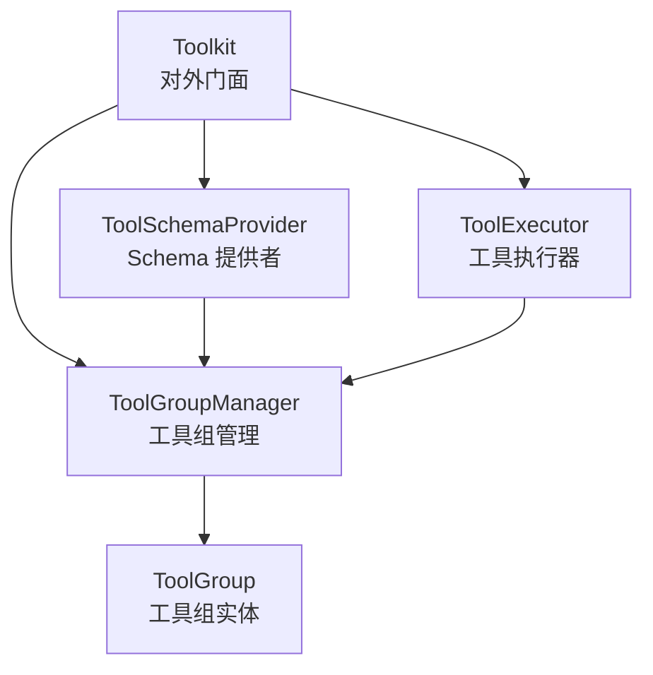
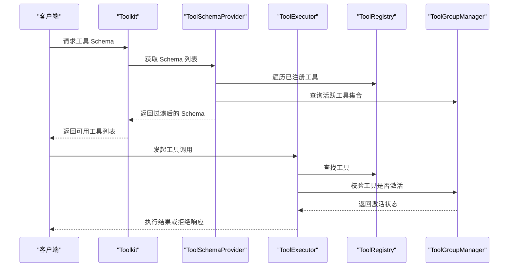
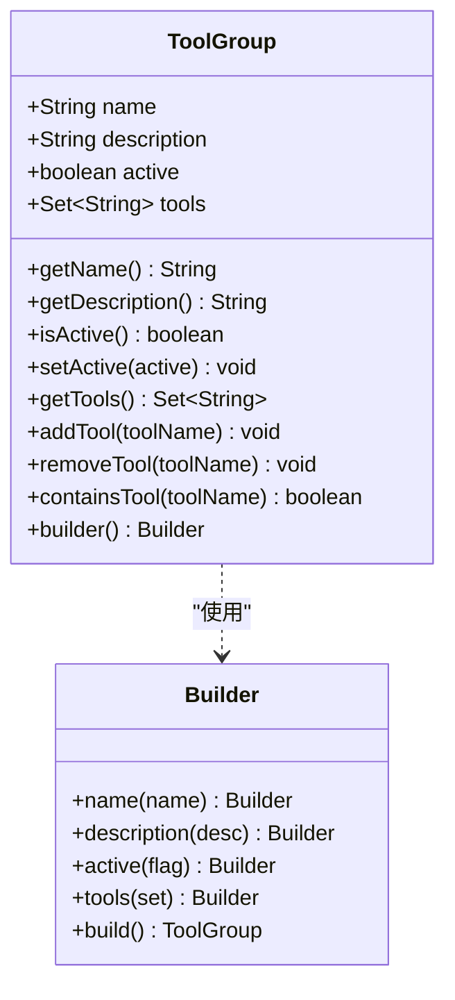
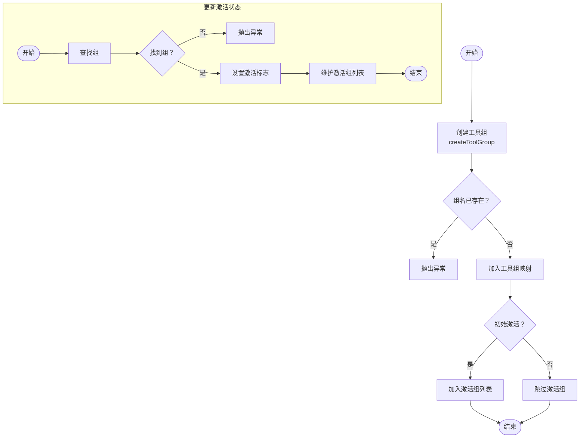
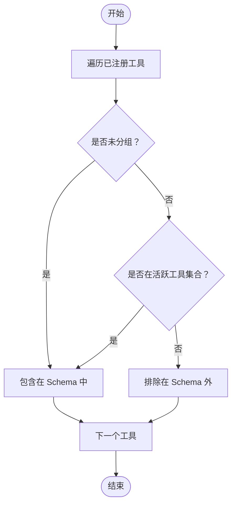
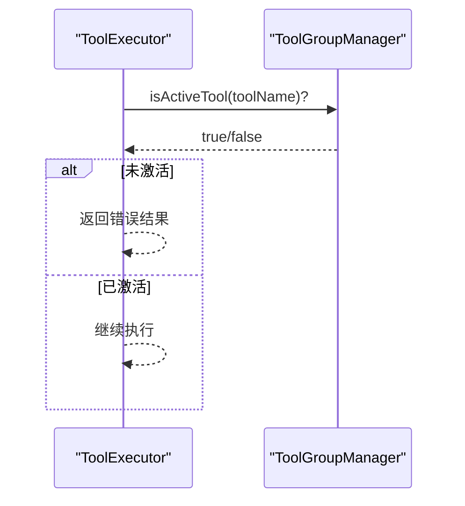
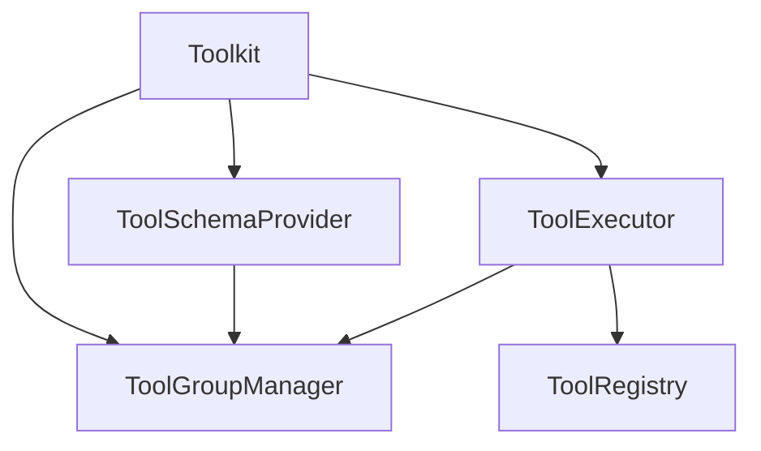

# 工具组管理

<cite>
**本文引用的文件**
- [ToolGroupManager.java](file://agentscope-core/src/main/java/io/agentscope/core/tool/ToolGroupManager.java)
- [ToolGroup.java](file://agentscope-core/src/main/java/io/agentscope/core/tool/ToolGroup.java)
- [Toolkit.java](file://agentscope-core/src/main/java/io/agentscope/core/tool/Toolkit.java)
- [ToolSchemaProvider.java](file://agentscope-core/src/main/java/io/agentscope/core/tool/ToolSchemaProvider.java)
- [ToolExecutor.java](file://agentscope-core/src/main/java/io/agentscope/core/tool/ToolExecutor.java)
- [ToolkitConfig.java](file://agentscope-core/src/main/java/io/agentscope/core/tool/ToolkitConfig.java)
- [ToolGroupManagerTest.java](file://agentscope-core/src/test/java/io/agentscope/core/tool/ToolGroupManagerTest.java)
- [ToolGroupsE2ETest.java](file://agentscope-core/src/test/java/io/agentscope/core/e2e/ToolGroupsE2ETest.java)
- [agent-config.md](file://docs/zh/task/agent-config.md)
</cite>

## 目录
1. [简介](#简介)
2. [项目结构](#项目结构)
3. [核心组件](#核心组件)
4. [架构总览](#架构总览)
5. [详细组件分析](#详细组件分析)
6. [依赖分析](#依赖分析)
7. [性能考虑](#性能考虑)
8. [故障排查指南](#故障排查指南)
9. [结论](#结论)
10. [附录](#附录)

## 简介
本文件面向 AgentScope Java 工具组管理系统，围绕工具组的创建、激活与管理 API 进行系统化说明，重点覆盖以下内容：
- 工具组管理 API：createToolGroup()、updateToolGroups()、removeToolGroups() 的行为与约束
- 工具组状态管理：激活状态、描述信息、工具列表维护与可用性判定
- 工具调用中的作用机制：组过滤与可用工具确定
- 最佳实践：命名约定、描述编写、权限控制
- 持久化与恢复：activeGroups 的保存与恢复，以及在会话管理中的应用
- 完整示例与常见使用场景

## 项目结构
工具组管理相关的核心代码位于 agentscope-core 模块的 tool 包中，主要由以下类组成：
- ToolGroup：工具组实体，包含名称、描述、激活状态与工具集合
- ToolGroupManager：工具组的增删改查、激活状态维护、可用工具集合计算
- Toolkit：对外 API 的门面，委托工具组管理与工具注册、执行等
- ToolSchemaProvider：根据激活状态过滤工具 Schema
- ToolExecutor：工具执行器，在执行前校验工具是否处于激活状态
- ToolkitConfig：工具执行配置，含“是否允许删除工具”的开关

图表来源
- [Toolkit.java:66-117](file://agentscope-core/src/main/java/io/agentscope/core/tool/Toolkit.java#L66-L117)
- [ToolGroupManager.java:31-394](file://agentscope-core/src/main/java/io/agentscope/core/tool/ToolGroupManager.java#L31-L394)
- [ToolSchemaProvider.java:44-94](file://agentscope-core/src/main/java/io/agentscope/core/tool/ToolSchemaProvider.java#L44-L94)
- [ToolExecutor.java:57-94](file://agentscope-core/src/main/java/io/agentscope/core/tool/ToolExecutor.java#L57-L94)

章节来源
- [Toolkit.java:66-117](file://agentscope-core/src/main/java/io/agentscope/core/tool/Toolkit.java#L66-L117)
- [ToolGroupManager.java:31-394](file://agentscope-core/src/main/java/io/agentscope/core/tool/ToolGroupManager.java#L31-L394)
- [ToolSchemaProvider.java:44-94](file://agentscope-core/src/main/java/io/agentscope/core/tool/ToolSchemaProvider.java#L44-L94)
- [ToolExecutor.java:57-94](file://agentscope-core/src/main/java/io/agentscope/core/tool/ToolExecutor.java#L57-L94)

## 核心组件
- 工具组实体 ToolGroup
  - 字段：名称、描述、激活状态、工具集合
  - 方法：添加/移除工具、判断是否包含某工具、构建器
- 工具组管理器 ToolGroupManager
  - 能力：创建/更新/删除工具组；维护激活组列表；按组维护工具索引；计算活跃工具集合；查询激活状态与可用性
- 工具箱 Toolkit
  - 对外 API：createToolGroup()/updateToolGroups()/removeToolGroups() 委托给 ToolGroupManager
  - 其他职责：工具注册、Schema 生成、执行器、MCP 客户端管理、元工具注册
- Schema 提供者 ToolSchemaProvider
  - 过滤逻辑：仅暴露未分组或处于激活组内的工具 Schema
- 执行器 ToolExecutor
  - 执行前校验：若工具不在任何组或所在组不激活，则拒绝执行
- 配置 ToolkitConfig
  - 控制是否允许删除工具（影响 updateToolGroups(false) 与 removeToolGroups() 的行为）

章节来源
- [ToolGroup.java:42-201](file://agentscope-core/src/main/java/io/agentscope/core/tool/ToolGroup.java#L42-L201)
- [ToolGroupManager.java:39-394](file://agentscope-core/src/main/java/io/agentscope/core/tool/ToolGroupManager.java#L39-L394)
- [Toolkit.java:551-665](file://agentscope-core/src/main/java/io/agentscope/core/tool/Toolkit.java#L551-L665)
- [ToolSchemaProvider.java:66-93](file://agentscope-core/src/main/java/io/agentscope/core/tool/ToolSchemaProvider.java#L66-L93)
- [ToolExecutor.java:183-264](file://agentscope-core/src/main/java/io/agentscope/core/tool/ToolExecutor.java#L183-L264)
- [ToolkitConfig.java:32-207](file://agentscope-core/src/main/java/io/agentscope/core/tool/ToolkitConfig.java#L32-L207)

## 架构总览
工具组在工具调用链路中的位置如下：

图表来源
- [Toolkit.java:332-334](file://agentscope-core/src/main/java/io/agentscope/core/tool/Toolkit.java#L332-L334)
- [ToolSchemaProvider.java:66-93](file://agentscope-core/src/main/java/io/agentscope/core/tool/ToolSchemaProvider.java#L66-L93)
- [ToolExecutor.java:183-264](file://agentscope-core/src/main/java/io/agentscope/core/tool/ToolExecutor.java#L183-L264)
- [ToolGroupManager.java:266-274](file://agentscope-core/src/main/java/io/agentscope/core/tool/ToolGroupManager.java#L266-L274)

## 详细组件分析

### 工具组实体 ToolGroup
- 设计要点
  - 不可变字段通过构造器设置，避免外部直接修改
  - 工具集合采用不可变副本返回，保证封装性
  - Builder 支持灵活初始化，含默认值
- 关键方法
  - addTool/removeTool/containsTool：对工具集合进行维护
  - isActive/setActive：控制激活状态
  - getTools/name/description：访问属性

图表来源
- [ToolGroup.java:42-201](file://agentscope-core/src/main/java/io/agentscope/core/tool/ToolGroup.java#L42-L201)

章节来源
- [ToolGroup.java:42-201](file://agentscope-core/src/main/java/io/agentscope/core/tool/ToolGroup.java#L42-L201)

### 工具组管理器 ToolGroupManager
- 创建工具组
  - createToolGroup(groupName, description, active)：若同名组已存在则抛出异常
  - 默认激活状态为 true
- 更新工具组激活状态
  - updateToolGroups(groupNames, active)：不存在的组会抛出异常；激活状态变更同时维护 activeGroups 列表
- 删除工具组
  - removeToolGroups(groupNames)：返回被移除组内工具名集合；从工具索引中清理对应映射；从激活组中移除
- 查询与校验
  - getActiveToolNames()：聚合所有激活组的工具集合
  - isActiveTool(toolName)/isActiveGroup(groupName)：基于组激活状态与工具索引判断
  - getNotes()/getActivatedNotes()：生成人类可读的工具组状态说明
  - validateGroupExists()：校验组是否存在
- 状态复制与恢复
  - copyTo(target)：深拷贝工具组、工具索引与激活组
  - setActiveGroups(activeGroups)：用于从会话状态恢复激活组

图表来源
- [ToolGroupManager.java:47-103](file://agentscope-core/src/main/java/io/agentscope/core/tool/ToolGroupManager.java#L47-L103)

章节来源
- [ToolGroupManager.java:39-394](file://agentscope-core/src/main/java/io/agentscope/core/tool/ToolGroupManager.java#L39-L394)

### 工具箱 Toolkit 对外 API
- createToolGroup(groupName, description[, active])
  - 委托 ToolGroupManager.createToolGroup(...)
- updateToolGroups(groupNames, active)
  - 若 ToolkitConfig.allowToolDeletion 为 false，则忽略 deactivation 并记录警告
- removeToolGroups(groupNames)
  - 若 ToolkitConfig.allowToolDeletion 为 false，则忽略删除并记录警告；否则删除组并从注册表移除对应工具
- getActiveGroups()/setActiveGroups()
  - 获取/设置当前激活的工具组列表，常用于会话状态恢复
- getToolGroup(groupName)
  - 获取指定工具组对象

章节来源
- [Toolkit.java:551-665](file://agentscope-core/src/main/java/io/agentscope/core/tool/Toolkit.java#L551-L665)
- [ToolkitConfig.java:170-181](file://agentscope-core/src/main/java/io/agentscope/core/tool/ToolkitConfig.java#L170-L181)

### Schema 生成与组过滤
- ToolSchemaProvider.getToolSchemas()
  - 仅返回未分组工具或属于至少一个激活组的工具
  - 依据 ToolGroupManager.getActiveToolNames() 与 isGroupedTool(toolName) 判断

图表来源
- [ToolSchemaProvider.java:66-93](file://agentscope-core/src/main/java/io/agentscope/core/tool/ToolSchemaProvider.java#L66-L93)

章节来源
- [ToolSchemaProvider.java:66-93](file://agentscope-core/src/main/java/io/agentscope/core/tool/ToolSchemaProvider.java#L66-L93)

### 工具执行与组校验
- ToolExecutor.executeCore()
  - 在执行前检查工具是否激活：若工具未分组则视为激活；否则需至少属于一个激活组
  - 若未激活，返回错误结果并记录日志

图表来源
- [ToolExecutor.java:191-199](file://agentscope-core/src/main/java/io/agentscope/core/tool/ToolExecutor.java#L191-L199)
- [ToolGroupManager.java:231-245](file://agentscope-core/src/main/java/io/agentscope/core/tool/ToolGroupManager.java#L231-L245)

章节来源
- [ToolExecutor.java:183-264](file://agentscope-core/src/main/java/io/agentscope/core/tool/ToolExecutor.java#L183-L264)
- [ToolGroupManager.java:231-245](file://agentscope-core/src/main/java/io/agentscope/core/tool/ToolGroupManager.java#L231-L245)

### 持久化与恢复
- 激活组持久化
  - Toolkit.getActiveGroups() 返回当前激活组列表，可用于序列化存储
- 状态恢复
  - Toolkit.setActiveGroups(activeGroups) 将激活组恢复到 ToolGroupManager
  - ToolGroupManager.copyTo() 支持深拷贝工具组状态，便于在会话切换或 Agent 复制时保留状态

章节来源
- [Toolkit.java:652-665](file://agentscope-core/src/main/java/io/agentscope/core/tool/Toolkit.java#L652-L665)
- [ToolGroupManager.java:327-337](file://agentscope-core/src/main/java/io/agentscope/core/tool/ToolGroupManager.java#L327-L337)
- [ToolGroupManager.java:354-379](file://agentscope-core/src/main/java/io/agentscope/core/tool/ToolGroupManager.java#L354-L379)

### 最佳实践
- 命名约定
  - 组名应语义明确、唯一且稳定，便于在会话恢复与跨模块共享时识别
- 描述编写
  - 为每个组提供清晰的描述，帮助模型与使用者理解用途与边界
- 权限控制
  - 使用工具组实现“最小权限”原则：仅在需要时激活高风险组
  - 通过 ToolkitConfig.allowToolDeletion 控制是否允许动态禁用/删除工具
- 组过滤与可用性
  - 未分组工具默认可用；仅激活组内的工具才会出现在 Schema 中
- 会话管理
  - 在会话结束时持久化 activeGroups；在会话恢复时调用 setActiveGroups 恢复状态

章节来源
- [ToolkitConfig.java:170-181](file://agentscope-core/src/main/java/io/agentscope/core/tool/ToolkitConfig.java#L170-L181)
- [ToolSchemaProvider.java:38-42](file://agentscope-core/src/main/java/io/agentscope/core/tool/ToolSchemaProvider.java#L38-L42)

### 完整使用示例与常见场景
- 基础示例（综合配置）
  - 展示如何创建工具组、注册工具到不同组、动态激活高级工具组并进行工具调用
  - 参考路径：[agent-config.md:578-730](file://docs/zh/task/agent-config.md#L578-L730)
- 端到端测试（动态激活与可用性）
  - 验证仅激活组内的工具可被模型发现与调用
  - 参考路径：[ToolGroupsE2ETest.java:87-174](file://agentscope-core/src/test/java/io/agentscope/core/e2e/ToolGroupsE2ETest.java#L87-L174)
- 单元测试（管理器行为）
  - 覆盖创建、更新、删除、查询、激活状态一致性等行为
  - 参考路径：[ToolGroupManagerTest.java:39-484](file://agentscope-core/src/test/java/io/agentscope/core/tool/ToolGroupManagerTest.java#L39-L484)

章节来源
- [agent-config.md:578-730](file://docs/zh/task/agent-config.md#L578-L730)
- [ToolGroupsE2ETest.java:87-174](file://agentscope-core/src/test/java/io/agentscope/core/e2e/ToolGroupsE2ETest.java#L87-L174)
- [ToolGroupManagerTest.java:39-484](file://agentscope-core/src/test/java/io/agentscope/core/tool/ToolGroupManagerTest.java#L39-L484)

## 依赖分析
- 组件耦合
  - Toolkit 作为门面，依赖 ToolGroupManager、ToolSchemaProvider、ToolExecutor、ToolRegistry
  - ToolSchemaProvider 依赖 ToolRegistry 与 ToolGroupManager
  - ToolExecutor 依赖 ToolRegistry 与 ToolGroupManager
- 数据结构
  - 工具组映射：Map<String, ToolGroup>
  - 工具索引：Map<String, Set<String>>（工具名 -> 组名集合）
  - 激活组列表：CopyOnWriteArrayList<String>（线程安全迭代）
- 外部依赖
  - 日志框架（SLF4J）
  - Reactor（异步执行与调度）

图表来源
- [Toolkit.java:70-117](file://agentscope-core/src/main/java/io/agentscope/core/tool/Toolkit.java#L70-L117)
- [ToolSchemaProvider.java:55-58](file://agentscope-core/src/main/java/io/agentscope/core/tool/ToolSchemaProvider.java#L55-L58)
- [ToolExecutor.java:83-94](file://agentscope-core/src/main/java/io/agentscope/core/tool/ToolExecutor.java#L83-L94)

章节来源
- [Toolkit.java:70-117](file://agentscope-core/src/main/java/io/agentscope/core/tool/Toolkit.java#L70-L117)
- [ToolSchemaProvider.java:55-58](file://agentscope-core/src/main/java/io/agentscope/core/tool/ToolSchemaProvider.java#L55-L58)
- [ToolExecutor.java:83-94](file://agentscope-core/src/main/java/io/agentscope/core/tool/ToolExecutor.java#L83-L94)

## 性能考虑
- 并发安全
  - 工具组映射与工具索引使用并发容器；激活组列表使用 CopyOnWriteArrayList，适合读多写少场景
- 查询复杂度
  - 激活工具集合：O(G)（G 为组数量），每次聚合所有激活组的工具集合
  - 工具可用性判断：O(H)（H 为工具所属组数量），通过工具索引快速定位
- 执行路径
  - Schema 生成与执行前校验均为 O(N)（N 为已注册工具数量），建议在高频调用场景下缓存 Schema 或减少不必要的重复生成

## 故障排查指南
- 异常类型与原因
  - 创建重复组：抛出非法参数异常，提示组已存在
  - 更新不存在的组：抛出非法参数异常，提示组不存在
  - 删除不存在的组：记录警告并跳过（若允许删除）
  - 工具未激活：执行器返回错误结果，日志记录拒绝原因
- 排查步骤
  - 确认组名唯一且拼写正确
  - 使用 getActiveGroups()/getNotes() 检查当前激活状态
  - 使用 ToolGroupManager.validateGroupExists() 快速验证组存在性
  - 检查 ToolkitConfig.allowToolDeletion 是否导致更新/删除被忽略
  - 在 Schema 生成阶段确认工具是否属于激活组或未分组

章节来源
- [ToolGroupManager.java:48-50](file://agentscope-core/src/main/java/io/agentscope/core/tool/ToolGroupManager.java#L48-L50)
- [ToolGroupManager.java:85-89](file://agentscope-core/src/main/java/io/agentscope/core/tool/ToolGroupManager.java#L85-L89)
- [ToolExecutor.java:194-199](file://agentscope-core/src/main/java/io/agentscope/core/tool/ToolExecutor.java#L194-L199)
- [Toolkit.java:587-593](file://agentscope-core/src/main/java/io/agentscope/core/tool/Toolkit.java#L587-L593)

## 结论
工具组管理通过 ToolGroup 与 ToolGroupManager 实现了对工具可用性的细粒度控制，结合 ToolSchemaProvider 的过滤与 ToolExecutor 的执行前校验，确保只有激活组内的工具会被模型发现与调用。配合 ToolkitConfig 的删除开关与会话状态的持久化/恢复，可在生产环境中实现安全、可控且可追踪的工具生命周期管理。

## 附录
- 常用 API 一览
  - 创建：createToolGroup(groupName, description[, active])
  - 更新：updateToolGroups(groupNames, active)
  - 删除：removeToolGroups(groupNames)
  - 查询：getActiveGroups()/getToolGroup(groupName)
  - 恢复：setActiveGroups(activeGroups)

章节来源
- [Toolkit.java:551-665](file://agentscope-core/src/main/java/io/agentscope/core/tool/Toolkit.java#L551-L665)