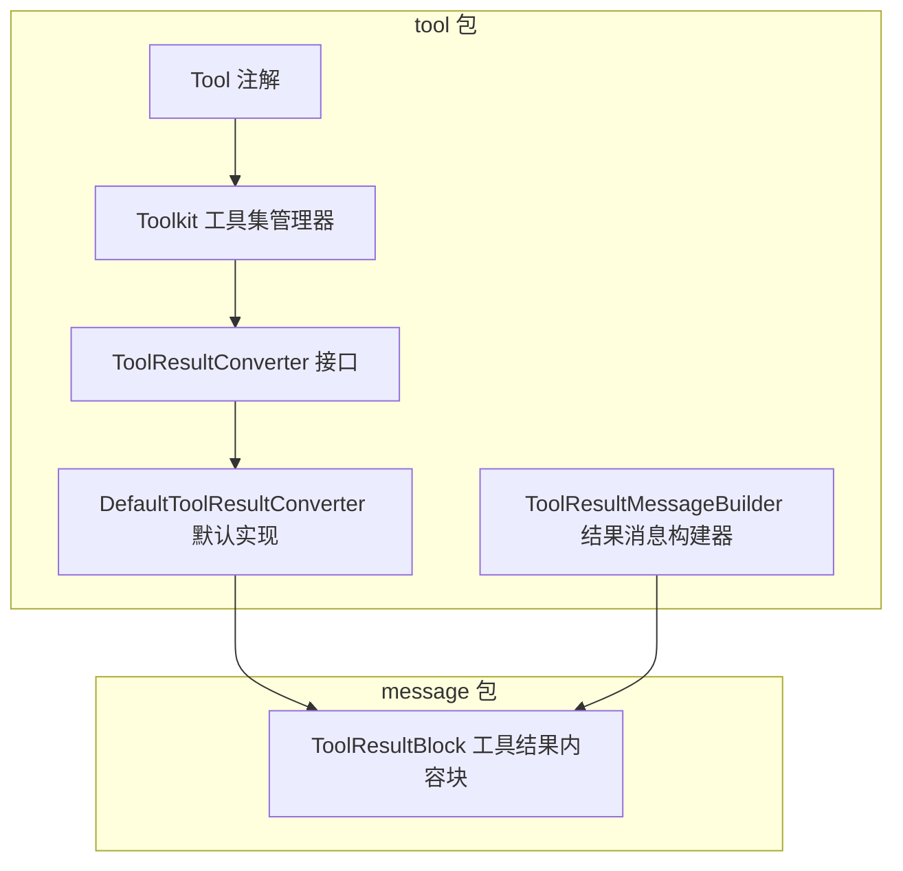
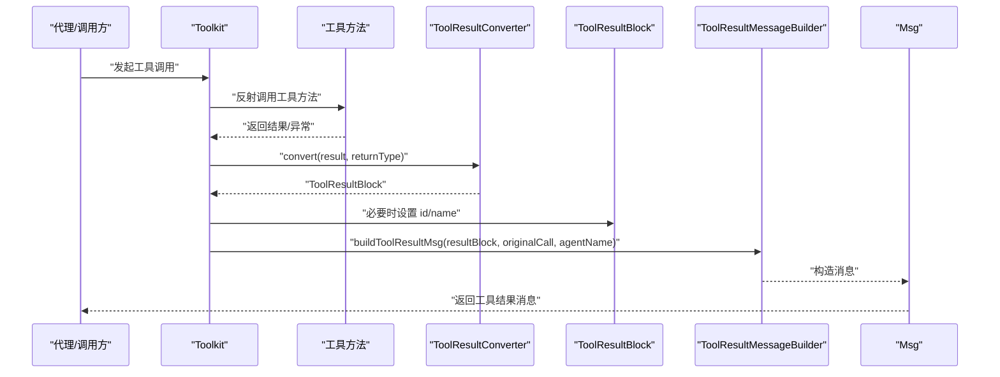
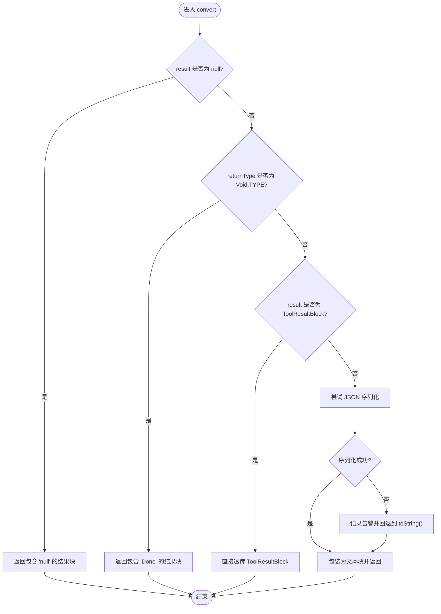
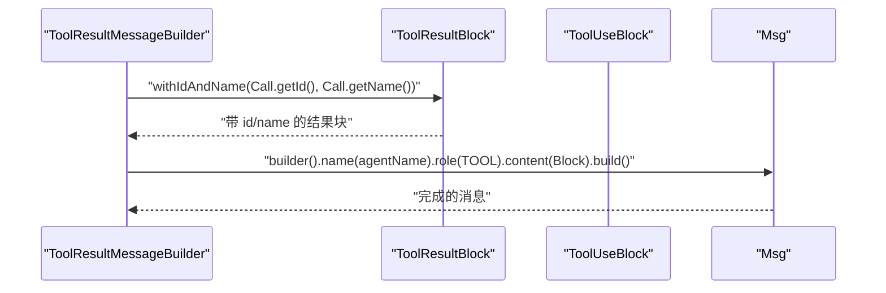
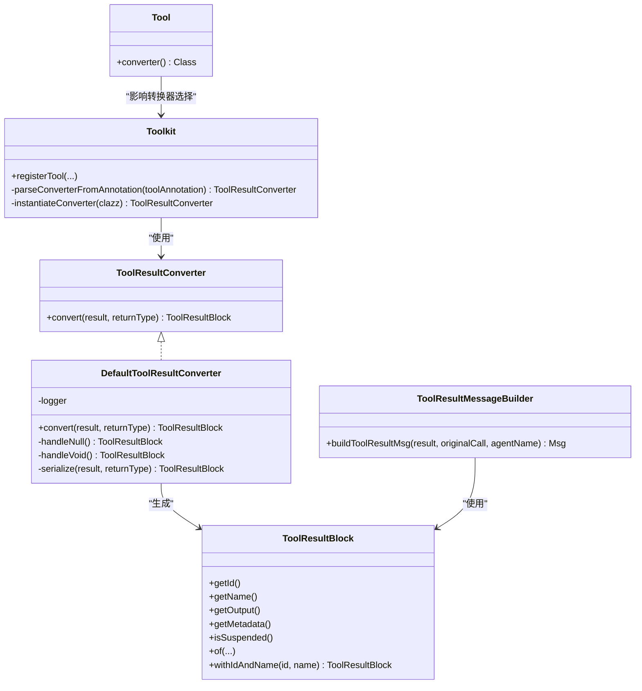
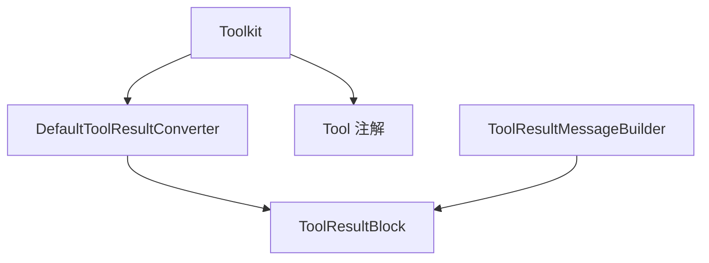

# 工具结果转换

<cite>
**本文引用的文件**
- [ToolResultConverter.java](file://agentscope-core/src/main/java/io/agentscope/core/tool/ToolResultConverter.java)
- [DefaultToolResultConverter.java](file://agentscope-core/src/main/java/io/agentscope/core/tool/DefaultToolResultConverter.java)
- [ToolResultMessageBuilder.java](file://agentscope-core/src/main/java/io/agentscope/core/tool/ToolResultMessageBuilder.java)
- [Tool.java](file://agentscope-core/src/main/java/io/agentscope/core/tool/Tool.java)
- [Toolkit.java](file://agentscope-core/src/main/java/io/agentscope/core/tool/Toolkit.java)
- [ToolResultBlock.java](file://agentscope-core/src/main/java/io/agentscope/core/message/ToolResultBlock.java)
- [DefaultToolResultConverterTest.java](file://agentscope-core/src/test/java/io/agentscope/core/tool/DefaultToolResultConverterTest.java)
</cite>

## 目录
1. [简介](#简介)
2. [项目结构](#项目结构)
3. [核心组件](#核心组件)
4. [架构总览](#架构总览)
5. [组件详解](#组件详解)
6. [依赖关系分析](#依赖关系分析)
7. [性能与行为特性](#性能与行为特性)
8. [故障排查指南](#故障排查指南)
9. [结论](#结论)
10. [附录：开发与测试指南](#附录开发与测试指南)

## 简介
本文件面向 AgentScope Java 的“工具结果转换”子系统，聚焦于 ToolResultConverter 接口的设计与实现、默认转换器的行为与配置、以及 ToolResultMessageBuilder 的使用方式。文档旨在帮助开发者：
- 深入理解工具调用后结果如何被转换为消息内容块；
- 自定义转换器以满足特定输出格式、数据过滤或元数据附加需求；
- 正确注册与使用转换器，并在工具调用流程中发挥其作用；
- 构建工具结果消息（含 id 与 name 的设置），以便后续模型消费。

## 项目结构
与工具结果转换直接相关的代码主要位于 agentscope-core 模块的 tool 与 message 包中：
- tool 包：定义工具注解、工具执行与注册、结果转换接口与默认实现、消息构建器等；
- message 包：定义消息内容块模型，包括工具结果块 ToolResultBlock。

图表来源
- [ToolResultConverter.java:48-58](file://agentscope-core/src/main/java/io/agentscope/core/tool/ToolResultConverter.java#L48-L58)
- [DefaultToolResultConverter.java:39-98](file://agentscope-core/src/main/java/io/agentscope/core/tool/DefaultToolResultConverter.java#L39-L98)
- [ToolResultMessageBuilder.java:30-52](file://agentscope-core/src/main/java/io/agentscope/core/tool/ToolResultMessageBuilder.java#L30-L52)
- [Tool.java:60-133](file://agentscope-core/src/main/java/io/agentscope/core/tool/Tool.java#L60-L133)
- [Toolkit.java:66-117](file://agentscope-core/src/main/java/io/agentscope/core/tool/Toolkit.java#L66-L117)
- [ToolResultBlock.java:35-375](file://agentscope-core/src/main/java/io/agentscope/core/message/ToolResultBlock.java#L35-L375)

章节来源
- [Toolkit.java:66-117](file://agentscope-core/src/main/java/io/agentscope/core/tool/Toolkit.java#L66-L117)

## 核心组件
- ToolResultConverter 接口：定义工具方法返回值到 ToolResultBlock 的转换契约，支持按工具粒度定制转换逻辑。
- DefaultToolResultConverter 默认实现：提供通用的空值、无返回值、已存在结果块、JSON 序列化等处理策略，并在序列化失败时回退到字符串表示。
- ToolResultMessageBuilder：将 ToolResultBlock 与原始工具调用信息（id/name）结合，生成用于消息传递的 Msg 对象。
- Tool 注解：通过 converter 属性指定工具专属的转换器类；未指定时使用默认转换器。
- ToolResultBlock：承载工具执行结果的统一内容块，支持元数据、挂起状态等语义。

章节来源
- [ToolResultConverter.java:21-58](file://agentscope-core/src/main/java/io/agentscope/core/tool/ToolResultConverter.java#L21-L58)
- [DefaultToolResultConverter.java:26-98](file://agentscope-core/src/main/java/io/agentscope/core/tool/DefaultToolResultConverter.java#L26-L98)
- [ToolResultMessageBuilder.java:23-52](file://agentscope-core/src/main/java/io/agentscope/core/tool/ToolResultMessageBuilder.java#L23-L52)
- [Tool.java:99-133](file://agentscope-core/src/main/java/io/agentscope/core/tool/Tool.java#L99-L133)
- [ToolResultBlock.java:26-127](file://agentscope-core/src/main/java/io/agentscope/core/message/ToolResultBlock.java#L26-L127)

## 架构总览
工具调用后的结果转换与消息构建的整体流程如下：

图表来源
- [Toolkit.java:94-117](file://agentscope-core/src/main/java/io/agentscope/core/tool/Toolkit.java#L94-L117)
- [ToolResultConverter.java:48-58](file://agentscope-core/src/main/java/io/agentscope/core/tool/ToolResultConverter.java#L48-L58)
- [DefaultToolResultConverter.java:43-59](file://agentscope-core/src/main/java/io/agentscope/core/tool/DefaultToolResultConverter.java#L43-L59)
- [ToolResultMessageBuilder.java:40-51](file://agentscope-core/src/main/java/io/agentscope/core/tool/ToolResultMessageBuilder.java#L40-L51)
- [ToolResultBlock.java:288-290](file://agentscope-core/src/main/java/io/agentscope/core/message/ToolResultBlock.java#L288-L290)

## 组件详解

### ToolResultConverter 接口设计与实现要求
- 设计目标：允许针对特定工具自定义结果转换逻辑，控制 JSON 序列化、添加元数据、过滤敏感信息、压缩大输出等。
- 关键方法：convert(result, returnType) → ToolResultBlock（非空）。
- 实现要点：
  - 明确输入参数含义：result 可能为 null；returnType 可能为 Void.TYPE。
  - 返回值不可为 null，需封装为 ToolResultBlock。
  - 可复用现有工具结果块（若输入已是 ToolResultBlock）。
  - 建议提供稳定的无参构造函数，便于框架实例化。

章节来源
- [ToolResultConverter.java:21-58](file://agentscope-core/src/main/java/io/agentscope/core/tool/ToolResultConverter.java#L21-L58)

### DefaultToolResultConverter 行为与配置
- 行为策略：
  - 空结果：返回包含“null”的文本块。
  - 无返回类型（void）：返回包含“Done”的文本块。
  - 已是 ToolResultBlock：直接透传。
  - 其他对象：尝试 JSON 序列化；失败则回退到 toString()。
- 配置选项：
  - 通过 Tool 注解的 converter 属性指定；未指定时使用默认实现。
  - 若显式标注为默认转换器类，则框架会忽略该标注并使用内置默认转换器。
- 扩展点：
  - 子类可覆盖 handleNull、handleVoid、serialize 等受保护方法以定制策略。

图表来源
- [DefaultToolResultConverter.java:43-96](file://agentscope-core/src/main/java/io/agentscope/core/tool/DefaultToolResultConverter.java#L43-L96)

章节来源
- [DefaultToolResultConverter.java:26-98](file://agentscope-core/src/main/java/io/agentscope/core/tool/DefaultToolResultConverter.java#L26-L98)
- [Tool.java:99-133](file://agentscope-core/src/main/java/io/agentscope/core/tool/Tool.java#L99-L133)

### ToolResultMessageBuilder 使用方法
- 职责：将 ToolResultBlock 与原始工具调用（id/name）绑定，生成角色为 TOOL 的消息对象。
- 关键步骤：
  - 使用 ToolResultBlock.withIdAndName 将 id 与 name 设置到结果块；
  - 通过 Msg.builder 构造消息，设置名称与角色等。
- 注意：仅在工具结果作为消息内容时使用；若结果仍处于中间态，可直接返回 ToolResultBlock。

图表来源
- [ToolResultMessageBuilder.java:40-51](file://agentscope-core/src/main/java/io/agentscope/core/tool/ToolResultMessageBuilder.java#L40-L51)
- [ToolResultBlock.java:288-290](file://agentscope-core/src/main/java/io/agentscope/core/message/ToolResultBlock.java#L288-L290)

章节来源
- [ToolResultMessageBuilder.java:23-52](file://agentscope-core/src/main/java/io/agentscope/core/tool/ToolResultMessageBuilder.java#L23-L52)
- [ToolResultBlock.java:288-290](file://agentscope-core/src/main/java/io/agentscope/core/message/ToolResultBlock.java#L288-L290)

### 转换器在工具调用中的作用机制
- 类型检查与分支：
  - 判空与 Void 类型优先处理；
  - 已是 ToolResultBlock 直接透传；
  - 否则进行序列化。
- 错误处理：
  - JSON 序列化异常时记录警告并回退到字符串表示；
  - 保证返回值非空，避免下游处理异常。
- 注册与选择：
  - 通过 @Tool.converter 指定转换器类；
  - 若显式指定默认实现类，则使用框架默认转换器；
  - 框架通过无参构造函数实例化转换器。

图表来源
- [ToolResultConverter.java:48-58](file://agentscope-core/src/main/java/io/agentscope/core/tool/ToolResultConverter.java#L48-L58)
- [DefaultToolResultConverter.java:39-98](file://agentscope-core/src/main/java/io/agentscope/core/tool/DefaultToolResultConverter.java#L39-L98)
- [ToolResultBlock.java:35-375](file://agentscope-core/src/main/java/io/agentscope/core/message/ToolResultBlock.java#L35-L375)
- [ToolResultMessageBuilder.java:30-52](file://agentscope-core/src/main/java/io/agentscope/core/tool/ToolResultMessageBuilder.java#L30-L52)
- [Tool.java](file://agentscope-core/src/main/java/io/agentscope/core/tool/Tool.java#L132)
- [Toolkit.java:94-117](file://agentscope-core/src/main/java/io/agentscope/core/tool/Toolkit.java#L94-L117)

章节来源
- [Toolkit.java:94-117](file://agentscope-core/src/main/java/io/agentscope/core/tool/Toolkit.java#L94-L117)
- [Toolkit.java:395-434](file://agentscope-core/src/main/java/io/agentscope/core/tool/Toolkit.java#L395-L434)

## 依赖关系分析
- Toolkit 在构造时注入默认转换器，并在注册工具时解析 @Tool.converter 属性以决定是否使用自定义转换器。
- DefaultToolResultConverter 依赖 JsonUtils 进行序列化，失败时回退至字符串表示。
- ToolResultMessageBuilder 依赖 ToolResultBlock 的 withIdAndName 方法以绑定 id/name。

图表来源
- [Toolkit.java:94-117](file://agentscope-core/src/main/java/io/agentscope/core/tool/Toolkit.java#L94-L117)
- [DefaultToolResultConverter.java:86-96](file://agentscope-core/src/main/java/io/agentscope/core/tool/DefaultToolResultConverter.java#L86-L96)
- [ToolResultMessageBuilder.java:40-51](file://agentscope-core/src/main/java/io/agentscope/core/tool/ToolResultMessageBuilder.java#L40-L51)
- [ToolResultBlock.java:288-290](file://agentscope-core/src/main/java/io/agentscope/core/message/ToolResultBlock.java#L288-L290)

章节来源
- [Toolkit.java:94-117](file://agentscope-core/src/main/java/io/agentscope/core/tool/Toolkit.java#L94-L117)

## 性能与行为特性
- 默认转换器对常见类型（字符串、数字、布尔、列表、映射、复杂对象）均能稳定序列化；日期时间类型在默认 ObjectMapper 下表现良好。
- 当序列化失败时，回退到 toString()，避免中断工具链路，但可能增大输出体积。
- 建议：
  - 对大对象或敏感数据，优先在转换器中进行裁剪、摘要或压缩；
  - 自定义转换器应尽量避免昂贵的二次处理，确保低延迟；
  - 如需严格模式或 schema 信息，可通过工具注解启用严格模式。

[本节为通用指导，不涉及具体文件分析]

## 故障排查指南
- 现象：工具结果为空
  - 检查是否为 null 或 Void 类型；默认转换器会分别返回“null”或“Done”。
- 现象：序列化异常导致输出不符合预期
  - 默认转换器会记录警告并回退到字符串表示；可自定义转换器以提升稳定性。
- 现象：消息缺少 id/name
  - 确认使用 ToolResultMessageBuilder 并传入原始工具调用；否则结果块无法绑定 id/name。
- 现象：自定义转换器未生效
  - 确认 @Tool.converter 指向正确类且框架能通过无参构造函数实例化；显式指定默认转换器类将回退到框架默认实现。

章节来源
- [DefaultToolResultConverterTest.java:53-276](file://agentscope-core/src/test/java/io/agentscope/core/tool/DefaultToolResultConverterTest.java#L53-L276)
- [DefaultToolResultConverter.java:86-96](file://agentscope-core/src/main/java/io/agentscope/core/tool/DefaultToolResultConverter.java#L86-L96)
- [ToolResultMessageBuilder.java:40-51](file://agentscope-core/src/main/java/io/agentscope/core/tool/ToolResultMessageBuilder.java#L40-L51)
- [Toolkit.java:395-434](file://agentscope-core/src/main/java/io/agentscope/core/tool/Toolkit.java#L395-L434)

## 结论
- ToolResultConverter 提供了灵活的结果转换扩展点，配合 @Tool.converter 可实现按工具粒度的定制；
- DefaultToolResultConverter 以稳健的序列化策略与回退机制保障可用性；
- ToolResultMessageBuilder 保证工具结果消息具备必要的 id/name 信息；
- 建议在生产环境中结合业务需求实现自定义转换器，以优化输出格式、安全性和性能。

[本节为总结性内容，不涉及具体文件分析]

## 附录：开发与测试指南

### 自定义转换器开发步骤
- 定义实现类
  - 实现 ToolResultConverter 接口，提供 convert(result, returnType)；
  - 保持返回值非空，必要时使用 ToolResultBlock.of(...) 构建。
- 注册与选择
  - 在工具方法上通过 @Tool.converter 指定自定义类；
  - 确保类提供无参构造函数，以便框架实例化。
- 配置与测试
  - 编写单元测试验证空值、无返回类型、ToolResultBlock 透传、序列化失败回退等场景；
  - 参考默认转换器的测试用例组织测试结构。

章节来源
- [ToolResultConverter.java:21-58](file://agentscope-core/src/main/java/io/agentscope/core/tool/ToolResultConverter.java#L21-L58)
- [Tool.java:99-133](file://agentscope-core/src/main/java/io/agentscope/core/tool/Tool.java#L99-L133)
- [Toolkit.java:395-434](file://agentscope-core/src/main/java/io/agentscope/core/tool/Toolkit.java#L395-L434)
- [DefaultToolResultConverterTest.java:53-276](file://agentscope-core/src/test/java/io/agentscope/core/tool/DefaultToolResultConverterTest.java#L53-L276)

### 转换器在工具调用中的注册与实例化
- 解析注解：从 @Tool.converter 获取转换器类；
- 选择策略：若显式指定默认实现类，则使用框架默认转换器；
- 实例化：优先尝试无参构造函数，失败则抛出明确异常提示需要无参构造函数。

章节来源
- [Toolkit.java:395-434](file://agentscope-core/src/main/java/io/agentscope/core/tool/Toolkit.java#L395-L434)

### 示例与最佳实践
- 示例参考
  - 默认转换器行为与边界条件：见测试用例路径 [DefaultToolResultConverterTest.java:53-276](file://agentscope-core/src/test/java/io/agentscope/core/tool/DefaultToolResultConverterTest.java#L53-L276)。
- 最佳实践
  - 保持转换器幂等与线程安全；
  - 对大结果进行分片或摘要，避免超长输出；
  - 为敏感字段提供过滤或脱敏策略；
  - 在转换器中记录必要的元数据（如耗时、版本号等）以便可观测性。

[本节为通用指导，不涉及具体文件分析]