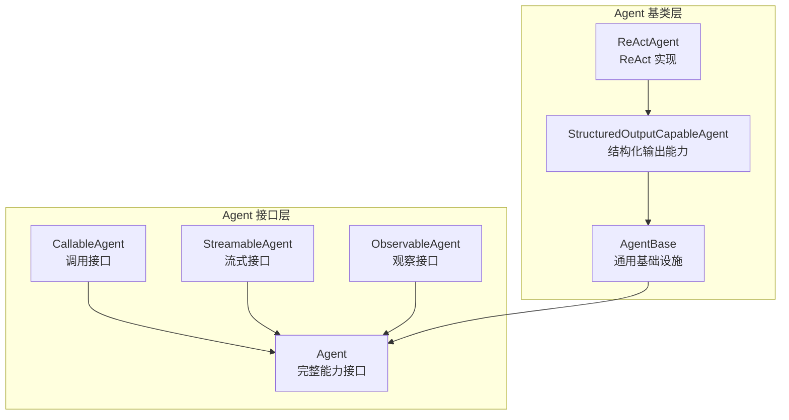
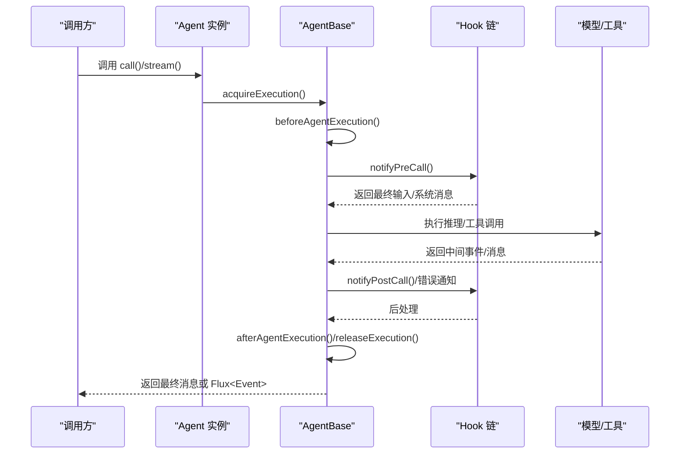
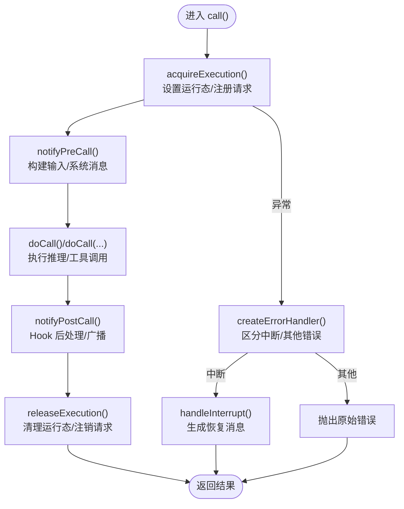
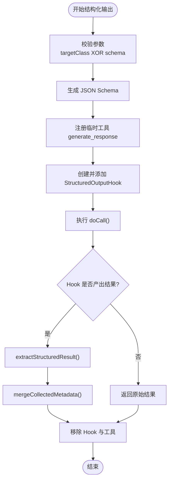
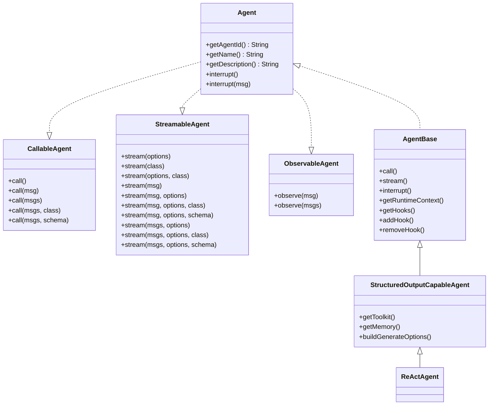

# Agent 接口 API

<cite>
**本文引用的文件**
- [Agent.java](file://agentscope-core/src/main/java/io/agentscope/core/agent/Agent.java)
- [AgentBase.java](file://agentscope-core/src/main/java/io/agentscope/core/agent/AgentBase.java)
- [CallableAgent.java](file://agentscope-core/src/main/java/io/agentscope/core/agent/CallableAgent.java)
- [StreamableAgent.java](file://agentscope-core/src/main/java/io/agentscope/core/agent/StreamableAgent.java)
- [ObservableAgent.java](file://agentscope-core/src/main/java/io/agentscope/core/agent/ObservableAgent.java)
- [StructuredOutputCapableAgent.java](file://agentscope-core/src/main/java/io/agentscope/core/agent/StructuredOutputCapableAgent.java)
- [ReActAgent.java](file://agentscope-core/src/main/java/io/agentscope/core/ReActAgent.java)
- [Event.java](file://agentscope-core/src/main/java/io/agentscope/core/agent/Event.java)
- [EventType.java](file://agentscope-core/src/main/java/io/agentscope/core/agent/EventType.java)
- [RuntimeContext.java](file://agentscope-core/src/main/java/io/agentscope/core/agent/RuntimeContext.java)
</cite>

## 目录
1. [简介](#简介)
2. [项目结构](#项目结构)
3. [核心组件](#核心组件)
4. [架构总览](#架构总览)
5. [详细组件分析](#详细组件分析)
6. [依赖关系分析](#依赖关系分析)
7. [性能考量](#性能考量)
8. [故障排查指南](#故障排查指南)
9. [结论](#结论)
10. [附录](#附录)

## 简介
本文件为 AgentScope 框架中 Agent 接口 API 的权威参考文档。内容覆盖：
- Agent 接口及其组合接口的方法签名、参数与返回值说明
- 智能体生命周期管理：initialize（构造）、destroy（资源释放）、getState（运行态）等
- 配置管理 API：getName、getDescription、getId（Agent 标识）
- 自定义智能体实现示例路径指引
- 智能体状态管理、事件处理与 Hook 系统集成
- 设计原则与扩展模式

## 项目结构
Agent 接口体系由一组职责清晰的接口与抽象基类组成，采用“组合接口 + 抽象基类”的设计，既保证了能力的模块化组合，又统一了执行流程、钩子系统、中断机制与运行时上下文。

图表来源
- [Agent.java:41-82](file://agentscope-core/src/main/java/io/agentscope/core/agent/Agent.java#L41-L82)
- [CallableAgent.java:35-139](file://agentscope-core/src/main/java/io/agentscope/core/agent/CallableAgent.java#L35-L139)
- [StreamableAgent.java:36-152](file://agentscope-core/src/main/java/io/agentscope/core/agent/StreamableAgent.java#L36-L152)
- [ObservableAgent.java:36-53](file://agentscope-core/src/main/java/io/agentscope/core/agent/ObservableAgent.java#L36-L53)
- [AgentBase.java:93-954](file://agentscope-core/src/main/java/io/agentscope/core/agent/AgentBase.java#L93-L954)
- [StructuredOutputCapableAgent.java:65-374](file://agentscope-core/src/main/java/io/agentscope/core/agent/StructuredOutputCapableAgent.java#L65-L374)
- [ReActAgent.java:140-1904](file://agentscope-core/src/main/java/io/agentscope/core/ReActAgent.java#L140-L1904)

章节来源
- [Agent.java:20-82](file://agentscope-core/src/main/java/io/agentscope/core/agent/Agent.java#L20-L82)
- [AgentBase.java:49-92](file://agentscope-core/src/main/java/io/agentscope/core/agent/AgentBase.java#L49-L92)

## 核心组件
- Agent 接口：统一能力契约，包含标识、名称、描述、中断控制，以及对 CallableAgent、StreamableAgent、ObservableAgent 的组合。
- AgentBase 抽象基类：提供统一的执行生命周期、Hook 通知链、中断检查、订阅广播、运行时上下文绑定等基础设施。
- CallableAgent：定义 call(...) 多重重载，支持普通消息处理与结构化输出两种模式。
- StreamableAgent：定义 stream(...) 多重重载，支持实时事件流与结构化输出。
- ObservableAgent：定义 observe(...)，用于被动接收消息而不生成回复。
- StructuredOutputCapableAgent：在 AgentBase 基础上提供结构化输出工具注册、Schema 校验与结果提取。
- ReActAgent：基于 StructuredOutputCapableAgent 的具体实现，结合记忆、工具、计划与 Hook 的完整工作流。

章节来源
- [Agent.java:41-82](file://agentscope-core/src/main/java/io/agentscope/core/agent/Agent.java#L41-L82)
- [AgentBase.java:93-954](file://agentscope-core/src/main/java/io/agentscope/core/agent/AgentBase.java#L93-L954)
- [CallableAgent.java:35-139](file://agentscope-core/src/main/java/io/agentscope/core/agent/CallableAgent.java#L35-L139)
- [StreamableAgent.java:36-152](file://agentscope-core/src/main/java/io/agentscope/core/agent/StreamableAgent.java#L36-L152)
- [ObservableAgent.java:36-53](file://agentscope-core/src/main/java/io/agentscope/core/agent/ObservableAgent.java#L36-L53)
- [StructuredOutputCapableAgent.java:65-374](file://agentscope-core/src/main/java/io/agentscope/core/agent/StructuredOutputCapableAgent.java#L65-L374)
- [ReActAgent.java:140-1904](file://agentscope-core/src/main/java/io/agentscope/core/ReActAgent.java#L140-L1904)

## 架构总览
Agent 调用与流式执行的整体流程如下：

图表来源
- [AgentBase.java:182-201](file://agentscope-core/src/main/java/io/agentscope/core/agent/AgentBase.java#L182-L201)
- [AgentBase.java:661-741](file://agentscope-core/src/main/java/io/agentscope/core/agent/AgentBase.java#L661-L741)
- [AgentBase.java:449-457](file://agentscope-core/src/main/java/io/agentscope/core/agent/AgentBase.java#L449-L457)

## 详细组件分析

### Agent 接口 API 参考
- 方法与职责
  - getAgentId(): 获取智能体唯一标识（字符串）。用于跨系统识别与日志追踪。
  - getName(): 获取智能体名称（字符串）。用于显示与调试。
  - getDescription(): 获取智能体描述（字符串）。默认实现基于 ID 与名称生成；可覆写以提供更丰富的描述。
  - interrupt(): 发起一次协作式中断，内部设置中断标志，需在执行检查点生效。
  - interrupt(Msg): 发起带用户消息的中断，同时记录用户消息以便恢复时使用。

- 参数与返回值
  - getAgentId(): 返回 String；无参数。
  - getName(): 返回 String；无参数。
  - getDescription(): 返回 String；无参数。
  - interrupt(): 无返回；设置中断标志。
  - interrupt(Msg): 无返回；设置中断标志并保存用户消息。

- 生命周期与状态
  - 运行状态：AgentBase 内部维护 running 标志，确保单实例并发安全；每次 call() 开始前尝试 CAS 设置为 true，失败抛出异常提示等待。
  - 中断状态：interruptFlag 与 userInterruptMessage 用于协作式中断；可通过 checkInterruptedAsync() 在关键检查点检测并抛出 InterruptedException。
  - Hook 系统：通过 getSortedHooks() 获取按优先级排序的 Hook 列表；支持动态 addHook/removeHook。

- 配置管理 API
  - getId(): 通过 getAgentId() 获取；构造时由 UUID 生成，保证全局唯一。
  - getName(): 通过 getName() 获取；构造时注入。
  - getDescription(): 通过 getDescription() 获取；默认实现可被覆写。

- 事件与流式输出
  - 事件类型：EventType 定义 REASONING、TOOL_RESULT、HINT、AGENT_RESULT、SUMMARY、ALL 等。
  - 事件载体：Event 封装类型、消息体、是否最后一条、来源等字段。
  - 流式接口：StreamableAgent 提供多种 stream(...) 重载，返回 Flux<Event>，支持结构化输出与选项配置。

- Hook 系统集成
  - 预调用/后调用/错误事件：PreCallEvent、PostCallEvent、ErrorEvent 通过 Hook 链顺序处理。
  - 运行时上下文：RuntimeContext 提供会话、用户、属性存储与工具上下文合并视图。
  - 订阅广播：MsgHub 订阅者列表管理，call 结束后自动广播最终消息。

章节来源
- [Agent.java:43-82](file://agentscope-core/src/main/java/io/agentscope/core/agent/Agent.java#L43-L82)
- [AgentBase.java:158-201](file://agentscope-core/src/main/java/io/agentscope/core/agent/AgentBase.java#L158-L201)
- [AgentBase.java:312-389](file://agentscope-core/src/main/java/io/agentscope/core/agent/AgentBase.java#L312-L389)
- [AgentBase.java:661-752](file://agentscope-core/src/main/java/io/agentscope/core/agent/AgentBase.java#L661-L752)
- [Event.java:51-211](file://agentscope-core/src/main/java/io/agentscope/core/agent/Event.java#L51-L211)
- [EventType.java:24-94](file://agentscope-core/src/main/java/io/agentscope/core/agent/EventType.java#L24-L94)
- [RuntimeContext.java:34-361](file://agentscope-core/src/main/java/io/agentscope/core/agent/RuntimeContext.java#L34-L361)

### AgentBase 抽象基类
- 统一执行入口
  - call(List<Msg>): 使用 Mono.using(acquire/release) 确保资源回收；在 Tracer 包裹下触发 Hook 链与 doCall 实现。
  - call(..., Class/JsonNode): 支持结构化输出模式，内部委托到 doCall(..., Class/JsonNode) 并进行结果提取与元数据合并。
- Hook 通知
  - notifyPreCall(): 生成内存快照与完整输入，构建 PreCallEvent，依次经 Hook 处理，返回仅追加的消息尾部用于持久化。
  - notifyPostCall(): 生成 PostCallEvent，依次经 Hook 处理，完成后广播给订阅者。
  - notifyError(): 错误事件 ErrorEvent 逐个通知 Hook。
- 中断机制
  - interrupt()/interrupt(Msg)/interrupt(InterruptSource): 设置中断标志与来源；checkInterruptedAsync(): 在 Mono 链中检查并抛出 InterruptedException。
  - handleInterrupt(InterruptContext, Msg...): 子类必须实现的恢复逻辑，返回中断后的恢复消息。
- 运行时上下文
  - bindRuntimeContextToHooks()/unbindRuntimeContextFromHooks(): 将当前 RuntimeContext 绑定到实现了 RuntimeContextAware 的 Hook。
  - getRuntimeContext(): 获取当前调用的 RuntimeContext。
- 订阅与广播
  - resetSubscribers()/removeSubscribers()/hasSubscribers()/getSubscriberCount(): 管理 MsgHub 订阅者拓扑。
  - broadcastToSubscribers(): 在 call 结束后自动广播最终消息。

图表来源
- [AgentBase.java:182-201](file://agentscope-core/src/main/java/io/agentscope/core/agent/AgentBase.java#L182-L201)
- [AgentBase.java:449-457](file://agentscope-core/src/main/java/io/agentscope/core/agent/AgentBase.java#L449-L457)
- [AgentBase.java:514-514](file://agentscope-core/src/main/java/io/agentscope/core/agent/AgentBase.java#L514-L514)

章节来源
- [AgentBase.java:93-954](file://agentscope-core/src/main/java/io/agentscope/core/agent/AgentBase.java#L93-L954)

### CallableAgent 接口
- 方法族
  - call(): 无参继续生成
  - call(Msg/Msg...): 单条或多条消息处理
  - call(List<Msg>): 标准多消息处理
  - call(List<Msg>, Class<?>): 结构化输出（类定义）
  - call(List<Msg>, JsonNode): 结构化输出（JSON Schema）
- 默认实现
  - 多数重载默认委托到核心 call(List<Msg>)，便于统一实现。

章节来源
- [CallableAgent.java:35-139](file://agentscope-core/src/main/java/io/agentscope/core/agent/CallableAgent.java#L35-L139)

### StreamableAgent 接口
- 方法族
  - stream(StreamOptions): 当前状态流式输出
  - stream(Class/JsonNode): 结构化输出流式
  - stream(Msg/Msg..., StreamOptions/Class/JsonNode): 基于输入的流式输出
  - stream(List<Msg>, StreamOptions): 标准流式输出
  - stream(List<Msg>, StreamOptions, Class/JsonNode): 结构化输出流式
- 返回值
  - Flux<Event>: 实时事件流，事件类型由 EventType 定义。

章节来源
- [StreamableAgent.java:36-152](file://agentscope-core/src/main/java/io/agentscope/core/agent/StreamableAgent.java#L36-L152)
- [EventType.java:24-94](file://agentscope-core/src/main/java/io/agentscope/core/agent/EventType.java#L24-L94)

### ObservableAgent 接口
- 方法
  - observe(Msg): 观察单条消息
  - observe(List<Msg>): 观察多条消息
- 语义
  - 不生成回复，常用于多智能体协作中的旁观与共享上下文。

章节来源
- [ObservableAgent.java:36-53](file://agentscope-core/src/main/java/io/agentscope/core/agent/ObservableAgent.java#L36-L53)

### StructuredOutputCapableAgent 抽象类
- 能力
  - 自动注册临时工具 generate_response，基于目标类或 JSON Schema 生成结构化输出。
  - 使用 StructuredOutputHook 控制流程，收集聚合用量与思考块，合并到最终消息。
- 关键流程
  - executeWithStructuredOutput(): 校验参数、生成 Schema、注册工具、添加 Hook、执行 doCall、提取结果、清理 Hook 与工具。
  - extractStructuredResult()/mergeCollectedMetadata(): 从 Hook 输出中抽取结构化数据并合并元信息。

图表来源
- [StructuredOutputCapableAgent.java:139-197](file://agentscope-core/src/main/java/io/agentscope/core/agent/StructuredOutputCapableAgent.java#L139-L197)
- [StructuredOutputCapableAgent.java:285-355](file://agentscope-core/src/main/java/io/agentscope/core/agent/StructuredOutputCapableAgent.java#L285-L355)

章节来源
- [StructuredOutputCapableAgent.java:65-374](file://agentscope-core/src/main/java/io/agentscope/core/agent/StructuredOutputCapableAgent.java#L65-L374)

### ReActAgent 实现
- 特性
  - 继承 StructuredOutputCapableAgent，具备结构化输出能力。
  - 内置 Memory、Model、Toolkit、PlanNotebook、StatePersistence 等核心依赖。
  - 通过 RuntimeContext 传递会话与工具上下文，支持工具注入与类型化属性访问。
- 典型用法
  - 构建模型与工具包，配置系统提示词与最大迭代次数，然后调用 call()/stream() 完成任务。
- 事件与 Hook
  - 集成 PreReasoningEvent、PostReasoningEvent、PreActingEvent、PostActingEvent、SummaryChunkEvent 等，支持人类在环（HITL）与优雅停机策略。

章节来源
- [ReActAgent.java:140-1904](file://agentscope-core/src/main/java/io/agentscope/core/ReActAgent.java#L140-L1904)
- [RuntimeContext.java:34-361](file://agentscope-core/src/main/java/io/agentscope/core/agent/RuntimeContext.java#L34-L361)

### 事件与 Hook 系统
- 事件类型
  - REASONING：推理与规划阶段，可能分片流式输出。
  - TOOL_RESULT：工具执行结果，携带工具输出。
  - HINT：来自检索/记忆/规划系统的提示信息。
  - AGENT_RESULT：最终结果（默认不包含在流中，避免重复）。
  - SUMMARY：达到最大迭代次数时的摘要。
  - ALL：流式过滤器，表示输出所有事件类型（除 AGENT_RESULT）。
- Hook 通知
  - PreCall/PostCall/Error：在调用前后与错误时触发，允许修改输入、输出或记录错误。
  - 事件源：Event.withSource() 支持子智能体事件标注来源，便于 UI 或日志路由。

章节来源
- [EventType.java:24-94](file://agentscope-core/src/main/java/io/agentscope/core/agent/EventType.java#L24-L94)
- [Event.java:51-211](file://agentscope-core/src/main/java/io/agentscope/core/agent/Event.java#L51-L211)
- [AgentBase.java:661-752](file://agentscope-core/src/main/java/io/agentscope/core/agent/AgentBase.java#L661-L752)

### 生命周期管理与状态
- 初始化
  - 通过构造函数注入名称、描述、Hook 列表、运行态检查开关等；UUID 生成唯一 ID。
- 运行中
  - acquireExecution() 设置运行态并注册请求；beforeAgentExecution()/afterAgentExecution() 钩子在调用前后执行。
  - checkInterruptedAsync() 在关键检查点生效，handleInterrupt() 由子类实现恢复逻辑。
- 销毁与资源释放
  - releaseExecution() 清理运行态并注销请求；removeHook()/removeSubscribers() 用于释放 Hook 与订阅资源。
- 状态查询
  - 运行态：AgentBase 内部 running AtomicBoolean；外部可通过异常判断是否仍在运行。
  - 订阅者：hasSubscribers()/getSubscriberCount() 查询订阅拓扑。

章节来源
- [AgentBase.java:411-439](file://agentscope-core/src/main/java/io/agentscope/core/agent/AgentBase.java#L411-L439)
- [AgentBase.java:529-535](file://agentscope-core/src/main/java/io/agentscope/core/agent/AgentBase.java#L529-L535)
- [AgentBase.java:761-796](file://agentscope-core/src/main/java/io/agentscope/core/agent/AgentBase.java#L761-L796)

### 配置管理 API
- getId(): 通过 getAgentId() 获取唯一标识。
- getName(): 通过 getName() 获取名称。
- getDescription(): 通过 getDescription() 获取描述；默认实现可覆写。

章节来源
- [Agent.java:48-64](file://agentscope-core/src/main/java/io/agentscope/core/agent/Agent.java#L48-L64)
- [AgentBase.java:158-171](file://agentscope-core/src/main/java/io/agentscope/core/agent/AgentBase.java#L158-L171)

### 自定义智能体实现示例（路径指引）
以下示例展示了如何基于框架能力构建自定义智能体：
- 快速开始示例（含 Hook、中断、结构化输出、流式 Web 等）
  - [Hook 示例](file://agentscope-examples/quickstart/src/main/java/io/agentscope/examples/quickstart/HookExample.java)
  - [中断示例](file://agentscope-examples/quickstart/src/main/java/io/agentscope/examples/quickstart/InterruptionExample.java)
  - [结构化输出示例](file://agentscope-examples/quickstart/src/main/java/io/agentscope/examples/quickstart/StructuredOutputExample.java)
  - [流式 Web 示例](file://agentscope-examples/quickstart/src/main/java/io/agentscope/examples/quickstart/StreamingWebExample.java)
- 多智能体示例（A2A）
  - [简单 A2A 示例](file://agentscope-examples/a2a/src/main/java/io/agentscope/examples/a2a/SimpleA2aAgentExample.java)
  - [Nacos A2A 示例](file://agentscope-examples/a2a/src/main/java/io/agentscope/examples/a2a/NacosA2aAgentExample.java)
- Boba Tea Shop（多子智能体）
  - [Supervisor Agent 示例](file://agentscope-examples/boba-tea-shop/supervisor-agent/src/main/java/io/agentscope/examples/bobatea/supervisor/agent/SupervisorAgent.java)

章节来源
- [HookExample.java](file://agentscope-examples/quickstart/src/main/java/io/agentscope/examples/quickstart/HookExample.java)
- [InterruptionExample.java](file://agentscope-examples/quickstart/src/main/java/io/agentscope/examples/quickstart/InterruptionExample.java)
- [StructuredOutputExample.java](file://agentscope-examples/quickstart/src/main/java/io/agentscope/examples/quickstart/StructuredOutputExample.java)
- [StreamingWebExample.java](file://agentscope-examples/quickstart/src/main/java/io/agentscope/examples/quickstart/StreamingWebExample.java)
- [SimpleA2aAgentExample.java](file://agentscope-examples/a2a/src/main/java/io/agentscope/examples/a2a/SimpleA2aAgentExample.java)
- [NacosA2aAgentExample.java](file://agentscope-examples/a2a/src/main/java/io/agentscope/examples/a2a/NacosA2aAgentExample.java)
- [SupervisorAgent.java](file://agentscope-examples/boba-tea-shop/supervisor-agent/src/main/java/io/agentscope/examples/bobatea/supervisor/agent/SupervisorAgent.java)

## 依赖关系分析

图表来源
- [Agent.java:41-82](file://agentscope-core/src/main/java/io/agentscope/core/agent/Agent.java#L41-L82)
- [CallableAgent.java:35-139](file://agentscope-core/src/main/java/io/agentscope/core/agent/CallableAgent.java#L35-L139)
- [StreamableAgent.java:36-152](file://agentscope-core/src/main/java/io/agentscope/core/agent/StreamableAgent.java#L36-L152)
- [ObservableAgent.java:36-53](file://agentscope-core/src/main/java/io/agentscope/core/agent/ObservableAgent.java#L36-L53)
- [AgentBase.java:93-954](file://agentscope-core/src/main/java/io/agentscope/core/agent/AgentBase.java#L93-L954)
- [StructuredOutputCapableAgent.java:65-374](file://agentscope-core/src/main/java/io/agentscope/core/agent/StructuredOutputCapableAgent.java#L65-L374)
- [ReActAgent.java:140-1904](file://agentscope-core/src/main/java/io/agentscope/core/ReActAgent.java#L140-L1904)

## 性能考量
- 单实例并发限制：AgentBase 明确指出单实例不应并发调用 call()/stream()，以避免 Hook 列表的非线程安全修改。
- 中断检查点：复杂智能体应在推理、工具执行、流式分片等关键节点调用 checkInterruptedAsync()，以降低延迟与资源占用。
- Hook 排序与数量：Hook 按优先级排序，过多或重型 Hook 会增加调用开销，建议按需启用与及时移除。
- 流式事件粒度：合理设置 StreamOptions，避免过度细粒度导致 UI 更新压力与网络传输成本。

## 故障排查指南
- “Agent is still running” 异常
  - 现象：并发调用同一 Agent 实例导致。
  - 处理：确保单实例串行调用；如需并行，请使用多个实例。
  - 参考：[AgentBase.java:412-414](file://agentscope-core/src/main/java/io/agentscope/core/agent/AgentBase.java#L412-L414)
- 中断未生效
  - 现象：调用 interrupt() 后执行仍继续。
  - 处理：确认在合适检查点调用 checkInterruptedAsync()；复杂流程应在每个迭代/阶段均检查。
  - 参考：[AgentBase.java:372-379](file://agentscope-core/src/main/java/io/agentscope/core/agent/AgentBase.java#L372-L379)
- Hook 注入 SYSTEM 消息导致内存异常
  - 现象：在 PreCallEvent 中直接注入 SYSTEM 消息导致重复累积。
  - 处理：改用 setSystemMessage()/appendSystemContent()，避免向尾部注入 SYSTEM。
  - 参考：[AgentBase.java:706-716](file://agentscope-core/src/main/java/io/agentscope/core/agent/AgentBase.java#L706-L716)
- 结构化输出未返回预期结果
  - 现象：调用 call(..., Class/JsonNode) 后缺少结构化元数据。
  - 处理：确认已正确注册 StructuredOutputHook；检查 generate_response 工具是否被移除；核对 Schema 生成与验证。
  - 参考：[StructuredOutputCapableAgent.java:139-197](file://agentscope-core/src/main/java/io/agentscope/core/agent/StructuredOutputCapableAgent.java#L139-L197)

章节来源
- [AgentBase.java:411-419](file://agentscope-core/src/main/java/io/agentscope/core/agent/AgentBase.java#L411-L419)
- [AgentBase.java:706-716](file://agentscope-core/src/main/java/io/agentscope/core/agent/AgentBase.java#L706-L716)
- [StructuredOutputCapableAgent.java:139-197](file://agentscope-core/src/main/java/io/agentscope/core/agent/StructuredOutputCapableAgent.java#L139-L197)

## 结论
Agent 接口 API 通过“接口组合 + 抽象基类 + Hook + 事件流”的设计，提供了高内聚、低耦合且可扩展的智能体框架。开发者可基于 AgentBase/StructuredOutputCapableAgent/ReActAgent 快速实现定制智能体，结合 Hook 与事件系统完成可观测、可中断、可流式的复杂应用。

## 附录
- 设计原则
  - 分离关注点：AgentBase 负责基础设施，具体智能体负责领域逻辑。
  - 协作式中断：通过标志位与检查点实现非阻塞中断。
  - Hook 优先级：按数值升序执行，数值越小优先级越高。
  - 事件不可变：Event 对象不可变，支持 withSource() 生成带来源的新事件。
- 扩展模式
  - 新增 Hook：实现 Hook 接口并设置优先级，动态添加至 Agent。
  - 自定义智能体：继承 AgentBase 或 StructuredOutputCapableAgent，实现 doCall/doCall(..., Class/JsonNode) 与 handleInterrupt。
  - 事件过滤：通过 StreamOptions.ALL 与事件类型筛选，构建 UI 或日志路由。