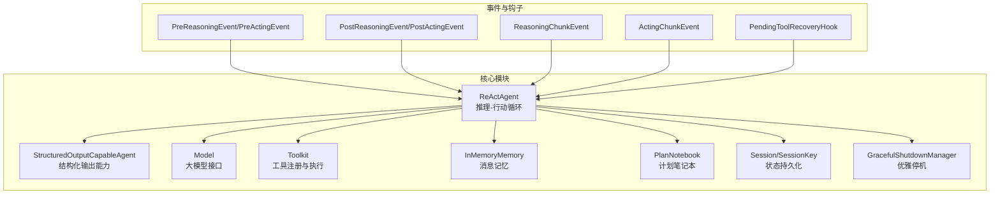
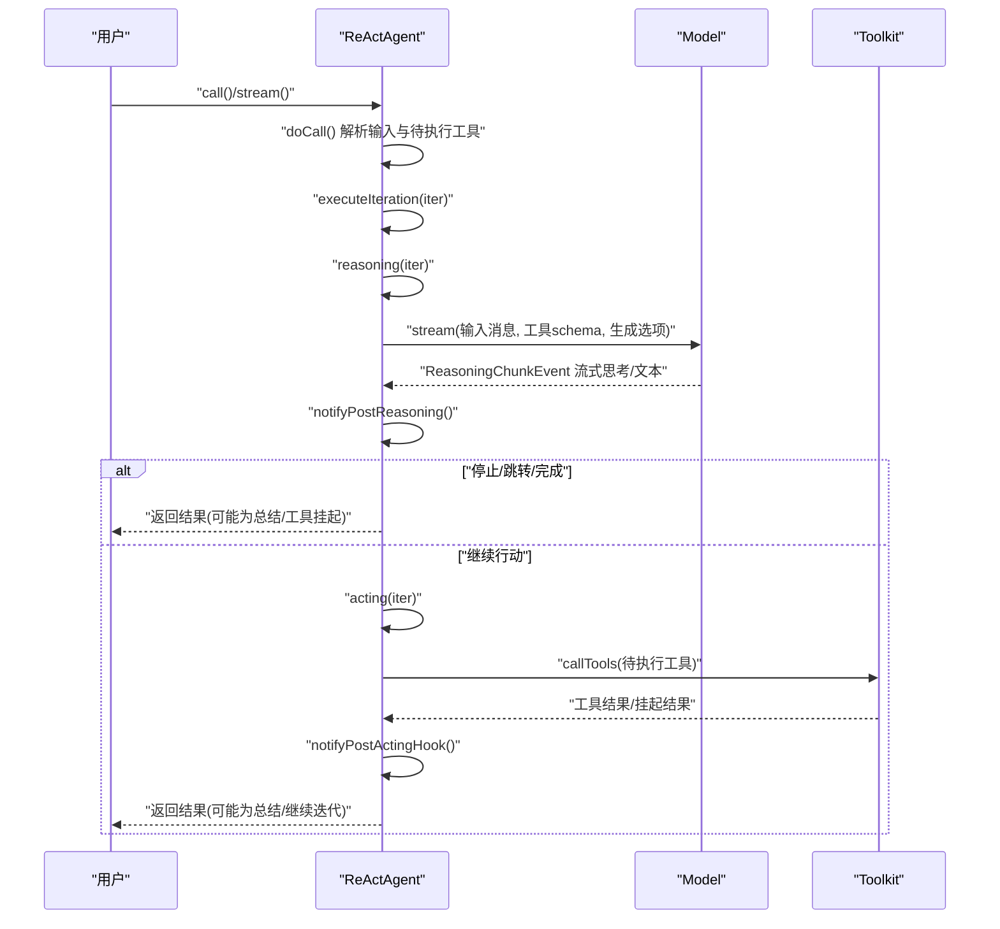
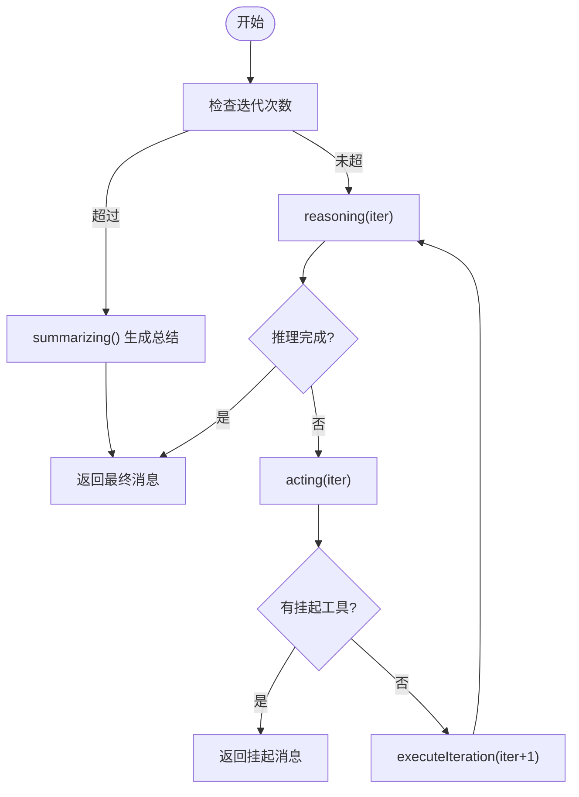
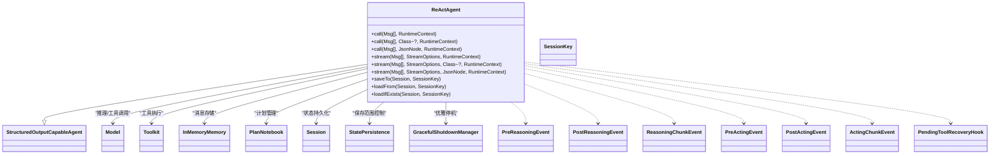

# ReAct 智能体 API

<cite>
**本文引用的文件**
- [ReActAgent.java](file://agentscope-core/src/main/java/io/agentscope/core/ReActAgent.java)
- [StructuredOutputCapableAgent.java](file://agentscope-core/src/main/java/io/agentscope/core/agent/StructuredOutputCapableAgent.java)
- [ReasoningChunkEvent.java](file://agentscope-core/src/main/java/io/agentscope/core/hook/ReasoningChunkEvent.java)
- [ActingChunkEvent.java](file://agentscope-core/src/main/java/io/agentscope/core/hook/ActingChunkEvent.java)
- [PostReasoningEvent.java](file://agentscope-core/src/main/java/io/agentscope/core/hook/PostReasoningEvent.java)
- [PostActingEvent.java](file://agentscope-core/src/main/java/io/agentscope/core/hook/PostActingEvent.java)
- [PreReasoningEvent.java](file://agentscope-core/src/main/java/io/agentscope/core/hook/PreReasoningEvent.java)
- [PreActingEvent.java](file://agentscope-core/src/main/java/io/agentscope/core/hook/PreActingEvent.java)
- [HookEvent.java](file://agentscope-core/src/main/java/io/agentscope/core/hook/HookEvent.java)
- [PendingToolRecoveryHook.java](file://agentscope-core/src/main/java/io/agentscope/core/hook/PendingToolRecoveryHook.java)
- [Msg.java](file://agentscope-core/src/main/java/io/agentscope/core/message/Msg.java)
- [MsgRole.java](file://agentscope-core/src/main/java/io/agentscope/core/message/MsgRole.java)
- [TextBlock.java](file://agentscope-core/src/main/java/io/agentscope/core/message/TextBlock.java)
- [ThinkingBlock.java](file://agentscope-core/src/main/java/io/agentscope/core/message/ThinkingBlock.java)
- [ToolUseBlock.java](file://agentscope-core/src/main/java/io/agentscope/core/message/ToolUseBlock.java)
- [ToolResultBlock.java](file://agentscope-core/src/main/java/io/agentscope/core/message/ToolResultBlock.java)
- [Toolkit.java](file://agentscope-core/src/main/java/io/agentscope/core/tool/Toolkit.java)
- [ToolExecutionContext.java](file://agentscope-core/src/main/java/io/agentscope/core/tool/ToolExecutionContext.java)
- [ToolResultMessageBuilder.java](file://agentscope-core/src/main/java/io/agentscope/core/tool/ToolResultMessageBuilder.java)
- [Model.java](file://agentscope-core/src/main/java/io/agentscope/core/model/Model.java)
- [GenerateOptions.java](file://agentscope-core/src/main/java/io/agentscope/core/model/GenerateOptions.java)
- [ExecutionConfig.java](file://agentscope-core/src/main/java/io/agentscope/core/model/ExecutionConfig.java)
- [InMemoryMemory.java](file://agentscope-core/src/main/java/io/agentscope/core/memory/InMemoryMemory.java)
- [PlanNotebook.java](file://agentscope-core/src/main/java/io/agentscope/core/plan/PlanNotebook.java)
- [Session.java](file://agentscope-core/src/main/java/io/agentscope/core/session/Session.java)
- [SessionKey.java](file://agentscope-core/src/main/java/io/agentscope/core/state/SessionKey.java)
- [StatePersistence.java](file://agentscope-core/src/main/java/io/agentscope/core/state/StatePersistence.java)
- [AgentShuttingDownException.java](file://agentscope-core/src/main/java/io/agentscope/core/shutdown/AgentShuttingDownException.java)
- [GracefulShutdownManager.java](file://agentscope-core/src/main/java/io/agentscope/core/shutdown/GracefulShutdownManager.java)
- [PartialReasoningPolicy.java](file://agentscope-core/src/main/java/io/agentscope/core/shutdown/PartialReasoningPolicy.java)
- [InterruptContext.java](file://agentscope-core/src/main/java/io/agentscope/core/interruption/InterruptContext.java)
- [InterruptSource.java](file://agentscope-core/src/main/java/io/agentscope/core/interruption/InterruptSource.java)
- [StreamOptions.java](file://agentscope-core/src/main/java/io/agentscope/core/agent/StreamOptions.java)
- [Event.java](file://agentscope-core/src/main/java/io/agentscope/core/agent/Event.java)
- [StructuredOutputReminder.java](file://agentscope-core/src/main/java/io/agentscope/core/model/StructuredOutputReminder.java)
- [ReasoningContext.java](file://agentscope-core/src/main/java/io/agentscope/core/agent/accumulator/ReasoningContext.java)
- [ReActAgentTest.java](file://agentscope-core/src/test/java/io/agentscope/core/agent/ReActAgentTest.java)
- [ReActAgentSummarizingTest.java](file://agentscope-core/src/test/java/io/agentscope/core/agent/ReActAgentSummarizingTest.java)
- [StructuredOutputExample.java](file://agentscope-examples/quickstart/src/main/java/io/agentscope/examples/quickstart/StructuredOutputExample.java)
- [GracefulShutdownExample.java](file://agentscope-examples/graceful-shutdown/src/main/java/io/agentscope/examples/shutdown/smoke/GracefulShutdownExample.java)
</cite>

## 目录
1. [简介](#简介)
2. [项目结构](#项目结构)
3. [核心组件](#核心组件)
4. [架构总览](#架构总览)
5. [详细组件分析](#详细组件分析)
6. [依赖关系分析](#依赖关系分析)
7. [性能考量](#性能考量)
8. [故障排查指南](#故障排查指南)
9. [结论](#结论)
10. [附录](#附录)

## 简介
本参考文档面向 ReAct 智能体 API，系统性阐述 ReActAgent 类的公共接口、构造与配置、推理-行动循环机制、流式与结构化输出能力、生命周期与中断恢复策略，并提供可直接定位到源码位置的示例路径，帮助开发者快速理解与正确使用该智能体。

## 项目结构
ReActAgent 位于 agentscope-core 模块中，围绕 Agent 基类扩展了结构化输出能力与 Hook 体系，结合模型、工具箱、内存与会话等模块协作完成多轮对话与工具调用。

图示来源
- [ReActAgent.java:140-1903](file://agentscope-core/src/main/java/io/agentscope/core/ReActAgent.java#L140-L1903)
- [StructuredOutputCapableAgent.java:65-373](file://agentscope-core/src/main/java/io/agentscope/core/agent/StructuredOutputCapableAgent.java#L65-L373)

章节来源
- [ReActAgent.java:140-1903](file://agentscope-core/src/main/java/io/agentscope/core/ReActAgent.java#L140-L1903)

## 核心组件
- ReActAgent：继承自 StructuredOutputCapableAgent，实现 ReAct 推理-行动循环，支持流式与结构化输出、Hook 扩展、中断与优雅停机、状态持久化。
- Model：统一的大模型接口，负责文本/多模态生成与流式输出。
- Toolkit：工具注册与执行容器，支持工具 schema、参数校验、结果转换与挂起工具处理。
- Memory：消息存储与检索，支持 InMemoryMemory 等实现。
- PlanNotebook：计划与任务管理，可与 ReAct 循环协同。
- Session/StatePersistence：会话级状态保存与加载，支持细粒度控制。
- Hook 体系：Pre/Post Reasoning/Acting/Summary 以及 Chunk 事件，支持人类在环（HITL）、自动恢复与上下文注入。
- 结构化输出：通过 StructuredOutputCapableAgent 提供类型安全的结构化数据提取与回退策略。

章节来源
- [ReActAgent.java:140-1903](file://agentscope-core/src/main/java/io/agentscope/core/ReActAgent.java#L140-L1903)
- [StructuredOutputCapableAgent.java:65-373](file://agentscope-core/src/main/java/io/agentscope/core/agent/StructuredOutputCapableAgent.java#L65-L373)

## 架构总览
ReActAgent 的核心是“推理-行动”迭代循环。每次迭代由 reasoning() 开始，通过模型生成思考与工具调用；随后 acting() 执行工具并处理结果；根据条件决定是否继续迭代或进入总结阶段。

图示来源
- [ReActAgent.java:546-731](file://agentscope-core/src/main/java/io/agentscope/core/ReActAgent.java#L546-L731)
- [ReasoningChunkEvent.java](file://agentscope-core/src/main/java/io/agentscope/core/hook/ReasoningChunkEvent.java)
- [ActingChunkEvent.java](file://agentscope-core/src/main/java/io/agentscope/core/hook/ActingChunkEvent.java)
- [PostReasoningEvent.java](file://agentscope-core/src/main/java/io/agentscope/core/hook/PostReasoningEvent.java)
- [PostActingEvent.java](file://agentscope-core/src/main/java/io/agentscope/core/hook/PostActingEvent.java)

## 详细组件分析

### ReActAgent 公共 API 与配置
- 构造与构建器
  - 通过 ReActAgent.builder() 配置名称、描述、系统提示、模型、工具箱、内存、最大迭代次数、执行配置、生成选项、计划笔记本、工具执行上下文、状态持久化等。
  - 支持 RuntimeContext 注入，用于单次调用的元数据传递。
- 同步调用 API
  - call(List<Msg>)：返回 Mono<Msg> 的阻塞式调用。
  - call(List<Msg>, Class<?>)：请求结构化输出（类型）。
  - call(List<Msg>, JsonNode)：请求结构化输出（JSON Schema）。
  - call(List<Msg>, RuntimeContext)：带运行时上下文的调用重载。
- 流式处理 API
  - stream(List<Msg>, StreamOptions)：返回 Flux<Event> 的事件流。
  - stream(List<Msg>, StreamOptions, Class<?>)：流式结构化输出（类型）。
  - stream(List<Msg>, StreamOptions, JsonNode)：流式结构化输出（Schema）。
  - stream(List<Msg>, StreamOptions, RuntimeContext)：带运行时上下文的流式调用重载。
- 生命周期与状态管理
  - saveTo(Session, SessionKey)/loadFrom(Session, SessionKey)：保存/加载 agent 元数据、内存、工具组、计划笔记本。
  - loadIfExists(...)：存在则加载并绑定会话。
- 中断与优雅停机
  - 继承自 AgentBase 的中断能力（interrupt() 等），结合 GracefulShutdownManager 实现系统级中断与部分推理保留策略。
- 结构化输出
  - 通过 StructuredOutputCapableAgent 提供的结构化输出能力，支持类型化与 JSON Schema 两种模式，并具备自动回退策略。

章节来源
- [ReActAgent.java:172-194](file://agentscope-core/src/main/java/io/agentscope/core/ReActAgent.java#L172-L194)
- [ReActAgent.java:246-279](file://agentscope-core/src/main/java/io/agentscope/core/ReActAgent.java#L246-L279)
- [ReActAgent.java:300-359](file://agentscope-core/src/main/java/io/agentscope/core/ReActAgent.java#L300-L359)
- [StructuredOutputCapableAgent.java:65-373](file://agentscope-core/src/main/java/io/agentscope/core/agent/StructuredOutputCapableAgent.java#L65-L373)

### 推理-行动循环机制
- executeIteration(iter)
  - 直接进入 reasoning(iter, false)，开始一次推理迭代。
- reasoning(iter, ignoreMaxIters)
  - 构建 ReasoningContext，预处理系统消息与输入消息，调用模型 stream() 获取增量响应。
  - 逐块处理并触发 ReasoningChunkEvent，同时检查中断与 Hook 事件。
  - 根据 PostReasoningEvent 决定是否停止、跳转到下一轮推理或结束。
  - 超过 maxIters 或满足完成条件时进入 summarizing()。
- acting(iter)
  - 提取“待执行工具”（未在记忆中出现对应 ToolResultBlock 的 ToolUseBlock）。
  - 设置内部工具块回调以转发 ActingChunkEvent。
  - 执行工具调用，区分成功结果与挂起结果：
    - 成功：通知 PostActingHook 并决定是否继续迭代或返回。
    - 挂起：返回包含 GenerateReason.TOOL_SUSPENDED 的消息，等待用户后续提供 ToolResultBlock。
  - 若无待执行工具：继续 executeIteration(iter+1)。
- 总结阶段
  - 当达到最大迭代次数或显式触发时，进入 summarizing() 生成总结消息并返回。

图示来源
- [ReActAgent.java:546-731](file://agentscope-core/src/main/java/io/agentscope/core/ReActAgent.java#L546-L731)

章节来源
- [ReActAgent.java:546-731](file://agentscope-core/src/main/java/io/agentscope/core/ReActAgent.java#L546-L731)

### 流式处理 API（stream）
- 事件类型
  - ReasoningChunkEvent：模型推理过程中的增量思考/文本块。
  - ActingChunkEvent：工具执行过程中的增量结果块。
  - PostReasoningEvent/PostActingEvent：推理/行动阶段结束后的汇总事件，支持停止请求、跳转到推理或结构化输出。
- 使用方式
  - 传入 StreamOptions 控制流式行为（如是否启用思考块、是否合并等）。
  - 可选地指定结构化输出类型或 Schema，使事件流携带结构化数据。
- 与 Hook 的交互
  - Pre/Post Reasoning/Acting/Summary 事件贯穿整个流程，允许 Hook 修改输入、注入系统消息、暂停执行、触发跳转或结构化输出。

章节来源
- [ReActAgent.java:261-279](file://agentscope-core/src/main/java/io/agentscope/core/ReActAgent.java#L261-L279)
- [ReasoningChunkEvent.java](file://agentscope-core/src/main/java/io/agentscope/core/hook/ReasoningChunkEvent.java)
- [ActingChunkEvent.java](file://agentscope-core/src/main/java/io/agentscope/core/hook/ActingChunkEvent.java)
- [HookEvent.java:133-138](file://agentscope-core/src/main/java/io/agentscope/core/hook/HookEvent.java#L133-L138)

### 结构化输出 API
- call(..., Class<?>) 与 call(..., JsonNode)：请求结构化输出。
- 事件驱动：在推理/行动过程中，可通过 PostReasoningEvent/StructuredOutputHook 触发 gotoReasoning 或直接生成结构化数据。
- 自动回退：当模型不直接支持结构化输出时，ReActAgent 会通过工具链路回退到工具生成再总结的方式。

章节来源
- [ReActAgent.java:251-259](file://agentscope-core/src/main/java/io/agentscope/core/ReActAgent.java#L251-L259)
- [StructuredOutputCapableAgent.java:65-373](file://agentscope-core/src/main/java/io/agentscope/core/agent/StructuredOutputCapableAgent.java#L65-L373)

### 生命周期管理、中断与错误恢复
- 生命周期
  - beforeAgentExecution()/afterAgentExecution()：绑定/解绑 RuntimeContext 到 Hook。
  - saveTo()/loadFrom()/loadIfExists()：基于 StatePersistence 控制保存范围（元数据、内存、工具组、计划笔记本）。
- 中断
  - 支持 interrupt() 与中断消息；在推理/行动阶段检测中断并按策略处理。
  - 系统中断（GracefulShutdownManager）可选择丢弃或保留部分推理内容。
- 错误恢复
  - PendingToolRecoveryHook：在存在待执行工具但无结果时尝试自动修复。
  - 工具失败：捕获异常并生成错误 ToolResultBlock，保证循环继续。
  - 输入校验：对用户提供 ToolResultBlock 进行 ID 匹配、重复校验与完整性检查。

章节来源
- [ReActAgent.java:198-230](file://agentscope-core/src/main/java/io/agentscope/core/ReActAgent.java#L198-L230)
- [ReActAgent.java:300-359](file://agentscope-core/src/main/java/io/agentscope/core/ReActAgent.java#L300-L359)
- [GracefulShutdownManager.java](file://agentscope-core/src/main/java/io/agentscope/core/shutdown/GracefulShutdownManager.java)
- [AgentShuttingDownException.java](file://agentscope-core/src/main/java/io/agentscope/core/shutdown/AgentShuttingDownException.java)
- [PartialReasoningPolicy.java](file://agentscope-core/src/main/java/io/agentscope/core/shutdown/PartialReasoningPolicy.java)
- [PendingToolRecoveryHook.java:171-203](file://agentscope-core/src/main/java/io/agentscope/core/hook/PendingToolRecoveryHook.java#L171-L203)
- [ReActAgent.java:478-531](file://agentscope-core/src/main/java/io/agentscope/core/ReActAgent.java#L478-L531)

### 最佳实践与性能优化
- 合理设置 maxIters：避免无限循环，确保在合理次数内进入总结阶段。
- 使用 StreamOptions：按需开启思考块、合并策略，减少不必要的事件开销。
- 工具执行超时：通过 toolExecutionConfig 设置超时，避免长时间阻塞。
- 结构化输出策略：优先使用类型化输出，必要时回退到工具链路。
- Hook 优先级与数量：避免过多 Hook 导致事件处理延迟，必要时分批或异步处理。
- 内存与会话：合理使用 StatePersistence，仅保存必要的组件，降低序列化/反序列化成本。

## 依赖关系分析
ReActAgent 依赖于多个核心模块，形成清晰的分层与职责分离：

图示来源
- [ReActAgent.java:140-1903](file://agentscope-core/src/main/java/io/agentscope/core/ReActAgent.java#L140-L1903)
- [StructuredOutputCapableAgent.java:65-373](file://agentscope-core/src/main/java/io/agentscope/core/agent/StructuredOutputCapableAgent.java#L65-L373)

章节来源
- [ReActAgent.java:140-1903](file://agentscope-core/src/main/java/io/agentscope/core/ReActAgent.java#L140-L1903)

## 性能考量
- 流式处理：使用 Project Reactor 的 Flux/ Mono 非阻塞模型，提升并发与吞吐。
- 工具执行：通过 ToolExecutionContext 合并运行时上下文，减少重复初始化。
- 内存与会话：合理配置 StatePersistence，避免保存过大对象；使用增量保存策略。
- 超时与中断：为模型与工具调用设置合理的超时与中断策略，防止资源泄露。
- Hook 事件：避免在 Hook 中进行重型操作，必要时异步化或限流。

## 故障排查指南
- 工具挂起与恢复
  - 现象：返回 GenerateReason.TOOL_SUSPENDED 的消息。
  - 处理：等待用户提供 ToolResultBlock，或启用 PendingToolRecoveryHook 自动恢复。
- 待执行工具但无结果
  - 现象：抛出 IllegalStateException，提示需要提供工具结果。
  - 处理：确保用户提供的 ToolResultBlock 完整且 ID 匹配。
- 推理中断
  - 现象：系统中断导致部分推理被丢弃或保留，取决于 PartialReasoningPolicy。
  - 处理：在业务侧捕获 AgentShuttingDownException 并进行恢复。
- 结构化输出失败
  - 现象：模型不直接支持结构化输出。
  - 处理：启用 StructuredOutputHook 或回退到工具链路生成后再总结。

章节来源
- [ReActAgent.java:669-731](file://agentscope-core/src/main/java/io/agentscope/core/ReActAgent.java#L669-L731)
- [ReActAgent.java:478-531](file://agentscope-core/src/main/java/io/agentscope/core/ReActAgent.java#L478-L531)
- [GracefulShutdownManager.java](file://agentscope-core/src/main/java/io/agentscope/core/shutdown/GracefulShutdownManager.java)
- [AgentShuttingDownException.java](file://agentscope-core/src/main/java/io/agentscope/core/shutdown/AgentShuttingDownException.java)

## 结论
ReActAgent 将“推理-行动”的循环与现代 AI 能力（流式、Hook、结构化输出、优雅停机、状态持久化）有机结合，既适合简单对话，也能支撑复杂的工具驱动任务。通过合理配置与最佳实践，可在保证性能的同时获得良好的可维护性与可观测性。

## 附录

### 示例与用法索引
- 基本创建与使用
  - [ReActAgent.java:108-136](file://agentscope-core/src/main/java/io/agentscope/core/ReActAgent.java#L108-L136)
  - [ReActAgentTest.java:84-92](file://agentscope-core/src/test/java/io/agentscope/core/agent/ReActAgentTest.java#L84-L92)
- 流式结构化输出
  - [StructuredOutputExample.java:197-234](file://agentscope-examples/quickstart/src/main/java/io/agentscope/examples/quickstart/StructuredOutputExample.java#L197-L234)
- 优雅停机与恢复
  - [GracefulShutdownExample.java:446-486](file://agentscope-examples/graceful-shutdown/src/main/java/io/agentscope/examples/shutdown/smoke/GracefulShutdownExample.java#L446-L486)

### 关键类与方法速查
- ReActAgent 构造与调用
  - [ReActAgent.java:172-194](file://agentscope-core/src/main/java/io/agentscope/core/ReActAgent.java#L172-L194)
  - [ReActAgent.java:246-279](file://agentscope-core/src/main/java/io/agentscope/core/ReActAgent.java#L246-L279)
- 推理与行动
  - [ReActAgent.java:546-731](file://agentscope-core/src/main/java/io/agentscope/core/ReActAgent.java#L546-L731)
- 结构化输出
  - [StructuredOutputCapableAgent.java:65-373](file://agentscope-core/src/main/java/io/agentscope/core/agent/StructuredOutputCapableAgent.java#L65-L373)
- Hook 事件
  - [ReasoningChunkEvent.java](file://agentscope-core/src/main/java/io/agentscope/core/hook/ReasoningChunkEvent.java)
  - [ActingChunkEvent.java](file://agentscope-core/src/main/java/io/agentscope/core/hook/ActingChunkEvent.java)
  - [PostReasoningEvent.java](file://agentscope-core/src/main/java/io/agentscope/core/hook/PostReasoningEvent.java)
  - [PostActingEvent.java](file://agentscope-core/src/main/java/io/agentscope/core/hook/PostActingEvent.java)
- 状态持久化
  - [ReActAgent.java:300-359](file://agentscope-core/src/main/java/io/agentscope/core/ReActAgent.java#L300-L359)
  - [StatePersistence.java](file://agentscope-core/src/main/java/io/agentscope/core/state/StatePersistence.java)