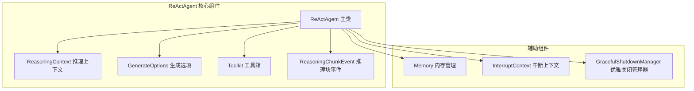
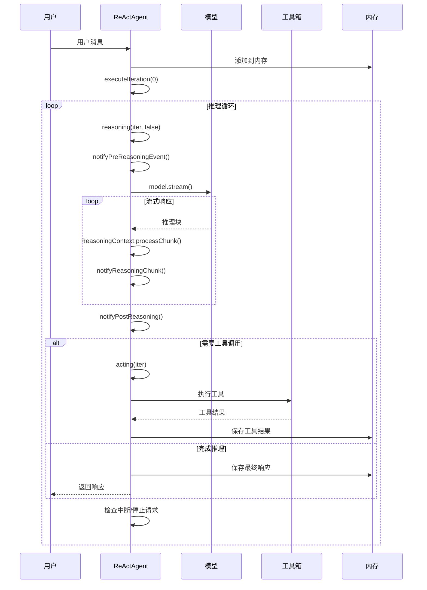
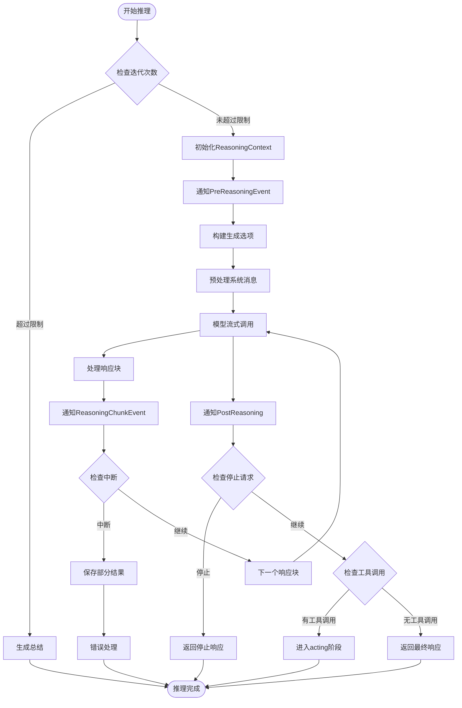
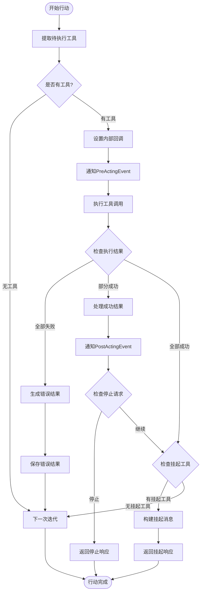
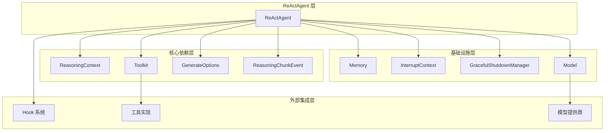

# 推理循环机制

<cite>
**本文档引用的文件**
- [ReActAgent.java](file://agentscope-core/src/main/java/io/agentscope/core/ReActAgent.java)
- [ReasoningContext.java](file://agentscope-core/src/main/java/io/agentscope/core/agent/accumulator/ReasoningContext.java)
- [ReasoningChunkEvent.java](file://agentscope-core/src/main/java/io/agentscope/core/hook/ReasoningChunkEvent.java)
- [GenerateOptions.java](file://agentscope-core/src/main/java/io/agentscope/core/model/GenerateOptions.java)
- [Toolkit.java](file://agentscope-core/src/main/java/io/agentscope/core/tool/Toolkit.java)
- [ReActAgentTest.java](file://agentscope-core/src/test/java/io/agentscope/core/agent/ReActAgentTest.java)
</cite>

## 目录
1. [引言](#引言)
2. [项目结构](#项目结构)
3. [核心组件](#核心组件)
4. [架构概览](#架构概览)
5. [详细组件分析](#详细组件分析)
6. [依赖分析](#依赖分析)
7. [性能考虑](#性能考虑)
8. [故障排除指南](#故障排除指南)
9. [结论](#结论)

## 引言

ReAct 智能体的推理循环机制是 AgentScope 框架的核心功能之一。该机制实现了"推理-行动"的迭代循环，通过 ReActAgent 类实现，支持流式响应处理、人类在环控制（HITL）、结构化输出等功能。

ReAct 循环的核心思想是将智能体的思考过程与工具执行相结合，在每次迭代中交替进行推理和行动，直到满足终止条件或达到最大迭代次数。

## 项目结构

AgentScope 项目的 ReActAgent 实现位于核心模块中，主要包含以下关键组件：

**图表来源**
- [ReActAgent.java:140-1904](file://agentscope-core/src/main/java/io/agentscope/core/ReActAgent.java#L140-L1904)
- [ReasoningContext.java:44-291](file://agentscope-core/src/main/java/io/agentscope/core/agent/accumulator/ReasoningContext.java#L44-L291)

**章节来源**
- [ReActAgent.java:1-1904](file://agentscope-core/src/main/java/io/agentscope/core/ReActAgent.java#L1-L1904)

## 核心组件

### ReActAgent 主类

ReActAgent 是整个推理循环的核心实现，继承自 StructuredOutputCapableAgent，提供了完整的 ReAct 模式实现。

**关键特性：**
- 基于 Project Reactor 的非阻塞执行
- 支持钩子系统用于监控和拦截执行
- 人类在环支持（HITL）
- 结构化输出能力
- 流式响应处理

**主要配置参数：**
- `maxIters`: 最大迭代次数限制
- `model`: 语言模型实例
- `toolkit`: 工具箱管理器
- `memory`: 内存存储
- `generateOptions`: 生成选项配置

### ReasoningContext 推理上下文

ReasoningContext 负责管理单次推理轮次的状态和内容累积，支持多种内容类型的实时流式处理。

**核心功能：**
- 文本内容累积和流式输出
- 思考内容累积和流式输出  
- 工具调用累积和流式输出
- 令牌使用量统计
- 多种内容块的合并处理

### GenerateOptions 生成选项

GenerateOptions 提供了对 LLM 生成过程的精细控制，包括温度、最大令牌数、工具选择策略等参数。

**关键参数：**
- `temperature`: 控制输出随机性
- `maxTokens`: 最大生成令牌数
- `toolChoice`: 工具调用策略
- `executionConfig`: 执行配置（超时、重试等）

**章节来源**
- [ReActAgent.java:140-1904](file://agentscope-core/src/main/java/io/agentscope/core/ReActAgent.java#L140-L1904)
- [ReasoningContext.java:44-291](file://agentscope-core/src/main/java/io/agentscope/core/agent/accumulator/ReasoningContext.java#L44-L291)
- [GenerateOptions.java:31-874](file://agentscope-core/src/main/java/io/agentscope/core/model/GenerateOptions.java#L31-L874)

## 架构概览

ReActAgent 的推理循环采用分层架构设计，实现了清晰的关注点分离：

**图表来源**
- [ReActAgent.java:560-650](file://agentscope-core/src/main/java/io/agentscope/core/ReActAgent.java#L560-L650)
- [ReActAgent.java:669-731](file://agentscope-core/src/main/java/io/agentscope/core/ReActAgent.java#L669-L731)

## 详细组件分析

### reasoning() 方法工作原理

reasoning() 方法是推理循环的核心，负责执行模型推理并处理流式响应：

#### 输入准备阶段
1. **迭代次数检查**: 验证是否超过最大迭代限制
2. **ReasoningContext 初始化**: 创建新的推理上下文
3. **钩子通知**: 触发 PreReasoningEvent 钩子
4. **生成选项构建**: 合并用户配置和执行配置
5. **系统消息预处理**: 将系统消息与用户消息组合

#### 模型调用阶段
1. **流式模型调用**: 通过 `model.stream()` 发起流式请求
2. **中断检查**: 在每个响应块后检查中断状态
3. **内容累积**: 使用 ReasoningContext 累积不同类型的响应块

#### 流式响应处理
1. **增量处理**: 对每个响应块进行处理和通知
2. **ReasoningChunkEvent**: 发射推理块事件给钩子系统
3. **内存更新**: 将累积的内容保存到内存

#### 决策逻辑
1. **停止请求检查**: 检查人类在环停止请求
2. **继续推理**: 如果有工具调用需求，转到 acting 阶段
3. **完成条件**: 如果没有工具调用，返回最终响应

**图表来源**
- [ReActAgent.java:560-650](file://agentscope-core/src/main/java/io/agentscope/core/ReActAgent.java#L560-L650)

**章节来源**
- [ReActAgent.java:560-650](file://agentscope-core/src/main/java/io/agentscope/core/ReActAgent.java#L560-L650)

### acting() 方法工作原理

acting() 方法负责执行工具调用并处理工具结果：

#### 工具提取阶段
1. **识别待执行工具**: 从最近的助手消息中提取工具调用
2. **过滤已完成工具**: 移除已有结果的工具调用
3. **验证工具可用性**: 确保工具在工具箱中存在

#### 工具执行阶段
1. **预执行钩子**: 通知 PreActingEvent 钩子
2. **工具调用**: 通过 Toolkit 执行工具
3. **流式结果处理**: 设置内部 chunk 回调处理工具流式输出

#### 结果处理阶段
1. **成功结果**: 通知 PostActingEvent 钩子并保存到内存
2. **挂起工具**: 构建包含挂起工具的消息
3. **继续循环**: 根据结果决定是否继续推理循环

**图表来源**
- [ReActAgent.java:669-731](file://agentscope-core/src/main/java/io/agentscope/core/ReActAgent.java#L669-L731)

**章节来源**
- [ReActAgent.java:669-731](file://agentscope-core/src/main/java/io/agentscope/core/ReActAgent.java#L669-L731)

### 推理块事件通知系统

ReActAgent 实现了完整的事件通知系统，支持多种类型的事件：

#### ReasoningChunkEvent
- **用途**: 通知推理过程中的流式响应块
- **内容**: 包含增量块和累积块两个版本
- **应用场景**: 实时显示推理进度、监控推理状态

#### ActingChunkEvent  
- **用途**: 通知工具执行过程中的流式响应块
- **内容**: 工具调用和对应的工具结果
- **应用场景**: 实时显示工具执行进度

#### 其他事件类型
- **PreReasoningEvent/PostReasoningEvent**: 推理前后钩子
- **PreActingEvent/PostActingEvent**: 工具执行前后钩子
- **PreSummaryEvent/PostSummaryEvent**: 总结阶段钩子

**章节来源**
- [ReActAgent.java:1004-1133](file://agentscope-core/src/main/java/io/agentscope/core/ReActAgent.java#L1004-L1133)
- [ReasoningChunkEvent.java:60-107](file://agentscope-core/src/main/java/io/agentscope/core/hook/ReasoningChunkEvent.java#L60-L107)

### 迭代次数限制和中断处理

#### 迭代次数限制
- **默认值**: 10 次迭代
- **配置方式**: 通过 `maxIters` 参数设置
- **触发条件**: 当迭代次数达到上限时，自动进入总结阶段

#### 中断处理机制
1. **手动中断**: 通过 `interrupt()` 方法触发
2. **系统中断**: 由优雅关闭管理器处理
3. **部分推理策略**: 可配置是否保存部分推理结果

#### 错误恢复机制
- **工具执行错误**: 自动转换为错误工具结果
- **模型调用异常**: 保持中断信号并生成错误响应
- **内存状态恢复**: 在中断情况下正确保存状态

**章节来源**
- [ReActAgent.java:1135-1161](file://agentscope-core/src/main/java/io/agentscope/core/ReActAgent.java#L1135-L1161)
- [ReActAgentTest.java:455-498](file://agentscope-core/src/test/java/io/agentscope/core/agent/ReActAgentTest.java#L455-L498)

## 依赖分析

ReActAgent 的依赖关系体现了清晰的分层架构：

**图表来源**
- [ReActAgent.java:140-1904](file://agentscope-core/src/main/java/io/agentscope/core/ReActAgent.java#L140-L1904)

**章节来源**
- [ReActAgent.java:140-1904](file://agentscope-core/src/main/java/io/agentscope/core/ReActAgent.java#L140-L1904)

## 性能考虑

### 流式处理优化
- **背压处理**: 使用 Reactor 的背压机制避免内存溢出
- **增量通知**: 仅发送必要的增量数据给钩子系统
- **内存管理**: 合理的内存清理和垃圾回收策略

### 并行执行策略
- **工具并行执行**: 支持多个工具的并发执行
- **流式结果聚合**: 高效地聚合多个工具的流式结果
- **资源池管理**: 合理管理线程池和连接池资源

### 缓存和重用
- **模型响应缓存**: 支持提示缓存以减少延迟
- **工具结果缓存**: 缓存常用的工具调用结果
- **配置重用**: 重用生成选项和执行配置

## 故障排除指南

### 常见问题及解决方案

#### 推理循环卡死
**症状**: 推理循环无法结束，持续产生工具调用
**原因**: 模型持续要求工具调用但工具执行无效
**解决方案**: 
- 检查 `maxIters` 配置是否合理
- 验证工具实现是否正确
- 检查模型配置参数

#### 流式响应丢失
**症状**: 部分推理块未被正确通知
**原因**: ReasoningContext 处理异常或钩子系统阻塞
**解决方案**:
- 检查钩子系统的异步处理
- 验证 ReasoningContext 的累积逻辑
- 确认流式处理的完整性

#### 工具执行超时
**症状**: 工具调用长时间无响应
**原因**: 工具实现效率低或外部服务响应慢
**解决方案**:
- 配置适当的执行超时时间
- 优化工具实现逻辑
- 检查外部服务的可用性

**章节来源**
- [ReActAgentTest.java:529-560](file://agentscope-core/src/test/java/io/agentscope/core/agent/ReActAgentTest.java#L529-L560)

## 结论

ReActAgent 的推理循环机制通过精心设计的架构实现了高效的推理-行动迭代。其核心优势包括：

1. **模块化设计**: 清晰的职责分离和可扩展的钩子系统
2. **流式处理**: 支持实时响应和进度监控
3. **容错机制**: 完善的错误处理和恢复策略
4. **性能优化**: 基于 Reactor 的非阻塞执行模型

该实现为构建复杂的智能体应用提供了坚实的基础，支持从简单的文本回复到复杂的多工具协作等各种场景。