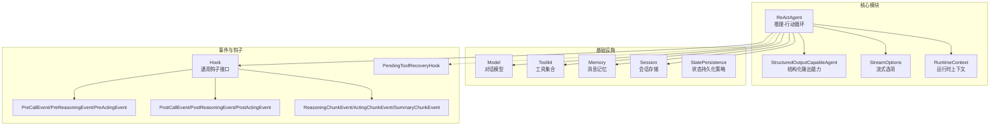
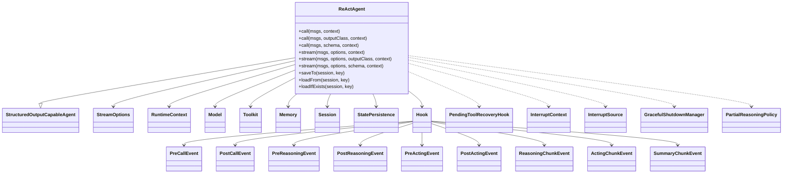

# 核心方法与构造器

<cite>
**本文引用的文件**
- [ReActAgent.java](file://agentscope-core/src/main/java/io/agentscope/core/ReActAgent.java)
- [StructuredOutputCapableAgent.java](file://agentscope-core/src/main/java/io/agentscope/core/agent/StructuredOutputCapableAgent.java)
- [StreamOptions.java](file://agentscope-core/src/main/java/io/agentscope/core/agent/StreamOptions.java)
- [RuntimeContext.java](file://agentscope-core/src/main/java/io/agentscope/core/agent/RuntimeContext.java)
- [Msg.java](file://agentscope-core/src/main/java/io/agentscope/core/message/Msg.java)
- [Toolkit.java](file://agentscope-core/src/main/java/io/agentscope/core/tool/Toolkit.java)
- [Model.java](file://agentscope-core/src/main/java/io/agentscope/core/model/Model.java)
- [Session.java](file://agentscope-core/src/main/java/io/agentscope/core/session/Session.java)
- [SessionKey.java](file://agentscope-core/src/main/java/io/agentscope/core/state/SessionKey.java)
- [StatePersistence.java](file://agentscope-core/src/main/java/io/agentscope/core/state/StatePersistence.java)
- [AgentMetaState.java](file://agentscope-core/src/main/java/io/agentscope/core/state/AgentMetaState.java)
- [ToolkitState.java](file://agentscope-core/src/main/java/io/agentscope/core/state/ToolkitState.java)
- [PlanNotebook.java](file://agentscope-core/src/main/java/io/agentscope/core/plan/PlanNotebook.java)
- [Memory.java](file://agentscope-core/src/main/java/io/agentscope/core/memory/Memory.java)
- [InMemoryMemory.java](file://agentscope-core/src/main/java/io/agentscope/core/memory/InMemoryMemory.java)
- [Hook.java](file://agentscope-core/src/main/java/io/agentscope/core/hook/Hook.java)
- [PreCallEvent.java](file://agentscope-core/src/main/java/io/agentscope/core/hook/PreCallEvent.java)
- [PostCallEvent.java](file://agentscope-core/src/main/java/io/agentscope/core/hook/PostCallEvent.java)
- [PreReasoningEvent.java](file://agentscope-core/src/main/java/io/agentscope/core/hook/PreReasoningEvent.java)
- [PostReasoningEvent.java](file://agentscope-core/src/main/java/io/agentscope/core/hook/PostReasoningEvent.java)
- [PreActingEvent.java](file://agentscope-core/src/main/java/io/agentscope/core/hook/PreActingEvent.java)
- [PostActingEvent.java](file://agentscope-core/src/main/java/io/agentscope/core/hook/PostActingEvent.java)
- [ReasoningChunkEvent.java](file://agentscope-core/src/main/java/io/agentscope/core/hook/ReasoningChunkEvent.java)
- [ActingChunkEvent.java](file://agentscope-core/src/main/java/io/agentscope/core/hook/ActingChunkEvent.java)
- [SummaryChunkEvent.java](file://agentscope-core/src/main/java/io/agentscope/core/hook/SummaryChunkEvent.java)
- [PendingToolRecoveryHook.java](file://agentscope-core/src/main/java/io/agentscope/core/hook/PendingToolRecoveryHook.java)
- [InterruptContext.java](file://agentscope-core/src/main/java/io/agentscope/core/interruption/InterruptContext.java)
- [InterruptSource.java](file://agentscope-core/src/main/java/io/agentscope/core/interruption/InterruptSource.java)
- [GracefulShutdownManager.java](file://agentscope-core/src/main/java/io/agentscope/core/shutdown/GracefulShutdownManager.java)
- [PartialReasoningPolicy.java](file://agentscope-core/src/main/java/io/agentscope/core/shutdown/PartialReasoningPolicy.java)
- [ToolResultBlock.java](file://agentscope-core/src/main/java/io/agentscope/core/message/ToolResultBlock.java)
- [ToolUseBlock.java](file://agentscope-core/src/main/java/io/agentscope/core/message/ToolUseBlock.java)
- [ThinkingBlock.java](file://agentscope-core/src/main/java/io/agentscope/core/message/ThinkingBlock.java)
- [TextBlock.java](file://agentscope-core/src/main/java/io/agentscope/core/message/TextBlock.java)
- [GenerateReason.java](file://agentscope-core/src/main/java/io/agentscope/core/message/GenerateReason.java)
- [EventType.java](file://agentscope-core/src/main/java/io/agentscope/core/hook/EventType.java)
- [Mono.java](file://agentscope-core/src/main/java/reactor/core/publisher/Mono.java)
- [Flux.java](file://agentscope-core/src/main/java/reactor/core/publisher/Flux.java)
- [JsonNode.java](file://agentscope-core/src/main/java/com/fasterxml/jackson/databind/JsonNode.java)
</cite>

## 目录
1. [简介](#简介)
2. [项目结构](#项目结构)
3. [核心组件](#核心组件)
4. [架构总览](#架构总览)
5. [详细组件分析](#详细组件分析)
6. [依赖分析](#依赖分析)
7. [性能考虑](#性能考虑)
8. [故障排查指南](#故障排查指南)
9. [结论](#结论)
10. [附录](#附录)

## 简介
本文件聚焦 ReAct 智能体的核心方法与构造器，系统性阐述 ReActAgent 的同步调用 call()、流式处理 stream()、状态管理 saveTo()/loadFrom() 方法，以及 Builder 模式的配置项与最佳实践。文档以代码级分析为基础，结合流程图与序列图，帮助读者快速掌握 ReActAgent 的使用方式与内部机制。

## 项目结构
ReActAgent 位于 agentscope-core 模块中，围绕 ReAct 推理-行动循环构建，依赖模型（Model）、工具箱（Toolkit）、内存（Memory）、会话（Session）等核心组件，并通过钩子（Hook）体系实现可扩展的事件监听与拦截。



图表来源
- [ReActAgent.java:140-1903](file://agentscope-core/src/main/java/io/agentscope/core/ReActAgent.java#L140-L1903)
- [StructuredOutputCapableAgent.java:65-373](file://agentscope-core/src/main/java/io/agentscope/core/agent/StructuredOutputCapableAgent.java#L65-L373)
- [StreamOptions.java](file://agentscope-core/src/main/java/io/agentscope/core/agent/StreamOptions.java)
- [RuntimeContext.java](file://agentscope-core/src/main/java/io/agentscope/core/agent/RuntimeContext.java)
- [Model.java](file://agentscope-core/src/main/java/io/agentscope/core/model/Model.java)
- [Toolkit.java](file://agentscope-core/src/main/java/io/agentscope/core/tool/Toolkit.java)
- [Memory.java](file://agentscope-core/src/main/java/io/agentscope/core/memory/Memory.java)
- [Session.java](file://agentscope-core/src/main/java/io/agentscope/core/session/Session.java)
- [StatePersistence.java](file://agentscope-core/src/main/java/io/agentscope/core/state/StatePersistence.java)
- [Hook.java](file://agentscope-core/src/main/java/io/agentscope/core/hook/Hook.java)
- [PreCallEvent.java](file://agentscope-core/src/main/java/io/agentscope/core/hook/PreCallEvent.java)
- [PostCallEvent.java](file://agentscope-core/src/main/java/io/agentscope/core/hook/PostCallEvent.java)
- [PreReasoningEvent.java](file://agentscope-core/src/main/java/io/agentscope/core/hook/PreReasoningEvent.java)
- [PostReasoningEvent.java](file://agentscope-core/src/main/java/io/agentscope/core/hook/PostReasoningEvent.java)
- [PreActingEvent.java](file://agentscope-core/src/main/java/io/agentscope/core/hook/PreActingEvent.java)
- [PostActingEvent.java](file://agentscope-core/src/main/java/io/agentscope/core/hook/PostActingEvent.java)
- [ReasoningChunkEvent.java](file://agentscope-core/src/main/java/io/agentscope/core/hook/ReasoningChunkEvent.java)
- [ActingChunkEvent.java](file://agentscope-core/src/main/java/io/agentscope/core/hook/ActingChunkEvent.java)
- [SummaryChunkEvent.java](file://agentscope-core/src/main/java/io/agentscope/core/hook/SummaryChunkEvent.java)
- [PendingToolRecoveryHook.java](file://agentscope-core/src/main/java/io/agentscope/core/hook/PendingToolRecoveryHook.java)

章节来源
- [ReActAgent.java:140-1903](file://agentscope-core/src/main/java/io/agentscope/core/ReActAgent.java#L140-L1903)

## 核心组件
- ReActAgent：继承自 StructuredOutputCapableAgent，实现 ReAct 推理-行动循环，支持同步与流式调用，具备状态保存与加载能力。
- StructuredOutputCapableAgent：提供结构化输出能力，支持类型化输出与 JSON Schema 输出。
- StreamOptions：定义流式输出的事件类型与增量模式等选项。
- RuntimeContext：每次调用的运行时上下文，用于钩子与工具传递元数据。
- Model/Toolkit/Memory/Session：分别为推理引擎、工具执行、消息记忆与会话持久化的基础设施。
- Hook 体系：在关键阶段注入逻辑，如 PreCall/PostCall、PreReasoning/PostReasoning、PreActing/PostActing、ReasoningChunk、ActingChunk、SummaryChunk 等。

章节来源
- [ReActAgent.java:140-1903](file://agentscope-core/src/main/java/io/agentscope/core/ReActAgent.java#L140-L1903)
- [StructuredOutputCapableAgent.java:65-373](file://agentscope-core/src/main/java/io/agentscope/core/agent/StructuredOutputCapableAgent.java#L65-L373)
- [StreamOptions.java](file://agentscope-core/src/main/java/io/agentscope/core/agent/StreamOptions.java)
- [RuntimeContext.java](file://agentscope-core/src/main/java/io/agentscope/core/agent/RuntimeContext.java)

## 架构总览
ReActAgent 的核心是“推理-行动”迭代循环。每次迭代先进行推理（reasoning），生成思考与可能的工具调用；随后进入行动（acting），执行工具并将结果写回记忆。循环受最大迭代次数限制或人类在环（HITL）干预控制。

```mermaid
sequenceDiagram
participant U as "用户"
participant A as "ReActAgent"
participant M as "Model"
participant T as "Toolkit"
participant MEM as "Memory"
U->>A : "call()/stream() 请求"
A->>A : "beforeAgentExecution()<br/>绑定RuntimeContext"
A->>MEM : "addToMemory(输入消息)"
A->>A : "reasoning(iter)"
A->>M : "stream(输入消息, 工具Schema, 生成选项)"
M-->>A : "ReasoningChunkEvent 增量输出"
A->>A : "notifyReasoningChunk()"
A->>A : "checkInterruptedAsync()"
A->>A : "notifyPostReasoning()"
alt "停止请求(HITL)"
A-->>U : "返回带停止原因的消息"
else "继续行动"
A->>A : "acting(iter)"
A->>T : "callTools(待执行工具)"
T-->>A : "工具结果"
A->>A : "notifyPostActingHook()"
A->>MEM : "添加工具结果到记忆"
opt "未达最大迭代且未完成"
A->>A : "executeIteration(iter+1)"
else "完成/超限"
A->>A : "summarizing()"
A-->>U : "最终消息"
end
end
A->>A : "afterAgentExecution()<br/>解绑RuntimeContext"
```

图表来源
- [ReActAgent.java:364-650](file://agentscope-core/src/main/java/io/agentscope/core/ReActAgent.java#L364-L650)
- [ReActAgent.java:669-731](file://agentscope-core/src/main/java/io/agentscope/core/ReActAgent.java#L669-L731)
- [PreCallEvent.java](file://agentscope-core/src/main/java/io/agentscope/core/hook/PreCallEvent.java)
- [PostCallEvent.java](file://agentscope-core/src/main/java/io/agentscope/core/hook/PostCallEvent.java)
- [PreReasoningEvent.java](file://agentscope-core/src/main/java/io/agentscope/core/hook/PreReasoningEvent.java)
- [PostReasoningEvent.java](file://agentscope-core/src/main/java/io/agentscope/core/hook/PostReasoningEvent.java)
- [PreActingEvent.java](file://agentscope-core/src/main/java/io/agentscope/core/hook/PreActingEvent.java)
- [PostActingEvent.java](file://agentscope-core/src/main/java/io/agentscope/core/hook/PostActingEvent.java)
- [ReasoningChunkEvent.java](file://agentscope-core/src/main/java/io/agentscope/core/hook/ReasoningChunkEvent.java)
- [ActingChunkEvent.java](file://agentscope-core/src/main/java/io/agentscope/core/hook/ActingChunkEvent.java)

章节来源
- [ReActAgent.java:364-731](file://agentscope-core/src/main/java/io/agentscope/core/ReActAgent.java#L364-L731)

## 详细组件分析

### call() 同步调用方法
- 方法签名与重载
  - call(List<Msg>, RuntimeContext)：传入一次性 RuntimeContext，后续执行期间生效。
  - call(List<Msg>, Class<?>, RuntimeContext)：结构化输出（类型化）。
  - call(List<Msg>, JsonNode, RuntimeContext)：结构化输出（JSON Schema）。
  - call(List<Msg>)：标准同步调用。
  - call(List<Msg>, Class<?>)：结构化输出（类型化）。
  - call(List<Msg>, JsonNode)：结构化输出（JSON Schema）。
- 参数说明
  - msgs：用户输入消息列表，支持文本、图像、音频、工具结果等多种内容块。
  - RuntimeContext：本次调用的运行时上下文，可用于钩子与工具共享元数据。
  - 结构化输出类/Schema：指定期望的输出结构，由结构化输出钩子驱动。
- 返回值
  - Mono<Msg>：异步返回最终消息，可通过 block() 获取阻塞结果。
- 异常处理
  - 当存在挂起工具调用但未提供对应工具结果时，抛出非法状态异常，提示启用 PendingToolRecoveryHook 或提供工具结果。
  - 中断信号（InterruptedException）在推理阶段被捕获，根据关闭策略决定是否保留部分推理结果。
- 使用场景
  - 需要一次性完整响应的对话。
  - 需要结构化输出（如 JSON 对象、强类型对象）的业务流程。
- 最佳实践
  - 在需要跨调用共享上下文时，优先使用带 RuntimeContext 的重载。
  - 使用结构化输出时，确保模型与生成选项支持结构化输出能力。

章节来源
- [ReActAgent.java:246-259](file://agentscope-core/src/main/java/io/agentscope/core/ReActAgent.java#L246-L259)
- [ReActAgent.java:364-398](file://agentscope-core/src/main/java/io/agentscope/core/ReActAgent.java#L364-L398)
- [ReActAgent.java:560-650](file://agentscope-core/src/main/java/io/agentscope/core/ReActAgent.java#L560-L650)
- [ReActAgent.java:669-731](file://agentscope-core/src/main/java/io/agentscope/core/ReActAgent.java#L669-L731)
- [StructuredOutputCapableAgent.java:65-373](file://agentscope-core/src/main/java/io/agentscope/core/agent/StructuredOutputCapableAgent.java#L65-L373)

### stream() 流式处理方法
- 方法签名与重载
  - stream(List<Msg>, StreamOptions, RuntimeContext)：传入一次性 RuntimeContext。
  - stream(List<Msg>, StreamOptions, Class<?>, RuntimeContext)：结构化输出（类型化）。
  - stream(List<Msg>, StreamOptions, JsonNode, RuntimeContext)：结构化输出（JSON Schema）。
  - stream(List<Msg>, StreamOptions)：标准流式调用。
  - stream(List<Msg>, StreamOptions, Class<?>)：结构化输出（类型化）。
  - stream(List<Msg>, StreamOptions, JsonNode)：结构化输出（JSON Schema）。
- 参数说明
  - msgs：用户输入消息列表。
  - StreamOptions：控制事件类型（如推理、行动、总结）与增量输出模式。
  - RuntimeContext：本次流式会话的运行时上下文。
- 返回值
  - Flux<Event>：事件流，包含推理块、行动块、总结块等增量事件。
- 异常处理
  - 流中断（InterruptedException）在推理阶段被捕获，依据关闭策略决定是否保留部分推理结果。
  - 工具执行失败时生成错误工具结果，避免中断整体流程。
- 使用场景
  - 实时渲染对话（如网页/应用的流式 UI）。
  - 需要对中间产物进行实时处理（如语音合成、可视化）。
- 最佳实践
  - 明确设置 StreamOptions 的事件类型，减少不必要的事件传输。
  - 在订阅前设置合适的调度器（如 boundedElastic），避免阻塞主线程。

章节来源
- [ReActAgent.java:261-279](file://agentscope-core/src/main/java/io/agentscope/core/ReActAgent.java#L261-L279)
- [ReActAgent.java:560-650](file://agentscope-core/src/main/java/io/agentscope/core/ReActAgent.java#L560-L650)
- [ReActAgent.java:669-731](file://agentscope-core/src/main/java/io/agentscope/core/ReActAgent.java#L669-L731)
- [StreamOptions.java](file://agentscope-core/src/main/java/io/agentscope/core/agent/StreamOptions.java)
- [EventType.java](file://agentscope-core/src/main/java/io/agentscope/core/hook/EventType.java)

### saveTo()/loadFrom() 状态管理方法
- saveTo(Session, SessionKey)
  - 功能：按 StatePersistence 配置保存代理元数据、内存、工具组、计划笔记本等。
  - 保存内容：
    - 代理元数据（始终保存）
    - 内存消息（当 memoryManaged 为真）
    - 工具组激活状态（当 toolkitManaged 为真）
    - 计划笔记本状态（当 planNotebookManaged 为真）
- loadFrom(Session, SessionKey)
  - 功能：从会话加载状态，恢复代理上下文。
  - 加载内容：内存、工具组激活状态、计划笔记本状态（按配置）。
- loadIfExists(Session, SessionKey)
  - 功能：若会话存在则加载并返回 true，否则不加载返回 false。
- 使用场景
  - 多轮对话的跨请求恢复。
  - 分布式/多副本部署中的状态共享。
- 最佳实践
  - 明确 StatePersistence 的粒度，避免保存过多敏感信息。
  - 在加载后检查代理状态一致性（如工具组、计划笔记本）。

章节来源
- [ReActAgent.java:299-359](file://agentscope-core/src/main/java/io/agentscope/core/ReActAgent.java#L299-L359)
- [StatePersistence.java](file://agentscope-core/src/main/java/io/agentscope/core/state/StatePersistence.java)
- [AgentMetaState.java](file://agentscope-core/src/main/java/io/agentscope/core/state/AgentMetaState.java)
- [ToolkitState.java](file://agentscope-core/src/main/java/io/agentscope/core/state/ToolkitState.java)
- [Session.java](file://agentscope-core/src/main/java/io/agentscope/core/session/Session.java)
- [SessionKey.java](file://agentscope-core/src/main/java/io/agentscope/core/state/SessionKey.java)

### Builder 模式与配置选项
- 关键配置项
  - name：代理名称
  - description：代理描述
  - sysPrompt：系统提示词
  - model：对话模型实例
  - toolkit：工具箱实例
  - memory：消息记忆实例（默认 InMemoryMemory）
  - maxIters：最大迭代次数
  - modelExecutionConfig：模型执行配置
  - toolExecutionConfig：工具执行配置
  - generateOptions：生成选项
  - planNotebook：计划笔记本实例
  - toolExecutionContext：工具执行上下文
  - statePersistence：状态持久化策略（默认全量）
  - hooks：钩子列表
  - structuredOutputReminder：结构化输出提醒
  - checkRunning：运行状态检查
- 使用方式
  - 通过 ReActAgent.builder() 创建构建器，逐项设置配置，最后 build() 得到 ReActAgent 实例。
- 最佳实践
  - 明确 maxIters，避免无限循环。
  - 合理设置 modelExecutionConfig 与 toolExecutionConfig 的超时与重试策略。
  - 使用 StatePersistence 控制保存范围，兼顾性能与可用性。

章节来源
- [ReActAgent.java:172-194](file://agentscope-core/src/main/java/io/agentscope/core/ReActAgent.java#L172-L194)

### 公共方法重载与最佳实践
- call() 重载
  - 带 RuntimeContext 的重载适合需要跨调用共享上下文的场景。
  - 结构化输出重载适合需要严格格式输出的业务。
- stream() 重载
  - 建议明确 StreamOptions 的事件类型，减少网络与前端处理压力。
  - 在高并发场景下，合理选择调度器与背压策略。
- 状态管理
  - saveTo()/loadFrom() 应与会话管理器配合使用，确保幂等与一致性。
  - 使用 loadIfExists() 进行条件加载，避免覆盖当前状态。

章节来源
- [ReActAgent.java:246-279](file://agentscope-core/src/main/java/io/agentscope/core/ReActAgent.java#L246-L279)
- [ReActAgent.java:299-359](file://agentscope-core/src/main/java/io/agentscope/core/ReActAgent.java#L299-L359)

## 依赖分析
ReActAgent 的核心依赖关系如下：



图表来源
- [ReActAgent.java:140-1903](file://agentscope-core/src/main/java/io/agentscope/core/ReActAgent.java#L140-L1903)
- [StructuredOutputCapableAgent.java:65-373](file://agentscope-core/src/main/java/io/agentscope/core/agent/StructuredOutputCapableAgent.java#L65-L373)
- [StreamOptions.java](file://agentscope-core/src/main/java/io/agentscope/core/agent/StreamOptions.java)
- [RuntimeContext.java](file://agentscope-core/src/main/java/io/agentscope/core/agent/RuntimeContext.java)
- [Model.java](file://agentscope-core/src/main/java/io/agentscope/core/model/Model.java)
- [Toolkit.java](file://agentscope-core/src/main/java/io/agentscope/core/tool/Toolkit.java)
- [Memory.java](file://agentscope-core/src/main/java/io/agentscope/core/memory/Memory.java)
- [Session.java](file://agentscope-core/src/main/java/io/agentscope/core/session/Session.java)
- [StatePersistence.java](file://agentscope-core/src/main/java/io/agentscope/core/state/StatePersistence.java)
- [Hook.java](file://agentscope-core/src/main/java/io/agentscope/core/hook/Hook.java)
- [PreCallEvent.java](file://agentscope-core/src/main/java/io/agentscope/core/hook/PreCallEvent.java)
- [PostCallEvent.java](file://agentscope-core/src/main/java/io/agentscope/core/hook/PostCallEvent.java)
- [PreReasoningEvent.java](file://agentscope-core/src/main/java/io/agentscope/core/hook/PreReasoningEvent.java)
- [PostReasoningEvent.java](file://agentscope-core/src/main/java/io/agentscope/core/hook/PostReasoningEvent.java)
- [PreActingEvent.java](file://agentscope-core/src/main/java/io/agentscope/core/hook/PreActingEvent.java)
- [PostActingEvent.java](file://agentscope-core/src/main/java/io/agentscope/core/hook/PostActingEvent.java)
- [ReasoningChunkEvent.java](file://agentscope-core/src/main/java/io/agentscope/core/hook/ReasoningChunkEvent.java)
- [ActingChunkEvent.java](file://agentscope-core/src/main/java/io/agentscope/core/hook/ActingChunkEvent.java)
- [SummaryChunkEvent.java](file://agentscope-core/src/main/java/io/agentscope/core/hook/SummaryChunkEvent.java)
- [PendingToolRecoveryHook.java](file://agentscope-core/src/main/java/io/agentscope/core/hook/PendingToolRecoveryHook.java)
- [InterruptContext.java](file://agentscope-core/src/main/java/io/agentscope/core/interruption/InterruptContext.java)
- [InterruptSource.java](file://agentscope-core/src/main/java/io/agentscope/core/interruption/InterruptSource.java)
- [GracefulShutdownManager.java](file://agentscope-core/src/main/java/io/agentscope/core/shutdown/GracefulShutdownManager.java)
- [PartialReasoningPolicy.java](file://agentscope-core/src/main/java/io/agentscope/core/shutdown/PartialReasoningPolicy.java)

章节来源
- [ReActAgent.java:140-1903](file://agentscope-core/src/main/java/io/agentscope/core/ReActAgent.java#L140-L1903)

## 性能考虑
- 流式处理
  - 使用 Flux/事件流可显著降低端到端延迟，适合实时交互。
  - 合理设置 StreamOptions 的事件类型与增量模式，减少传输与渲染开销。
- 超时与中断
  - 为模型与工具调用配置合理的超时策略，避免长时间阻塞。
  - 利用中断机制（interrupt()）及时终止长耗时操作，配合优雅停机策略。
- 内存与状态
  - 使用 StatePersistence 控制保存范围，避免频繁持久化带来的 IO 开销。
  - 对大记忆进行定期清理或压缩，保持推理效率。
- 并发与调度
  - 在高并发场景下，使用合适的调度器（如 boundedElastic）避免阻塞事件线程。

## 故障排查指南
- 挂起工具调用未恢复
  - 现象：存在待执行工具但未提供结果，抛出非法状态异常。
  - 处理：启用 PendingToolRecoveryHook 或在后续消息中提供工具结果。
- 推理阶段被中断
  - 现象：推理过程中收到中断信号，可能保留或丢弃部分推理结果（取决于关闭策略）。
  - 处理：检查 GracefulShutdownManager 的配置与 PartialReasoningPolicy 设置。
- 工具执行失败
  - 现象：工具执行异常不会中断整体流程，而是生成错误工具结果。
  - 处理：确认工具参数与权限，必要时增加重试或降级策略。
- 结构化输出未生成
  - 现象：未达到结构化输出触发条件或模型不支持。
  - 处理：检查生成选项与模型能力，确保 Schema/类型定义正确。

章节来源
- [ReActAgent.java:393-398](file://agentscope-core/src/main/java/io/agentscope/core/ReActAgent.java#L393-L398)
- [ReActAgent.java:591-610](file://agentscope-core/src/main/java/io/agentscope/core/ReActAgent.java#L591-L610)
- [ReActAgent.java:774-800](file://agentscope-core/src/main/java/io/agentscope/core/ReActAgent.java#L774-L800)
- [GracefulShutdownManager.java](file://agentscope-core/src/main/java/io/agentscope/core/shutdown/GracefulShutdownManager.java)
- [PartialReasoningPolicy.java](file://agentscope-core/src/main/java/io/agentscope/core/shutdown/PartialReasoningPolicy.java)

## 结论
ReActAgent 提供了完整的推理-行动循环与灵活的调用方式（同步/流式）。通过 RuntimeContext、结构化输出、钩子体系与状态持久化，ReActAgent 能够满足复杂业务场景的需求。遵循本文的最佳实践，可在保证性能与稳定性的同时，最大化发挥 ReActAgent 的能力。

## 附录
- 示例参考路径（不直接展示代码，仅提供定位）
  - 同步调用示例：[ReActAgent.java:108-136](file://agentscope-core/src/main/java/io/agentscope/core/ReActAgent.java#L108-L136)
  - 流式调用示例：[ChatController.java:154-160](file://agentscope-examples/chat-tts/src/main/java/io/agentscope/examples/chattts/ChatController.java#L154-L160)
  - 状态保存/加载示例：[ReActAgentStateTest.java:109-136](file://agentscope-core/src/test/java/io/agentscope/core/agent/ReActAgentStateTest.java#L109-L136)
  - Builder 配置示例：[ReActAgent.java:172-194](file://agentscope-core/src/main/java/io/agentscope/core/ReActAgent.java#L172-L194)