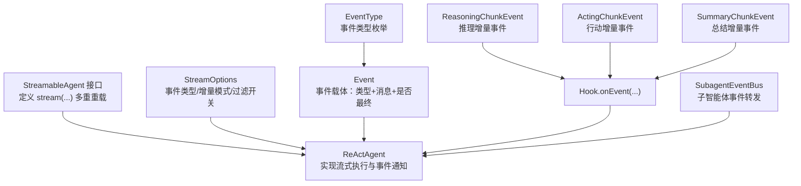
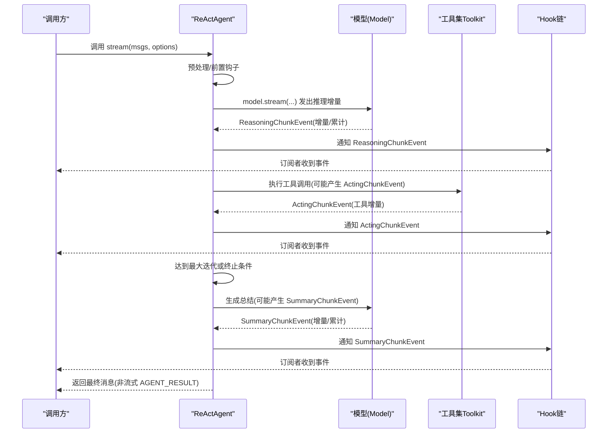
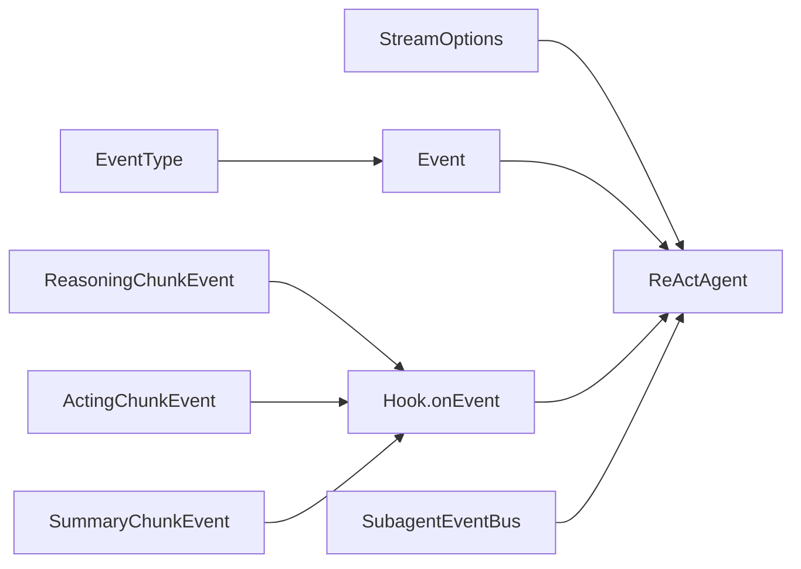

# 流式处理 API

<cite>
**本文引用的文件**
- [ReActAgent.java](file://agentscope-core/src/main/java/io/agentscope/core/ReActAgent.java)
- [StreamableAgent.java](file://agentscope-core/src/main/java/io/agentscope/core/agent/StreamableAgent.java)
- [StreamOptions.java](file://agentscope-core/src/main/java/io/agentscope/core/agent/StreamOptions.java)
- [Event.java](file://agentscope-core/src/main/java/io/agentscope/core/agent/Event.java)
- [EventType.java](file://agentscope-core/src/main/java/io/agentscope/core/agent/EventType.java)
- [ReasoningChunkEvent.java](file://agentscope-core/src/main/java/io/agentscope/core/hook/ReasoningChunkEvent.java)
- [ActingChunkEvent.java](file://agentscope-core/src/main/java/io/agentscope/core/hook/ActingChunkEvent.java)
- [SummaryChunkEvent.java](file://agentscope-core/src/main/java/io/agentscope/core/hook/SummaryChunkEvent.java)
- [SubagentEventBus.java](file://agentscope-core/src/main/java/io/agentscope/core/agent/SubagentEventBus.java)
- [ObservableAgent.java](file://agentscope-core/src/main/java/io/agentscope/core/agent/ObservableAgent.java)
- [Streaming Behavior E2E Test.java](file://agentscope-core/src/test/java/io/agentscope/core/e2e/StreamingBehaviorE2ETest.java)
- [JDK HTTP Transport Test.java](file://agentscope-core/src/test/java/io/agentscope/core/model/transport/JdkHttpTransportTest.java)
</cite>

## 目录
1. [简介](#简介)
2. [项目结构](#项目结构)
3. [核心组件](#核心组件)
4. [架构总览](#架构总览)
5. [详细组件分析](#详细组件分析)
6. [依赖分析](#依赖分析)
7. [性能考虑](#性能考虑)
8. [故障排查指南](#故障排查指南)
9. [结论](#结论)
10. [附录](#附录)

## 简介
本文件面向 ReAct 智能体的流式处理 API，系统性阐述 stream() 的使用方式与内部机制，覆盖以下关键主题：
- 流式事件类型与事件处理器注册
- ReasoningChunkEvent、ActingChunkEvent、SummaryChunkEvent 等事件类型的语义与用途
- 流式处理中的背压、错误传播与取消机制
- 实时监听与处理流式事件的最佳实践
- 性能优化与内存管理策略

## 项目结构
ReActAgent 提供统一的流式接口，通过 StreamOptions 控制事件类型与增量/累积模式；通过 Hook 体系在推理、行动、总结阶段注入中间态事件；通过 Event 封装消息与完成状态，支持子智能体事件汇聚。

图示来源
- [StreamableAgent.java:36-152](file://agentscope-core/src/main/java/io/agentscope/core/agent/StreamableAgent.java#L36-L152)
- [ReActAgent.java:261-279](file://agentscope-core/src/main/java/io/agentscope/core/ReActAgent.java#L261-L279)
- [StreamOptions.java:62-371](file://agentscope-core/src/main/java/io/agentscope/core/agent/StreamOptions.java#L62-L371)
- [Event.java:49-211](file://agentscope-core/src/main/java/io/agentscope/core/agent/Event.java#L49-L211)
- [EventType.java:24-95](file://agentscope-core/src/main/java/io/agentscope/core/agent/EventType.java#L24-L95)
- [ReasoningChunkEvent.java:60-107](file://agentscope-core/src/main/java/io/agentscope/core/hook/ReasoningChunkEvent.java#L60-L107)
- [ActingChunkEvent.java:49-77](file://agentscope-core/src/main/java/io/agentscope/core/hook/ActingChunkEvent.java#L49-L77)
- [SummaryChunkEvent.java:60-107](file://agentscope-core/src/main/java/io/agentscope/core/hook/SummaryChunkEvent.java#L60-L107)
- [SubagentEventBus.java:45-69](file://agentscope-core/src/main/java/io/agentscope/core/agent/SubagentEventBus.java#L45-L69)

章节来源
- [StreamableAgent.java:36-152](file://agentscope-core/src/main/java/io/agentscope/core/agent/StreamableAgent.java#L36-L152)
- [ReActAgent.java:261-279](file://agentscope-core/src/main/java/io/agentscope/core/ReActAgent.java#L261-L279)
- [StreamOptions.java:62-371](file://agentscope-core/src/main/java/io/agentscope/core/agent/StreamOptions.java#L62-L371)
- [Event.java:49-211](file://agentscope-core/src/main/java/io/agentscope/core/agent/Event.java#L49-L211)
- [EventType.java:24-95](file://agentscope-core/src/main/java/io/agentscope/core/agent/EventType.java#L24-L95)
- [ReasoningChunkEvent.java:60-107](file://agentscope-core/src/main/java/io/agentscope/core/hook/ReasoningChunkEvent.java#L60-L107)
- [ActingChunkEvent.java:49-77](file://agentscope-core/src/main/java/io/agentscope/core/hook/ActingChunkEvent.java#L49-L77)
- [SummaryChunkEvent.java:60-107](file://agentscope-core/src/main/java/io/agentscope/core/hook/SummaryChunkEvent.java#L60-L107)
- [SubagentEventBus.java:45-69](file://agentscope-core/src/main/java/io/agentscope/core/agent/SubagentEventBus.java#L45-L69)

## 核心组件
- StreamableAgent：定义多重重载的 stream(...) 方法，支持单消息、多消息、结构化输出等调用形式。
- ReActAgent：实现流式执行，将模型推理、工具执行、总结生成过程拆分为多个阶段，并在关键节点发出事件。
- StreamOptions：配置事件类型集合、增量/累积模式以及各类事件的包含/排除开关。
- Event：统一的事件载体，携带事件类型、消息内容与是否为最终消息，支持子智能体来源标记。
- EventType：事件类型枚举，涵盖 REASONING、TOOL_RESULT、HINT、AGENT_RESULT、SUMMARY 等。
- ReasoningChunkEvent / ActingChunkEvent / SummaryChunkEvent：分别在推理、行动、总结阶段发出的增量事件，提供增量块与累计块两种视图。
- SubagentEventBus：用于子智能体事件向父级流转发，保证事件在嵌套场景下的正确路由。

章节来源
- [StreamableAgent.java:36-152](file://agentscope-core/src/main/java/io/agentscope/core/agent/StreamableAgent.java#L36-L152)
- [ReActAgent.java:261-279](file://agentscope-core/src/main/java/io/agentscope/core/ReActAgent.java#L261-L279)
- [StreamOptions.java:62-371](file://agentscope-core/src/main/java/io/agentscope/core/agent/StreamOptions.java#L62-L371)
- [Event.java:49-211](file://agentscope-core/src/main/java/io/agentscope/core/agent/Event.java#L49-L211)
- [EventType.java:24-95](file://agentscope-core/src/main/java/io/agentscope/core/agent/EventType.java#L24-L95)
- [ReasoningChunkEvent.java:60-107](file://agentscope-core/src/main/java/io/agentscope/core/hook/ReasoningChunkEvent.java#L60-L107)
- [ActingChunkEvent.java:49-77](file://agentscope-core/src/main/java/io/agentscope/core/hook/ActingChunkEvent.java#L49-L77)
- [SummaryChunkEvent.java:60-107](file://agentscope-core/src/main/java/io/agentscope/core/hook/SummaryChunkEvent.java#L60-L107)
- [SubagentEventBus.java:45-69](file://agentscope-core/src/main/java/io/agentscope/core/agent/SubagentEventBus.java#L45-L69)

## 架构总览
ReActAgent 的流式执行以“推理-行动-推理-行动...”循环为主干，结合“总结”阶段在达到最大迭代次数后生成最终摘要。每个阶段可能产生增量事件（如 ReasoningChunkEvent、ActingChunkEvent、SummaryChunkEvent），并通过 Hook 通知链路分发给订阅者。

图示来源
- [ReActAgent.java:560-650](file://agentscope-core/src/main/java/io/agentscope/core/ReActAgent.java#L560-L650)
- [ReActAgent.java:669-731](file://agentscope-core/src/main/java/io/agentscope/core/ReActAgent.java#L669-L731)
- [ReActAgent.java:1044-1133](file://agentscope-core/src/main/java/io/agentscope/core/ReActAgent.java#L1044-L1133)
- [ReasoningChunkEvent.java:60-107](file://agentscope-core/src/main/java/io/agentscope/core/hook/ReasoningChunkEvent.java#L60-L107)
- [ActingChunkEvent.java:49-77](file://agentscope-core/src/main/java/io/agentscope/core/hook/ActingChunkEvent.java#L49-L77)
- [SummaryChunkEvent.java:60-107](file://agentscope-core/src/main/java/io/agentscope/core/hook/SummaryChunkEvent.java#L60-L107)

## 详细组件分析

### StreamOptions：事件类型与增量模式
- 事件类型集合：通过 eventTypes(...) 指定需要接收的 EventType 子集；使用 EventType.ALL 可接收全部事件（除 AGENT_RESULT）。
- 增量/累积模式：incremental(true) 仅返回新增片段，false 则返回累计全量文本，便于直接渲染。
- 细粒度过滤：
  - 推理：includeReasoningChunk / includeReasoningResult
  - 行动：includeActingChunk
  - 总结：includeSummaryChunk / includeSummaryResult
- 工具方法：
  - shouldStream(type)：判断某类型是否应被流式输出
  - shouldIncludeReasoningEmission/isChunk → 决策是否包含推理增量/最终结果
  - shouldIncludeSummaryEmission/isChunk → 决策是否包含总结增量/最终结果

章节来源
- [StreamOptions.java:62-371](file://agentscope-core/src/main/java/io/agentscope/core/agent/StreamOptions.java#L62-L371)

### Event 与 EventType：事件载体与类型
- Event：封装事件类型、消息内容、是否最终、来源子智能体等元信息；isLast() 用于区分中间增量与最终完整消息。
- EventType：定义 REASONING、TOOL_RESULT、HINT、AGENT_RESULT、SUMMARY 等类型，帮助订阅者按类型分流处理。

章节来源
- [Event.java:49-211](file://agentscope-core/src/main/java/io/agentscope/core/agent/Event.java#L49-L211)
- [EventType.java:24-95](file://agentscope-core/src/main/java/io/agentscope/core/agent/EventType.java#L24-L95)

### ReasoningChunkEvent：推理阶段增量事件
- 语义：在模型推理过程中，按增量/累计两种视图提供中间思考与文本片段。
- 字段：incrementalChunk（本次增量）、accumulated（累计全量）。
- 使用场景：实时显示思考过程、监控推理进度、日志记录等。

章节来源
- [ReasoningChunkEvent.java:60-107](file://agentscope-core/src/main/java/io/agentscope/core/hook/ReasoningChunkEvent.java#L60-L107)
- [ReActAgent.java:1044-1084](file://agentscope-core/src/main/java/io/agentscope/core/ReActAgent.java#L1044-L1084)

### ActingChunkEvent：行动阶段增量事件
- 语义：工具执行过程中的中间增量（由工具侧通过 ToolEmitter 发出，非发送给 LLM）。
- 字段：chunk（工具增量块）。
- 使用场景：显示工具执行进度、记录中间输出、监控长时间运行的工具操作。

章节来源
- [ActingChunkEvent.java:49-77](file://agentscope-core/src/main/java/io/agentscope/core/hook/ActingChunkEvent.java#L49-L77)
- [ReActAgent.java:1034-1042](file://agentscope-core/src/main/java/io/agentscope/core/ReActAgent.java#L1034-L1042)

### SummaryChunkEvent：总结阶段增量事件
- 语义：达到最大迭代次数后生成总结时的增量/累计事件。
- 字段：incrementalChunk（本次增量）、accumulated（累计全量）。
- 使用场景：实时展示总结生成过程、监控总结进度、日志记录。

章节来源
- [SummaryChunkEvent.java:60-107](file://agentscope-core/src/main/java/io/agentscope/core/hook/SummaryChunkEvent.java#L60-L107)
- [ReActAgent.java:1101-1133](file://agentscope-core/src/main/java/io/agentscope/core/ReActAgent.java#L1101-L1133)

### 子智能体事件转发：SubagentEventBus
- 作用：在嵌套子智能体场景下，将子智能体事件通过 EventSource 标记后转发至父级流，确保订阅者能区分事件来源。
- 安全性：emit(...) 在线程安全上下文中调用，适合任意线程触发。

章节来源
- [SubagentEventBus.java:45-69](file://agentscope-core/src/main/java/io/agentscope/core/agent/SubagentEventBus.java#L45-L69)

### 观察者接口：ObservableAgent
- 作用：提供只观察不回复的能力，常用于多智能体协作中的被动监听与共享上下文。

章节来源
- [ObservableAgent.java:36-54](file://agentscope-core/src/main/java/io/agentscope/core/agent/ObservableAgent.java#L36-L54)

### ReActAgent 的流式实现要点
- 推理阶段：model.stream(...) 返回增量，ReActAgent 在每个增量到达时构建 ReasoningChunkEvent 并通知 Hook。
- 行动阶段：工具执行通过内部回调 notifyActingChunk(...) 注入 ActingChunkEvent。
- 总结阶段：达到最大迭代后生成总结，必要时发出 SummaryChunkEvent。
- 中断与恢复：在中断发生时根据策略保存/丢弃部分推理结果，避免阻塞流式通道。

章节来源
- [ReActAgent.java:560-650](file://agentscope-core/src/main/java/io/agentscope/core/ReActAgent.java#L560-L650)
- [ReActAgent.java:669-731](file://agentscope-core/src/main/java/io/agentscope/core/ReActAgent.java#L669-L731)
- [ReActAgent.java:1044-1133](file://agentscope-core/src/main/java/io/agentscope/core/ReActAgent.java#L1044-L1133)

## 依赖分析
ReActAgent 的流式处理围绕以下依赖关系展开：
- StreamableAgent → ReActAgent：接口与实现分离，便于扩展其他智能体类型。
- StreamOptions → ReActAgent：作为输入参数影响事件过滤与输出模式。
- Event/EventType → ReActAgent/Hook：事件载体与类型标识贯穿整个流式生命周期。
- ReasoningChunkEvent/ActingChunkEvent/SummaryChunkEvent → Hook：在关键阶段注入增量事件。
- SubagentEventBus → ReActAgent：在嵌套场景下负责事件聚合与路由。

图示来源
- [StreamableAgent.java:36-152](file://agentscope-core/src/main/java/io/agentscope/core/agent/StreamableAgent.java#L36-L152)
- [ReActAgent.java:261-279](file://agentscope-core/src/main/java/io/agentscope/core/ReActAgent.java#L261-L279)
- [StreamOptions.java:62-371](file://agentscope-core/src/main/java/io/agentscope/core/agent/StreamOptions.java#L62-L371)
- [Event.java:49-211](file://agentscope-core/src/main/java/io/agentscope/core/agent/Event.java#L49-L211)
- [EventType.java:24-95](file://agentscope-core/src/main/java/io/agentscope/core/agent/EventType.java#L24-L95)
- [ReasoningChunkEvent.java:60-107](file://agentscope-core/src/main/java/io/agentscope/core/hook/ReasoningChunkEvent.java#L60-L107)
- [ActingChunkEvent.java:49-77](file://agentscope-core/src/main/java/io/agentscope/core/hook/ActingChunkEvent.java#L49-L77)
- [SummaryChunkEvent.java:60-107](file://agentscope-core/src/main/java/io/agentscope/core/hook/SummaryChunkEvent.java#L60-L107)
- [SubagentEventBus.java:45-69](file://agentscope-core/src/main/java/io/agentscope/core/agent/SubagentEventBus.java#L45-L69)

章节来源
- [StreamableAgent.java:36-152](file://agentscope-core/src/main/java/io/agentscope/core/agent/StreamableAgent.java#L36-L152)
- [ReActAgent.java:261-279](file://agentscope-core/src/main/java/io/agentscope/core/ReActAgent.java#L261-L279)
- [StreamOptions.java:62-371](file://agentscope-core/src/main/java/io/agentscope/core/agent/StreamOptions.java#L62-L371)
- [Event.java:49-211](file://agentscope-core/src/main/java/io/agentscope/core/agent/Event.java#L49-L211)
- [EventType.java:24-95](file://agentscope-core/src/main/java/io/agentscope/core/agent/EventType.java#L24-L95)
- [ReasoningChunkEvent.java:60-107](file://agentscope-core/src/main/java/io/agentscope/core/hook/ReasoningChunkEvent.java#L60-L107)
- [ActingChunkEvent.java:49-77](file://agentscope-core/src/main/java/io/agentscope/core/hook/ActingChunkEvent.java#L49-L77)
- [SummaryChunkEvent.java:60-107](file://agentscope-core/src/main/java/io/agentscope/core/hook/SummaryChunkEvent.java#L60-L107)
- [SubagentEventBus.java:45-69](file://agentscope-core/src/main/java/io/agentscope/core/agent/SubagentEventBus.java#L45-L69)

## 性能考虑
- 增量模式优先：默认启用增量模式（incremental=true），减少下游拼接负担，降低内存峰值。
- 合理选择累积渲染：UI 直播渲染场景可切换为累积模式（incremental=false），避免手动拼接。
- 事件过滤：通过 StreamOptions 精准裁剪事件类型与子事件，减少不必要的事件分发与序列化开销。
- 背压策略：Reactor 的背压默认采用背压策略，订阅端应合理设置缓冲与限速，避免内存压力。
- 工具执行监控：对长耗时工具启用 ActingChunkEvent，避免阻塞主线程，提升交互体验。
- 结构化输出：在需要结构化输出时，利用结构化提醒与钩子，减少无效重试与重复计算。

## 故障排查指南
- 事件未到达订阅端
  - 检查 StreamOptions 是否正确设置 eventTypes 与增量模式。
  - 确认订阅端是否正确过滤 isLast() 与事件类型。
- 增量与累积混用导致显示异常
  - 明确使用场景：增量用于实时拼接，累积用于直接渲染。
- 工具执行无中间事件
  - 确认工具实现是否通过 ToolEmitter 发出增量；ReActAgent 仅转发工具侧事件。
- 取消与中断
  - 测试用例展示了基于 Transport 的取消行为，实际应用中应在订阅端及时取消订阅以释放资源。
- 内存泄漏与高占用
  - 避免在事件处理中持有过长生命周期的对象；使用增量模式时注意及时释放中间缓存。

章节来源
- [JDK HTTP Transport Test.java:541-576](file://agentscope-core/src/test/java/io/agentscope/core/model/transport/JdkHttpTransportTest.java#L541-L576)
- [Streaming Behavior E2E Test.java:264-274](file://agentscope-core/src/test/java/io/agentscope/core/e2e/StreamingBehaviorE2ETest.java#L264-L274)

## 结论
ReActAgent 的流式处理 API 通过清晰的事件类型与增量/累积模式，结合 Hook 通知链路，实现了从推理到行动再到总结的全链路可观测与可交互。配合合理的事件过滤与背压策略，可在复杂场景下保持低延迟与高吞吐。建议在实际工程中：
- 明确业务场景选择增量/累积模式
- 精准裁剪事件类型，减少无关事件干扰
- 对长耗时工具启用中间事件，提升用户体验
- 在订阅端做好取消与资源回收，保障稳定性

## 附录

### 使用示例（路径指引）
- 仅订阅推理事件并使用累积模式
  - [StreamOptions 配置示例:83-86](file://agentscope-core/src/main/java/io/agentscope/core/agent/StreamOptions.java#L83-L86)
- 区分增量与最终事件
  - [Event.isLast() 使用示例:130-172](file://agentscope-core/src/main/java/io/agentscope/core/agent/Event.java#L130-L172)
- 过滤推理中间增量，仅保留最终结论
  - [推理事件过滤示例:95-100](file://agentscope-core/src/main/java/io/agentscope/core/agent/StreamOptions.java#L95-L100)
- 过滤总结中间增量，仅保留最终总结
  - [总结事件过滤示例:105-110](file://agentscope-core/src/main/java/io/agentscope/core/agent/StreamOptions.java#L105-L110)