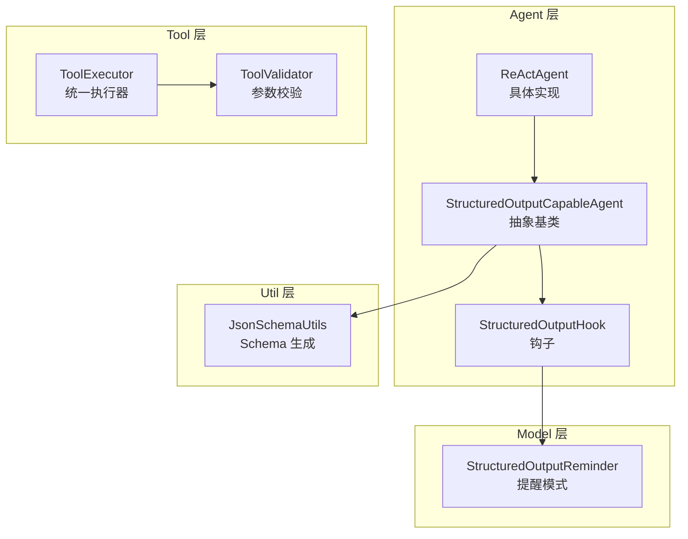
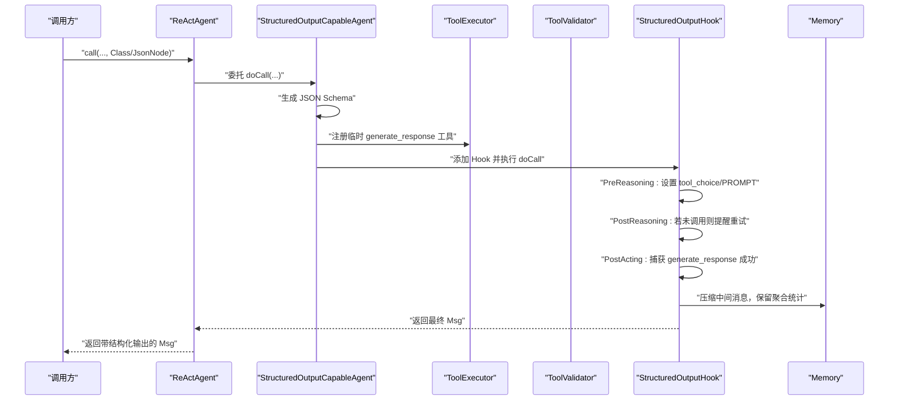
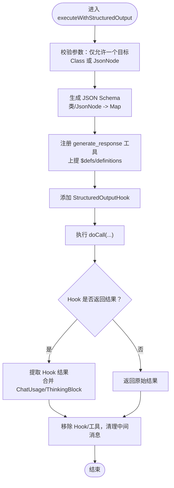
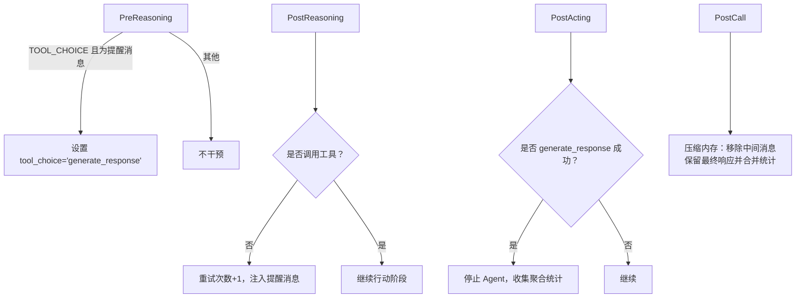
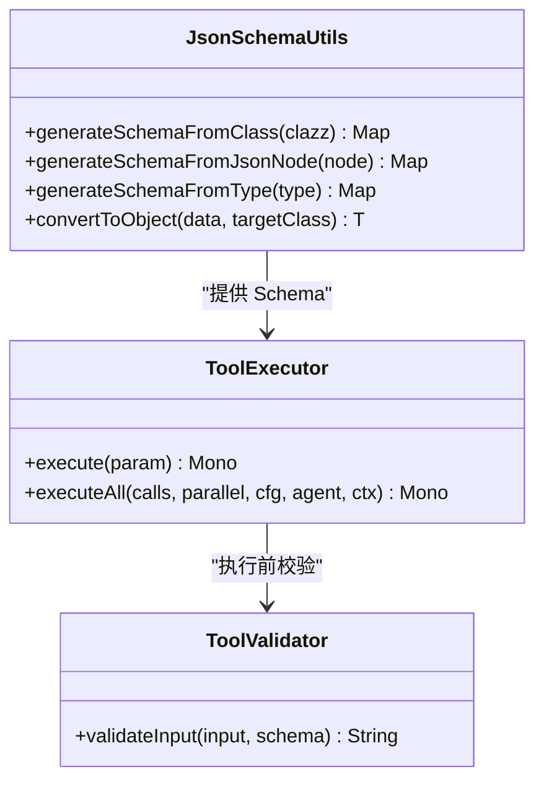
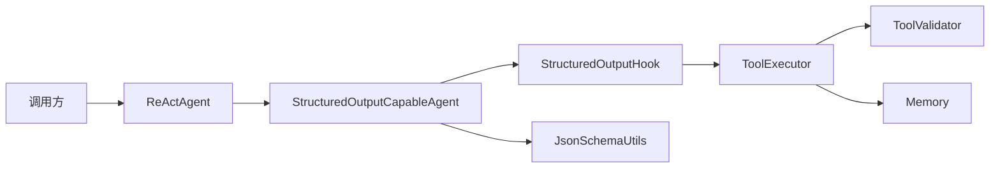

# 结构化输出支持

<cite>
**本文引用的文件列表**
- [StructuredOutputCapableAgent.java](file://agentscope-core/src/main/java/io/agentscope/core/agent/StructuredOutputCapableAgent.java)
- [StructuredOutputHook.java](file://agentscope-core/src/main/java/io/agentscope/core/agent/StructuredOutputHook.java)
- [StructuredOutputReminder.java](file://agentscope-core/src/main/java/io/agentscope/core/model/StructuredOutputReminder.java)
- [JsonSchemaUtils.java](file://agentscope-core/src/main/java/io/agentscope/core/util/JsonSchemaUtils.java)
- [ToolExecutor.java](file://agentscope-core/src/main/java/io/agentscope/core/tool/ToolExecutor.java)
- [ToolValidator.java](file://agentscope-core/src/main/java/io/agentscope/core/tool/ToolValidator.java)
- [ReActAgent.java](file://agentscope-core/src/main/java/io/agentscope/core/ReActAgent.java)
- [ReActAgentStructuredOutputTest.java](file://agentscope-core/src/test/java/io/agentscope/core/agent/ReActAgentStructuredOutputTest.java)
- [StructuredOutputDynamicDefineTest.java](file://agentscope-core/src/test/java/io/agentscope/core/agent/StructuredOutputDynamicDefineTest.java)
- [structured-output.md（英文）](file://docs/en/task/structured-output.md)
- [structured-output.md（中文）](file://docs/zh/task/structured-output.md)
</cite>

## 目录
1. [简介](#简介)
2. [项目结构](#项目结构)
3. [核心组件](#核心组件)
4. [架构总览](#架构总览)
5. [详细组件分析](#详细组件分析)
6. [依赖关系分析](#依赖关系分析)
7. [性能考量](#性能考量)
8. [故障排查指南](#故障排查指南)
9. [结论](#结论)
10. [附录：最佳实践与示例路径](#附录最佳实践与示例路径)

## 简介
本文件系统性阐述 ReAct 智能体的“结构化输出”能力，覆盖以下关键主题：
- 输出模式验证与 JSON Schema 生成
- 类型安全保证与输出格式化
- 结构化输出提醒机制与重试策略
- 输出验证逻辑与错误处理
- 与 StructuredOutputCapableAgent 接口的集成与扩展点
- 使用示例与最佳实践
- 性能优化建议

## 项目结构
围绕结构化输出的关键模块分布如下：
- agent 层：StructuredOutputCapableAgent 抽象类、StructuredOutputHook 钩子、ReActAgent 实现
- model 层：StructuredOutputReminder 枚举，控制提醒策略
- util 层：JsonSchemaUtils 工具，负责从类或 JsonNode 生成 JSON Schema
- tool 层：ToolExecutor 统一执行器，ToolValidator 参数校验
- 测试与文档：单元测试与用户文档

图表来源
- [StructuredOutputCapableAgent.java:65-374](file://agentscope-core/src/main/java/io/agentscope/core/agent/StructuredOutputCapableAgent.java#L65-L374)
- [StructuredOutputHook.java:61-415](file://agentscope-core/src/main/java/io/agentscope/core/agent/StructuredOutputHook.java#L61-L415)
- [StructuredOutputReminder.java:25-51](file://agentscope-core/src/main/java/io/agentscope/core/model/StructuredOutputReminder.java#L25-L51)
- [JsonSchemaUtils.java:58-166](file://agentscope-core/src/main/java/io/agentscope/core/util/JsonSchemaUtils.java#L58-L166)
- [ToolExecutor.java:57-421](file://agentscope-core/src/main/java/io/agentscope/core/tool/ToolExecutor.java#L57-L421)
- [ToolValidator.java:47-200](file://agentscope-core/src/main/java/io/agentscope/core/tool/ToolValidator.java#L47-L200)

章节来源
- [StructuredOutputCapableAgent.java:65-374](file://agentscope-core/src/main/java/io/agentscope/core/agent/StructuredOutputCapableAgent.java#L65-L374)
- [StructuredOutputHook.java:61-415](file://agentscope-core/src/main/java/io/agentscope/core/agent/StructuredOutputHook.java#L61-L415)
- [StructuredOutputReminder.java:25-51](file://agentscope-core/src/main/java/io/agentscope/core/model/StructuredOutputReminder.java#L25-L51)
- [JsonSchemaUtils.java:58-166](file://agentscope-core/src/main/java/io/agentscope/core/util/JsonSchemaUtils.java#L58-L166)
- [ToolExecutor.java:57-421](file://agentscope-core/src/main/java/io/agentscope/core/tool/ToolExecutor.java#L57-L421)
- [ToolValidator.java:47-200](file://agentscope-core/src/main/java/io/agentscope/core/tool/ToolValidator.java#L47-L200)

## 核心组件
- StructuredOutputCapableAgent：面向“可生成结构化输出”的智能体抽象基类，封装了工具注册、Schema 生成、Hook 流控、结果提取与元数据合并等流程。
- StructuredOutputHook：拦截 ReActAgent 的推理/行动阶段，确保模型最终调用 generate_response 工具；在未调用时进行提醒与重试；完成时压缩中间消息并保留聚合统计信息。
- StructuredOutputReminder：提醒策略枚举，支持 TOOL_CHOICE（默认）与 PROMPT 两种模式。
- JsonSchemaUtils：基于 victools/jsonschema-generator 与 Jackson 注解，从 Java 类或 JsonNode 生成 JSON Schema。
- ToolExecutor/ToolValidator：统一工具执行与参数校验，保障结构化输出参数的类型安全与约束满足。

章节来源
- [StructuredOutputCapableAgent.java:65-374](file://agentscope-core/src/main/java/io/agentscope/core/agent/StructuredOutputCapableAgent.java#L65-L374)
- [StructuredOutputHook.java:61-415](file://agentscope-core/src/main/java/io/agentscope/core/agent/StructuredOutputHook.java#L61-L415)
- [StructuredOutputReminder.java:25-51](file://agentscope-core/src/main/java/io/agentscope/core/model/StructuredOutputReminder.java#L25-L51)
- [JsonSchemaUtils.java:58-166](file://agentscope-core/src/main/java/io/agentscope/core/util/JsonSchemaUtils.java#L58-L166)
- [ToolExecutor.java:57-421](file://agentscope-core/src/main/java/io/agentscope/core/tool/ToolExecutor.java#L57-L421)
- [ToolValidator.java:47-200](file://agentscope-core/src/main/java/io/agentscope/core/tool/ToolValidator.java#L47-L200)

## 架构总览
结构化输出的端到端流程如下：

图表来源
- [StructuredOutputCapableAgent.java:126-197](file://agentscope-core/src/main/java/io/agentscope/core/agent/StructuredOutputCapableAgent.java#L126-L197)
- [StructuredOutputHook.java:94-187](file://agentscope-core/src/main/java/io/agentscope/core/agent/StructuredOutputHook.java#L94-L187)
- [ToolExecutor.java:166-264](file://agentscope-core/src/main/java/io/agentscope/core/tool/ToolExecutor.java#L166-L264)
- [ToolValidator.java:77-104](file://agentscope-core/src/main/java/io/agentscope/core/tool/ToolValidator.java#L77-L104)

## 详细组件分析

### StructuredOutputCapableAgent：结构化输出主流程
- 参数校验：禁止同时提供目标类与 JSON Schema 描述，二者必须二选一。
- Schema 生成：根据目标类或 JsonNode 生成 JSON Schema，并将内部 $defs/definitions 上提至参数根级，以支持 $ref 正确解析。
- 工具注册：动态注册 generate_response 工具，其参数 schema 即为上述生成结果。
- Hook 流控：注入 StructuredOutputHook，控制模型是否调用 generate_response；完成后提取结果并合并元数据（如 ChatUsage、ThinkingBlock）。
- 清理与收尾：移除 Hook 与临时工具，清理内存中与结构化输出相关的中间消息。

图表来源
- [StructuredOutputCapableAgent.java:139-197](file://agentscope-core/src/main/java/io/agentscope/core/agent/StructuredOutputCapableAgent.java#L139-L197)

章节来源
- [StructuredOutputCapableAgent.java:126-197](file://agentscope-core/src/main/java/io/agentscope/core/agent/StructuredOutputCapableAgent.java#L126-L197)

### StructuredOutputHook：提醒与重试机制
- PreReasoning：当处于 TOOL_CHOICE 模式且输入消息带有特定提醒元数据时，强制设置 tool_choice 为 generate_response。
- PostReasoning：若模型未调用任何工具，触发最多三次重试，每次注入提醒消息后回到推理阶段。
- PostActing：捕获 generate_response 成功调用，停止后续迭代，收集聚合统计（输入/输出 token、耗时、最后思考块）。
- PostCall：压缩内存，移除与结构化输出相关的中间消息，仅保留最终响应，并合并聚合统计。

图表来源
- [StructuredOutputHook.java:94-187](file://agentscope-core/src/main/java/io/agentscope/core/agent/StructuredOutputHook.java#L94-L187)
- [StructuredOutputHook.java:181-215](file://agentscope-core/src/main/java/io/agentscope/core/agent/StructuredOutputHook.java#L181-L215)

章节来源
- [StructuredOutputHook.java:94-187](file://agentscope-core/src/main/java/io/agentscope/core/agent/StructuredOutputHook.java#L94-L187)
- [StructuredOutputHook.java:181-286](file://agentscope-core/src/main/java/io/agentscope/core/agent/StructuredOutputHook.java#L181-L286)

### StructuredOutputReminder：提醒策略
- TOOL_CHOICE（默认）：通过 tool_choice 参数强制模型调用 generate_response，适合支持 tool_choice 的新模型。
- PROMPT：向对话注入提醒消息，要求模型调用 generate_response，兼容旧模型但可能需要多次往返。

章节来源
- [StructuredOutputReminder.java:25-51](file://agentscope-core/src/main/java/io/agentscope/core/model/StructuredOutputReminder.java#L25-L51)

### JSON Schema 生成与类型安全
- 从类生成：利用 victools/jsonschema-generator 与 Jackson 注解，支持 @JsonProperty、@JsonPropertyDescription、@JsonClassDescription 等，生成符合 Draft 2020-12 的 JSON Schema。
- 从 JsonNode 生成：直接将 JsonNode 转换为 Map，便于动态定义复杂嵌套结构。
- 参数校验：ToolExecutor 在执行前调用 ToolValidator.validateInput，使用 networknt-schema 对输入参数进行严格校验，支持 $ref 解析与空值归一化。

图表来源
- [JsonSchemaUtils.java:58-166](file://agentscope-core/src/main/java/io/agentscope/core/util/JsonSchemaUtils.java#L58-L166)
- [ToolValidator.java:47-200](file://agentscope-core/src/main/java/io/agentscope/core/tool/ToolValidator.java#L47-L200)
- [ToolExecutor.java:57-421](file://agentscope-core/src/main/java/io/agentscope/core/tool/ToolExecutor.java#L57-L421)

章节来源
- [JsonSchemaUtils.java:58-166](file://agentscope-core/src/main/java/io/agentscope/core/util/JsonSchemaUtils.java#L58-L166)
- [ToolValidator.java:47-200](file://agentscope-core/src/main/java/io/agentscope/core/tool/ToolValidator.java#L47-L200)
- [ToolExecutor.java:57-421](file://agentscope-core/src/main/java/io/agentscope/core/tool/ToolExecutor.java#L57-L421)

### 与 ReActAgent 的集成与扩展点
- ReActAgent 继承自 StructuredOutputCapableAgent，复用其结构化输出能力。
- ReActAgent 在推理/行动循环中与 StructuredOutputHook 协作，确保在合适的时机注入提醒、强制工具选择或终止迭代。
- 扩展点：
  - 自定义 GenerateOptions：通过重写 buildGenerateOptions 提供模型调用参数。
  - 自定义 Memory：通过 getMemory 提供持久化与压缩策略。
  - 自定义提醒模式：通过构造函数或 Builder 设置 StructuredOutputReminder。

章节来源
- [ReActAgent.java:140-194](file://agentscope-core/src/main/java/io/agentscope/core/ReActAgent.java#L140-L194)
- [StructuredOutputCapableAgent.java:112-122](file://agentscope-core/src/main/java/io/agentscope/core/agent/StructuredOutputCapableAgent.java#L112-L122)

## 依赖关系分析
- 结构化输出依赖链：调用方 → ReActAgent → StructuredOutputCapableAgent → StructuredOutputHook → ToolExecutor → ToolValidator → Model
- 关键耦合点：
  - StructuredOutputCapableAgent 与 StructuredOutputHook 的事件驱动协作
  - Schema 生成与工具参数校验的衔接
  - 内存压缩与聚合统计的时机控制

图表来源
- [ReActAgent.java:140-194](file://agentscope-core/src/main/java/io/agentscope/core/ReActAgent.java#L140-L194)
- [StructuredOutputCapableAgent.java:126-197](file://agentscope-core/src/main/java/io/agentscope/core/agent/StructuredOutputCapableAgent.java#L126-L197)
- [StructuredOutputHook.java:94-187](file://agentscope-core/src/main/java/io/agentscope/core/agent/StructuredOutputHook.java#L94-L187)
- [JsonSchemaUtils.java:58-166](file://agentscope-core/src/main/java/io/agentscope/core/util/JsonSchemaUtils.java#L58-L166)
- [ToolExecutor.java:57-421](file://agentscope-core/src/main/java/io/agentscope/core/tool/ToolExecutor.java#L57-L421)
- [ToolValidator.java:47-200](file://agentscope-core/src/main/java/io/agentscope/core/tool/ToolValidator.java#L47-L200)

章节来源
- [ReActAgent.java:140-194](file://agentscope-core/src/main/java/io/agentscope/core/ReActAgent.java#L140-L194)
- [StructuredOutputCapableAgent.java:126-197](file://agentscope-core/src/main/java/io/agentscope/core/agent/StructuredOutputCapableAgent.java#L126-L197)
- [StructuredOutputHook.java:94-187](file://agentscope-core/src/main/java/io/agentscope/core/agent/StructuredOutputHook.java#L94-L187)
- [JsonSchemaUtils.java:58-166](file://agentscope-core/src/main/java/io/agentscope/core/util/JsonSchemaUtils.java#L58-L166)
- [ToolExecutor.java:57-421](file://agentscope-core/src/main/java/io/agentscope/core/tool/ToolExecutor.java#L57-L421)
- [ToolValidator.java:47-200](file://agentscope-core/src/main/java/io/agentscope/core/tool/ToolValidator.java#L47-L200)

## 性能考量
- Schema 生成成本：类到 Schema 的生成在首次调用时发生，建议缓存常用 Schema 以减少反射开销。
- Hook 优先级：StructuredOutputHook 优先级较高，避免与其他钩子相互干扰，确保提醒与重试逻辑及时生效。
- 内存压缩：在 PostCall 阶段一次性压缩中间消息，降低内存占用，提升长对话稳定性。
- 工具执行并发：ToolExecutor 支持并行/串行执行与超时重试配置，合理设置可平衡吞吐与稳定性。
- 提醒模式选择：TOOL_CHOICE 减少往返次数，适合新模型；PROMPT 可能增加调用次数，需权衡延迟与兼容性。

[本节为通用指导，无需特定文件来源]

## 故障排查指南
- 参数冲突：同时提供目标类与 JSON Schema 描述会抛出非法参数异常。请二选一。
- Schema 生成失败：检查类注解与字段可见性，确认依赖库版本兼容。
- 未触发 generate_response：确认 StructuredOutputReminder 模式与模型支持情况；必要时切换到 TOOL_CHOICE。
- 参数校验失败：查看 ToolValidator 返回的错误信息，修正输入字段类型、必填项或约束。
- 内存未压缩：检查 StructuredOutputHook 是否正确完成，以及 PostCall 事件是否被触发。

章节来源
- [StructuredOutputCapableAgent.java:142-151](file://agentscope-core/src/main/java/io/agentscope/core/agent/StructuredOutputCapableAgent.java#L142-L151)
- [ToolValidator.java:77-104](file://agentscope-core/src/main/java/io/agentscope/core/tool/ToolValidator.java#L77-L104)
- [StructuredOutputHook.java:181-215](file://agentscope-core/src/main/java/io/agentscope/core/agent/StructuredOutputHook.java#L181-L215)

## 结论
结构化输出通过“Schema 生成 + Hook 流控 + 参数校验 + 内存压缩”的组合，实现了从自然语言到类型化结构化数据的稳定输出。TOOL_CHOICE 模式在新模型上具备更优的性能与一致性，而 PROMPT 模式提供了更好的兼容性。配合合理的 Schema 设计与错误处理策略，可在复杂任务中可靠地产出高质量结构化结果。

[本节为总结，无需特定文件来源]

## 附录：最佳实践与示例路径

### 最佳实践
- 明确输出模式：优先使用 TOOL_CHOICE；若模型不支持 tool_choice，则采用 PROMPT。
- 精准 Schema：使用 @JsonProperty、@JsonPropertyDescription 等注解增强 Schema 的描述性与约束性。
- 复杂嵌套：利用 $defs/$ref 组织复杂结构，确保 $ref 能从文档根解析；框架已自动上提 $defs/definitions。
- 错误处理：在调用侧捕获异常并回退到文本输出或提示修正输入。
- 性能优化：缓存常用 Schema，合理设置重试与超时，避免不必要的往返。

### 示例路径（代码片段路径）
- 类型化结构化输出（工具模式）：[ReActAgentStructuredOutputTest.java:234-246](file://agentscope-core/src/test/java/io/agentscope/core/agent/ReActAgentStructuredOutputTest.java#L234-L246)
- 动态 JSON Schema 结构化输出（流式）：[StructuredOutputDynamicDefineTest.java:162-186](file://agentscope-core/src/test/java/io/agentscope/core/agent/StructuredOutputDynamicDefineTest.java#L162-L186)
- 嵌套结构与 $ref 解析：[StructuredOutputDynamicDefineTest.java:190-249](file://agentscope-core/src/test/java/io/agentscope/core/agent/StructuredOutputDynamicDefineTest.java#L190-L249)
- 用户文档（快速开始与模式说明）：[structured-output.md（英文）:1-87](file://docs/en/task/structured-output.md#L1-L87)，[structured-output.md（中文）:1-87](file://docs/zh/task/structured-output.md#L1-L87)

章节来源
- [ReActAgentStructuredOutputTest.java:234-246](file://agentscope-core/src/test/java/io/agentscope/core/agent/ReActAgentStructuredOutputTest.java#L234-L246)
- [StructuredOutputDynamicDefineTest.java:162-186](file://agentscope-core/src/test/java/io/agentscope/core/agent/StructuredOutputDynamicDefineTest.java#L162-L186)
- [StructuredOutputDynamicDefineTest.java:190-249](file://agentscope-core/src/test/java/io/agentscope/core/agent/StructuredOutputDynamicDefineTest.java#L190-L249)
- [structured-output.md（英文）:1-87](file://docs/en/task/structured-output.md#L1-L87)
- [structured-output.md（中文）:1-87](file://docs/zh/task/structured-output.md#L1-L87)