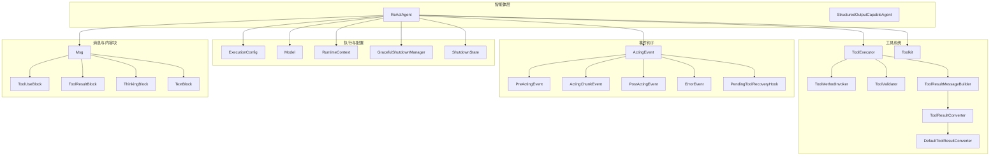
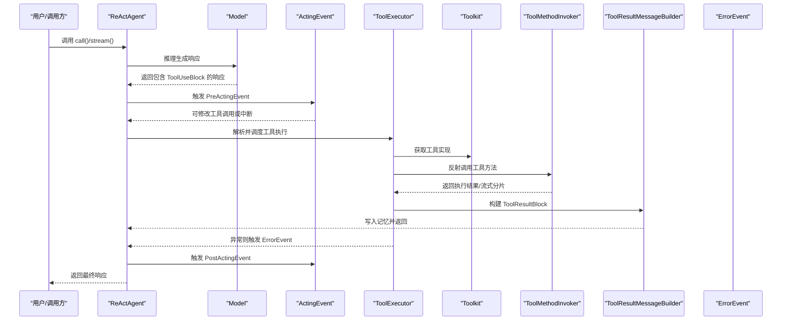
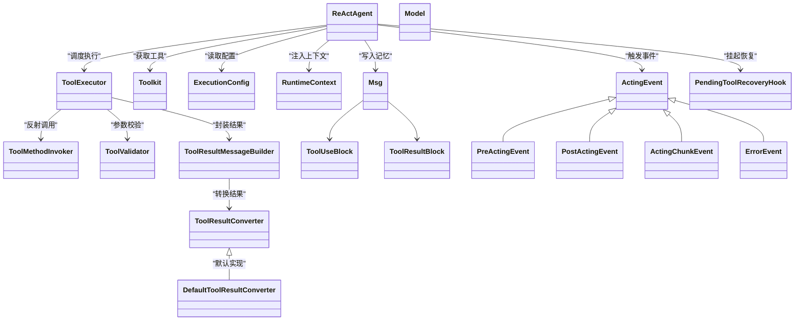
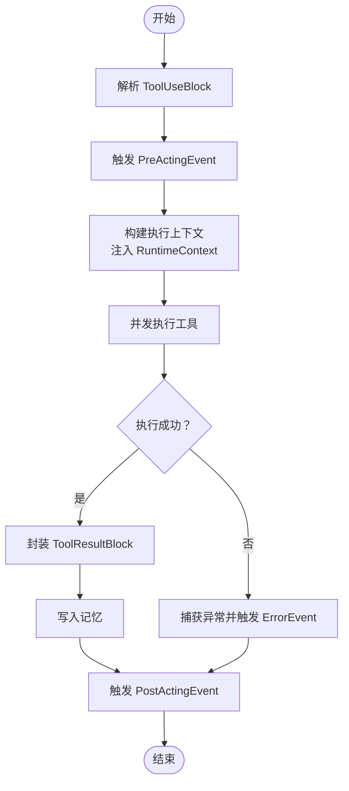

# 行动阶段处理

<cite>
**本文引用的文件**
- [ReActAgent.java](file://agentscope-core/src/main/java/io/agentscope/core/ReActAgent.java)
- [ToolExecutor.java](file://agentscope-core/src/main/java/io/agentscope/core/tool/ToolExecutor.java)
- [Toolkit.java](file://agentscope-core/src/main/java/io/agentscope/core/tool/Toolkit.java)
- [ToolResultMessageBuilder.java](file://agentscope-core/src/main/java/io/agentscope/core/tool/ToolResultMessageBuilder.java)
- [ToolSuspendException.java](file://agentscope-core/src/main/java/io/agentscope/core/tool/ToolSuspendException.java)
- [ActingEvent.java](file://agentscope-core/src/main/java/io/agentscope/core/hook/ActingEvent.java)
- [PreActingEvent.java](file://agentscope-core/src/main/java/io/agentscope/core/hook/PreActingEvent.java)
- [PostActingEvent.java](file://agentscope-core/src/main/java/io/agentscope/core/hook/PostActingEvent.java)
- [ActingChunkEvent.java](file://agentscope-core/src/main/java/io/agentscope/core/hook/ActingChunkEvent.java)
- [ErrorEvent.java](file://agentscope-core/src/main/java/io/agentscope/core/hook/ErrorEvent.java)
- [PendingToolRecoveryHook.java](file://agentscope-core/src/main/java/io/agentscope/core/hook/PendingToolRecoveryHook.java)
- [ToolResultConverter.java](file://agentscope-core/src/main/java/io/agentscope/core/tool/ToolResultConverter.java)
- [DefaultToolResultConverter.java](file://agentscope-core/src/main/java/io/agentscope/core/tool/DefaultToolResultConverter.java)
- [ToolExecutionContext.java](file://agentscope-core/src/main/java/io/agentscope/core/tool/ToolExecutionContext.java)
- [ToolExecutionContextProvider.java](file://agentscope-core/src/main/java/io/agentscope/core/tool/ToolExecutionContextProvider.java)
- [ToolCallParam.java](file://agentscope-core/src/main/java/io/agentscope/core/tool/ToolCallParam.java)
- [ToolParam.java](file://agentscope-core/src/main/java/io/agentscope/core/tool/ToolParam.java)
- [ToolMethodInvoker.java](file://agentscope-core/src/main/java/io/agentscope/core/tool/ToolMethodInvoker.java)
- [ToolValidator.java](file://agentscope-core/src/main/java/io/agentscope/core/tool/ToolValidator.java)
- [ToolSchema.java](file://agentscope-core/src/main/java/io/agentscope/core/model/ToolSchema.java)
- [ExecutionConfig.java](file://agentscope-core/src/main/java/io/agentscope/core/model/ExecutionConfig.java)
- [Model.java](file://agentscope-core/src/main/java/io/agentscope/core/model/Model.java)
- [Msg.java](file://agentscope-core/src/main/java/io/agentscope/core/message/Msg.java)
- [ToolUseBlock.java](file://agentscope-core/src/main/java/io/agentscope/core/message/ToolUseBlock.java)
- [ToolResultBlock.java](file://agentscope-core/src/main/java/io/agentscope/core/message/ToolResultBlock.java)
- [ThinkingBlock.java](file://agentscope-core/src/main/java/io/agentscope/core/message/ThinkingBlock.java)
- [TextBlock.java](file://agentscope-core/src/main/java/io/agentscope/core/message/TextBlock.java)
- [RuntimeContext.java](file://agentscope-core/src/main/java/io/agentscope/core/agent/RuntimeContext.java)
- [StructuredOutputCapableAgent.java](file://agentscope-core/src/main/java/io/agentscope/core/agent/StructuredOutputCapableAgent.java)
- [GracefulShutdownManager.java](file://agentscope-core/src/main/java/io/agentscope/core/shutdown/GracefulShutdownManager.java)
- [ShutdownState.java](file://agentscope-core/src/main/java/io/agentscope/core/shutdown/ShutdownState.java)
- [ReActAgentTest.java](file://agentscope-core/src/test/java/io/agentscope/core/agent/ReActAgentTest.java)
- [ReActAgentTimeoutTest.java](file://agentscope-core/src/test/java/io/agentscope/core/agent/ReActAgentTimeoutTest.java)
- [HookStopAgentTest.java](file://agentscope-core/src/test/java/io/agentscope/core/hook/HookStopAgentTest.java)
- [StreamingBehaviorE2ETest.java](file://agentscope-core/src/test/java/io/agentscope/core/e2e/StreamingBehaviorE2ETest.java)
- [ToolSystemE2ETest.java](file://agentscope-core/src/test/java/io/agentscope/core/e2e/ToolSystemE2ETest.java)
- [MultiAgentE2ETest.java](file://agentscope-core/src/test/java/io/agentscope/core/e2e/MultiAgentE2ETest.java)
</cite>

## 目录
1. [简介](#简介)
2. [项目结构](#项目结构)
3. [核心组件](#核心组件)
4. [架构总览](#架构总览)
5. [详细组件分析](#详细组件分析)
6. [依赖关系分析](#依赖关系分析)
7. [性能考虑](#性能考虑)
8. [故障排查指南](#故障排查指南)
9. [结论](#结论)
10. [附录](#附录)

## 简介
本文件聚焦 ReAct 智能体的“行动阶段（acting）”处理，系统性阐述 acting() 方法的工作机理，包括：
- 工具调用提取与解析
- 工具执行配置与上下文构建
- 成功结果与挂起结果的处理路径
- 失败错误的捕获、恢复与结果生成
- 并发执行、超时管理与资源清理策略
- 事件钩子在行动阶段的触发与影响

目标是帮助读者从代码级理解 ReActAgent 在行动阶段如何从模型输出中识别工具调用、如何调度执行、如何回写记忆并推进对话。

## 项目结构
ReActAgent 的行动阶段位于 agentscope-core 模块内，核心类与相关工具/消息类型如下：
- 核心智能体：ReActAgent
- 工具执行：ToolExecutor、Toolkit、ToolMethodInvoker、ToolValidator
- 结果构建：ToolResultMessageBuilder、ToolResultConverter、DefaultToolResultConverter
- 事件钩子：PreActingEvent、ActingEvent、ActingChunkEvent、PostActingEvent、ErrorEvent、PendingToolRecoveryHook
- 执行配置：ExecutionConfig、Model
- 消息与内容块：Msg、ToolUseBlock、ToolResultBlock、ThinkingBlock、TextBlock
- 结构化输出：StructuredOutputCapableAgent
- 关停与超时：GracefulShutdownManager、ShutdownState、ReActAgentTimeoutTest

图表来源
- [ReActAgent.java](file://agentscope-core/src/main/java/io/agentscope/core/ReActAgent.java)
- [ToolExecutor.java](file://agentscope-core/src/main/java/io/agentscope/core/tool/ToolExecutor.java)
- [Toolkit.java](file://agentscope-core/src/main/java/io/agentscope/core/tool/Toolkit.java)
- [ToolResultMessageBuilder.java](file://agentscope-core/src/main/java/io/agentscope/core/tool/ToolResultMessageBuilder.java)
- [ToolResultConverter.java](file://agentscope-core/src/main/java/io/agentscope/core/tool/ToolResultConverter.java)
- [DefaultToolResultConverter.java](file://agentscope-core/src/main/java/io/agentscope/core/tool/DefaultToolResultConverter.java)
- [ToolMethodInvoker.java](file://agentscope-core/src/main/java/io/agentscope/core/tool/ToolMethodInvoker.java)
- [ToolValidator.java](file://agentscope-core/src/main/java/io/agentscope/core/tool/ToolValidator.java)
- [ActingEvent.java](file://agentscope-core/src/main/java/io/agentscope/core/hook/ActingEvent.java)
- [PreActingEvent.java](file://agentscope-core/src/main/java/io/agentscope/core/hook/PreActingEvent.java)
- [PostActingEvent.java](file://agentscope-core/src/main/java/io/agentscope/core/hook/PostActingEvent.java)
- [ActingChunkEvent.java](file://agentscope-core/src/main/java/io/agentscope/core/hook/ActingChunkEvent.java)
- [ErrorEvent.java](file://agentscope-core/src/main/java/io/agentscope/core/hook/ErrorEvent.java)
- [PendingToolRecoveryHook.java](file://agentscope-core/src/main/java/io/agentscope/core/hook/PendingToolRecoveryHook.java)
- [ExecutionConfig.java](file://agentscope-core/src/main/java/io/agentscope/core/model/ExecutionConfig.java)
- [Model.java](file://agentscope-core/src/main/java/io/agentscope/core/model/Model.java)
- [Msg.java](file://agentscope-core/src/main/java/io/agentscope/core/message/Msg.java)
- [ToolUseBlock.java](file://agentscope-core/src/main/java/io/agentscope/core/message/ToolUseBlock.java)
- [ToolResultBlock.java](file://agentscope-core/src/main/java/io/agentscope/core/message/ToolResultBlock.java)
- [ThinkingBlock.java](file://agentscope-core/src/main/java/io/agentscope/core/message/ThinkingBlock.java)
- [TextBlock.java](file://agentscope-core/src/main/java/io/agentscope/core/message/TextBlock.java)
- [RuntimeContext.java](file://agentscope-core/src/main/java/io/agentscope/core/agent/RuntimeContext.java)
- [StructuredOutputCapableAgent.java](file://agentscope-core/src/main/java/io/agentscope/core/agent/StructuredOutputCapableAgent.java)
- [GracefulShutdownManager.java](file://agentscope-core/src/main/java/io/agentscope/core/shutdown/GracefulShutdownManager.java)
- [ShutdownState.java](file://agentscope-core/src/main/java/io/agentscope/core/shutdown/ShutdownState.java)

章节来源
- [ReActAgent.java](file://agentscope-core/src/main/java/io/agentscope/core/ReActAgent.java)
- [ToolExecutor.java](file://agentscope-core/src/main/java/io/agentscope/core/tool/ToolExecutor.java)
- [Toolkit.java](file://agentscope-core/src/main/java/io/agentscope/core/tool/Toolkit.java)
- [ToolResultMessageBuilder.java](file://agentscope-core/src/main/java/io/agentscope/core/tool/ToolResultMessageBuilder.java)
- [ToolResultConverter.java](file://agentscope-core/src/main/java/io/agentscope/core/tool/ToolResultConverter.java)
- [DefaultToolResultConverter.java](file://agentscope-core/src/main/java/io/agentscope/core/tool/DefaultToolResultConverter.java)
- [ToolMethodInvoker.java](file://agentscope-core/src/main/java/io/agentscope/core/tool/ToolMethodInvoker.java)
- [ToolValidator.java](file://agentscope-core/src/main/java/io/agentscope/core/tool/ToolValidator.java)
- [ActingEvent.java](file://agentscope-core/src/main/java/io/agentscope/core/hook/ActingEvent.java)
- [PreActingEvent.java](file://agentscope-core/src/main/java/io/agentscope/core/hook/PreActingEvent.java)
- [PostActingEvent.java](file://agentscope-core/src/main/java/io/agentscope/core/hook/PostActingEvent.java)
- [ActingChunkEvent.java](file://agentscope-core/src/main/java/io/agentscope/core/hook/ActingChunkEvent.java)
- [ErrorEvent.java](file://agentscope-core/src/main/java/io/agentscope/core/hook/ErrorEvent.java)
- [PendingToolRecoveryHook.java](file://agentscope-core/src/main/java/io/agentscope/core/hook/PendingToolRecoveryHook.java)
- [ExecutionConfig.java](file://agentscope-core/src/main/java/io/agentscope/core/model/ExecutionConfig.java)
- [Model.java](file://agentscope-core/src/main/java/io/agentscope/core/model/Model.java)
- [Msg.java](file://agentscope-core/src/main/java/io/agentscope/core/message/Msg.java)
- [ToolUseBlock.java](file://agentscope-core/src/main/java/io/agentscope/core/message/ToolUseBlock.java)
- [ToolResultBlock.java](file://agentscope-core/src/main/java/io/agentscope/core/message/ToolResultBlock.java)
- [ThinkingBlock.java](file://agentscope-core/src/main/java/io/agentscope/core/message/ThinkingBlock.java)
- [TextBlock.java](file://agentscope-core/src/main/java/io/agentscope/core/message/TextBlock.java)
- [RuntimeContext.java](file://agentscope-core/src/main/java/io/agentscope/core/agent/RuntimeContext.java)
- [StructuredOutputCapableAgent.java](file://agentscope-core/src/main/java/io/agentscope/core/agent/StructuredOutputCapableAgent.java)
- [GracefulShutdownManager.java](file://agentscope-core/src/main/java/io/agentscope/core/shutdown/GracefulShutdownManager.java)
- [ShutdownState.java](file://agentscope-core/src/main/java/io/agentscope/core/shutdown/ShutdownState.java)

## 核心组件
- ReActAgent：负责推理与行动的主控，acting() 是行动阶段的核心入口，协调工具提取、执行、结果回写与事件通知。
- ToolExecutor：封装工具执行的统一入口，负责参数解析、上下文注入、并发控制与异常处理。
- Toolkit：工具注册与分组管理，支持按组激活/禁用工具集合。
- ToolMethodInvoker：反射式调用工具方法，支持参数校验与类型转换。
- ToolValidator：对工具输入进行校验，确保参数符合工具签名。
- ToolResultMessageBuilder：将工具执行结果封装为消息块，便于写入记忆。
- ToolResultConverter/DefaultToolResultConverter：将工具返回值转换为标准格式，支持自定义转换器。
- 事件钩子：PreActingEvent、ActingEvent、ActingChunkEvent、PostActingEvent、ErrorEvent、PendingToolRecoveryHook，贯穿行动阶段的生命周期。
- ExecutionConfig/Model：提供执行配置与模型交互能力，支持超时、并发与流式输出。
- Msg/ToolUseBlock/ToolResultBlock/ThinkingBlock/TextBlock：消息与内容块模型，承载工具调用与结果。
- RuntimeContext：运行时上下文，用于跨阶段传递信息。
- StructuredOutputCapableAgent：结构化输出能力基类，支持将最终结果以结构化数据形式返回。
- GracefulShutdownManager/ShutdownState：优雅关停与状态管理，保障在关停期间的资源清理与中断处理。

章节来源
- [ReActAgent.java](file://agentscope-core/src/main/java/io/agentscope/core/ReActAgent.java)
- [ToolExecutor.java](file://agentscope-core/src/main/java/io/agentscope/core/tool/ToolExecutor.java)
- [Toolkit.java](file://agentscope-core/src/main/java/io/agentscope/core/tool/Toolkit.java)
- [ToolResultMessageBuilder.java](file://agentscope-core/src/main/java/io/agentscope/core/tool/ToolResultMessageBuilder.java)
- [ToolResultConverter.java](file://agentscope-core/src/main/java/io/agentscope/core/tool/ToolResultConverter.java)
- [DefaultToolResultConverter.java](file://agentscope-core/src/main/java/io/agentscope/core/tool/DefaultToolResultConverter.java)
- [ToolMethodInvoker.java](file://agentscope-core/src/main/java/io/agentscope/core/tool/ToolMethodInvoker.java)
- [ToolValidator.java](file://agentscope-core/src/main/java/io/agentscope/core/tool/ToolValidator.java)
- [ActingEvent.java](file://agentscope-core/src/main/java/io/agentscope/core/hook/ActingEvent.java)
- [PreActingEvent.java](file://agentscope-core/src/main/java/io/agentscope/core/hook/PreActingEvent.java)
- [PostActingEvent.java](file://agentscope-core/src/main/java/io/agentscope/core/hook/PostActingEvent.java)
- [ActingChunkEvent.java](file://agentscope-core/src/main/java/io/agentscope/core/hook/ActingChunkEvent.java)
- [ErrorEvent.java](file://agentscope-core/src/main/java/io/agentscope/core/hook/ErrorEvent.java)
- [PendingToolRecoveryHook.java](file://agentscope-core/src/main/java/io/agentscope/core/hook/PendingToolRecoveryHook.java)
- [ExecutionConfig.java](file://agentscope-core/src/main/java/io/agentscope/core/model/ExecutionConfig.java)
- [Model.java](file://agentscope-core/src/main/java/io/agentscope/core/model/Model.java)
- [Msg.java](file://agentscope-core/src/main/java/io/agentscope/core/message/Msg.java)
- [ToolUseBlock.java](file://agentscope-core/src/main/java/io/agentscope/core/message/ToolUseBlock.java)
- [ToolResultBlock.java](file://agentscope-core/src/main/java/io/agentscope/core/message/ToolResultBlock.java)
- [ThinkingBlock.java](file://agentscope-core/src/main/java/io/agentscope/core/message/ThinkingBlock.java)
- [TextBlock.java](file://agentscope-core/src/main/java/io/agentscope/core/message/TextBlock.java)
- [RuntimeContext.java](file://agentscope-core/src/main/java/io/agentscope/core/agent/RuntimeContext.java)
- [StructuredOutputCapableAgent.java](file://agentscope-core/src/main/java/io/agentscope/core/agent/StructuredOutputCapableAgent.java)
- [GracefulShutdownManager.java](file://agentscope-core/src/main/java/io/agentscope/core/shutdown/GracefulShutdownManager.java)
- [ShutdownState.java](file://agentscope-core/src/main/java/io/agentscope/core/shutdown/ShutdownState.java)

## 架构总览
行动阶段的总体流程：
- 智能体接收模型响应，解析其中的工具调用块（ToolUseBlock）
- 触发 PreActingEvent 钩子，允许外部修改或拦截工具调用
- 构建工具执行上下文（含 RuntimeContext、ExecutionConfig），并发调度工具执行
- 对每个工具调用：
  - 参数校验与类型转换
  - 执行工具方法，支持流式分片（ActingChunkEvent）
  - 捕获异常并生成错误事件（ErrorEvent）
  - 将结果转换为标准格式并封装为 ToolResultBlock 写入记忆
- 若工具返回挂起（ToolSuspendException），则标记为挂起并等待后续恢复
- 完成后触发 PostActingEvent 钩子，进入下一轮推理或结束

图表来源
- [ReActAgent.java](file://agentscope-core/src/main/java/io/agentscope/core/ReActAgent.java)
- [ActingEvent.java](file://agentscope-core/src/main/java/io/agentscope/core/hook/ActingEvent.java)
- [ToolExecutor.java](file://agentscope-core/src/main/java/io/agentscope/core/tool/ToolExecutor.java)
- [Toolkit.java](file://agentscope-core/src/main/java/io/agentscope/core/tool/Toolkit.java)
- [ToolMethodInvoker.java](file://agentscope-core/src/main/java/io/agentscope/core/tool/ToolMethodInvoker.java)
- [ToolResultMessageBuilder.java](file://agentscope-core/src/main/java/io/agentscope/core/tool/ToolResultMessageBuilder.java)
- [ErrorEvent.java](file://agentscope-core/src/main/java/io/agentscope/core/hook/ErrorEvent.java)

## 详细组件分析

### acting() 方法工作原理
acting() 是 ReActAgent 的行动阶段核心，主要职责：
- 从最近一次模型响应中提取 ToolUseBlock 列表
- 触发 PreActingEvent 钩子，允许外部干预工具调用
- 基于 ExecutionConfig 和 RuntimeContext 构建工具执行上下文
- 并发执行多个工具调用，收集结果或挂起状态
- 将成功结果封装为 ToolResultBlock 写入记忆
- 处理挂起（ToolSuspendException）与恢复（PendingToolRecoveryHook）
- 触发 ActingChunkEvent（流式）与 PostActingEvent
- 错误时生成 ErrorEvent 并记录到内存

关键流程要点：
- 工具调用提取：从 Assistant 消息的内容块中识别 ToolUseBlock
- 工具执行配置：合并模型 ExecutionConfig 与生成选项，设置超时、并发策略
- 上下文注入：将 RuntimeContext 注入工具执行上下文
- 并发策略：支持多工具并发执行，聚合结果
- 流式输出：通过 ActingChunkEvent 分段推送中间结果
- 挂起处理：遇到 ToolSuspendException 时记录挂起并等待恢复
- 错误处理：捕获异常，构造错误事件并写入记忆

章节来源
- [ReActAgent.java](file://agentscope-core/src/main/java/io/agentscope/core/ReActAgent.java)
- [ActingEvent.java](file://agentscope-core/src/main/java/io/agentscope/core/hook/ActingEvent.java)
- [PreActingEvent.java](file://agentscope-core/src/main/java/io/agentscope/core/hook/PreActingEvent.java)
- [PostActingEvent.java](file://agentscope-core/src/main/java/io/agentscope/core/hook/PostActingEvent.java)
- [ActingChunkEvent.java](file://agentscope-core/src/main/java/io/agentscope/core/hook/ActingChunkEvent.java)
- [ErrorEvent.java](file://agentscope-core/src/main/java/io/agentscope/core/hook/ErrorEvent.java)
- [ToolSuspendException.java](file://agentscope-core/src/main/java/io/agentscope/core/tool/ToolSuspendException.java)
- [ToolResultMessageBuilder.java](file://agentscope-core/src/main/java/io/agentscope/core/tool/ToolResultMessageBuilder.java)
- [ExecutionConfig.java](file://agentscope-core/src/main/java/io/agentscope/core/model/ExecutionConfig.java)
- [RuntimeContext.java](file://agentscope-core/src/main/java/io/agentscope/core/agent/RuntimeContext.java)

### 工具调用提取与识别
- 输入：模型响应中的 Msg，包含 ToolUseBlock
- 提取逻辑：遍历消息内容块，识别 ToolUseBlock，解析工具名与参数
- 多工具顺序：按出现顺序依次处理，支持串行或并发（取决于执行配置）

章节来源
- [ReActAgent.java](file://agentscope-core/src/main/java/io/agentscope/core/ReActAgent.java)
- [ToolUseBlock.java](file://agentscope-core/src/main/java/io/agentscope/core/message/ToolUseBlock.java)
- [Msg.java](file://agentscope-core/src/main/java/io/agentscope/core/message/Msg.java)

### 工具执行配置与上下文
- ExecutionConfig：控制超时、并发线程数、重试等
- RuntimeContext：跨轮次传递上下文信息（如会话ID、用户ID等）
- ToolExecutionContext/Provider：将 RuntimeContext 注入工具执行上下文
- ToolValidator：对参数进行校验，确保类型匹配与必填项满足
- ToolMethodInvoker：通过反射调用工具方法，支持异步/流式

章节来源
- [ExecutionConfig.java](file://agentscope-core/src/main/java/io/agentscope/core/model/ExecutionConfig.java)
- [RuntimeContext.java](file://agentscope-core/src/main/java/io/agentscope/core/agent/RuntimeContext.java)
- [ToolExecutionContext.java](file://agentscope-core/src/main/java/io/agentscope/core/tool/ToolExecutionContext.java)
- [ToolExecutionContextProvider.java](file://agentscope-core/src/main/java/io/agentscope/core/tool/ToolExecutionContextProvider.java)
- [ToolValidator.java](file://agentscope-core/src/main/java/io/agentscope/core/tool/ToolValidator.java)
- [ToolMethodInvoker.java](file://agentscope-core/src/main/java/io/agentscope/core/tool/ToolMethodInvoker.java)

### 成功结果与挂起结果处理
- 成功结果：ToolResultMessageBuilder 将工具返回值转换为 ToolResultBlock，并写入记忆
- 挂起结果：抛出 ToolSuspendException，标记为挂起；通过 PendingToolRecoveryHook 恢复
- 恢复逻辑：从记忆中定位最后的 Assistant 消息，补全缺失的 ToolUseBlock 信息，继续执行

章节来源
- [ToolResultMessageBuilder.java](file://agentscope-core/src/main/java/io/agentscope/core/tool/ToolResultMessageBuilder.java)
- [ToolResultBlock.java](file://agentscope-core/src/main/java/io/agentscope/core/message/ToolResultBlock.java)
- [ToolSuspendException.java](file://agentscope-core/src/main/java/io/agentscope/core/tool/ToolSuspendException.java)
- [PendingToolRecoveryHook.java](file://agentscope-core/src/main/java/io/agentscope/core/hook/PendingToolRecoveryHook.java)

### 错误处理与错误结果生成
- 异常捕获：工具执行过程中抛出的异常被捕获，触发 ErrorEvent
- 错误事件：记录错误原因、工具名、参数等信息，写入记忆
- 结构化输出：若启用结构化输出，错误也会被纳入最终响应结构

章节来源
- [ErrorEvent.java](file://agentscope-core/src/main/java/io/agentscope/core/hook/ErrorEvent.java)
- [StructuredOutputCapableAgent.java](file://agentscope-core/src/main/java/io/agentscope/core/agent/StructuredOutputCapableAgent.java)

### 并发处理、超时管理与资源清理
- 并发策略：基于 ExecutionConfig 的并发配置，支持多工具并行执行
- 超时管理：工具执行超时由 ExecutionConfig 控制；ReActAgentTimeoutTest 展示了超时行为
- 资源清理：GracefulShutdownManager/ShutdownState 在关停时清理请求上下文与资源

章节来源
- [ExecutionConfig.java](file://agentscope-core/src/main/java/io/agentscope/core/model/ExecutionConfig.java)
- [ReActAgentTimeoutTest.java](file://agentscope-core/src/test/java/io/agentscope/core/agent/ReActAgentTimeoutTest.java)
- [GracefulShutdownManager.java](file://agentscope-core/src/main/java/io/agentscope/core/shutdown/GracefulShutdownManager.java)
- [ShutdownState.java](file://agentscope-core/src/main/java/io/agentscope/core/shutdown/ShutdownState.java)

### 行动阶段事件与钩子
- PreActingEvent：可在行动前修改工具调用参数或中断
- ActingEvent：统一的行动事件入口，包含工具调用详情
- ActingChunkEvent：流式分片事件，支持增量结果推送
- PostActingEvent：行动完成后触发，可进行后处理
- PendingToolRecoveryHook：自动恢复挂起的工具调用

章节来源
- [PreActingEvent.java](file://agentscope-core/src/main/java/io/agentscope/core/hook/PreActingEvent.java)
- [ActingEvent.java](file://agentscope-core/src/main/java/io/agentscope/core/hook/ActingEvent.java)
- [ActingChunkEvent.java](file://agentscope-core/src/main/java/io/agentscope/core/hook/ActingChunkEvent.java)
- [PostActingEvent.java](file://agentscope-core/src/main/java/io/agentscope/core/hook/PostActingEvent.java)
- [PendingToolRecoveryHook.java](file://agentscope-core/src/main/java/io/agentscope/core/hook/PendingToolRecoveryHook.java)

### 具体代码示例路径
以下为行动阶段关键流程的代码片段路径（仅列出路径，不直接展示代码内容）：
- 工具调用提取与执行入口：[ReActAgent.java](file://agentscope-core/src/main/java/io/agentscope/core/ReActAgent.java)
- 工具执行器与上下文构建：[ToolExecutor.java](file://agentscope-core/src/main/java/io/agentscope/core/tool/ToolExecutor.java)、[ToolExecutionContext.java](file://agentscope-core/src/main/java/io/agentscope/core/tool/ToolExecutionContext.java)
- 参数校验与反射调用：[ToolValidator.java](file://agentscope-core/src/main/java/io/agentscope/core/tool/ToolValidator.java)、[ToolMethodInvoker.java](file://agentscope-core/src/main/java/io/agentscope/core/tool/ToolMethodInvoker.java)
- 结果封装与写入记忆：[ToolResultMessageBuilder.java](file://agentscope-core/src/main/java/io/agentscope/core/tool/ToolResultMessageBuilder.java)
- 流式事件与错误事件：[ActingChunkEvent.java](file://agentscope-core/src/main/java/io/agentscope/core/hook/ActingChunkEvent.java)、[ErrorEvent.java](file://agentscope-core/src/main/java/io/agentscope/core/hook/ErrorEvent.java)
- 挂起恢复逻辑：[PendingToolRecoveryHook.java](file://agentscope-core/src/main/java/io/agentscope/core/hook/PendingToolRecoveryHook.java)
- 超时与关停处理：[ReActAgentTimeoutTest.java](file://agentscope-core/src/test/java/io/agentscope/core/agent/ReActAgentTimeoutTest.java)、[GracefulShutdownManager.java](file://agentscope-core/src/main/java/io/agentscope/core/shutdown/GracefulShutdownManager.java)

章节来源
- [ReActAgent.java](file://agentscope-core/src/main/java/io/agentscope/core/ReActAgent.java)
- [ToolExecutor.java](file://agentscope-core/src/main/java/io/agentscope/core/tool/ToolExecutor.java)
- [ToolExecutionContext.java](file://agentscope-core/src/main/java/io/agentscope/core/tool/ToolExecutionContext.java)
- [ToolValidator.java](file://agentscope-core/src/main/java/io/agentscope/core/tool/ToolValidator.java)
- [ToolMethodInvoker.java](file://agentscope-core/src/main/java/io/agentscope/core/tool/ToolMethodInvoker.java)
- [ToolResultMessageBuilder.java](file://agentscope-core/src/main/java/io/agentscope/core/tool/ToolResultMessageBuilder.java)
- [ActingChunkEvent.java](file://agentscope-core/src/main/java/io/agentscope/core/hook/ActingChunkEvent.java)
- [ErrorEvent.java](file://agentscope-core/src/main/java/io/agentscope/core/hook/ErrorEvent.java)
- [PendingToolRecoveryHook.java](file://agentscope-core/src/main/java/io/agentscope/core/hook/PendingToolRecoveryHook.java)
- [ReActAgentTimeoutTest.java](file://agentscope-core/src/test/java/io/agentscope/core/agent/ReActAgentTimeoutTest.java)
- [GracefulShutdownManager.java](file://agentscope-core/src/main/java/io/agentscope/core/shutdown/GracefulShutdownManager.java)

## 依赖关系分析
- ReActAgent 依赖 ToolExecutor 进行工具执行，依赖 Toolkit 管理工具集合
- ToolExecutor 依赖 ToolMethodInvoker、ToolValidator、ToolResultMessageBuilder
- 事件钩子通过 ActingEvent 统一接入，PreActingEvent/PostActingEvent/ActingChunkEvent/ErrorEvent/PendingToolRecoveryHook 分别在不同阶段触发
- ExecutionConfig 与 Model 影响工具执行的超时与并发策略
- RuntimeContext 作为上下文载体贯穿工具执行链路

图表来源
- [ReActAgent.java](file://agentscope-core/src/main/java/io/agentscope/core/ReActAgent.java)
- [ToolExecutor.java](file://agentscope-core/src/main/java/io/agentscope/core/tool/ToolExecutor.java)
- [Toolkit.java](file://agentscope-core/src/main/java/io/agentscope/core/tool/Toolkit.java)
- [ToolMethodInvoker.java](file://agentscope-core/src/main/java/io/agentscope/core/tool/ToolMethodInvoker.java)
- [ToolValidator.java](file://agentscope-core/src/main/java/io/agentscope/core/tool/ToolValidator.java)
- [ToolResultMessageBuilder.java](file://agentscope-core/src/main/java/io/agentscope/core/tool/ToolResultMessageBuilder.java)
- [ToolResultConverter.java](file://agentscope-core/src/main/java/io/agentscope/core/tool/ToolResultConverter.java)
- [DefaultToolResultConverter.java](file://agentscope-core/src/main/java/io/agentscope/core/tool/DefaultToolResultConverter.java)
- [ExecutionConfig.java](file://agentscope-core/src/main/java/io/agentscope/core/model/ExecutionConfig.java)
- [Model.java](file://agentscope-core/src/main/java/io/agentscope/core/model/Model.java)
- [RuntimeContext.java](file://agentscope-core/src/main/java/io/agentscope/core/agent/RuntimeContext.java)
- [Msg.java](file://agentscope-core/src/main/java/io/agentscope/core/message/Msg.java)
- [ToolUseBlock.java](file://agentscope-core/src/main/java/io/agentscope/core/message/ToolUseBlock.java)
- [ToolResultBlock.java](file://agentscope-core/src/main/java/io/agentscope/core/message/ToolResultBlock.java)
- [ActingEvent.java](file://agentscope-core/src/main/java/io/agentscope/core/hook/ActingEvent.java)
- [PreActingEvent.java](file://agentscope-core/src/main/java/io/agentscope/core/hook/PreActingEvent.java)
- [PostActingEvent.java](file://agentscope-core/src/main/java/io/agentscope/core/hook/PostActingEvent.java)
- [ActingChunkEvent.java](file://agentscope-core/src/main/java/io/agentscope/core/hook/ActingChunkEvent.java)
- [ErrorEvent.java](file://agentscope-core/src/main/java/io/agentscope/core/hook/ErrorEvent.java)
- [PendingToolRecoveryHook.java](file://agentscope-core/src/main/java/io/agentscope/core/hook/PendingToolRecoveryHook.java)

## 性能考虑
- 并发执行：合理设置 ExecutionConfig 的并发度，避免过度并发导致资源争用
- 超时控制：为工具执行设置合适的超时时间，防止长时间阻塞
- 流式输出：使用 ActingChunkEvent 实现增量结果推送，降低端到端延迟
- 记忆写入：批量写入 ToolResultBlock，减少频繁 I/O
- 上下文最小化：RuntimeContext 中仅保留必要字段，避免冗余序列化

## 故障排查指南
常见问题与定位建议：
- 工具未被调用
  - 检查模型是否正确返回 ToolUseBlock
  - 确认 PreActingEvent 是否拦截了工具调用
  - 参考测试用例：[ReActAgentTest.java](file://agentscope-core/src/test/java/io/agentscope/core/agent/ReActAgentTest.java)
- 工具执行超时
  - 调整 ExecutionConfig 的超时设置
  - 参考测试用例：[ReActAgentTimeoutTest.java](file://agentscope-core/src/test/java/io/agentscope/core/agent/ReActAgentTimeoutTest.java)
- 工具返回挂起
  - 使用 PendingToolRecoveryHook 自动恢复
  - 参考钩子实现：[PendingToolRecoveryHook.java](file://agentscope-core/src/main/java/io/agentscope/core/hook/PendingToolRecoveryHook.java)
- 工具执行报错
  - 查看 ErrorEvent 记录的错误详情
  - 参考事件实现：[ErrorEvent.java](file://agentscope-core/src/main/java/io/agentscope/core/hook/ErrorEvent.java)
- 多工具并发冲突
  - 检查并发配置与资源限制
  - 参考工具系统测试：[ToolSystemE2ETest.java](file://agentscope-core/src/test/java/io/agentscope/core/e2e/ToolSystemE2ETest.java)
- 多智能体协作异常
  - 检查 MsgHub 广播与消息传播
  - 参考多智能体测试：[MultiAgentE2ETest.java](file://agentscope-core/src/test/java/io/agentscope/core/e2e/MultiAgentE2ETest.java)

章节来源
- [ReActAgentTest.java](file://agentscope-core/src/test/java/io/agentscope/core/agent/ReActAgentTest.java)
- [ReActAgentTimeoutTest.java](file://agentscope-core/src/test/java/io/agentscope/core/agent/ReActAgentTimeoutTest.java)
- [PendingToolRecoveryHook.java](file://agentscope-core/src/main/java/io/agentscope/core/hook/PendingToolRecoveryHook.java)
- [ErrorEvent.java](file://agentscope-core/src/main/java/io/agentscope/core/hook/ErrorEvent.java)
- [ToolSystemE2ETest.java](file://agentscope-core/src/test/java/io/agentscope/core/e2e/ToolSystemE2ETest.java)
- [MultiAgentE2ETest.java](file://agentscope-core/src/test/java/io/agentscope/core/e2e/MultiAgentE2ETest.java)

## 结论
ReActAgent 的行动阶段通过统一的工具执行框架与事件钩子体系，实现了从工具调用提取、并发执行、结果封装到错误处理与挂起恢复的完整闭环。借助 ExecutionConfig、RuntimeContext 与流式事件，系统在保证可靠性的同时兼顾性能与可观测性。实际部署中应结合业务场景合理配置并发与超时，并通过钩子扩展定制化行为。

## 附录
- 流程图：行动阶段算法流程
  - 输入：模型响应（包含 ToolUseBlock）
  - 步骤：提取工具调用 → 触发 PreActingEvent → 构建执行上下文 → 并发执行 → 结果封装 → 写入记忆 → 触发 PostActingEvent
  - 异常：捕获异常 → 触发 ErrorEvent → 记录错误
  - 挂起：抛出 ToolSuspendException → 待恢复 → 继续执行

图表来源
- [ReActAgent.java](file://agentscope-core/src/main/java/io/agentscope/core/ReActAgent.java)
- [PreActingEvent.java](file://agentscope-core/src/main/java/io/agentscope/core/hook/PreActingEvent.java)
- [PostActingEvent.java](file://agentscope-core/src/main/java/io/agentscope/core/hook/PostActingEvent.java)
- [ErrorEvent.java](file://agentscope-core/src/main/java/io/agentscope/core/hook/ErrorEvent.java)
- [ToolResultMessageBuilder.java](file://agentscope-core/src/main/java/io/agentscope/core/tool/ToolResultMessageBuilder.java)