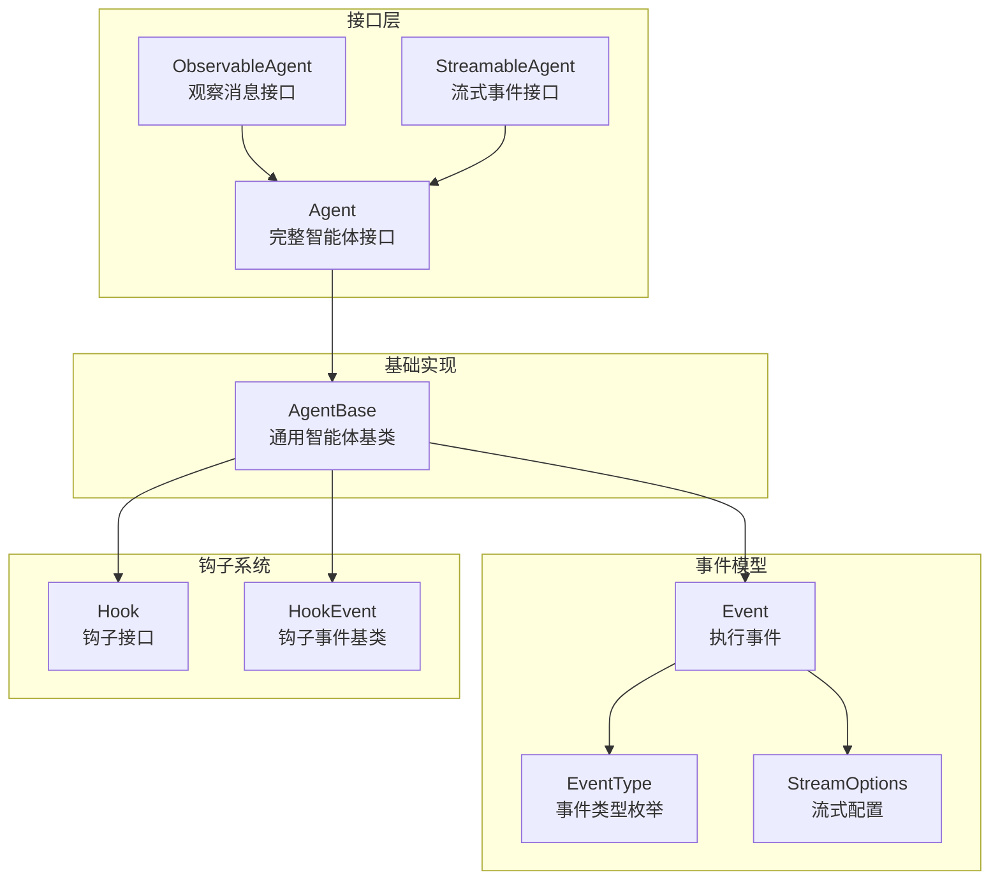
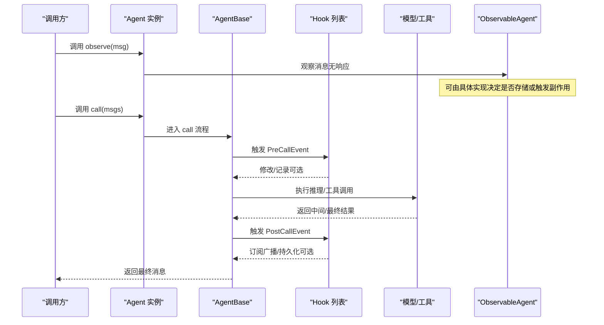
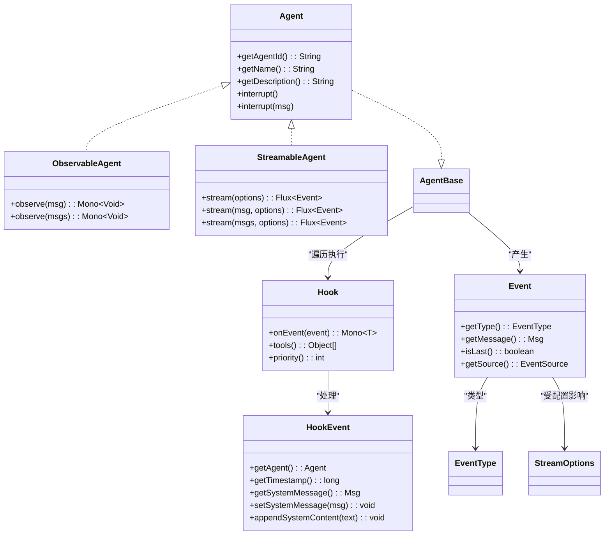

# 可观察智能体 API

<cite>
**本文引用的文件**
- [ObservableAgent.java](file://agentscope-core/src/main/java/io/agentscope/core/agent/ObservableAgent.java)
- [Agent.java](file://agentscope-core/src/main/java/io/agentscope/core/agent/Agent.java)
- [AgentBase.java](file://agentscope-core/src/main/java/io/agentscope/core/agent/AgentBase.java)
- [Event.java](file://agentscope-core/src/main/java/io/agentscope/core/agent/Event.java)
- [EventType.java](file://agentscope-core/src/main/java/io/agentscope/core/agent/EventType.java)
- [StreamOptions.java](file://agentscope-core/src/main/java/io/agentscope/core/agent/StreamOptions.java)
- [StreamableAgent.java](file://agentscope-core/src/main/java/io/agentscope/core/agent/StreamableAgent.java)
- [Hook.java](file://agentscope-core/src/main/java/io/agentscope/core/hook/Hook.java)
- [HookEvent.java](file://agentscope-core/src/main/java/io/agentscope/core/hook/HookEvent.java)
- [HookExample.java](file://agentscope-examples/quickstart/src/main/java/io/agentscope/examples/quickstart/HookExample.java)
</cite>

## 目录
1. [简介](#简介)
2. [项目结构](#项目结构)
3. [核心组件](#核心组件)
4. [架构总览](#架构总览)
5. [详细组件分析](#详细组件分析)
6. [依赖分析](#依赖分析)
7. [性能考虑](#性能考虑)
8. [故障排查指南](#故障排查指南)
9. [结论](#结论)
10. [附录](#附录)

## 简介
本文件为可观察智能体 API 的权威参考文档，聚焦于 ObservableAgent 接口及其在 Agent 基础框架中的可观测性设计。内容涵盖：
- 可观察智能体接口的公共方法与语义
- 智能体的可观测性设计模式与事件监听机制
- 智能体状态变化的通知机制与事件类型
- 如何创建与使用可观察智能体的示例路径
- 可观察智能体与 Hook 系统的集成方式
- 监控、调试与性能分析的最佳实践

## 项目结构
可观察智能体能力由一组核心接口与基础实现共同构成，关键文件如下：
- 接口层：ObservableAgent、Agent、StreamableAgent
- 基础实现：AgentBase（提供钩子、订阅、中断、状态等基础设施）
- 事件模型：Event、EventType、StreamOptions
- 钩子系统：Hook、HookEvent
- 示例：HookExample 展示了 Hook 的使用方式，间接体现可观测性与事件监听

图表来源
- [Agent.java:41-82](file://agentscope-core/src/main/java/io/agentscope/core/agent/Agent.java#L41-L82)
- [ObservableAgent.java:36-53](file://agentscope-core/src/main/java/io/agentscope/core/agent/ObservableAgent.java#L36-L53)
- [StreamableAgent.java:36-152](file://agentscope-core/src/main/java/io/agentscope/core/agent/StreamableAgent.java#L36-L152)
- [AgentBase.java:93-954](file://agentscope-core/src/main/java/io/agentscope/core/agent/AgentBase.java#L93-L954)
- [Event.java:49-211](file://agentscope-core/src/main/java/io/agentscope/core/agent/Event.java#L49-L211)
- [EventType.java:24-95](file://agentscope-core/src/main/java/io/agentscope/core/agent/EventType.java#L24-L95)
- [StreamOptions.java:62-371](file://agentscope-core/src/main/java/io/agentscope/core/agent/StreamOptions.java#L62-L371)
- [Hook.java:117-187](file://agentscope-core/src/main/java/io/agentscope/core/hook/Hook.java#L117-L187)
- [HookEvent.java:74-206](file://agentscope-core/src/main/java/io/agentscope/core/hook/HookEvent.java#L74-L206)

章节来源
- [Agent.java:20-82](file://agentscope-core/src/main/java/io/agentscope/core/agent/Agent.java#L20-L82)
- [ObservableAgent.java:22-53](file://agentscope-core/src/main/java/io/agentscope/core/agent/ObservableAgent.java#L22-L53)
- [StreamableAgent.java:23-152](file://agentscope-core/src/main/java/io/agentscope/core/agent/StreamableAgent.java#L23-L152)
- [AgentBase.java:49-954](file://agentscope-core/src/main/java/io/agentscope/core/agent/AgentBase.java#L49-L954)
- [Event.java:24-211](file://agentscope-core/src/main/java/io/agentscope/core/agent/Event.java#L24-L211)
- [EventType.java:18-95](file://agentscope-core/src/main/java/io/agentscope/core/agent/EventType.java#L18-L95)
- [StreamOptions.java:23-371](file://agentscope-core/src/main/java/io/agentscope/core/agent/StreamOptions.java#L23-L371)
- [Hook.java:25-187](file://agentscope-core/src/main/java/io/agentscope/core/hook/Hook.java#L25-L187)
- [HookEvent.java:29-206](file://agentscope-core/src/main/java/io/agentscope/core/hook/HookEvent.java#L29-L206)

## 核心组件
- ObservableAgent：定义“观察”能力，允许智能体接收并处理消息而不生成回复。典型用法包括被动监控对话流程、构建多智能体共享上下文、实现管道中的观察者模式。
- Agent：完整智能体接口，组合了可调用、可流式、可观察三大能力，并提供统一的标识、名称与中断控制。
- AgentBase：所有智能体的基础实现，提供钩子集成、订阅管理、中断处理、状态模块化、运行时上下文绑定等基础设施。
- Event/EventType/StreamOptions：事件模型与流式配置，用于描述执行阶段、事件类型、是否为最终消息、以及流式输出的过滤与增量策略。
- Hook/HookEvent：钩子系统，统一通过 onEvent 处理各类执行事件，支持优先级、工具注册、系统消息生命周期管理。

章节来源
- [ObservableAgent.java:22-53](file://agentscope-core/src/main/java/io/agentscope/core/agent/ObservableAgent.java#L22-L53)
- [Agent.java:20-82](file://agentscope-core/src/main/java/io/agentscope/core/agent/Agent.java#L20-L82)
- [AgentBase.java:49-954](file://agentscope-core/src/main/java/io/agentscope/core/agent/AgentBase.java#L49-L954)
- [Event.java:24-211](file://agentscope-core/src/main/java/io/agentscope/core/agent/Event.java#L24-L211)
- [EventType.java:18-95](file://agentscope-core/src/main/java/io/agentscope/core/agent/EventType.java#L18-L95)
- [StreamOptions.java:23-371](file://agentscope-core/src/main/java/io/agentscope/core/agent/StreamOptions.java#L23-L371)
- [Hook.java:25-187](file://agentscope-core/src/main/java/io/agentscope/core/hook/Hook.java#L25-L187)
- [HookEvent.java:29-206](file://agentscope-core/src/main/java/io/agentscope/core/hook/HookEvent.java#L29-L206)

## 架构总览
下图展示了可观察智能体在 AgentBase 中的执行链路，以及与 Hook、事件模型的交互：

图表来源
- [AgentBase.java:182-201](file://agentscope-core/src/main/java/io/agentscope/core/agent/AgentBase.java#L182-L201)
- [AgentBase.java:661-741](file://agentscope-core/src/main/java/io/agentscope/core/agent/AgentBase.java#L661-L741)
- [Hook.java:117-147](file://agentscope-core/src/main/java/io/agentscope/core/hook/Hook.java#L117-L147)
- [ObservableAgent.java:36-53](file://agentscope-core/src/main/java/io/agentscope/core/agent/ObservableAgent.java#L36-L53)

## 详细组件分析

### ObservableAgent 接口
- 方法
  - observe(Msg msg)：观察单条消息，返回完成信号，不生成回复。
  - observe(List<Msg> msgs)：批量观察消息，返回完成信号。
- 设计意图
  - 支持多智能体协作场景下的被动感知与上下文构建。
  - 允许状态型智能体将观察到的消息存入内存或上下文，供后续调用使用。
  - 允许协作型智能体基于观察到的信息更新共享知识或触发副作用。

章节来源
- [ObservableAgent.java:22-53](file://agentscope-core/src/main/java/io/agentscope/core/agent/ObservableAgent.java#L22-L53)

### Agent 接口与 AgentBase 基类
- Agent 接口
  - 组合 CallableAgent、StreamableAgent、ObservableAgent，提供统一标识、名称与中断控制。
- AgentBase 基类
  - 提供 call()/stream() 的统一执行框架，贯穿 PreCall/PostCall 等钩子事件。
  - 内置钩子排序、运行时上下文绑定、订阅管理、中断机制与优雅停机支持。
  - 提供 doObserve 默认空实现，子类可覆盖以实现自定义观察逻辑。

章节来源
- [Agent.java:20-82](file://agentscope-core/src/main/java/io/agentscope/core/agent/Agent.java#L20-L82)
- [AgentBase.java:93-954](file://agentscope-core/src/main/java/io/agentscope/core/agent/AgentBase.java#L93-L954)
- [AgentBase.java:479-496](file://agentscope-core/src/main/java/io/agentscope/core/agent/AgentBase.java#L479-L496)

### 事件模型：Event、EventType、StreamOptions
- Event
  - 描述一次执行阶段的消息事件，包含事件类型、消息体、是否为最后一条消息、来源等。
  - isLast() 用于区分流式过程中的中间块与最终块；可用于 UI 实时更新或持久化时机判断。
- EventType
  - 定义推理、工具结果、提示、最终结果、摘要等事件类型，便于过滤与路由。
- StreamOptions
  - 控制事件类型过滤、增量/累积模式、以及推理/摘要/动作块的包含策略，适配不同后端的差异化输出。

章节来源
- [Event.java:24-211](file://agentscope-core/src/main/java/io/agentscope/core/agent/Event.java#L24-L211)
- [EventType.java:18-95](file://agentscope-core/src/main/java/io/agentscope/core/agent/EventType.java#L18-L95)
- [StreamOptions.java:23-371](file://agentscope-core/src/main/java/io/agentscope/core/agent/StreamOptions.java#L23-L371)

### 钩子系统：Hook 与 HookEvent
- Hook
  - 统一事件入口 onEvent，按优先级顺序执行；支持工具注册与优先级控制。
  - 通过事件修改能力（如 PreCallEvent、PreReasoningEvent 等）影响执行上下文。
- HookEvent
  - 封装系统消息生命周期（seed/freeze/inject），确保每次迭代从一致基线开始。
  - 提供系统消息的设置与追加 API，避免直接注入 SYSTEM 消息导致异常。

章节来源
- [Hook.java:25-187](file://agentscope-core/src/main/java/io/agentscope/core/hook/Hook.java#L25-L187)
- [HookEvent.java:29-206](file://agentscope-core/src/main/java/io/agentscope/core/hook/HookEvent.java#L29-L206)

### 可观察智能体与 Hook 系统的集成
- 观察阶段
  - 在 observe(msg) 调用中，可结合 Hook 记录观察行为或触发外部处理（例如日志、指标上报）。
- 执行阶段
  - AgentBase 在 call() 生命周期内通过 HookEvent 通知各阶段事件，可在此期间对观察到的消息进行持久化或上下文同步。
- 实践建议
  - 使用 Hook 对 PreCall/PostCall 等事件进行扩展，实现跨智能体的消息广播与共享上下文。
  - 通过 HookEvent 的系统消息 API，在每次迭代前注入一致的上下文，保证观察与推理的一致性。

章节来源
- [AgentBase.java:661-741](file://agentscope-core/src/main/java/io/agentscope/core/agent/AgentBase.java#L661-L741)
- [Hook.java:117-187](file://agentscope-core/src/main/java/io/agentscope/core/hook/Hook.java#L117-L187)
- [HookEvent.java:140-205](file://agentscope-core/src/main/java/io/agentscope/core/hook/HookEvent.java#L140-L205)

### 事件监听机制与状态变化通知
- 事件监听
  - 通过 Hook.onEvent 统一接收事件，结合 EventType 进行分支处理。
  - 结合 StreamOptions 过滤特定事件类型，减少无关事件对监听器的压力。
- 状态变化通知
  - AgentBase 在 call() 生命周期中维护运行状态与中断标志，错误时触发 ErrorEvent。
  - 观察到的状态变更可通过 HookEvent 的系统消息与输入消息集合进行传播与持久化。

章节来源
- [Hook.java:117-147](file://agentscope-core/src/main/java/io/agentscope/core/hook/Hook.java#L117-L147)
- [EventType.java:18-95](file://agentscope-core/src/main/java/io/agentscope/core/agent/EventType.java#L18-L95)
- [AgentBase.java:449-457](file://agentscope-core/src/main/java/io/agentscope/core/agent/AgentBase.java#L449-L457)

### 代码示例：如何创建与使用可观察智能体
以下示例路径展示了如何在实际项目中使用 Hook 与事件模型，从而体现可观察智能体的监听与通知机制：
- Hook 示例：演示如何通过 Hook 监听 PreCall、ReasoningChunk、PreActing、ActingChunk、PostActing、PostCall 等事件，体现事件驱动的可观测性。
  - 示例路径：[HookExample.java:42-206](file://agentscope-examples/quickstart/src/main/java/io/agentscope/examples/quickstart/HookExample.java#L42-L206)

章节来源
- [HookExample.java:42-206](file://agentscope-examples/quickstart/src/main/java/io/agentscope/examples/quickstart/HookExample.java#L42-L206)

## 依赖分析
- ObservableAgent 与 Agent 的关系
  - Agent 接口组合了 ObservableAgent、StreamableAgent、CallableAgent，是可观察智能体能力的聚合入口。
- AgentBase 与 Hook 的关系
  - AgentBase 在 call()/stream() 生命周期内遍历 Hook 列表，按优先级顺序执行 onEvent，形成统一的事件通知通道。
- 事件模型与流式配置
  - Event/EventType 提供事件类型与消息完整性标识；StreamOptions 控制事件过滤与增量输出，降低监听开销。

图表来源
- [Agent.java:41-82](file://agentscope-core/src/main/java/io/agentscope/core/agent/Agent.java#L41-L82)
- [ObservableAgent.java:36-53](file://agentscope-core/src/main/java/io/agentscope/core/agent/ObservableAgent.java#L36-L53)
- [StreamableAgent.java:36-152](file://agentscope-core/src/main/java/io/agentscope/core/agent/StreamableAgent.java#L36-L152)
- [AgentBase.java:93-954](file://agentscope-core/src/main/java/io/agentscope/core/agent/AgentBase.java#L93-L954)
- [Hook.java:117-187](file://agentscope-core/src/main/java/io/agentscope/core/hook/Hook.java#L117-L187)
- [HookEvent.java:74-206](file://agentscope-core/src/main/java/io/agentscope/core/hook/HookEvent.java#L74-L206)
- [Event.java:49-211](file://agentscope-core/src/main/java/io/agentscope/core/agent/Event.java#L49-L211)
- [EventType.java:24-95](file://agentscope-core/src/main/java/io/agentscope/core/agent/EventType.java#L24-L95)
- [StreamOptions.java:62-371](file://agentscope-core/src/main/java/io/agentscope/core/agent/StreamOptions.java#L62-L371)

## 性能考虑
- 事件过滤与增量输出
  - 使用 StreamOptions 精确选择需要监听的事件类型与增量模式，减少不必要的事件传递与处理。
- 钩子优先级与数量
  - 合理设置 Hook 优先级，避免过多高优先级钩子阻塞关键路径；必要时拆分钩子职责。
- 观察实现优化
  - 在 doObserve 中避免重 IO 或阻塞操作；若需持久化，采用异步批处理策略。
- 中断与优雅停机
  - 在复杂执行链中适时检查中断状态，确保快速响应用户取消或系统关闭。

## 故障排查指南
- 观察未生效
  - 确认是否正确实现了 doObserve 并在需要时将消息写入内存或上下文。
  - 检查 AgentBase 的订阅列表与广播逻辑，确保消息被正确分发。
- 事件缺失或重复
  - 检查 StreamOptions 的事件类型过滤与增量/累积模式配置。
  - 确保事件 isLast 标识正确，避免在中间块上做最终态处理。
- 钩子异常
  - 检查 Hook 的优先级与执行顺序，定位最先抛错的钩子。
  - 使用 ErrorEvent 监听错误并记录堆栈，辅助定位问题根因。
- 中断无效
  - 确认在执行链的关键检查点调用了中断检查方法，并在捕获 InterruptedException 后进行恢复处理。

章节来源
- [AgentBase.java:372-379](file://agentscope-core/src/main/java/io/agentscope/core/agent/AgentBase.java#L372-L379)
- [AgentBase.java:449-457](file://agentscope-core/src/main/java/io/agentscope/core/agent/AgentBase.java#L449-L457)
- [Hook.java:117-147](file://agentscope-core/src/main/java/io/agentscope/core/hook/Hook.java#L117-L147)
- [EventType.java:18-95](file://agentscope-core/src/main/java/io/agentscope/core/agent/EventType.java#L18-L95)

## 结论
可观察智能体通过 ObservableAgent 提供“观察而不回复”的能力，配合 AgentBase 的钩子系统与事件模型，实现了对智能体执行过程的全面可观测与可控干预。借助 Hook、Event、EventType、StreamOptions 等组件，开发者可以灵活地实现监控、调试与性能优化，并在多智能体协作场景中构建共享上下文与协作机制。

## 附录
- 快速参考
  - 可观察方法：observe(Msg)、observe(List<Msg>)
  - 事件类型：REASONING、TOOL_RESULT、HINT、AGENT_RESULT、SUMMARY、ALL
  - 配置项：事件类型集合、增量模式、推理/动作/摘要块包含策略
  - 钩子优先级：数值越小优先级越高，默认 100