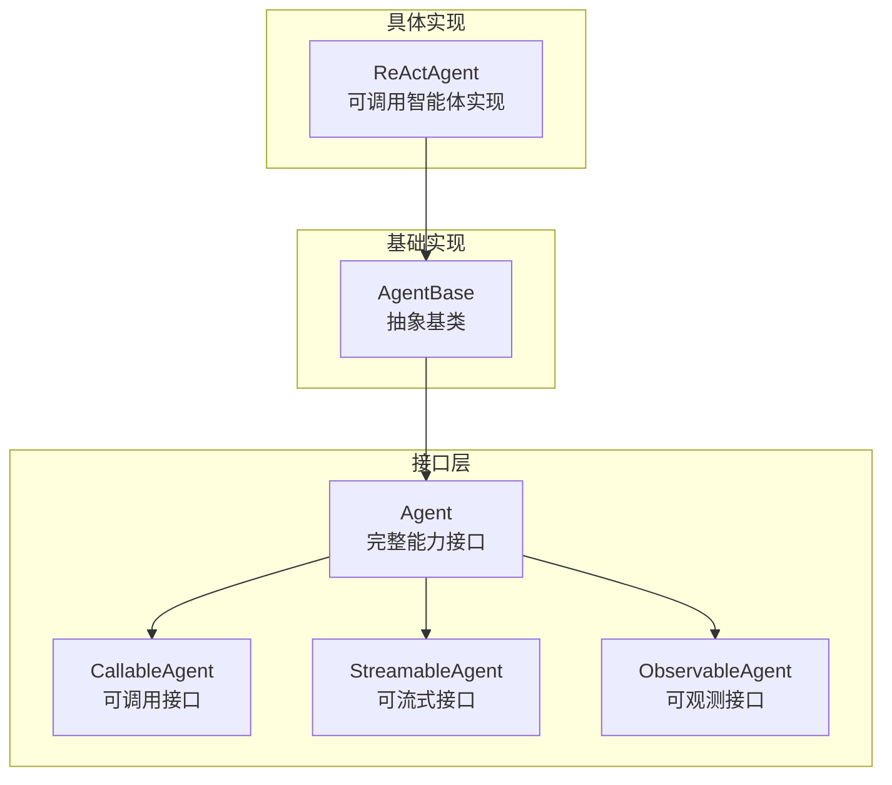
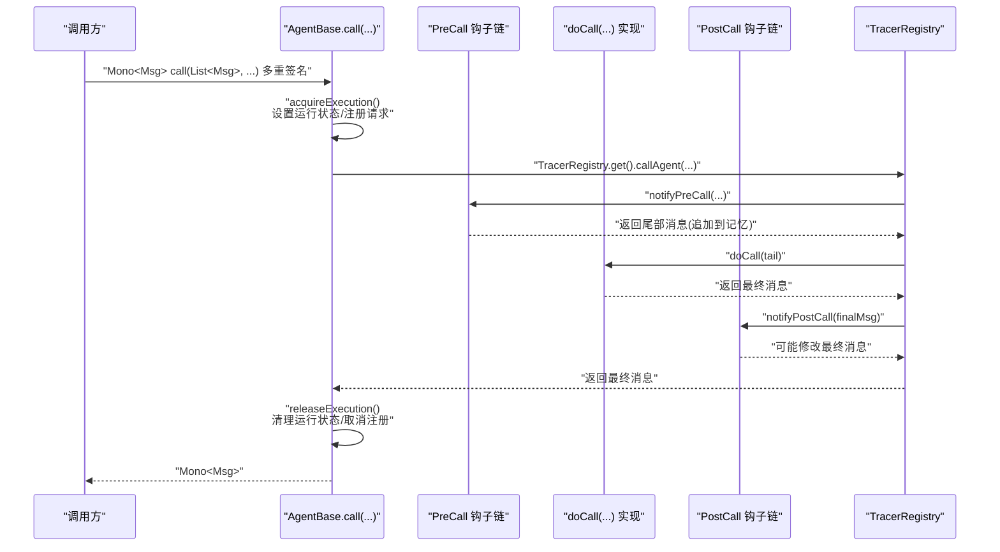
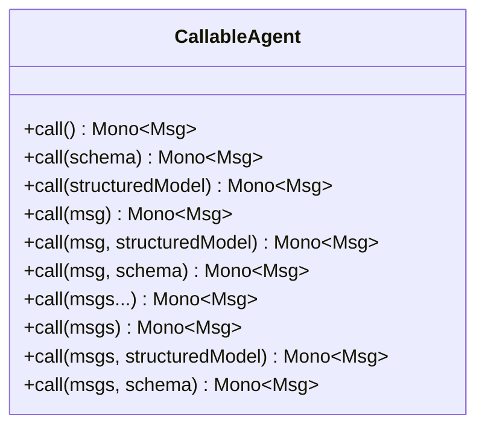
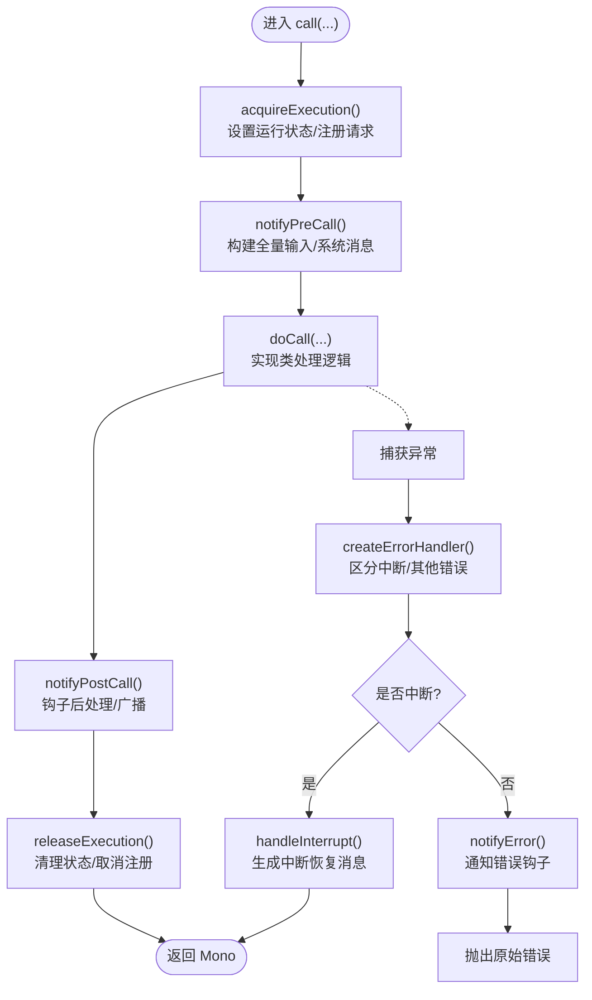
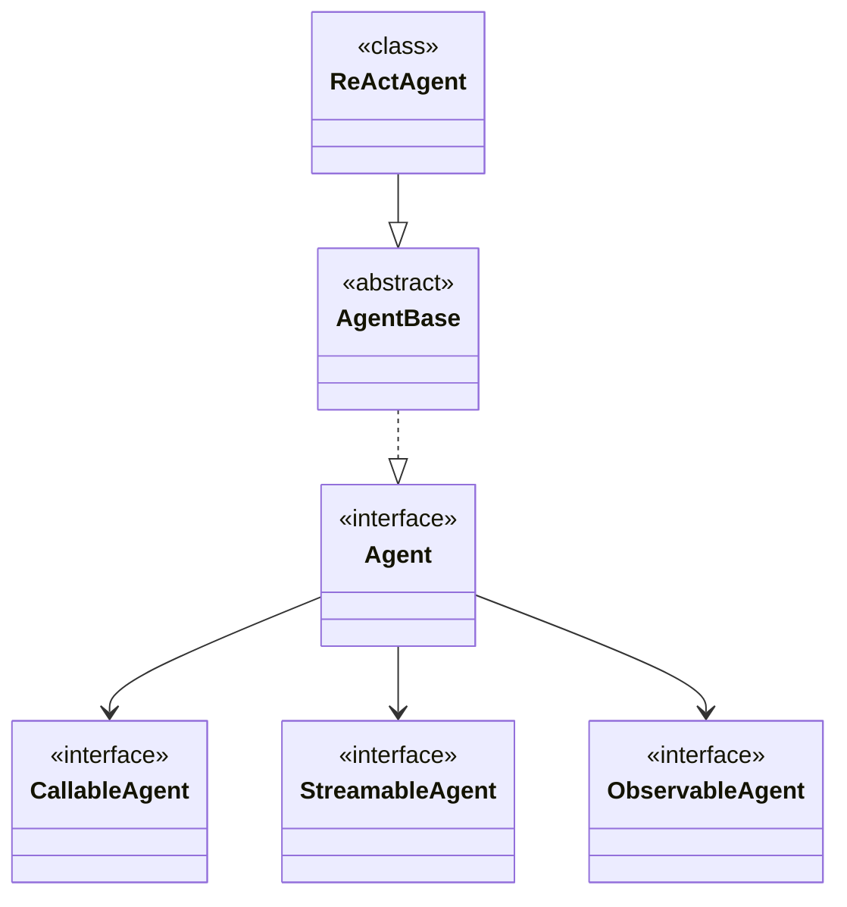

# 可调用智能体 API

<cite>
**本文引用的文件**
- [CallableAgent.java](file://agentscope-core/src/main/java/io/agentscope/core/agent/CallableAgent.java)
- [Agent.java](file://agentscope-core/src/main/java/io/agentscope/core/agent/Agent.java)
- [StreamableAgent.java](file://agentscope-core/src/main/java/io/agentscope/core/agent/StreamableAgent.java)
- [ObservableAgent.java](file://agentscope-core/src/main/java/io/agentscope/core/agent/ObservableAgent.java)
- [AgentBase.java](file://agentscope-core/src/main/java/io/agentscope/core/agent/AgentBase.java)
- [ReActAgent.java](file://agentscope-core/src/main/java/io/agentscope/core/ReActAgent.java)
</cite>

## 目录
1. [简介](#简介)
2. [项目结构](#项目结构)
3. [核心组件](#核心组件)
4. [架构总览](#架构总览)
5. [详细组件分析](#详细组件分析)
6. [依赖分析](#依赖分析)
7. [性能考虑](#性能考虑)
8. [故障排查指南](#故障排查指南)
9. [结论](#结论)
10. [附录](#附录)

## 简介
本文件为可调用智能体 API 的权威参考，聚焦于 CallableAgent 接口及其在 AgentScope 框架中的设计与实现。内容涵盖：
- CallableAgent 的公共方法族与配置选项（结构化输出、JSON Schema、类模型等）
- 可调用性设计模式：基于 Project Reactor 的响应式调用、钩子系统、中断机制与运行时上下文绑定
- 同步与异步调用 API 的差异与使用场景
- 与其他智能体类型（如 StreamableAgent、ObservableAgent）的区别与适用场景
- 性能与并发安全最佳实践

## 项目结构
AgentScope 将“能力”拆分为多个接口，通过组合形成完整的 Agent 能力集：
- CallableAgent：消息处理与响应生成的核心可调用能力
- StreamableAgent：执行过程事件流式输出
- ObservableAgent：被动观察消息的能力
- Agent：上述三者的组合接口
- AgentBase：所有 Agent 的抽象基类，提供钩子、中断、追踪、状态管理等基础设施
- ReActAgent：典型可调用智能体实现，具备记忆、工具、计划、RAG、结构化输出等高级能力

图表来源
- [Agent.java:41-82](file://agentscope-core/src/main/java/io/agentscope/core/agent/Agent.java#L41-L82)
- [CallableAgent.java:35-139](file://agentscope-core/src/main/java/io/agentscope/core/agent/CallableAgent.java#L35-L139)
- [StreamableAgent.java:36-152](file://agentscope-core/src/main/java/io/agentscope/core/agent/StreamableAgent.java#L36-L152)
- [ObservableAgent.java:36-53](file://agentscope-core/src/main/java/io/agentscope/core/agent/ObservableAgent.java#L36-L53)
- [AgentBase.java:93-535](file://agentscope-core/src/main/java/io/agentscope/core/agent/AgentBase.java#L93-L535)
- [ReActAgent.java:140](file://agentscope-core/src/main/java/io/agentscope/core/ReActAgent.java#L140)

章节来源
- [Agent.java:20-82](file://agentscope-core/src/main/java/io/agentscope/core/agent/Agent.java#L20-L82)
- [CallableAgent.java:23-34](file://agentscope-core/src/main/java/io/agentscope/core/agent/CallableAgent.java#L23-L34)
- [AgentBase.java:49-92](file://agentscope-core/src/main/java/io/agentscope/core/agent/AgentBase.java#L49-L92)

## 核心组件
- CallableAgent：定义统一的可调用入口，支持多种输入形式（单个消息、消息列表、变长参数），以及结构化输出（类模型或 JSON Schema）。其默认方法用于便捷调用，最终都会委托到核心 call(List<Msg>) 方法。
- AgentBase：提供统一的执行生命周期管理（acquire/release）、钩子通知（PreCall/PostCall/Error）、中断检查与恢复、运行时上下文绑定、订阅广播等。
- ReActAgent：典型可调用智能体实现，继承自支持结构化输出的基类，具备记忆、工具、计划、RAG、流式事件等能力。

章节来源
- [CallableAgent.java:35-139](file://agentscope-core/src/main/java/io/agentscope/core/agent/CallableAgent.java#L35-L139)
- [AgentBase.java:182-263](file://agentscope-core/src/main/java/io/agentscope/core/agent/AgentBase.java#L182-L263)
- [ReActAgent.java:140](file://agentscope-core/src/main/java/io/agentscope/core/ReActAgent.java#L140)

## 架构总览
下图展示了可调用智能体的调用路径与钩子、中断、追踪的交互关系：

图表来源
- [AgentBase.java:182-201](file://agentscope-core/src/main/java/io/agentscope/core/agent/AgentBase.java#L182-L201)
- [AgentBase.java:212-232](file://agentscope-core/src/main/java/io/agentscope/core/agent/AgentBase.java#L212-L232)
- [AgentBase.java:244-263](file://agentscope-core/src/main/java/io/agentscope/core/agent/AgentBase.java#L244-L263)
- [AgentBase.java:661-720](file://agentscope-core/src/main/java/io/agentscope/core/agent/AgentBase.java#L661-L720)
- [AgentBase.java:729-741](file://agentscope-core/src/main/java/io/agentscope/core/agent/AgentBase.java#L729-L741)

## 详细组件分析

### CallableAgent 接口详解
- 设计目标：统一智能体的“可调用”能力，屏蔽内部复杂度，提供简洁易用的 API。
- 方法族：
  - 无参/单参/多参/列表/带结构化输出（类模型/JSON Schema）的 call(...) 重载
  - 所有便捷方法最终都委托到核心 call(List<Msg>) 或带结构化输出的 call(List<Msg>, ...)
- 结构化输出：
  - 通过类模型或 JSON Schema 约束输出结构，结果以元数据形式回传
  - 支持在 AgentBase 生命周期中动态注入钩子以实现结构化输出能力

图表来源
- [CallableAgent.java:35-139](file://agentscope-core/src/main/java/io/agentscope/core/agent/CallableAgent.java#L35-L139)

章节来源
- [CallableAgent.java:23-34](file://agentscope-core/src/main/java/io/agentscope/core/agent/CallableAgent.java#L23-L34)
- [CallableAgent.java:37-139](file://agentscope-core/src/main/java/io/agentscope/core/agent/CallableAgent.java#L37-L139)

### AgentBase 生命周期与钩子系统
- 生命周期管理：
  - acquireExecution()/releaseExecution()：确保单实例并发安全；在 Mono.using 中保证资源回收
  - beforeAgentExecution()/afterAgentExecution()：在钩子前后插入扩展点
- 钩子系统：
  - PreCall/PostCall/Error 事件链，按优先级排序执行
  - 支持动态添加/移除钩子；RuntimeContextAware 钩子自动绑定当前运行时上下文
- 中断机制：
  - interrupt()/interrupt(Msg)/interrupt(InterruptSource) 设置中断标志
  - checkInterruptedAsync() 在 Mono 链路中检查中断，抛出 InterruptedException
  - createErrorHandler() 统一处理中断与错误，触发 handleInterrupt()

图表来源
- [AgentBase.java:182-201](file://agentscope-core/src/main/java/io/agentscope/core/agent/AgentBase.java#L182-L201)
- [AgentBase.java:449-457](file://agentscope-core/src/main/java/io/agentscope/core/agent/AgentBase.java#L449-L457)
- [AgentBase.java:514](file://agentscope-core/src/main/java/io/agentscope/core/agent/AgentBase.java#L514)

章节来源
- [AgentBase.java:182-263](file://agentscope-core/src/main/java/io/agentscope/core/agent/AgentBase.java#L182-L263)
- [AgentBase.java:312-389](file://agentscope-core/src/main/java/io/agentscope/core/agent/AgentBase.java#L312-L389)
- [AgentBase.java:449-457](file://agentscope-core/src/main/java/io/agentscope/core/agent/AgentBase.java#L449-L457)
- [AgentBase.java:661-720](file://agentscope-core/src/main/java/io/agentscope/core/agent/AgentBase.java#L661-L720)
- [AgentBase.java:729-752](file://agentscope-core/src/main/java/io/agentscope/core/agent/AgentBase.java#L729-L752)

### ReActAgent：可调用智能体的典型实现
- 角色定位：继承自支持结构化输出的基类，提供记忆、工具、计划、RAG、流式事件等能力
- 关键特性：
  - 迭代式“推理+行动”循环，受最大迭代次数限制
  - 支持结构化输出提醒（StructuredOutputReminder）与 JSON Schema/类模型约束
  - 与钩子系统深度集成，支持人类在环（HITL）与恢复钩子
- 使用建议：
  - 对需要复杂推理与工具调用的任务优先选择 ReActAgent
  - 通过 Builder 模式配置模型、工具箱、记忆与生成选项

章节来源
- [ReActAgent.java:93-139](file://agentscope-core/src/main/java/io/agentscope/core/ReActAgent.java#L93-L139)
- [ReActAgent.java:140](file://agentscope-core/src/main/java/io/agentscope/core/ReActAgent.java#L140)

### 与其他智能体类型的对比与适用场景
- CallableAgent vs StreamableAgent：
  - CallableAgent：一次性返回最终消息，适合简单对话或任务执行
  - StreamableAgent：实时流式输出中间事件，适合需要进度反馈与可观测性的场景
- CallableAgent vs ObservableAgent：
  - ObservableAgent：仅接收消息不生成回复，适合旁观者/观察者角色
- Agent：同时具备三者能力，适合完整型智能体

章节来源
- [Agent.java:20-41](file://agentscope-core/src/main/java/io/agentscope/core/agent/Agent.java#L20-L41)
- [StreamableAgent.java:23-35](file://agentscope-core/src/main/java/io/agentscope/core/agent/StreamableAgent.java#L23-L35)
- [ObservableAgent.java:22-35](file://agentscope-core/src/main/java/io/agentscope/core/agent/ObservableAgent.java#L22-L35)

## 依赖分析
- CallableAgent 作为最小可调用契约，被 Agent 组合接口继承
- AgentBase 为所有 Agent 提供统一的生命周期、钩子、中断与追踪能力
- ReActAgent 作为具体实现，依赖 AgentBase 并扩展结构化输出、记忆、工具、计划等能力

图表来源
- [Agent.java:41-82](file://agentscope-core/src/main/java/io/agentscope/core/agent/Agent.java#L41-L82)
- [CallableAgent.java:35-139](file://agentscope-core/src/main/java/io/agentscope/core/agent/CallableAgent.java#L35-L139)
- [StreamableAgent.java:36-152](file://agentscope-core/src/main/java/io/agentscope/core/agent/StreamableAgent.java#L36-L152)
- [ObservableAgent.java:36-53](file://agentscope-core/src/main/java/io/agentscope/core/agent/ObservableAgent.java#L36-L53)
- [AgentBase.java:93](file://agentscope-core/src/main/java/io/agentscope/core/agent/AgentBase.java#L93)
- [ReActAgent.java:140](file://agentscope-core/src/main/java/io/agentscope/core/ReActAgent.java#L140)

章节来源
- [Agent.java:20-82](file://agentscope-core/src/main/java/io/agentscope/core/agent/Agent.java#L20-L82)
- [AgentBase.java:93-535](file://agentscope-core/src/main/java/io/agentscope/core/agent/AgentBase.java#L93-L535)

## 性能考虑
- 响应式执行：基于 Project Reactor 的非阻塞模型，避免线程阻塞，提升吞吐
- 单实例并发控制：AgentBase 在 acquireExecution() 中通过原子布尔值确保单次执行，避免竞态
- 钩子与追踪开销：钩子链与追踪在调试阶段非常有用，生产环境建议按需启用以降低额外开销
- 中断检查点：复杂智能体应在关键节点调用 checkInterruptedAsync()，以快速响应中断，避免无效计算
- 结构化输出：仅在必要时启用，避免过度约束导致的额外处理成本

## 故障排查指南
- 中断未生效：
  - 确认在实现中按检查点调用中断检查方法
  - 检查中断源与用户消息是否正确传递
- 返回空消息：
  - AgentBase 在 notifyPostCall() 中会校验最终消息是否为空，并抛出异常
- 钩子顺序问题：
  - 钩子按优先级排序执行，确认优先级设置是否符合预期
- 并发冲突：
  - 不要对同一 Agent 实例并发调用 call()/stream()；遵循单实例单线程执行原则

章节来源
- [AgentBase.java:312-389](file://agentscope-core/src/main/java/io/agentscope/core/agent/AgentBase.java#L312-L389)
- [AgentBase.java:449-457](file://agentscope-core/src/main/java/io/agentscope/core/agent/AgentBase.java#L449-L457)
- [AgentBase.java:729-752](file://agentscope-core/src/main/java/io/agentscope/core/agent/AgentBase.java#L729-L752)

## 结论
CallableAgent 为 AgentScope 的可调用智能体提供了统一、简洁且强大的 API。通过 AgentBase 的生命周期与钩子系统，结合 ReActAgent 等实现，开发者可以快速构建从简单对话到复杂推理与工具调用的各类智能体。在生产环境中，建议关注并发安全、中断响应与钩子开销，以获得稳定与高性能的运行效果。

## 附录
- 同步与异步调用 API 速览
  - 同步：通过 call(...) 返回 Mono<Msg>，使用 block() 获取结果
  - 异步：直接使用返回的 Mono/Flux 流式处理，避免阻塞
- 结构化输出使用建议
  - 优先使用类模型进行强类型约束
  - 复杂场景可采用 JSON Schema 精细化约束
  - 仅在需要时启用，避免过度约束影响灵活性