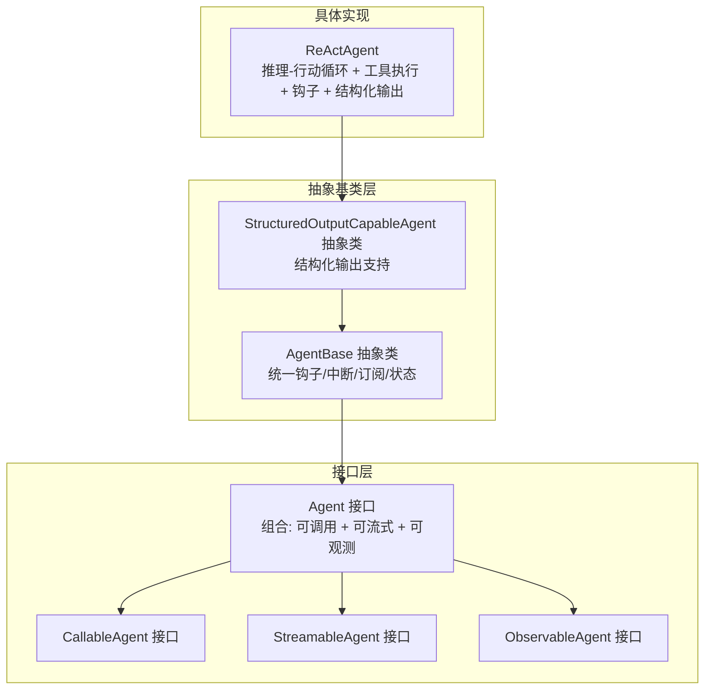
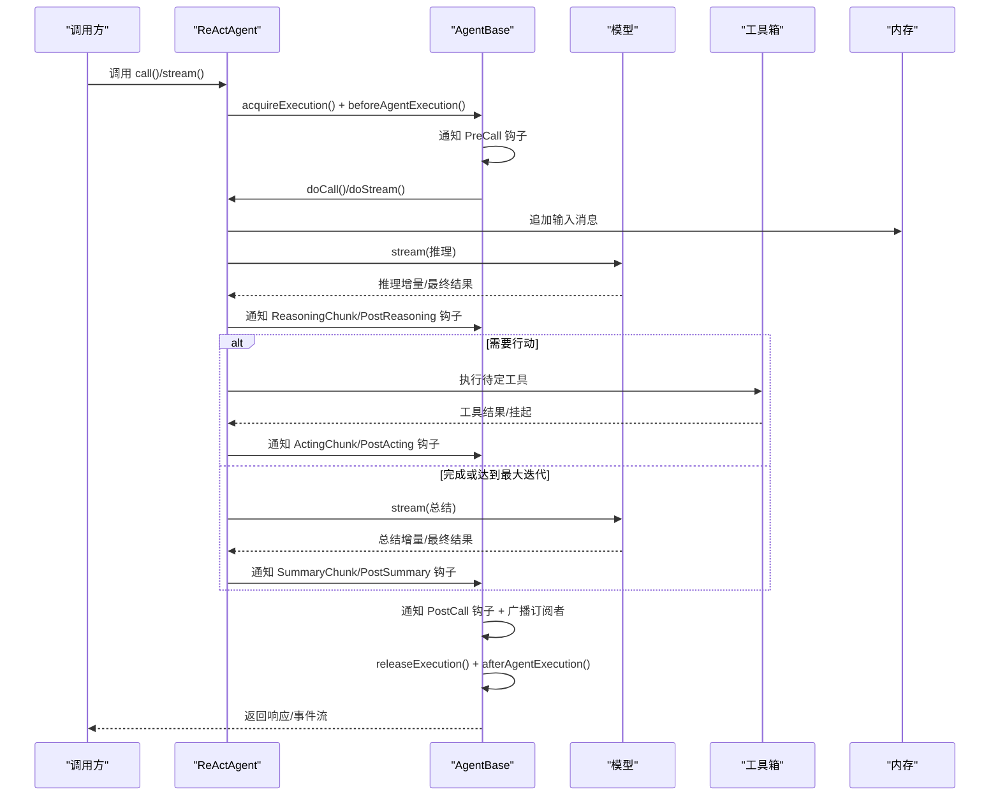
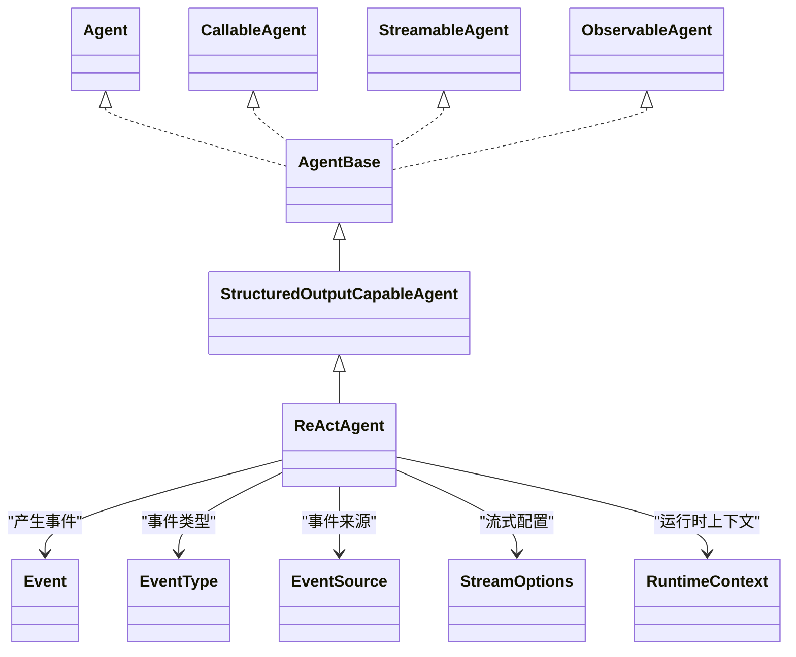

# 智能体 API

<cite>
**本文引用的文件**
- [ReActAgent.java](file://agentscope-core/src/main/java/io/agentscope/core/ReActAgent.java)
- [Agent.java](file://agentscope-core/src/main/java/io/agentscope/core/agent/Agent.java)
- [AgentBase.java](file://agentscope-core/src/main/java/io/agentscope/core/agent/AgentBase.java)
- [CallableAgent.java](file://agentscope-core/src/main/java/io/agentscope/core/agent/CallableAgent.java)
- [StreamableAgent.java](file://agentscope-core/src/main/java/io/agentscope/core/agent/StreamableAgent.java)
- [ObservableAgent.java](file://agentscope-core/src/main/java/io/agentscope/core/agent/ObservableAgent.java)
- [StructuredOutputCapableAgent.java](file://agentscope-core/src/main/java/io/agentscope/core/agent/StructuredOutputCapableAgent.java)
- [Event.java](file://agentscope-core/src/main/java/io/agentscope/core/agent/Event.java)
- [EventType.java](file://agentscope-core/src/main/java/io/agentscope/core/agent/EventType.java)
- [EventSource.java](file://agentscope-core/src/main/java/io/agentscope/core/agent/EventSource.java)
- [StreamOptions.java](file://agentscope-core/src/main/java/io/agentscope/core/agent/StreamOptions.java)
- [RuntimeContext.java](file://agentscope-core/src/main/java/io/agentscope/core/agent/RuntimeContext.java)
</cite>

## 目录
1. [简介](#简介)
2. [项目结构](#项目结构)
3. [核心组件](#核心组件)
4. [架构总览](#架构总览)
5. [详细组件分析](#详细组件分析)
6. [依赖关系分析](#依赖关系分析)
7. [性能与并发特性](#性能与并发特性)
8. [故障排查指南](#故障排查指南)
9. [结论](#结论)
10. [附录：使用示例与最佳实践](#附录使用示例与最佳实践)

## 简介
本文件为 AgentScope Java 智能体相关 API 的权威参考文档，重点覆盖以下内容：
- ReActAgent 类的公共方法、构造器与配置项详解
- Agent 接口及其组合能力（可调用、可流式、可观测）及其实现类
- 智能体生命周期管理、状态管理与事件处理机制
- 流式处理 API、同步调用 API 与结构化输出 API 的使用方式
- 常见使用模式与配置最佳实践

## 项目结构
AgentScope 的智能体体系以“接口分层 + 抽象基类 + 具体实现”的方式组织，ReActAgent 是基于该体系的典型实现，提供“推理-行动”循环、工具执行、钩子系统、结构化输出等能力。

图表来源
- [Agent.java:41-82](file://agentscope-core/src/main/java/io/agentscope/core/agent/Agent.java#L41-L82)
- [CallableAgent.java:35-139](file://agentscope-core/src/main/java/io/agentscope/core/agent/CallableAgent.java#L35-L139)
- [StreamableAgent.java:36-152](file://agentscope-core/src/main/java/io/agentscope/core/agent/StreamableAgent.java#L36-L152)
- [ObservableAgent.java:36-53](file://agentscope-core/src/main/java/io/agentscope/core/agent/ObservableAgent.java#L36-L53)
- [AgentBase.java:93-572](file://agentscope-core/src/main/java/io/agentscope/core/agent/AgentBase.java#L93-L572)
- [StructuredOutputCapableAgent.java:65-124](file://agentscope-core/src/main/java/io/agentscope/core/agent/StructuredOutputCapableAgent.java#L65-L124)
- [ReActAgent.java:140-194](file://agentscope-core/src/main/java/io/agentscope/core/ReActAgent.java#L140-L194)

章节来源
- [Agent.java:20-82](file://agentscope-core/src/main/java/io/agentscope/core/agent/Agent.java#L20-L82)
- [AgentBase.java:49-92](file://agentscope-core/src/main/java/io/agentscope/core/agent/AgentBase.java#L49-L92)

## 核心组件
- Agent 接口：统一定义智能体的标识、名称、描述、中断能力，并组合可调用、可流式、可观测三类能力。
- AgentBase 抽象类：提供统一的钩子系统、中断机制、订阅管理、运行时上下文绑定、错误处理与生命周期钩子通知。
- StructuredOutputCapableAgent 抽象类：在 AgentBase 基础上提供结构化输出能力，通过临时工具与 StructuredOutputHook 实现类型安全的输出生成。
- ReActAgent：具体实现，提供“推理-行动”循环、工具执行、长短期记忆、计划集成、RAG、会话持久化等高级能力。

章节来源
- [Agent.java:41-82](file://agentscope-core/src/main/java/io/agentscope/core/agent/Agent.java#L41-L82)
- [AgentBase.java:93-572](file://agentscope-core/src/main/java/io/agentscope/core/agent/AgentBase.java#L93-L572)
- [StructuredOutputCapableAgent.java:65-124](file://agentscope-core/src/main/java/io/agentscope/core/agent/StructuredOutputCapableAgent.java#L65-L124)
- [ReActAgent.java:140-194](file://agentscope-core/src/main/java/io/agentscope/core/ReActAgent.java#L140-L194)

## 架构总览
ReActAgent 的执行流程围绕“推理-行动”循环展开，结合模型推理、工具调用、钩子通知与内存管理，形成完整的智能体工作流。

图表来源
- [AgentBase.java:182-263](file://agentscope-core/src/main/java/io/agentscope/core/agent/AgentBase.java#L182-L263)
- [ReActAgent.java:560-650](file://agentscope-core/src/main/java/io/agentscope/core/ReActAgent.java#L560-L650)
- [ReActAgent.java:669-731](file://agentscope-core/src/main/java/io/agentscope/core/ReActAgent.java#L669-L731)
- [ReActAgent.java:828-861](file://agentscope-core/src/main/java/io/agentscope/core/ReActAgent.java#L828-L861)

## 详细组件分析

### ReActAgent：推理-行动智能体
- 角色定位：面向任务型对话与工具驱动的智能体，通过“推理-行动”循环迭代推进，直至完成或达到最大迭代限制。
- 关键依赖：
  - 内存：用于存储对话历史与中间结果
  - 模型：负责推理与总结阶段的文本生成
  - 工具箱：封装可用工具与工具执行上下文
  - 计划笔记本：可选的任务规划与提示注入
  - 钩子系统：贯穿推理、行动、总结各阶段的事件通知
- 生命周期钩子：
  - PreCall/PostCall：整体调用前后
  - PreReasoning/ReasoningChunk/PostReasoning：推理阶段
  - PreActing/ActingChunk/PostActing：行动阶段
  - PreSummary/SummaryChunk/PostSummary：达到最大迭代后的总结阶段
- 中断机制：支持用户中断与系统中断，可在检查点抛出中断异常并进行恢复或保存。

常用 API 与行为要点
- 同步调用
  - call(List<Msg>): 返回最终消息
  - call(List<Msg>, Class<?>): 结构化输出（类型）
  - call(List<Msg>, JsonNode): 结构化输出（JSON Schema）
- 流式调用
  - stream(List<Msg>, StreamOptions): 事件流（可按类型过滤）
  - stream(List<Msg>, StreamOptions, Class<?>): 结合结构化输出的流式结果
- 状态与会话
  - saveTo(Session, SessionKey)/loadFrom(Session, SessionKey): 保存/加载智能体状态
- 工具与结果处理
  - 提供待定工具识别与结果校验逻辑，避免重复执行
  - 对工具失败进行兜底错误结果生成，保证流程继续

章节来源
- [ReActAgent.java:364-398](file://agentscope-core/src/main/java/io/agentscope/core/ReActAgent.java#L364-L398)
- [ReActAgent.java:546-650](file://agentscope-core/src/main/java/io/agentscope/core/ReActAgent.java#L546-L650)
- [ReActAgent.java:669-731](file://agentscope-core/src/main/java/io/agentscope/core/ReActAgent.java#L669-L731)
- [ReActAgent.java:828-861](file://agentscope-core/src/main/java/io/agentscope/core/ReActAgent.java#L828-L861)
- [ReActAgent.java:947-958](file://agentscope-core/src/main/java/io/agentscope/core/ReActAgent.java#L947-L958)
- [ReActAgent.java:977-987](file://agentscope-core/src/main/java/io/agentscope/core/ReActAgent.java#L977-L987)
- [ReActAgent.java:1163-1203](file://agentscope-core/src/main/java/io/agentscope/core/ReActAgent.java#L1163-L1203)

### Agent 接口与组合能力
- Agent 接口：统一标识、名称、描述与中断能力；组合 CallableAgent、StreamableAgent、ObservableAgent。
- CallableAgent：提供 call() 多重重载，支持结构化输出（类型或 JSON Schema）。
- StreamableAgent：提供 stream() 多重重载，支持事件类型过滤与增量/累积两种模式。
- ObservableAgent：提供 observe() 能力，用于接收消息而不生成回复。

章节来源
- [Agent.java:41-82](file://agentscope-core/src/main/java/io/agentscope/core/agent/Agent.java#L41-L82)
- [CallableAgent.java:35-139](file://agentscope-core/src/main/java/io/agentscope/core/agent/CallableAgent.java#L35-L139)
- [StreamableAgent.java:36-152](file://agentscope-core/src/main/java/io/agentscope/core/agent/StreamableAgent.java#L36-L152)
- [ObservableAgent.java:36-53](file://agentscope-core/src/main/java/io/agentscope/core/agent/ObservableAgent.java#L36-L53)

### AgentBase：统一基础设施
- 钩子系统：支持动态增删钩子，按优先级排序，统一在 Pre/Post 阶段触发。
- 中断机制：原子标志位 + 用户消息关联，支持在 Mono 链路中检查并在合适节点抛出中断异常。
- 订阅与广播：支持 MsgHub 订阅者管理，调用完成后向订阅者广播最终消息。
- 运行时上下文：支持 per-call 的 RuntimeContext 绑定与解绑，供钩子与工具访问。

章节来源
- [AgentBase.java:93-572](file://agentscope-core/src/main/java/io/agentscope/core/agent/AgentBase.java#L93-L572)
- [AgentBase.java:574-800](file://agentscope-core/src/main/java/io/agentscope/core/agent/AgentBase.java#L574-L800)

### StructuredOutputCapableAgent：结构化输出支持
- 通过注册临时工具 generate_response 与 StructuredOutputHook 协作，实现类型安全的结构化输出。
- 支持从类或 JSON Schema 生成结构化输出的工具参数，并在钩子完成后提取结构化数据到消息元数据中。
- 支持将思考块与用量信息合并回最终消息。

章节来源
- [StructuredOutputCapableAgent.java:65-124](file://agentscope-core/src/main/java/io/agentscope/core/agent/StructuredOutputCapableAgent.java#L65-L124)
- [StructuredOutputCapableAgent.java:126-197](file://agentscope-core/src/main/java/io/agentscope/core/agent/StructuredOutputCapableAgent.java#L126-L197)
- [StructuredOutputCapableAgent.java:199-374](file://agentscope-core/src/main/java/io/agentscope/core/agent/StructuredOutputCapableAgent.java#L199-L374)

### 事件模型与流式选项
- Event：流式事件载体，包含事件类型、消息体、是否为最后一条、来源（子智能体）等字段。
- EventType：事件类型枚举，涵盖推理、工具结果、提示、最终结果、总结等。
- EventSource：事件来源标识，支持路径与深度，便于 UI 或适配器区分父/子智能体事件。
- StreamOptions：控制事件类型集合、增量/累积模式，以及推理/行动/总结两类事件的细分包含策略。

章节来源
- [Event.java:51-211](file://agentscope-core/src/main/java/io/agentscope/core/agent/Event.java#L51-L211)
- [EventType.java:24-94](file://agentscope-core/src/main/java/io/agentscope/core/agent/EventType.java#L24-L94)
- [EventSource.java:106-267](file://agentscope-core/src/main/java/io/agentscope/core/agent/EventSource.java#L106-L267)
- [StreamOptions.java:62-371](file://agentscope-core/src/main/java/io/agentscope/core/agent/StreamOptions.java#L62-L371)

### 运行时上下文 RuntimeContext
- 提供 per-call 的会话级字段与线程安全属性容器，支持字符串键与类型化键访问。
- 支持嵌入 ToolExecutionContext，作为工具调用时的上下文注入层。
- 提供 asToolExecutionContext() 将运行时上下文转换为工具栈可用的上下文视图。

章节来源
- [RuntimeContext.java:34-361](file://agentscope-core/src/main/java/io/agentscope/core/agent/RuntimeContext.java#L34-L361)

## 依赖关系分析
ReActAgent 的内部依赖关系如下：

图表来源
- [Agent.java:41-82](file://agentscope-core/src/main/java/io/agentscope/core/agent/Agent.java#L41-L82)
- [AgentBase.java:93-572](file://agentscope-core/src/main/java/io/agentscope/core/agent/AgentBase.java#L93-L572)
- [StructuredOutputCapableAgent.java:65-124](file://agentscope-core/src/main/java/io/agentscope/core/agent/StructuredOutputCapableAgent.java#L65-L124)
- [ReActAgent.java:140-194](file://agentscope-core/src/main/java/io/agentscope/core/ReActAgent.java#L140-L194)
- [Event.java:51-211](file://agentscope-core/src/main/java/io/agentscope/core/agent/Event.java#L51-L211)
- [EventType.java:24-94](file://agentscope-core/src/main/java/io/agentscope/core/agent/EventType.java#L24-L94)
- [EventSource.java:106-267](file://agentscope-core/src/main/java/io/agentscope/core/agent/EventSource.java#L106-L267)
- [StreamOptions.java:62-371](file://agentscope-core/src/main/java/io/agentscope/core/agent/StreamOptions.java#L62-L371)
- [RuntimeContext.java:34-361](file://agentscope-core/src/main/java/io/agentscope/core/agent/RuntimeContext.java#L34-L361)

## 性能与并发特性
- 并发模型：ReActAgent 采用 Reactor 非阻塞模型，但单实例不建议并发调用（call/stream 同时执行）。AgentBase 在 acquireExecution/releaseExecution 中通过原子布尔量确保单次执行。
- 中断检查：在推理、行动、工具执行、流式传输等关键节点检查中断，及时响应用户或系统中断。
- 流式聚合：ReasoningContext 负责增量聚合，减少不必要的对象分配；流式事件按需过滤，降低带宽与 UI 渲染压力。
- 结构化输出：通过临时工具与钩子协作，避免额外网络往返；最终结果合并用量与思考块，减少二次处理成本。

章节来源
- [AgentBase.java:68-92](file://agentscope-core/src/main/java/io/agentscope/core/agent/AgentBase.java#L68-L92)
- [AgentBase.java:411-439](file://agentscope-core/src/main/java/io/agentscope/core/agent/AgentBase.java#L411-L439)
- [ReActAgent.java:560-650](file://agentscope-core/src/main/java/io/agentscope/core/ReActAgent.java#L560-L650)
- [ReActAgent.java:669-731](file://agentscope-core/src/main/java/io/agentscope/core/ReActAgent.java#L669-L731)

## 故障排查指南
- 中断相关
  - 现象：调用过程中抛出中断异常
  - 处理：在合适检查点调用 checkInterruptedAsync()；ReActAgent.handleInterrupt() 会在用户中断时返回恢复消息，系统中断时抛出关闭异常
- 待定工具未完成
  - 现象：存在待定工具但未提供结果，导致非法状态
  - 处理：启用 PendingToolRecoveryHook 或在输入中提供对应工具结果；否则抛出非法状态异常
- 工具执行失败
  - 现象：工具抛出异常
  - 处理：ReActAgent 自动生成错误工具结果，避免异常传播影响主流程
- 结构化输出未生效
  - 现象：期望结构化输出但未得到类型化元数据
  - 处理：确认已正确传入类型或 JSON Schema；检查 StructuredOutputHook 是否被添加并移除

章节来源
- [AgentBase.java:372-379](file://agentscope-core/src/main/java/io/agentscope/core/agent/AgentBase.java#L372-L379)
- [AgentBase.java:449-457](file://agentscope-core/src/main/java/io/agentscope/core/agent/AgentBase.java#L449-L457)
- [ReActAgent.java:393-398](file://agentscope-core/src/main/java/io/agentscope/core/ReActAgent.java#L393-L398)
- [ReActAgent.java:766-804](file://agentscope-core/src/main/java/io/agentscope/core/ReActAgent.java#L766-L804)
- [StructuredOutputCapableAgent.java:126-197](file://agentscope-core/src/main/java/io/agentscope/core/agent/StructuredOutputCapableAgent.java#L126-L197)

## 结论
ReActAgent 通过清晰的接口分层与强大的抽象基类，提供了可扩展、可观测、可流式的智能体实现。其“推理-行动”循环、钩子系统、结构化输出与中断机制共同构成了生产级智能体的核心能力。配合合理的配置与最佳实践，可在多场景下稳定高效地运行。

## 附录：使用示例与最佳实践

- 同步调用（普通/结构化输出）
  - 普通调用：准备消息列表，调用 call(List<Msg>) 获取最终消息
  - 结构化输出（类型）：传入目标类型 Class<?>，返回消息元数据包含结构化数据
  - 结构化输出（JSON Schema）：传入 JsonNode，返回消息元数据包含结构化数据
- 流式调用
  - 使用 StreamOptions 控制事件类型与增量模式
  - 通过事件类型区分推理、工具结果、提示、总结等
- 会话与状态
  - saveTo()/loadFrom() 保存/加载智能体状态，结合 StatePersistence 控制管理范围
- 最佳实践
  - 合理设置 maxIters，避免长时间推理
  - 使用 StreamOptions 过滤冗余事件，提升前端渲染效率
  - 在工具失败时启用兜底错误结果，保持流程连续性
  - 使用 RuntimeContext 注入会话与用户信息，便于日志与追踪

章节来源
- [CallableAgent.java:114-139](file://agentscope-core/src/main/java/io/agentscope/core/agent/CallableAgent.java#L114-L139)
- [StreamableAgent.java:131-152](file://agentscope-core/src/main/java/io/agentscope/core/agent/StreamableAgent.java#L131-L152)
- [StreamOptions.java:147-251](file://agentscope-core/src/main/java/io/agentscope/core/agent/StreamOptions.java#L147-L251)
- [ReActAgent.java:299-360](file://agentscope-core/src/main/java/io/agentscope/core/ReActAgent.java#L299-L360)
- [ReActAgent.java:1201-1203](file://agentscope-core/src/main/java/io/agentscope/core/ReActAgent.java#L1201-L1203)