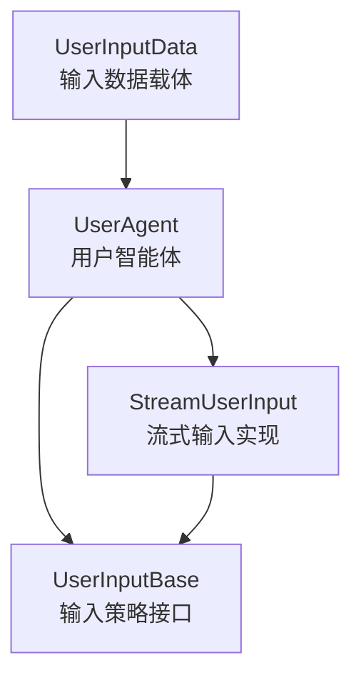
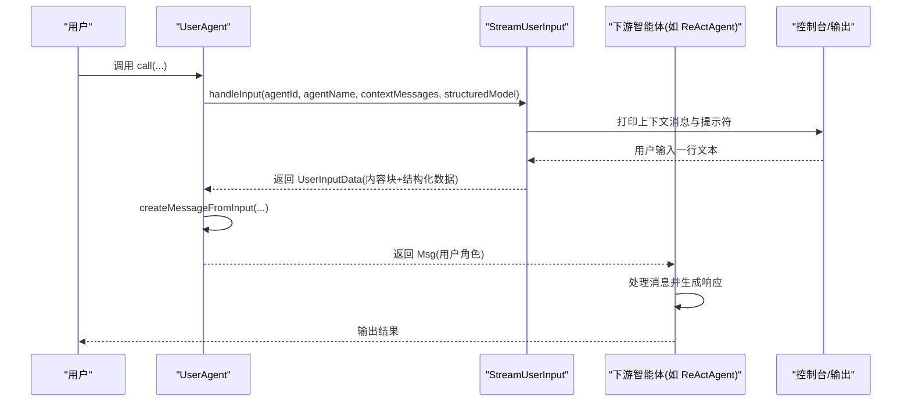
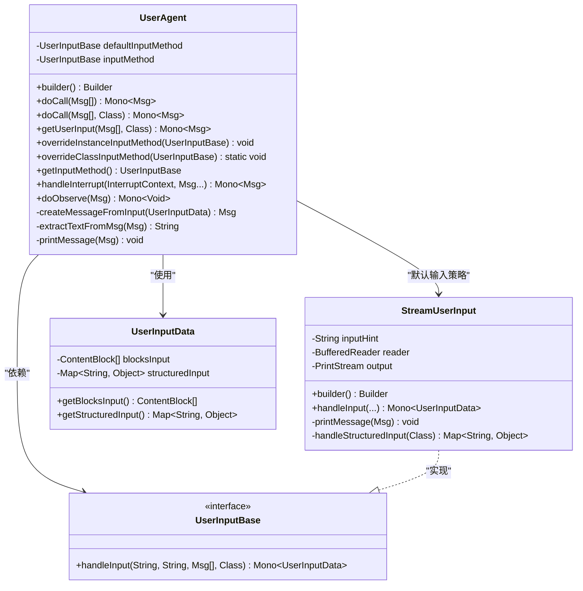
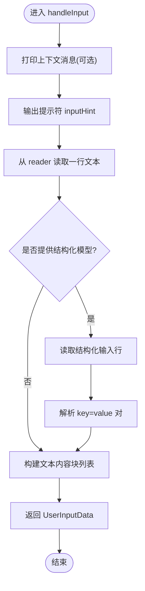
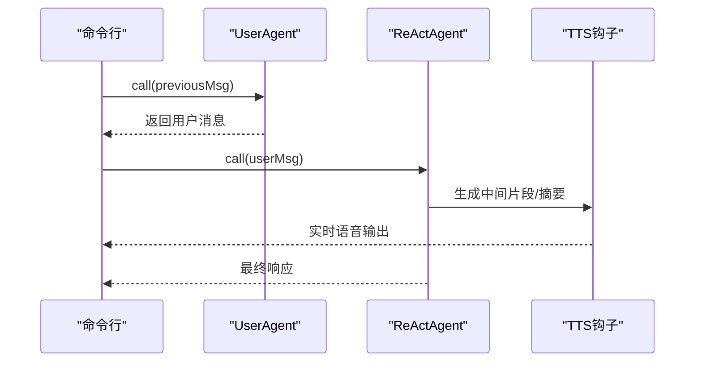
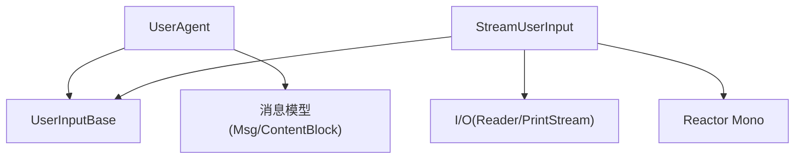

# 用户智能体 API

<cite>
**本文引用的文件**
- [UserAgent.java](file://agentscope-core/src/main/java/io/agentscope/core/agent/user/UserAgent.java)
- [StreamUserInput.java](file://agentscope-core/src/main/java/io/agentscope/core/agent/user/StreamUserInput.java)
- [UserInputBase.java](file://agentscope-core/src/main/java/io/agentscope/core/agent/user/UserInputBase.java)
- [UserInputData.java](file://agentscope-core/src/main/java/io/agentscope/core/agent/user/UserInputData.java)
- [ReActAgent.java](file://agentscope-core/src/main/java/io/agentscope/core/ReActAgent.java)
- [ReActAgentWithTTSDemo.java](file://agentscope-examples/chat-tts/src/main/java/io/agentscope/examples/chattts/ReActAgentWithTTSDemo.java)
- [agent.md](file://docs/en/quickstart/agent.md)
- [UserAgentTest.java](file://agentscope-core/src/test/java/io/agentscope/core/agent/user/UserAgentTest.java)
- [StreamUserInputTest.java](file://agentscope-core/src/test/java/io/agentscope/core/agent/user/StreamUserInputTest.java)
</cite>

## 目录
1. [简介](#简介)
2. [项目结构](#项目结构)
3. [核心组件](#核心组件)
4. [架构总览](#架构总览)
5. [详细组件分析](#详细组件分析)
6. [依赖分析](#依赖分析)
7. [性能考虑](#性能考虑)
8. [故障排查指南](#故障排查指南)
9. [结论](#结论)
10. [附录：最佳实践与用户体验优化](#附录最佳实践与用户体验优化)

## 简介
本文件为用户智能体（UserAgent）API的权威参考文档，面向需要在命令行、Web UI 或其他交互通道中收集用户输入的开发者。文档覆盖以下要点：
- UserAgent 的公共方法与配置项
- 同步输入与“流式”输入的实现机制
- StreamUserInput 的流式用户输入处理 API
- 具体的代码示例路径（以源码路径代替代码片段）
- 用户智能体与 ReAct 智能体的集成方式
- 用户交互的最佳实践与用户体验优化建议

## 项目结构
用户智能体相关的核心代码位于 agentscope-core 模块的 agent.user 包中，主要由以下类组成：
- UserAgent：用户智能体主体，负责从可插拔的输入策略中获取用户输入，并将其转换为消息对象
- StreamUserInput：基于流的默认输入实现，支持文本与键值对结构化输入
- UserInputBase：输入策略接口，定义统一的输入处理契约
- UserInputData：输入数据载体，同时承载内容块与结构化数据

图表来源
- [UserAgent.java:68-90](file://agentscope-core/src/main/java/io/agentscope/core/agent/user/UserAgent.java#L68-L90)
- [UserInputBase.java:28-42](file://agentscope-core/src/main/java/io/agentscope/core/agent/user/UserInputBase.java#L28-L42)
- [StreamUserInput.java:55-79](file://agentscope-core/src/main/java/io/agentscope/core/agent/user/StreamUserInput.java#L55-L79)
- [UserInputData.java:28-67](file://agentscope-core/src/main/java/io/agentscope/core/agent/user/UserInputData.java#L28-L67)

章节来源
- [UserAgent.java:1-356](file://agentscope-core/src/main/java/io/agentscope/core/agent/user/UserAgent.java#L1-L356)
- [StreamUserInput.java:1-256](file://agentscope-core/src/main/java/io/agentscope/core/agent/user/StreamUserInput.java#L1-L256)
- [UserInputBase.java:1-43](file://agentscope-core/src/main/java/io/agentscope/core/agent/user/UserInputBase.java#L1-L43)
- [UserInputData.java:1-68](file://agentscope-core/src/main/java/io/agentscope/core/agent/user/UserInputData.java#L1-L68)

## 核心组件
- UserAgent
  - 职责：接收外部用户输入，生成用户消息；支持实例级与类级输入策略覆盖；支持中断处理；支持钩子事件
  - 关键方法与配置项：
    - 构建器：builder()，支持 name、description、checkRunning、inputMethod、hooks
    - 输入方法：doCall(List<Msg>)、doCall(List<Msg>, Class<?>)、getUserInput(...)
    - 中断处理：handleInterrupt(...)
    - 输入策略管理：overrideInstanceInputMethod(...)、overrideClassInputMethod(...)、getInputMethod()
    - 观察行为：doObserve(...)（空实现）
  - 数据转换：createMessageFromInput(...) 将 UserInputData 转换为 Msg（含结构化元数据）

- StreamUserInput
  - 职责：从任意 InputStream 读取一行文本，打印上下文消息，支持结构化输入解析（键值对）
  - 关键方法与配置项：
    - 构建器：builder()，支持 inputHint、inputStream、outputStream
    - 输入处理：handleInput(...) 返回 Mono<UserInputData>
    - 结构化输入：handleStructuredInput(...) 解析 key=value 对
    - 输出格式化：printMessage(...) 打印消息到输出流

- UserInputBase
  - 职责：统一的输入策略接口，定义 handleInput(...) 契约

- UserInputData
  - 职责：承载输入内容块与结构化数据，用于消息构造与结构化输出

章节来源
- [UserAgent.java:70-133](file://agentscope-core/src/main/java/io/agentscope/core/agent/user/UserAgent.java#L70-L133)
- [UserAgent.java:143-165](file://agentscope-core/src/main/java/io/agentscope/core/agent/user/UserAgent.java#L143-L165)
- [UserAgent.java:205-269](file://agentscope-core/src/main/java/io/agentscope/core/agent/user/UserAgent.java#L205-L269)
- [StreamUserInput.java:94-131](file://agentscope-core/src/main/java/io/agentscope/core/agent/user/StreamUserInput.java#L94-L131)
- [StreamUserInput.java:169-192](file://agentscope-core/src/main/java/io/agentscope/core/agent/user/StreamUserInput.java#L169-L192)
- [UserInputBase.java:28-42](file://agentscope-core/src/main/java/io/agentscope/core/agent/user/UserInputBase.java#L28-L42)
- [UserInputData.java:28-67](file://agentscope-core/src/main/java/io/agentscope/core/agent/user/UserInputData.java#L28-L67)

## 架构总览
用户智能体通过可插拔的输入策略将用户输入转化为框架内的消息对象，供下游智能体（如 ReActAgent）消费。

图表来源
- [UserAgent.java:101-133](file://agentscope-core/src/main/java/io/agentscope/core/agent/user/UserAgent.java#L101-L133)
- [StreamUserInput.java:94-131](file://agentscope-core/src/main/java/io/agentscope/core/agent/user/StreamUserInput.java#L94-L131)
- [ReActAgent.java:108-136](file://agentscope-core/src/main/java/io/agentscope/core/ReActAgent.java#L108-L136)

## 详细组件分析

### UserAgent 类分析
- 设计要点
  - 使用可插拔的 UserInputBase 实现输入策略，默认使用 StreamUserInput
  - 支持结构化输出模式，将结构化数据写入消息元数据
  - 提供实例级与类级输入策略覆盖能力
  - 中断时返回用户角色的中断消息
- 关键流程
  - doCall(...) -> getUserInput(...) -> inputMethod.handleInput(...) -> createMessageFromInput(...) -> printMessage(...)

图表来源
- [UserAgent.java:68-133](file://agentscope-core/src/main/java/io/agentscope/core/agent/user/UserAgent.java#L68-L133)
- [UserInputBase.java:28-42](file://agentscope-core/src/main/java/io/agentscope/core/agent/user/UserInputBase.java#L28-L42)
- [StreamUserInput.java:55-131](file://agentscope-core/src/main/java/io/agentscope/core/agent/user/StreamUserInput.java#L55-L131)
- [UserInputData.java:28-67](file://agentscope-core/src/main/java/io/agentscope/core/agent/user/UserInputData.java#L28-L67)

章节来源
- [UserAgent.java:70-133](file://agentscope-core/src/main/java/io/agentscope/core/agent/user/UserAgent.java#L70-L133)
- [UserAgent.java:143-165](file://agentscope-core/src/main/java/io/agentscope/core/agent/user/UserAgent.java#L143-L165)
- [UserAgent.java:205-269](file://agentscope-core/src/main/java/io/agentscope/core/agent/user/UserAgent.java#L205-L269)

### StreamUserInput 流式输入处理 API
- 功能特性
  - 默认使用 System.in/System.out，支持自定义输入输出流
  - 支持在提示前打印上下文消息
  - 支持结构化输入解析（键值对），便于表单或参数输入
  - 在有界弹性调度器上执行阻塞 I/O，保持响应式兼容
- 关键点
  - 构建器支持设置 inputHint、inputStream、outputStream
  - handleInput(...) 返回 Mono<UserInputData>，内部进行线程切换
  - printMessage(...) 仅打印文本块内容
  - handleStructuredInput(...) 解析 key=value 对，支持多组逗号分隔

图表来源
- [StreamUserInput.java:94-131](file://agentscope-core/src/main/java/io/agentscope/core/agent/user/StreamUserInput.java#L94-L131)
- [StreamUserInput.java:169-192](file://agentscope-core/src/main/java/io/agentscope/core/agent/user/StreamUserInput.java#L169-L192)

章节来源
- [StreamUserInput.java:55-131](file://agentscope-core/src/main/java/io/agentscope/core/agent/user/StreamUserInput.java#L55-L131)
- [StreamUserInput.java:169-192](file://agentscope-core/src/main/java/io/agentscope/core/agent/user/StreamUserInput.java#L169-L192)

### 同步输入与“流式”输入机制
- 同步输入
  - UserAgent.doCall(...) 直接调用 getUserInput(...)，后者委托当前输入策略
  - StreamUserInput.handleInput(...) 在有界弹性调度器上执行阻塞 I/O，最终返回 Mono<UserInputData>
  - 因为 Mono 是响应式的，但底层 I/O 是阻塞的，所以通过 subscribeOn(Schedulers.boundedElastic()) 保证非阻塞体验
- “流式”输入
  - 当前 UserAgent 的输入处理并非实时流式输出（如 ReAct 的推理/行动流），而是“一次性”收集用户输入
  - 若需在 ReAct 中实现“流式”输出，可结合 ReAct 的钩子系统与 TTS 钩子等扩展（见后文集成示例）

章节来源
- [UserAgent.java:101-133](file://agentscope-core/src/main/java/io/agentscope/core/agent/user/UserAgent.java#L101-L133)
- [StreamUserInput.java:94-131](file://agentscope-core/src/main/java/io/agentscope/core/agent/user/StreamUserInput.java#L94-L131)

### 与 ReAct 智能体的集成
- 集成方式
  - 使用 UserAgent 收集用户输入，然后将输入消息传递给 ReActAgent 进行处理
  - 可在 ReActAgent 上挂载钩子（如 TTS 钩子）实现语音播报与自动打断
- 示例路径
  - 交互式 CLI 示例：ReActAgentWithTTSDemo，演示了 UserAgent 与 ReActAgent 的循环交互
- 关键点
  - ReActAgent 支持结构化输出能力，可与 UserAgent 的结构化输入配合使用
  - ReActAgent 的钩子系统可用于增强用户体验（如 TTS、日志、观测）

图表来源
- [ReActAgentWithTTSDemo.java:77-88](file://agentscope-examples/chat-tts/src/main/java/io/agentscope/examples/chattts/ReActAgentWithTTSDemo.java#L77-L88)
- [ReActAgent.java:108-136](file://agentscope-core/src/main/java/io/agentscope/core/ReActAgent.java#L108-L136)

章节来源
- [ReActAgentWithTTSDemo.java:1-93](file://agentscope-examples/chat-tts/src/main/java/io/agentscope/examples/chattts/ReActAgentWithTTSDemo.java#L1-L93)
- [ReActAgent.java:108-136](file://agentscope-core/src/main/java/io/agentscope/core/ReActAgent.java#L108-L136)

## 依赖分析
- 组件耦合
  - UserAgent 依赖 UserInputBase 接口，通过组合实现解耦
  - StreamUserInput 实现 UserInputBase，作为默认输入策略
  - UserAgent 依赖消息模型（Msg、ContentBlock 等）进行消息构造
- 外部依赖
  - Reactor（Mono/Flux）用于响应式编程
  - 有界弹性调度器用于阻塞 I/O 的线程隔离

图表来源
- [UserAgent.java:68-90](file://agentscope-core/src/main/java/io/agentscope/core/agent/user/UserAgent.java#L68-L90)
- [StreamUserInput.java:55-79](file://agentscope-core/src/main/java/io/agentscope/core/agent/user/StreamUserInput.java#L55-L79)

章节来源
- [UserAgent.java:68-90](file://agentscope-core/src/main/java/io/agentscope/core/agent/user/UserAgent.java#L68-L90)
- [StreamUserInput.java:55-79](file://agentscope-core/src/main/java/io/agentscope/core/agent/user/StreamUserInput.java#L55-L79)

## 性能考虑
- I/O 阻塞与响应式兼容
  - StreamUserInput 的读取操作在有界弹性调度器上执行，避免阻塞主线程
- 线程模型
  - 使用 boundedElastic 调度器平衡吞吐与资源占用
- 内存与对象创建
  - UserInputData 仅承载必要字段，避免额外拷贝
  - UserAgent 在消息构造时按需创建内容块

[本节为通用指导，不直接分析具体文件]

## 故障排查指南
- 常见问题与定位
  - 输入为空或 EOF：StreamUserInput 在输入为 null 时会回退为空字符串，检查输入流是否正确关闭或提前结束
  - 结构化输入解析失败：handleStructuredInput(...) 仅解析 key=value 对，确保输入格式正确
  - 输入策略覆盖异常：实例级覆盖需非空；类级覆盖会影响后续实例
  - 中断行为：UserAgent 的中断返回用户角色的中断消息，确认上游是否正确处理该消息
- 单元测试参考
  - UserAgentTest：覆盖构造、输入策略覆盖、钩子集成、中断处理等场景
  - StreamUserInputTest：覆盖默认构造、自定义流、结构化输入、边界情况等

章节来源
- [UserAgentTest.java:49-550](file://agentscope-core/src/test/java/io/agentscope/core/agent/user/UserAgentTest.java#L49-L550)
- [StreamUserInputTest.java:36-531](file://agentscope-core/src/test/java/io/agentscope/core/agent/user/StreamUserInputTest.java#L36-L531)

## 结论
UserAgent 通过可插拔的输入策略实现了灵活的用户输入采集，结合 StreamUserInput 的流式 I/O 与结构化输入能力，能够满足命令行、Web UI 等多种交互场景。与 ReAct 智能体的结合可通过钩子系统进一步提升用户体验（如实时语音播报）。建议在生产环境中合理配置输入策略、关注中断与错误处理，并利用单元测试验证关键行为。

[本节为总结性内容，不直接分析具体文件]

## 附录：最佳实践与用户体验优化
- 输入策略选择
  - 命令行：使用默认 StreamUserInput；若需自定义提示符或流，通过构建器配置
  - Web UI：实现自定义 UserInputBase，将 WebSocket/HTTP 请求映射为 handleInput(...)
- 结构化输入
  - 明确字段与类型，提供清晰的提示与示例
  - 对于可选字段，允许用户直接回车跳过
- 中断与恢复
  - 在用户输入阶段支持中断，返回明确的中断消息，便于上层逻辑终止等待
- 与 ReAct 集成
  - 使用钩子系统实现 TTS、日志、观测等功能
  - 在循环交互中，注意消息的流转与退出条件（如“exit”关键字）
- 示例参考
  - 快速开始示例：UserAgent 的基本用法
  - TTS 集成示例：UserAgent 与 ReActAgent 的循环交互与 TTS 钩子

章节来源
- [agent.md:177-187](file://docs/en/quickstart/agent.md#L177-L187)
- [ReActAgentWithTTSDemo.java:77-88](file://agentscope-examples/chat-tts/src/main/java/io/agentscope/examples/chattts/ReActAgentWithTTSDemo.java#L77-L88)