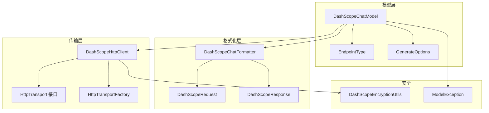
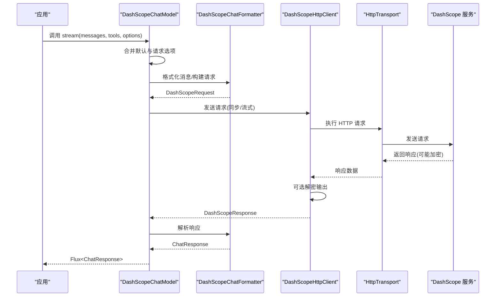
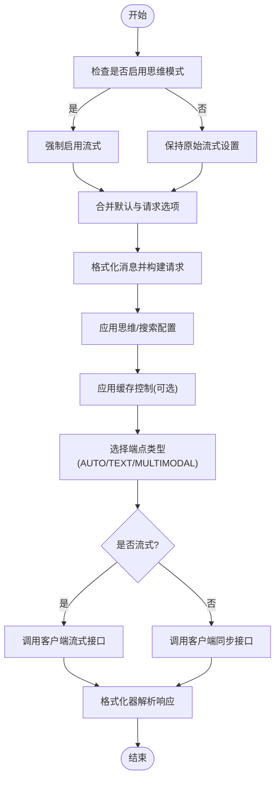
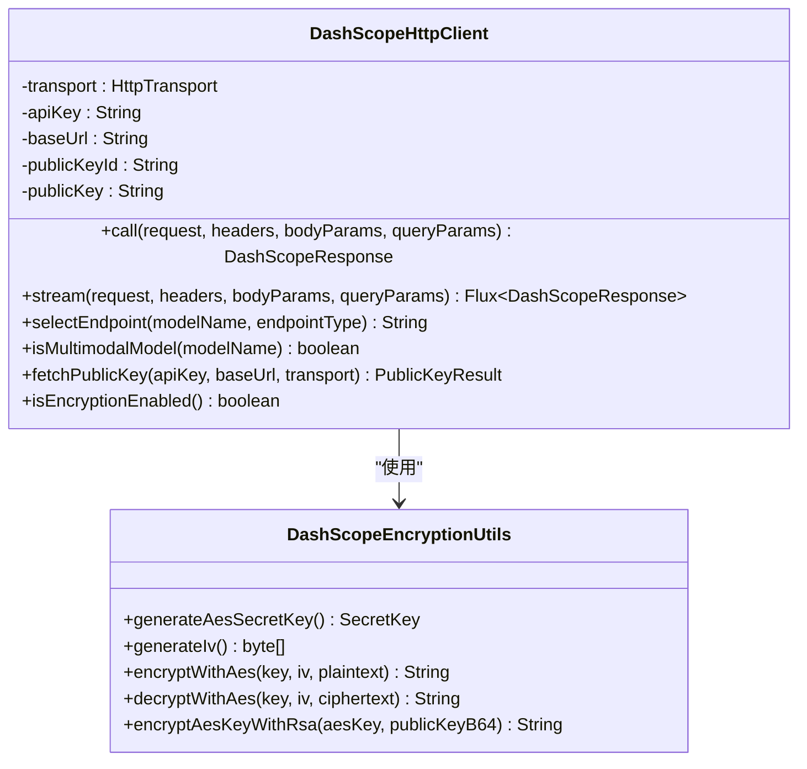
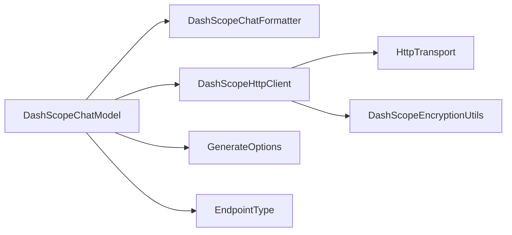

# DashScope 模型集成

<cite>
**本文引用的文件**
- [DashScopeChatModel.java](file://agentscope-core/src/main/java/io/agentscope/core/model/DashScopeChatModel.java)
- [DashScopeHttpClient.java](file://agentscope-core/src/main/java/io/agentscope/core/model/DashScopeHttpClient.java)
- [DashScopeEncryptionUtils.java](file://agentscope-core/src/main/java/io/agentscope/core/model/DashScopeEncryptionUtils.java)
- [DashScopeChatFormatter.java](file://agentscope-core/src/main/java/io/agentscope/core/formatter/dashscope/DashScopeChatFormatter.java)
- [DashScopeRequest.java](file://agentscope-core/src/main/java/io/agentscope/core/formatter/dashscope/dto/DashScopeRequest.java)
- [DashScopeResponse.java](file://agentscope-core/src/main/java/io/agentscope/core/formatter/dashscope/dto/DashScopeResponse.java)
- [EndpointType.java](file://agentscope-core/src/main/java/io/agentscope/core/model/EndpointType.java)
- [GenerateOptions.java](file://agentscope-core/src/main/java/io/agentscope/core/model/GenerateOptions.java)
- [ChatModelBase.java](file://agentscope-core/src/main/java/io/agentscope/core/model/ChatModelBase.java)
- [HttpTransport.java](file://agentscope-core/src/main/java/io/agentscope/core/model/transport/HttpTransport.java)
- [HttpTransportFactory.java](file://agentscope-core/src/main/java/io/agentscope/core/model/transport/HttpTransportFactory.java)
- [ModelException.java](file://agentscope-core/src/main/java/io/agentscope/core/model/ModelException.java)
- [DashScopeChatModelTest.java](file://agentscope-core/src/test/java/io/agentscope/core/model/DashScopeChatModelTest.java)
</cite>

## 目录
1. [简介](#简介)
2. [项目结构](#项目结构)
3. [核心组件](#核心组件)
4. [架构总览](#架构总览)
5. [详细组件分析](#详细组件分析)
6. [依赖分析](#依赖分析)
7. [性能考量](#性能考量)
8. [故障排查指南](#故障排查指南)
9. [结论](#结论)
10. [附录](#附录)

## 简介
本文件面向 AgentScope Java 中的 DashScope 模型集成，聚焦于 DashScopeChatModel 的实现与配置、通义千问系列模型的使用方法与参数、DashScope API 密钥与认证、加密工具类的安全使用、流式响应与错误处理机制，并提供不同模型变体的性能对比与选择建议，以及调试与监控集成的实用技巧。

## 项目结构
DashScope 集成位于 agentscope-core 模块中，采用“模型层 + 格式化层 + 传输层”的分层设计：
- 模型层：DashScopeChatModel 负责对外暴露统一的聊天模型接口，内部协调格式化器与 HTTP 客户端。
- 格式化层：DashScopeChatFormatter 将 AgentScope 的消息对象转换为 DashScope 请求/响应结构。
- 传输层：HttpTransport 抽象网络请求；HttpTransportFactory 提供默认与生命周期管理。
- 加密与安全：DashScopeEncryptionUtils 提供 AES-GCM 与 RSA 加密工具；DashScopeHttpClient 支持按需启用加密协议。

图示来源
- [DashScopeChatModel.java:52-167](file://agentscope-core/src/main/java/io/agentscope/core/model/DashScopeChatModel.java#L52-L167)
- [DashScopeChatFormatter.java:42-173](file://agentscope-core/src/main/java/io/agentscope/core/formatter/dashscope/DashScopeChatFormatter.java#L42-L173)
- [DashScopeHttpClient.java:62-141](file://agentscope-core/src/main/java/io/agentscope/core/model/DashScopeHttpClient.java#L62-L141)
- [HttpTransport.java:33-62](file://agentscope-core/src/main/java/io/agentscope/core/model/transport/HttpTransport.java#L33-L62)
- [HttpTransportFactory.java:54-192](file://agentscope-core/src/main/java/io/agentscope/core/model/transport/HttpTransportFactory.java#L54-L192)
- [DashScopeEncryptionUtils.java:42-181](file://agentscope-core/src/main/java/io/agentscope/core/model/DashScopeEncryptionUtils.java#L42-L181)
- [EndpointType.java:33-52](file://agentscope-core/src/main/java/io/agentscope/core/model/EndpointType.java#L33-L52)
- [GenerateOptions.java:31-95](file://agentscope-core/src/main/java/io/agentscope/core/model/GenerateOptions.java#L31-L95)
- [ModelException.java:22-118](file://agentscope-core/src/main/java/io/agentscope/core/model/ModelException.java#L22-L118)

章节来源
- [DashScopeChatModel.java:52-167](file://agentscope-core/src/main/java/io/agentscope/core/model/DashScopeChatModel.java#L52-L167)
- [DashScopeHttpClient.java:62-141](file://agentscope-core/src/main/java/io/agentscope/core/model/DashScopeHttpClient.java#L62-L141)
- [DashScopeChatFormatter.java:42-173](file://agentscope-core/src/main/java/io/agentscope/core/formatter/dashscope/DashScopeChatFormatter.java#L42-L173)
- [HttpTransport.java:33-62](file://agentscope-core/src/main/java/io/agentscope/core/model/transport/HttpTransport.java#L33-L62)
- [HttpTransportFactory.java:54-192](file://agentscope-core/src/main/java/io/agentscope/core/model/transport/HttpTransportFactory.java#L54-L192)
- [DashScopeEncryptionUtils.java:42-181](file://agentscope-core/src/main/java/io/agentscope/core/model/DashScopeEncryptionUtils.java#L42-L181)
- [EndpointType.java:33-52](file://agentscope-core/src/main/java/io/agentscope/core/model/EndpointType.java#L33-L52)
- [GenerateOptions.java:31-95](file://agentscope-core/src/main/java/io/agentscope/core/model/GenerateOptions.java#L31-L95)
- [ModelException.java:22-118](file://agentscope-core/src/main/java/io/agentscope/core/model/ModelException.java#L22-L118)

## 核心组件
- DashScopeChatModel：统一的聊天模型入口，支持文本与视觉模型自动路由、工具调用、思维模式、缓存控制、超时与重试等。
- DashScopeHttpClient：原生 HTTP 客户端，负责同步/流式请求、SSE 解析、端点选择、可选加密头与数据加解密。
- DashScopeChatFormatter：消息格式化器，将 AgentScope Msg 转换为 DashScope 请求/响应结构，支持多模态与工具调用。
- DashScopeEncryptionUtils：加密工具集，提供 AES-GCM 对称加密与 RSA 公钥封装对称密钥的能力。
- GenerateOptions：生成参数与连接级配置（如温度、topP、最大令牌数、思考预算、执行配置、附加头部/查询/请求体参数）。
- EndpointType：端点类型枚举，支持 AUTO、TEXT、MULTIMODAL 三种策略。
- HttpTransport/HttpTransportFactory：抽象传输层与工厂，提供默认传输实例与 JVM 关闭钩子清理。

章节来源
- [DashScopeChatModel.java:52-167](file://agentscope-core/src/main/java/io/agentscope/core/model/DashScopeChatModel.java#L52-L167)
- [DashScopeHttpClient.java:62-141](file://agentscope-core/src/main/java/io/agentscope/core/model/DashScopeHttpClient.java#L62-L141)
- [DashScopeChatFormatter.java:42-173](file://agentscope-core/src/main/java/io/agentscope/core/formatter/dashscope/DashScopeChatFormatter.java#L42-L173)
- [DashScopeEncryptionUtils.java:42-181](file://agentscope-core/src/main/java/io/agentscope/core/model/DashScopeEncryptionUtils.java#L42-L181)
- [GenerateOptions.java:31-95](file://agentscope-core/src/main/java/io/agentscope/core/model/GenerateOptions.java#L31-L95)
- [EndpointType.java:33-52](file://agentscope-core/src/main/java/io/agentscope/core/model/EndpointType.java#L33-L52)
- [HttpTransport.java:33-62](file://agentscope-core/src/main/java/io/agentscope/core/model/transport/HttpTransport.java#L33-L62)
- [HttpTransportFactory.java:54-192](file://agentscope-core/src/main/java/io/agentscope/core/model/transport/HttpTransportFactory.java#L54-L192)

## 架构总览
DashScopeChatModel 通过格式化器将消息转为 DashScope 请求，再交由 DashScopeHttpClient 发送 HTTP 请求。根据模型名或显式端点类型选择文本或多模态端点；在开启加密时，客户端会自动生成 AES 密钥与 IV，用 RSA 公钥加密 AES 密钥并通过加密头传递，同时对 input/output 进行加解密。

图示来源
- [DashScopeChatModel.java:194-315](file://agentscope-core/src/main/java/io/agentscope/core/model/DashScopeChatModel.java#L194-L315)
- [DashScopeChatFormatter.java:71-173](file://agentscope-core/src/main/java/io/agentscope/core/formatter/dashscope/DashScopeChatFormatter.java#L71-L173)
- [DashScopeHttpClient.java:165-307](file://agentscope-core/src/main/java/io/agentscope/core/model/DashScopeHttpClient.java#L165-L307)
- [HttpTransport.java:33-62](file://agentscope-core/src/main/java/io/agentscope/core/model/transport/HttpTransport.java#L33-L62)

## 详细组件分析

### DashScopeChatModel 实现与配置
- 自动端点路由：根据模型名或显式 EndpointType 决定使用文本生成还是多模态生成端点。
- 思维模式与搜索增强：支持 enableThinking 与 enableSearch；当启用思维模式时强制开启流式输出。
- 生成选项合并：doStream 中将请求选项与默认选项合并，再应用到 HTTP 请求。
- 流式与非流式：流式模式直接映射客户端的流式接口；非流式模式在弹性线程池上执行并包装异常为 ModelException。
- 缓存控制：当开启缓存控制时，格式化器会在系统消息与最后一条消息上添加临时缓存标记。
- 错误处理：捕获 HTTP 客户端异常并转换为统一的 ModelException，便于上层处理。

图示来源
- [DashScopeChatModel.java:194-315](file://agentscope-core/src/main/java/io/agentscope/core/model/DashScopeChatModel.java#L194-L315)
- [DashScopeChatFormatter.java:174-197](file://agentscope-core/src/main/java/io/agentscope/core/formatter/dashscope/DashScopeChatFormatter.java#L174-L197)

章节来源
- [DashScopeChatModel.java:52-167](file://agentscope-core/src/main/java/io/agentscope/core/model/DashScopeChatModel.java#L52-L167)
- [DashScopeChatModel.java:194-315](file://agentscope-core/src/main/java/io/agentscope/core/model/DashScopeChatModel.java#L194-L315)
- [DashScopeChatFormatter.java:174-197](file://agentscope-core/src/main/java/io/agentscope/core/formatter/dashscope/DashScopeChatFormatter.java#L174-L197)

### DashScopeHttpClient：端点选择与加密
- 端点选择：isMultimodalModel 与 selectEndpoint 根据模型名与 EndpointType 判定使用文本或多模态端点。
- 加密流程：当启用加密时，客户端在请求前对 input 字段进行 AES-GCM 加密，用 RSA 公钥加密 AES 密钥并通过加密头传递；响应返回时尝试解密 output。
- 公钥获取：提供 fetchPublicKey 方法从 DashScope 获取最新公钥与公钥 ID。
- 流式与非流式：stream 与 call 分别处理 SSE 事件与同步响应；均包含错误检测与异常转换。

图示来源
- [DashScopeHttpClient.java:62-141](file://agentscope-core/src/main/java/io/agentscope/core/model/DashScopeHttpClient.java#L62-L141)
- [DashScopeHttpClient.java:436-484](file://agentscope-core/src/main/java/io/agentscope/core/model/DashScopeHttpClient.java#L436-L484)
- [DashScopeEncryptionUtils.java:42-181](file://agentscope-core/src/main/java/io/agentscope/core/model/DashScopeEncryptionUtils.java#L42-L181)

章节来源
- [DashScopeHttpClient.java:317-422](file://agentscope-core/src/main/java/io/agentscope/core/model/DashScopeHttpClient.java#L317-L422)
- [DashScopeHttpClient.java:436-484](file://agentscope-core/src/main/java/io/agentscope/core/model/DashScopeHttpClient.java#L436-L484)
- [DashScopeEncryptionUtils.java:42-181](file://agentscope-core/src/main/java/io/agentscope/core/model/DashScopeEncryptionUtils.java#L42-L181)

### DashScopeChatFormatter：消息与工具处理
- 多模态支持：formatMultiModal 强制将消息视为多模态内容以适配多模态端点。
- 请求构建：buildRequest 支持仅模型名与消息列表，也支持完整配置（含工具、工具选择、选项）。
- 工具与工具选择：applyTools 与 applyToolChoice 将工具定义与工具选择策略写入参数。
- 缓存控制：applyCacheControl 在系统消息与最后一条消息上添加临时缓存标记。

章节来源
- [DashScopeChatFormatter.java:119-197](file://agentscope-core/src/main/java/io/agentscope/core/formatter/dashscope/DashScopeChatFormatter.java#L119-L197)
- [DashScopeChatFormatter.java:133-173](file://agentscope-core/src/main/java/io/agentscope/core/formatter/dashscope/DashScopeChatFormatter.java#L133-L173)

### 数据模型：DashScopeRequest 与 DashScopeResponse
- DashScopeRequest：包含 model、input（消息列表）、parameters（生成参数）与 endpointType（内部字段，不序列化）。
- DashScopeResponse：包含 request_id、output（choices 与可选加密字符串）、usage、错误码与消息；提供 isError 判断与自定义反序列化处理加密输出。

章节来源
- [DashScopeRequest.java:43-161](file://agentscope-core/src/main/java/io/agentscope/core/formatter/dashscope/dto/DashScopeRequest.java#L43-L161)
- [DashScopeResponse.java:48-162](file://agentscope-core/src/main/java/io/agentscope/core/formatter/dashscope/dto/DashScopeResponse.java#L48-L162)

### 生成选项与端点类型
- GenerateOptions：集中管理温度、topP、最大令牌数、思考预算、执行配置、工具选择、缓存控制、附加头部/查询/请求体参数等。
- EndpointType：AUTO（自动）、TEXT（强制文本）、MULTIMODAL（强制多模态），用于覆盖模型名推断。

章节来源
- [GenerateOptions.java:31-95](file://agentscope-core/src/main/java/io/agentscope/core/model/GenerateOptions.java#L31-L95)
- [EndpointType.java:33-52](file://agentscope-core/src/main/java/io/agentscope/core/model/EndpointType.java#L33-L52)

### 传输层与生命周期管理
- HttpTransport：抽象同步与流式请求接口。
- HttpTransportFactory：提供默认传输实例、注册/注销与 JVM 关闭钩子自动清理。

章节来源
- [HttpTransport.java:33-62](file://agentscope-core/src/main/java/io/agentscope/core/model/transport/HttpTransport.java#L33-L62)
- [HttpTransportFactory.java:54-192](file://agentscope-core/src/main/java/io/agentscope/core/model/transport/HttpTransportFactory.java#L54-L192)

## 依赖分析
- 组件内聚与耦合：
  - DashScopeChatModel 与 DashScopeChatFormatter、DashScopeHttpClient 高内聚，通过接口与 DTO 松耦合。
  - DashScopeHttpClient 依赖 HttpTransport 抽象，便于替换实现。
  - 加密工具独立于业务逻辑，仅在需要时被 DashScopeHttpClient 使用。
- 外部依赖与集成点：
  - 通过 HttpTransportFactory 默认注入传输实现，支持共享与生命周期管理。
  - 通过 GenerateOptions 的附加参数扩展能力，满足不同模型提供商的差异化需求。

图示来源
- [DashScopeChatModel.java:52-167](file://agentscope-core/src/main/java/io/agentscope/core/model/DashScopeChatModel.java#L52-L167)
- [DashScopeHttpClient.java:62-141](file://agentscope-core/src/main/java/io/agentscope/core/model/DashScopeHttpClient.java#L62-L141)
- [DashScopeChatFormatter.java:42-173](file://agentscope-core/src/main/java/io/agentscope/core/formatter/dashscope/DashScopeChatFormatter.java#L42-L173)
- [GenerateOptions.java:31-95](file://agentscope-core/src/main/java/io/agentscope/core/model/GenerateOptions.java#L31-L95)
- [EndpointType.java:33-52](file://agentscope-core/src/main/java/io/agentscope/core/model/EndpointType.java#L33-L52)

## 性能考量
- 流式输出：开启流式可降低首字延迟，适合实时对话场景；非流式适合批处理与结果聚合。
- 端点选择：视觉/多模态模型必须使用多模态端点；文本模型使用文本端点，避免不必要的开销。
- 加密开销：启用加密会增加 CPU 开销与往返次数，仅在需要合规性或安全策略时启用。
- 传输复用：通过 HttpTransportFactory 共享默认传输实例，减少连接与线程开销。
- 超时与重试：合理配置 GenerateOptions 的执行配置，平衡稳定性与延迟。

## 故障排查指南
- 认证失败：确认 API Key 正确且未过期；检查 baseUrl 是否指向 DashScope 正确区域。
- 端点选择错误：若模型名匹配不到预期端点，显式设置 EndpointType 或调整模型名。
- 思维模式异常：启用思维模式时必须流式；若设置了思考预算但未启用思维模式，将抛出非法状态异常。
- 加密异常：公钥获取失败或解密失败时，客户端会记录错误并回退；检查网络连通性与公钥有效性。
- 错误处理：所有模型异常统一包装为 ModelException，便于上层捕获与分类处理。

章节来源
- [DashScopeChatModel.java:320-345](file://agentscope-core/src/main/java/io/agentscope/core/model/DashScopeChatModel.java#L320-L345)
- [DashScopeHttpClient.java:165-227](file://agentscope-core/src/main/java/io/agentscope/core/model/DashScopeHttpClient.java#L165-L227)
- [DashScopeHttpClient.java:238-307](file://agentscope-core/src/main/java/io/agentscope/core/model/DashScopeHttpClient.java#L238-L307)
- [ModelException.java:22-118](file://agentscope-core/src/main/java/io/agentscope/core/model/ModelException.java#L22-L118)

## 结论
DashScopeChatModel 通过清晰的分层设计与灵活的配置选项，实现了对通义千问系列模型的统一接入。结合 DashScopeHttpClient 的端点路由与可选加密能力，以及 DashScopeChatFormatter 的消息与工具处理，能够满足从基础对话到复杂多模态任务的需求。建议在生产环境中启用流式输出、合理配置超时与重试，并按需启用加密以满足企业安全要求。

## 附录

### 通义千问模型使用与参数配置要点
- 模型命名与端点：根据模型名自动判断多模态/文本端点；必要时显式设置 EndpointType。
- 生成参数：通过 GenerateOptions 设置温度、topP、最大令牌数、思考预算等。
- 工具调用：通过工具定义与工具选择策略启用函数调用。
- 缓存控制：开启后自动在系统消息与最后一条消息上添加临时缓存标记，提升后续请求性能。

章节来源
- [DashScopeHttpClient.java:317-422](file://agentscope-core/src/main/java/io/agentscope/core/model/DashScopeHttpClient.java#L317-L422)
- [GenerateOptions.java:31-95](file://agentscope-core/src/main/java/io/agentscope/core/model/GenerateOptions.java#L31-L95)
- [DashScopeChatFormatter.java:174-197](file://agentscope-core/src/main/java/io/agentscope/core/formatter/dashscope/DashScopeChatFormatter.java#L174-L197)

### DashScope API 密钥与认证配置
- 基础配置：在 DashScopeChatModel.Builder 中设置 apiKey 与 baseUrl。
- 加密模式：启用 enableEncrypt 后，客户端会自动拉取最新公钥并进行请求/响应加解密。
- 公钥获取：可通过 DashScopeHttpClient.fetchPublicKey 显式获取公钥与公钥 ID。

章节来源
- [DashScopeChatModel.java:557-586](file://agentscope-core/src/main/java/io/agentscope/core/model/DashScopeChatModel.java#L557-L586)
- [DashScopeHttpClient.java:436-484](file://agentscope-core/src/main/java/io/agentscope/core/model/DashScopeHttpClient.java#L436-L484)

### 加密工具类使用与安全考虑
- AES-GCM：用于对 input/output 进行对称加密；IV 长度与标签长度固定，确保随机性。
- RSA 加密：用 Base64 编码的 RSA 公钥加密 AES 密钥；加密头包含公钥 ID、加密后的 AES 密钥与 IV。
- 安全建议：仅在满足合规要求时启用加密；定期轮换公钥；限制公钥下载权限；避免在日志中打印敏感信息。

章节来源
- [DashScopeEncryptionUtils.java:42-181](file://agentscope-core/src/main/java/io/agentscope/core/model/DashScopeEncryptionUtils.java#L42-L181)
- [DashScopeHttpClient.java:587-686](file://agentscope-core/src/main/java/io/agentscope/core/model/DashScopeHttpClient.java#L587-L686)

### 流式响应与错误处理机制
- 流式处理：客户端在流式模式下启用增量输出，逐条解析 SSE 事件；遇到错误时直接抛出异常。
- 非流式处理：在独立线程池中执行同步请求，异常统一包装为 ModelException。
- 超时与重试：通过 GenerateOptions 的执行配置统一应用超时与重试策略。

章节来源
- [DashScopeChatModel.java:283-315](file://agentscope-core/src/main/java/io/agentscope/core/model/DashScopeChatModel.java#L283-L315)
- [DashScopeHttpClient.java:238-307](file://agentscope-core/src/main/java/io/agentscope/core/model/DashScopeHttpClient.java#L238-L307)
- [GenerateOptions.java:380-484](file://agentscope-core/src/main/java/io/agentscope/core/model/GenerateOptions.java#L380-L484)

### 不同模型变体的性能对比与选择建议
- 文本模型：适用于纯文本对话与推理，端点选择文本端点，延迟低、成本低。
- 视觉/多模态模型：适用于图文/视频理解与生成，端点选择多模态端点，吞吐略低但功能更强。
- 思维模式：在需要展示推理过程时启用，会增加输出长度与耗时，适合复杂推理任务。
- 加密模式：在合规要求严格的企业环境中启用，会带来额外 CPU 与网络开销。

### 调试与监控 DashScope 集成的实用技巧
- 日志级别：在 DEBUG 级别查看请求/响应详情与端点选择信息。
- 附加参数：通过 GenerateOptions 的附加头部/查询/请求体参数注入追踪与审计信息。
- 单元测试：参考 DashScopeChatModelTest 中的 MockWebServer 用法，快速验证集成行为。

章节来源
- [DashScopeChatModelTest.java:64-200](file://agentscope-core/src/test/java/io/agentscope/core/model/DashScopeChatModelTest.java#L64-L200)