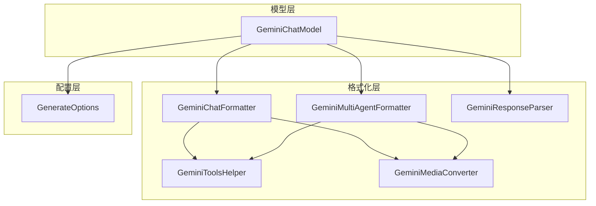
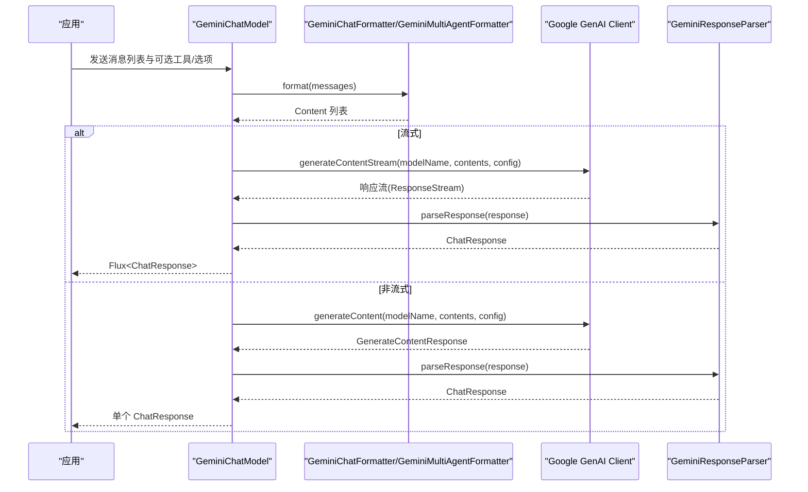
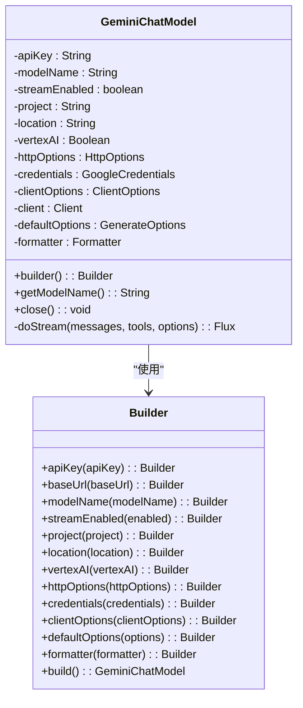
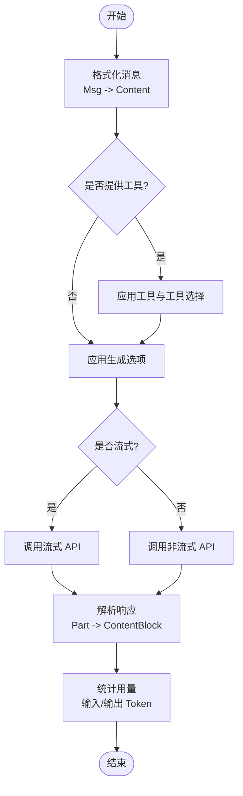
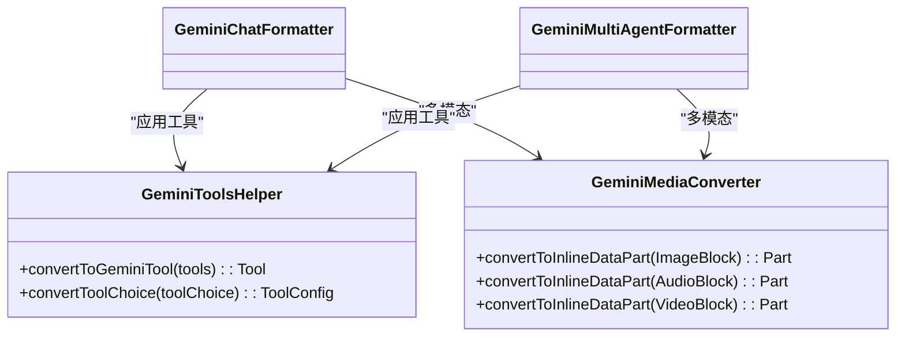
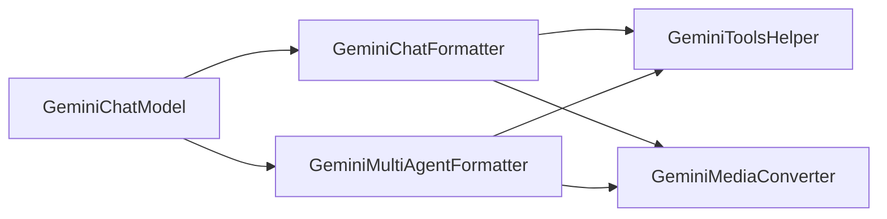

# Gemini 模型集成

<cite>
**本文引用的文件**
- [GeminiChatModel.java](file://agentscope-core/src/main/java/io/agentscope/core/model/GeminiChatModel.java)
- [GeminiChatFormatter.java](file://agentscope-core/src/main/java/io/agentscope/core/formatter/gemini/GeminiChatFormatter.java)
- [GeminiMultiAgentFormatter.java](file://agentscope-core/src/main/java/io/agentscope/core/formatter/gemini/GeminiMultiAgentFormatter.java)
- [GeminiResponseParser.java](file://agentscope-core/src/main/java/io/agentscope/core/formatter/gemini/GeminiResponseParser.java)
- [GeminiToolsHelper.java](file://agentscope-core/src/main/java/io/agentscope/core/formatter/gemini/GeminiToolsHelper.java)
- [GeminiMediaConverter.java](file://agentscope-core/src/main/java/io/agentscope/core/formatter/gemini/GeminiMediaConverter.java)
- [GenerateOptions.java](file://agentscope-core/src/main/java/io/agentscope/core/model/GenerateOptions.java)
- [GeminiChatModelTest.java](file://agentscope-core/src/test/java/io/agentscope/core/model/GeminiChatModelTest.java)
- [GeminiProvider.java](file://agentscope-core/src/test/java/io/agentscope/core/e2e/providers/GeminiProvider.java)
</cite>

## 目录
1. [简介](#简介)
2. [项目结构](#项目结构)
3. [核心组件](#核心组件)
4. [架构总览](#架构总览)
5. [详细组件分析](#详细组件分析)
6. [依赖分析](#依赖分析)
7. [性能考虑](#性能考虑)
8. [故障排查指南](#故障排查指南)
9. [结论](#结论)
10. [附录](#附录)

## 简介
本文件面向 AgentScope Java 中的 Gemini 模型集成，聚焦于 GeminiChatModel 的实现与配置，覆盖以下主题：
- Gemini Pro、Gemini Vision 等模型的使用方式与差异
- Google AI Studio API 密钥与认证配置（含 Gemini API 与 Vertex AI）
- 多模态输入（文本、图像、音频、视频）的处理流程
- 流式响应与非流式响应的处理策略
- 内容安全与思考模式（Thinking）的适配
- 调优与性能优化建议
- 常见问题排查与解决方案

## 项目结构
围绕 Gemini 集成的核心代码位于 agentscope-core 模块的 model 与 formatter/gemini 包中：
- 模型层：GeminiChatModel 提供统一的聊天模型接口与客户端封装
- 格式化层：GeminiChatFormatter、GeminiMultiAgentFormatter、GeminiResponseParser 负责消息格式转换、响应解析与工具配置
- 工具与媒体：GeminiToolsHelper、GeminiMediaConverter 支持函数调用与多模态内容
- 配置层：GenerateOptions 提供统一的生成参数与连接级配置

图表来源
- [GeminiChatModel.java:55-149](file://agentscope-core/src/main/java/io/agentscope/core/model/GeminiChatModel.java#L55-L149)
- [GeminiChatFormatter.java:52-67](file://agentscope-core/src/main/java/io/agentscope/core/formatter/gemini/GeminiChatFormatter.java#L52-L67)
- [GeminiMultiAgentFormatter.java:48-81](file://agentscope-core/src/main/java/io/agentscope/core/formatter/gemini/GeminiMultiAgentFormatter.java#L48-L81)
- [GeminiResponseParser.java:56-63](file://agentscope-core/src/main/java/io/agentscope/core/formatter/gemini/GeminiResponseParser.java#L56-L63)
- [GeminiToolsHelper.java:51-58](file://agentscope-core/src/main/java/io/agentscope/core/formatter/gemini/GeminiToolsHelper.java#L51-L58)
- [GeminiMediaConverter.java:43-45](file://agentscope-core/src/main/java/io/agentscope/core/formatter/gemini/GeminiMediaConverter.java#L43-L45)
- [GenerateOptions.java:31-95](file://agentscope-core/src/main/java/io/agentscope/core/model/GenerateOptions.java#L31-L95)

章节来源
- [GeminiChatModel.java:37-149](file://agentscope-core/src/main/java/io/agentscope/core/model/GeminiChatModel.java#L37-L149)
- [GenerateOptions.java:31-95](file://agentscope-core/src/main/java/io/agentscope/core/model/GenerateOptions.java#L31-L95)

## 核心组件
- GeminiChatModel：基于官方 Google GenAI Java SDK 的聊天模型实现，支持流式与非流式响应、工具调用、多代理对话、多模态输入以及思考模式。
- GeminiChatFormatter：负责将 AgentScope 的 Msg 对象转换为 Gemini Content，并解析 GenerateContentResponse 为 ChatResponse；同时应用温度、采样参数、思考预算等生成选项。
- GeminiMultiAgentFormatter：在多代理场景下合并历史消息，将多轮对话压缩为单条用户消息，保留工具调用序列。
- GeminiResponseParser：解析 Part 中的文本、思考内容与函数调用，构建 ContentBlock 列表与用量统计。
- GeminiToolsHelper：将 ToolSchema 转换为 Gemini Tool/ToolConfig，映射 ToolChoice 到 FunctionCallingConfig。
- GeminiMediaConverter：将 ImageBlock/AudioBlock/VideoBlock 转换为 Gemini Part（内联数据），支持 Base64 与 URL 源。
- GenerateOptions：统一的生成参数与连接级配置（如 API Key、基础地址、模型名、流式开关、温度、最大 Token、思考预算、工具选择等）。

章节来源
- [GeminiChatModel.java:55-149](file://agentscope-core/src/main/java/io/agentscope/core/model/GeminiChatModel.java#L55-L149)
- [GeminiChatFormatter.java:52-209](file://agentscope-core/src/main/java/io/agentscope/core/formatter/gemini/GeminiChatFormatter.java#L52-L209)
- [GeminiMultiAgentFormatter.java:48-227](file://agentscope-core/src/main/java/io/agentscope/core/formatter/gemini/GeminiMultiAgentFormatter.java#L48-L227)
- [GeminiResponseParser.java:56-219](file://agentscope-core/src/main/java/io/agentscope/core/formatter/gemini/GeminiResponseParser.java#L56-L219)
- [GeminiToolsHelper.java:51-248](file://agentscope-core/src/main/java/io/agentscope/core/formatter/gemini/GeminiToolsHelper.java#L51-L248)
- [GeminiMediaConverter.java:43-200](file://agentscope-core/src/main/java/io/agentscope/core/formatter/gemini/GeminiMediaConverter.java#L43-L200)
- [GenerateOptions.java:31-800](file://agentscope-core/src/main/java/io/agentscope/core/model/GenerateOptions.java#L31-L800)

## 架构总览
GeminiChatModel 通过 Formatter 将消息格式化为 Gemini Content，调用 Client.models.generateContent 或 generateContentStream，再由 Parser 解析为 ChatResponse。工具与多模态通过 ToolsHelper 与 MediaConverter 协同完成。

图表来源
- [GeminiChatModel.java:224-311](file://agentscope-core/src/main/java/io/agentscope/core/model/GeminiChatModel.java#L224-L311)
- [GeminiChatFormatter.java:69-77](file://agentscope-core/src/main/java/io/agentscope/core/formatter/gemini/GeminiChatFormatter.java#L69-L77)
- [GeminiResponseParser.java:72-126](file://agentscope-core/src/main/java/io/agentscope/core/formatter/gemini/GeminiResponseParser.java#L72-L126)

## 详细组件分析

### GeminiChatModel 实现与配置
- 关键字段与职责
  - 认证与端点：apiKey、baseUrl、httpOptions、clientOptions
  - 运行时：modelName、streamEnabled、defaultOptions、formatter
  - Vertex AI：project、location、vertexAI、credentials
  - 客户端：Client
- 构造与初始化
  - 支持 Gemini API 与 Vertex AI 双栈，自动注入 credentials、project、location、vertexAI
  - 默认使用 GeminiChatFormatter，可替换为多代理或自定义格式化器
  - 默认模型名为 "gemini-2.5-flash"，可通过 builder 覆盖
- 流式与非流式
  - 流式：generateContentStream 返回 ResponseStream，转为 Flux 并逐条解析
  - 非流式：generateContent 返回单次响应，统一解析为 ChatResponse
- 错误处理
  - 统一捕获异常并包装为 ModelException，便于上层处理
- 关闭资源
  - 提供 close 方法优雅关闭 Client

图表来源
- [GeminiChatModel.java:55-149](file://agentscope-core/src/main/java/io/agentscope/core/model/GeminiChatModel.java#L55-L149)
- [GeminiChatModel.java:340-512](file://agentscope-core/src/main/java/io/agentscope/core/model/GeminiChatModel.java#L340-L512)

章节来源
- [GeminiChatModel.java:92-198](file://agentscope-core/src/main/java/io/agentscope/core/model/GeminiChatModel.java#L92-L198)
- [GeminiChatModel.java:224-311](file://agentscope-core/src/main/java/io/agentscope/core/model/GeminiChatModel.java#L224-L311)
- [GeminiChatModel.java:336-338](file://agentscope-core/src/main/java/io/agentscope/core/model/GeminiChatModel.java#L336-L338)
- [GeminiChatModel.java:321-329](file://agentscope-core/src/main/java/io/agentscope/core/model/GeminiChatModel.java#L321-L329)

### 格式化与响应解析
- GeminiChatFormatter
  - 将 Msg 转换为 Content；应用温度、topP、topK、种子、最大输出 Token、频率/出现惩罚、思考预算等
  - 将 ToolSchema 转为 Tool，ToolChoice 转为 ToolConfig
- GeminiMultiAgentFormatter
  - 合并多轮对话为单条用户消息，保留工具序列；系统消息转换为用户角色
- GeminiResponseParser
  - 解析 Part：思考内容（thought=true）、文本、函数调用（ToolUseBlock）
  - 统计用量：输入 Token、候选输出 Token（剔除思考 Token）

图表来源
- [GeminiChatFormatter.java:79-130](file://agentscope-core/src/main/java/io/agentscope/core/formatter/gemini/GeminiChatFormatter.java#L79-L130)
- [GeminiMultiAgentFormatter.java:83-130](file://agentscope-core/src/main/java/io/agentscope/core/formatter/gemini/GeminiMultiAgentFormatter.java#L83-L130)
- [GeminiResponseParser.java:72-126](file://agentscope-core/src/main/java/io/agentscope/core/formatter/gemini/GeminiResponseParser.java#L72-L126)

章节来源
- [GeminiChatFormatter.java:69-209](file://agentscope-core/src/main/java/io/agentscope/core/formatter/gemini/GeminiChatFormatter.java#L69-L209)
- [GeminiMultiAgentFormatter.java:83-227](file://agentscope-core/src/main/java/io/agentscope/core/formatter/gemini/GeminiMultiAgentFormatter.java#L83-L227)
- [GeminiResponseParser.java:72-219](file://agentscope-core/src/main/java/io/agentscope/core/formatter/gemini/GeminiResponseParser.java#L72-L219)

### 工具与多模态
- 工具调用
  - GeminiToolsHelper 将 ToolSchema 转为 FunctionDeclaration 列表，组装为 Tool
  - ToolChoice 映射到 FunctionCallingConfig：Auto(None)/None/Any/Specific
- 多模态输入
  - GeminiMediaConverter 支持 ImageBlock/AudioBlock/VideoBlock 转 Part
  - 支持 Base64Source 与 URLSource，自动推断 MIME 类型并校验扩展名

图表来源
- [GeminiToolsHelper.java:66-110](file://agentscope-core/src/main/java/io/agentscope/core/formatter/gemini/GeminiToolsHelper.java#L66-L110)
- [GeminiToolsHelper.java:212-246](file://agentscope-core/src/main/java/io/agentscope/core/formatter/gemini/GeminiToolsHelper.java#L212-L246)
- [GeminiMediaConverter.java:67-89](file://agentscope-core/src/main/java/io/agentscope/core/formatter/gemini/GeminiMediaConverter.java#L67-L89)
- [GeminiChatFormatter.java:193-207](file://agentscope-core/src/main/java/io/agentscope/core/formatter/gemini/GeminiChatFormatter.java#L193-L207)
- [GeminiMultiAgentFormatter.java:147-155](file://agentscope-core/src/main/java/io/agentscope/core/formatter/gemini/GeminiMultiAgentFormatter.java#L147-L155)

章节来源
- [GeminiToolsHelper.java:66-246](file://agentscope-core/src/main/java/io/agentscope/core/formatter/gemini/GeminiToolsHelper.java#L66-L246)
- [GeminiMediaConverter.java:67-198](file://agentscope-core/src/main/java/io/agentscope/core/formatter/gemini/GeminiMediaConverter.java#L67-L198)

### 配置与使用示例（基于测试）
- 基本模型创建与默认参数
  - 默认模型名："gemini-2.5-flash"
  - 默认流式：true
- 支持多种模型名称（示例）
  - "gemini-2.0-flash"、"gemini-2.0-flash-exp"、"gemini-2.0-flash-thinking"、"gemini-1.5-pro"
- 多代理格式化器
  - 使用 GeminiMultiAgentFormatter 合并历史消息
- HTTP 选项与自定义基础地址
  - 支持 baseUrl 与 HttpOptions，后者可被 baseUrl 覆盖
- 生成选项
  - 温度、最大 Token、topP、频率/出现惩罚、思考预算、工具选择等

章节来源
- [GeminiChatModelTest.java:57-72](file://agentscope-core/src/test/java/io/agentscope/core/model/GeminiChatModelTest.java#L57-L72)
- [GeminiChatModelTest.java:247-252](file://agentscope-core/src/test/java/io/agentscope/core/model/GeminiChatModelTest.java#L247-L252)
- [GeminiChatModelTest.java:306-318](file://agentscope-core/src/test/java/io/agentscope/core/model/GeminiChatModelTest.java#L306-L318)
- [GeminiChatModelTest.java:372-396](file://agentscope-core/src/test/java/io/agentscope/core/model/GeminiChatModelTest.java#L372-L396)
- [GenerateOptions.java:31-95](file://agentscope-core/src/main/java/io/agentscope/core/model/GenerateOptions.java#L31-L95)

## 依赖分析
- 组件耦合
  - GeminiChatModel 依赖 Formatter 与 Client；Formatter 依赖 ToolsHelper 与 MediaConverter
  - 多代理格式化器复用标准格式化器能力
- 外部依赖
  - Google GenAI Java SDK（Client、Content、GenerateContentResponse、ResponseStream 等）
  - Reactor（Flux 响应式流）
- 可能的循环依赖
  - 当前结构为单向依赖（模型 -> 格式化器 -> 工具/媒体），未发现循环

图表来源
- [GeminiChatModel.java:55-149](file://agentscope-core/src/main/java/io/agentscope/core/model/GeminiChatModel.java#L55-L149)
- [GeminiChatFormatter.java:52-67](file://agentscope-core/src/main/java/io/agentscope/core/formatter/gemini/GeminiChatFormatter.java#L52-L67)
- [GeminiMultiAgentFormatter.java:48-81](file://agentscope-core/src/main/java/io/agentscope/core/formatter/gemini/GeminiMultiAgentFormatter.java#L48-L81)

章节来源
- [GeminiChatModel.java:55-149](file://agentscope-core/src/main/java/io/agentscope/core/model/GeminiChatModel.java#L55-L149)
- [GeminiChatFormatter.java:52-67](file://agentscope-core/src/main/java/io/agentscope/core/formatter/gemini/GeminiChatFormatter.java#L52-L67)
- [GeminiMultiAgentFormatter.java:48-81](file://agentscope-core/src/main/java/io/agentscope/core/formatter/gemini/GeminiMultiAgentFormatter.java#L48-L81)

## 性能考虑
- 流式响应
  - 在需要低延迟与实时反馈的场景启用流式；注意背压与订阅调度
- 生成参数
  - 降低 temperature/topP、限制 maxTokens 可减少输出长度与成本
  - 合理设置思考预算以平衡推理质量与延迟
- 多模态
  - 图像/视频/音频体积较大，优先使用 URL 源并确保 MIME 类型正确，避免不必要的 Base64 编码
- 工具调用
  - 启用并行工具调用（若模型支持）可提升吞吐；但需评估并发与资源占用
- 连接与重试
  - 结合 GenerateOptions 的执行配置（超时、重试次数、退避策略）提升稳定性

## 故障排查指南
- 认证失败
  - 确认 API Key 正确且未过期；Vertex AI 模式下检查 credentials、project、location
- 基础地址冲突
  - baseUrl 会覆盖 HttpOptions 中的 baseUrl；确认最终生效值
- 工具调用无效
  - 检查 ToolSchema 参数 Schema 与 ToolChoice 映射；确保 FunctionCallingConfig 正确
- 多模态错误
  - 校验文件扩展名与 MIME 类型；本地路径需存在且可读；远程 URL 可访问
- 响应解析异常
  - 检查 Part 中的 thought 标记与函数调用签名；关注空名称函数调用的日志提示
- 资源释放
  - 在生命周期结束时调用 close，避免连接泄漏

章节来源
- [GeminiChatModel.java:303-308](file://agentscope-core/src/main/java/io/agentscope/core/model/GeminiChatModel.java#L303-L308)
- [GeminiChatModel.java:321-329](file://agentscope-core/src/main/java/io/agentscope/core/model/GeminiChatModel.java#L321-L329)
- [GeminiMediaConverter.java:165-184](file://agentscope-core/src/main/java/io/agentscope/core/formatter/gemini/GeminiMediaConverter.java#L165-L184)
- [GeminiResponseParser.java:170-217](file://agentscope-core/src/main/java/io/agentscope/core/formatter/gemini/GeminiResponseParser.java#L170-L217)

## 结论
AgentScope 的 Gemini 集成提供了从模型配置、消息格式化、工具与多模态支持到流式响应与响应解析的完整链路。通过 GenerateOptions 与 Builder 模式，开发者可以灵活地在 Gemini API 与 Vertex AI 之间切换，并针对不同模型（如 Gemini Pro、Gemini Vision）进行定制化调优。配合合理的参数与资源管理策略，可在保证质量的同时获得更佳的性能与稳定性。

## 附录

### Gemini Pro 与 Gemini Vision 使用要点
- Gemini Pro（如 "gemini-1.5-pro"）适合复杂推理与长文本生成
- Gemini Vision（如 "gemini-1.5-pro"）支持多模态输入，结合 ImageBlock/AudioBlock/VideoBlock 提升理解能力
- 通过 MultiAgentFormatter 合并历史，减少上下文长度与 Token 消耗

章节来源
- [GeminiChatModelTest.java:247-252](file://agentscope-core/src/test/java/io/agentscope/core/model/GeminiChatModelTest.java#L247-L252)
- [GeminiMultiAgentFormatter.java:113-121](file://agentscope-core/src/main/java/io/agentscope/core/formatter/gemini/GeminiMultiAgentFormatter.java#L113-L121)

### Google AI Studio API 密钥与认证配置
- Gemini API
  - 通过 apiKey 与 baseUrl 配置；默认模型名可覆盖
- Vertex AI
  - 设置 project、location、vertexAI 与 credentials；可与 httpOptions、clientOptions 共同使用
- 自定义基础地址
  - 支持 baseUrl 与 HttpOptions；baseUrl 优先级更高

章节来源
- [GeminiChatModel.java:118-148](file://agentscope-core/src/main/java/io/agentscope/core/model/GeminiChatModel.java#L118-L148)
- [GeminiChatModelTest.java:306-345](file://agentscope-core/src/test/java/io/agentscope/core/model/GeminiChatModelTest.java#L306-L345)

### 多模态输入处理示例（步骤）
- 准备媒体块：ImageBlock/AudioBlock/VideoBlock
- 选择源：Base64Source 或 URLSource
- 转换为 Part：使用 GeminiMediaConverter
- 加入消息：交由 Formatter 转换为 Content 并发送给模型

章节来源
- [GeminiMediaConverter.java:67-89](file://agentscope-core/src/main/java/io/agentscope/core/formatter/gemini/GeminiMediaConverter.java#L67-L89)
- [GeminiChatFormatter.java:69-72](file://agentscope-core/src/main/java/io/agentscope/core/formatter/gemini/GeminiChatFormatter.java#L69-L72)

### 流式响应与内容安全过滤
- 流式响应
  - 通过 streamEnabled 控制；流式 API 返回 ResponseStream，内部转为 Flux
- 内容安全
  - Gemini SDK 层面的安全策略由服务端控制；SDK 不直接暴露过滤开关
  - 建议在上游消息预处理与工具调用结果后处理中加入合规检查

章节来源
- [GeminiChatModel.java:263-301](file://agentscope-core/src/main/java/io/agentscope/core/model/GeminiChatModel.java#L263-L301)

### 调优与性能优化建议
- 生成参数
  - 适度降低 temperature/topP，限制 maxTokens
  - 使用思考预算平衡推理质量与延迟
- 多模态
  - 优先 URL 源，避免大体积 Base64 编码
- 工具调用
  - 启用并行工具调用（若模型支持）；合理设计工具粒度
- 连接与重试
  - 使用 GenerateOptions 的执行配置提升稳定性

章节来源
- [GenerateOptions.java:31-95](file://agentscope-core/src/main/java/io/agentscope/core/model/GenerateOptions.java#L31-L95)
- [GeminiChatFormatter.java:80-130](file://agentscope-core/src/main/java/io/agentscope/core/formatter/gemini/GeminiChatFormatter.java#L80-L130)

### 常见问题排查清单
- API Key 无效：核对密钥与权限范围
- 基础地址不生效：确认 baseUrl 是否覆盖了 HttpOptions
- 工具调用未触发：检查 ToolSchema 与 ToolChoice 映射
- 多模态报错：检查扩展名与 MIME 类型、文件可访问性
- 响应解析异常：关注函数调用名称与 thought 签名

章节来源
- [GeminiChatModel.java:303-308](file://agentscope-core/src/main/java/io/agentscope/core/model/GeminiChatModel.java#L303-L308)
- [GeminiMediaConverter.java:165-184](file://agentscope-core/src/main/java/io/agentscope/core/formatter/gemini/GeminiMediaConverter.java#L165-L184)
- [GeminiResponseParser.java:170-217](file://agentscope-core/src/main/java/io/agentscope/core/formatter/gemini/GeminiResponseParser.java#L170-L217)