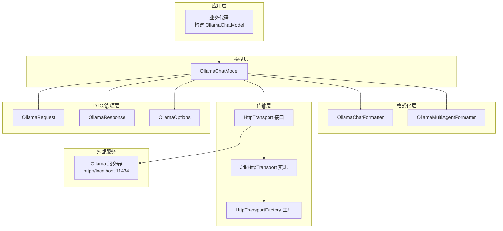
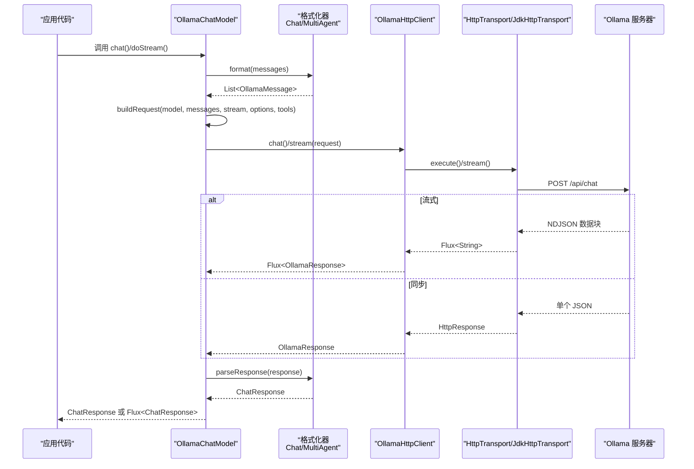
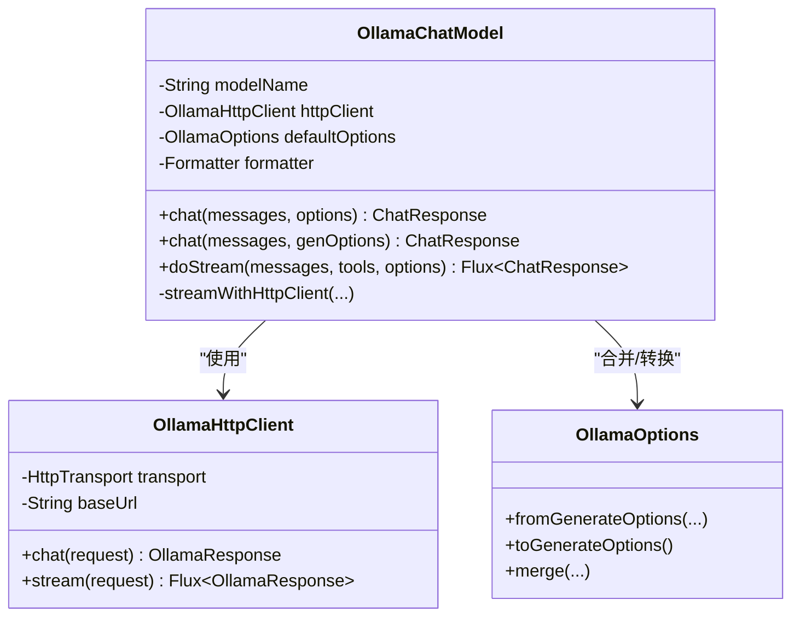
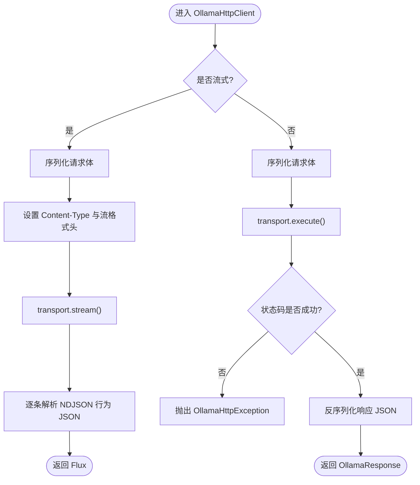
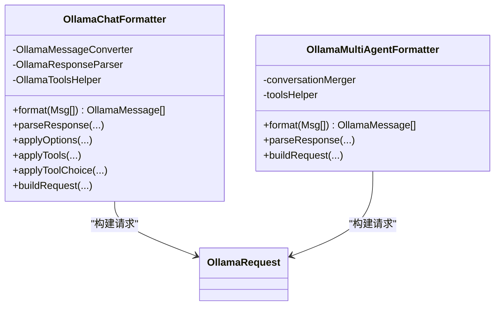
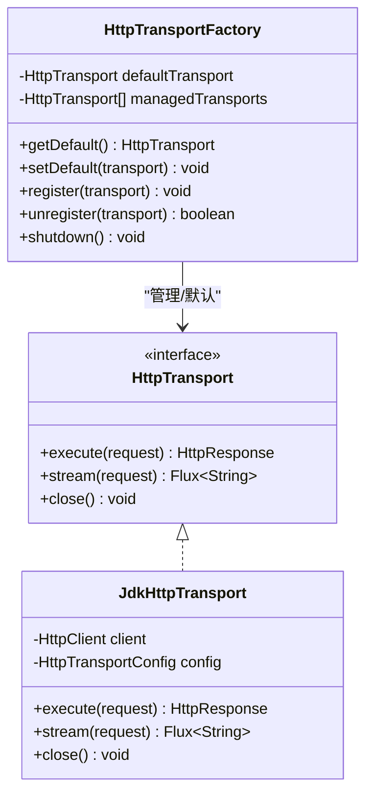
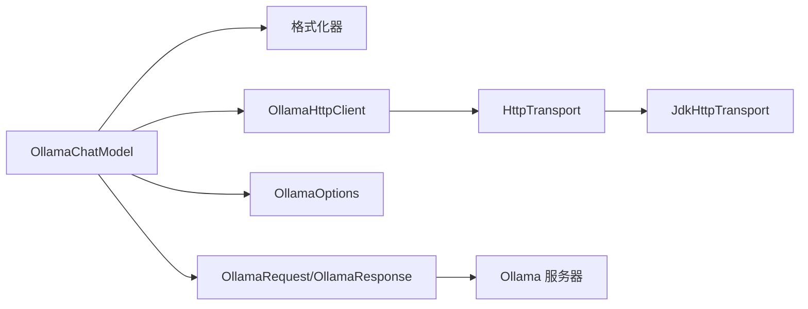

# Ollama 模型集成

<cite>
**本文引用的文件**
- [OllamaChatModel.java](file://agentscope-core/src/main/java/io/agentscope/core/model/OllamaChatModel.java)
- [OllamaHttpClient.java](file://agentscope-core/src/main/java/io/agentscope/core/model/OllamaHttpClient.java)
- [OllamaOptions.java](file://agentscope-core/src/main/java/io/agentscope/core/model/ollama/OllamaOptions.java)
- [OllamaChatFormatter.java](file://agentscope-core/src/main/java/io/agentscope/core/formatter/ollama/OllamaChatFormatter.java)
- [OllamaMultiAgentFormatter.java](file://agentscope-core/src/main/java/io/agentscope/core/formatter/ollama/OllamaMultiAgentFormatter.java)
- [OllamaRequest.java](file://agentscope-core/src/main/java/io/agentscope/core/formatter/ollama/dto/OllamaRequest.java)
- [OllamaResponse.java](file://agentscope-core/src/main/java/io/agentscope/core/formatter/ollama/dto/OllamaResponse.java)
- [HttpTransport.java](file://agentscope-core/src/main/java/io/agentscope/core/model/transport/HttpTransport.java)
- [HttpTransportFactory.java](file://agentscope-core/src/main/java/io/agentscope/core/model/transport/HttpTransportFactory.java)
- [JdkHttpTransport.java](file://agentscope-core/src/main/java/io/agentscope/core/model/transport/JdkHttpTransport.java)
- [model.md（中文文档）](file://docs/zh/task/model.md)
- [OllamaChatModelTest.java](file://agentscope-core/src/test/java/io/agentscope/core/model/OllamaChatModelTest.java)
</cite>

## 目录
1. [简介](#简介)
2. [项目结构](#项目结构)
3. [核心组件](#核心组件)
4. [架构总览](#架构总览)
5. [详细组件分析](#详细组件分析)
6. [依赖关系分析](#依赖关系分析)
7. [性能考虑](#性能考虑)
8. [故障排查指南](#故障排查指南)
9. [结论](#结论)
10. [附录](#附录)

## 简介
本文件面向 AgentScope Java 的 Ollama 模型集成，提供从架构到实现细节的完整 API 文档与实践指南。内容涵盖：
- OllamaChatModel 的职责与接口设计
- 本地 Ollama 服务的连接与配置
- 支持的开源模型（如 llama3、mistral、gemma 等）使用方式
- 流式响应处理与内存管理策略
- 性能调优与资源限制建议
- 常见部署问题排查与解决方案

## 项目结构
AgentScope 将 Ollama 集成划分为以下层次：
- 模型层：OllamaChatModel 负责对外暴露统一的聊天接口，并桥接消息格式化与 HTTP 客户端
- 格式化层：OllamaChatFormatter 与 OllamaMultiAgentFormatter 负责将 AgentScope 的 Msg 对象转换为 Ollama 请求 DTO，并解析响应
- 传输层：HttpTransport 抽象出 HTTP 同步与流式能力；默认实现 JdkHttpTransport 提供 JDK 原生客户端与 SSE/NDJSON 解析
- 选项层：OllamaOptions 提供模型加载参数与推理采样参数的强类型封装
- DTO 层：OllamaRequest/OllamaResponse 映射 Ollama API 的请求与响应结构

图示来源
- [OllamaChatModel.java:53-84](file://agentscope-core/src/main/java/io/agentscope/core/model/OllamaChatModel.java#L53-L84)
- [OllamaChatFormatter.java:51-69](file://agentscope-core/src/main/java/io/agentscope/core/formatter/ollama/OllamaChatFormatter.java#L51-L69)
- [OllamaMultiAgentFormatter.java:50-94](file://agentscope-core/src/main/java/io/agentscope/core/formatter/ollama/OllamaMultiAgentFormatter.java#L50-L94)
- [HttpTransport.java:33-62](file://agentscope-core/src/main/java/io/agentscope/core/model/transport/HttpTransport.java#L33-L62)
- [JdkHttpTransport.java:68-94](file://agentscope-core/src/main/java/io/agentscope/core/model/transport/JdkHttpTransport.java#L68-L94)
- [HttpTransportFactory.java:54-91](file://agentscope-core/src/main/java/io/agentscope/core/model/transport/HttpTransportFactory.java#L54-L91)
- [OllamaRequest.java:29-73](file://agentscope-core/src/main/java/io/agentscope/core/formatter/ollama/dto/OllamaRequest.java#L29-L73)
- [OllamaResponse.java:29-79](file://agentscope-core/src/main/java/io/agentscope/core/formatter/ollama/dto/OllamaResponse.java#L29-L79)

章节来源
- [OllamaChatModel.java:53-84](file://agentscope-core/src/main/java/io/agentscope/core/model/OllamaChatModel.java#L53-L84)
- [OllamaChatFormatter.java:51-69](file://agentscope-core/src/main/java/io/agentscope/core/formatter/ollama/OllamaChatFormatter.java#L51-L69)
- [OllamaMultiAgentFormatter.java:50-94](file://agentscope-core/src/main/java/io/agentscope/core/formatter/ollama/OllamaMultiAgentFormatter.java#L50-L94)
- [HttpTransport.java:33-62](file://agentscope-core/src/main/java/io/agentscope/core/model/transport/HttpTransport.java#L33-L62)
- [JdkHttpTransport.java:68-94](file://agentscope-core/src/main/java/io/agentscope/core/model/transport/JdkHttpTransport.java#L68-L94)
- [HttpTransportFactory.java:54-91](file://agentscope-core/src/main/java/io/agentscope/core/model/transport/HttpTransportFactory.java#L54-L91)
- [OllamaRequest.java:29-73](file://agentscope-core/src/main/java/io/agentscope/core/formatter/ollama/dto/OllamaRequest.java#L29-L73)
- [OllamaResponse.java:29-79](file://agentscope-core/src/main/java/io/agentscope/core/formatter/ollama/dto/OllamaResponse.java#L29-L79)

## 核心组件
- OllamaChatModel：面向用户的聊天模型入口，支持同步与流式两种调用方式；内部通过 OllamaHttpClient 发起 HTTP 请求，并由格式化器完成消息与工具的编解码。
- OllamaHttpClient：对 Ollama API 的 HTTP 客户端封装，支持同步与流式调用，负责 JSON 序列化/反序列化与错误包装。
- OllamaOptions：统一的模型加载与推理参数配置，支持从通用 GenerateOptions 转换，也支持直接构建。
- 格式化器：OllamaChatFormatter 与 OllamaMultiAgentFormatter 分别用于单智能体与多智能体场景的消息转换与工具调用编排。
- 传输层：HttpTransport 抽象与 JdkHttpTransport 实现，负责同步请求与 SSE/NDJSON 流式解析；HttpTransportFactory 提供默认实例与生命周期管理。

章节来源
- [OllamaChatModel.java:53-104](file://agentscope-core/src/main/java/io/agentscope/core/model/OllamaChatModel.java#L53-L104)
- [OllamaHttpClient.java:55-80](file://agentscope-core/src/main/java/io/agentscope/core/model/OllamaHttpClient.java#L55-L80)
- [OllamaOptions.java:42-80](file://agentscope-core/src/main/java/io/agentscope/core/model/ollama/OllamaOptions.java#L42-L80)
- [OllamaChatFormatter.java:51-70](file://agentscope-core/src/main/java/io/agentscope/core/formatter/ollama/OllamaChatFormatter.java#L51-L70)
- [OllamaMultiAgentFormatter.java:50-94](file://agentscope-core/src/main/java/io/agentscope/core/formatter/ollama/OllamaMultiAgentFormatter.java#L50-L94)
- [HttpTransport.java:33-62](file://agentscope-core/src/main/java/io/agentscope/core/model/transport/HttpTransport.java#L33-L62)
- [JdkHttpTransport.java:68-94](file://agentscope-core/src/main/java/io/agentscope/core/model/transport/JdkHttpTransport.java#L68-L94)
- [HttpTransportFactory.java:54-91](file://agentscope-core/src/main/java/io/agentscope/core/model/transport/HttpTransportFactory.java#L54-L91)

## 架构总览
下图展示了从应用发起请求到 Ollama 服务器的完整链路，包括消息格式化、请求构建、HTTP 传输与响应解析。

图示来源
- [OllamaChatModel.java:135-233](file://agentscope-core/src/main/java/io/agentscope/core/model/OllamaChatModel.java#L135-L233)
- [OllamaChatFormatter.java:396-405](file://agentscope-core/src/main/java/io/agentscope/core/formatter/ollama/OllamaChatFormatter.java#L396-L405)
- [OllamaMultiAgentFormatter.java:244-247](file://agentscope-core/src/main/java/io/agentscope/core/formatter/ollama/OllamaMultiAgentFormatter.java#L244-L247)
- [OllamaHttpClient.java:88-175](file://agentscope-core/src/main/java/io/agentscope/core/model/OllamaHttpClient.java#L88-L175)
- [JdkHttpTransport.java:190-240](file://agentscope-core/src/main/java/io/agentscope/core/model/transport/JdkHttpTransport.java#L190-L240)

## 详细组件分析

### OllamaChatModel 组件
- 角色与职责
  - 对外提供统一的聊天接口，支持同步与流式两种模式
  - 负责合并默认与运行时选项，构建请求并调用 HTTP 客户端
  - 使用格式化器进行消息与工具的双向转换
  - 应用超时与重试机制，提升鲁棒性
- 关键方法
  - chat(List<Msg>, OllamaOptions)：同步聊天
  - chat(List<Msg>, GenerateOptions)：基于通用选项的适配
  - doStream(...): 流式聊天，返回 Flux<ChatResponse>
  - streamWithHttpClient(...): 共享逻辑，区分同步/流式路径
- 选项合并与执行配置
  - 默认选项与运行时选项合并后，再转为通用 GenerateOptions 传入超时/重试流程
  - 执行配置（ExecutionConfig）在 Builder 中进行合并与注入

图示来源
- [OllamaChatModel.java:53-104](file://agentscope-core/src/main/java/io/agentscope/core/model/OllamaChatModel.java#L53-L104)
- [OllamaChatModel.java:135-233](file://agentscope-core/src/main/java/io/agentscope/core/model/OllamaChatModel.java#L135-L233)
- [OllamaHttpClient.java:55-80](file://agentscope-core/src/main/java/io/agentscope/core/model/OllamaHttpClient.java#L55-L80)
- [OllamaOptions.java:306-400](file://agentscope-core/src/main/java/io/agentscope/core/model/ollama/OllamaOptions.java#L306-L400)

章节来源
- [OllamaChatModel.java:53-104](file://agentscope-core/src/main/java/io/agentscope/core/model/OllamaChatModel.java#L53-L104)
- [OllamaChatModel.java:135-233](file://agentscope-core/src/main/java/io/agentscope/core/model/OllamaChatModel.java#L135-L233)
- [OllamaOptions.java:306-400](file://agentscope-core/src/main/java/io/agentscope/core/model/ollama/OllamaOptions.java#L306-L400)

### OllamaHttpClient 组件
- 角色与职责
  - 封装 Ollama 的 /api/chat 与 /api/embed 端点
  - 提供同步与流式两种调用方式，自动处理 JSON 序列化/反序列化
  - 在流式场景中识别并解析 NDJSON 数据块
- 关键方法
  - chat(OllamaRequest)：同步聊天
  - stream(OllamaRequest)：流式聊天，返回 Flux<OllamaResponse>
  - call(String, Object, Class<T>)：通用同步调用
- 错误处理
  - 将底层异常包装为 OllamaHttpException，便于上层统一处理

图示来源
- [OllamaHttpClient.java:183-232](file://agentscope-core/src/main/java/io/agentscope/core/model/OllamaHttpClient.java#L183-L232)
- [OllamaHttpClient.java:122-175](file://agentscope-core/src/main/java/io/agentscope/core/model/OllamaHttpClient.java#L122-L175)

章节来源
- [OllamaHttpClient.java:55-80](file://agentscope-core/src/main/java/io/agentscope/core/model/OllamaHttpClient.java#L55-L80)
- [OllamaHttpClient.java:122-175](file://agentscope-core/src/main/java/io/agentscope/core/model/OllamaHttpClient.java#L122-L175)
- [OllamaHttpClient.java:183-232](file://agentscope-core/src/main/java/io/agentscope/core/model/OllamaHttpClient.java#L183-L232)

### 格式化器组件
- OllamaChatFormatter
  - 将 AgentScope 的 Msg（文本、图片、工具调用/结果等）转换为 Ollama 的消息结构
  - 支持工具函数的注入与选择策略
  - 可选地将工具结果中的图片“提升”为用户消息，增强多模态交互
- OllamaMultiAgentFormatter
  - 面向多智能体对话，将历史消息折叠为带标签的用户消息，减少上下文开销
  - 支持工具序列的特殊处理与图片提升

图示来源
- [OllamaChatFormatter.java:51-70](file://agentscope-core/src/main/java/io/agentscope/core/formatter/ollama/OllamaChatFormatter.java#L51-L70)
- [OllamaChatFormatter.java:441-462](file://agentscope-core/src/main/java/io/agentscope/core/formatter/ollama/OllamaChatFormatter.java#L441-L462)
- [OllamaMultiAgentFormatter.java:50-94](file://agentscope-core/src/main/java/io/agentscope/core/formatter/ollama/OllamaMultiAgentFormatter.java#L50-L94)
- [OllamaMultiAgentFormatter.java:289-315](file://agentscope-core/src/main/java/io/agentscope/core/formatter/ollama/OllamaMultiAgentFormatter.java#L289-L315)

章节来源
- [OllamaChatFormatter.java:51-70](file://agentscope-core/src/main/java/io/agentscope/core/formatter/ollama/OllamaChatFormatter.java#L51-L70)
- [OllamaChatFormatter.java:441-462](file://agentscope-core/src/main/java/io/agentscope/core/formatter/ollama/OllamaChatFormatter.java#L441-L462)
- [OllamaMultiAgentFormatter.java:50-94](file://agentscope-core/src/main/java/io/agentscope/core/formatter/ollama/OllamaMultiAgentFormatter.java#L50-L94)
- [OllamaMultiAgentFormatter.java:289-315](file://agentscope-core/src/main/java/io/agentscope/core/formatter/ollama/OllamaMultiAgentFormatter.java#L289-L315)

### 传输层与工厂
- HttpTransport 接口
  - 定义同步执行与流式执行两个抽象方法
- JdkHttpTransport 实现
  - 基于 JDK HttpClient，支持 HTTP/2、连接池、超时与代理
  - 流式场景下解析 SSE/NDJSON 数据块
- HttpTransportFactory
  - 提供默认传输实例与注册管理，确保 JVM 关闭时统一清理

图示来源
- [HttpTransport.java:33-62](file://agentscope-core/src/main/java/io/agentscope/core/model/transport/HttpTransport.java#L33-L62)
- [JdkHttpTransport.java:68-94](file://agentscope-core/src/main/java/io/agentscope/core/model/transport/JdkHttpTransport.java#L68-L94)
- [JdkHttpTransport.java:190-240](file://agentscope-core/src/main/java/io/agentscope/core/model/transport/JdkHttpTransport.java#L190-L240)
- [HttpTransportFactory.java:54-91](file://agentscope-core/src/main/java/io/agentscope/core/model/transport/HttpTransportFactory.java#L54-L91)

章节来源
- [HttpTransport.java:33-62](file://agentscope-core/src/main/java/io/agentscope/core/model/transport/HttpTransport.java#L33-L62)
- [JdkHttpTransport.java:68-94](file://agentscope-core/src/main/java/io/agentscope/core/model/transport/JdkHttpTransport.java#L68-L94)
- [JdkHttpTransport.java:190-240](file://agentscope-core/src/main/java/io/agentscope/core/model/transport/JdkHttpTransport.java#L190-L240)
- [HttpTransportFactory.java:54-91](file://agentscope-core/src/main/java/io/agentscope/core/model/transport/HttpTransportFactory.java#L54-L91)

### 选项与配置
- OllamaOptions
  - 模型加载参数：num_ctx、num_gpu、low_vram、f16_kv、use_mmap/use_mlock、num_thread 等
  - 推理采样参数：temperature、top_k、top_p、repeat_penalty、presence_penalty、frequency_penalty 等
  - 请求覆盖参数：model、format、keep_alive、truncate、stop 等
  - 思维链（Chain-of-Thought）支持：ThinkOption
  - 与通用 GenerateOptions 的互转：fromGenerateOptions()/toGenerateOptions()

章节来源
- [OllamaOptions.java:42-304](file://agentscope-core/src/main/java/io/agentscope/core/model/ollama/OllamaOptions.java#L42-L304)
- [OllamaOptions.java:359-400](file://agentscope-core/src/main/java/io/agentscope/core/model/ollama/OllamaOptions.java#L359-L400)
- [OllamaOptions.java:407-454](file://agentscope-core/src/main/java/io/agentscope/core/model/ollama/OllamaOptions.java#L407-L454)

### DTO 结构
- OllamaRequest
  - model、messages、stream、format、keep_alive、tools、tool_choice、think、options
- OllamaResponse
  - model、created_at、message、done、total_duration、prompt_eval_count、eval_count、done_reason、error 等

章节来源
- [OllamaRequest.java:29-145](file://agentscope-core/src/main/java/io/agentscope/core/formatter/ollama/dto/OllamaRequest.java#L29-L145)
- [OllamaResponse.java:29-176](file://agentscope-core/src/main/java/io/agentscope/core/formatter/ollama/dto/OllamaResponse.java#L29-L176)

## 依赖关系分析
- 组件耦合
  - OllamaChatModel 依赖格式化器与 HTTP 客户端，耦合度低，便于替换与扩展
  - 传输层通过接口抽象，便于切换不同实现（如 OkHttp）
- 外部依赖
  - Ollama 服务器（默认 http://localhost:11434）
  - JDK HttpClient（默认传输实现）

图示来源
- [OllamaChatModel.java:53-84](file://agentscope-core/src/main/java/io/agentscope/core/model/OllamaChatModel.java#L53-L84)
- [OllamaHttpClient.java:55-80](file://agentscope-core/src/main/java/io/agentscope/core/model/OllamaHttpClient.java#L55-L80)
- [HttpTransport.java:33-62](file://agentscope-core/src/main/java/io/agentscope/core/model/transport/HttpTransport.java#L33-L62)
- [JdkHttpTransport.java:68-94](file://agentscope-core/src/main/java/io/agentscope/core/model/transport/JdkHttpTransport.java#L68-L94)
- [OllamaRequest.java:29-73](file://agentscope-core/src/main/java/io/agentscope/core/formatter/ollama/dto/OllamaRequest.java#L29-L73)
- [OllamaResponse.java:29-79](file://agentscope-core/src/main/java/io/agentscope/core/formatter/ollama/dto/OllamaResponse.java#L29-L79)

章节来源
- [OllamaChatModel.java:53-84](file://agentscope-core/src/main/java/io/agentscope/core/model/OllamaChatModel.java#L53-L84)
- [OllamaHttpClient.java:55-80](file://agentscope-core/src/main/java/io/agentscope/core/model/OllamaHttpClient.java#L55-L80)
- [HttpTransport.java:33-62](file://agentscope-core/src/main/java/io/agentscope/core/model/transport/HttpTransport.java#L33-L62)
- [JdkHttpTransport.java:68-94](file://agentscope-core/src/main/java/io/agentscope/core/model/transport/JdkHttpTransport.java#L68-L94)
- [OllamaRequest.java:29-73](file://agentscope-core/src/main/java/io/agentscope/core/formatter/ollama/dto/OllamaRequest.java#L29-L73)
- [OllamaResponse.java:29-79](file://agentscope-core/src/main/java/io/agentscope/core/formatter/ollama/dto/OllamaResponse.java#L29-L79)

## 性能考虑
- 上下文窗口与批处理
  - num_ctx 控制上下文长度，过长会增加显存占用与推理时间
  - num_batch 影响提示评估阶段的批处理大小，适当增大可提升吞吐
- GPU 加速与显存管理
  - num_gpu 指定卸载层数；低显存设备可开启 low_vram，但可能降低速度
  - f16_kv 使用半精度缓存键值，平衡显存与性能
  - use_mlock 可防止模型数据被交换到磁盘，提升稳定性
- 推理采样与重复控制
  - temperature、top_k、top_p 控制多样性与确定性
  - repeat_penalty、presence_penalty、frequency_penalty 降低重复与主题漂移
- 线程与并发
  - num_thread 与 CPU 核数匹配可提升吞吐；过多线程反而带来调度开销
- 流式响应
  - 流式传输可降低首字节延迟，适合实时交互；注意背压与订阅线程池
- 连接与超时
  - 通过 HttpTransportFactory 注入自定义传输（如 OkHttp），配置连接/读取超时与代理

章节来源
- [OllamaOptions.java:48-134](file://agentscope-core/src/main/java/io/agentscope/core/model/ollama/OllamaOptions.java#L48-L134)
- [OllamaOptions.java:136-294](file://agentscope-core/src/main/java/io/agentscope/core/model/ollama/OllamaOptions.java#L136-L294)
- [JdkHttpTransport.java:111-169](file://agentscope-core/src/main/java/io/agentscope/core/model/transport/JdkHttpTransport.java#L111-L169)
- [HttpTransportFactory.java:54-91](file://agentscope-core/src/main/java/io/agentscope/core/model/transport/HttpTransportFactory.java#L54-L91)

## 故障排查指南
- 连接失败
  - 确认 Ollama 服务地址与端口正确（默认 http://localhost:11434）
  - 检查防火墙与网络策略，必要时配置代理
- JSON 序列化/反序列化错误
  - 检查请求体与响应体结构，确保字段命名符合 snake_case
  - 关注 OllamaHttpException 的错误码与响应体
- 流式解析异常
  - 确保设置了正确的流格式头（NDJSON）
  - 检查服务器是否按规范输出数据块
- 超时与重试
  - 通过 OllamaOptions 与通用 GenerateOptions 设置合理的超时与重试策略
  - 使用 HttpTransportFactory 管理传输生命周期，避免资源泄漏
- 单元测试参考
  - 可参考单元测试对同步/流式调用、选项合并与请求构建的验证

章节来源
- [OllamaHttpClient.java:122-175](file://agentscope-core/src/main/java/io/agentscope/core/model/OllamaHttpClient.java#L122-L175)
- [OllamaHttpClient.java:183-232](file://agentscope-core/src/main/java/io/agentscope/core/model/OllamaHttpClient.java#L183-L232)
- [JdkHttpTransport.java:190-240](file://agentscope-core/src/main/java/io/agentscope/core/model/transport/JdkHttpTransport.java#L190-L240)
- [HttpTransportFactory.java:154-168](file://agentscope-core/src/main/java/io/agentscope/core/model/transport/HttpTransportFactory.java#L154-L168)
- [OllamaChatModelTest.java:164-335](file://agentscope-core/src/test/java/io/agentscope/core/model/OllamaChatModelTest.java#L164-L335)

## 结论
AgentScope 的 Ollama 集成通过清晰的分层设计实现了本地大模型的稳定接入：格式化器保证消息与工具的跨平台一致性，传输层提供灵活的 HTTP 能力，选项层覆盖模型加载与推理的关键参数。结合流式响应与超时重试机制，可在不同硬件与网络环境下获得良好的性能与可靠性。

## 附录

### 使用示例与最佳实践
- 基础模型接入
  - 使用 OllamaChatModel.builder() 配置 modelName 与 baseUrl
  - 可选：指定默认 OllamaOptions、自定义格式化器、或替换传输实现
- 支持的开源模型
  - 文档中列举了 qwen3-max、llama3.2、mistral、phi3 等模型名称，实际可用模型取决于本地已拉取的镜像
- 本地模型加载与 GPU 加速
  - 通过 OllamaOptions 的模型加载参数（如 num_gpu、low_vram、f16_kv、use_mmap/use_mlock、num_thread）进行配置
- 流式响应处理
  - 通过 doStream 获取 Flux<ChatResponse>，注意订阅线程与背压
- 网络与代理
  - 通过 HttpTransportFactory 注册传输实例，或在 JdkHttpTransport 中配置代理与 SSL 忽略策略（仅限开发测试）

章节来源
- [model.md（中文文档）:273-311](file://docs/zh/task/model.md#L273-L311)
- [OllamaChatModel.java:102-104](file://agentscope-core/src/main/java/io/agentscope/core/model/OllamaChatModel.java#L102-L104)
- [OllamaOptions.java:48-134](file://agentscope-core/src/main/java/io/agentscope/core/model/ollama/OllamaOptions.java#L48-L134)
- [JdkHttpTransport.java:135-166](file://agentscope-core/src/main/java/io/agentscope/core/model/transport/JdkHttpTransport.java#L135-L166)
- [HttpTransportFactory.java:54-91](file://agentscope-core/src/main/java/io/agentscope/core/model/transport/HttpTransportFactory.java#L54-L91)