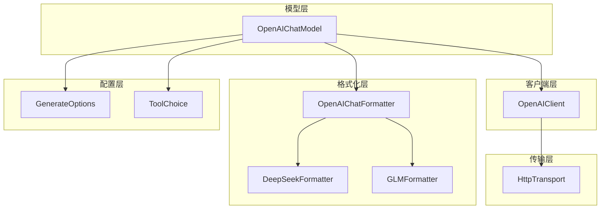
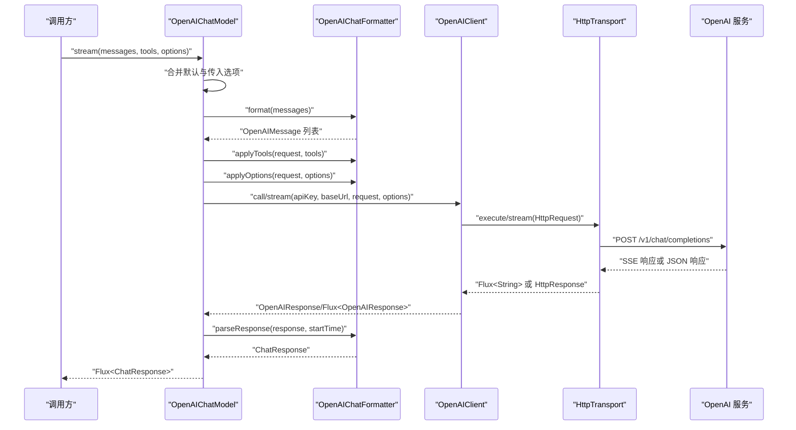
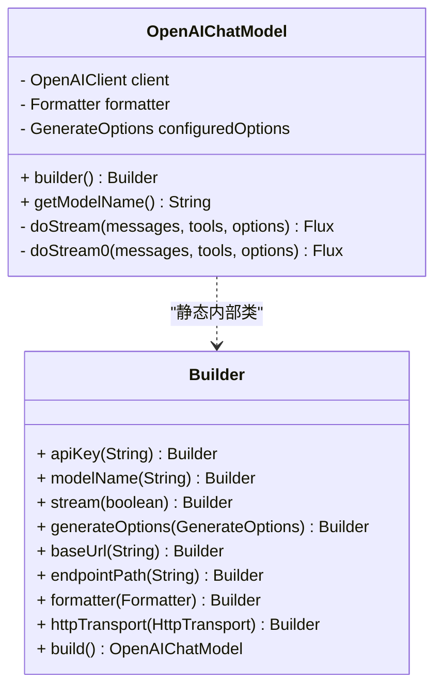
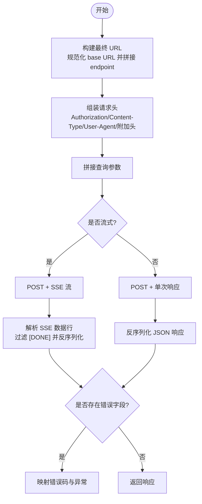
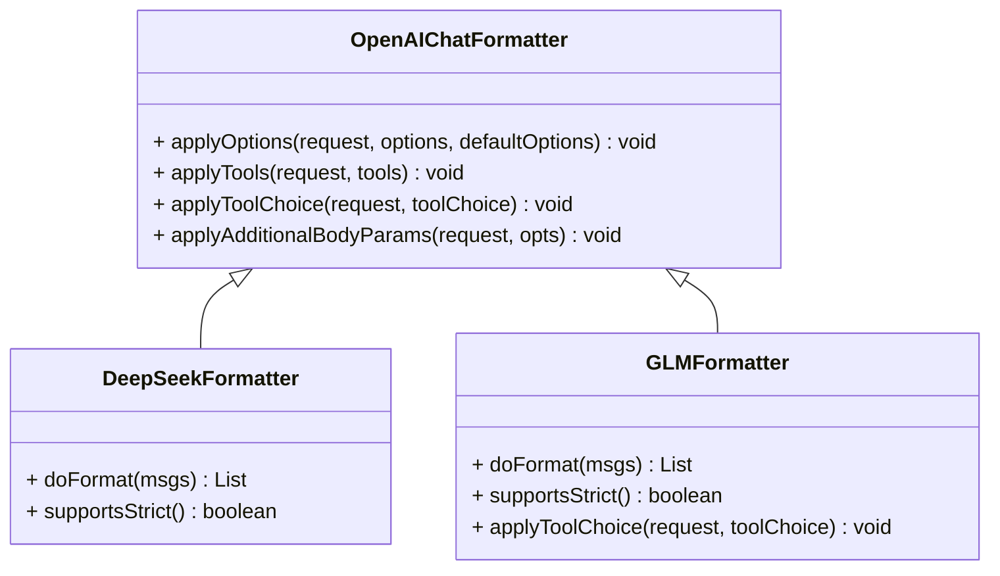
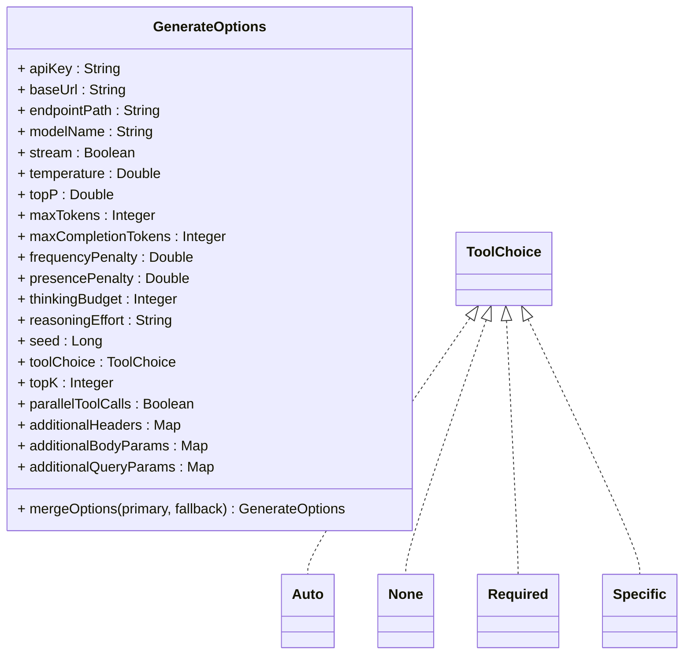
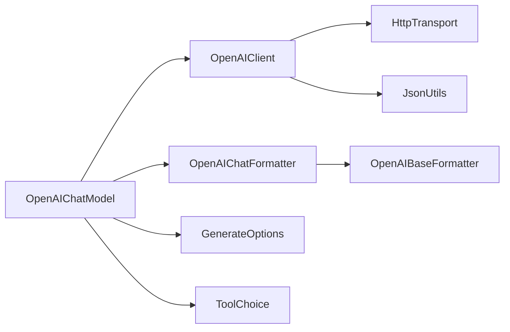

# OpenAI 模型集成

<cite>
**本文引用的文件**
- [OpenAIChatModel.java](file://agentscope-core/src/main/java/io/agentscope/core/model/OpenAIChatModel.java)
- [OpenAIClient.java](file://agentscope-core/src/main/java/io/agentscope/core/model/OpenAIClient.java)
- [OpenAIChatFormatter.java](file://agentscope-core/src/main/java/io/agentscope/core/formatter/openai/OpenAIChatFormatter.java)
- [DeepSeekFormatter.java](file://agentscope-core/src/main/java/io/agentscope/core/formatter/openai/DeepSeekFormatter.java)
- [GLMFormatter.java](file://agentscope-core/src/main/java/io/agentscope/core/formatter/openai/GLMFormatter.java)
- [GenerateOptions.java](file://agentscope-core/src/main/java/io/agentscope/core/model/GenerateOptions.java)
- [ToolChoice.java](file://agentscope-core/src/main/java/io/agentscope/core/model/ToolChoice.java)
- [HttpTransport.java](file://agentscope-core/src/main/java/io/agentscope/core/model/transport/HttpTransport.java)
- [OpenAIChatModelTest.java](file://agentscope-core/src/test/java/io/agentscope/core/model/OpenAIChatModelTest.java)
- [OpenAIChatFormatterTest.java](file://agentscope-core/src/test/java/io/agentscope/core/formatter/openai/OpenAIChatFormatterTest.java)
- [OpenAIOfficialAPIE2ETest.java](file://agentscope-core/src/test/java/io/agentscope/core/model/OpenAIOfficialAPIE2ETest.java)
</cite>

## 目录
1. [简介](#简介)
2. [项目结构](#项目结构)
3. [核心组件](#核心组件)
4. [架构总览](#架构总览)
5. [详细组件分析](#详细组件分析)
6. [依赖分析](#依赖分析)
7. [性能考虑](#性能考虑)
8. [故障排查指南](#故障排查指南)
9. [结论](#结论)
10. [附录](#附录)

## 简介
本文件面向 AgentScope Java 的 OpenAI 模型集成，聚焦 OpenAIChatModel 的实现与配置，系统性阐述以下主题：
- OpenAIChatModel 的工作原理、构建与使用
- OpenAI 官方模型变体（如 gpt-3.5-turbo、gpt-4、gpt-4o 等）的接入方式
- API 密钥与认证、基础地址与端点路径的配置
- 流式响应与非流式响应的处理流程
- 工具调用（函数调用）在 OpenAI 模型中的特殊处理
- 错误处理与速率限制应对策略
- 性能优化与成本控制最佳实践

## 项目结构
围绕 OpenAI 集成的关键模块包括：
- 模型层：OpenAIChatModel（模型入口与生命周期管理）
- 客户端层：OpenAIClient（HTTP 请求封装、SSE 流解析、错误映射）
- 格式化层：OpenAIChatFormatter 及其子类（消息与请求格式转换、工具与参数应用）
- 传输层：HttpTransport 接口（抽象 HTTP 传输，支持同步与 SSE 流）
- 配置层：GenerateOptions（生成参数与连接级配置）、ToolChoice（工具选择策略）

**图表来源**
- [OpenAIChatModel.java:58-357](file://agentscope-core/src/main/java/io/agentscope/core/model/OpenAIChatModel.java#L58-L357)
- [OpenAIClient.java:63-709](file://agentscope-core/src/main/java/io/agentscope/core/model/OpenAIClient.java#L63-L709)
- [OpenAIChatFormatter.java:46-278](file://agentscope-core/src/main/java/io/agentscope/core/formatter/openai/OpenAIChatFormatter.java#L46-L278)
- [DeepSeekFormatter.java:47-173](file://agentscope-core/src/main/java/io/agentscope/core/formatter/openai/DeepSeekFormatter.java#L47-L173)
- [GLMFormatter.java:48-121](file://agentscope-core/src/main/java/io/agentscope/core/formatter/openai/GLMFormatter.java#L48-L121)
- [HttpTransport.java:33-62](file://agentscope-core/src/main/java/io/agentscope/core/model/transport/HttpTransport.java#L33-L62)
- [GenerateOptions.java:31-95](file://agentscope-core/src/main/java/io/agentscope/core/model/GenerateOptions.java#L31-L95)
- [ToolChoice.java:45-85](file://agentscope-core/src/main/java/io/agentscope/core/model/ToolChoice.java#L45-L85)

**章节来源**
- [OpenAIChatModel.java:58-357](file://agentscope-core/src/main/java/io/agentscope/core/model/OpenAIChatModel.java#L58-L357)
- [OpenAIClient.java:63-709](file://agentscope-core/src/main/java/io/agentscope/core/model/OpenAIClient.java#L63-L709)
- [OpenAIChatFormatter.java:46-278](file://agentscope-core/src/main/java/io/agentscope/core/formatter/openai/OpenAIChatFormatter.java#L46-L278)
- [DeepSeekFormatter.java:47-173](file://agentscope-core/src/main/java/io/agentscope/core/formatter/openai/DeepSeekFormatter.java#L47-L173)
- [GLMFormatter.java:48-121](file://agentscope-core/src/main/java/io/agentscope/core/formatter/openai/GLMFormatter.java#L48-L121)
- [HttpTransport.java:33-62](file://agentscope-core/src/main/java/io/agentscope/core/model/transport/HttpTransport.java#L33-L62)
- [GenerateOptions.java:31-95](file://agentscope-core/src/main/java/io/agentscope/core/model/GenerateOptions.java#L31-L95)
- [ToolChoice.java:45-85](file://agentscope-core/src/main/java/io/agentscope/core/model/ToolChoice.java#L45-L85)

## 核心组件
- OpenAIChatModel：基于 HTTP 的 OpenAI 聊天模型适配器，负责将 AgentScope 的消息与工具定义转换为 OpenAI 请求，并处理流式/非流式响应。
- OpenAIClient：无状态 HTTP 客户端，封装请求构建、URL 组合、头部与查询参数拼装、SSE 流解析与错误映射。
- OpenAIChatFormatter：标准 OpenAI GPT 模型的消息与请求格式化器，支持采样参数、工具调用、工具选择策略、额外请求体参数等。
- DeepSeekFormatter/GLMFormatter：针对特定供应商的格式化器，覆盖消息角色修正、工具严格模式支持差异、工具选择降级等。
- GenerateOptions：统一的生成与连接配置对象，支持温度、最大令牌数、工具选择、缓存控制、并行工具调用、附加头与查询参数等。
- ToolChoice：工具调用策略枚举（自动、禁止、必须、指定工具）。
- HttpTransport：抽象 HTTP 传输接口，支持同步执行与 SSE 流。

**章节来源**
- [OpenAIChatModel.java:58-357](file://agentscope-core/src/main/java/io/agentscope/core/model/OpenAIChatModel.java#L58-L357)
- [OpenAIClient.java:63-709](file://agentscope-core/src/main/java/io/agentscope/core/model/OpenAIClient.java#L63-L709)
- [OpenAIChatFormatter.java:46-278](file://agentscope-core/src/main/java/io/agentscope/core/formatter/openai/OpenAIChatFormatter.java#L46-L278)
- [DeepSeekFormatter.java:47-173](file://agentscope-core/src/main/java/io/agentscope/core/formatter/openai/DeepSeekFormatter.java#L47-L173)
- [GLMFormatter.java:48-121](file://agentscope-core/src/main/java/io/agentscope/core/formatter/openai/GLMFormatter.java#L48-L121)
- [GenerateOptions.java:31-95](file://agentscope-core/src/main/java/io/agentscope/core/model/GenerateOptions.java#L31-L95)
- [ToolChoice.java:45-85](file://agentscope-core/src/main/java/io/agentscope/core/model/ToolChoice.java#L45-L85)
- [HttpTransport.java:33-62](file://agentscope-core/src/main/java/io/agentscope/core/model/transport/HttpTransport.java#L33-L62)

## 架构总览
下图展示从调用到响应的完整链路，涵盖消息格式化、请求构建、HTTP 传输、SSE 解析与响应解析。

**图表来源**
- [OpenAIChatModel.java:82-179](file://agentscope-core/src/main/java/io/agentscope/core/model/OpenAIChatModel.java#L82-L179)
- [OpenAIClient.java:252-442](file://agentscope-core/src/main/java/io/agentscope/core/model/OpenAIClient.java#L252-L442)
- [OpenAIChatFormatter.java:68-125](file://agentscope-core/src/main/java/io/agentscope/core/formatter/openai/OpenAIChatFormatter.java#L68-L125)

**章节来源**
- [OpenAIChatModel.java:82-179](file://agentscope-core/src/main/java/io/agentscope/core/model/OpenAIChatModel.java#L82-L179)
- [OpenAIClient.java:252-442](file://agentscope-core/src/main/java/io/agentscope/core/model/OpenAIClient.java#L252-L442)
- [OpenAIChatFormatter.java:68-125](file://agentscope-core/src/main/java/io/agentscope/core/formatter/openai/OpenAIChatFormatter.java#L68-L125)

## 详细组件分析

### OpenAIChatModel 实现与配置
- 角色与职责
  - 将 AgentScope 的 Msg 列表转换为 OpenAI 请求，应用工具与生成选项，发起 HTTP 调用，并将响应解析为 ChatResponse。
  - 支持流式与非流式两种模式；流式模式自动注入 usage 信息以满足兼容 API 的要求。
- 关键行为
  - 选项合并：优先使用调用时传入的 GenerateOptions，其次使用构建时的默认配置。
  - 认证与地址：从 options 中读取 apiKey 与 baseUrl，允许按请求覆盖。
  - 工具与工具选择：通过 formatter 应用工具定义与工具选择策略。
  - 缓存控制：当启用时，对系统消息与最后一条消息添加缓存控制标记（由 OpenAI 兼容格式化器支持）。
  - 超时与重试：委托 ModelUtils.applyTimeoutAndRetry 进行统一超时与重试策略。
- 构建器（Builder）
  - 支持设置 apiKey、modelName、stream、generateOptions、baseUrl、endpointPath、formatter、httpTransport。
  - 默认 formatter 为 OpenAIChatFormatter；默认 endpointPath 为 /v1/chat/completions；默认 transport 来自工厂。
- 模型名
  - getModelName 返回构建时配置的模型名，便于日志与识别。

**图表来源**
- [OpenAIChatModel.java:58-357](file://agentscope-core/src/main/java/io/agentscope/core/model/OpenAIChatModel.java#L58-L357)

**章节来源**
- [OpenAIChatModel.java:82-179](file://agentscope-core/src/main/java/io/agentscope/core/model/OpenAIChatModel.java#L82-L179)
- [OpenAIChatModel.java:196-356](file://agentscope-core/src/main/java/io/agentscope/core/model/OpenAIChatModel.java#L196-L356)

### OpenAIClient HTTP 客户端
- 角色与职责
  - 无状态 HTTP 客户端，负责：
    - 构建 API URL（支持版本路径自动处理与回退逻辑）
    - 设置请求头（Authorization、Content-Type、User-Agent、附加头）
    - 组装查询参数
    - 同步与流式请求（SSE）
    - 错误映射（HTTP 状态码与响应体中的错误字段）
- 关键能力
  - URL 构建：规范化 base URL，智能去除重复版本段，正确拼接路径。
  - 流式解析：过滤 [DONE]，逐条解析 SSE 数据为 OpenAIResponse。
  - 错误处理：将 HTTP 200 中的错误体映射为 429 或其他有效状态码。
  - 通用 API：支持任意 OpenAI 兼容端点（图像、音频等）的 JSON 请求。

**图表来源**
- [OpenAIClient.java:120-204](file://agentscope-core/src/main/java/io/agentscope/core/model/OpenAIClient.java#L120-L204)
- [OpenAIClient.java:275-347](file://agentscope-core/src/main/java/io/agentscope/core/model/OpenAIClient.java#L275-L347)
- [OpenAIClient.java:381-442](file://agentscope-core/src/main/java/io/agentscope/core/model/OpenAIClient.java#L381-L442)
- [OpenAIClient.java:452-479](file://agentscope-core/src/main/java/io/agentscope/core/model/OpenAIClient.java#L452-L479)

**章节来源**
- [OpenAIClient.java:120-204](file://agentscope-core/src/main/java/io/agentscope/core/model/OpenAIClient.java#L120-L204)
- [OpenAIClient.java:275-347](file://agentscope-core/src/main/java/io/agentscope/core/model/OpenAIClient.java#L275-L347)
- [OpenAIClient.java:381-442](file://agentscope-core/src/main/java/io/agentscope/core/model/OpenAIClient.java#L381-L442)
- [OpenAIClient.java:452-479](file://agentscope-core/src/main/java/io/agentscope/core/model/OpenAIClient.java#L452-L479)

### OpenAIChatFormatter 与供应商特化格式化器
- OpenAIChatFormatter
  - 负责将 AgentScope 的 Msg 转换为 OpenAIMessage，应用采样参数（温度、top_p、频率/存在惩罚、最大令牌数、种子、并行工具调用等），以及工具与工具选择策略。
  - 支持 additionalBodyParams，可传递 provider 特定参数（如 reasoning_effort、include_reasoning、response_format 等）。
- DeepSeekFormatter
  - 针对 DeepSeek API 的约束：
    - 移除消息中的 name 字段
    - 将 system 消息转换为 user
    - 不支持工具定义的 strict 参数
    - reasoning_content 仅保留于当前轮次
  - 可选追加空 user 消息以避免以 assistant 结束导致的 API 错误。
- GLMFormatter
  - 针对 Zhipu GLM 的约束：
    - 至少需要一个 user 消息
    - 工具选择仅支持 auto
    - 不支持工具定义的 strict 参数
    - 支持 temperature、top_p、max_tokens、seed（不支持频率/存在惩罚）

**图表来源**
- [OpenAIChatFormatter.java:46-278](file://agentscope-core/src/main/java/io/agentscope/core/formatter/openai/OpenAIChatFormatter.java#L46-L278)
- [DeepSeekFormatter.java:47-173](file://agentscope-core/src/main/java/io/agentscope/core/formatter/openai/DeepSeekFormatter.java#L47-L173)
- [GLMFormatter.java:48-121](file://agentscope-core/src/main/java/io/agentscope/core/formatter/openai/GLMFormatter.java#L48-L121)

**章节来源**
- [OpenAIChatFormatter.java:68-125](file://agentscope-core/src/main/java/io/agentscope/core/formatter/openai/OpenAIChatFormatter.java#L68-L125)
- [OpenAIChatFormatter.java:144-178](file://agentscope-core/src/main/java/io/agentscope/core/formatter/openai/OpenAIChatFormatter.java#L144-L178)
- [OpenAIChatFormatter.java:194-222](file://agentscope-core/src/main/java/io/agentscope/core/formatter/openai/OpenAIChatFormatter.java#L194-L222)
- [OpenAIChatFormatter.java:228-276](file://agentscope-core/src/main/java/io/agentscope/core/formatter/openai/OpenAIChatFormatter.java#L228-L276)
- [DeepSeekFormatter.java:66-106](file://agentscope-core/src/main/java/io/agentscope/core/formatter/openai/DeepSeekFormatter.java#L66-L106)
- [DeepSeekFormatter.java:77-79](file://agentscope-core/src/main/java/io/agentscope/core/formatter/openai/DeepSeekFormatter.java#L77-L79)
- [DeepSeekFormatter.java:116-124](file://agentscope-core/src/main/java/io/agentscope/core/formatter/openai/DeepSeekFormatter.java#L116-L124)
- [GLMFormatter.java:56-60](file://agentscope-core/src/main/java/io/agentscope/core/formatter/openai/GLMFormatter.java#L56-L60)
- [GLMFormatter.java:68-70](file://agentscope-core/src/main/java/io/agentscope/core/formatter/openai/GLMFormatter.java#L68-L70)
- [GLMFormatter.java:107-119](file://agentscope-core/src/main/java/io/agentscope/core/formatter/openai/GLMFormatter.java#L107-L119)

### 生成选项与工具选择
- GenerateOptions
  - 连接级：apiKey、baseUrl、endpointPath、modelName、stream
  - 生成参数：temperature、topP、maxTokens、maxCompletionTokens、frequencyPenalty、presencePenalty、thinkingBudget、reasoningEffort、seed、toolChoice、topK、parallelToolCalls
  - 扩展：additionalHeaders、additionalBodyParams、additionalQueryParams
  - 合并策略：按字段优先级合并 primary/fallback，map 类型采用 fallback+override 方式。
- ToolChoice
  - Auto、None、Required、Specific（带工具名校验）

**图表来源**
- [GenerateOptions.java:31-95](file://agentscope-core/src/main/java/io/agentscope/core/model/GenerateOptions.java#L31-L95)
- [GenerateOptions.java:423-484](file://agentscope-core/src/main/java/io/agentscope/core/model/GenerateOptions.java#L423-L484)
- [ToolChoice.java:45-85](file://agentscope-core/src/main/java/io/agentscope/core/model/ToolChoice.java#L45-L85)

**章节来源**
- [GenerateOptions.java:31-95](file://agentscope-core/src/main/java/io/agentscope/core/model/GenerateOptions.java#L31-L95)
- [GenerateOptions.java:423-484](file://agentscope-core/src/main/java/io/agentscope/core/model/GenerateOptions.java#L423-L484)
- [ToolChoice.java:45-85](file://agentscope-core/src/main/java/io/agentscope/core/model/ToolChoice.java#L45-L85)

### 使用示例与最佳实践

- 基础使用（非流式）
  - 创建 OpenAIChatModel，设置 apiKey、modelName、baseUrl（可选）、formatter（可选，默认 OpenAIChatFormatter）。
  - 准备 Msg 列表与可选工具列表，调用 stream(...) 获取 Flux<ChatResponse>。
  - 示例参考：[OpenAIChatModelTest.java:88-146](file://agentscope-core/src/test/java/io/agentscope/core/model/OpenAIChatModelTest.java#L88-L146)

- 流式响应
  - 在构建器中开启 stream(true)，或在调用时设置 GenerateOptions.stream(true)。
  - 使用 Flux<ChatResponse> 逐步消费响应块，适合实时交互场景。
  - 示例参考：[OpenAIChatModelTest.java:148-195](file://agentscope-core/src/test/java/io/agentscope/core/model/OpenAIChatModelTest.java#L148-L195)

- 工具调用
  - 通过 ToolSchema 定义工具，传入 tools 参数；formatter 会将其转换为 OpenAI 的工具定义。
  - 使用 ToolChoice 控制工具调用策略（Auto/None/Required/Specific）。
  - 示例参考：[OpenAIChatFormatterTest.java:177-197](file://agentscope-core/src/test/java/io/agentscope/core/formatter/openai/OpenAIChatFormatterTest.java#L177-L197)

- OpenAI 官方模型变体接入
  - gpt-3.5-turbo、gpt-4、gpt-4o、gpt-4o-mini 等：通过 modelName 指定，其余保持一致。
  - 示例参考：[OpenAIOfficialAPIE2ETest.java:105-116](file://agentscope-core/src/test/java/io/agentscope/core/model/OpenAIOfficialAPIE2ETest.java#L105-L116)

- API 密钥与认证
  - 优先从 GenerateOptions.apiKey 注入；若为空则使用构建时配置。
  - 默认 Authorization 头为 Bearer apiKey；可通过 additionalHeaders 自定义。
  - 示例参考：[OpenAIClient.java:525-558](file://agentscope-core/src/main/java/io/agentscope/core/model/OpenAIClient.java#L525-L558)

- 自定义端点与兼容 API
  - 通过 endpointPath 自定义 OpenAI 兼容端点（如 /v4/chat/completions、/api/v1/llm/chat）。
  - 通过 baseUrl 自定义基础地址（如 DeepSeek、GLM 等）。
  - 示例参考：[DeepSeekFormatter.java:36-43](file://agentscope-core/src/main/java/io/agentscope/core/formatter/openai/DeepSeekFormatter.java#L36-L43)、[GLMFormatter.java:38-46](file://agentscope-core/src/main/java/io/agentscope/core/formatter/openai/GLMFormatter.java#L38-L46)

**章节来源**
- [OpenAIChatModelTest.java:88-146](file://agentscope-core/src/test/java/io/agentscope/core/model/OpenAIChatModelTest.java#L88-L146)
- [OpenAIChatModelTest.java:148-195](file://agentscope-core/src/test/java/io/agentscope/core/model/OpenAIChatModelTest.java#L148-L195)
- [OpenAIChatFormatterTest.java:177-197](file://agentscope-core/src/test/java/io/agentscope/core/formatter/openai/OpenAIChatFormatterTest.java#L177-L197)
- [OpenAIOfficialAPIE2ETest.java:105-116](file://agentscope-core/src/test/java/io/agentscope/core/model/OpenAIOfficialAPIE2ETest.java#L105-L116)
- [OpenAIClient.java:525-558](file://agentscope-core/src/main/java/io/agentscope/core/model/OpenAIClient.java#L525-L558)
- [DeepSeekFormatter.java:36-43](file://agentscope-core/src/main/java/io/agentscope/core/formatter/openai/DeepSeekFormatter.java#L36-L43)
- [GLMFormatter.java:38-46](file://agentscope-core/src/main/java/io/agentscope/core/formatter/openai/GLMFormatter.java#L38-L46)

## 依赖分析
- 组件耦合
  - OpenAIChatModel 依赖 OpenAIClient 与 Formatter，形成清晰的分层。
  - OpenAIClient 依赖 HttpTransport 抽象，便于替换底层实现。
  - Formatter 依赖 OpenAI DTO（OpenAIMessage、OpenAIRequest、OpenAIResponse 等）。
- 外部依赖
  - JSON 序列化/反序列化：通过 JsonUtils（来自 core.util）。
  - Reactor Flux：用于流式响应。
  - 日志：SLF4J。

**图表来源**
- [OpenAIChatModel.java:62-64](file://agentscope-core/src/main/java/io/agentscope/core/model/OpenAIChatModel.java#L62-L64)
- [OpenAIClient.java:22-28](file://agentscope-core/src/main/java/io/agentscope/core/model/OpenAIClient.java#L22-L28)
- [HttpTransport.java:33-62](file://agentscope-core/src/main/java/io/agentscope/core/model/transport/HttpTransport.java#L33-L62)

**章节来源**
- [OpenAIChatModel.java:62-64](file://agentscope-core/src/main/java/io/agentscope/core/model/OpenAIChatModel.java#L62-L64)
- [OpenAIClient.java:22-28](file://agentscope-core/src/main/java/io/agentscope/core/model/OpenAIClient.java#L22-L28)
- [HttpTransport.java:33-62](file://agentscope-core/src/main/java/io/agentscope/core/model/transport/HttpTransport.java#L33-L62)

## 性能考虑
- 流式优先：在实时交互场景启用 stream，降低首字延迟，提升用户体验。
- 合理设置 maxTokens/maxCompletionTokens：避免过长输出导致成本上升与延迟增加。
- 并行工具调用：在支持的模型上启用 parallelToolCalls，减少多工具串行等待时间。
- 缓存控制：对稳定提示启用 cache_control，减少重复计算与网络往返。
- 超时与重试：通过 GenerateOptions.executionConfig 配置合理的超时与重试策略，平衡稳定性与资源占用。
- 连接复用：使用默认 HttpTransport 工厂提供的实现，确保连接池与资源复用。

[本节为通用指导，无需列出具体文件来源]

## 故障排查指南
- 常见错误与定位
  - HTTP 401/403：检查 apiKey 是否正确设置与未过期。
  - HTTP 404/415：检查 baseUrl 与 endpointPath 是否匹配目标提供商。
  - HTTP 429：速率限制触发，需降低并发或延长重试间隔。
  - HTTP 200 + body 错误：客户端会将错误体映射为 429 或相应状态码，检查错误码与消息。
- 定位手段
  - 开启调试日志，观察请求与响应体。
  - 使用单元/集成测试验证消息格式与选项应用。
- 相关实现参考
  - 错误映射与解析：[OpenAIClient.java:452-479](file://agentscope-core/src/main/java/io/agentscope/core/model/OpenAIClient.java#L452-L479)
  - SSE 错误处理：[OpenAIClient.java:406-422](file://agentscope-core/src/main/java/io/agentscope/core/model/OpenAIClient.java#L406-L422)
  - 单元测试验证：[OpenAIChatFormatterTest.java:136-175](file://agentscope-core/src/test/java/io/agentscope/core/formatter/openai/OpenAIChatFormatterTest.java#L136-L175)

**章节来源**
- [OpenAIClient.java:452-479](file://agentscope-core/src/main/java/io/agentscope/core/model/OpenAIClient.java#L452-L479)
- [OpenAIClient.java:406-422](file://agentscope-core/src/main/java/io/agentscope/core/model/OpenAIClient.java#L406-L422)
- [OpenAIChatFormatterTest.java:136-175](file://agentscope-core/src/test/java/io/agentscope/core/formatter/openai/OpenAIChatFormatterTest.java#L136-L175)

## 结论
OpenAIChatModel 通过清晰的分层设计与灵活的配置机制，实现了对 OpenAI 官方及多家兼容 API 的统一接入。借助 OpenAIChatFormatter 与供应商特化格式化器，开发者可以便捷地配置采样参数、工具调用策略与响应格式；结合 OpenAIClient 的流式与错误处理能力，能够高效、稳定地完成对话与工具调用任务。配合合理的性能与成本控制策略，可在保证质量的同时优化资源消耗。

[本节为总结性内容，无需列出具体文件来源]

## 附录

### OpenAI 官方模型变体使用要点
- gpt-3.5-turbo、gpt-4、gpt-4o、gpt-4o-mini 等：通过 modelName 指定，其余保持一致。
- 示例参考：[OpenAIOfficialAPIE2ETest.java:105-116](file://agentscope-core/src/test/java/io/agentscope/core/model/OpenAIOfficialAPIE2ETest.java#L105-L116)

**章节来源**
- [OpenAIOfficialAPIE2ETest.java:105-116](file://agentscope-core/src/test/java/io/agentscope/core/model/OpenAIOfficialAPIE2ETest.java#L105-L116)

### 工具调用在 OpenAI 模型中的特殊处理
- 工具定义：通过 ToolSchema 转换为 OpenAI 的工具函数定义，支持 strict 参数（部分供应商不支持）。
- 工具选择：ToolChoice 支持 Auto/None/Required/Specific；GLM 仅支持 Auto。
- 示例参考：[OpenAIChatFormatterTest.java:177-197](file://agentscope-core/src/test/java/io/agentscope/core/formatter/openai/OpenAIChatFormatterTest.java#L177-L197)、[GLMFormatter.java:107-119](file://agentscope-core/src/main/java/io/agentscope/core/formatter/openai/GLMFormatter.java#L107-L119)

**章节来源**
- [OpenAIChatFormatterTest.java:177-197](file://agentscope-core/src/test/java/io/agentscope/core/formatter/openai/OpenAIChatFormatterTest.java#L177-L197)
- [GLMFormatter.java:107-119](file://agentscope-core/src/main/java/io/agentscope/core/formatter/openai/GLMFormatter.java#L107-L119)

### 认证与密钥管理建议
- 优先通过 GenerateOptions.apiKey 注入，避免硬编码。
- 对于多租户或多模型场景，建议集中管理密钥与基础地址。
- 使用 additionalHeaders 传递自定义认证头（如代理鉴权）。

**章节来源**
- [OpenAIClient.java:525-558](file://agentscope-core/src/main/java/io/agentscope/core/model/OpenAIClient.java#L525-L558)

### 流式响应与批量请求
- 流式：在构建器或调用时设置 stream=true，使用 Flux<ChatResponse> 逐步消费。
- 批量：将多个请求放入独立的线程或调度器中并发执行，注意速率限制与资源上限。
- 示例参考：[OpenAIChatModelTest.java:148-195](file://agentscope-core/src/test/java/io/agentscope/core/model/OpenAIChatModelTest.java#L148-L195)

**章节来源**
- [OpenAIChatModelTest.java:148-195](file://agentscope-core/src/test/java/io/agentscope/core/model/OpenAIChatModelTest.java#L148-L195)

### 错误处理与速率限制应对
- 速率限制：根据错误码与消息识别 429，调整并发与退避策略。
- 异常映射：客户端将 HTTP 200 中的错误体映射为合理状态码，便于统一处理。
- 示例参考：[OpenAIClient.java:452-479](file://agentscope-core/src/main/java/io/agentscope/core/model/OpenAIClient.java#L452-L479)

**章节来源**
- [OpenAIClient.java:452-479](file://agentscope-core/src/main/java/io/agentscope/core/model/OpenAIClient.java#L452-L479)