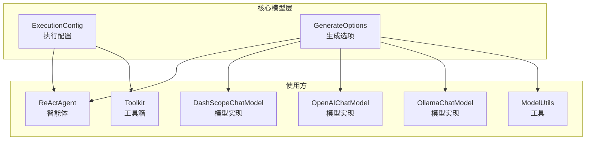
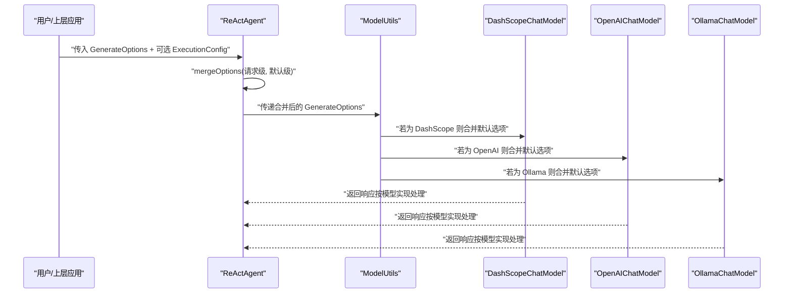
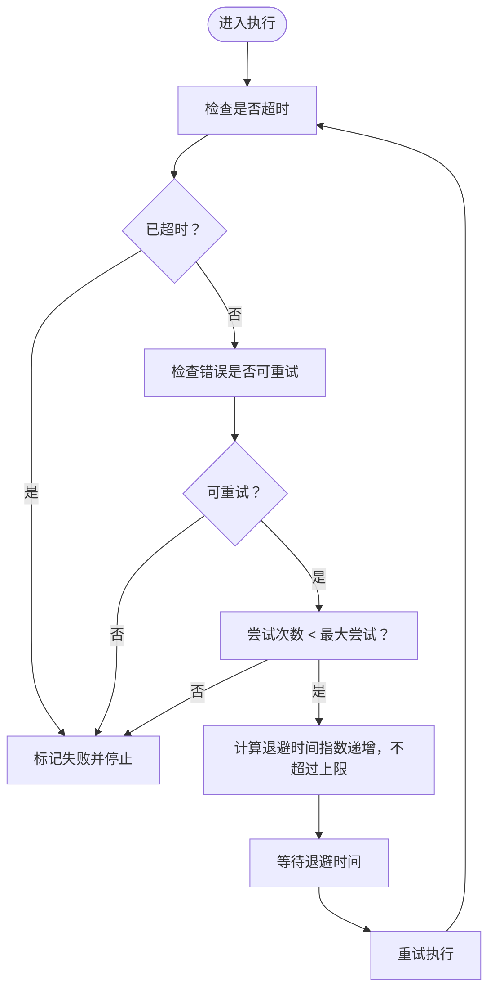
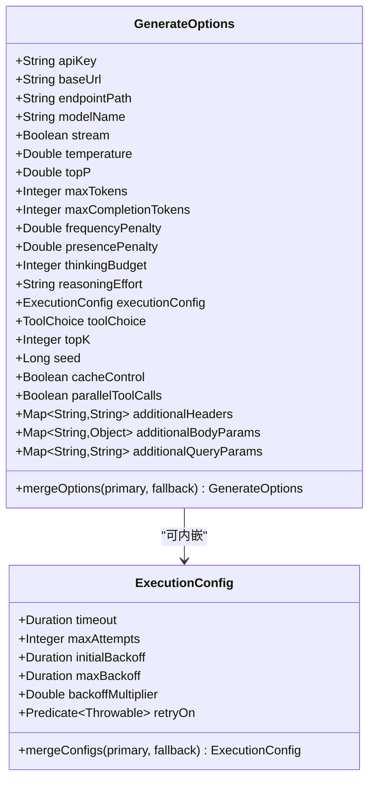
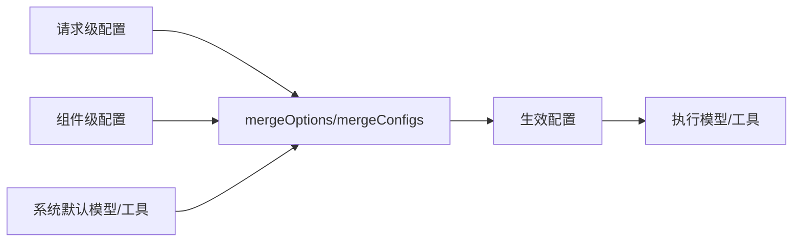

# 执行配置

<cite>
**本文引用的文件**
- [ExecutionConfig.java](file://agentscope-core/src/main/java/io/agentscope/core/model/ExecutionConfig.java)
- [GenerateOptions.java](file://agentscope-core/src/main/java/io/agentscope/core/model/GenerateOptions.java)
- [ExecutionConfigE2ETest.java](file://agentscope-core/src/test/java/io/agentscope/core/e2e/ExecutionConfigE2ETest.java)
- [GenerateOptionsTest.java](file://agentscope-core/src/test/java/io/agentscope/core/model/GenerateOptionsTest.java)
- [ReActAgent.java](file://agentscope-core/src/main/java/io/agentscope/core/ReActAgent.java)
- [DashScopeChatModel.java](file://agentscope-core/src/main/java/io/agentscope/core/model/DashScopeChatModel.java)
- [OpenAIChatModel.java](file://agentscope-core/src/main/java/io/agentscope/core/model/OpenAIChatModel.java)
- [OllamaChatModel.java](file://agentscope-core/src/main/java/io/agentscope/core/model/OllamaChatModel.java)
- [ModelUtils.java](file://agentscope-core/src/main/java/io/agentscope/core/model/ModelUtils.java)
- [Toolkit.java](file://agentscope-core/src/main/java/io/agentscope/core/tool/Toolkit.java)
</cite>

## 目录
1. [简介](#简介)
2. [项目结构](#项目结构)
3. [核心组件](#核心组件)
4. [架构总览](#架构总览)
5. [详细组件分析](#详细组件分析)
6. [依赖关系分析](#依赖关系分析)
7. [性能考量](#性能考量)
8. [故障排除指南](#故障排除指南)
9. [结论](#结论)
10. [附录：配置示例与调优](#附录配置示例与调优)

## 简介
本文件面向 AgentScope Java 的执行配置体系，围绕以下目标展开：
- 深入解释 ExecutionConfig 的配置项、超时设置与重试机制
- 详解 GenerateOptions 的生成参数、采样策略与输出格式控制
- 提供最佳实践与性能优化建议
- 给出不同场景下的配置示例与调优指南
- 解释配置的继承关系与覆盖规则
- 提供故障排除与调试方法

## 项目结构
与执行配置直接相关的代码主要位于 agentscope-core 模块的 model 包中，配套有端到端测试与多个模型实现对配置的使用验证。

图示来源
- [ExecutionConfig.java:56-395](file://agentscope-core/src/main/java/io/agentscope/core/model/ExecutionConfig.java#L56-L395)
- [GenerateOptions.java:31-874](file://agentscope-core/src/main/java/io/agentscope/core/model/GenerateOptions.java#L31-L874)
- [ReActAgent.java:997-997](file://agentscope-core/src/main/java/io/agentscope/core/ReActAgent.java#L997-L997)
- [DashScopeChatModel.java:224-224](file://agentscope-core/src/main/java/io/agentscope/core/model/DashScopeChatModel.java#L224-L224)
- [OpenAIChatModel.java:96-96](file://agentscope-core/src/main/java/io/agentscope/core/model/OpenAIChatModel.java#L96-L96)
- [OllamaChatModel.java:277-277](file://agentscope-core/src/main/java/io/agentscope/core/model/OllamaChatModel.java#L277-L277)
- [ModelUtils.java:76-76](file://agentscope-core/src/main/java/io/agentscope/core/model/ModelUtils.java#L76-L76)
- [Toolkit.java:516-518](file://agentscope-core/src/main/java/io/agentscope/core/tool/Toolkit.java#L516-L518)

章节来源
- [ExecutionConfig.java:27-55](file://agentscope-core/src/main/java/io/agentscope/core/model/ExecutionConfig.java#L27-L55)
- [GenerateOptions.java:24-31](file://agentscope-core/src/main/java/io/agentscope/core/model/GenerateOptions.java#L24-L31)

## 核心组件
- ExecutionConfig：统一的执行配置，涵盖超时、最大尝试次数、指数退避的初始/最大值、退避倍数以及错误过滤器（决定哪些异常可重试）。内置“模型默认”和“工具默认”两套标准默认值，并提供合并策略以支持多层级配置叠加。
- GenerateOptions：不可变的生成参数容器，既包含连接级配置（如 apiKey、baseUrl、endpointPath、modelName、stream），也包含生成级参数（如 temperature、topP、maxTokens、maxCompletionTokens、frequencyPenalty、presencePenalty、thinkingBudget、reasoningEffort、toolChoice、topK、seed、cacheControl、parallelToolCalls）以及扩展头、请求体与查询参数。同样提供合并策略，用于“主配置优先”的层级合并。

章节来源
- [ExecutionConfig.java:56-179](file://agentscope-core/src/main/java/io/agentscope/core/model/ExecutionConfig.java#L56-L179)
- [GenerateOptions.java:31-95](file://agentscope-core/src/main/java/io/agentscope/core/model/GenerateOptions.java#L31-L95)

## 架构总览
下图展示了从高层配置到具体模型调用的配置传递链路，包括默认值、合并策略与最终生效配置的形成过程。

图示来源
- [ReActAgent.java:997-997](file://agentscope-core/src/main/java/io/agentscope/core/ReActAgent.java#L997-L997)
- [ModelUtils.java:76-76](file://agentscope-core/src/main/java/io/agentscope/core/model/ModelUtils.java#L76-L76)
- [DashScopeChatModel.java:224-224](file://agentscope-core/src/main/java/io/agentscope/core/model/DashScopeChatModel.java#L224-L224)
- [OpenAIChatModel.java:96-96](file://agentscope-core/src/main/java/io/agentscope/core/model/OpenAIChatModel.java#L96-L96)
- [OllamaChatModel.java:277-277](file://agentscope-core/src/main/java/io/agentscope/core/model/OllamaChatModel.java#L277-L277)

## 详细组件分析

### ExecutionConfig 执行配置
- 配置项
  - 超时：单次执行（模型请求或工具调用）的超时时间
  - 最大尝试次数：包含首次尝试在内的总次数
  - 初始退避：第一次重试前的等待时间
  - 最大退避：重避等待的上限
  - 退避倍数：每次重试等待时间按倍数递增（指数退避）
  - 错误过滤器：判断异常是否应触发重试
- 标准默认
  - 模型默认：较长超时与适度重试（指数退避），适合高并发与限流场景
  - 工具默认：较长超时但不重试（仅一次尝试），强调工具调用的确定性
- 合并策略
  - 参数逐项合并：主配置非空则采用主配置，否则采用回退配置
  - 支持多层叠加：请求级 > 组件级（如智能体）> 系统默认
- 可重试错误类型
  - 限流（429）、服务端错误（5xx）、超时、网络/IO 错误
  - 明确不重试：400 参数错误、401/403 认证/授权错误等
  - 对于包装异常，会递归检查 cause

图示来源
- [ExecutionConfig.java:101-134](file://agentscope-core/src/main/java/io/agentscope/core/model/ExecutionConfig.java#L101-L134)
- [ExecutionConfig.java:275-297](file://agentscope-core/src/main/java/io/agentscope/core/model/ExecutionConfig.java#L275-L297)

章节来源
- [ExecutionConfig.java:56-179](file://agentscope-core/src/main/java/io/agentscope/core/model/ExecutionConfig.java#L56-L179)
- [ExecutionConfig.java:136-170](file://agentscope-core/src/main/java/io/agentscope/core/model/ExecutionConfig.java#L136-L170)
- [ExecutionConfig.java:244-297](file://agentscope-core/src/main/java/io/agentscope/core/model/ExecutionConfig.java#L244-L297)

### GenerateOptions 生成选项
- 连接级配置
  - apiKey、baseUrl、endpointPath、modelName、stream
- 生成级参数
  - temperature、topP、maxTokens、maxCompletionTokens、frequencyPenalty、presencePenalty、thinkingBudget、reasoningEffort、toolChoice、topK、seed、cacheControl、parallelToolCalls
- 扩展能力
  - additionalHeaders、additionalBodyParams、additionalQueryParams
- 合并策略
  - 主配置优先：非空字段采用主配置，否则采用回退配置；map 类型采用“回退先、主覆盖”的合并方式
- 与 ExecutionConfig 的关系
  - 可内嵌 ExecutionConfig，作为该次生成的执行策略（超时、重试）

图示来源
- [GenerateOptions.java:31-95](file://agentscope-core/src/main/java/io/agentscope/core/model/GenerateOptions.java#L31-L95)
- [GenerateOptions.java:423-484](file://agentscope-core/src/main/java/io/agentscope/core/model/GenerateOptions.java#L423-L484)
- [ExecutionConfig.java:56-179](file://agentscope-core/src/main/java/io/agentscope/core/model/ExecutionConfig.java#L56-L179)
- [ExecutionConfig.java:275-297](file://agentscope-core/src/main/java/io/agentscope/core/model/ExecutionConfig.java#L275-L297)

章节来源
- [GenerateOptions.java:31-95](file://agentscope-core/src/main/java/io/agentscope/core/model/GenerateOptions.java#L31-L95)
- [GenerateOptions.java:257-267](file://agentscope-core/src/main/java/io/agentscope/core/model/GenerateOptions.java#L257-L267)
- [GenerateOptions.java:380-484](file://agentscope-core/src/main/java/io/agentscope/core/model/GenerateOptions.java#L380-L484)

## 依赖关系分析
- 配置使用点
  - ReActAgent 在内部进行“请求级 + 默认级”的选项合并
  - 多个模型实现（DashScope、OpenAI、Ollama）在各自适配层进行默认选项与请求选项的合并
  - ModelUtils 提供统一的选项合并入口
  - Toolkit 在工具执行时进行 ExecutionConfig 的合并
- 合并顺序
  - 请求级 > 组件级（如智能体）> 系统默认（ExecutionConfig.MODEL_DEFAULTS/TOOL_DEFAULTS）
- 关键调用位置
  - ReActAgent：在生成流程中对 GenerateOptions 进行合并
  - DashScope/OpenAI/Ollama：在模型适配层对默认选项与请求选项进行合并
  - ModelUtils：提供通用的选项合并逻辑
  - Toolkit：在工具执行路径上合并执行配置

图示来源
- [ReActAgent.java:997-997](file://agentscope-core/src/main/java/io/agentscope/core/ReActAgent.java#L997-L997)
- [DashScopeChatModel.java:224-224](file://agentscope-core/src/main/java/io/agentscope/core/model/DashScopeChatModel.java#L224-L224)
- [OpenAIChatModel.java:96-96](file://agentscope-core/src/main/java/io/agentscope/core/model/OpenAIChatModel.java#L96-L96)
- [OllamaChatModel.java:277-277](file://agentscope-core/src/main/java/io/agentscope/core/model/OllamaChatModel.java#L277-L277)
- [ModelUtils.java:76-76](file://agentscope-core/src/main/java/io/agentscope/core/model/ModelUtils.java#L76-L76)
- [Toolkit.java:516-518](file://agentscope-core/src/main/java/io/agentscope/core/tool/Toolkit.java#L516-L518)

章节来源
- [ReActAgent.java:997-997](file://agentscope-core/src/main/java/io/agentscope/core/ReActAgent.java#L997-L997)
- [DashScopeChatModel.java:224-224](file://agentscope-core/src/main/java/io/agentscope/core/model/DashScopeChatModel.java#L224-L224)
- [OpenAIChatModel.java:96-96](file://agentscope-core/src/main/java/io/agentscope/core/model/OpenAIChatModel.java#L96-L96)
- [OllamaChatModel.java:277-277](file://agentscope-core/src/main/java/io/agentscope/core/model/OllamaChatModel.java#L277-L277)
- [ModelUtils.java:76-76](file://agentscope-core/src/main/java/io/agentscope/core/model/ModelUtils.java#L76-L76)
- [Toolkit.java:516-518](file://agentscope-core/src/main/java/io/agentscope/core/tool/Toolkit.java#L516-L518)

## 性能考量
- 超时设置
  - 模型默认较长超时，适合高并发与限流场景；复杂任务或慢模型可适当延长
  - 工具默认不重试，避免工具调用被多次放大
- 重试与退避
  - 指数退避可有效缓解瞬时限流与抖动；合理设置最大退避上限，避免过长等待
  - 错误过滤器默认区分客户端错误与服务端错误，减少无效重试
- 采样参数
  - temperature/topP 控制多样性；高频推理类任务可降低温度提升稳定性
  - topK/seed 有助于稳定输出与可复现性
- 并行工具调用
  - parallelToolCalls 可提升工具使用效率，但需关注并发与资源限制
- 缓存控制
  - cacheControl 可开启提示缓存以降低延迟与成本，适用于重复提示场景

## 故障排除指南
- 常见问题定位
  - 超时导致失败：检查请求级超时是否过短，必要时结合模型默认或自定义延长
  - 频繁重试：确认错误类型是否属于可重试范围；必要时自定义 retryOn 过滤器
  - 工具调用失败：工具默认不重试，若需要可显式配置 ExecutionConfig 并设置重试
- 调试步骤
  - 使用端到端测试中的构建模式验证配置行为（如自定义超时、重试次数、退避）
  - 在单元测试中验证选项合并与边界值（空值、覆盖、map 合并）
- 参考测试用例
  - 执行配置端到端测试：验证默认超时、自定义模型执行配置、构建器模式
  - 生成选项单元测试：验证合并策略、额外参数、连接级配置

章节来源
- [ExecutionConfigE2ETest.java:67-127](file://agentscope-core/src/test/java/io/agentscope/core/e2e/ExecutionConfigE2ETest.java#L67-L127)
- [ExecutionConfigE2ETest.java:130-159](file://agentscope-core/src/test/java/io/agentscope/core/e2e/ExecutionConfigE2ETest.java#L130-L159)
- [GenerateOptionsTest.java:330-357](file://agentscope-core/src/test/java/io/agentscope/core/model/GenerateOptionsTest.java#L330-L357)
- [GenerateOptionsTest.java:394-477](file://agentscope-core/src/test/java/io/agentscope/core/model/GenerateOptionsTest.java#L394-L477)

## 结论
ExecutionConfig 与 GenerateOptions 共同构成了 AgentScope Java 的执行与生成配置核心。通过清晰的默认值、严格的合并规则与可扩展的错误过滤策略，系统能够在不同场景下平衡可靠性、性能与可控性。建议在生产环境中遵循“请求级最小化差异、组件级统一策略、系统级稳健默认”的分层配置原则，并结合实际负载与提供商特性进行针对性调优。

## 附录：配置示例与调优
- 场景一：通用对话（模型调用）
  - 建议：沿用模型默认超时与适度重试；必要时缩短重试上限以降低平均等待
  - 参考：[ExecutionConfig.java:151-159](file://agentscope-core/src/main/java/io/agentscope/core/model/ExecutionConfig.java#L151-L159)
- 场景二：长文本/复杂推理
  - 建议：适当延长超时；谨慎调整温度与 topP；启用 cacheControl 以降低成本
  - 参考：[GenerateOptions.java:306-323](file://agentscope-core/src/main/java/io/agentscope/core/model/GenerateOptions.java#L306-L323)
- 场景三：工具调用（高可靠性）
  - 建议：工具默认不重试；若确需重试，设置较小初始退避与较低最大退避
  - 参考：[ExecutionConfig.java:169-170](file://agentscope-core/src/main/java/io/agentscope/core/model/ExecutionConfig.java#L169-L170)
- 场景四：高并发限流
  - 建议：提高初始与最大退避，增大最大尝试次数；使用 RETRYABLE_ERRORS 或自定义过滤器
  - 参考：[ExecutionConfig.java:93-134](file://agentscope-core/src/main/java/io/agentscope/core/model/ExecutionConfig.java#L93-L134)
- 场景五：端到端验证
  - 建议：参考端到端测试中的构建器模式与自定义配置，确保超时与重试符合预期
  - 参考：[ExecutionConfigE2ETest.java:90-127](file://agentscope-core/src/test/java/io/agentscope/core/e2e/ExecutionConfigE2ETest.java#L90-L127)
- 配置合并与覆盖
  - 建议：请求级 > 组件级 > 系统默认；对 map 类型参数（头、请求体、查询）采用“回退先、主覆盖”
  - 参考：[GenerateOptions.java:423-484](file://agentscope-core/src/main/java/io/agentscope/core/model/GenerateOptions.java#L423-L484)，[ExecutionConfig.java:275-297](file://agentscope-core/src/main/java/io/agentscope/core/model/ExecutionConfig.java#L275-L297)