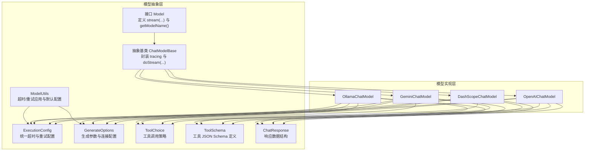
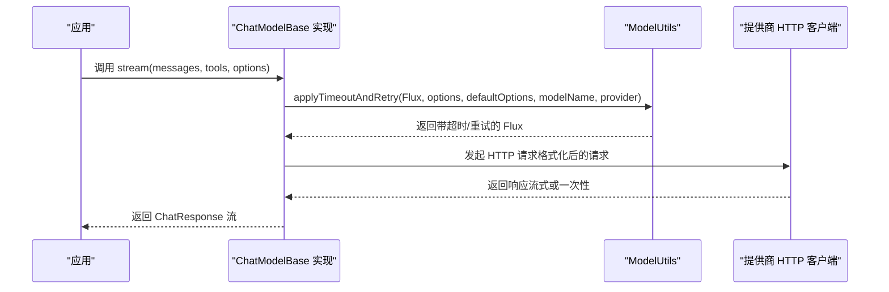
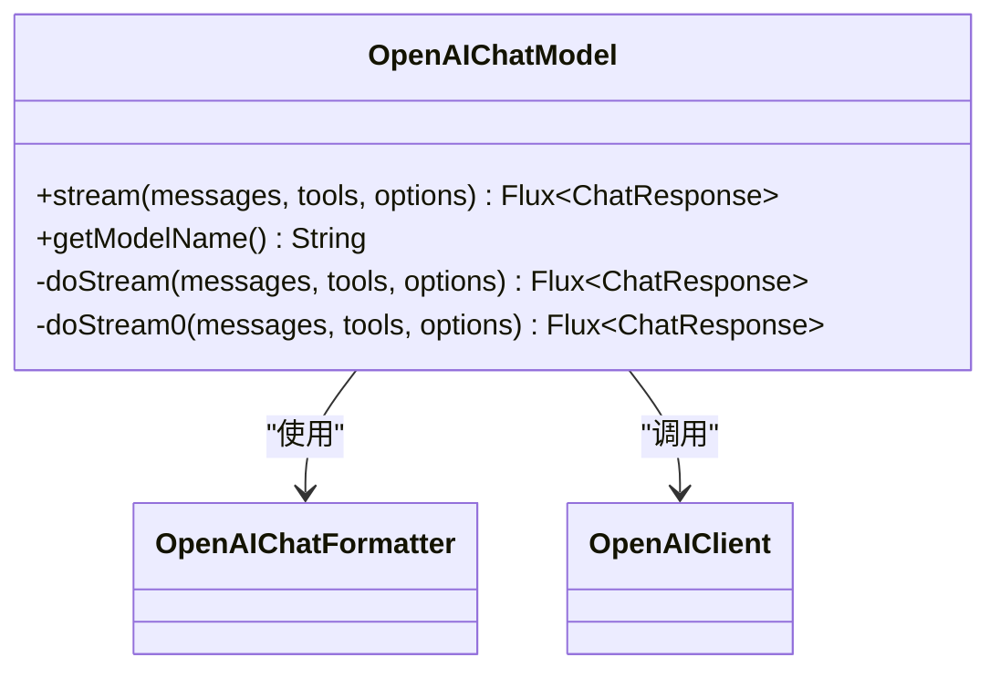
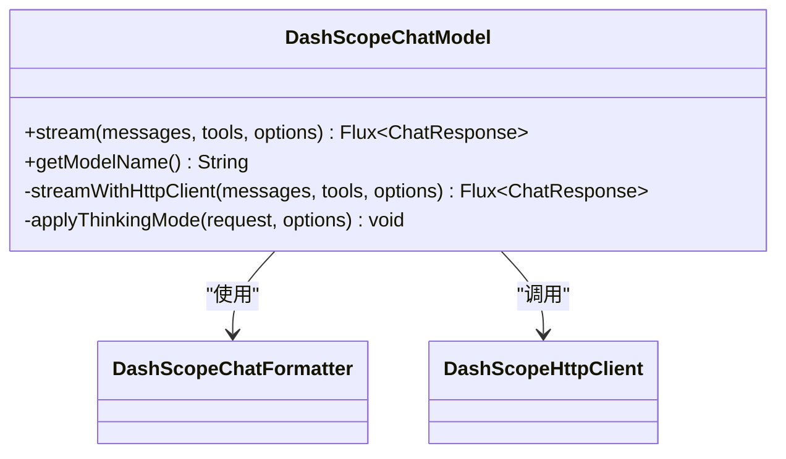
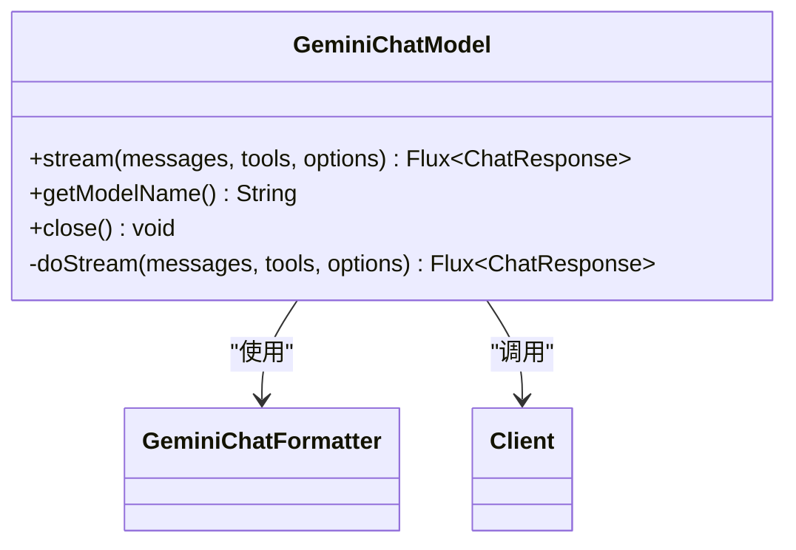
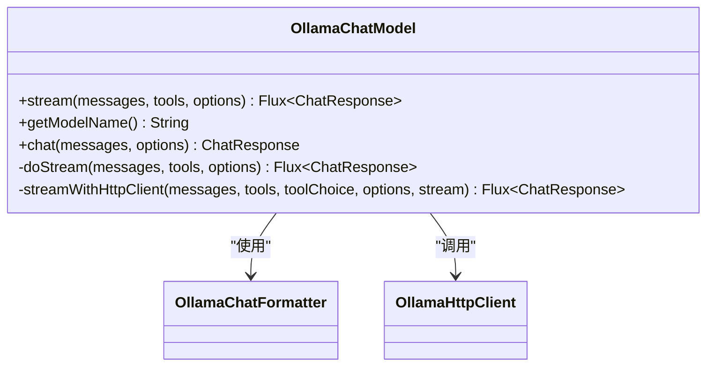
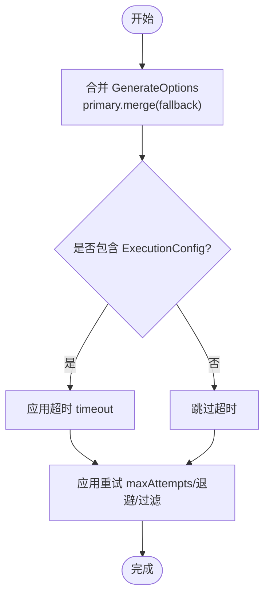
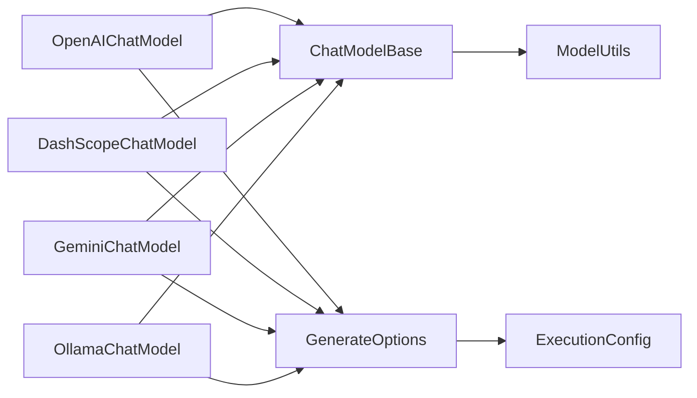

# 模型 API

<cite>
**本文引用的文件**
- [Model.java](file://agentscope-core/src/main/java/io/agentscope/core/model/Model.java)
- [ChatModelBase.java](file://agentscope-core/src/main/java/io/agentscope/core/model/ChatModelBase.java)
- [OpenAIChatModel.java](file://agentscope-core/src/main/java/io/agentscope/core/model/OpenAIChatModel.java)
- [DashScopeChatModel.java](file://agentscope-core/src/main/java/io/agentscope/core/model/DashScopeChatModel.java)
- [GeminiChatModel.java](file://agentscope-core/src/main/java/io/agentscope/core/model/GeminiChatModel.java)
- [OllamaChatModel.java](file://agentscope-core/src/main/java/io/agentscope/core/model/OllamaChatModel.java)
- [ExecutionConfig.java](file://agentscope-core/src/main/java/io/agentscope/core/model/ExecutionConfig.java)
- [GenerateOptions.java](file://agentscope-core/src/main/java/io/agentscope/core/model/GenerateOptions.java)
- [ToolChoice.java](file://agentscope-core/src/main/java/io/agentscope/core/model/ToolChoice.java)
- [ToolSchema.java](file://agentscope-core/src/main/java/io/agentscope/core/model/ToolSchema.java)
- [ChatResponse.java](file://agentscope-core/src/main/java/io/agentscope/core/model/ChatResponse.java)
- [ModelUtils.java](file://agentscope-core/src/main/java/io/agentscope/core/model/ModelUtils.java)
- [OpenAIChatModelTest.java](file://agentscope-core/src/test/java/io/agentscope/core/model/OpenAIChatModelTest.java)
</cite>

## 目录
1. [简介](#简介)
2. [项目结构](#项目结构)
3. [核心组件](#核心组件)
4. [架构总览](#架构总览)
5. [详细组件分析](#详细组件分析)
6. [依赖关系分析](#依赖关系分析)
7. [性能考量](#性能考量)
8. [故障排查指南](#故障排查指南)
9. [结论](#结论)
10. [附录：使用示例与最佳实践](#附录使用示例与最佳实践)

## 简介
本文件为 AgentScope Java 模型集成 API 的权威参考文档，聚焦于统一的 Model 接口及其在 OpenAI、DashScope、Gemini、Ollama 四大模型提供商上的实现，系统阐述以下内容：
- Model 接口设计与方法语义
- 各实现类的构造方式、关键方法签名与行为差异
- GenerateOptions 与 ExecutionConfig 的配置项与合并策略
- 流式与非流式调用模式
- 工具调用（Tool Calling）与工具选择策略
- 面向生产环境的最佳实践与常见问题排查

## 项目结构
AgentScope 将“模型抽象”与“具体实现”解耦，通过统一接口与可插拔的消息格式化器对接多家模型提供商，同时提供统一的超时与重试控制。

图示来源
- [Model.java:22-41](file://agentscope-core/src/main/java/io/agentscope/core/model/Model.java#L22-L41)
- [ChatModelBase.java:29-61](file://agentscope-core/src/main/java/io/agentscope/core/model/ChatModelBase.java#L29-L61)
- [OpenAIChatModel.java:58-357](file://agentscope-core/src/main/java/io/agentscope/core/model/OpenAIChatModel.java#L58-L357)
- [DashScopeChatModel.java:52-588](file://agentscope-core/src/main/java/io/agentscope/core/model/DashScopeChatModel.java#L52-L588)
- [GeminiChatModel.java:55-513](file://agentscope-core/src/main/java/io/agentscope/core/model/GeminiChatModel.java#L55-L513)
- [OllamaChatModel.java:53-287](file://agentscope-core/src/main/java/io/agentscope/core/model/OllamaChatModel.java#L53-L287)
- [ExecutionConfig.java:56-394](file://agentscope-core/src/main/java/io/agentscope/core/model/ExecutionConfig.java#L56-L394)
- [GenerateOptions.java:31-873](file://agentscope-core/src/main/java/io/agentscope/core/model/GenerateOptions.java#L31-L873)
- [ToolChoice.java:45-84](file://agentscope-core/src/main/java/io/agentscope/core/model/ToolChoice.java#L45-L84)
- [ToolSchema.java:28-182](file://agentscope-core/src/main/java/io/agentscope/core/model/ToolSchema.java#L28-L182)
- [ChatResponse.java:29-207](file://agentscope-core/src/main/java/io/agentscope/core/model/ChatResponse.java#L29-L207)
- [ModelUtils.java:31-178](file://agentscope-core/src/main/java/io/agentscope/core/model/ModelUtils.java#L31-L178)

章节来源
- [Model.java:22-41](file://agentscope-core/src/main/java/io/agentscope/core/model/Model.java#L22-L41)
- [ChatModelBase.java:29-61](file://agentscope-core/src/main/java/io/agentscope/core/model/ChatModelBase.java#L29-L61)

## 核心组件
- Model 接口：定义统一的流式对话调用入口与模型标识获取能力。
- ChatModelBase 抽象类：封装 tracing 调用与 doStream 抽象方法，子类仅需实现具体网络与格式化细节。
- GenerateOptions：统一承载连接级（如 apiKey、baseUrl、endpointPath、modelName、stream）与生成级（温度、采样、工具等）参数，并支持与默认配置的参数级合并。
- ExecutionConfig：统一超时与重试配置，支持可插拔的错误过滤策略与指数退避。
- ToolChoice/ToolSchema：标准化工具调用策略与工具 JSON Schema 描述。
- ChatResponse：标准化响应体，包含内容块、用量统计、元数据与结束原因。
- ModelUtils：提供统一的超时与重试应用逻辑，以及默认执行配置注入。

章节来源
- [Model.java:22-41](file://agentscope-core/src/main/java/io/agentscope/core/model/Model.java#L22-L41)
- [ChatModelBase.java:29-61](file://agentscope-core/src/main/java/io/agentscope/core/model/ChatModelBase.java#L29-L61)
- [GenerateOptions.java:31-873](file://agentscope-core/src/main/java/io/agentscope/core/model/GenerateOptions.java#L31-L873)
- [ExecutionConfig.java:56-394](file://agentscope-core/src/main/java/io/agentscope/core/model/ExecutionConfig.java#L56-L394)
- [ToolChoice.java:45-84](file://agentscope-core/src/main/java/io/agentscope/core/model/ToolChoice.java#L45-L84)
- [ToolSchema.java:28-182](file://agentscope-core/src/main/java/io/agentscope/core/model/ToolSchema.java#L28-L182)
- [ChatResponse.java:29-207](file://agentscope-core/src/main/java/io/agentscope/core/model/ChatResponse.java#L29-L207)
- [ModelUtils.java:31-178](file://agentscope-core/src/main/java/io/agentscope/core/model/ModelUtils.java#L31-L178)

## 架构总览
AgentScope 的模型层采用“接口 + 抽象基类 + 多实现 + 统一配置”的分层设计。各实现通过各自的格式化器将 AgentScope 的消息转换为对应提供商的请求格式，并通过统一的超时/重试机制保障鲁棒性。

图示来源
- [ChatModelBase.java:42-60](file://agentscope-core/src/main/java/io/agentscope/core/model/ChatModelBase.java#L42-L60)
- [ModelUtils.java:69-139](file://agentscope-core/src/main/java/io/agentscope/core/model/ModelUtils.java#L69-L139)

## 详细组件分析

### Model 接口与 ChatModelBase 基类
- Model 接口
  - 方法：stream(List<Msg>, List<ToolSchema>, GenerateOptions) → Flux<ChatResponse>
  - 作用：统一的流式对话调用入口；内部由实现类负责消息格式化与提供商适配。
  - 其他：getModelName() 提供日志与识别用途的模型名。
- ChatModelBase
  - 在 stream 中封装 TracerRegistry 的调用记录；实际的 doStream 由子类实现。
  - 子类只需实现 doStream(...) 即可接入统一的 tracing 与错误处理框架。

章节来源
- [Model.java:22-41](file://agentscope-core/src/main/java/io/agentscope/core/model/Model.java#L22-L41)
- [ChatModelBase.java:29-61](file://agentscope-core/src/main/java/io/agentscope/core/model/ChatModelBase.java#L29-L61)

### OpenAIChatModel（OpenAI、DeepSeek、GLM 等）
- 关键点
  - 支持流式与非流式；自动注入 stream_options 以确保用量统计可用。
  - 通过 OpenAIChatFormatter 等格式化器适配不同提供商。
  - 支持工具调用、工具选择策略、缓存控制、自定义 endpointPath。
  - 构建器支持 apiKey、modelName、baseUrl、endpointPath、formatter、httpTransport 等。
- 方法与行为
  - doStream/doStream0：合并 options 与默认配置；格式化消息；构建请求；按 stream 标志选择流式或单次调用；解析响应。
  - getModelName：返回配置中的模型名。
- 配置要点
  - GenerateOptions 中的 apiKey/baseUrl/modelName/stream/工具参数/缓存控制等均会透传到请求中。
  - 默认 endpointPath 为标准 OpenAI 路径，可通过 endpointPath 自定义。

图示来源
- [OpenAIChatModel.java:58-357](file://agentscope-core/src/main/java/io/agentscope/core/model/OpenAIChatModel.java#L58-L357)

章节来源
- [OpenAIChatModel.java:58-357](file://agentscope-core/src/main/java/io/agentscope/core/model/OpenAIChatModel.java#L58-L357)

### DashScopeChatModel（通义千问、视觉模型等）
- 关键点
  - 自动路由文本/多模态 API；支持思维模式（enableThinking）、搜索增强（enableSearch）。
  - 支持加密传输（RSA 公钥拉取与 AES-GCM 加密）。
  - 构建器支持 apiKey、modelName、stream、enableThinking、enableSearch、endpointType、defaultOptions、baseUrl、formatter、httpTransport、enableEncrypt。
- 方法与行为
  - doStream：根据 endpointType 与模型名判断是否多模态；格式化消息；构建请求；应用思维模式与缓存控制；流式/非流式调用。
  - applyThinkingMode：当启用思维模式时强制开启流式并设置相关参数。
- 配置要点
  - thinkingBudget 只有在显式启用思维模式后才生效。
  - cacheControl 通过格式化器对系统消息与最后一条消息添加缓存控制标记。

图示来源
- [DashScopeChatModel.java:52-588](file://agentscope-core/src/main/java/io/agentscope/core/model/DashScopeChatModel.java#L52-L588)

章节来源
- [DashScopeChatModel.java:52-588](file://agentscope-core/src/main/java/io/agentscope/core/model/DashScopeChatModel.java#L52-L588)

### GeminiChatModel（Google Gemini）
- 关键点
  - 使用官方 GenAI Java SDK；支持文本、多模态、工具调用、多代理历史合并。
  - 支持 Vertex AI 与 Gemini API 双通道；可配置项目、位置、凭据与 HTTP 选项。
- 方法与行为
  - doStream：根据 streamEnabled 选择流式或非流式；通过格式化器转换消息与工具；调用 SDK API 并解析响应。
- 配置要点
  - apiKey/baseUrl/modelName/streamEnabled/project/location/vertexAI/credentials/httpOptions/clientOptions/defaultOptions/formatter。

图示来源
- [GeminiChatModel.java:55-513](file://agentscope-core/src/main/java/io/agentscope/core/model/GeminiChatModel.java#L55-L513)

章节来源
- [GeminiChatModel.java:55-513](file://agentscope-core/src/main/java/io/agentscope/core/model/GeminiChatModel.java#L55-L513)

### OllamaChatModel（本地 Ollama 实例）
- 关键点
  - 通过 Ollama HTTP API 与本地模型交互；支持流式与非流式；支持工具调用。
  - 提供 OllamaOptions 与 GenerateOptions 的互转；默认执行配置自动注入。
- 方法与行为
  - chat(...)：同步调用（基于 streamWithHttpClient 的非流式包装）。
  - doStream：统一走 streamWithHttpClient，支持合并默认与请求级 OllamaOptions。
  - streamWithHttpClient：格式化消息与请求；流式/非流式调用；应用超时与重试。
- 配置要点
  - modelName/baseUrl/defaultOptions/formatter/httpTransport；默认执行配置优先级：用户配置 > MODEL_DEFAULTS。

图示来源
- [OllamaChatModel.java:53-287](file://agentscope-core/src/main/java/io/agentscope/core/model/OllamaChatModel.java#L53-L287)

章节来源
- [OllamaChatModel.java:53-287](file://agentscope-core/src/main/java/io/agentscope/core/model/OllamaChatModel.java#L53-L287)

### GenerateOptions 与 ExecutionConfig
- GenerateOptions
  - 连接级：apiKey、baseUrl、endpointPath、modelName、stream。
  - 生成级：temperature、topP、maxTokens、maxCompletionTokens、frequencyPenalty、presencePenalty、thinkingBudget、reasoningEffort、toolChoice、topK、seed、cacheControl、parallelToolCalls、additionalHeaders/body/query 参数。
  - 执行级：executionConfig（与 ExecutionConfig 合并）。
  - 合并策略：逐字段优先使用主配置（primary），否则回退到后备配置（fallback）；Map 类型字段进行合并（先放 fallback，再覆盖主配置）。
- ExecutionConfig
  - 字段：timeout、maxAttempts、initialBackoff、maxBackoff、backoffMultiplier、retryOn。
  - 标准默认：MODEL_DEFAULTS（5 分钟超时、3 次尝试、指数退避上限 30 秒）、TOOL_DEFAULTS（5 分钟超时、不重试）。
  - 错误可重试判定：429/5xx/超时/IO 错误可重试；400 不可重试；嵌套异常递归判定。
  - 合并策略：逐字段优先使用主配置，否则回退到后备配置。

图示来源
- [GenerateOptions.java:423-484](file://agentscope-core/src/main/java/io/agentscope/core/model/GenerateOptions.java#L423-L484)
- [ExecutionConfig.java:275-297](file://agentscope-core/src/main/java/io/agentscope/core/model/ExecutionConfig.java#L275-L297)
- [ModelUtils.java:69-139](file://agentscope-core/src/main/java/io/agentscope/core/model/ModelUtils.java#L69-L139)

章节来源
- [GenerateOptions.java:31-873](file://agentscope-core/src/main/java/io/agentscope/core/model/GenerateOptions.java#L31-L873)
- [ExecutionConfig.java:56-394](file://agentscope-core/src/main/java/io/agentscope/core/model/ExecutionConfig.java#L56-L394)
- [ModelUtils.java:31-178](file://agentscope-core/src/main/java/io/agentscope/core/model/ModelUtils.java#L31-L178)

### 工具调用与工具选择
- ToolChoice
  - Auto：模型自主决定是否调用工具。
  - None：禁止工具调用。
  - Required：强制至少一次工具调用。
  - Specific(toolName)：强制调用指定工具。
- ToolSchema
  - 描述工具名称、描述、参数 JSON Schema、输出 Schema、严格模式。
- 在各实现中，工具调用通过格式化器应用到请求中，并结合 ToolChoice 控制策略。

章节来源
- [ToolChoice.java:45-84](file://agentscope-core/src/main/java/io/agentscope/core/model/ToolChoice.java#L45-L84)
- [ToolSchema.java:28-182](file://agentscope-core/src/main/java/io/agentscope/core/model/ToolSchema.java#L28-L182)

### 响应与用量
- ChatResponse
  - 字段：id、content（内容块列表）、usage（Token 用量）、metadata（提供商元数据）、finishReason（结束原因）。
  - 特性：支持 withId 重设 id；若未提供 id，将自动生成 UUID（兼容 Ollama 等不返回 id 的提供商）。

章节来源
- [ChatResponse.java:29-207](file://agentscope-core/src/main/java/io/agentscope/core/model/ChatResponse.java#L29-L207)

## 依赖关系分析
- 继承与组合
  - OpenAI/DashScope/Gemini/Ollama 均继承 ChatModelBase，复用 tracing 与超时/重试。
  - 各实现通过格式化器（Formatter）将 AgentScope 消息转换为提供商请求。
  - ModelUtils 作为横切关注点，统一注入超时与重试。
- 配置合并
  - GenerateOptions.mergeOptions 与 ExecutionConfig.mergeConfigs 提供参数级与字段级的优先级策略，便于“请求级 > 组件默认 > 系统默认”的层级化配置。

图示来源
- [OpenAIChatModel.java:58-357](file://agentscope-core/src/main/java/io/agentscope/core/model/OpenAIChatModel.java#L58-L357)
- [DashScopeChatModel.java:52-588](file://agentscope-core/src/main/java/io/agentscope/core/model/DashScopeChatModel.java#L52-L588)
- [GeminiChatModel.java:55-513](file://agentscope-core/src/main/java/io/agentscope/core/model/GeminiChatModel.java#L55-L513)
- [OllamaChatModel.java:53-287](file://agentscope-core/src/main/java/io/agentscope/core/model/OllamaChatModel.java#L53-L287)
- [ChatModelBase.java:29-61](file://agentscope-core/src/main/java/io/agentscope/core/model/ChatModelBase.java#L29-L61)
- [ModelUtils.java:31-178](file://agentscope-core/src/main/java/io/agentscope/core/model/ModelUtils.java#L31-L178)
- [GenerateOptions.java:31-873](file://agentscope-core/src/main/java/io/agentscope/core/model/GenerateOptions.java#L31-L873)
- [ExecutionConfig.java:56-394](file://agentscope-core/src/main/java/io/agentscope/core/model/ExecutionConfig.java#L56-L394)

章节来源
- [OpenAIChatModel.java:58-357](file://agentscope-core/src/main/java/io/agentscope/core/model/OpenAIChatModel.java#L58-L357)
- [DashScopeChatModel.java:52-588](file://agentscope-core/src/main/java/io/agentscope/core/model/DashScopeChatModel.java#L52-L588)
- [GeminiChatModel.java:55-513](file://agentscope-core/src/main/java/io/agentscope/core/model/GeminiChatModel.java#L55-L513)
- [OllamaChatModel.java:53-287](file://agentscope-core/src/main/java/io/agentscope/core/model/OllamaChatModel.java#L53-L287)
- [ChatModelBase.java:29-61](file://agentscope-core/src/main/java/io/agentscope/core/model/ChatModelBase.java#L29-L61)
- [ModelUtils.java:31-178](file://agentscope-core/src/main/java/io/agentscope/core/model/ModelUtils.java#L31-L178)
- [GenerateOptions.java:31-873](file://agentscope-core/src/main/java/io/agentscope/core/model/GenerateOptions.java#L31-L873)
- [ExecutionConfig.java:56-394](file://agentscope-core/src/main/java/io/agentscope/core/model/ExecutionConfig.java#L56-L394)

## 性能考量
- 超时与重试
  - 使用 ExecutionConfig 配置超时与指数退避重试，避免长时间阻塞与抖动放大。
  - MODEL_DEFAULTS 适用于模型调用，TOOL_DEFAULTS 适用于工具调用（通常不重试）。
- 流式传输
  - 优先使用流式接口以降低首字节延迟与内存占用；非流式适合短文本或需要一次性聚合结果的场景。
- 缓存控制
  - 启用 cacheControl 可减少重复提示词的开销（部分提供商支持）。
- 并行工具调用
  - parallelToolCalls 可提升多工具场景下的吞吐，但需评估并发与限速限制。

## 故障排查指南
- 常见错误类型
  - 超时：检查 ExecutionConfig.timeout 与网络状况。
  - 速率限制/服务器错误：确认 retryOn 过滤策略与退避上限。
  - 认证失败：核对 apiKey/baseUrl/modelName 是否正确。
  - 请求路径错误：核对 endpointPath 与提供商要求。
- 定位手段
  - 查看日志与异常栈；利用 TracerRegistry 记录的调用上下文。
  - 使用单元/集成测试验证请求路径与参数（参考 OpenAIChatModelTest）。
- 建议
  - 对高并发场景适当提高初始/最大退避时间，避免雪崩。
  - 对工具调用开启并行时注意提供商限速与并发上限。

章节来源
- [ExecutionConfig.java:75-134](file://agentscope-core/src/main/java/io/agentscope/core/model/ExecutionConfig.java#L75-L134)
- [ModelUtils.java:69-139](file://agentscope-core/src/main/java/io/agentscope/core/model/ModelUtils.java#L69-L139)
- [OpenAIChatModelTest.java:88-533](file://agentscope-core/src/test/java/io/agentscope/core/model/OpenAIChatModelTest.java#L88-L533)

## 结论
AgentScope 的模型 API 通过统一接口与可插拔格式化器，实现了对 OpenAI、DashScope、Gemini、Ollama 的一致化接入；配合 GenerateOptions 与 ExecutionConfig 的参数级与字段级合并策略，既保证了灵活性，又提供了稳定的超时与重试保障。推荐在生产环境中：
- 明确区分“请求级”“组件默认”“系统默认”的配置层级；
- 优先使用流式接口与缓存控制；
- 针对不同提供商的 endpointPath、工具调用策略与特殊参数进行精细化配置；
- 为高并发场景合理设置超时与重试策略。

## 附录：使用示例与最佳实践

### 通用调用流程（流式与非流式）
- 流式调用
  - 通过 Model.stream(...) 获取 Flux<ChatResponse>，逐个消费响应块。
  - 适用于长文本生成、实时反馈与多模态输出。
- 非流式调用
  - 将流式结果 blockLast() 或订阅完成后一次性获取最终响应。
  - 适用于短文本或需要一次性聚合的场景。

章节来源
- [Model.java:22-41](file://agentscope-core/src/main/java/io/agentscope/core/model/Model.java#L22-L41)
- [ChatModelBase.java:42-60](file://agentscope-core/src/main/java/io/agentscope/core/model/ChatModelBase.java#L42-L60)

### OpenAI 集成要点
- 构建器常用项：apiKey、modelName、stream、endpointPath、formatter、httpTransport。
- 生成参数：temperature、topP、maxTokens、maxCompletionTokens、parallelToolCalls、cacheControl。
- 注意：当启用 cacheControl 时，格式化器会在系统消息与最后一条消息上添加缓存控制标记。

章节来源
- [OpenAIChatModel.java:206-356](file://agentscope-core/src/main/java/io/agentscope/core/model/OpenAIChatModel.java#L206-L356)
- [OpenAIChatModelTest.java:197-308](file://agentscope-core/src/test/java/io/agentscope/core/model/OpenAIChatModelTest.java#L197-L308)

### DashScope 集成要点
- 构建器常用项：apiKey、modelName、stream、enableThinking、enableSearch、endpointType、defaultOptions、baseUrl、formatter、httpTransport、enableEncrypt。
- 思维模式：启用 enableThinking 会强制开启流式并可设置 thinkingBudget。
- 加密：开启 enableEncrypt 会自动拉取公钥并启用加密。

章节来源
- [DashScopeChatModel.java:357-587](file://agentscope-core/src/main/java/io/agentscope/core/model/DashScopeChatModel.java#L357-L587)

### Gemini 集成要点
- 构建器常用项：apiKey、baseUrl、modelName、streamEnabled、project、location、vertexAI、credentials、httpOptions、clientOptions、defaultOptions、formatter。
- 支持 Vertex AI 与 Gemini API 双通道；可配置 HTTP 与客户端选项。

章节来源
- [GeminiChatModel.java:343-512](file://agentscope-core/src/main/java/io/agentscope/core/model/GeminiChatModel.java#L343-L512)

### Ollama 集成要点
- 构建器常用项：modelName、baseUrl、defaultOptions、formatter、httpTransport。
- 默认执行配置：用户配置优先，否则使用 MODEL_DEFAULTS。
- 工具调用：通过 OllamaOptions.fromGenerateOptions(options) 互转。

章节来源
- [OllamaChatModel.java:235-286](file://agentscope-core/src/main/java/io/agentscope/core/model/OllamaChatModel.java#L235-L286)

### 配置合并与默认值
- GenerateOptions.mergeOptions：逐字段优先使用主配置，否则回退到后备配置；Map 类型字段合并。
- ExecutionConfig.mergeConfigs：逐字段优先使用主配置，否则回退到后备配置。
- ModelUtils.ensureDefaultExecutionConfig：为空则注入 MODEL_DEFAULTS，否则与 MODEL_DEFAULTS 合并。

章节来源
- [GenerateOptions.java:423-484](file://agentscope-core/src/main/java/io/agentscope/core/model/GenerateOptions.java#L423-L484)
- [ExecutionConfig.java:275-297](file://agentscope-core/src/main/java/io/agentscope/core/model/ExecutionConfig.java#L275-L297)
- [ModelUtils.java:158-177](file://agentscope-core/src/main/java/io/agentscope/core/model/ModelUtils.java#L158-L177)

### 工具调用最佳实践
- 明确工具 Schema：使用 ToolSchema.builder() 定义工具名称、描述与参数 JSON Schema。
- 工具选择策略：根据业务需求选择 Auto/None/Required/Specific。
- 并行工具调用：在支持的提供商上启用 parallelToolCalls 提升吞吐。

章节来源
- [ToolSchema.java:104-181](file://agentscope-core/src/main/java/io/agentscope/core/model/ToolSchema.java#L104-L181)
- [ToolChoice.java:45-84](file://agentscope-core/src/main/java/io/agentscope/core/model/ToolChoice.java#L45-L84)