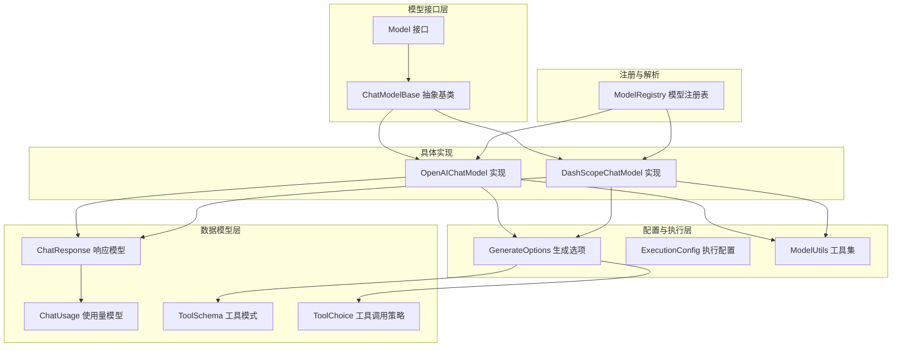
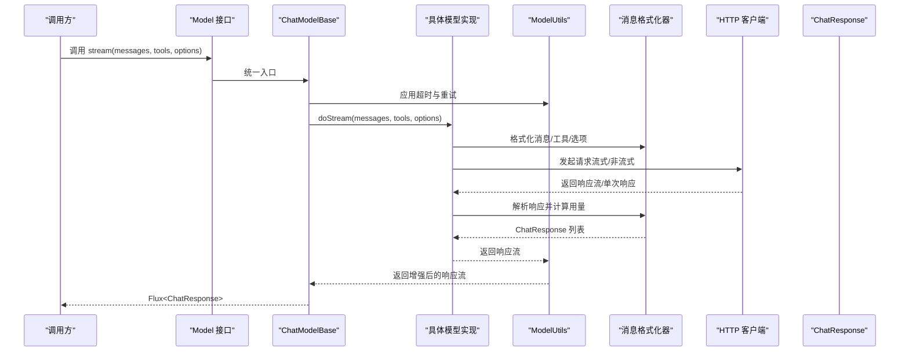
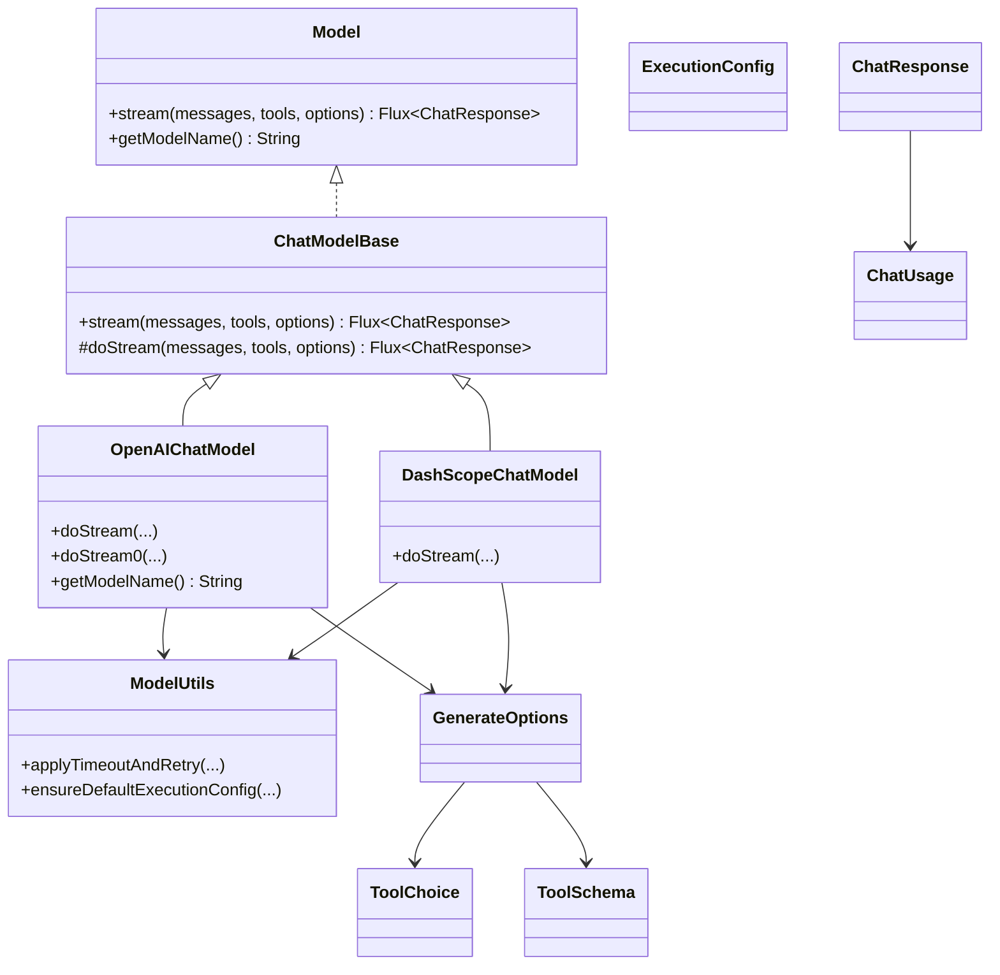

# 模型接口设计

<cite>
**本文引用的文件**
- [Model.java](file://agentscope-core/src/main/java/io/agentscope/core/model/Model.java)
- [ChatModelBase.java](file://agentscope-core/src/main/java/io/agentscope/core/model/ChatModelBase.java)
- [ChatResponse.java](file://agentscope-core/src/main/java/io/agentscope/core/model/ChatResponse.java)
- [GenerateOptions.java](file://agentscope-core/src/main/java/io/agentscope/core/model/GenerateOptions.java)
- [ExecutionConfig.java](file://agentscope-core/src/main/java/io/agentscope/core/model/ExecutionConfig.java)
- [ToolChoice.java](file://agentscope-core/src/main/java/io/agentscope/core/model/ToolChoice.java)
- [ToolSchema.java](file://agentscope-core/src/main/java/io/agentscope/core/model/ToolSchema.java)
- [ChatUsage.java](file://agentscope-core/src/main/java/io/agentscope/core/model/ChatUsage.java)
- [ModelRegistry.java](file://agentscope-core/src/main/java/io/agentscope/core/model/ModelRegistry.java)
- [ModelUtils.java](file://agentscope-core/src/main/java/io/agentscope/core/model/ModelUtils.java)
- [OpenAIChatModel.java](file://agentscope-core/src/main/java/io/agentscope/core/model/OpenAIChatModel.java)
- [DashScopeChatModel.java](file://agentscope-core/src/main/java/io/agentscope/core/model/DashScopeChatModel.java)
</cite>

## 目录
1. [简介](#简介)
2. [项目结构](#项目结构)
3. [核心组件](#核心组件)
4. [架构总览](#架构总览)
5. [详细组件分析](#详细组件分析)
6. [依赖关系分析](#依赖关系分析)
7. [性能考量](#性能考量)
8. [故障排查指南](#故障排查指南)
9. [结论](#结论)
10. [附录：流式处理与最佳实践](#附录流式处理与最佳实践)

## 简介
本文件系统性阐述 AgentScope Java 的模型接口设计，围绕 Model 接口、ChatModelBase 抽象基类、ChatResponse 数据模型展开，并结合 GenerateOptions、ExecutionConfig、ToolChoice、ToolSchema、ChatUsage 等配套类型，解释其方法签名、参数语义、返回值类型与扩展机制。同时给出流式处理 API 的使用模式与最佳实践，并通过 OpenAI 与 DashScope 模型实现示例展示如何扩展自定义模型适配器。

## 项目结构
AgentScope 的模型层位于 agentscope-core 模块的 io.agentscope.core.model 包中，采用“接口 + 抽象基类 + 数据模型 + 工具类”的分层设计：
- 接口与抽象基类：Model、ChatModelBase
- 数据模型：ChatResponse、ChatUsage、ToolSchema、ToolChoice
- 配置与执行：GenerateOptions、ExecutionConfig、ModelUtils
- 注册与解析：ModelRegistry
- 具体实现：OpenAIChatModel、DashScopeChatModel 等

**图表来源**
- [Model.java:22-41](file://agentscope-core/src/main/java/io/agentscope/core/model/Model.java#L22-L41)
- [ChatModelBase.java:29-61](file://agentscope-core/src/main/java/io/agentscope/core/model/ChatModelBase.java#L29-L61)
- [ChatResponse.java:29-207](file://agentscope-core/src/main/java/io/agentscope/core/model/ChatResponse.java#L29-L207)
- [GenerateOptions.java:31-95](file://agentscope-core/src/main/java/io/agentscope/core/model/GenerateOptions.java#L31-L95)
- [ExecutionConfig.java:56-179](file://agentscope-core/src/main/java/io/agentscope/core/model/ExecutionConfig.java#L56-L179)
- [ToolChoice.java:45-84](file://agentscope-core/src/main/java/io/agentscope/core/model/ToolChoice.java#L45-L84)
- [ToolSchema.java:28-106](file://agentscope-core/src/main/java/io/agentscope/core/model/ToolSchema.java#L28-L106)
- [ModelRegistry.java:35-260](file://agentscope-core/src/main/java/io/agentscope/core/model/ModelRegistry.java#L35-L260)
- [OpenAIChatModel.java:58-200](file://agentscope-core/src/main/java/io/agentscope/core/model/OpenAIChatModel.java#L58-L200)
- [DashScopeChatModel.java:52-200](file://agentscope-core/src/main/java/io/agentscope/core/model/DashScopeChatModel.java#L52-L200)

**章节来源**
- [Model.java:22-41](file://agentscope-core/src/main/java/io/agentscope/core/model/Model.java#L22-L41)
- [ChatModelBase.java:29-61](file://agentscope-core/src/main/java/io/agentscope/core/model/ChatModelBase.java#L29-L61)
- [ModelRegistry.java:35-260](file://agentscope-core/src/main/java/io/agentscope/core/model/ModelRegistry.java#L35-L260)

## 核心组件
- Model 接口：定义统一的流式对话接口与模型名称标识能力，屏蔽底层提供商差异。
- ChatModelBase 抽象基类：在统一入口中注入遥测与默认执行配置，子类仅需实现 doStream。
- ChatResponse 数据模型：封装响应内容、用量、元数据与结束原因，支持链式构造与克隆。
- GenerateOptions 配置模型：集中管理连接级（如 apiKey、baseUrl、endpointPath、modelName、stream）与生成级（温度、采样、最大 token、工具选择等）参数，并提供合并策略。
- ExecutionConfig 执行配置：统一超时与重试行为，支持可插拔的错误判定策略。
- ToolChoice/ToolSchema：描述工具调用策略与工具参数/输出的 JSON Schema。
- ChatUsage：记录输入/输出 token 与耗时。
- ModelRegistry：按命名或正则工厂解析模型实例，内置多提供商自动创建规则。
- ModelUtils：提供超时与重试增强、默认执行配置确保等通用能力。

**章节来源**
- [Model.java:22-41](file://agentscope-core/src/main/java/io/agentscope/core/model/Model.java#L22-L41)
- [ChatModelBase.java:29-61](file://agentscope-core/src/main/java/io/agentscope/core/model/ChatModelBase.java#L29-L61)
- [ChatResponse.java:29-207](file://agentscope-core/src/main/java/io/agentscope/core/model/ChatResponse.java#L29-L207)
- [GenerateOptions.java:31-95](file://agentscope-core/src/main/java/io/agentscope/core/model/GenerateOptions.java#L31-L95)
- [ExecutionConfig.java:56-179](file://agentscope-core/src/main/java/io/agentscope/core/model/ExecutionConfig.java#L56-L179)
- [ToolChoice.java:45-84](file://agentscope-core/src/main/java/io/agentscope/core/model/ToolChoice.java#L45-L84)
- [ToolSchema.java:28-106](file://agentscope-core/src/main/java/io/agentscope/core/model/ToolSchema.java#L28-L106)
- [ChatUsage.java:24-86](file://agentscope-core/src/main/java/io/agentscope/core/model/ChatUsage.java#L24-L86)
- [ModelRegistry.java:35-260](file://agentscope-core/src/main/java/io/agentscope/core/model/ModelRegistry.java#L35-L260)
- [ModelUtils.java:31-179](file://agentscope-core/src/main/java/io/agentscope/core/model/ModelUtils.java#L31-L179)

## 架构总览
下图展示了从调用方到具体模型实现的完整链路，以及关键扩展点（格式化器、传输层、工具与选项应用）：

**图表来源**
- [ChatModelBase.java:42-48](file://agentscope-core/src/main/java/io/agentscope/core/model/ChatModelBase.java#L42-L48)
- [OpenAIChatModel.java:82-91](file://agentscope-core/src/main/java/io/agentscope/core/model/OpenAIChatModel.java#L82-L91)
- [DashScopeChatModel.java:194-200](file://agentscope-core/src/main/java/io/agentscope/core/model/DashScopeChatModel.java#L194-L200)
- [ModelUtils.java:69-139](file://agentscope-core/src/main/java/io/agentscope/core/model/ModelUtils.java#L69-L139)

## 详细组件分析

### Model 接口
- 方法签名与职责
  - stream(messages, tools, options): 返回 Flux<ChatResponse>，内部通过格式化器将 AgentScope 消息转换为提供商期望格式，支持工具 schema 与生成选项。
  - getModelName(): 返回模型名称，用于日志与识别。
- 参数说明
  - messages: 输入消息列表，由 Msg 构成。
  - tools: 工具 schema 列表；可为空或 null。
  - options: 生成选项；可为空或 null，表示使用默认配置。
- 返回值类型
  - Flux<ChatResponse>: 支持背压与异步消费的响应流。

**章节来源**
- [Model.java:22-41](file://agentscope-core/src/main/java/io/agentscope/core/model/Model.java#L22-L41)

### ChatModelBase 抽象基类
- 设计要点
  - 在 stream 中统一注入遥测与默认执行配置，子类仅需实现 doStream。
  - doStream 为受保护的抽象方法，强制子类关注具体提供商的实现细节。
- 扩展机制
  - 子类通过覆写 doStream 并结合 ModelUtils.applyTimeoutAndRetry 实现一致的超时与重试行为。
  - 可通过 GenerateOptions 合并与 ExecutionConfig 提供统一的错误处理策略。

**章节来源**
- [ChatModelBase.java:29-61](file://agentscope-core/src/main/java/io/agentscope/core/model/ChatModelBase.java#L29-L61)

### ChatResponse 数据模型
- 字段与用途
  - id: 响应唯一标识；若为空可自动生成。
  - content: 内容块列表，承载文本/多媒体/工具调用结果等。
  - usage: Token 使用量与耗时。
  - metadata: 来自提供商的附加信息。
  - finishReason: 结束原因（如 stop、length、content_filter 等）。
- 构造与扩展
  - 提供 Builder 以构建不可变对象。
  - withId: 基于现有实例生成新 id 的副本，便于链路追踪。

**章节来源**
- [ChatResponse.java:29-207](file://agentscope-core/src/main/java/io/agentscope/core/model/ChatResponse.java#L29-L207)

### GenerateOptions 生成选项
- 连接级配置
  - apiKey、baseUrl、endpointPath、modelName、stream。
- 生成级参数
  - temperature、topP、maxTokens、maxCompletionTokens、frequencyPenalty、presencePenalty、thinkingBudget、reasoningEffort、toolChoice、topK、seed、cacheControl、parallelToolCalls。
- 扩展字段
  - additionalHeaders、additionalBodyParams、additionalQueryParams。
- 合并策略
  - mergeOptions: 逐字段优先级合并，支持 ExecutionConfig 的深度合并。

**章节来源**
- [GenerateOptions.java:31-95](file://agentscope-core/src/main/java/io/agentscope/core/model/GenerateOptions.java#L31-L95)
- [GenerateOptions.java:423-484](file://agentscope-core/src/main/java/io/agentscope/core/model/GenerateOptions.java#L423-L484)

### ExecutionConfig 执行配置
- 字段
  - timeout、maxAttempts、initialBackoff、maxBackoff、backoffMultiplier、retryOn。
- 默认策略
  - MODEL_DEFAULTS：较长初始与最大退避，适合高并发限流场景。
  - TOOL_DEFAULTS：无重试，强调工具调用的确定性。
- 合并策略
  - mergeConfigs：逐字段优先级合并。

**章节来源**
- [ExecutionConfig.java:56-179](file://agentscope-core/src/main/java/io/agentscope/core/model/ExecutionConfig.java#L56-L179)
- [ExecutionConfig.java:275-297](file://agentscope-core/src/main/java/io/agentscope/core/model/ExecutionConfig.java#L275-L297)

### ToolChoice 与 ToolSchema
- ToolChoice
  - Auto、None、Required、Specific(record)：控制模型是否/何时调用工具。
- ToolSchema
  - 描述工具名称、描述、参数 JSON Schema、输出 Schema、strict 模式。
  - Builder 提供不可变构建流程。

**章节来源**
- [ToolChoice.java:45-84](file://agentscope-core/src/main/java/io/agentscope/core/model/ToolChoice.java#L45-L84)
- [ToolSchema.java:28-106](file://agentscope-core/src/main/java/io/agentscope/core/model/ToolSchema.java#L28-L106)

### ChatUsage 使用量模型
- 字段
  - inputTokens、outputTokens、time。
- 计算
  - getTotalTokens：输入与输出之和。
- 构建
  - Builder 提供链式设置。

**章节来源**
- [ChatUsage.java:24-86](file://agentscope-core/src/main/java/io/agentscope/core/model/ChatUsage.java#L24-L86)

### ModelRegistry 模型注册与解析
- 功能
  - register(name, model)：命名注册。
  - registerFactory(regex, factory)：用户自定义工厂，优先于内置提供者。
  - resolve(modelId)：按命名、缓存、用户工厂、内置工厂顺序解析。
  - canResolve(modelId)/reset()：辅助判断与清理。
- 内置提供者
  - openai:xxx、dashscope:xxx、qwen-*、anthropic:xxx、gemini:xxx、ollama:xxx。
  - 自动读取环境变量进行创建（如 OPENAI_API_KEY、DASHSCOPE_API_KEY 等）。

**章节来源**
- [ModelRegistry.java:35-260](file://agentscope-core/src/main/java/io/agentscope/core/model/ModelRegistry.java#L35-L260)

### ModelUtils 工具集
- applyTimeoutAndRetry
  - 将超时与指数退避重试应用于响应流，支持可选的错误过滤策略。
- ensureDefaultExecutionConfig
  - 确保生成选项具备 MODEL_DEFAULTS 的执行配置，避免遗漏。

**章节来源**
- [ModelUtils.java:31-179](file://agentscope-core/src/main/java/io/agentscope/core/model/ModelUtils.java#L31-L179)

### 具体实现示例：OpenAIChatModel
- 关键点
  - 继承 ChatModelBase，覆写 doStream/doStream0。
  - 合并 options 与 configuredOptions，校验 modelName。
  - 通过 OpenAIChatFormatter 格式化消息、工具、选项与工具选择。
  - 流式/非流式分支分别映射响应并过滤空值。
  - 使用 ModelUtils.applyTimeoutAndRetry 应用超时与重试。
- 适用场景
  - OpenAI/GPT 系列、DeepSeek、GLM 等兼容 OpenAI 协议的模型。

**章节来源**
- [OpenAIChatModel.java:58-200](file://agentscope-core/src/main/java/io/agentscope/core/model/OpenAIChatModel.java#L58-L200)

### 具体实现示例：DashScopeChatModel
- 关键点
  - 支持文本/视觉模型自动路由，思维模式（enableThinking）强制启用流式。
  - 通过 DashScopeChatFormatter 处理消息、工具与选项。
  - 通过 DashScopeHttpClient 发起请求，支持加密公钥配置。
  - 统一在 doStream 中应用超时与重试。
- 适用场景
  - DashScope 文本/视觉/多模态模型，支持搜索增强与思维模式。

**章节来源**
- [DashScopeChatModel.java:52-200](file://agentscope-core/src/main/java/io/agentscope/core/model/DashScopeChatModel.java#L52-L200)

## 依赖关系分析
- 组件耦合
  - ChatModelBase 与 ModelRegistry 通过统一入口解耦具体实现。
  - 具体模型实现依赖 Formatter 与 HTTP 客户端，便于替换与扩展。
  - ModelUtils 作为横切关注点，被所有实现复用。
- 外部依赖
  - Reactor(Flux) 用于响应式流处理。
  - SLF4J 用于日志记录。
  - OkHttp/自定义 HttpTransport 用于网络请求（由具体实现选择）。

**图表来源**
- [Model.java:22-41](file://agentscope-core/src/main/java/io/agentscope/core/model/Model.java#L22-L41)
- [ChatModelBase.java:29-61](file://agentscope-core/src/main/java/io/agentscope/core/model/ChatModelBase.java#L29-L61)
- [OpenAIChatModel.java:58-200](file://agentscope-core/src/main/java/io/agentscope/core/model/OpenAIChatModel.java#L58-L200)
- [DashScopeChatModel.java:52-200](file://agentscope-core/src/main/java/io/agentscope/core/model/DashScopeChatModel.java#L52-L200)
- [ModelUtils.java:31-179](file://agentscope-core/src/main/java/io/agentscope/core/model/ModelUtils.java#L31-L179)
- [GenerateOptions.java:31-95](file://agentscope-core/src/main/java/io/agentscope/core/model/GenerateOptions.java#L31-L95)
- [ChatResponse.java:29-207](file://agentscope-core/src/main/java/io/agentscope/core/model/ChatResponse.java#L29-L207)
- [ChatUsage.java:24-86](file://agentscope-core/src/main/java/io/agentscope/core/model/ChatUsage.java#L24-L86)
- [ToolChoice.java:45-84](file://agentscope-core/src/main/java/io/agentscope/core/model/ToolChoice.java#L45-L84)
- [ToolSchema.java:28-106](file://agentscope-core/src/main/java/io/agentscope/core/model/ToolSchema.java#L28-L106)

## 性能考量
- 流式处理
  - 优先使用流式响应以降低首字节延迟与内存占用。
  - 对于非流式场景，建议在独立调度器上执行以避免阻塞主线程。
- 超时与重试
  - 使用 ExecutionConfig 配置合理的超时与指数退避，避免雪崩效应。
  - 通过 ModelUtils.ensureDefaultExecutionConfig 确保默认配置生效。
- 工具调用
  - 合理设置 toolChoice 与 parallelToolCalls，减少不必要的工具调用往返。
- 缓存控制
  - 在支持的提供商上启用 cacheControl，减少重复提示的开销。

[本节为通用指导，无需特定文件引用]

## 故障排查指南
- 常见问题定位
  - 超时：检查 ExecutionConfig.timeout 与实际网络状况，确认 ModelUtils.applyTimeoutAndRetry 是否正确应用。
  - 重试：确认 retryOn 策略与错误类型，必要时调整 backoff 与 maxAttempts。
  - 工具调用失败：核对 ToolSchema 的参数/输出 Schema 与 provider 的要求是否一致。
  - 模型解析失败：使用 ModelRegistry.canResolve(modelId) 判断，检查环境变量与工厂注册。
- 日志与追踪
  - 具体实现会在关键路径打印调试日志，便于定位格式化、请求与响应阶段的问题。

**章节来源**
- [ExecutionConfig.java:93-134](file://agentscope-core/src/main/java/io/agentscope/core/model/ExecutionConfig.java#L93-L134)
- [ModelUtils.java:69-139](file://agentscope-core/src/main/java/io/agentscope/core/model/ModelUtils.java#L69-L139)
- [ModelRegistry.java:179-201](file://agentscope-core/src/main/java/io/agentscope/core/model/ModelRegistry.java#L179-L201)

## 结论
AgentScope 的模型接口设计以“统一接口 + 抽象基类 + 数据模型 + 工具集”为核心，既保证了跨提供商的一致体验，又提供了强大的扩展能力。通过 GenerateOptions 与 ExecutionConfig 的组合，开发者可以灵活地控制连接、生成与执行行为；借助 ModelRegistry 与具体实现，能够快速接入多种模型服务。流式处理与超时/重试机制进一步提升了系统的鲁棒性与用户体验。

[本节为总结性内容，无需特定文件引用]

## 附录：流式处理与最佳实践

### 流式处理 API 使用模式
- 基本步骤
  - 准备消息列表与可选工具 schema。
  - 构造 GenerateOptions（可选），设置 stream=true 以启用流式。
  - 调用 Model.stream(...) 获取 Flux<ChatResponse>。
  - 使用订阅线程与背压策略消费响应流。
- 最佳实践
  - 在 doStream 中先合并 options 与默认配置，再进行格式化与请求。
  - 对于需要统计 token 的场景，确保流式选项开启以获取最终用量。
  - 对于工具调用，尽量在请求前完成 schema 校验与格式化。

**章节来源**
- [OpenAIChatModel.java:82-179](file://agentscope-core/src/main/java/io/agentscope/core/model/OpenAIChatModel.java#L82-L179)
- [DashScopeChatModel.java:194-200](file://agentscope-core/src/main/java/io/agentscope/core/model/DashScopeChatModel.java#L194-L200)

### 自定义模型适配器实现步骤
- 步骤
  - 新建类继承 ChatModelBase，并实现 doStream(...)。
  - 在 doStream 中：
    - 合并 options 与默认配置。
    - 选择/创建格式化器与 HTTP 客户端。
    - 根据 provider 特性应用工具 schema、生成参数与缓存控制。
    - 发起请求并解析为 ChatResponse。
    - 使用 ModelUtils.applyTimeoutAndRetry 增强超时与重试。
  - 实现 getModelName() 返回模型名称。
  - 可选：向 ModelRegistry 注册工厂或命名实例。
- 示例参考
  - OpenAIChatModel：标准 OpenAI 协议实现。
  - DashScopeChatModel：多模态与思维模式支持。

**章节来源**
- [ChatModelBase.java:59-60](file://agentscope-core/src/main/java/io/agentscope/core/model/ChatModelBase.java#L59-L60)
- [OpenAIChatModel.java:82-179](file://agentscope-core/src/main/java/io/agentscope/core/model/OpenAIChatModel.java#L82-L179)
- [DashScopeChatModel.java:194-200](file://agentscope-core/src/main/java/io/agentscope/core/model/DashScopeChatModel.java#L194-L200)
- [ModelRegistry.java:114-134](file://agentscope-core/src/main/java/io/agentscope/core/model/ModelRegistry.java#L114-L134)