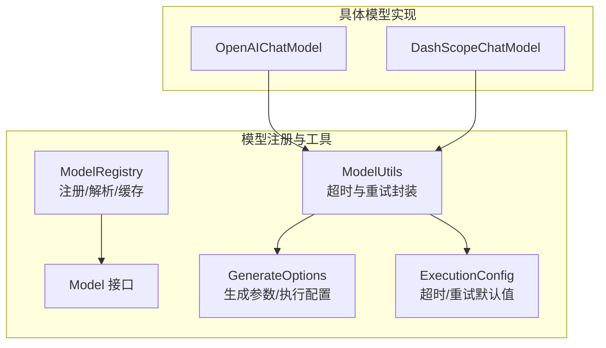
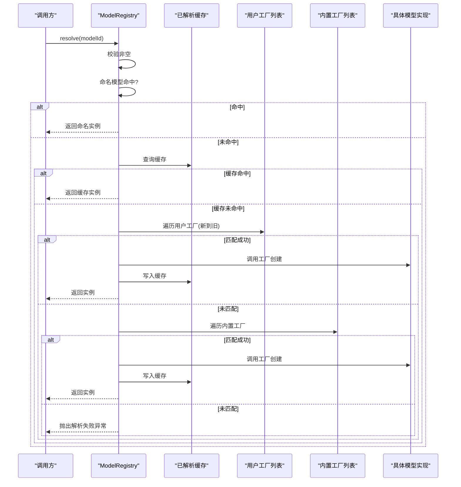
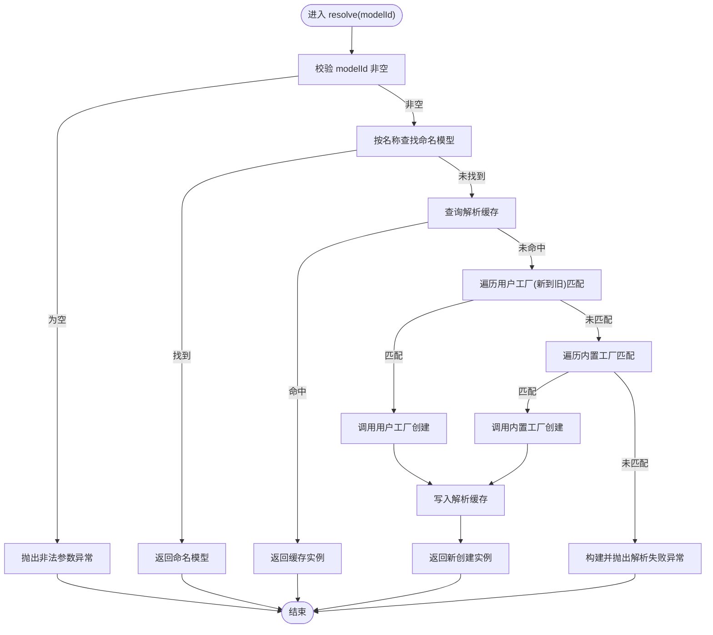
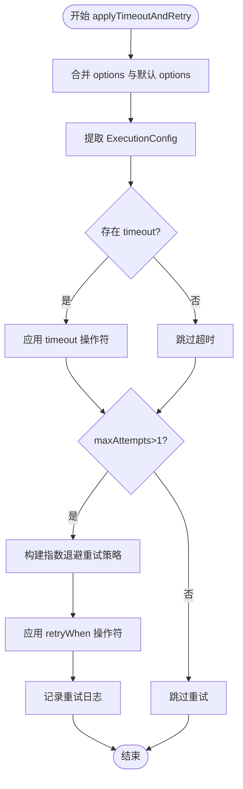
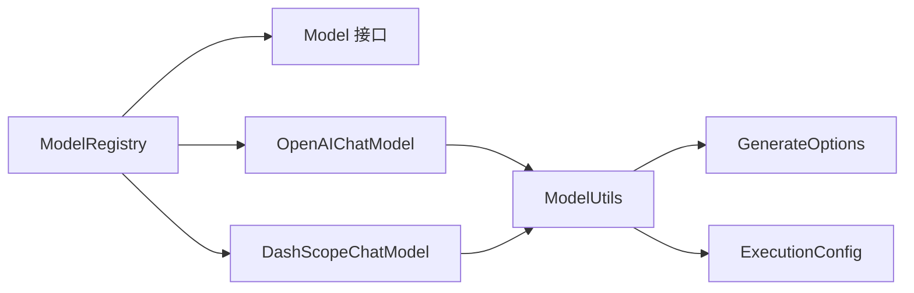

# 模型注册中心

<cite>
**本文引用的文件列表**
- [ModelRegistry.java](file://agentscope-core/src/main/java/io/agentscope/core/model/ModelRegistry.java)
- [ModelUtils.java](file://agentscope-core/src/main/java/io/agentscope/core/model/ModelUtils.java)
- [Model.java](file://agentscope-core/src/main/java/io/agentscope/core/model/Model.java)
- [GenerateOptions.java](file://agentscope-core/src/main/java/io/agentscope/core/model/GenerateOptions.java)
- [ExecutionConfig.java](file://agentscope-core/src/main/java/io/agentscope/core/model/ExecutionConfig.java)
- [OpenAIChatModel.java](file://agentscope-core/src/main/java/io/agentscope/core/model/OpenAIChatModel.java)
- [DashScopeChatModel.java](file://agentscope-core/src/main/java/io/agentscope/core/model/DashScopeChatModel.java)
- [ModelRegistryTest.java](file://agentscope-core/src/test/java/io/agentscope/core/model/ModelRegistryTest.java)
</cite>

## 目录
1. [简介](#简介)
2. [项目结构](#项目结构)
3. [核心组件](#核心组件)
4. [架构总览](#架构总览)
5. [组件详解](#组件详解)
6. [依赖关系分析](#依赖关系分析)
7. [性能与并发特性](#性能与并发特性)
8. [API 使用示例](#api-使用示例)
9. [模型别名与版本管理](#模型别名与版本管理)
10. [配置验证与冲突检测](#配置验证与冲突检测)
11. [动态模型切换与热更新](#动态模型切换与热更新)
12. [生命周期管理与资源清理](#生命周期管理与资源清理)
13. [故障排查指南](#故障排查指南)
14. [结论](#结论)

## 简介
本文件面向 AgentScope Java 的“模型注册中心”，系统性阐述 ModelRegistry 的注册与解析机制、ModelUtils 提供的通用模型操作能力，并结合具体实现说明如何进行模型注册、注销与查询；解释模型别名与版本控制策略；给出配置验证与冲突检测的实现细节；提供动态模型切换与热更新的可行方案；最后总结模型生命周期管理与资源清理的最佳实践。

## 项目结构
围绕模型注册与工具的相关代码主要位于 agentscope-core 模块的 io.agentscope.core.model 包中：
- 注册与解析：ModelRegistry
- 工具方法：ModelUtils
- 接口与配置：Model、GenerateOptions、ExecutionConfig
- 具体实现：OpenAIChatModel、DashScopeChatModel（用于演示注册与解析）

图表来源
- [ModelRegistry.java:35-260](file://agentscope-core/src/main/java/io/agentscope/core/model/ModelRegistry.java#L35-L260)
- [ModelUtils.java:31-179](file://agentscope-core/src/main/java/io/agentscope/core/model/ModelUtils.java#L31-L179)
- [Model.java:22-42](file://agentscope-core/src/main/java/io/agentscope/core/model/Model.java#L22-L42)
- [GenerateOptions.java:31-800](file://agentscope-core/src/main/java/io/agentscope/core/model/GenerateOptions.java#L31-L800)
- [ExecutionConfig.java:56-395](file://agentscope-core/src/main/java/io/agentscope/core/model/ExecutionConfig.java#L56-L395)
- [OpenAIChatModel.java:58-200](file://agentscope-core/src/main/java/io/agentscope/core/model/OpenAIChatModel.java#L58-L200)
- [DashScopeChatModel.java:52-200](file://agentscope-core/src/main/java/io/agentscope/core/model/DashScopeChatModel.java#L52-L200)

章节来源
- [ModelRegistry.java:35-260](file://agentscope-core/src/main/java/io/agentscope/core/model/ModelRegistry.java#L35-L260)
- [ModelUtils.java:31-179](file://agentscope-core/src/main/java/io/agentscope/core/model/ModelUtils.java#L31-L179)
- [Model.java:22-42](file://agentscope-core/src/main/java/io/agentscope/core/model/Model.java#L22-L42)
- [GenerateOptions.java:31-800](file://agentscope-core/src/main/java/io/agentscope/core/model/GenerateOptions.java#L31-L800)
- [ExecutionConfig.java:56-395](file://agentscope-core/src/main/java/io/agentscope/core/model/ExecutionConfig.java#L56-L395)
- [OpenAIChatModel.java:58-200](file://agentscope-core/src/main/java/io/agentscope/core/model/OpenAIChatModel.java#L58-L200)
- [DashScopeChatModel.java:52-200](file://agentscope-core/src/main/java/io/agentscope/core/model/DashScopeChatModel.java#L52-L200)

## 核心组件
- ModelRegistry：全局单例式注册表，支持命名模型注册、用户自定义工厂注册、内置工厂自动创建、解析结果缓存与可解析性检查。
- ModelUtils：提供统一的超时与重试封装，确保所有模型实现遵循一致的执行策略。
- Model 接口：定义模型的标准能力（流式对话响应、模型名称）。
- GenerateOptions/ExecutionConfig：统一承载生成参数与执行配置（超时、重试等），支持分层合并。

章节来源
- [ModelRegistry.java:35-260](file://agentscope-core/src/main/java/io/agentscope/core/model/ModelRegistry.java#L35-L260)
- [ModelUtils.java:31-179](file://agentscope-core/src/main/java/io/agentscope/core/model/ModelUtils.java#L31-L179)
- [Model.java:22-42](file://agentscope-core/src/main/java/io/agentscope/core/model/Model.java#L22-L42)
- [GenerateOptions.java:31-800](file://agentscope-core/src/main/java/io/agentscope/core/model/GenerateOptions.java#L31-L800)
- [ExecutionConfig.java:56-395](file://agentscope-core/src/main/java/io/agentscope/core/model/ExecutionConfig.java#L56-L395)

## 架构总览
ModelRegistry 作为“模型解析中枢”，在解析流程中遵循优先级：命名注册 > 已解析缓存 > 用户工厂（新到旧）> 内置工厂。内置工厂基于正则模式匹配“provider:model”或短格式（如 qwen-*），并在必要时从环境变量读取密钥。模型实现通过 ModelUtils 统一应用超时与重试策略。

图表来源
- [ModelRegistry.java:142-173](file://agentscope-core/src/main/java/io/agentscope/core/model/ModelRegistry.java#L142-L173)
- [ModelRegistry.java:214-226](file://agentscope-core/src/main/java/io/agentscope/core/model/ModelRegistry.java#L214-L226)

## 组件详解

### ModelRegistry 解析与注册机制
- 注册命名模型：register(name, model) 将实例登记到并发映射，后续按名称精确匹配。
- 注册用户工厂：registerFactory(regex, factory) 将工厂插入列表头部，优先于旧注册与内置工厂。
- 解析流程：resolve(modelId)
  - 校验非空
  - 命名模型直接返回
  - 查找解析缓存
  - 遍历用户工厂（新到旧）
  - 遍历内置工厂
  - 任一匹配即创建并写入缓存
  - 否则抛出带帮助信息的异常
- 可解析性检查：canResolve(modelId) 不创建实例，仅判断是否能解析。
- 重置：reset() 清理命名模型、用户工厂与解析缓存，保留内置规则，便于测试。

图表来源
- [ModelRegistry.java:142-173](file://agentscope-core/src/main/java/io/agentscope/core/model/ModelRegistry.java#L142-L173)
- [ModelRegistry.java:214-226](file://agentscope-core/src/main/java/io/agentscope/core/model/ModelRegistry.java#L214-L226)

章节来源
- [ModelRegistry.java:114-201](file://agentscope-core/src/main/java/io/agentscope/core/model/ModelRegistry.java#L114-L201)
- [ModelRegistry.java:244-258](file://agentscope-core/src/main/java/io/agentscope/core/model/ModelRegistry.java#L244-L258)

### ModelUtils 超时与重试封装
- applyTimeoutAndRetry：对响应流应用超时与指数退避重试，支持按请求覆盖默认执行配置。
- ensureDefaultExecutionConfig：确保生成选项具备默认执行配置（如未设置），避免遗漏超时/重试。
- 默认策略：MODEL_DEFAULTS（较长超时与适度重试）、TOOL_DEFAULTS（较短超时且不重试）。

图表来源
- [ModelUtils.java:69-139](file://agentscope-core/src/main/java/io/agentscope/core/model/ModelUtils.java#L69-L139)
- [ExecutionConfig.java:151-170](file://agentscope-core/src/main/java/io/agentscope/core/model/ExecutionConfig.java#L151-L170)

章节来源
- [ModelUtils.java:69-177](file://agentscope-core/src/main/java/io/agentscope/core/model/ModelUtils.java#L69-L177)
- [ExecutionConfig.java:56-395](file://agentscope-core/src/main/java/io/agentscope/core/model/ExecutionConfig.java#L56-L395)

### 具体模型实现与集成
- OpenAIChatModel：通过 OpenAIChatFormatter 进行消息格式化与请求构建，支持流式与非流式，结合 ModelUtils 应用超时与重试。
- DashScopeChatModel：支持文本/视觉模型自动路由、思维模式、搜索增强等，同样通过 ModelUtils 统一执行策略。

章节来源
- [OpenAIChatModel.java:82-179](file://agentscope-core/src/main/java/io/agentscope/core/model/OpenAIChatModel.java#L82-L179)
- [DashScopeChatModel.java:194-200](file://agentscope-core/src/main/java/io/agentscope/core/model/DashScopeChatModel.java#L194-L200)

## 依赖关系分析
- ModelRegistry 依赖：
  - Model 接口（命名模型）
  - 内置工厂（OpenAI、DashScope、Gemini、Anthropic、Ollama）
  - 解析缓存（ConcurrentHashMap）
  - 用户工厂列表（CopyOnWriteArrayList）
- ModelUtils 依赖：
  - GenerateOptions（合并与默认配置）
  - ExecutionConfig（超时/重试策略）
  - Reactor（Flux、Retry）

图表来源
- [ModelRegistry.java:35-260](file://agentscope-core/src/main/java/io/agentscope/core/model/ModelRegistry.java#L35-L260)
- [ModelUtils.java:31-179](file://agentscope-core/src/main/java/io/agentscope/core/model/ModelUtils.java#L31-L179)
- [OpenAIChatModel.java:58-200](file://agentscope-core/src/main/java/io/agentscope/core/model/OpenAIChatModel.java#L58-L200)
- [DashScopeChatModel.java:52-200](file://agentscope-core/src/main/java/io/agentscope/core/model/DashScopeChatModel.java#L52-L200)

## 性能与并发特性
- 并发安全：命名模型映射与解析缓存采用 ConcurrentHashMap；用户工厂列表采用 CopyOnWriteArrayList，适合高并发读、低频写场景。
- 缓存策略：解析结果缓存避免重复创建，提升性能。
- 流式处理：模型实现返回 Flux，配合 Reactor 的背压与调度器，保证高吞吐与低阻塞。
- 默认执行配置：统一的超时与重试策略减少重复配置，降低错误率。

章节来源
- [ModelRegistry.java:37-41](file://agentscope-core/src/main/java/io/agentscope/core/model/ModelRegistry.java#L37-L41)
- [ModelUtils.java:69-139](file://agentscope-core/src/main/java/io/agentscope/core/model/ModelUtils.java#L69-L139)
- [ExecutionConfig.java:151-170](file://agentscope-core/src/main/java/io/agentscope/core/model/ExecutionConfig.java#L151-L170)

## API 使用示例
以下示例均以“代码片段路径”形式给出，避免直接粘贴源码内容。

- 注册命名模型
  - [ModelRegistry.register(name, model):114-118](file://agentscope-core/src/main/java/io/agentscope/core/model/ModelRegistry.java#L114-L118)
- 注册用户工厂（按 provider:model 模式）
  - [ModelRegistry.registerFactory(regex, factory):129-134](file://agentscope-core/src/main/java/io/agentscope/core/model/ModelRegistry.java#L129-L134)
- 解析模型
  - [ModelRegistry.resolve(modelId):142-173](file://agentscope-core/src/main/java/io/agentscope/core/model/ModelRegistry.java#L142-L173)
- 检查可解析性
  - [ModelRegistry.canResolve(modelId):179-191](file://agentscope-core/src/main/java/io/agentscope/core/model/ModelRegistry.java#L179-L191)
- 重置注册表（测试场景）
  - [ModelRegistry.reset():197-201](file://agentscope-core/src/main/java/io/agentscope/core/model/ModelRegistry.java#L197-L201)
- 应用超时与重试（模型内部常用）
  - [ModelUtils.applyTimeoutAndRetry(...):69-139](file://agentscope-core/src/main/java/io/agentscope/core/model/ModelUtils.java#L69-L139)
- 确保默认执行配置
  - [ModelUtils.ensureDefaultExecutionConfig(options):158-177](file://agentscope-core/src/main/java/io/agentscope/core/model/ModelUtils.java#L158-L177)

章节来源
- [ModelRegistry.java:114-201](file://agentscope-core/src/main/java/io/agentscope/core/model/ModelRegistry.java#L114-L201)
- [ModelUtils.java:69-177](file://agentscope-core/src/main/java/io/agentscope/core/model/ModelUtils.java#L69-L177)
- [ModelRegistryTest.java:44-119](file://agentscope-core/src/test/java/io/agentscope/core/model/ModelRegistryTest.java#L44-L119)

## 模型别名与版本管理
- 别名管理
  - 命名注册：register(name, model) 支持任意字符串别名，后续可通过该别名直接解析到同一实例。
  - 用户工厂：registerFactory(regex, factory) 通过正则匹配“provider:model”或短格式（如 qwen-*），实现别名到具体实现的映射。
- 版本控制
  - 通过不同 provider:model 组合实现版本区分（例如 openai:gpt-4o、openai:gpt-4o-2024-11-12）。
  - 短格式：DashScope 的 qwen-* 模型无需显式指定 provider，由内置工厂识别。
- 环境变量驱动
  - 内置工厂在自动创建模型时会读取对应环境变量（如 OPENAI_API_KEY、DASHSCOPE_API_KEY、GEMINI_API_KEY、ANTHROPIC_API_KEY、OLLAMA_BASE_URL），确保无需硬编码密钥。

章节来源
- [ModelRegistry.java:43-106](file://agentscope-core/src/main/java/io/agentscope/core/model/ModelRegistry.java#L43-L106)
- [ModelRegistry.java:228-242](file://agentscope-core/src/main/java/io/agentscope/core/model/ModelRegistry.java#L228-L242)

## 配置验证与冲突检测
- 参数合并与默认值
  - GenerateOptions.mergeOptions(primary, fallback) 实现逐字段合并，优先使用主选项，缺失项回退到默认选项。
  - ExecutionConfig.mergeConfigs(primary, fallback) 对执行配置进行相同策略的合并。
- 默认执行配置
  - ExecutionConfig.MODEL_DEFAULTS：适用于模型 API 调用（较长超时、适度重试）。
  - ExecutionConfig.TOOL_DEFAULTS：适用于工具调用（较短超时、不重试）。
- 错误分类与重试策略
  - RETRYABLE_ERRORS：对 429、5xx、超时、网络 IO 等错误进行重试；对 400（参数错误）等永久失败不重试。
- 冲突检测建议
  - 在注册用户工厂时，注意正则覆盖范围，避免与内置工厂产生意外覆盖。
  - 在多层级配置（默认、组件、请求）中，通过 mergeOptions/mergeConfigs 明确优先级，避免隐式覆盖。

章节来源
- [GenerateOptions.java:423-484](file://agentscope-core/src/main/java/io/agentscope/core/model/GenerateOptions.java#L423-L484)
- [ExecutionConfig.java:275-297](file://agentscope-core/src/main/java/io/agentscope/core/model/ExecutionConfig.java#L275-L297)
- [ExecutionConfig.java:93-134](file://agentscope-core/src/main/java/io/agentscope/core/model/ExecutionConfig.java#L93-L134)
- [ExecutionConfig.java:151-170](file://agentscope-core/src/main/java/io/agentscope/core/model/ExecutionConfig.java#L151-L170)

## 动态模型切换与热更新
- 基于注册表的动态切换
  - 通过 register(name, model) 替换命名模型实例，后续 resolve(name) 即可获得新实例，实现“热切换”。
  - 注意：解析缓存仅缓存工厂创建的实例，命名模型不会被缓存，因此替换后立即生效。
- 工厂优先级调整
  - registerFactory(regex, factory) 插入列表头部，优先于旧注册与内置工厂，可用于临时覆盖。
- 流式响应与背压
  - 模型实现返回 Flux，切换时需确保上游正确取消旧订阅，避免资源泄漏。
- 最佳实践
  - 切换前先 canResolve() 验证目标标识可用；
  - 切换后对新实例进行简短健康检查；
  - 在高并发场景下，避免频繁切换，建议批量更新后再发布。

章节来源
- [ModelRegistry.java:114-134](file://agentscope-core/src/main/java/io/agentscope/core/model/ModelRegistry.java#L114-L134)
- [ModelRegistry.java:179-191](file://agentscope-core/src/main/java/io/agentscope/core/model/ModelRegistry.java#L179-L191)

## 生命周期管理与资源清理
- 注册表重置
  - reset() 清空命名模型、用户工厂与解析缓存，保留内置规则，适合测试或服务重启场景。
- 执行配置与资源
  - ExecutionConfig 提供统一的超时与重试策略，有助于避免长时间占用连接或线程池。
- 模型实现的资源释放
  - 具体模型实现（如 OpenAIChatModel、DashScopeChatModel）通常通过 HTTP 客户端与格式化器进行外部资源访问，生命周期应与应用容器一致；在需要时可提供关闭钩子或在应用关闭阶段触发资源回收。
- 日志与可观测性
  - ModelUtils.applyTimeoutAndRetry 中的日志记录有助于定位超时与重试问题，便于运维监控。

章节来源
- [ModelRegistry.java:197-201](file://agentscope-core/src/main/java/io/agentscope/core/model/ModelRegistry.java#L197-L201)
- [ExecutionConfig.java:56-395](file://agentscope-core/src/main/java/io/agentscope/core/model/ExecutionConfig.java#L56-L395)
- [ModelUtils.java:69-139](file://agentscope-core/src/main/java/io/agentscope/core/model/ModelUtils.java#L69-L139)

## 故障排查指南
- 解析失败
  - 症状：resolve(...) 抛出 IllegalArgumentException，消息包含“无法解析模型”的帮助信息。
  - 排查要点：确认命名模型是否存在、用户工厂正则是否匹配、内置工厂是否支持该 provider:model 或短格式、对应环境变量是否配置。
  - 参考：[ModelRegistry.buildNotFoundMessage(...):244-258](file://agentscope-core/src/main/java/io/agentscope/core/model/ModelRegistry.java#L244-L258)
- 超时与重试
  - 症状：请求超时或频繁重试导致延迟增加。
  - 排查要点：检查 ExecutionConfig.timeout、maxAttempts、initialBackoff、maxBackoff 设置；确认 RETRYABLE_ERRORS 是否符合预期。
  - 参考：[ModelUtils.applyTimeoutAndRetry(...):69-139](file://agentscope-core/src/main/java/io/agentscope/core/model/ModelUtils.java#L69-L139)
- 工厂覆盖问题
  - 症状：用户工厂未生效或被内置工厂覆盖。
  - 排查要点：确认 registerFactory 的注册顺序（新到旧优先级）、正则表达式是否正确匹配。
  - 参考：[ModelRegistry.findMatchingEntry(...):214-226](file://agentscope-core/src/main/java/io/agentscope/core/model/ModelRegistry.java#L214-L226)
- 测试验证
  - 可参考单元测试中的断言与行为验证，确保注册、解析、缓存与覆盖逻辑符合预期。
  - 参考：[ModelRegistryTest.java:44-119](file://agentscope-core/src/test/java/io/agentscope/core/model/ModelRegistryTest.java#L44-L119)

章节来源
- [ModelRegistry.java:244-258](file://agentscope-core/src/main/java/io/agentscope/core/model/ModelRegistry.java#L244-L258)
- [ModelUtils.java:69-139](file://agentscope-core/src/main/java/io/agentscope/core/model/ModelUtils.java#L69-L139)
- [ModelRegistryTest.java:44-119](file://agentscope-core/src/test/java/io/agentscope/core/model/ModelRegistryTest.java#L44-L119)

## 结论
ModelRegistry 通过“命名模型 + 工厂 + 缓存”的三层解析机制，提供了灵活、可扩展、高性能的模型注册与解析能力；ModelUtils 则以统一的超时与重试策略保障了模型调用的稳定性。结合 GenerateOptions/ExecutionConfig 的分层合并与默认配置，开发者可以轻松实现模型别名管理、版本控制、动态切换与热更新，并在生产环境中保持良好的可观测性与可维护性。