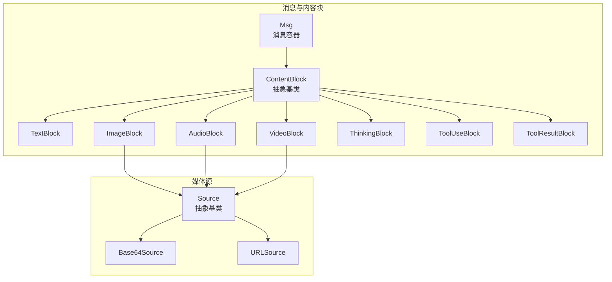
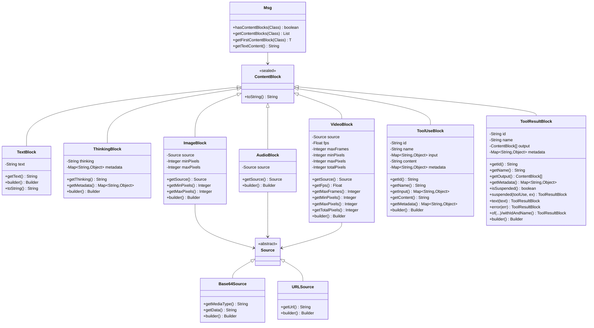
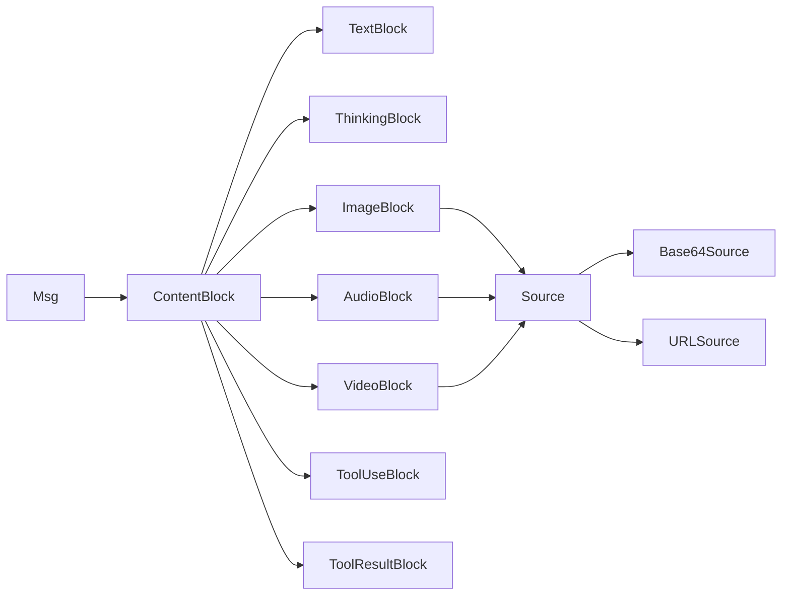
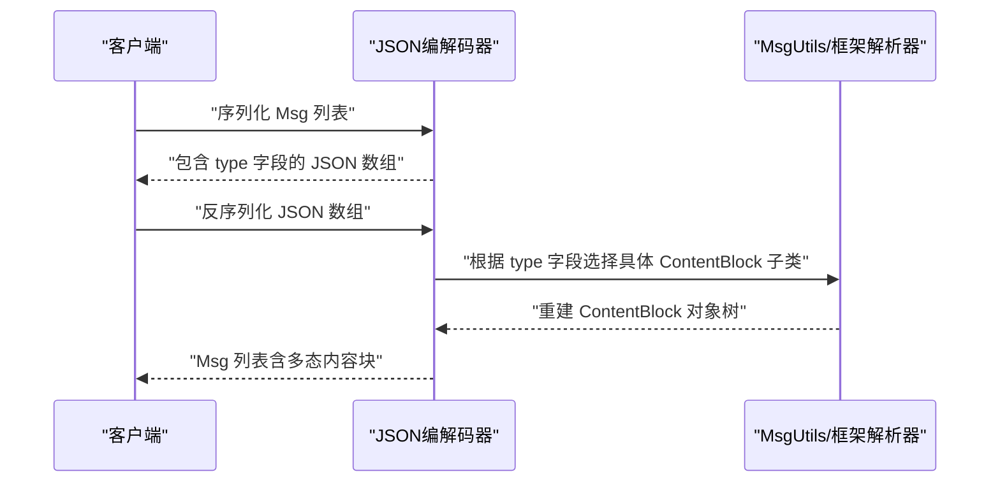

# 内容块系统

<cite>
**本文引用的文件**   
- [ContentBlock.java](file://agentscope-core/src/main/java/io/agentscope/core/message/ContentBlock.java)
- [TextBlock.java](file://agentscope-core/src/main/java/io/agentscope/core/message/TextBlock.java)
- [ImageBlock.java](file://agentscope-core/src/main/java/io/agentscope/core/message/ImageBlock.java)
- [AudioBlock.java](file://agentscope-core/src/main/java/io/agentscope/core/message/AudioBlock.java)
- [VideoBlock.java](file://agentscope-core/src/main/java/io/agentscope/core/message/VideoBlock.java)
- [ThinkingBlock.java](file://agentscope-core/src/main/java/io/agentscope/core/message/ThinkingBlock.java)
- [ToolUseBlock.java](file://agentscope-core/src/main/java/io/agentscope/core/message/ToolUseBlock.java)
- [ToolResultBlock.java](file://agentscope-core/src/main/java/io/agentscope/core/message/ToolResultBlock.java)
- [Source.java](file://agentscope-core/src/main/java/io/agentscope/core/message/Source.java)
- [Base64Source.java](file://agentscope-core/src/main/java/io/agentscope/core/message/Base64Source.java)
- [URLSource.java](file://agentscope-core/src/main/java/io/agentscope/core/message/URLSource.java)
- [Msg.java](file://agentscope-core/src/main/java/io/agentscope/core/message/Msg.java)
- [MsgTest.java](file://agentscope-core/src/test/java/io/agentscope/core/message/MsgTest.java)
- [ReActAgent.java](file://agentscope-core/src/main/java/io/agentscope/core/ReActAgent.java)
- [MsgUtils.java](file://agentscope-extensions/agentscope-extensions-autocontext-memory/src/main/java/io/agentscope/core/memory/autocontext/MsgUtils.java)
</cite>

## 目录
1. [简介](#简介)
2. [项目结构](#项目结构)
3. [核心组件](#核心组件)
4. [架构总览](#架构总览)
5. [详细组件分析](#详细组件分析)
6. [依赖关系分析](#依赖关系分析)
7. [性能考量](#性能考量)
8. [故障排查指南](#故障排查指南)
9. [结论](#结论)
10. [附录](#附录)

## 简介
本文件为 AgentScope Java 内容块系统（ContentBlock）的全面 API 参考与设计说明。内容块是消息中的最小语义单元，用于承载多模态内容与交互元数据，包括纯文本、图像、音频、视频、思考内容、工具调用与工具结果等。该系统采用密封类（sealed class）与 Jackson 多态序列化相结合的方式，在保证类型安全的同时，实现跨模块的可扩展与可序列化。

## 项目结构
内容块相关代码主要位于 agentscope-core 模块的 io.agentscope.core.message 包中，核心文件如下：
- 抽象基类：ContentBlock
- 具体内容块：TextBlock、ThinkingBlock、ImageBlock、AudioBlock、VideoBlock、ToolUseBlock、ToolResultBlock
- 媒体源：Source 抽象类及其子类 Base64Source、URLSource
- 消息容器：Msg（用于承载多个内容块）
- 测试与示例：MsgTest 展示了内容块在消息中的典型用法；ReActAgent 在实际流程中频繁使用 TextBlock 构造用户输入

**图表来源**
- [ContentBlock.java:54-61](file://agentscope-core/src/main/java/io/agentscope/core/message/ContentBlock.java#L54-L61)
- [TextBlock.java:31-95](file://agentscope-core/src/main/java/io/agentscope/core/message/TextBlock.java#L31-L95)
- [ThinkingBlock.java:37-133](file://agentscope-core/src/main/java/io/agentscope/core/message/ThinkingBlock.java#L37-L133)
- [ImageBlock.java:37-163](file://agentscope-core/src/main/java/io/agentscope/core/message/ImageBlock.java#L37-L163)
- [AudioBlock.java:35-96](file://agentscope-core/src/main/java/io/agentscope/core/message/AudioBlock.java#L35-L96)
- [VideoBlock.java:36-239](file://agentscope-core/src/main/java/io/agentscope/core/message/VideoBlock.java#L36-L239)
- [ToolUseBlock.java:34-233](file://agentscope-core/src/main/java/io/agentscope/core/message/ToolUseBlock.java#L34-L233)
- [ToolResultBlock.java:35-374](file://agentscope-core/src/main/java/io/agentscope/core/message/ToolResultBlock.java#L35-L374)
- [Source.java:27-32](file://agentscope-core/src/main/java/io/agentscope/core/message/Source.java#L27-L32)
- [Base64Source.java:39-128](file://agentscope-core/src/main/java/io/agentscope/core/message/Base64Source.java#L39-L128)
- [URLSource.java:39-100](file://agentscope-core/src/main/java/io/agentscope/core/message/URLSource.java#L39-L100)
- [Msg.java:175-241](file://agentscope-core/src/main/java/io/agentscope/core/message/Msg.java#L175-L241)

**章节来源**
- [ContentBlock.java:22-61](file://agentscope-core/src/main/java/io/agentscope/core/message/ContentBlock.java#L22-L61)
- [Source.java:22-32](file://agentscope-core/src/main/java/io/agentscope/core/message/Source.java#L22-L32)

## 核心组件
- ContentBlock 抽象基类：定义所有内容块的共同接口，并通过 Jackson 注解启用多态序列化；通过密封类限制子类集合，确保类型安全与穷举匹配。
- Source 抽象类及其实现：统一表示媒体来源，支持 URL 与 Base64 两种方式，便于在 ImageBlock、AudioBlock、VideoBlock 中复用。
- 具体内容块：
  - TextBlock：纯文本内容，提供 builder 与 toString 快捷访问。
  - ThinkingBlock：推理/思考内容，支持可选元数据（如 reasoningDetails）。
  - ImageBlock、AudioBlock、VideoBlock：分别承载图片、音频、视频内容，支持像素阈值、帧率、帧数等参数控制。
  - ToolUseBlock：工具调用请求，包含 id、name、input、content（流式）、metadata。
  - ToolResultBlock：工具执行结果，支持 suspended 标记与多种构造方式。

**章节来源**
- [ContentBlock.java:44-61](file://agentscope-core/src/main/java/io/agentscope/core/message/ContentBlock.java#L44-L61)
- [Source.java:27-32](file://agentscope-core/src/main/java/io/agentscope/core/message/Source.java#L27-L32)
- [TextBlock.java:31-95](file://agentscope-core/src/main/java/io/agentscope/core/message/TextBlock.java#L31-L95)
- [ThinkingBlock.java:37-133](file://agentscope-core/src/main/java/io/agentscope/core/message/ThinkingBlock.java#L37-L133)
- [ImageBlock.java:37-163](file://agentscope-core/src/main/java/io/agentscope/core/message/ImageBlock.java#L37-L163)
- [AudioBlock.java:35-96](file://agentscope-core/src/main/java/io/agentscope/core/message/AudioBlock.java#L35-L96)
- [VideoBlock.java:36-239](file://agentscope-core/src/main/java/io/agentscope/core/message/VideoBlock.java#L36-L239)
- [ToolUseBlock.java:34-233](file://agentscope-core/src/main/java/io/agentscope/core/message/ToolUseBlock.java#L34-L233)
- [ToolResultBlock.java:35-374](file://agentscope-core/src/main/java/io/agentscope/core/message/ToolResultBlock.java#L35-L374)

## 架构总览
内容块系统围绕“抽象基类 + 多态序列化 + Builder 模式”的设计展开，配合 Msg 容器实现消息的构建、传递与序列化。下图展示了内容块与消息之间的关系以及媒体源的嵌入方式：

**图表来源**
- [ContentBlock.java:54-61](file://agentscope-core/src/main/java/io/agentscope/core/message/ContentBlock.java#L54-L61)
- [TextBlock.java:31-95](file://agentscope-core/src/main/java/io/agentscope/core/message/TextBlock.java#L31-L95)
- [ThinkingBlock.java:37-133](file://agentscope-core/src/main/java/io/agentscope/core/message/ThinkingBlock.java#L37-L133)
- [ImageBlock.java:37-163](file://agentscope-core/src/main/java/io/agentscope/core/message/ImageBlock.java#L37-L163)
- [AudioBlock.java:35-96](file://agentscope-core/src/main/java/io/agentscope/core/message/AudioBlock.java#L35-L96)
- [VideoBlock.java:36-239](file://agentscope-core/src/main/java/io/agentscope/core/message/VideoBlock.java#L36-L239)
- [ToolUseBlock.java:34-233](file://agentscope-core/src/main/java/io/agentscope/core/message/ToolUseBlock.java#L34-L233)
- [ToolResultBlock.java:35-374](file://agentscope-core/src/main/java/io/agentscope/core/message/ToolResultBlock.java#L35-L374)
- [Source.java:27-32](file://agentscope-core/src/main/java/io/agentscope/core/message/Source.java#L27-L32)
- [Base64Source.java:39-128](file://agentscope-core/src/main/java/io/agentscope/core/message/Base64Source.java#L39-L128)
- [URLSource.java:39-100](file://agentscope-core/src/main/java/io/agentscope/core/message/URLSource.java#L39-L100)
- [Msg.java:175-241](file://agentscope-core/src/main/java/io/agentscope/core/message/Msg.java#L175-L241)

## 详细组件分析

### ContentBlock 抽象基类与多态序列化
- 设计理念：通过密封类限制子类集合，结合 Jackson 的 @JsonTypeInfo/@JsonSubTypes 实现基于“type”字段的多态反序列化，确保序列化/反序列化时类型一致。
- 支持的内容块类型：text、thinking、image、audio、video、tool_use、tool_result。
- 与 State 接口集成，便于状态持久化与会话管理。

**章节来源**
- [ContentBlock.java:44-61](file://agentscope-core/src/main/java/io/agentscope/core/message/ContentBlock.java#L44-L61)

### TextBlock 文本内容块
- 功能要点：承载纯文本内容，提供 builder 与 toString 快捷访问；空文本会被规范化为空字符串。
- 使用场景：用户输入、助手回复、提示词、调试输出等。
- 示例路径：[MsgTest.java:28-44](file://agentscope-core/src/test/java/io/agentscope/core/message/MsgTest.java#L28-L44) 展示了如何以 TextBlock 构建消息；[ReActAgent.java:133-135](file://agentscope-core/src/main/java/io/agentscope/core/ReActAgent.java#L133-L135) 展示了在系统提示中使用 TextBlock。

**章节来源**
- [TextBlock.java:31-95](file://agentscope-core/src/main/java/io/agentscope/core/message/TextBlock.java#L31-L95)
- [MsgTest.java:28-44](file://agentscope-core/src/test/java/io/agentscope/core/message/MsgTest.java#L28-L44)
- [ReActAgent.java:133-135](file://agentscope-core/src/main/java/io/agentscope/core/ReActAgent.java#L133-L135)

### ThinkingBlock 思考内容块
- 功能要点：记录代理的内部推理过程；支持可选元数据（如 reasoningDetails），用于保留第三方模型的推理细节。
- 使用场景：ReAct 等需要可解释性的推理型代理。
- 示例路径：[MsgTest.java:75-89](file://agentscope-core/src/test/java/io/agentscope/core/message/MsgTest.java#L75-L89)

**章节来源**
- [ThinkingBlock.java:37-133](file://agentscope-core/src/main/java/io/agentscope/core/message/ThinkingBlock.java#L37-L133)
- [MsgTest.java:75-89](file://agentscope-core/src/test/java/io/agentscope/core/message/MsgTest.java#L75-L89)

### ImageBlock 图片内容块
- 功能要点：支持 URLSource 与 Base64Source；可设置像素阈值（minPixels/maxPixels）以控制输入质量与成本。
- 使用场景：视觉问答、截图分析、图表识别等。
- 示例路径：[MsgTest.java:47-53](file://agentscope-core/src/test/java/io/agentscope/core/message/MsgTest.java#L47-L53)

**章节来源**
- [ImageBlock.java:37-163](file://agentscope-core/src/main/java/io/agentscope/core/message/ImageBlock.java#L37-L163)
- [Base64Source.java:39-128](file://agentscope-core/src/main/java/io/agentscope/core/message/Base64Source.java#L39-L128)
- [URLSource.java:39-100](file://agentscope-core/src/main/java/io/agentscope/core/message/URLSource.java#L39-L100)
- [MsgTest.java:47-53](file://agentscope-core/src/test/java/io/agentscope/core/message/MsgTest.java#L47-L53)

### AudioBlock 音频内容块
- 功能要点：支持 URLSource 与 Base64Source；适合语音识别、音乐分析等场景。
- 示例路径：[MsgTest.java:56-62](file://agentscope-core/src/test/java/io/agentscope/core/message/MsgTest.java#L56-L62)

**章节来源**
- [AudioBlock.java:35-96](file://agentscope-core/src/main/java/io/agentscope/core/message/AudioBlock.java#L35-L96)
- [MsgTest.java:56-62](file://agentscope-core/src/test/java/io/agentscope/core/message/MsgTest.java#L56-L62)

### VideoBlock 视频内容块
- 功能要点：支持 URLSource 与 Base64Source；可设置 fps、maxFrames、minPixels、maxPixels、totalPixels 等参数，用于抽帧与降采样。
- 使用场景：视频理解、动作识别、教学视频分析等。
- 示例路径：[MsgTest.java:66-72](file://agentscope-core/src/test/java/io/agentscope/core/message/MsgTest.java#L66-L72)

**章节来源**
- [VideoBlock.java:36-239](file://agentscope-core/src/main/java/io/agentscope/core/message/VideoBlock.java#L36-L239)
- [MsgTest.java:66-72](file://agentscope-core/src/test/java/io/agentscope/core/message/MsgTest.java#L66-L72)

### ToolUseBlock 工具调用块
- 功能要点：封装一次工具调用请求，包含 id、name、input、可选 content（流式）、metadata；input 与 metadata 采用防御性拷贝，避免外部修改。
- 使用场景：代理通过工具调用与外部系统交互。
- 示例路径：[MsgTest.java:163-180](file://agentscope-core/src/test/java/io/agentscope/core/message/MsgTest.java#L163-L180)

**章节来源**
- [ToolUseBlock.java:34-233](file://agentscope-core/src/main/java/io/agentscope/core/message/ToolUseBlock.java#L34-L233)
- [MsgTest.java:163-180](file://agentscope-core/src/test/java/io/agentscope/core/message/MsgTest.java#L163-L180)

### ToolResultBlock 工具结果块
- 功能要点：封装工具执行结果；支持多种构造方式（返回值、列表、带元数据）；提供 suspended 标记用于外部执行恢复；提供便捷工厂方法（text、error、of 等）。
- 使用场景：代理将工具结果作为消息的一部分返回给模型或下游处理。
- 示例路径：[ToolResultBlock.java:139-159](file://agentscope-core/src/main/java/io/agentscope/core/message/ToolResultBlock.java#L139-L159)

**章节来源**
- [ToolResultBlock.java:35-374](file://agentscope-core/src/main/java/io/agentscope/core/message/ToolResultBlock.java#L35-L374)

### Source 媒体源
- Source 抽象类：统一媒体来源的多态表示，通过“type”字段区分 URL 与 Base64。
- Base64Source：携带 mediaType 与 data，适合内联小文件。
- URLSource：携带 url，适合大文件或远程资源。

**章节来源**
- [Source.java:27-32](file://agentscope-core/src/main/java/io/agentscope/core/message/Source.java#L27-L32)
- [Base64Source.java:39-128](file://agentscope-core/src/main/java/io/agentscope/core/message/Base64Source.java#L39-L128)
- [URLSource.java:39-100](file://agentscope-core/src/main/java/io/agentscope/core/message/URLSource.java#L39-L100)

### Msg 消息容器与内容块操作
- 类型安全过滤：hasContentBlocks(Class)、getContentBlocks(Class)、getFirstContentBlock(Class) 提供泛型安全的筛选与取值。
- 文本拼接：getTextContent() 将消息中所有 TextBlock 的文本按换行拼接，忽略非文本内容块。
- 示例路径：[Msg.java:175-241](file://agentscope-core/src/main/java/io/agentscope/core/message/Msg.java#L175-L241)，[MsgTest.java:104-195](file://agentscope-core/src/test/java/io/agentscope/core/message/MsgTest.java#L104-L195)

**章节来源**
- [Msg.java:175-241](file://agentscope-core/src/main/java/io/agentscope/core/message/Msg.java#L175-L241)
- [MsgTest.java:104-195](file://agentscope-core/src/test/java/io/agentscope/core/message/MsgTest.java#L104-L195)

## 依赖关系分析
- 继承与组合：
  - ContentBlock 是所有内容块的父类，各具体块通过 Builder 模式进行实例化。
  - ImageBlock、AudioBlock、VideoBlock 组合 Source（URL 或 Base64）。
  - ToolResultBlock 的 output 字段可包含任意 ContentBlock 列表，形成递归复合结构。
- 序列化与反序列化：
  - ContentBlock 与 Source 均使用 Jackson 多态注解，确保 JSON 中包含 type 字段，从而正确重建对象类型。
- 与消息系统的集成：
  - Msg 作为容器聚合多个 ContentBlock，并提供类型安全的查询与文本提取能力。

**图表来源**
- [ContentBlock.java:54-61](file://agentscope-core/src/main/java/io/agentscope/core/message/ContentBlock.java#L54-L61)
- [Source.java:27-32](file://agentscope-core/src/main/java/io/agentscope/core/message/Source.java#L27-L32)
- [Msg.java:175-241](file://agentscope-core/src/main/java/io/agentscope/core/message/Msg.java#L175-L241)

**章节来源**
- [ContentBlock.java:44-61](file://agentscope-core/src/main/java/io/agentscope/core/message/ContentBlock.java#L44-L61)
- [Source.java:27-32](file://agentscope-core/src/main/java/io/agentscope/core/message/Source.java#L27-L32)
- [Msg.java:175-241](file://agentscope-core/src/main/java/io/agentscope/core/message/Msg.java#L175-L241)

## 性能考量
- 媒体源选择：
  - URLSource 更适合大文件与远程资源，减少内存占用与传输开销。
  - Base64Source 适合小文件与内联场景，但会增加体积与解析成本。
- 视频处理参数：
  - 合理设置 fps、maxFrames、minPixels/maxPixels、totalPixels，可在保证质量的前提下降低计算与存储压力。
- 不可变性与防御性拷贝：
  - ToolUseBlock 与 ToolResultBlock 对 input、metadata、output 采用不可变/防御性拷贝策略，避免并发问题与意外修改，但会带来额外的对象分配与复制成本。

[本节为通用指导，不直接分析具体文件]

## 故障排查指南
- 序列化/反序列化失败：
  - 确认 JSON 中包含正确的 type 字段，且与 ContentBlock/Source 子类名称一致。
  - 反序列化失败时，检查字段命名是否与@JsonProperty 一致（例如 ImageBlock 的 min_pixels、max_pixels）。
  - 参考自动上下文扩展模块中的序列化/反序列化工具，其对 Msg 列表的转换与异常处理可作为参考。
- 空引用与空文本：
  - TextBlock 与 ThinkingBlock 的空文本会被规范化为空字符串；ImageBlock、AudioBlock、VideoBlock 的 source 不能为空。
- 工具结果挂起：
  - 当工具抛出 ToolSuspendException 时，可通过 ToolResultBlock.suspended(...) 创建挂起结果，其中包含 agentscope_suspended 元数据键。

**章节来源**
- [MsgUtils.java:118-151](file://agentscope-extensions/agentscope-extensions-autocontext-memory/src/main/java/io/agentscope/core/memory/autocontext/MsgUtils.java#L118-L151)
- [ToolResultBlock.java:139-159](file://agentscope-core/src/main/java/io/agentscope/core/message/ToolResultBlock.java#L139-L159)

## 结论
内容块系统通过密封类与多态序列化实现了强类型、可扩展、可序列化的多模态消息表达。配合 Builder 模式与消息容器 Msg，开发者可以以类型安全的方式构建复杂的消息结构，并在不同模型与工具之间稳定传递。合理选择媒体源与视频参数、利用不可变性与防御性拷贝策略，有助于在性能与安全性之间取得平衡。

[本节为总结性内容，不直接分析具体文件]

## 附录

### API 快速参考（按类型）
- TextBlock
  - 获取文本：getText()
  - 构建：builder().text(...).build()
  - 示例路径：[TextBlock.java:50-94](file://agentscope-core/src/main/java/io/agentscope/core/message/TextBlock.java#L50-L94)
- ThinkingBlock
  - 获取思考内容：getThinking()
  - 获取元数据：getMetadata()
  - 构建：builder().thinking(...).metadata(...).build()
  - 示例路径：[ThinkingBlock.java:64-132](file://agentscope-core/src/main/java/io/agentscope/core/message/ThinkingBlock.java#L64-L132)
- ImageBlock
  - 获取来源与像素阈值：getSource()/getMinPixels()/getMaxPixels()
  - 构建：builder().source(...).minPixels(...).maxPixels(...).build()
  - 示例路径：[ImageBlock.java:78-162](file://agentscope-core/src/main/java/io/agentscope/core/message/ImageBlock.java#L78-L162)
- AudioBlock
  - 获取来源：getSource()
  - 构建：builder().source(...).build()
  - 示例路径：[AudioBlock.java:55-95](file://agentscope-core/src/main/java/io/agentscope/core/message/AudioBlock.java#L55-L95)
- VideoBlock
  - 获取来源与参数：getSource()/getFps()/getMaxFrames()/getMinPixels()/getMaxPixels()/getTotalPixels()
  - 构建：builder().source(...).fps(...).maxFrames(...).minPixels(...).maxPixels(...).totalPixels(...).build()
  - 示例路径：[VideoBlock.java:90-238](file://agentscope-core/src/main/java/io/agentscope/core/message/VideoBlock.java#L90-L238)
- ToolUseBlock
  - 获取属性：getId()/getName()/getInput()/getContent()/getMetadata()
  - 构建：builder().id(...).name(...).input(...).content(...).metadata(...).build()
  - 示例路径：[ToolUseBlock.java:104-232](file://agentscope-core/src/main/java/io/agentscope/core/message/ToolUseBlock.java#L104-L232)
- ToolResultBlock
  - 获取属性：getId()/getName()/getOutput()/getMetadata()/isSuspended()
  - 工厂方法：text(...)/error(...)/of(...)/suspended(...)
  - 构建：builder().id(...).name(...).output(...).metadata(...).build()
  - 示例路径：[ToolResultBlock.java:84-373](file://agentscope-core/src/main/java/io/agentscope/core/message/ToolResultBlock.java#L84-L373)
- Source 与媒体源
  - Base64Source：getMediaType()/getData()
  - URLSource：getUrl()
  - 示例路径：[Base64Source.java:65-127](file://agentscope-core/src/main/java/io/agentscope/core/message/Base64Source.java#L65-L127)，[URLSource.java:59-99](file://agentscope-core/src/main/java/io/agentscope/core/message/URLSource.java#L59-L99)

### 序列化与反序列化流程

**图表来源**
- [MsgUtils.java:118-151](file://agentscope-extensions/agentscope-extensions-autocontext-memory/src/main/java/io/agentscope/core/memory/autocontext/MsgUtils.java#L118-L151)
- [ContentBlock.java:44-53](file://agentscope-core/src/main/java/io/agentscope/core/message/ContentBlock.java#L44-L53)
- [Source.java:27-31](file://agentscope-core/src/main/java/io/agentscope/core/message/Source.java#L27-L31)