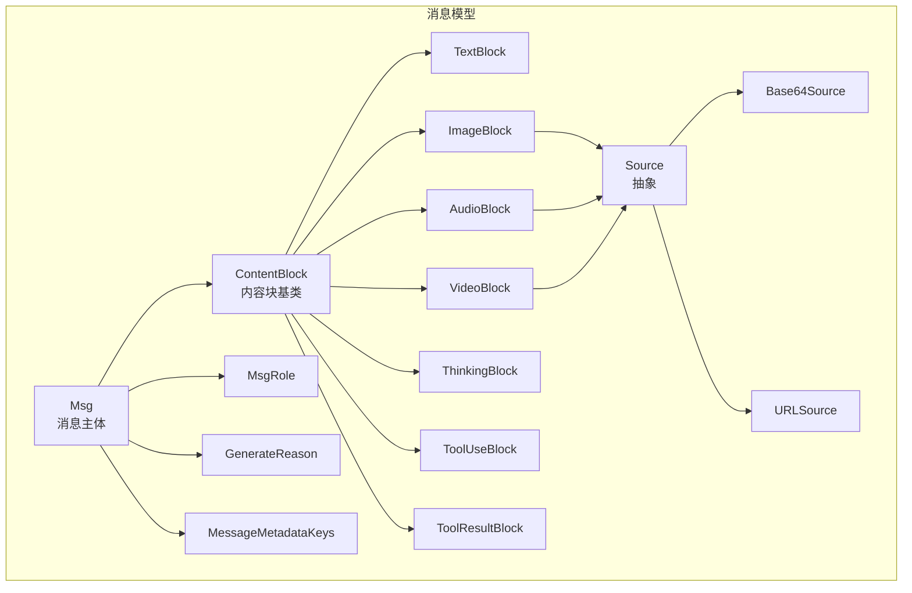
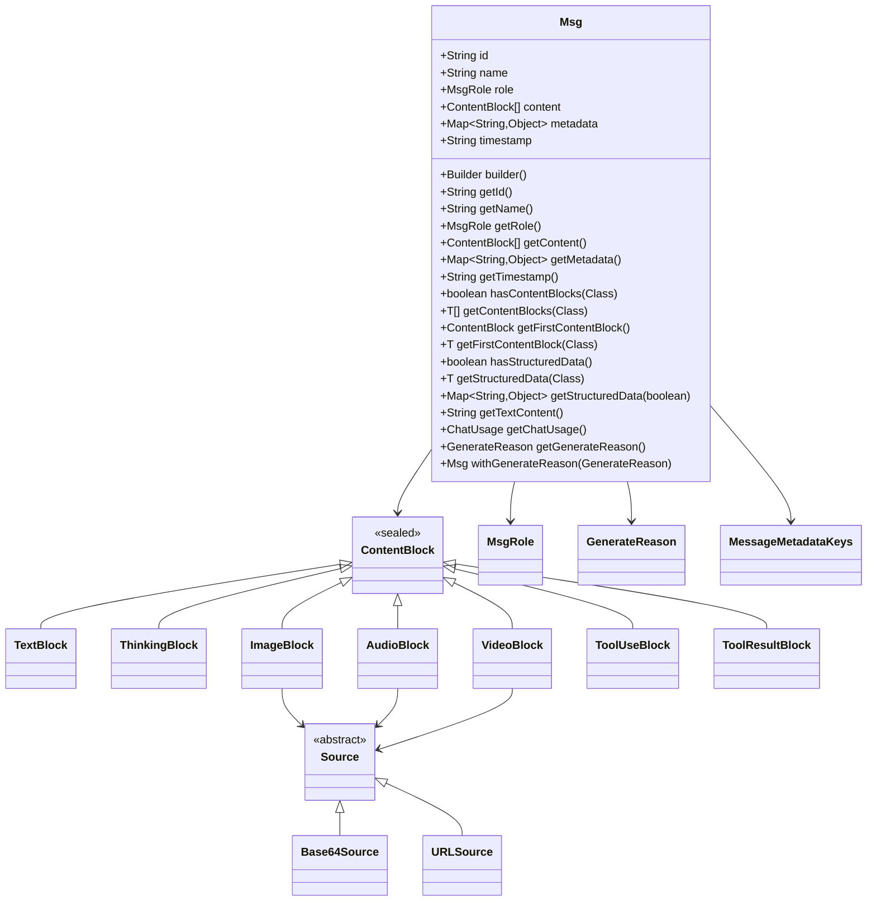
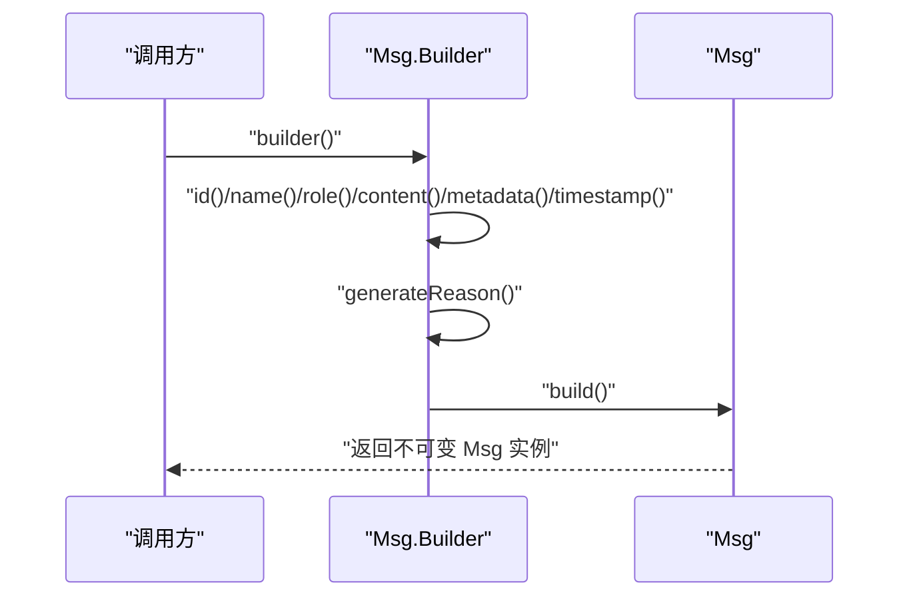
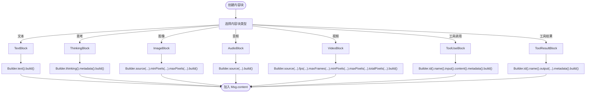
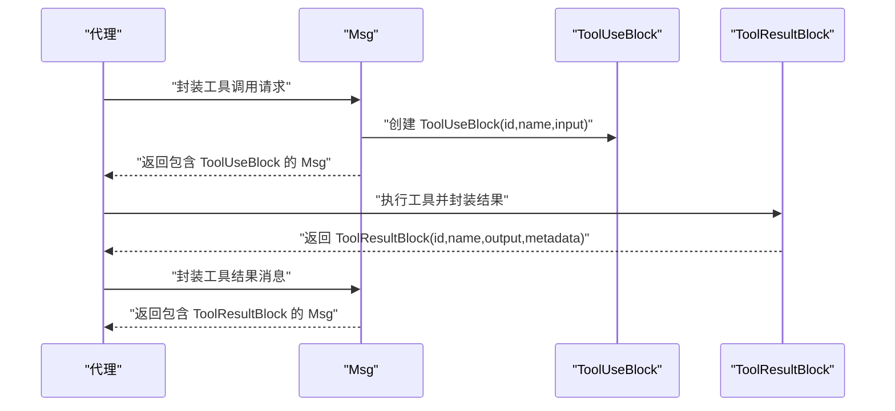
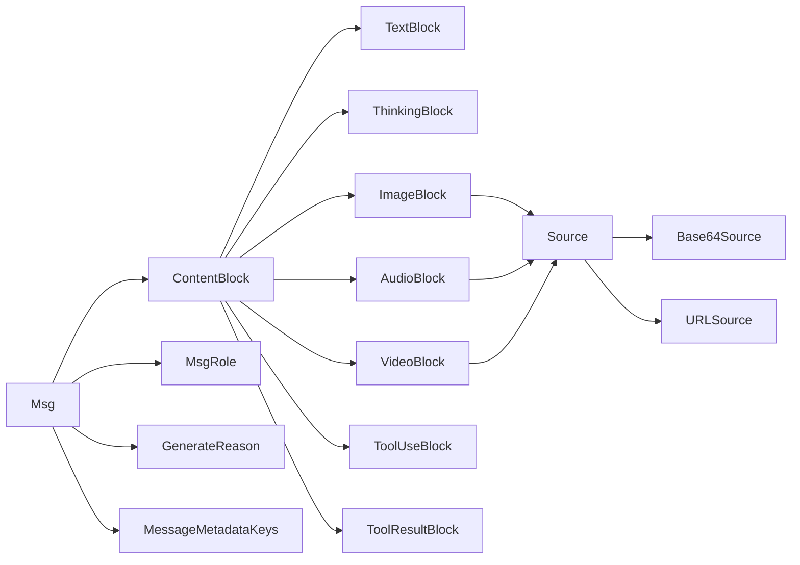

# 消息 API

<cite>
**本文引用的文件**
- [Msg.java](file://agentscope-core/src/main/java/io/agentscope/core/message/Msg.java)
- [ContentBlock.java](file://agentscope-core/src/main/java/io/agentscope/core/message/ContentBlock.java)
- [TextBlock.java](file://agentscope-core/src/main/java/io/agentscope/core/message/TextBlock.java)
- [ImageBlock.java](file://agentscope-core/src/main/java/io/agentscope/core/message/ImageBlock.java)
- [AudioBlock.java](file://agentscope-core/src/main/java/io/agentscope/core/message/AudioBlock.java)
- [VideoBlock.java](file://agentscope-core/src/main/java/io/agentscope/core/message/VideoBlock.java)
- [ThinkingBlock.java](file://agentscope-core/src/main/java/io/agentscope/core/message/ThinkingBlock.java)
- [ToolUseBlock.java](file://agentscope-core/src/main/java/io/agentscope/core/message/ToolUseBlock.java)
- [ToolResultBlock.java](file://agentscope-core/src/main/java/io/agentscope/core/message/ToolResultBlock.java)
- [Source.java](file://agentscope-core/src/main/java/io/agentscope/core/message/Source.java)
- [Base64Source.java](file://agentscope-core/src/main/java/io/agentscope/core/message/Base64Source.java)
- [URLSource.java](file://agentscope-core/src/main/java/io/agentscope/core/message/URLSource.java)
- [MsgRole.java](file://agentscope-core/src/main/java/io/agentscope/core/message/MsgRole.java)
- [GenerateReason.java](file://agentscope-core/src/main/java/io/agentscope/core/message/GenerateReason.java)
- [MessageMetadataKeys.java](file://agentscope-core/src/main/java/io/agentscope/core/message/MessageMetadataKeys.java)
</cite>

## 目录
1. [简介](#简介)
2. [项目结构](#项目结构)
3. [核心组件](#核心组件)
4. [架构总览](#架构总览)
5. [详细组件分析](#详细组件分析)
6. [依赖关系分析](#依赖关系分析)
7. [性能考虑](#性能考虑)
8. [故障排查指南](#故障排查指南)
9. [结论](#结论)
10. [附录：示例与最佳实践](#附录示例与最佳实践)

## 简介
本参考文档面向 AgentScope Java 的消息系统 API，聚焦以下目标：
- 全面说明 Msg 类的属性与方法，覆盖消息构建、序列化与反序列化流程
- 深入解析 ContentBlock 及其子类（TextBlock、ImageBlock、AudioBlock、VideoBlock、ThinkingBlock、ToolUseBlock、ToolResultBlock）的使用方式与语义
- 提供工具调用与工具结果的消息格式规范
- 解释多模态消息的处理与转换 API
- 说明消息元数据与消息头（角色、生成原因等）的使用方法
- 给出可直接定位到源码位置的“代码片段路径”，便于快速查阅与实现

## 项目结构
消息系统位于 agentscope-core 模块的 io.agentscope.core.message 包中，核心文件如下：
- 消息主体：Msg
- 内容块基类与多态：ContentBlock 及其子类
- 多媒体来源：Source 抽象类及其子类 Base64Source、URLSource
- 角色与生成原因：MsgRole、GenerateReason
- 元数据键常量：MessageMetadataKeys

图表来源
- [Msg.java:53-656](file://agentscope-core/src/main/java/io/agentscope/core/message/Msg.java#L53-L656)
- [ContentBlock.java:22-62](file://agentscope-core/src/main/java/io/agentscope/core/message/ContentBlock.java#L22-L62)
- [TextBlock.java:21-96](file://agentscope-core/src/main/java/io/agentscope/core/message/TextBlock.java#L21-L96)
- [ImageBlock.java:23-164](file://agentscope-core/src/main/java/io/agentscope/core/message/ImageBlock.java#L23-L164)
- [AudioBlock.java:22-97](file://agentscope-core/src/main/java/io/agentscope/core/message/AudioBlock.java#L22-L97)
- [VideoBlock.java:22-240](file://agentscope-core/src/main/java/io/agentscope/core/message/VideoBlock.java#L22-L240)
- [ThinkingBlock.java:23-134](file://agentscope-core/src/main/java/io/agentscope/core/message/ThinkingBlock.java#L23-L134)
- [ToolUseBlock.java:24-234](file://agentscope-core/src/main/java/io/agentscope/core/message/ToolUseBlock.java#L24-L234)
- [ToolResultBlock.java:26-375](file://agentscope-core/src/main/java/io/agentscope/core/message/ToolResultBlock.java#L26-L375)
- [Source.java:22-33](file://agentscope-core/src/main/java/io/agentscope/core/message/Source.java#L22-L33)
- [Base64Source.java:22-129](file://agentscope-core/src/main/java/io/agentscope/core/message/Base64Source.java#L22-L129)
- [URLSource.java:22-101](file://agentscope-core/src/main/java/io/agentscope/core/message/URLSource.java#L22-L101)
- [MsgRole.java:18-68](file://agentscope-core/src/main/java/io/agentscope/core/message/MsgRole.java#L18-L68)
- [GenerateReason.java:18-62](file://agentscope-core/src/main/java/io/agentscope/core/message/GenerateReason.java#L18-L62)
- [MessageMetadataKeys.java:18-135](file://agentscope-core/src/main/java/io/agentscope/core/message/MessageMetadataKeys.java#L18-L135)

章节来源
- [Msg.java:38-52](file://agentscope-core/src/main/java/io/agentscope/core/message/Msg.java#L38-L52)
- [ContentBlock.java:22-43](file://agentscope-core/src/main/java/io/agentscope/core/message/ContentBlock.java#L22-L43)

## 核心组件
本节对消息系统的关键类进行概览式说明，并给出“代码片段路径”以便进一步阅读。

- Msg：消息主体，包含唯一 ID、名称、角色、内容块列表、元数据、时间戳；提供 Builder 构建器、内容检索、结构化数据提取、文本聚合、用量统计、生成原因等能力
  - 属性与构造：[属性定义与构造函数:61-110](file://agentscope-core/src/main/java/io/agentscope/core/message/Msg.java#L61-L110)
  - 访问器：[getId/getName/getRole/getContent/getMetadata/getTimestamp:126-173](file://agentscope-core/src/main/java/io/agentscope/core/message/Msg.java#L126-L173)
  - 内容检索：[hasContentBlocks/getContentBlocks/getFirstContentBlock:182-230](file://agentscope-core/src/main/java/io/agentscope/core/message/Msg.java#L182-L230)
  - 文本聚合：[getTextContent:380-388](file://agentscope-core/src/main/java/io/agentscope/core/message/Msg.java#L380-L388)
  - 结构化数据：[hasStructuredData/getStructuredData(Class)/getStructuredData(boolean):237-370](file://agentscope-core/src/main/java/io/agentscope/core/message/Msg.java#L237-L370)
  - 用量统计：[getChatUsage:391-434](file://agentscope-core/src/main/java/io/agentscope/core/message/Msg.java#L391-L434)
  - 生成原因：[getGenerateReason/withGenerateReason:451-498](file://agentscope-core/src/main/java/io/agentscope/core/message/Msg.java#L451-L498)
  - Builder：[builder/build 与各设置方法:500-654](file://agentscope-core/src/main/java/io/agentscope/core/message/Msg.java#L500-L654)

- ContentBlock 及子类：内容块的密封类层次，支持文本、思考、图像、音频、视频、工具调用、工具结果七种类型
  - 基类与多态注册：[密封类与@JsonTypeInfo/@JsonSubTypes:44-53](file://agentscope-core/src/main/java/io/agentscope/core/message/ContentBlock.java#L44-L53)
  - TextBlock：[文本内容与 Builder:31-96](file://agentscope-core/src/main/java/io/agentscope/core/message/TextBlock.java#L31-L96)
  - ThinkingBlock：[思考内容与元数据:37-134](file://agentscope-core/src/main/java/io/agentscope/core/message/ThinkingBlock.java#L37-L134)
  - ImageBlock：[Source、像素阈值、Builder:37-164](file://agentscope-core/src/main/java/io/agentscope/core/message/ImageBlock.java#L37-L164)
  - AudioBlock：[Source、Builder:35-97](file://agentscope-core/src/main/java/io/agentscope/core/message/AudioBlock.java#L35-L97)
  - VideoBlock：[Source、帧率、帧数、像素阈值、总像素、Builder:36-240](file://agentscope-core/src/main/java/io/agentscope/core/message/VideoBlock.java#L36-L240)
  - ToolUseBlock：[id/name/input/content/metadata、Builder:34-234](file://agentscope-core/src/main/java/io/agentscope/core/message/ToolUseBlock.java#L34-L234)
  - ToolResultBlock：[id/name/output/metadata、挂起状态、静态工厂、Builder:35-375](file://agentscope-core/src/main/java/io/agentscope/core/message/ToolResultBlock.java#L35-L375)

- Source 体系：统一多媒体来源抽象
  - 抽象与多态：[Source 与子类注册:27-31](file://agentscope-core/src/main/java/io/agentscope/core/message/Source.java#L27-L31)
  - Base64Source：[媒体类型与数据:39-129](file://agentscope-core/src/main/java/io/agentscope/core/message/Base64Source.java#L39-L129)
  - URLSource：[URL 引用:39-101](file://agentscope-core/src/main/java/io/agentscope/core/message/URLSource.java#L39-L101)

- 角色与生成原因：MsgRole、GenerateReason
  - 角色枚举：[USER/ASSISTANT/SYSTEM/TOOL:35-67](file://agentscope-core/src/main/java/io/agentscope/core/message/MsgRole.java#L35-L67)
  - 生成原因枚举：[MODEL_STOP/TOOL_CALLS/STRUCTURED_OUTPUT/TOOL_SUSPENDED/REASONING_STOP_REQUESTED/ACTING_STOP_REQUESTED/INTERRUPTED/MAX_ITERATIONS:36-61](file://agentscope-core/src/main/java/io/agentscope/core/message/GenerateReason.java#L36-L61)

- 元数据键常量：MessageMetadataKeys
  - 关键键名：[BYPASS_MULTIAGENT_HISTORY_MERGE/STRUCTURED_OUTPUT_REMINDER/STRUCTURED_OUTPUT_REMINDER_TYPE/CHAT_USAGE/STRUCTURED_OUTPUT/CACHE_CONTROL:48-134](file://agentscope-core/src/main/java/io/agentscope/core/message/MessageMetadataKeys.java#L48-L134)

章节来源
- [Msg.java:53-656](file://agentscope-core/src/main/java/io/agentscope/core/message/Msg.java#L53-L656)
- [ContentBlock.java:44-62](file://agentscope-core/src/main/java/io/agentscope/core/message/ContentBlock.java#L44-L62)
- [TextBlock.java:31-96](file://agentscope-core/src/main/java/io/agentscope/core/message/TextBlock.java#L31-L96)
- [ThinkingBlock.java:37-134](file://agentscope-core/src/main/java/io/agentscope/core/message/ThinkingBlock.java#L37-L134)
- [ImageBlock.java:37-164](file://agentscope-core/src/main/java/io/agentscope/core/message/ImageBlock.java#L37-L164)
- [AudioBlock.java:35-97](file://agentscope-core/src/main/java/io/agentscope/core/message/AudioBlock.java#L35-L97)
- [VideoBlock.java:36-240](file://agentscope-core/src/main/java/io/agentscope/core/message/VideoBlock.java#L36-L240)
- [ToolUseBlock.java:34-234](file://agentscope-core/src/main/java/io/agentscope/core/message/ToolUseBlock.java#L34-L234)
- [ToolResultBlock.java:35-375](file://agentscope-core/src/main/java/io/agentscope/core/message/ToolResultBlock.java#L35-L375)
- [Source.java:27-31](file://agentscope-core/src/main/java/io/agentscope/core/message/Source.java#L27-L31)
- [Base64Source.java:39-129](file://agentscope-core/src/main/java/io/agentscope/core/message/Base64Source.java#L39-L129)
- [URLSource.java:39-101](file://agentscope-core/src/main/java/io/agentscope/core/message/URLSource.java#L39-L101)
- [MsgRole.java:35-67](file://agentscope-core/src/main/java/io/agentscope/core/message/MsgRole.java#L35-L67)
- [GenerateReason.java:36-61](file://agentscope-core/src/main/java/io/agentscope/core/message/GenerateReason.java#L36-L61)
- [MessageMetadataKeys.java:48-134](file://agentscope-core/src/main/java/io/agentscope/core/message/MessageMetadataKeys.java#L48-L134)

## 架构总览
消息系统采用“消息主体 + 内容块多态”的设计，通过 Jackson 的多态序列化机制实现跨类型的内容统一表达。消息可携带多种内容块，支持文本、多媒体、思考过程、工具调用与结果等。

图表来源
- [Msg.java:53-656](file://agentscope-core/src/main/java/io/agentscope/core/message/Msg.java#L53-L656)
- [ContentBlock.java:54-62](file://agentscope-core/src/main/java/io/agentscope/core/message/ContentBlock.java#L54-L62)
- [TextBlock.java:31-96](file://agentscope-core/src/main/java/io/agentscope/core/message/TextBlock.java#L31-L96)
- [ThinkingBlock.java:37-134](file://agentscope-core/src/main/java/io/agentscope/core/message/ThinkingBlock.java#L37-L134)
- [ImageBlock.java:37-164](file://agentscope-core/src/main/java/io/agentscope/core/message/ImageBlock.java#L37-L164)
- [AudioBlock.java:35-97](file://agentscope-core/src/main/java/io/agentscope/core/message/AudioBlock.java#L35-L97)
- [VideoBlock.java:36-240](file://agentscope-core/src/main/java/io/agentscope/core/message/VideoBlock.java#L36-L240)
- [ToolUseBlock.java:34-234](file://agentscope-core/src/main/java/io/agentscope/core/message/ToolUseBlock.java#L34-L234)
- [ToolResultBlock.java:35-375](file://agentscope-core/src/main/java/io/agentscope/core/message/ToolResultBlock.java#L35-L375)
- [Source.java:27-31](file://agentscope-core/src/main/java/io/agentscope/core/message/Source.java#L27-L31)
- [Base64Source.java:39-129](file://agentscope-core/src/main/java/io/agentscope/core/message/Base64Source.java#L39-L129)
- [URLSource.java:39-101](file://agentscope-core/src/main/java/io/agentscope/core/message/URLSource.java#L39-L101)
- [MsgRole.java:35-67](file://agentscope-core/src/main/java/io/agentscope/core/message/MsgRole.java#L35-L67)
- [GenerateReason.java:36-61](file://agentscope-core/src/main/java/io/agentscope/core/message/GenerateReason.java#L36-L61)
- [MessageMetadataKeys.java:48-134](file://agentscope-core/src/main/java/io/agentscope/core/message/MessageMetadataKeys.java#L48-L134)

## 详细组件分析

### Msg 类：消息构建、序列化与反序列化
- 构建器模式
  - 随机 ID 生成与手动设置：[Builder.id/randomId:517-537](file://agentscope-core/src/main/java/io/agentscope/core/message/Msg.java#L517-L537)
  - 名称、角色、内容、元数据、时间戳设置：[Builder.name/role/content/metadata/timestamp:545-622](file://agentscope-core/src/main/java/io/agentscope/core/message/Msg.java#L545-L622)
  - 快捷文本内容设置：[Builder.textContent:597-600](file://agentscope-core/src/main/java/io/agentscope/core/message/Msg.java#L597-L600)
  - 生成原因设置：[Builder.generateReason:633-643](file://agentscope-core/src/main/java/io/agentscope/core/message/Msg.java#L633-L643)
  - 构建：[Builder.build:651-653](file://agentscope-core/src/main/java/io/agentscope/core/message/Msg.java#L651-L653)
- 序列化与反序列化
  - Jackson 注解与构造器：[@JsonCreator/@JsonProperty:83-110](file://agentscope-core/src/main/java/io/agentscope/core/message/Msg.java#L83-L110)
  - 时间戳格式化与默认值：[TIMESTAMP_FORMATTER/format:58-59](file://agentscope-core/src/main/java/io/agentscope/core/message/Msg.java#L58-L59)
- 内容访问与过滤
  - 类型安全过滤与首元素获取：[hasContentBlocks/getContentBlocks/getFirstContentBlock:182-230](file://agentscope-core/src/main/java/io/agentscope/core/message/Msg.java#L182-L230)
  - 文本拼接：[getTextContent:380-388](file://agentscope-core/src/main/java/io/agentscope/core/message/Msg.java#L380-L388)
- 结构化数据
  - 标记键与提取：[MessageMetadataKeys.STRUCTURED_OUTPUT](file://agentscope-core/src/main/java/io/agentscope/core/message/MessageMetadataKeys.java#L107)
  - 泛型提取与 Map 动态提取：[getStructuredData(Class)/getStructuredData(boolean):267-370](file://agentscope-core/src/main/java/io/agentscope/core/message/Msg.java#L267-L370)
- 使用统计
  - 用量键与转换：[MessageMetadataKeys.CHAT_USAGE](file://agentscope-core/src/main/java/io/agentscope/core/message/MessageMetadataKeys.java#L92)
  - 转换与缓存：[getChatUsage:411-434](file://agentscope-core/src/main/java/io/agentscope/core/message/Msg.java#L411-L434)
- 生成原因
  - 获取与更新：[getGenerateReason/withGenerateReason:465-498](file://agentscope-core/src/main/java/io/agentscope/core/message/Msg.java#L465-L498)
  - 枚举定义：[GenerateReason:36-61](file://agentscope-core/src/main/java/io/agentscope/core/message/GenerateReason.java#L36-L61)

图表来源
- [Msg.java:500-654](file://agentscope-core/src/main/java/io/agentscope/core/message/Msg.java#L500-L654)

章节来源
- [Msg.java:500-654](file://agentscope-core/src/main/java/io/agentscope/core/message/Msg.java#L500-L654)
- [MessageMetadataKeys.java:92-107](file://agentscope-core/src/main/java/io/agentscope/core/message/MessageMetadataKeys.java#L92-L107)
- [GenerateReason.java:36-61](file://agentscope-core/src/main/java/io/agentscope/core/message/GenerateReason.java#L36-L61)

### ContentBlock 与子类：多模态内容表达
- 密封类与多态
  - 注册子类与类型字段：[@JsonTypeInfo/@JsonSubTypes:44-53](file://agentscope-core/src/main/java/io/agentscope/core/message/ContentBlock.java#L44-L53)
  - 支持类型：text/thinking/image/audio/video/tool_use/tool_result
- TextBlock：纯文本内容，适合用户输入、助手回复、系统提示等
  - 构造与访问：[构造与getText:40-52](file://agentscope-core/src/main/java/io/agentscope/core/message/TextBlock.java#L40-L52)
  - Builder：[Builder.text/build:81-94](file://agentscope-core/src/main/java/io/agentscope/core/message/TextBlock.java#L81-L94)
- ThinkingBlock：代理推理/思考内容，可携带元数据
  - 元数据键：[METADATA_REASONING_DETAILS:39-40](file://agentscope-core/src/main/java/io/agentscope/core/message/ThinkingBlock.java#L39-L40)
  - 构造与访问：[构造与getThinking/getMetadata:52-82](file://agentscope-core/src/main/java/io/agentscope/core/message/ThinkingBlock.java#L52-L82)
  - Builder：[Builder.thinking/metadata/build:105-131](file://agentscope-core/src/main/java/io/agentscope/core/message/ThinkingBlock.java#L105-L131)
- ImageBlock：图像内容，支持 URL 或 Base64
  - Source 使用与像素阈值：[构造与getters:64-98](file://agentscope-core/src/main/java/io/agentscope/core/message/ImageBlock.java#L64-L98)
  - Builder：[Builder.source/minPixels/maxPixels/build:126-161](file://agentscope-core/src/main/java/io/agentscope/core/message/ImageBlock.java#L126-L161)
- AudioBlock：音频内容，支持 URL 或 Base64
  - 构造与访问：[构造与getSource:46-57](file://agentscope-core/src/main/java/io/agentscope/core/message/AudioBlock.java#L46-L57)
  - Builder：[Builder.source/build:81-94](file://agentscope-core/src/main/java/io/agentscope/core/message/AudioBlock.java#L81-L94)
- VideoBlock：视频内容，支持 URL 或 Base64，含帧率、帧数、像素阈值与总像素
  - 构造与访问：[构造与getters:69-136](file://agentscope-core/src/main/java/io/agentscope/core/message/VideoBlock.java#L69-L136)
  - Builder：[Builder.source/fps/maxFrames/minPixels/maxPixels/totalPixels/build:170-237](file://agentscope-core/src/main/java/io/agentscope/core/message/VideoBlock.java#L170-L237)
- ToolUseBlock：工具调用请求
  - 字段与元数据：[id/name/input/content/metadata:39-97](file://agentscope-core/src/main/java/io/agentscope/core/message/ToolUseBlock.java#L39-L97)
  - 元数据键：[METADATA_THOUGHT_SIGNATURE:36-37](file://agentscope-core/src/main/java/io/agentscope/core/message/ToolUseBlock.java#L36-L37)
  - Builder：[Builder.id/name/input/content/metadata/build:172-231](file://agentscope-core/src/main/java/io/agentscope/core/message/ToolUseBlock.java#L172-L231)
- ToolResultBlock：工具执行结果
  - 字段与不可变性：[id/name/output/metadata:46-54](file://agentscope-core/src/main/java/io/agentscope/core/message/ToolResultBlock.java#L46-L54)
  - 挂起状态与静态工厂：[isSuspended/suspended(...)、text/error/of(...):123-290](file://agentscope-core/src/main/java/io/agentscope/core/message/ToolResultBlock.java#L123-L290)
  - Builder：[Builder.id/name/output/metadata/build:316-372](file://agentscope-core/src/main/java/io/agentscope/core/message/ToolResultBlock.java#L316-L372)

图表来源
- [ContentBlock.java:44-53](file://agentscope-core/src/main/java/io/agentscope/core/message/ContentBlock.java#L44-L53)
- [TextBlock.java:64-94](file://agentscope-core/src/main/java/io/agentscope/core/message/TextBlock.java#L64-L94)
- [ThinkingBlock.java:89-132](file://agentscope-core/src/main/java/io/agentscope/core/message/ThinkingBlock.java#L89-L132)
- [ImageBlock.java:105-162](file://agentscope-core/src/main/java/io/agentscope/core/message/ImageBlock.java#L105-L162)
- [AudioBlock.java:64-95](file://agentscope-core/src/main/java/io/agentscope/core/message/AudioBlock.java#L64-L95)
- [VideoBlock.java:143-238](file://agentscope-core/src/main/java/io/agentscope/core/message/VideoBlock.java#L143-L238)
- [ToolUseBlock.java:152-232](file://agentscope-core/src/main/java/io/agentscope/core/message/ToolUseBlock.java#L152-L232)
- [ToolResultBlock.java:297-373](file://agentscope-core/src/main/java/io/agentscope/core/message/ToolResultBlock.java#L297-L373)

章节来源
- [ContentBlock.java:44-53](file://agentscope-core/src/main/java/io/agentscope/core/message/ContentBlock.java#L44-L53)
- [TextBlock.java:31-96](file://agentscope-core/src/main/java/io/agentscope/core/message/TextBlock.java#L31-L96)
- [ThinkingBlock.java:37-134](file://agentscope-core/src/main/java/io/agentscope/core/message/ThinkingBlock.java#L37-L134)
- [ImageBlock.java:37-164](file://agentscope-core/src/main/java/io/agentscope/core/message/ImageBlock.java#L37-L164)
- [AudioBlock.java:35-97](file://agentscope-core/src/main/java/io/agentscope/core/message/AudioBlock.java#L35-L97)
- [VideoBlock.java:36-240](file://agentscope-core/src/main/java/io/agentscope/core/message/VideoBlock.java#L36-L240)
- [ToolUseBlock.java:34-234](file://agentscope-core/src/main/java/io/agentscope/core/message/ToolUseBlock.java#L34-L234)
- [ToolResultBlock.java:35-375](file://agentscope-core/src/main/java/io/agentscope/core/message/ToolResultBlock.java#L35-L375)

### Source 体系：多模态来源抽象
- Source 抽象与多态注册：[抽象类与@JsonTypeInfo/@JsonSubTypes:27-31](file://agentscope-core/src/main/java/io/agentscope/core/message/Source.java#L27-L31)
- Base64Source：媒体类型与 Base64 数据
  - 构造与访问：[构造与getMediaType/getData:54-76](file://agentscope-core/src/main/java/io/agentscope/core/message/Base64Source.java#L54-L76)
  - Builder：[Builder.mediaType/data/build:102-126](file://agentscope-core/src/main/java/io/agentscope/core/message/Base64Source.java#L102-L126)
- URLSource：远程或本地文件 URL
  - 构造与访问：[构造与getUrl:49-61](file://agentscope-core/src/main/java/io/agentscope/core/message/URLSource.java#L49-L61)
  - Builder：[Builder.url/build:90-98](file://agentscope-core/src/main/java/io/agentscope/core/message/URLSource.java#L90-L98)

章节来源
- [Source.java:27-31](file://agentscope-core/src/main/java/io/agentscope/core/message/Source.java#L27-L31)
- [Base64Source.java:54-76](file://agentscope-core/src/main/java/io/agentscope/core/message/Base64Source.java#L54-L76)
- [URLSource.java:49-61](file://agentscope-core/src/main/java/io/agentscope/core/message/URLSource.java#L49-L61)

### 工具调用与工具结果：消息格式说明
- 工具调用（ToolUseBlock）
  - 字段：id、name、input、content、metadata
  - 元数据键：[METADATA_THOUGHT_SIGNATURE:36-37](file://agentscope-core/src/main/java/io/agentscope/core/message/ToolUseBlock.java#L36-L37)
  - Builder：[id/name/input/content/metadata/build:172-231](file://agentscope-core/src/main/java/io/agentscope/core/message/ToolUseBlock.java#L172-L231)
- 工具结果（ToolResultBlock）
  - 字段：id、name、output（ContentBlock 列表）、metadata
  - 挂起状态：[isSuspended:123-127](file://agentscope-core/src/main/java/io/agentscope/core/message/ToolResultBlock.java#L123-L127)
  - 静态工厂：text/error/of(...)、withIdAndName(...)
  - Builder：[id/name/output/metadata/build:316-372](file://agentscope-core/src/main/java/io/agentscope/core/message/ToolResultBlock.java#L316-L372)

图表来源
- [ToolUseBlock.java:34-234](file://agentscope-core/src/main/java/io/agentscope/core/message/ToolUseBlock.java#L34-L234)
- [ToolResultBlock.java:35-375](file://agentscope-core/src/main/java/io/agentscope/core/message/ToolResultBlock.java#L35-L375)
- [Msg.java:500-654](file://agentscope-core/src/main/java/io/agentscope/core/message/Msg.java#L500-L654)

章节来源
- [ToolUseBlock.java:34-234](file://agentscope-core/src/main/java/io/agentscope/core/message/ToolUseBlock.java#L34-L234)
- [ToolResultBlock.java:35-375](file://agentscope-core/src/main/java/io/agentscope/core/message/ToolResultBlock.java#L35-L375)
- [Msg.java:500-654](file://agentscope-core/src/main/java/io/agentscope/core/message/Msg.java#L500-L654)

### 多模态消息处理与转换 API
- 多模态内容块组合
  - 在 Msg.content 中组合 TextBlock、ImageBlock、AudioBlock、VideoBlock、ThinkingBlock、ToolUseBlock、ToolResultBlock
  - 通过 Msg.Builder.content(...) 或 content(TextBlock...) 等便捷方法设置
- 来源选择
  - 小文件或需要嵌入时使用 Base64Source
  - 大文件或远程资源使用 URLSource
- 元数据驱动行为
  - 结构化输出键：[STRUCTURED_OUTPUT](file://agentscope-core/src/main/java/io/agentscope/core/message/MessageMetadataKeys.java#L107)
  - 用量统计键：[CHAT_USAGE](file://agentscope-core/src/main/java/io/agentscope/core/message/MessageMetadataKeys.java#L92)
  - 缓存控制键：[CACHE_CONTROL](file://agentscope-core/src/main/java/io/agentscope/core/message/MessageMetadataKeys.java#L133)

章节来源
- [Msg.java:566-622](file://agentscope-core/src/main/java/io/agentscope/core/message/Msg.java#L566-L622)
- [MessageMetadataKeys.java:92-134](file://agentscope-core/src/main/java/io/agentscope/core/message/MessageMetadataKeys.java#L92-L134)
- [Base64Source.java:102-126](file://agentscope-core/src/main/java/io/agentscope/core/message/Base64Source.java#L102-L126)
- [URLSource.java:90-98](file://agentscope-core/src/main/java/io/agentscope/core/message/URLSource.java#L90-L98)

### 消息元数据与消息头
- 角色（MsgRole）
  - USER/ASSISTANT/SYSTEM/TOOL：[定义:35-67](file://agentscope-core/src/main/java/io/agentscope/core/message/MsgRole.java#L35-L67)
- 生成原因（GenerateReason）
  - MODEL_STOP/TOOL_CALLS/STRUCTURED_OUTPUT/TOOL_SUSPENDED/REASONING_STOP_REQUESTED/ACTING_STOP_REQUESTED/INTERRUPTED/MAX_ITERATIONS：[定义:36-61](file://agentscope-core/src/main/java/io/agentscope/core/message/GenerateReason.java#L36-L61)
- 元数据键
  - BYPASS_MULTIAGENT_HISTORY_MERGE/STRUCTURED_OUTPUT_REMINDER/STRUCTURED_OUTPUT_REMINDER_TYPE/CHAT_USAGE/STRUCTURED_OUTPUT/CACHE_CONTROL：[定义:48-134](file://agentscope-core/src/main/java/io/agentscope/core/message/MessageMetadataKeys.java#L48-L134)
- 使用建议
  - 通过 Msg.Builder.generateReason(...) 设置生成原因
  - 通过 Msg.Builder.metadata(...) 设置结构化输出与用量统计等键值

章节来源
- [MsgRole.java:35-67](file://agentscope-core/src/main/java/io/agentscope/core/message/MsgRole.java#L35-L67)
- [GenerateReason.java:36-61](file://agentscope-core/src/main/java/io/agentscope/core/message/GenerateReason.java#L36-L61)
- [MessageMetadataKeys.java:48-134](file://agentscope-core/src/main/java/io/agentscope/core/message/MessageMetadataKeys.java#L48-L134)
- [Msg.java:633-643](file://agentscope-core/src/main/java/io/agentscope/core/message/Msg.java#L633-L643)

## 依赖关系分析
- Msg 依赖 ContentBlock 及其子类，以及角色、生成原因、元数据键
- ContentBlock 为密封类，通过 Jackson 多态注解实现序列化
- ImageBlock/AudioBlock/VideoBlock 依赖 Source 抽象及其子类
- ToolResultBlock 依赖 ToolSuspendException（用于挂起结果）

图表来源
- [Msg.java:53-656](file://agentscope-core/src/main/java/io/agentscope/core/message/Msg.java#L53-L656)
- [ContentBlock.java:54-62](file://agentscope-core/src/main/java/io/agentscope/core/message/ContentBlock.java#L54-L62)
- [ImageBlock.java:37-164](file://agentscope-core/src/main/java/io/agentscope/core/message/ImageBlock.java#L37-L164)
- [AudioBlock.java:35-97](file://agentscope-core/src/main/java/io/agentscope/core/message/AudioBlock.java#L35-L97)
- [VideoBlock.java:36-240](file://agentscope-core/src/main/java/io/agentscope/core/message/VideoBlock.java#L36-L240)
- [Source.java:27-31](file://agentscope-core/src/main/java/io/agentscope/core/message/Source.java#L27-L31)

章节来源
- [Msg.java:53-656](file://agentscope-core/src/main/java/io/agentscope/core/message/Msg.java#L53-L656)
- [ContentBlock.java:54-62](file://agentscope-core/src/main/java/io/agentscope/core/message/ContentBlock.java#L54-L62)
- [ImageBlock.java:37-164](file://agentscope-core/src/main/java/io/agentscope/core/message/ImageBlock.java#L37-L164)
- [AudioBlock.java:35-97](file://agentscope-core/src/main/java/io/agentscope/core/message/AudioBlock.java#L35-L97)
- [VideoBlock.java:36-240](file://agentscope-core/src/main/java/io/agentscope/core/message/VideoBlock.java#L36-L240)
- [Source.java:27-31](file://agentscope-core/src/main/java/io/agentscope/core/message/Source.java#L27-L31)

## 性能考虑
- 多媒体大对象优先使用 URLSource，避免 Base64 编码带来的内存与带宽开销
- VideoBlock 的 fps/maxFrames/minPixels/maxPixels/totalPixels 可用于控制视频采样规模，降低计算成本
- ImageBlock 的 minPixels/maxPixels 可用于预处理图像尺寸，减少后续模型处理负担
- Msg 的内容块列表为不可变集合，避免并发修改带来的开销与风险
- 结构化数据提取使用 JSON 编解码，建议在上层缓存常用键值以减少重复转换

## 故障排查指南
- 结构化数据提取失败
  - 现象：调用 getStructuredData(...) 抛出异常
  - 排查：确认消息是否包含结构化输出键；检查目标类型字段与键名匹配
  - 参考：[getStructuredData(Class):267-291](file://agentscope-core/src/main/java/io/agentscope/core/message/Msg.java#L267-L291)
- 用量统计为空
  - 现象：getChatUsage() 返回 null
  - 排查：确认消息是否包含用量键；检查格式是否为 ChatUsage 或 Map
  - 参考：[getChatUsage:411-434](file://agentscope-core/src/main/java/io/agentscope/core/message/Msg.java#L411-L434)
- 工具结果挂起
  - 现象：ToolResultBlock.isSuspended() 为 true
  - 排查：确认是否由 ToolSuspendException 触发；检查 metadata 中的挂起标记键
  - 参考：[isSuspended/suspended(...):123-159](file://agentscope-core/src/main/java/io/agentscope/core/message/ToolResultBlock.java#L123-L159)
- 多媒体来源为空
  - 现象：ImageBlock/AudioBlock/VideoBlock 构造抛出空指针
  - 排查：确保 Source 不为 null；Base64Source 的 mediaType 与 data 不为 null
  - 参考：[ImageBlock 构造:64-71](file://agentscope-core/src/main/java/io/agentscope/core/message/ImageBlock.java#L64-L71)

章节来源
- [Msg.java:267-291](file://agentscope-core/src/main/java/io/agentscope/core/message/Msg.java#L267-L291)
- [Msg.java:411-434](file://agentscope-core/src/main/java/io/agentscope/core/message/Msg.java#L411-L434)
- [ToolResultBlock.java:123-159](file://agentscope-core/src/main/java/io/agentscope/core/message/ToolResultBlock.java#L123-L159)
- [ImageBlock.java:64-71](file://agentscope-core/src/main/java/io/agentscope/core/message/ImageBlock.java#L64-L71)

## 结论
AgentScope Java 的消息系统通过 Msg 与 ContentBlock 的清晰分层，结合 Jackson 多态序列化与 Source 抽象，提供了统一、可扩展且高性能的多模态消息表达与处理能力。开发者可通过 Builder 模式快速构建消息，利用结构化数据与用量统计等元数据完善上下文信息，并通过工具调用与结果的标准格式实现智能体与外部系统的协作。

## 附录：示例与最佳实践
- 构建纯文本消息
  - 代码片段路径：[Msg.Builder.textContent/build:597-600](file://agentscope-core/src/main/java/io/agentscope/core/message/Msg.java#L597-L600)
- 构建图像消息（Base64）
  - 代码片段路径：[ImageBlock.Builder.source(...).build():159-161](file://agentscope-core/src/main/java/io/agentscope/core/message/ImageBlock.java#L159-L161)
- 构建视频消息（URL）
  - 代码片段路径：[VideoBlock.Builder.source(...).build():235-237](file://agentscope-core/src/main/java/io/agentscope/core/message/VideoBlock.java#L235-L237)
- 构建工具调用消息
  - 代码片段路径：[ToolUseBlock.Builder.id/name/input/build:229-231](file://agentscope-core/src/main/java/io/agentscope/core/message/ToolUseBlock.java#L229-L231)
- 构建工具结果消息（挂起）
  - 代码片段路径：[ToolResultBlock.suspended(...):139-159](file://agentscope-core/src/main/java/io/agentscope/core/message/ToolResultBlock.java#L139-L159)
- 提取结构化数据
  - 代码片段路径：[Msg.getStructuredData(Class):267-291](file://agentscope-core/src/main/java/io/agentscope/core/message/Msg.java#L267-L291)
- 获取用量统计
  - 代码片段路径：[Msg.getChatUsage():411-434](file://agentscope-core/src/main/java/io/agentscope/core/message/Msg.java#L411-L434)
- 设置生成原因
  - 代码片段路径：[Msg.Builder.generateReason(...):633-643](file://agentscope-core/src/main/java/io/agentscope/core/message/Msg.java#L633-L643)