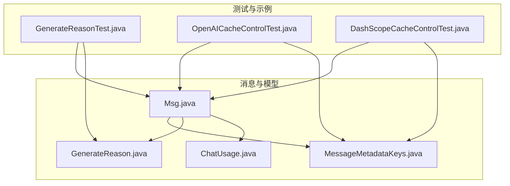
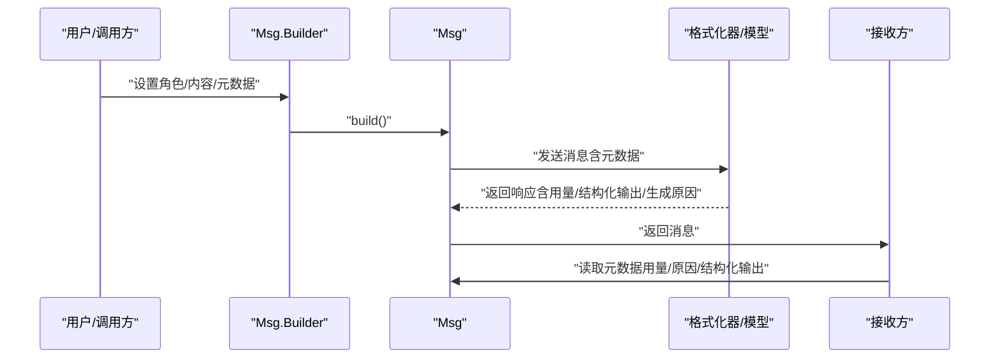
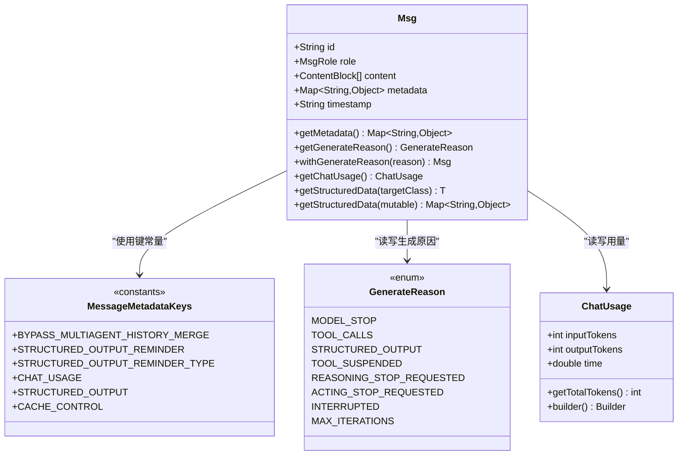
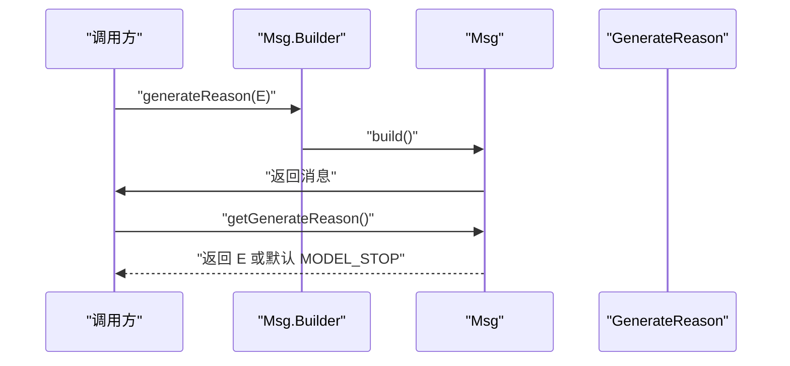
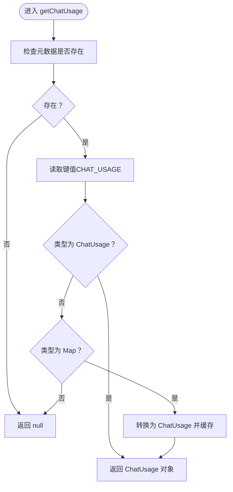
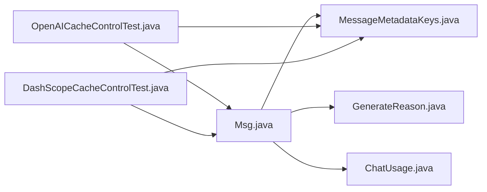

# 消息元数据

<cite>
**本文引用的文件**
- [MessageMetadataKeys.java](file://agentscope-core/src/main/java/io/agentscope/core/message/MessageMetadataKeys.java)
- [GenerateReason.java](file://agentscope-core/src/main/java/io/agentscope/core/message/GenerateReason.java)
- [Msg.java](file://agentscope-core/src/main/java/io/agentscope/core/message/Msg.java)
- [ChatUsage.java](file://agentscope-core/src/main/java/io/agentscope/core/model/ChatUsage.java)
- [GenerateReasonTest.java](file://agentscope-core/src/test/java/io/agentscope/core/message/GenerateReasonTest.java)
- [OpenAICacheControlTest.java](file://agentscope-core/src/test/java/io/agentscope/core/formatter/openai/OpenAICacheControlTest.java)
- [DashScopeCacheControlTest.java](file://agentscope-core/src/test/java/io/agentscope/core/formatter/dashscope/DashScopeCacheControlTest.java)
</cite>

## 目录
1. [简介](#简介)
2. [项目结构](#项目结构)
3. [核心组件](#核心组件)
4. [架构总览](#架构总览)
5. [详细组件分析](#详细组件分析)
6. [依赖关系分析](#依赖关系分析)
7. [性能考量](#性能考量)
8. [故障排查指南](#故障排查指南)
9. [结论](#结论)
10. [附录：使用示例与最佳实践](#附录使用示例与最佳实践)

## 简介
本文件为 AgentScope Java 消息元数据系统的 API 参考文档，聚焦于消息元数据键常量与生成原因枚举的定义、行为与用法。重点覆盖以下内容：
- 元数据键常量：BYPASS_MULTIAGENT_HISTORY_MERGE、STRUCTURED_OUTPUT_REMINDER、STRUCTURED_OUTPUT_REMINDER_TYPE、CHAT_USAGE、STRUCTURED_OUTPUT、CACHE_CONTROL 的作用、类型与典型用法。
- 生成原因枚举 GenerateReason 的取值与语义：MODEL_STOP、TOOL_CALLS、STRUCTURED_OUTPUT、TOOL_SUSPENDED、REASONING_STOP_REQUESTED、ACTING_STOP_REQUESTED、INTERRUPTED、MAX_ITERATIONS。
- 元数据的设置、获取与验证方法（通过 Msg 提供的 API）。
- 元数据在消息传递过程中的作用与最佳实践。
- 结合测试与实现文件给出可参考的使用路径与示例定位。

## 项目结构
与消息元数据相关的核心代码位于 agentscope-core 模块的消息与模型包中，主要文件如下：
- 元数据键常量：MessageMetadataKeys.java
- 生成原因枚举：GenerateReason.java
- 消息对象与元数据访问：Msg.java
- 聊天用量统计：ChatUsage.java
- 使用示例与验证：GenerateReasonTest.java、OpenAICacheControlTest.java、DashScopeCacheControlTest.java

图表来源
- [MessageMetadataKeys.java:1-135](file://agentscope-core/src/main/java/io/agentscope/core/message/MessageMetadataKeys.java#L1-L135)
- [GenerateReason.java:1-62](file://agentscope-core/src/main/java/io/agentscope/core/message/GenerateReason.java#L1-L62)
- [Msg.java:1-656](file://agentscope-core/src/main/java/io/agentscope/core/message/Msg.java#L1-L656)
- [ChatUsage.java:1-138](file://agentscope-core/src/main/java/io/agentscope/core/model/ChatUsage.java#L1-L138)
- [GenerateReasonTest.java:1-144](file://agentscope-core/src/test/java/io/agentscope/core/message/GenerateReasonTest.java#L1-L144)
- [OpenAICacheControlTest.java:170-241](file://agentscope-core/src/test/java/io/agentscope/core/formatter/openai/OpenAICacheControlTest.java#L170-L241)
- [DashScopeCacheControlTest.java:162-201](file://agentscope-core/src/test/java/io/agentscope/core/formatter/dashscope/DashScopeCacheControlTest.java#L162-L201)

章节来源
- [MessageMetadataKeys.java:1-135](file://agentscope-core/src/main/java/io/agentscope/core/message/MessageMetadataKeys.java#L1-L135)
- [GenerateReason.java:1-62](file://agentscope-core/src/main/java/io/agentscope/core/message/GenerateReason.java#L1-L62)
- [Msg.java:1-656](file://agentscope-core/src/main/java/io/agentscope/core/message/Msg.java#L1-L656)
- [ChatUsage.java:1-138](file://agentscope-core/src/main/java/io/agentscope/core/model/ChatUsage.java#L1-L138)
- [GenerateReasonTest.java:1-144](file://agentscope-core/src/test/java/io/agentscope/core/message/GenerateReasonTest.java#L1-L144)
- [OpenAICacheControlTest.java:170-241](file://agentscope-core/src/test/java/io/agentscope/core/formatter/openai/OpenAICacheControlTest.java#L170-L241)
- [DashScopeCacheControlTest.java:162-201](file://agentscope-core/src/test/java/io/agentscope/core/formatter/dashscope/DashScopeCacheControlTest.java#L162-L201)

## 核心组件
- 元数据键常量集合：MessageMetadataKeys 定义了框架内通用的元数据键，避免魔法字符串并统一行为。
- 生成原因枚举：GenerateReason 描述消息生成的原因，便于上层逻辑进行分支处理与后续动作决策。
- 消息对象：Msg 提供元数据的读写、结构化解析、生成原因的存取等能力。
- 聊天用量统计：ChatUsage 表示输入/输出 token 数与耗时，用于成本估算与监控。

章节来源
- [MessageMetadataKeys.java:24-135](file://agentscope-core/src/main/java/io/agentscope/core/message/MessageMetadataKeys.java#L24-L135)
- [GenerateReason.java:36-61](file://agentscope-core/src/main/java/io/agentscope/core/message/GenerateReason.java#L36-L61)
- [Msg.java:53-656](file://agentscope-core/src/main/java/io/agentscope/core/message/Msg.java#L53-L656)
- [ChatUsage.java:26-138](file://agentscope-core/src/main/java/io/agentscope/core/model/ChatUsage.java#L26-L138)

## 架构总览
消息元数据在 AgentScope 中贯穿消息构建、格式化、执行与回传阶段：
- 构建阶段：通过 Msg.Builder 设置元数据（如生成原因、缓存控制标记、结构化输出数据等）。
- 执行阶段：模型或工具调用可能产生用量统计、结构化输出等元数据。
- 回传阶段：接收方从消息元数据中提取用量、生成原因、结构化输出等信息，驱动后续流程。

图表来源
- [Msg.java:500-656](file://agentscope-core/src/main/java/io/agentscope/core/message/Msg.java#L500-L656)
- [Msg.java:390-434](file://agentscope-core/src/main/java/io/agentscope/core/message/Msg.java#L390-L434)
- [Msg.java:450-498](file://agentscope-core/src/main/java/io/agentscope/core/message/Msg.java#L450-L498)
- [OpenAICacheControlTest.java:170-241](file://agentscope-core/src/test/java/io/agentscope/core/formatter/openai/OpenAICacheControlTest.java#L170-L241)
- [DashScopeCacheControlTest.java:162-201](file://agentscope-core/src/test/java/io/agentscope/core/formatter/dashscope/DashScopeCacheControlTest.java#L162-L201)

## 详细组件分析

### 元数据键常量（MessageMetadataKeys）
- BYPASS_MULTIAGENT_HISTORY_MERGE
  - 类型：Boolean
  - 作用：在多智能体格式化器中绕过历史合并，将消息作为独立条目保留。
  - 示例定位：[MessageMetadataKeys.java:30-47](file://agentscope-core/src/main/java/io/agentscope/core/message/MessageMetadataKeys.java#L30-L47)
- STRUCTURED_OUTPUT_REMINDER
  - 类型：Boolean
  - 作用：内部标记结构化输出提醒消息，ReActAgent 识别临时提醒以引导模型使用 generate_response 工具。
  - 示例定位：[MessageMetadataKeys.java:50-59](file://agentscope-core/src/main/java/io/agentscope/core/message/MessageMetadataKeys.java#L50-L59)
- STRUCTURED_OUTPUT_REMINDER_TYPE
  - 类型：String（对应 StructuredOutputReminder 枚举名）
  - 作用：记录提醒消息使用的模式（如 TOOL_CHOICE 或 PROMPT），以便钩子应用特定行为。
  - 示例定位：[MessageMetadataKeys.java:61-71](file://agentscope-core/src/main/java/io/agentscope/core/message/MessageMetadataKeys.java#L61-L71)
- CHAT_USAGE
  - 类型：ChatUsage
  - 作用：累计模型生成过程中的 token 使用量与耗时，支持成本估算与监控。
  - 示例定位：[MessageMetadataKeys.java:73-92](file://agentscope-core/src/main/java/io/agentscope/core/message/MessageMetadataKeys.java#L73-L92)
- STRUCTURED_OUTPUT
  - 类型：Map<String, Object> 或用户自定义 POJO
  - 作用：存储 generate_response 工具生成的结构化输出数据，隔离于其他元数据，避免冲突。
  - 示例定位：[MessageMetadataKeys.java:94-107](file://agentscope-core/src/main/java/io/agentscope/core/message/MessageMetadataKeys.java#L94-L107)
- CACHE_CONTROL
  - 类型：Boolean
  - 作用：手动标记消息以启用提示缓存；优先级高于自动策略，不会被覆盖。
  - 示例定位：[MessageMetadataKeys.java:109-133](file://agentscope-core/src/main/java/io/agentscope/core/message/MessageMetadataKeys.java#L109-L133)

章节来源
- [MessageMetadataKeys.java:24-135](file://agentscope-core/src/main/java/io/agentscope/core/message/MessageMetadataKeys.java#L24-L135)

### 生成原因枚举（GenerateReason）
- MODEL_STOP：模型正常停止，任务完成。
- TOOL_CALLS：模型返回工具调用（内部工具，框架将继续执行）。
- STRUCTURED_OUTPUT：结构化输出完成。
- TOOL_SUSPENDED：工具执行被挂起，等待用户提供结果。
- REASONING_STOP_REQUESTED：由 Hook（PostReasoningEvent.stopAgent）请求在推理阶段停止。
- ACTING_STOP_REQUESTED：由 Hook（PostActingEvent.stopAgent）请求在行动阶段停止。
- INTERRUPTED：代理被中断。
- MAX_ITERATIONS：达到最大迭代次数。

章节来源
- [GenerateReason.java:36-61](file://agentscope-core/src/main/java/io/agentscope/core/message/GenerateReason.java#L36-L61)

### 消息对象与元数据 API（Msg）
- 元数据键常量
  - 内部常量：METADATA_GENERATE_REASON（用于存储生成原因）
  - 外部常量：来自 MessageMetadataKeys 的键
- 获取与设置生成原因
  - getGenerateReason()：默认返回 MODEL_STOP，支持从字符串或枚举读取。
  - withGenerateReason(GenerateReason)：返回新消息实例，不修改原消息（不可变设计）。
  - Builder.generateReason(GenerateReason)：在构建时设置生成原因。
- 获取聊天用量
  - getChatUsage()：从元数据读取 ChatUsage；若为 Map 则转换后缓存。
- 结构化数据解析
  - getStructuredData(Class<T>)：将元数据中的结构化输出转换为目标类型。
  - getStructuredData(boolean mutable)：返回可选的可变副本。
- 元数据存在性检查
  - 建议在解析前使用 hasStructuredData() 进行检查（该方法在 Msg 中提供，用于判断是否存在结构化输出键）。

图表来源
- [Msg.java:53-656](file://agentscope-core/src/main/java/io/agentscope/core/message/Msg.java#L53-L656)
- [MessageMetadataKeys.java:24-135](file://agentscope-core/src/main/java/io/agentscope/core/message/MessageMetadataKeys.java#L24-L135)
- [GenerateReason.java:36-61](file://agentscope-core/src/main/java/io/agentscope/core/message/GenerateReason.java#L36-L61)
- [ChatUsage.java:26-138](file://agentscope-core/src/main/java/io/agentscope/core/model/ChatUsage.java#L26-L138)

章节来源
- [Msg.java:53-656](file://agentscope-core/src/main/java/io/agentscope/core/message/Msg.java#L53-L656)
- [MessageMetadataKeys.java:24-135](file://agentscope-core/src/main/java/io/agentscope/core/message/MessageMetadataKeys.java#L24-L135)
- [GenerateReason.java:36-61](file://agentscope-core/src/main/java/io/agentscope/core/message/GenerateReason.java#L36-L61)
- [ChatUsage.java:26-138](file://agentscope-core/src/main/java/io/agentscope/core/model/ChatUsage.java#L26-L138)

### 生成原因的设置与获取流程

图表来源
- [Msg.java:625-643](file://agentscope-core/src/main/java/io/agentscope/core/message/Msg.java#L625-L643)
- [Msg.java:450-498](file://agentscope-core/src/main/java/io/agentscope/core/message/Msg.java#L450-L498)
- [GenerateReason.java:36-61](file://agentscope-core/src/main/java/io/agentscope/core/message/GenerateReason.java#L36-L61)

章节来源
- [Msg.java:625-643](file://agentscope-core/src/main/java/io/agentscope/core/message/Msg.java#L625-L643)
- [Msg.java:450-498](file://agentscope-core/src/main/java/io/agentscope/core/message/Msg.java#L450-L498)
- [GenerateReason.java:36-61](file://agentscope-core/src/main/java/io/agentscope/core/message/GenerateReason.java#L36-L61)

### 聊天用量（ChatUsage）的读取与转换
- getChatUsage() 支持从元数据直接读取 ChatUsage 对象，或从 Map 转换后缓存为 ChatUsage。
- ChatUsage 提供 inputTokens、outputTokens、time 以及 getTotalTokens() 访问器。

图表来源
- [Msg.java:390-434](file://agentscope-core/src/main/java/io/agentscope/core/message/Msg.java#L390-L434)
- [ChatUsage.java:26-138](file://agentscope-core/src/main/java/io/agentscope/core/model/ChatUsage.java#L26-L138)

章节来源
- [Msg.java:390-434](file://agentscope-core/src/main/java/io/agentscope/core/message/Msg.java#L390-L434)
- [ChatUsage.java:26-138](file://agentscope-core/src/main/java/io/agentscope/core/model/ChatUsage.java#L26-L138)

### 缓存控制（CACHE_CONTROL）的使用
- 当元数据中设置 MessageMetadataKeys.CACHE_CONTROL 为 true 时，格式化器会将该消息标记为缓存（例如 EPHEMERAL）。
- 单测展示了不同场景下的行为：显式标记、未标记、标记为 false、系统消息标记等。

章节来源
- [MessageMetadataKeys.java:109-133](file://agentscope-core/src/main/java/io/agentscope/core/message/MessageMetadataKeys.java#L109-L133)
- [OpenAICacheControlTest.java:170-241](file://agentscope-core/src/test/java/io/agentscope/core/formatter/openai/OpenAICacheControlTest.java#L170-L241)
- [DashScopeCacheControlTest.java:162-201](file://agentscope-core/src/test/java/io/agentscope/core/formatter/dashscope/DashScopeCacheControlTest.java#L162-L201)

## 依赖关系分析
- Msg 依赖 MessageMetadataKeys 提供的键常量，确保元数据键的一致性。
- Msg 依赖 GenerateReason 作为生成原因的枚举类型。
- Msg 依赖 ChatUsage 作为用量统计的数据结构。
- 测试用例 OpenAICacheControlTest 与 DashScopeCacheControlTest 验证了 CACHE_CONTROL 键在格式化阶段的行为一致性。

图表来源
- [Msg.java:53-656](file://agentscope-core/src/main/java/io/agentscope/core/message/Msg.java#L53-L656)
- [MessageMetadataKeys.java:24-135](file://agentscope-core/src/main/java/io/agentscope/core/message/MessageMetadataKeys.java#L24-L135)
- [GenerateReason.java:36-61](file://agentscope-core/src/main/java/io/agentscope/core/message/GenerateReason.java#L36-L61)
- [ChatUsage.java:26-138](file://agentscope-core/src/main/java/io/agentscope/core/model/ChatUsage.java#L26-L138)
- [OpenAICacheControlTest.java:170-241](file://agentscope-core/src/test/java/io/agentscope/core/formatter/openai/OpenAICacheControlTest.java#L170-L241)
- [DashScopeCacheControlTest.java:162-201](file://agentscope-core/src/test/java/io/agentscope/core/formatter/dashscope/DashScopeCacheControlTest.java#L162-L201)

章节来源
- [Msg.java:53-656](file://agentscope-core/src/main/java/io/agentscope/core/message/Msg.java#L53-L656)
- [MessageMetadataKeys.java:24-135](file://agentscope-core/src/main/java/io/agentscope/core/message/MessageMetadataKeys.java#L24-L135)
- [GenerateReason.java:36-61](file://agentscope-core/src/main/java/io/agentscope/core/message/GenerateReason.java#L36-L61)
- [ChatUsage.java:26-138](file://agentscope-core/src/main/java/io/agentscope/core/model/ChatUsage.java#L26-L138)
- [OpenAICacheControlTest.java:170-241](file://agentscope-core/src/test/java/io/agentscope/core/formatter/openai/OpenAICacheControlTest.java#L170-L241)
- [DashScopeCacheControlTest.java:162-201](file://agentscope-core/src/test/java/io/agentscope/core/formatter/dashscope/DashScopeCacheControlTest.java#L162-L201)

## 性能考量
- 不可变消息设计：withGenerateReason 返回新消息实例，避免并发读写问题，但会增加内存分配。建议在需要频繁变更元数据时，考虑批量构建或复用消息。
- ChatUsage 转换：getChatUsage() 在首次遇到 Map 时进行转换并缓存，后续读取直接返回对象，减少重复转换开销。
- 元数据键常量：统一使用 MessageMetadataKeys 常量可避免拼写错误与运行时查找开销。

## 故障排查指南
- 无法解析结构化数据
  - 现象：调用 getStructuredData 抛出异常。
  - 排查：确认消息是否包含 MessageMetadataKeys.STRUCTURED_OUTPUT 键；确认目标类型字段与元数据键匹配；确认元数据非空。
  - 参考：[Msg.java:267-291](file://agentscope-core/src/main/java/io/agentscope/core/message/Msg.java#L267-L291)
- 生成原因读取异常
  - 现象：getGenerateReason 返回默认值 MODEL_STOP。
  - 排查：确认元数据中是否设置了 METADATA_GENERATE_REASON；确认值为合法枚举名称；确认元数据未被覆盖。
  - 参考：[Msg.java:467-483](file://agentscope-core/src/main/java/io/agentscope/core/message/Msg.java#L467-L483)
- 用量统计为空
  - 现象：getChatUsage 返回 null。
  - 排查：确认模型或格式化器是否正确写入 CHAT_USAGE；确认消息是否包含用量信息。
  - 参考：[Msg.java:413-434](file://agentscope-core/src/main/java/io/agentscope/core/message/Msg.java#L413-L434)
- 缓存控制未生效
  - 现象：消息未被标记为缓存。
  - 排查：确认元数据中 CACHE_CONTROL 是否为 true；确认格式化器支持该键；确认未被自动策略覆盖。
  - 参考：[OpenAICacheControlTest.java:170-241](file://agentscope-core/src/test/java/io/agentscope/core/formatter/openai/OpenAICacheControlTest.java#L170-L241)、[DashScopeCacheControlTest.java:162-201](file://agentscope-core/src/test/java/io/agentscope/core/formatter/dashscope/DashScopeCacheControlTest.java#L162-L201)

章节来源
- [Msg.java:267-291](file://agentscope-core/src/main/java/io/agentscope/core/message/Msg.java#L267-L291)
- [Msg.java:413-434](file://agentscope-core/src/main/java/io/agentscope/core/message/Msg.java#L413-L434)
- [Msg.java:467-483](file://agentscope-core/src/main/java/io/agentscope/core/message/Msg.java#L467-L483)
- [OpenAICacheControlTest.java:170-241](file://agentscope-core/src/test/java/io/agentscope/core/formatter/openai/OpenAICacheControlTest.java#L170-L241)
- [DashScopeCacheControlTest.java:162-201](file://agentscope-core/src/test/java/io/agentscope/core/formatter/dashscope/DashScopeCacheControlTest.java#L162-L201)

## 结论
消息元数据系统通过标准化的键常量与清晰的枚举语义，为 AgentScope 的消息传递提供了可追踪、可观测与可扩展的能力。结合 Msg 的不可变设计与丰富的元数据访问 API，开发者可以安全地在多智能体协作、结构化输出、用量统计与缓存控制等场景中高效使用元数据。

## 附录：使用示例与最佳实践
- 设置生成原因
  - 使用 Msg.Builder.generateReason(...) 在构建消息时设置生成原因。
  - 参考：[Msg.java:625-643](file://agentscope-core/src/main/java/io/agentscope/core/message/Msg.java#L625-L643)
- 获取生成原因
  - 使用 Msg.getGenerateReason() 获取当前消息的生成原因，默认为 MODEL_STOP。
  - 参考：[Msg.java:450-498](file://agentscope-core/src/main/java/io/agentscope/core/message/Msg.java#L450-L498)
- 读取聊天用量
  - 使用 Msg.getChatUsage() 获取 ChatUsage；注意可能返回 null。
  - 参考：[Msg.java:390-434](file://agentscope-core/src/main/java/io/agentscope/core/message/Msg.java#L390-L434)
- 解析结构化输出
  - 使用 Msg.getStructuredData(...) 将元数据转换为目标类型；建议先检查是否存在结构化输出键。
  - 参考：[Msg.java:243-350](file://agentscope-core/src/main/java/io/agentscope/core/message/Msg.java#L243-L350)
- 缓存控制
  - 在元数据中设置 MessageMetadataKeys.CACHE_CONTROL 为 true，使格式化器将消息标记为缓存。
  - 参考：[MessageMetadataKeys.java:109-133](file://agentscope-core/src/main/java/io/agentscope/core/message/MessageMetadataKeys.java#L109-L133)、[OpenAICacheControlTest.java:170-241](file://agentscope-core/src/test/java/io/agentscope/core/formatter/openai/OpenAICacheControlTest.java#L170-L241)、[DashScopeCacheControlTest.java:162-201](file://agentscope-core/src/test/java/io/agentscope/core/formatter/dashscope/DashScopeCacheControlTest.java#L162-L201)
- 最佳实践
  - 统一使用 MessageMetadataKeys 常量，避免硬编码键名。
  - 在解析结构化数据前先检查键是否存在，避免异常。
  - 生成原因与用量统计应与业务流程解耦，通过枚举与对象进行状态表达。
  - 缓存控制优先级高于自动策略，谨慎使用以避免意外覆盖。

章节来源
- [Msg.java:243-350](file://agentscope-core/src/main/java/io/agentscope/core/message/Msg.java#L243-L350)
- [Msg.java:390-434](file://agentscope-core/src/main/java/io/agentscope/core/message/Msg.java#L390-L434)
- [Msg.java:450-498](file://agentscope-core/src/main/java/io/agentscope/core/message/Msg.java#L450-L498)
- [Msg.java:625-643](file://agentscope-core/src/main/java/io/agentscope/core/message/Msg.java#L625-L643)
- [MessageMetadataKeys.java:109-133](file://agentscope-core/src/main/java/io/agentscope/core/message/MessageMetadataKeys.java#L109-L133)
- [OpenAICacheControlTest.java:170-241](file://agentscope-core/src/test/java/io/agentscope/core/formatter/openai/OpenAICacheControlTest.java#L170-L241)
- [DashScopeCacheControlTest.java:162-201](file://agentscope-core/src/test/java/io/agentscope/core/formatter/dashscope/DashScopeCacheControlTest.java#L162-L201)