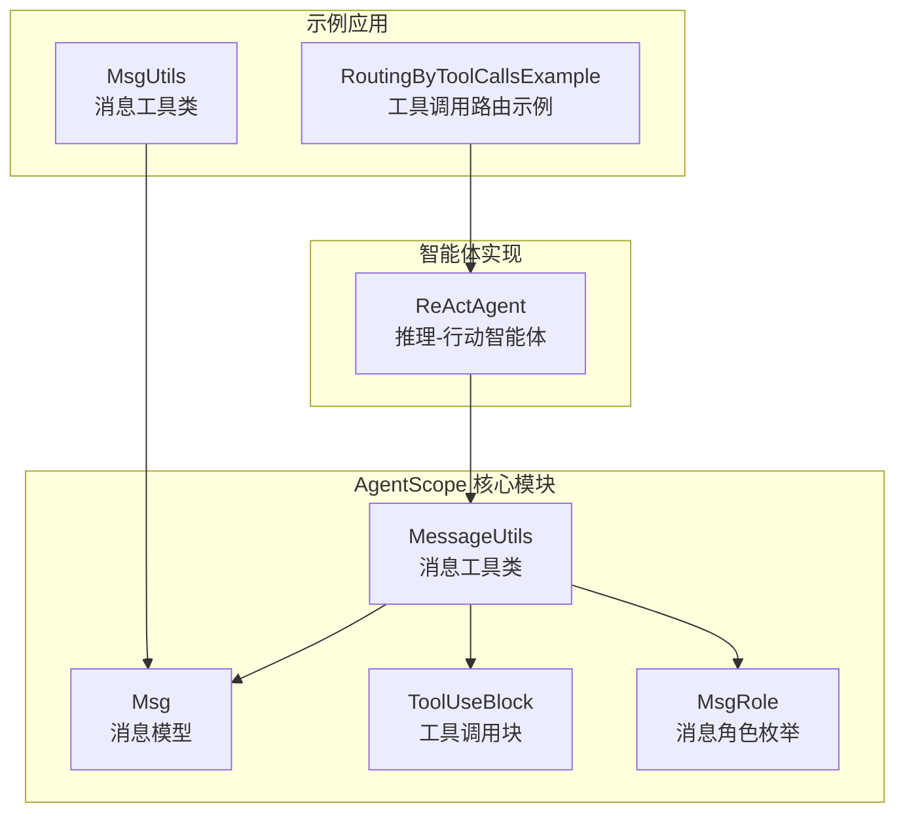
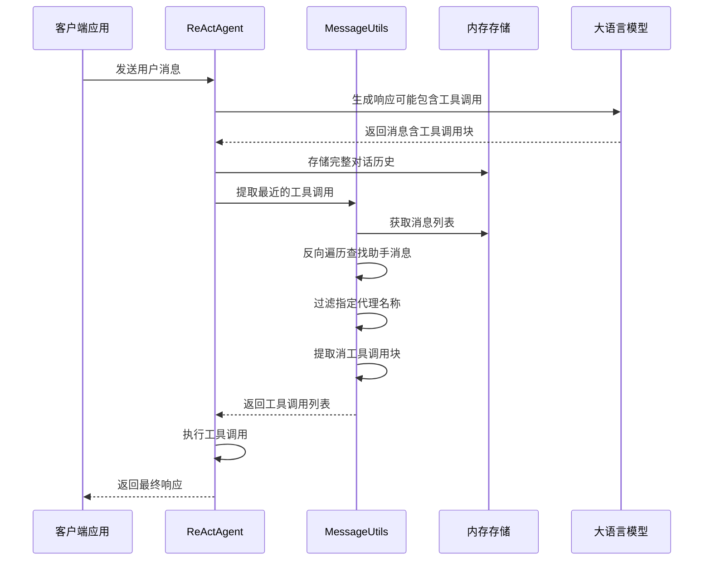
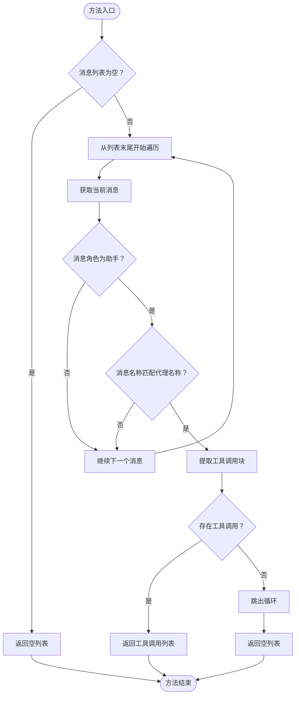
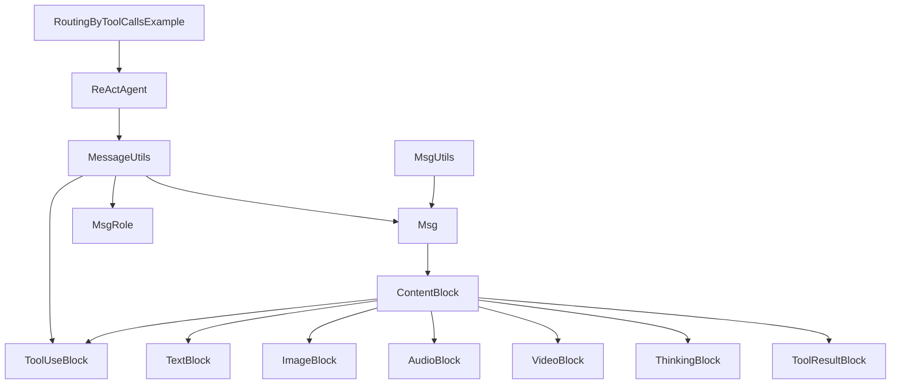

# 消息工具类

<cite>
**本文档引用的文件**
- [MessageUtils.java](file://agentscope-core/src/main/java/io/agentscope/core/util/MessageUtils.java)
- [Msg.java](file://agentscope-core/src/main/java/io/agentscope/core/message/Msg.java)
- [ToolUseBlock.java](file://agentscope-core/src/main/java/io/agentscope/core/message/ToolUseBlock.java)
- [MsgRole.java](file://agentscope-core/src/main/java/io/agentscope/core/message/MsgRole.java)
- [ReActAgent.java](file://agentscope-core/src/main/java/io/agentscope/core/ReActAgent.java)
- [RoutingByToolCallsExample.java](file://agentscope-examples/advanced/src/main/java/io/agentscope/examples/advanced/RoutingByToolCallsExample.java)
- [MsgUtils.java](file://agentscope-examples/advanced/src/main/java/io/agentscope/examples/advanced/util/MsgUtils.java)
</cite>

## 目录
1. [简介](#简介)
2. [项目结构](#项目结构)
3. [核心组件](#核心组件)
4. [架构概览](#架构概览)
5. [详细组件分析](#详细组件分析)
6. [依赖分析](#依赖分析)
7. [性能考虑](#性能考虑)
8. [故障排除指南](#故障排除指南)
9. [结论](#结论)

## 简介

AgentScope Java 消息工具类（MessageUtils）是智能体通信系统中的关键基础设施，专门用于处理和操作消息列表，特别是在工具调用提取和消息验证方面发挥重要作用。该工具类为 AgentScope 框架提供了高效的消息处理能力，支持复杂的多智能体协作场景。

消息工具类的核心价值在于其简洁而强大的 API 设计，通过单一的静态方法解决了智能体开发中最常见的消息处理需求。它不仅简化了开发者的工作流程，还确保了消息处理的一致性和可靠性。

## 项目结构

AgentScope Java 项目采用模块化的架构设计，消息工具类位于核心模块中，与消息模型、智能体实现紧密集成：

**图表来源**
- [MessageUtils.java:1-67](file://agentscope-core/src/main/java/io/agentscope/core/util/MessageUtils.java#L1-L67)
- [Msg.java:1-656](file://agentscope-core/src/main/java/io/agentscope/core/message/Msg.java#L1-L656)
- [ReActAgent.java:950-980](file://agentscope-core/src/main/java/io/agentscope/core/ReActAgent.java#L950-L980)

**章节来源**
- [MessageUtils.java:16-31](file://agentscope-core/src/main/java/io/agentscope/core/util/MessageUtils.java#L16-L31)
- [Msg.java:38-53](file://agentscope-core/src/main/java/io/agentscope/core/message/Msg.java#L38-L53)

## 核心组件

### MessageUtils 工具类

MessageUtils 是一个最终类（final class），采用工具类模式设计，提供静态方法来处理消息列表。该类的设计遵循了不可变性原则，所有方法都是纯函数式，不修改输入参数。

#### 主要特性
- **线程安全**：所有方法都是静态的，无状态设计
- **类型安全**：使用泛型确保编译时类型检查
- **空值安全**：对 null 值进行适当的处理和保护
- **性能优化**：使用反向遍历算法提高工具调用提取效率

#### 构造函数保护
工具类通过私有构造函数和 UnsupportedOperationException 来防止实例化，确保只能通过静态方法访问。

**章节来源**
- [MessageUtils.java:31-35](file://agentscope-core/src/main/java/io/agentscope/core/util/MessageUtils.java#L31-L35)

## 架构概览

消息工具类在整个 AgentScope 架构中扮演着桥梁的角色，连接智能体逻辑和消息处理层：

**图表来源**
- [ReActAgent.java:963-965](file://agentscope-core/src/main/java/io/agentscope/core/ReActAgent.java#L963-L965)
- [MessageUtils.java:48-65](file://agentscope-core/src/main/java/io/agentscope/core/util/MessageUtils.java#L48-L65)

## 详细组件分析

### extractRecentToolCalls 方法

这是 MessageUtils 类的核心方法，负责从消息列表中提取最近的工具调用。该方法实现了智能的工具调用识别和提取机制。

#### 方法签名与参数
- **方法名**：extractRecentToolCalls
- **参数**：
  - `messages`: List<Msg> - 消息列表
  - `agentName`: String - 代理名称
- **返回值**：List<ToolUseBlock> - 工具调用块列表

#### 算法流程

**图表来源**
- [MessageUtils.java:48-65](file://agentscope-core/src/main/java/io/agentscope/core/util/MessageUtils.java#L48-L65)

#### 关键实现细节

1. **空值检查**：首先检查消息列表是否为空或 null
2. **反向遍历**：从列表末尾向前遍历，确保获取到最新的助手消息
3. **角色验证**：严格检查消息角色必须为 ASSISTANT
4. **名称匹配**：确保消息发送者名称与指定代理名称完全匹配
5. **内容提取**：使用类型安全的方法提取 ToolUseBlock 内容块
6. **早退机制**：一旦找到匹配的消息就立即返回结果

#### 性能特征
- **时间复杂度**：O(n)，其中 n 是消息列表长度
- **空间复杂度**：O(k)，其中 k 是找到的工具调用数量
- **优化策略**：反向遍历避免了正向遍历可能的多次扫描

**章节来源**
- [MessageUtils.java:48-65](file://agentscope-core/src/main/java/io/agentscope/core/util/MessageUtils.java#L48-L65)

### 消息模型集成

MessageUtils 与 Msg 消息模型深度集成，利用了消息模型的强大功能：

#### Msg 类的关键功能
- **内容块管理**：支持多种内容块类型（文本、图像、音频、视频、思考内容、工具调用块、工具结果块）
- **元数据支持**：提供结构化输出和聊天使用统计等功能
- **不可变性**：确保线程安全和数据一致性
- **类型安全**：提供类型化的工具方法

#### ToolUseBlock 结构
- **唯一标识符**：每个工具调用都有唯一的 ID
- **工具名称**：指定要执行的工具
- **输入参数**：灵活的参数映射
- **元数据支持**：提供商特定的元数据

**章节来源**
- [Msg.java:182-202](file://agentscope-core/src/main/java/io/agentscope/core/message/Msg.java#L182-L202)
- [ToolUseBlock.java:34-97](file://agentscope-core/src/main/java/io/agentscope/core/message/ToolUseBlock.java#L34-L97)

## 依赖分析

### 内部依赖关系

**图表来源**
- [MessageUtils.java:18-21](file://agentscope-core/src/main/java/io/agentscope/core/util/MessageUtils.java#L18-L21)
- [Msg.java:18-36](file://agentscope-core/src/main/java/io/agentscope/core/message/Msg.java#L18-L36)

### 外部依赖

MessageUtils 依赖于以下核心组件：
- **Jackson 序列化**：用于 JSON 处理和对象转换
- **类型工具类**：提供类型安全的转换功能
- **集合框架**：使用 Java 标准库的集合接口

**章节来源**
- [MessageUtils.java:18-23](file://agentscope-core/src/main/java/io/agentscope/core/util/MessageUtils.java#L18-L23)

## 性能考虑

### 时间复杂度优化

MessageUtils 在设计时充分考虑了性能因素：

1. **单次遍历**：通过反向遍历确保只扫描一次消息列表
2. **早退机制**：一旦找到匹配的工具调用就立即返回
3. **内存效率**：使用流式处理避免不必要的中间集合创建
4. **类型安全**：编译时类型检查减少运行时错误

### 内存使用优化

- **不可变设计**：避免创建不必要的副本
- **延迟计算**：只在需要时才进行内容块提取
- **空集合返回**：使用不可变空列表减少内存分配

### 最佳实践建议

1. **批量处理**：对于大量消息的场景，考虑分批处理
2. **缓存策略**：对频繁查询的结果进行适当缓存
3. **并发安全**：在多线程环境中确保消息列表的线程安全
4. **资源管理**：及时释放不再使用的消息引用

## 故障排除指南

### 常见问题及解决方案

#### 问题1：提取不到工具调用
**症状**：extractRecentToolCalls 返回空列表
**可能原因**：
- 消息列表为空或 null
- 最近的消息不是助手角色
- 代理名称不匹配
- 消息中没有工具调用块

**解决方法**：
1. 验证消息列表的有效性
2. 检查消息角色是否为 ASSISTANT
3. 确认代理名称完全匹配
4. 使用 Msg.hasContentBlocks() 检查是否存在工具调用块

#### 问题2：性能问题
**症状**：消息处理缓慢
**可能原因**：
- 消息列表过大
- 频繁的重复调用
- 不必要的消息复制

**解决方法**：
1. 考虑使用消息分页或限制消息数量
2. 实现适当的缓存机制
3. 优化消息存储结构

#### 问题3：类型转换错误
**症状**：运行时类型转换异常
**可能原因**：
- 内容块类型不匹配
- 元数据格式错误

**解决方法**：
1. 使用类型安全的方法进行检查
2. 添加适当的异常处理
3. 验证数据格式的正确性

**章节来源**
- [MessageUtils.java:48-65](file://agentscope-core/src/main/java/io/agentscope/core/util/MessageUtils.java#L48-L65)
- [Msg.java:182-202](file://agentscope-core/src/main/java/io/agentscope/core/message/Msg.java#L182-L202)

## 结论

MessageUtils 工具类虽然看似简单，但却是 AgentScope 智能体通信系统中不可或缺的重要组件。它通过精心设计的 API 和高效的算法，为复杂的多智能体协作提供了坚实的基础。

### 主要优势

1. **简洁性**：单一职责的 API 设计，易于理解和使用
2. **性能**：优化的算法确保高效的工具调用提取
3. **安全性**：类型安全和空值保护确保代码健壮性
4. **可扩展性**：良好的设计为未来的功能扩展预留了空间

### 应用场景

- **工具调用路由**：自动识别和提取智能体请求的工具调用
- **消息过滤**：根据角色和内容类型筛选消息
- **状态管理**：跟踪智能体的执行状态和进度
- **调试支持**：提供详细的日志和诊断信息

### 未来发展

随着 AgentScope 框架的不断发展，MessageUtils 可能会扩展更多功能，如：
- 更复杂的消息过滤和排序功能
- 支持更多内容块类型的提取
- 集成机器学习驱动的消息处理
- 提供更丰富的性能监控和分析功能

通过持续的优化和改进，MessageUtils 将继续为 AgentScope 生态系统提供可靠、高效的工具调用提取能力，推动智能体技术的发展和应用。