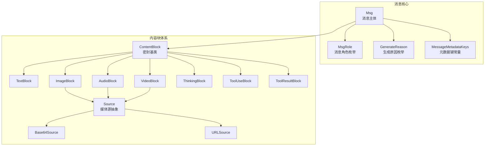
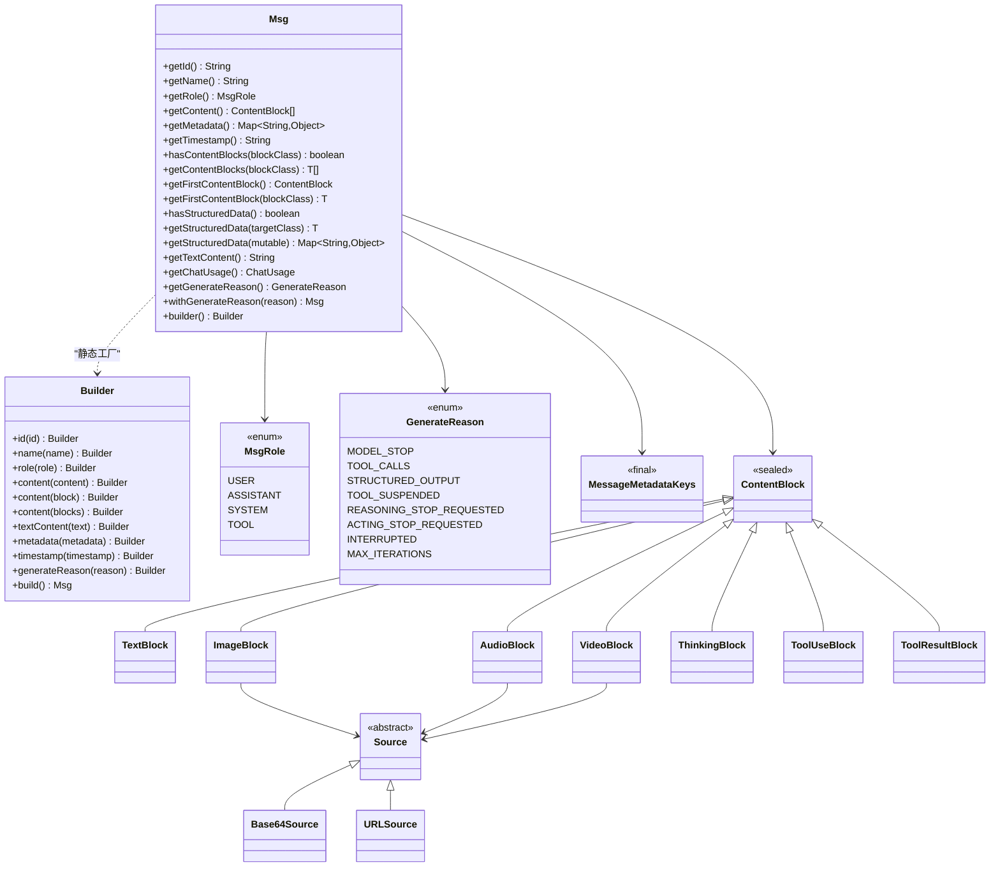
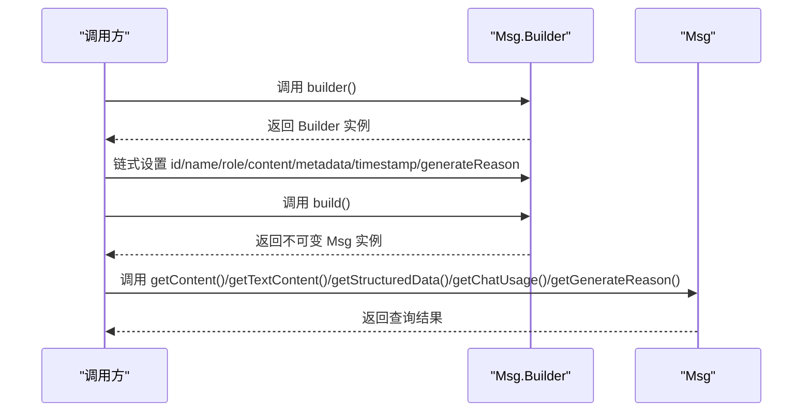
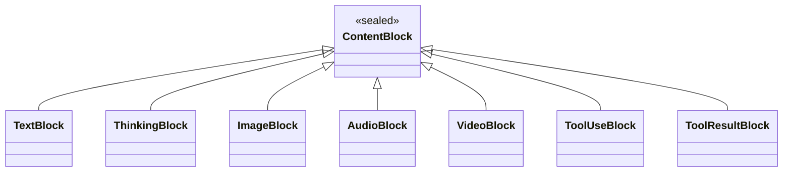
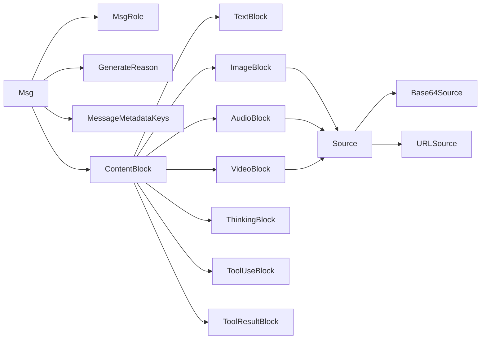

# 消息核心类

<cite>
**本文引用的文件**
- [Msg.java](file://agentscope-core/src/main/java/io/agentscope/core/message/Msg.java)
- [MsgRole.java](file://agentscope-core/src/main/java/io/agentscope/core/message/MsgRole.java)
- [MessageMetadataKeys.java](file://agentscope-core/src/main/java/io/agentscope/core/message/MessageMetadataKeys.java)
- [ContentBlock.java](file://agentscope-core/src/main/java/io/agentscope/core/message/ContentBlock.java)
- [GenerateReason.java](file://agentscope-core/src/main/java/io/agentscope/core/message/GenerateReason.java)
- [TextBlock.java](file://agentscope-core/src/main/java/io/agentscope/core/message/TextBlock.java)
- [ImageBlock.java](file://agentscope-core/src/main/java/io/agentscope/core/message/ImageBlock.java)
- [AudioBlock.java](file://agentscope-core/src/main/java/io/agentscope/core/message/AudioBlock.java)
- [VideoBlock.java](file://agentscope-core/src/main/java/io/agentscope/core/message/VideoBlock.java)
- [ThinkingBlock.java](file://agentscope-core/src/main/java/io/agentscope/core/message/ThinkingBlock.java)
- [ToolUseBlock.java](file://agentscope-core/src/main/java/io/agentscope/core/message/ToolUseBlock.java)
- [ToolResultBlock.java](file://agentscope-core/src/main/java/io/agentscope/core/message/ToolResultBlock.java)
- [Source.java](file://agentscope-core/src/main/java/io/agentscope/core/message/Source.java)
- [Base64Source.java](file://agentscope-core/src/main/java/io/agentscope/core/message/Base64Source.java)
- [URLSource.java](file://agentscope-core/src/main/java/io/agentscope/core/message/URLSource.java)
- [MsgTest.java](file://agentscope-core/src/test/java/io/agentscope/core/message/MsgTest.java)
</cite>

## 目录
1. [简介](#简介)
2. [项目结构](#项目结构)
3. [核心组件](#核心组件)
4. [架构总览](#架构总览)
5. [详细组件分析](#详细组件分析)
6. [依赖分析](#依赖分析)
7. [性能考虑](#性能考虑)
8. [故障排查指南](#故障排查指南)
9. [结论](#结论)
10. [附录：最佳实践与示例路径](#附录最佳实践与示例路径)

## 简介
本文件为 AgentScope Java 消息核心类的详细 API 参考文档，聚焦于消息实体 Msg 的完整实现与使用。内容涵盖：
- 构造函数与 Builder 模式
- 所有公共方法与属性
- 角色定义 MsgRole
- 消息 ID 生成机制
- 时间戳格式化策略
- 元数据管理与常用键
- 内容块体系（多模态与工具调用）
- 序列化与反序列化细节
- 不可变性与线程安全特性
- 常见使用模式与最佳实践
- 具体示例的代码路径指引

## 项目结构
消息系统位于 agentscope-core 模块的消息包中，围绕 Msg 核心类展开，并通过内容块 ContentBlock 的密封子类型支持文本、图像、音频、视频、思考内容、工具调用与工具结果等多模态与工具交互能力。

**图表来源**
- [Msg.java:53-656](file://agentscope-core/src/main/java/io/agentscope/core/message/Msg.java#L53-L656)
- [MsgRole.java:35-67](file://agentscope-core/src/main/java/io/agentscope/core/message/MsgRole.java#L35-L67)
- [GenerateReason.java:36-61](file://agentscope-core/src/main/java/io/agentscope/core/message/GenerateReason.java#L36-L61)
- [MessageMetadataKeys.java:24-134](file://agentscope-core/src/main/java/io/agentscope/core/message/MessageMetadataKeys.java#L24-L134)
- [ContentBlock.java:54-61](file://agentscope-core/src/main/java/io/agentscope/core/message/ContentBlock.java#L54-L61)
- [TextBlock.java:31-95](file://agentscope-core/src/main/java/io/agentscope/core/message/TextBlock.java#L31-L95)
- [ImageBlock.java:37-163](file://agentscope-core/src/main/java/io/agentscope/core/message/ImageBlock.java#L37-L163)
- [AudioBlock.java:35-96](file://agentscope-core/src/main/java/io/agentscope/core/message/AudioBlock.java#L35-L96)
- [VideoBlock.java:36-239](file://agentscope-core/src/main/java/io/agentscope/core/message/VideoBlock.java#L36-L239)
- [ThinkingBlock.java:37-133](file://agentscope-core/src/main/java/io/agentscope/core/message/ThinkingBlock.java#L37-L133)
- [ToolUseBlock.java:34-233](file://agentscope-core/src/main/java/io/agentscope/core/message/ToolUseBlock.java#L34-L233)
- [ToolResultBlock.java:35-374](file://agentscope-core/src/main/java/io/agentscope/core/message/ToolResultBlock.java#L35-L374)
- [Source.java:27-32](file://agentscope-core/src/main/java/io/agentscope/core/message/Source.java#L27-L32)
- [Base64Source.java:39-128](file://agentscope-core/src/main/java/io/agentscope/core/message/Base64Source.java#L39-L128)
- [URLSource.java:39-100](file://agentscope-core/src/main/java/io/agentscope/core/message/URLSource.java#L39-L100)

**章节来源**
- [Msg.java:1-656](file://agentscope-core/src/main/java/io/agentscope/core/message/Msg.java#L1-L656)
- [ContentBlock.java:1-62](file://agentscope-core/src/main/java/io/agentscope/core/message/ContentBlock.java#L1-L62)

## 核心组件
- Msg：消息主体，封装唯一 ID、名称、角色、内容块列表、元数据与时间戳；提供类型安全的内容块筛选、纯文本提取、结构化数据解析、用量统计与生成原因查询等便捷方法。
- MsgRole：消息角色枚举（USER、ASSISTANT、SYSTEM、TOOL）。
- GenerateReason：消息生成原因枚举，用于表达生成上下文与后续动作提示。
- MessageMetadataKeys：元数据键常量集合，统一管理框架内通用元数据键。
- ContentBlock 及其密封子类：多模态与工具交互的基础内容单元，支持 JSON 多态序列化。

**章节来源**
- [Msg.java:53-656](file://agentscope-core/src/main/java/io/agentscope/core/message/Msg.java#L53-L656)
- [MsgRole.java:35-67](file://agentscope-core/src/main/java/io/agentscope/core/message/MsgRole.java#L35-L67)
- [GenerateReason.java:36-61](file://agentscope-core/src/main/java/io/agentscope/core/message/GenerateReason.java#L36-L61)
- [MessageMetadataKeys.java:24-134](file://agentscope-core/src/main/java/io/agentscope/core/message/MessageMetadataKeys.java#L24-L134)
- [ContentBlock.java:54-61](file://agentscope-core/src/main/java/io/agentscope/core/message/ContentBlock.java#L54-L61)

## 架构总览
下图展示了消息核心类之间的关系与职责分工：

**图表来源**
- [Msg.java:53-656](file://agentscope-core/src/main/java/io/agentscope/core/message/Msg.java#L53-L656)
- [MsgRole.java:35-67](file://agentscope-core/src/main/java/io/agentscope/core/message/MsgRole.java#L35-L67)
- [GenerateReason.java:36-61](file://agentscope-core/src/main/java/io/agentscope/core/message/GenerateReason.java#L36-L61)
- [MessageMetadataKeys.java:24-134](file://agentscope-core/src/main/java/io/agentscope/core/message/MessageMetadataKeys.java#L24-L134)
- [ContentBlock.java:54-61](file://agentscope-core/src/main/java/io/agentscope/core/message/ContentBlock.java#L54-L61)
- [TextBlock.java:31-95](file://agentscope-core/src/main/java/io/agentscope/core/message/TextBlock.java#L31-L95)
- [ImageBlock.java:37-163](file://agentscope-core/src/main/java/io/agentscope/core/message/ImageBlock.java#L37-L163)
- [AudioBlock.java:35-96](file://agentscope-core/src/main/java/io/agentscope/core/message/AudioBlock.java#L35-L96)
- [VideoBlock.java:36-239](file://agentscope-core/src/main/java/io/agentscope/core/message/VideoBlock.java#L36-L239)
- [ThinkingBlock.java:37-133](file://agentscope-core/src/main/java/io/agentscope/core/message/ThinkingBlock.java#L37-L133)
- [ToolUseBlock.java:34-233](file://agentscope-core/src/main/java/io/agentscope/core/message/ToolUseBlock.java#L34-L233)
- [ToolResultBlock.java:35-374](file://agentscope-core/src/main/java/io/agentscope/core/message/ToolResultBlock.java#L35-L374)
- [Source.java:27-32](file://agentscope-core/src/main/java/io/agentscope/core/message/Source.java#L27-L32)
- [Base64Source.java:39-128](file://agentscope-core/src/main/java/io/agentscope/core/message/Base64Source.java#L39-L128)
- [URLSource.java:39-100](file://agentscope-core/src/main/java/io/agentscope/core/message/URLSource.java#L39-L100)

## 详细组件分析

### Msg 类与 Builder 模式
- 构造与字段
  - 字段：id、name、role、content（不可变列表）、metadata（不可变映射）、timestamp（字符串）。
  - JSON 反序列化构造器通过 Jackson 注解读取字段，对 content 与 metadata 进行空值过滤与防御性复制，确保不可变性与线程安全。
- Builder
  - 默认随机 UUID 作为消息 ID；默认角色为 USER；默认时间戳为当前系统时区格式化字符串。
  - 提供链式设置方法：id、name、role、content（单个/多个/数组）、textContent、metadata、timestamp、generateReason。
  - build 返回不可变 Msg 实例。
- 查询与转换
  - hasContentBlocks/getContentBlocks/getFirstContentBlock 支持按类型安全筛选与获取。
  - getTextContent 将所有 TextBlock 文本拼接为字符串。
  - hasStructuredData/getStructuredData 支持从元数据中提取结构化输出（POJO 或 Map），并进行类型转换。
  - getChatUsage 支持从元数据中读取 ChatUsage 统计信息，兼容直接对象或 Map 形式。
  - getGenerateReason/withGenerateReason 提供生成原因的读取与基于不可变更新的新实例创建。
- 不可变性与线程安全
  - 所有字段为 final；List/Map 采用不可变视图或防御性复制；content 中的 ContentBlock 本身不可变（如 TextBlock、ImageBlock 等）。
  - 多线程环境下读取安全，避免竞态条件。

**图表来源**
- [Msg.java:500-654](file://agentscope-core/src/main/java/io/agentscope/core/message/Msg.java#L500-L654)

**章节来源**
- [Msg.java:83-110](file://agentscope-core/src/main/java/io/agentscope/core/message/Msg.java#L83-L110)
- [Msg.java:117-119](file://agentscope-core/src/main/java/io/agentscope/core/message/Msg.java#L117-L119)
- [Msg.java:126-173](file://agentscope-core/src/main/java/io/agentscope/core/message/Msg.java#L126-L173)
- [Msg.java:182-230](file://agentscope-core/src/main/java/io/agentscope/core/message/Msg.java#L182-L230)
- [Msg.java:237-291](file://agentscope-core/src/main/java/io/agentscope/core/message/Msg.java#L237-L291)
- [Msg.java:293-388](file://agentscope-core/src/main/java/io/agentscope/core/message/Msg.java#L293-L388)
- [Msg.java:390-434](file://agentscope-core/src/main/java/io/agentscope/core/message/Msg.java#L390-L434)
- [Msg.java:450-498](file://agentscope-core/src/main/java/io/agentscope/core/message/Msg.java#L450-L498)
- [Msg.java:500-654](file://agentscope-core/src/main/java/io/agentscope/core/message/Msg.java#L500-L654)

### 角色定义 MsgRole
- 定义了四类角色：USER（用户输入）、ASSISTANT（助手/模型输出）、SYSTEM（系统指令/上下文）、TOOL（工具执行结果）。
- 角色是消息路由与格式化的关键依据。

**章节来源**
- [MsgRole.java:35-67](file://agentscope-core/src/main/java/io/agentscope/core/message/MsgRole.java#L35-L67)

### 生成原因 GenerateReason
- 提供生成上下文语义：正常停止、工具调用、结构化输出完成、工具挂起、人工介入（推理/行动阶段）、被中断、达到最大迭代次数。
- 与消息元数据配合，帮助上层流程决定后续动作。

**章节来源**
- [GenerateReason.java:36-61](file://agentscope-core/src/main/java/io/agentscope/core/message/GenerateReason.java#L36-L61)

### 元数据键 MessageMetadataKeys
- 统一管理框架内通用元数据键，包括：
  - 结构化输出键：_structured_output
  - 聊天用量键：_chat_usage
  - 缓存控制键：_cache_control
  - 多代理历史合并绕过键：_bypass_multiagent_history_merge
  - 结构化输出提醒键：_structured_output_reminder 及其类型键 _structured_output_reminder_type
- 使用这些键可避免魔法字符串，提升一致性与可维护性。

**章节来源**
- [MessageMetadataKeys.java:24-134](file://agentscope-core/src/main/java/io/agentscope/core/message/MessageMetadataKeys.java#L24-L134)

### 内容块体系与多模态支持
- ContentBlock 为密封基类，通过 Jackson 多态注解在 JSON 中以 type 字段区分具体类型。
- 支持类型：
  - TextBlock：纯文本内容
  - ThinkingBlock：推理/思考内容，支持额外元数据
  - ImageBlock：图片内容，支持 URL 或 Base64 源，可配置像素阈值与帧率参数
  - AudioBlock：音频内容，支持 URL 或 Base64 源
  - VideoBlock：视频内容，支持 URL 或 Base64 源，可配置 FPS、帧数上限、像素阈值与总像素限制
  - ToolUseBlock：工具调用请求，携带 id、name、input、content（流式工具调用）与 metadata
  - ToolResultBlock：工具执行结果，支持 suspended 标记与多种构造方式

**图表来源**
- [ContentBlock.java:54-61](file://agentscope-core/src/main/java/io/agentscope/core/message/ContentBlock.java#L54-L61)
- [TextBlock.java:31-95](file://agentscope-core/src/main/java/io/agentscope/core/message/TextBlock.java#L31-L95)
- [ThinkingBlock.java:37-133](file://agentscope-core/src/main/java/io/agentscope/core/message/ThinkingBlock.java#L37-L133)
- [ImageBlock.java:37-163](file://agentscope-core/src/main/java/io/agentscope/core/message/ImageBlock.java#L37-L163)
- [AudioBlock.java:35-96](file://agentscope-core/src/main/java/io/agentscope/core/message/AudioBlock.java#L35-L96)
- [VideoBlock.java:36-239](file://agentscope-core/src/main/java/io/agentscope/core/message/VideoBlock.java#L36-L239)
- [ToolUseBlock.java:34-233](file://agentscope-core/src/main/java/io/agentscope/core/message/ToolUseBlock.java#L34-L233)
- [ToolResultBlock.java:35-374](file://agentscope-core/src/main/java/io/agentscope/core/message/ToolResultBlock.java#L35-L374)

**章节来源**
- [ContentBlock.java:44-61](file://agentscope-core/src/main/java/io/agentscope/core/message/ContentBlock.java#L44-L61)
- [TextBlock.java:31-95](file://agentscope-core/src/main/java/io/agentscope/core/message/TextBlock.java#L31-L95)
- [ThinkingBlock.java:37-133](file://agentscope-core/src/main/java/io/agentscope/core/message/ThinkingBlock.java#L37-L133)
- [ImageBlock.java:37-163](file://agentscope-core/src/main/java/io/agentscope/core/message/ImageBlock.java#L37-L163)
- [AudioBlock.java:35-96](file://agentscope-core/src/main/java/io/agentscope/core/message/AudioBlock.java#L35-L96)
- [VideoBlock.java:36-239](file://agentscope-core/src/main/java/io/agentscope/core/message/VideoBlock.java#L36-L239)
- [ToolUseBlock.java:34-233](file://agentscope-core/src/main/java/io/agentscope/core/message/ToolUseBlock.java#L34-L233)
- [ToolResultBlock.java:35-374](file://agentscope-core/src/main/java/io/agentscope/core/message/ToolResultBlock.java#L35-L374)

### 媒体源 Source 与具体实现
- Source 抽象类，通过 Jackson 多态注解支持 URL 与 Base64 两种媒体源。
- URLSource：远程或本地文件 URL 引用。
- Base64Source：MIME 类型 + Base64 数据，适合内联小体积媒体。

**章节来源**
- [Source.java:27-32](file://agentscope-core/src/main/java/io/agentscope/core/message/Source.java#L27-L32)
- [URLSource.java:39-100](file://agentscope-core/src/main/java/io/agentscope/core/message/URLSource.java#L39-L100)
- [Base64Source.java:39-128](file://agentscope-core/src/main/java/io/agentscope/core/message/Base64Source.java#L39-L128)

### 消息 ID 生成机制
- Builder 构造时会调用随机 UUID 生成器为消息分配唯一 ID。
- Msg 构造器保留传入的 ID，确保外部可指定 ID 的场景可用。

**章节来源**
- [Msg.java:517-537](file://agentscope-core/src/main/java/io/agentscope/core/message/Msg.java#L517-L537)
- [Msg.java:83-110](file://agentscope-core/src/main/java/io/agentscope/core/message/Msg.java#L83-L110)

### 时间戳格式化
- 默认时间戳格式为“年-月-日 时:分:秒.毫秒”，使用系统默认时区。
- Builder 在未显式设置时自动格式化当前时间；Msg 构造器保留传入的时间戳字符串。

**章节来源**
- [Msg.java:58-59](file://agentscope-core/src/main/java/io/agentscope/core/message/Msg.java#L58-L59)
- [Msg.java:618-622](file://agentscope-core/src/main/java/io/agentscope/core/message/Msg.java#L618-L622)
- [Msg.java](file://agentscope-core/src/main/java/io/agentscope/core/message/Msg.java#L512)

### 元数据管理
- Msg 构造器对 metadata 进行防御性处理：过滤空键与空值，保证不可变性。
- 常用元数据键由 MessageMetadataKeys 统一管理，便于跨模块一致使用。
- 通过 getStructuredData 与 getChatUsage 等便捷方法，简化上层业务逻辑。

**章节来源**
- [Msg.java:98-108](file://agentscope-core/src/main/java/io/agentscope/core/message/Msg.java#L98-L108)
- [MessageMetadataKeys.java:24-134](file://agentscope-core/src/main/java/io/agentscope/core/message/MessageMetadataKeys.java#L24-L134)

### 序列化与反序列化
- Msg 与各内容块均通过 Jackson 注解支持 JSON 序列化与反序列化。
- ContentBlock 与 Source 使用 JsonTypeInfo/JsonSubTypes 多态注解，JSON 中以 type 字段区分具体类型。
- Msg 构造器使用 @JsonCreator 与 @JsonProperty，确保从 JSON 正确还原对象状态。

**章节来源**
- [ContentBlock.java:44-53](file://agentscope-core/src/main/java/io/agentscope/core/message/ContentBlock.java#L44-L53)
- [Source.java:27-32](file://agentscope-core/src/main/java/io/agentscope/core/message/Source.java#L27-L32)
- [Msg.java:83-110](file://agentscope-core/src/main/java/io/agentscope/core/message/Msg.java#L83-L110)

### 不可变性与线程安全性
- 所有字段为 final；List/Map 采用不可变视图或防御性复制；内容块对象本身不可变。
- 多线程读取安全，避免竞态条件；通过 withGenerateReason 等方法返回新实例，保持原对象不变。

**章节来源**
- [Msg.java:94-109](file://agentscope-core/src/main/java/io/agentscope/core/message/Msg.java#L94-L109)
- [Msg.java:494-498](file://agentscope-core/src/main/java/io/agentscope/core/message/Msg.java#L494-L498)

### 常见使用模式与最佳实践
- 快速构建文本消息：使用 Builder 的 textContent 方法，一步到位创建包含 TextBlock 的消息。
- 多模态消息：组合 TextBlock、ImageBlock、AudioBlock、VideoBlock 等内容块，满足复杂交互需求。
- 工具调用与结果：使用 ToolUseBlock 表达工具请求，使用 ToolResultBlock 表达工具结果；必要时标记 suspended 以指示外部执行。
- 结构化数据：通过元数据键 _structured_output 存储结构化输出，使用 getStructuredData 解析为 POJO 或 Map。
- 用量统计：通过 _chat_usage 元数据键记录 token 用量与耗时，使用 getChatUsage 获取强类型对象。
- 生成原因：通过 generateReason 字段与 getGenerateReason/withGenerateReason 管理生成上下文，辅助流程控制。

**章节来源**
- [MsgTest.java:28-207](file://agentscope-core/src/test/java/io/agentscope/core/message/MsgTest.java#L28-L207)
- [MessageMetadataKeys.java:74-107](file://agentscope-core/src/main/java/io/agentscope/core/message/MessageMetadataKeys.java#L74-L107)
- [ToolResultBlock.java:139-159](file://agentscope-core/src/main/java/io/agentscope/core/message/ToolResultBlock.java#L139-L159)

## 依赖分析
- Msg 对 MsgRole、GenerateReason、MessageMetadataKeys、ContentBlock 及其子类存在直接依赖。
- ContentBlock 作为密封基类，约束子类范围，确保类型安全与可扩展性。
- Source 抽象类被 ImageBlock、AudioBlock、VideoBlock 组合使用，统一媒体源表示。

**图表来源**
- [Msg.java:53-656](file://agentscope-core/src/main/java/io/agentscope/core/message/Msg.java#L53-L656)
- [ContentBlock.java:54-61](file://agentscope-core/src/main/java/io/agentscope/core/message/ContentBlock.java#L54-L61)
- [Source.java:27-32](file://agentscope-core/src/main/java/io/agentscope/core/message/Source.java#L27-L32)

**章节来源**
- [Msg.java:53-656](file://agentscope-core/src/main/java/io/agentscope/core/message/Msg.java#L53-L656)
- [ContentBlock.java:54-61](file://agentscope-core/src/main/java/io/agentscope/core/message/ContentBlock.java#L54-L61)

## 性能考虑
- 不可变设计降低锁竞争与并发修改开销，适合高并发场景。
- 内容块列表与元数据采用不可变视图或防御性复制，避免外部修改导致的副作用。
- JSON 多态序列化在内容块较多时可能带来一定开销，建议在高频路径中复用已构建的 Msg 实例，减少重复序列化。

## 故障排查指南
- 结构化数据解析失败
  - 现象：调用 getStructuredData 抛出异常。
  - 排查：确认消息是否包含 _structured_output 键；确认目标类型字段与 JSON 结构匹配；检查元数据是否为空。
- 用量统计为空
  - 现象：getChatUsage 返回 null。
  - 排查：确认是否在生成过程中写入 _chat_usage 元数据；确认元数据类型为 ChatUsage 或 Map。
- 生成原因不正确
  - 现象：getGenerateReason 返回默认值。
  - 排查：确认元数据中是否存在 agentscope_generate_reason 键；确认值为合法枚举名。
- 多模态内容缺失
  - 现象：getTextContent 无法提取期望文本。
  - 排查：确认消息中包含 TextBlock；确认内容块顺序与类型。

**章节来源**
- [Msg.java:269-291](file://agentscope-core/src/main/java/io/agentscope/core/message/Msg.java#L269-L291)
- [Msg.java:413-434](file://agentscope-core/src/main/java/io/agentscope/core/message/Msg.java#L413-L434)
- [Msg.java:467-483](file://agentscope-core/src/main/java/io/agentscope/core/message/Msg.java#L467-L483)

## 结论
Msg 作为 AgentScope 消息系统的核心，通过不可变设计、Builder 模式与完善的多态内容块体系，提供了强大的多模态与工具交互能力。结合统一的元数据键与便捷的查询方法，开发者可以高效地构建、传递与处理消息，满足复杂智能体场景下的通信需求。

## 附录：最佳实践与示例路径
- 快速创建文本消息
  - 示例路径：[MsgTest.java:198-207](file://agentscope-core/src/test/java/io/agentscope/core/message/MsgTest.java#L198-L207)
- 多模态消息（文本+图片+音频+视频+思考）
  - 示例路径：[MsgTest.java:38-90](file://agentscope-core/src/test/java/io/agentscope/core/message/MsgTest.java#L38-L90)
- 纯文本提取与拼接
  - 示例路径：[MsgTest.java:104-160](file://agentscope-core/src/test/java/io/agentscope/core/message/MsgTest.java#L104-L160)
- 结构化数据解析
  - 示例路径：[MessageMetadataKeys.java:95-107](file://agentscope-core/src/main/java/io/agentscope/core/message/MessageMetadataKeys.java#L95-L107)
- 用量统计读取
  - 示例路径：[MessageMetadataKeys.java:74-91](file://agentscope-core/src/main/java/io/agentscope/core/message/MessageMetadataKeys.java#L74-L91)
- 工具调用与结果
  - 示例路径：[ToolUseBlock.java:34-233](file://agentscope-core/src/main/java/io/agentscope/core/message/ToolUseBlock.java#L34-L233)
  - 示例路径：[ToolResultBlock.java:35-374](file://agentscope-core/src/main/java/io/agentscope/core/message/ToolResultBlock.java#L35-L374)