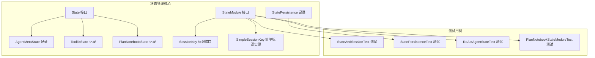
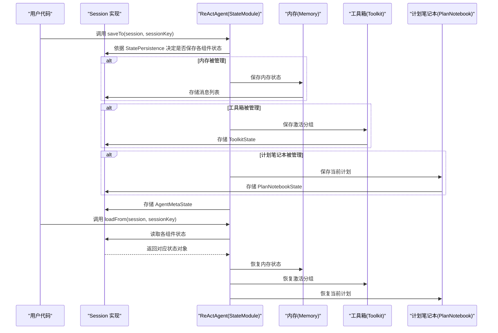
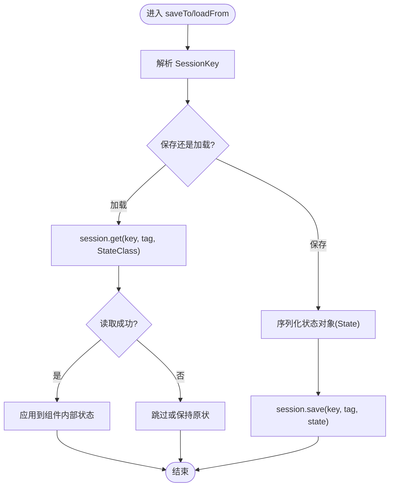
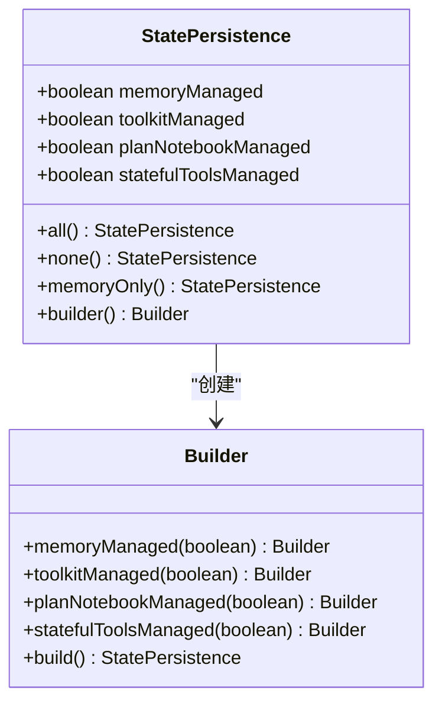
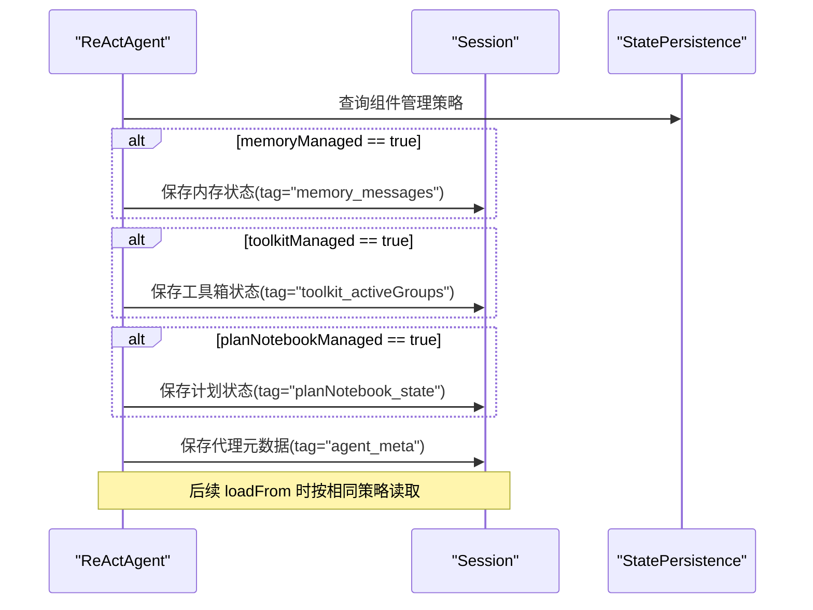
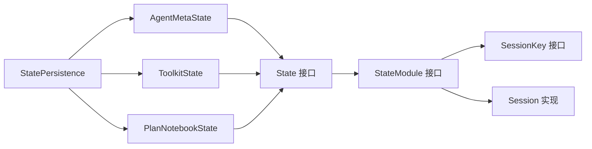

# 状态 API

<cite>
**本文引用的文件**
- [State.java](file://agentscope-core/src/main/java/io/agentscope/core/state/State.java)
- [StateModule.java](file://agentscope-core/src/main/java/io/agentscope/core/state/StateModule.java)
- [StatePersistence.java](file://agentscope-core/src/main/java/io/agentscope/core/state/StatePersistence.java)
- [AgentMetaState.java](file://agentscope-core/src/main/java/io/agentscope/core/state/AgentMetaState.java)
- [ToolkitState.java](file://agentscope-core/src/main/java/io/agentscope/core/state/ToolkitState.java)
- [PlanNotebookState.java](file://agentscope-core/src/main/java/io/agentscope/core/state/PlanNotebookState.java)
- [SessionKey.java](file://agentscope-core/src/main/java/io/agentscope/core/state/SessionKey.java)
- [SimpleSessionKey.java](file://agentscope-core/src/main/java/io/agentscope/core/state/SimpleSessionKey.java)
- [StateAndSessionTest.java](file://agentscope-core/src/test/java/io/agentscope/core/state/StateAndSessionTest.java)
- [StatePersistenceTest.java](file://agentscope-core/src/test/java/io/agentscope/core/state/StatePersistenceTest.java)
- [ReActAgentStateTest.java](file://agentscope-core/src/test/java/io/agentscope/core/agent/ReActAgentStateTest.java)
- [PlanNotebookStateModuleTest.java](file://agentscope-core/src/test/java/io/agentscope/core/plan/PlanNotebookStateModuleTest.java)
</cite>

## 目录
1. [简介](#简介)
2. [项目结构](#项目结构)
3. [核心组件](#核心组件)
4. [架构总览](#架构总览)
5. [详细组件分析](#详细组件分析)
6. [依赖分析](#依赖分析)
7. [性能考虑](#性能考虑)
8. [故障排查指南](#故障排查指南)
9. [结论](#结论)
10. [附录](#附录)

## 简介
本文件为 AgentScope Java 状态管理系统 API 的权威参考文档，聚焦以下目标：
- 深入解释 State 接口的设计理念与适用场景
- 详解 StateModule 的实现机制与使用模式
- 详述 StatePersistence 的配置项与状态序列化规则
- 提供 AgentMetaState、ToolkitState、PlanNotebookState 的 API 使用方法与最佳实践
- 完整说明状态持久化与恢复的流程
- 解释状态模块的注册与管理机制
- 基于仓库内测试用例，给出可直接对照的使用示例路径与建议

## 项目结构
状态管理相关代码位于 agentscope-core 模块的 state 包中，并配套有 SessionKey、SimpleSessionKey 用于会话标识；测试用例覆盖了 StateModule 的通用行为、ReActAgent 的状态集成、PlanNotebook 的状态模块实现以及 StatePersistence 的配置验证。

图表来源
- [State.java:18-47](file://agentscope-core/src/main/java/io/agentscope/core/state/State.java#L18-L47)
- [StateModule.java:20-120](file://agentscope-core/src/main/java/io/agentscope/core/state/StateModule.java#L20-L120)
- [StatePersistence.java:70-162](file://agentscope-core/src/main/java/io/agentscope/core/state/StatePersistence.java#L70-L162)
- [AgentMetaState.java:18-42](file://agentscope-core/src/main/java/io/agentscope/core/state/AgentMetaState.java#L18-L42)
- [ToolkitState.java:20-42](file://agentscope-core/src/main/java/io/agentscope/core/state/ToolkitState.java#L20-L42)
- [PlanNotebookState.java:18-44](file://agentscope-core/src/main/java/io/agentscope/core/state/PlanNotebookState.java#L18-L44)
- [SessionKey.java:20-62](file://agentscope-core/src/main/java/io/agentscope/core/state/SessionKey.java#L20-L62)
- [SimpleSessionKey.java:20-70](file://agentscope-core/src/main/java/io/agentscope/core/state/SimpleSessionKey.java#L20-L70)
- [StateAndSessionTest.java:38-280](file://agentscope-core/src/test/java/io/agentscope/core/state/StateAndSessionTest.java#L38-L280)
- [StatePersistenceTest.java:26-178](file://agentscope-core/src/test/java/io/agentscope/core/state/StatePersistenceTest.java#L26-L178)
- [ReActAgentStateTest.java:49-584](file://agentscope-core/src/test/java/io/agentscope/core/agent/ReActAgentStateTest.java#L49-L584)
- [PlanNotebookStateModuleTest.java:33-226](file://agentscope-core/src/test/java/io/agentscope/core/plan/PlanNotebookStateModuleTest.java#L33-L226)

章节来源
- [State.java:18-47](file://agentscope-core/src/main/java/io/agentscope/core/state/State.java#L18-L47)
- [StateModule.java:20-120](file://agentscope-core/src/main/java/io/agentscope/core/state/StateModule.java#L20-L120)
- [StatePersistence.java:70-162](file://agentscope-core/src/main/java/io/agentscope/core/state/StatePersistence.java#L70-L162)
- [AgentMetaState.java:18-42](file://agentscope-core/src/main/java/io/agentscope/core/state/AgentMetaState.java#L18-L42)
- [ToolkitState.java:20-42](file://agentscope-core/src/main/java/io/agentscope/core/state/ToolkitState.java#L20-L42)
- [PlanNotebookState.java:18-44](file://agentscope-core/src/main/java/io/agentscope/core/state/PlanNotebookState.java#L18-L44)
- [SessionKey.java:20-62](file://agentscope-core/src/main/java/io/agentscope/core/state/SessionKey.java#L20-L62)
- [SimpleSessionKey.java:20-70](file://agentscope-core/src/main/java/io/agentscope/core/state/SimpleSessionKey.java#L20-L70)

## 核心组件
- State 接口：标记可持久化的状态对象，推荐使用 Java Records 表达不可变状态；现有领域对象（如消息）可直接实现该接口以避免转换开销。
- StateModule 接口：为具备运行时状态的组件提供统一的保存/加载能力，支持基于 SessionKey 或字符串会话 ID 的操作，并提供“存在则加载”的便捷方法。
- StatePersistence 记录：用于控制 ReActAgent 对内存、工具箱、计划笔记本、有状态工具等组件的状态管理范围，提供静态工厂与构建器以灵活配置。
- AgentMetaState：封装代理元数据（ID、名称、描述、系统提示），用于跨会话恢复代理配置。
- ToolkitState：封装工具箱当前激活分组列表，作为状态持久化单元。
- PlanNotebookState：封装当前活动计划（含子任务），作为状态持久化单元。
- SessionKey 与 SimpleSessionKey：会话标识抽象与默认简单实现，支持自定义复杂标识结构（如多租户键）。

章节来源
- [State.java:18-47](file://agentscope-core/src/main/java/io/agentscope/core/state/State.java#L18-L47)
- [StateModule.java:20-120](file://agentscope-core/src/main/java/io/agentscope/core/state/StateModule.java#L20-L120)
- [StatePersistence.java:70-162](file://agentscope-core/src/main/java/io/agentscope/core/state/StatePersistence.java#L70-L162)
- [AgentMetaState.java:18-42](file://agentscope-core/src/main/java/io/agentscope/core/state/AgentMetaState.java#L18-L42)
- [ToolkitState.java:20-42](file://agentscope-core/src/main/java/io/agentscope/core/state/ToolkitState.java#L20-L42)
- [PlanNotebookState.java:18-44](file://agentscope-core/src/main/java/io/agentscope/core/state/PlanNotebookState.java#L18-L44)
- [SessionKey.java:20-62](file://agentscope-core/src/main/java/io/agentscope/core/state/SessionKey.java#L20-L62)
- [SimpleSessionKey.java:20-70](file://agentscope-core/src/main/java/io/agentscope/core/state/SimpleSessionKey.java#L20-L70)

## 架构总览
下图展示了 ReActAgent 及其子组件在状态管理中的交互关系，以及 StatePersistence 如何影响保存/加载范围。

图表来源
- [StateModule.java:46-120](file://agentscope-core/src/main/java/io/agentscope/core/state/StateModule.java#L46-L120)
- [StatePersistence.java:70-162](file://agentscope-core/src/main/java/io/agentscope/core/state/StatePersistence.java#L70-L162)
- [ReActAgentStateTest.java:64-584](file://agentscope-core/src/test/java/io/agentscope/core/agent/ReActAgentStateTest.java#L64-L584)

## 详细组件分析

### State 接口设计
- 设计要点
  - 作为“可持久化状态”的标记接口，不强制实现者承担序列化逻辑，但要求可被 Session 正确序列化与反序列化。
  - 推荐使用 Java Records 表达不可变状态，便于线程安全与跨进程传输。
  - 允许现有领域对象（如消息）直接实现该接口，减少转换成本。
- 使用建议
  - 将易变状态拆分为多个独立 State 记录，降低耦合度。
  - 对外暴露只读访问器，避免外部修改导致的并发问题。

章节来源
- [State.java:18-47](file://agentscope-core/src/main/java/io/agentscope/core/state/State.java#L18-L47)

### StateModule 接口机制
- 方法族
  - saveTo(Session, SessionKey/String)：保存状态到会话
  - loadFrom(Session, SessionKey/String)：从会话加载状态
  - loadIfExists(Session, SessionKey/String)：若会话存在则加载，返回布尔值
- 默认实现
  - 所有方法均为默认空实现，子类需按需覆盖以完成实际保存/加载逻辑。
- 会话键支持
  - 同时支持字符串与复杂 SessionKey 结构；默认字符串重载会将字符串包装为 SimpleSessionKey。
- 最佳实践
  - 在 saveTo 中按组件粒度调用 session.save(key, tag, state)，tag 应具有语义化且唯一性。
  - 在 loadFrom 中按相同 tag 顺序读取，确保状态恢复一致性。
  - 使用 loadIfExists 进行幂等加载，避免覆盖已有状态。

图表来源
- [StateModule.java:46-120](file://agentscope-core/src/main/java/io/agentscope/core/state/StateModule.java#L46-L120)
- [StateAndSessionTest.java:197-280](file://agentscope-core/src/test/java/io/agentscope/core/state/StateAndSessionTest.java#L197-L280)

章节来源
- [StateModule.java:46-120](file://agentscope-core/src/main/java/io/agentscope/core/state/StateModule.java#L46-L120)
- [StateAndSessionTest.java:197-280](file://agentscope-core/src/test/java/io/agentscope/core/state/StateAndSessionTest.java#L197-L280)

### StatePersistence 配置与序列化规则
- 组件管理范围
  - memoryManaged：是否管理内存组件状态
  - toolkitManaged：是否管理工具箱 activeGroups 状态
  - planNotebookManaged：是否管理计划笔记本状态
  - statefulToolsManaged：是否管理有状态工具的状态
- 配置方式
  - 静态工厂：all()/none()/memoryOnly()
  - 构建器：逐项开关，支持链式调用
- 序列化规则
  - ReActAgent 在 saveTo 时根据 StatePersistence 判断是否对各组件执行保存；loadFrom 时按相同策略恢复。
  - 各组件通过 StateModule 自身实现保存/加载，StatePersistence 仅决定“是否保存/加载”。

图表来源
- [StatePersistence.java:70-162](file://agentscope-core/src/main/java/io/agentscope/core/state/StatePersistence.java#L70-L162)

章节来源
- [StatePersistence.java:70-162](file://agentscope-core/src/main/java/io/agentscope/core/state/StatePersistence.java#L70-L162)
- [StatePersistenceTest.java:26-178](file://agentscope-core/src/test/java/io/agentscope/core/state/StatePersistenceTest.java#L26-L178)

### AgentMetaState API 使用
- 字段含义
  - id：代理唯一标识（由框架生成）
  - name：显示名称
  - description：用途描述
  - systemPrompt：系统提示词
- 使用场景
  - 保存代理元数据以便后续恢复
  - 与 ReActAgent 的 saveTo/loadFrom 协作
- 示例路径
  - 保存与加载示例参见：[ReActAgentStateTest.java:68-103](file://agentscope-core/src/test/java/io/agentscope/core/agent/ReActAgentStateTest.java#L68-L103)

章节来源
- [AgentMetaState.java:18-42](file://agentscope-core/src/main/java/io/agentscope/core/state/AgentMetaState.java#L18-L42)
- [ReActAgentStateTest.java:68-103](file://agentscope-core/src/test/java/io/agentscope/core/agent/ReActAgentStateTest.java#L68-L103)

### ToolkitState API 使用
- 字段含义
  - activeGroups：当前激活的工具分组名称列表
- 使用场景
  - 保存/恢复工具箱的激活分组配置
- 示例路径
  - 保存与加载示例参见：[ReActAgentStateTest.java:172-231](file://agentscope-core/src/test/java/io/agentscope/core/agent/ReActAgentStateTest.java#L172-L231)

章节来源
- [ToolkitState.java:20-42](file://agentscope-core/src/main/java/io/agentscope/core/state/ToolkitState.java#L20-L42)
- [ReActAgentStateTest.java:172-231](file://agentscope-core/src/test/java/io/agentscope/core/agent/ReActAgentStateTest.java#L172-L231)

### PlanNotebookState API 使用
- 字段含义
  - currentPlan：当前活动计划（可能为 null）
- 使用场景
  - 保存/恢复当前计划及其子任务状态
- 示例路径
  - 保存与加载示例参见：[ReActAgentStateTest.java:260-326](file://agentscope-core/src/test/java/io/agentscope/core/agent/ReActAgentStateTest.java#L260-L326)
  - PlanNotebook 自身的 StateModule 行为参见：[PlanNotebookStateModuleTest.java:46-120](file://agentscope-core/src/test/java/io/agentscope/core/plan/PlanNotebookStateModuleTest.java#L46-L120)

章节来源
- [PlanNotebookState.java:18-44](file://agentscope-core/src/main/java/io/agentscope/core/state/PlanNotebookState.java#L18-L44)
- [ReActAgentStateTest.java:260-326](file://agentscope-core/src/test/java/io/agentscope/core/agent/ReActAgentStateTest.java#L260-L326)
- [PlanNotebookStateModuleTest.java:46-120](file://agentscope-core/src/test/java/io/agentscope/core/plan/PlanNotebookStateModuleTest.java#L46-L120)

### 状态持久化与恢复流程
- 保存流程
  - ReActAgent.saveTo：根据 StatePersistence 决定是否保存内存、工具箱、计划笔记本与代理元数据
  - 各组件通过 StateModule.saveTo 将状态写入 Session（tag 语义化）
- 加载流程
  - ReActAgent.loadFrom：按相同顺序从 Session 读取并恢复各组件状态
  - 若 StatePersistence 关闭某组件，则该组件状态不会被保存/恢复
- 幂等加载
  - loadIfExists：先检查会话是否存在，存在则加载，否则保持原状

图表来源
- [StateModule.java:46-120](file://agentscope-core/src/main/java/io/agentscope/core/state/StateModule.java#L46-L120)
- [StatePersistence.java:70-162](file://agentscope-core/src/main/java/io/agentscope/core/state/StatePersistence.java#L70-L162)
- [ReActAgentStateTest.java:333-426](file://agentscope-core/src/test/java/io/agentscope/core/agent/ReActAgentStateTest.java#L333-L426)

章节来源
- [StateModule.java:46-120](file://agentscope-core/src/main/java/io/agentscope/core/state/StateModule.java#L46-L120)
- [StatePersistence.java:70-162](file://agentscope-core/src/main/java/io/agentscope/core/state/StatePersistence.java#L70-L162)
- [ReActAgentStateTest.java:333-426](file://agentscope-core/src/test/java/io/agentscope/core/agent/ReActAgentStateTest.java#L333-L426)

### 状态模块的注册与管理机制
- 注册方式
  - ReActAgent 通过构造注入的方式持有 Memory、Toolkit、PlanNotebook 等组件实例，这些组件本身实现 StateModule 或可被 ReActAgent 统一管理。
- 管理策略
  - StatePersistence 控制 ReActAgent 是否对各组件执行保存/加载；未被管理的组件由用户自行处理。
- 复杂会话键
  - SessionKey 支持自定义结构（如多租户键），SimpleSessionKey 为默认实现；Session 通过 toIdentifier 将键转为存储键。

章节来源
- [SessionKey.java:20-62](file://agentscope-core/src/main/java/io/agentscope/core/state/SessionKey.java#L20-L62)
- [SimpleSessionKey.java:20-70](file://agentscope-core/src/main/java/io/agentscope/core/state/SimpleSessionKey.java#L20-L70)
- [ReActAgentStateTest.java:1-584](file://agentscope-core/src/test/java/io/agentscope/core/agent/ReActAgentStateTest.java#L1-L584)

## 依赖分析
- 组件耦合
  - StateModule 依赖 Session 与 SessionKey；State 接口不引入额外依赖，利于扩展。
  - StatePersistence 与 ReActAgent 的状态管理策略强关联，但不直接依赖具体组件类型。
- 外部依赖
  - Session 实现（如 InMemorySession、JsonSession）负责序列化细节；State 接口对象应兼容所选 Session 的序列化能力。
- 循环依赖
  - 未发现循环依赖迹象；StateModule 为接口，ReActAgent 通过组合持有组件实例。

图表来源
- [StateModule.java:18-120](file://agentscope-core/src/main/java/io/agentscope/core/state/StateModule.java#L18-L120)
- [State.java:16-47](file://agentscope-core/src/main/java/io/agentscope/core/state/State.java#L16-L47)
- [AgentMetaState.java:16-42](file://agentscope-core/src/main/java/io/agentscope/core/state/AgentMetaState.java#L16-L42)
- [ToolkitState.java:16-42](file://agentscope-core/src/main/java/io/agentscope/core/state/ToolkitState.java#L16-L42)
- [PlanNotebookState.java:16-44](file://agentscope-core/src/main/java/io/agentscope/core/state/PlanNotebookState.java#L16-L44)
- [StatePersistence.java:70-162](file://agentscope-core/src/main/java/io/agentscope/core/state/StatePersistence.java#L70-L162)

章节来源
- [StateModule.java:18-120](file://agentscope-core/src/main/java/io/agentscope/core/state/StateModule.java#L18-L120)
- [State.java:16-47](file://agentscope-core/src/main/java/io/agentscope/core/state/State.java#L16-L47)
- [AgentMetaState.java:16-42](file://agentscope-core/src/main/java/io/agentscope/core/state/AgentMetaState.java#L16-L42)
- [ToolkitState.java:16-42](file://agentscope-core/src/main/java/io/agentscope/core/state/ToolkitState.java#L16-L42)
- [PlanNotebookState.java:16-44](file://agentscope-core/src/main/java/io/agentscope/core/state/PlanNotebookState.java#L16-L44)
- [StatePersistence.java:70-162](file://agentscope-core/src/main/java/io/agentscope/core/state/StatePersistence.java#L70-L162)

## 性能考虑
- 序列化开销
  - 使用不可变记录（Record）表达状态，有利于减少序列化体积与提升并发安全性。
  - 对大体量状态（如长对话历史）建议分片存储或增量保存，避免一次性序列化/反序列化大量数据。
- I/O 策略
  - 优先使用 JsonSession 等本地文件存储进行开发与测试；生产环境可结合分布式会话实现（如 Redis/MySQL 扩展）。
- 幂等性
  - 使用 loadIfExists 避免重复加载带来的无效 I/O；在高并发场景下建议配合会话层的锁或原子操作。

## 故障排查指南
- 无法加载状态
  - 检查 StatePersistence 是否关闭了对应组件的管理；确认 Session 中是否存在对应 tag 的数据。
  - 参考：[ReActAgentStateTest.java:138-166](file://agentscope-core/src/test/java/io/agentscope/core/agent/ReActAgentStateTest.java#L138-L166)
- 状态未更新
  - 确认保存后是否再次调用 saveTo；对于计划笔记本等可变更状态，需在修改后重新保存。
  - 参考：[PlanNotebookStateModuleTest.java:200-224](file://agentscope-core/src/test/java/io/agentscope/core/plan/PlanNotebookStateModuleTest.java#L200-L224)
- 会话键冲突
  - 使用自定义 SessionKey 时，确保 toIdentifier 的输出唯一且稳定；SimpleSessionKey 默认直接返回 sessionId。
  - 参考：[SessionKey.java:48-62](file://agentscope-core/src/main/java/io/agentscope/core/state/SessionKey.java#L48-L62)、[SimpleSessionKey.java:61-70](file://agentscope-core/src/main/java/io/agentscope/core/state/SimpleSessionKey.java#L61-L70)
- 配置错误
  - 使用 StatePersistence.builder() 逐步校验各组件开关；可通过静态工厂方法快速验证 all()/none()/memoryOnly()。
  - 参考：[StatePersistenceTest.java:26-178](file://agentscope-core/src/test/java/io/agentscope/core/state/StatePersistenceTest.java#L26-L178)

章节来源
- [ReActAgentStateTest.java:138-166](file://agentscope-core/src/test/java/io/agentscope/core/agent/ReActAgentStateTest.java#L138-L166)
- [PlanNotebookStateModuleTest.java:200-224](file://agentscope-core/src/test/java/io/agentscope/core/plan/PlanNotebookStateModuleTest.java#L200-L224)
- [SessionKey.java:48-62](file://agentscope-core/src/main/java/io/agentscope/core/state/SessionKey.java#L48-L62)
- [SimpleSessionKey.java:61-70](file://agentscope-core/src/main/java/io/agentscope/core/state/SimpleSessionKey.java#L61-L70)
- [StatePersistenceTest.java:26-178](file://agentscope-core/src/test/java/io/agentscope/core/state/StatePersistenceTest.java#L26-L178)

## 结论
AgentScope 的状态管理以 State 接口为核心，通过 StateModule 为组件提供统一的保存/加载能力，并以 StatePersistence 精准控制 ReActAgent 对各子组件状态的管理范围。配合 SessionKey 与 SimpleSessionKey，可在多租户与复杂场景下灵活组织会话标识。测试用例覆盖了典型使用路径，包括增量保存、跨组件恢复与配置开关验证，为生产落地提供了可靠参考。

## 附录
- 快速上手清单
  - 明确需要持久化的组件：内存、工具箱、计划笔记本、代理元数据
  - 选择合适的 StatePersistence 配置：all()/none()/memoryOnly() 或构建器
  - 为每个组件实现或复用 StateModule.saveTo/loadFrom
  - 使用语义化 tag 存储不同组件状态
  - 在加载前使用 loadIfExists 进行幂等加载
- 参考示例路径
  - 通用 StateModule 使用：[StateAndSessionTest.java:197-280](file://agentscope-core/src/test/java/io/agentscope/core/state/StateAndSessionTest.java#L197-L280)
  - ReActAgent 状态集成：[ReActAgentStateTest.java:64-584](file://agentscope-core/src/test/java/io/agentscope/core/agent/ReActAgentStateTest.java#L64-L584)
  - 计划笔记本状态模块：[PlanNotebookStateModuleTest.java:33-226](file://agentscope-core/src/test/java/io/agentscope/core/plan/PlanNotebookStateModuleTest.java#L33-L226)
  - 配置验证：[StatePersistenceTest.java:26-178](file://agentscope-core/src/test/java/io/agentscope/core/state/StatePersistenceTest.java#L26-L178)