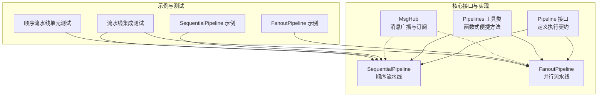
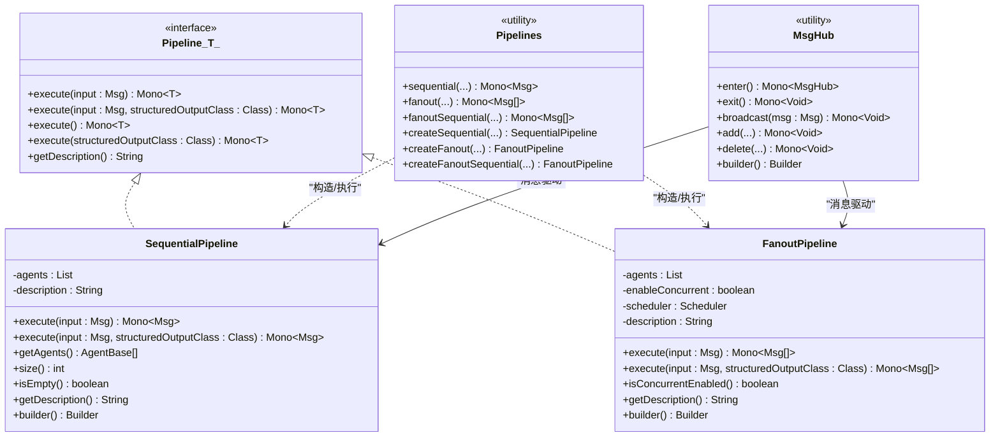
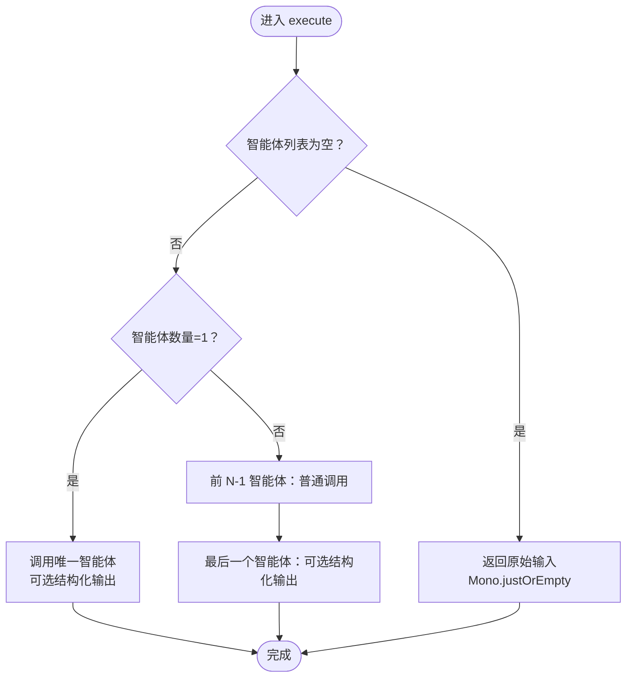
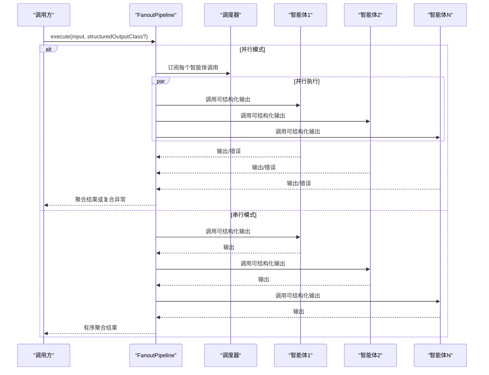
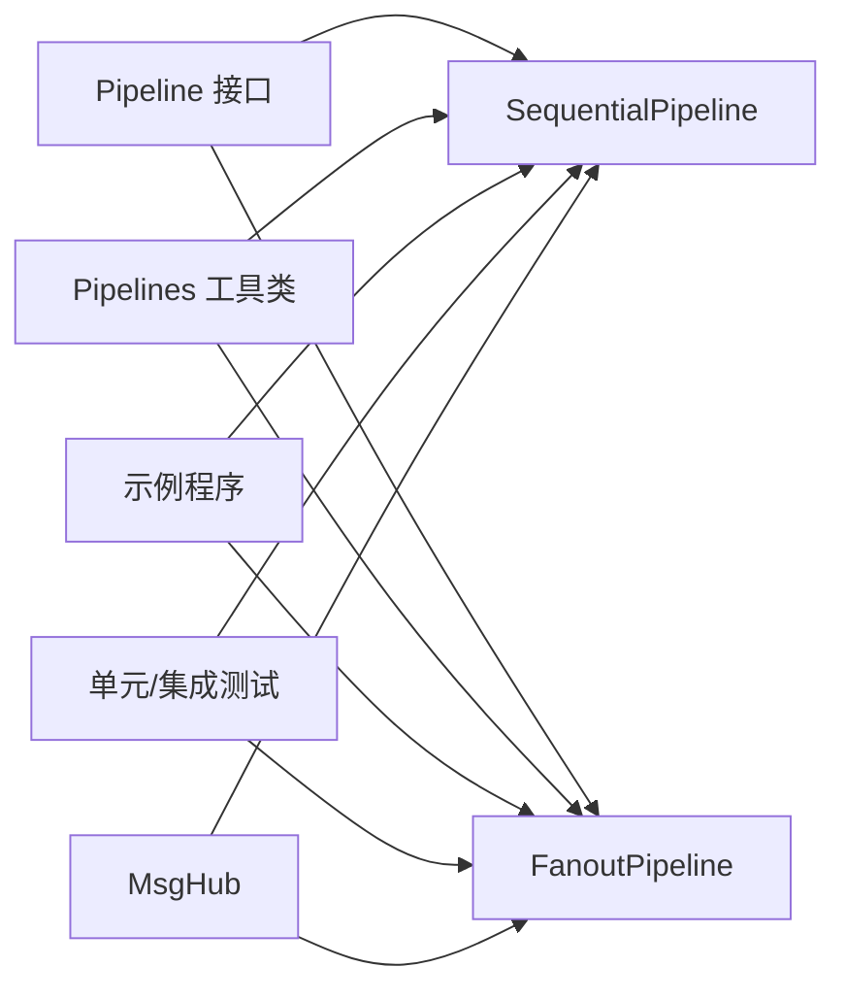

# Pipeline 接口

<cite>
**本文引用的文件**
- [Pipeline.java](file://agentscope-core/src/main/java/io/agentscope/core/pipeline/Pipeline.java)
- [SequentialPipeline.java](file://agentscope-core/src/main/java/io/agentscope/core/pipeline/SequentialPipeline.java)
- [FanoutPipeline.java](file://agentscope-core/src/main/java/io/agentscope/core/pipeline/FanoutPipeline.java)
- [Pipelines.java](file://agentscope-core/src/main/java/io/agentscope/core/pipeline/Pipelines.java)
- [MsgHub.java](file://agentscope-core/src/main/java/io/agentscope/core/pipeline/MsgHub.java)
- [SequentialPipelineTest.java](file://agentscope-core/src/test/java/io/agentscope/core/pipeline/SequentialPipelineTest.java)
- [PipelineIntegrationTest.java](file://agentscope-core/src/test/java/io/agentscope/core/pipeline/PipelineIntegrationTest.java)
- [SequentialPipelineExample.java](file://agentscope-examples/quickstart/src/main/java/io/agentscope/examples/quickstart/SequentialPipelineExample.java)
- [FanoutPipelineExample.java](file://agentscope-examples/quickstart/src/main/java/io/agentscope/examples/quickstart/FanoutPipelineExample.java)
</cite>

## 目录
1. [简介](#简介)
2. [项目结构](#项目结构)
3. [核心组件](#核心组件)
4. [架构总览](#架构总览)
5. [详细组件分析](#详细组件分析)
6. [依赖关系分析](#依赖关系分析)
7. [性能考量](#性能考量)
8. [故障排查指南](#故障排查指南)
9. [结论](#结论)
10. [附录](#附录)

## 简介
本文件为 AgentScope 中 Pipeline 接口的详细 API 参考与设计说明。Pipeline 接口用于在多智能体系统中编排与执行各类工作流，支持顺序（Sequential）与并行（Fanout）等模式，并通过 Reactor 的 Mono/Flux 提供响应式执行能力。本文将深入解析接口设计理念、核心方法签名、execute() 多种重载形式、泛型参数 T 的作用与约束、默认实现与最佳实践，并给出可直接参考的示例路径。

## 项目结构
与 Pipeline 相关的核心文件位于 agentscope-core 模块的 pipeline 包下，同时配套有工具类与示例应用：

图表来源
- [Pipeline.java:29-75](file://agentscope-core/src/main/java/io/agentscope/core/pipeline/Pipeline.java#L29-L75)
- [SequentialPipeline.java:39-185](file://agentscope-core/src/main/java/io/agentscope/core/pipeline/SequentialPipeline.java#L39-L185)
- [FanoutPipeline.java:49-457](file://agentscope-core/src/main/java/io/agentscope/core/pipeline/FanoutPipeline.java#L49-L457)
- [Pipelines.java:32-252](file://agentscope-core/src/main/java/io/agentscope/core/pipeline/Pipelines.java#L32-L252)
- [MsgHub.java:100-434](file://agentscope-core/src/main/java/io/agentscope/core/pipeline/MsgHub.java#L100-L434)
- [SequentialPipelineExample.java:33-194](file://agentscope-examples/quickstart/src/main/java/io/agentscope/examples/quickstart/SequentialPipelineExample.java#L33-L194)
- [FanoutPipelineExample.java:34-287](file://agentscope-examples/quickstart/src/main/java/io/agentscope/examples/quickstart/FanoutPipelineExample.java#L34-L287)
- [SequentialPipelineTest.java:43-185](file://agentscope-core/src/test/java/io/agentscope/core/pipeline/SequentialPipelineTest.java#L43-L185)
- [PipelineIntegrationTest.java:43-213](file://agentscope-core/src/test/java/io/agentscope/core/pipeline/PipelineIntegrationTest.java#L43-L213)

章节来源
- [Pipeline.java:21-75](file://agentscope-core/src/main/java/io/agentscope/core/pipeline/Pipeline.java#L21-L75)
- [SequentialPipeline.java:24-185](file://agentscope-core/src/main/java/io/agentscope/core/pipeline/SequentialPipeline.java#L24-L185)
- [FanoutPipeline.java:31-457](file://agentscope-core/src/main/java/io/agentscope/core/pipeline/FanoutPipeline.java#L31-L457)
- [Pipelines.java:23-252](file://agentscope-core/src/main/java/io/agentscope/core/pipeline/Pipelines.java#L23-L252)
- [MsgHub.java:32-434](file://agentscope-core/src/main/java/io/agentscope/core/pipeline/MsgHub.java#L32-L434)

## 核心组件
- Pipeline 接口：定义统一的执行契约，提供多种 execute() 重载与可选的描述信息。
- SequentialPipeline：顺序流水线，按序将前一智能体输出作为下一智能体输入。
- FanoutPipeline：并行流水线，将同一输入分发给多个智能体并行或串行执行，聚合结果。
- Pipelines 工具类：提供静态方法以函数式风格快速执行流水线，适合一次性场景；亦提供可复用的 create* 构造器。
- MsgHub：在一组智能体之间自动广播消息，简化多智能体对话与协作。

章节来源
- [Pipeline.java:29-75](file://agentscope-core/src/main/java/io/agentscope/core/pipeline/Pipeline.java#L29-L75)
- [SequentialPipeline.java:39-185](file://agentscope-core/src/main/java/io/agentscope/core/pipeline/SequentialPipeline.java#L39-L185)
- [FanoutPipeline.java:49-457](file://agentscope-core/src/main/java/io/agentscope/core/pipeline/FanoutPipeline.java#L49-L457)
- [Pipelines.java:32-252](file://agentscope-core/src/main/java/io/agentscope/core/pipeline/Pipelines.java#L32-L252)
- [MsgHub.java:32-434](file://agentscope-core/src/main/java/io/agentscope/core/pipeline/MsgHub.java#L32-L434)

## 架构总览
Pipeline 接口采用“接口 + 具体实现 + 工具类”的分层设计，既支持面向对象的可复用配置（如 SequentialPipeline.Builder），也支持函数式的一次性调用（Pipelines.*）。并行流水线还提供了并发/串行两种执行模式，并对异常进行聚合处理，保证部分失败不影响整体流程。

图表来源
- [Pipeline.java:29-75](file://agentscope-core/src/main/java/io/agentscope/core/pipeline/Pipeline.java#L29-L75)
- [SequentialPipeline.java:39-185](file://agentscope-core/src/main/java/io/agentscope/core/pipeline/SequentialPipeline.java#L39-L185)
- [FanoutPipeline.java:49-457](file://agentscope-core/src/main/java/io/agentscope/core/pipeline/FanoutPipeline.java#L49-L457)
- [Pipelines.java:32-252](file://agentscope-core/src/main/java/io/agentscope/core/pipeline/Pipelines.java#L32-L252)
- [MsgHub.java:100-434](file://agentscope-core/src/main/java/io/agentscope/core/pipeline/MsgHub.java#L100-L434)

## 详细组件分析

### Pipeline 接口详解
- 设计理念
  - 统一的执行入口：通过 execute() 的多种重载适配不同场景（有/无输入、是否结构化输出）。
  - 泛型参数 T：表示流水线最终返回值的类型，便于上层强类型处理。
  - 默认方法：提供无参 execute() 与带结构化输出的无参 execute()，内部委派到带参版本，减少重复实现。
  - 描述信息：默认返回实现类的简单名称，便于日志与可观测性展示。

- 核心方法签名
  - execute(Msg input)：带输入的消息执行，返回 Mono<T>。
  - execute(Msg input, Class<?> structuredOutputClass)：带输入与结构化输出类型的执行，返回 Mono<T>。
  - execute()：无输入执行，内部委派至 execute((Msg)null)。
  - execute(Class<?> structuredOutputClass)：无输入但带结构化输出，内部委派至 execute(null, structuredOutputClass)。
  - getDescription()：默认返回实现类简单名，可由子类覆盖以提供更丰富的描述。

- 泛型参数 T 的作用与约束
  - T 表示流水线最终结果的类型。例如：
    - SequentialPipeline 实现中，T=Msg，表示顺序流水线返回最终消息。
    - FanoutPipeline 实现中，T=List<Msg>，表示并行流水线返回所有智能体的结果列表。
  - 子类需确保 execute() 返回值与 T 一致，避免类型不匹配。

- 执行模型与错误传播
  - 基于 Reactor 的 Mono/Flux，支持非阻塞与背压。
  - 错误传播策略由具体实现决定（如 FanoutPipeline 对部分失败进行聚合）。

章节来源
- [Pipeline.java:29-75](file://agentscope-core/src/main/java/io/agentscope/core/pipeline/Pipeline.java#L29-L75)

### SequentialPipeline（顺序流水线）
- 功能特性
  - 链式调用：前一智能体输出作为下一智能体输入。
  - 结构化输出支持：单智能体时或最后智能体可启用结构化输出。
  - 边界处理：空智能体列表直接返回输入；单智能体时直接调用；多智能体时仅最后一个使用结构化输出。
  - 描述信息：基于智能体数量生成描述字符串。

- 关键实现要点
  - execute(Msg) 与 execute(Msg, Class) 的分支逻辑。
  - 使用 Mono.flatMap 进行链式调用，保持响应式语义。
  - Builder 模式提供流畅的构建体验。

图表来源
- [SequentialPipeline.java:54-94](file://agentscope-core/src/main/java/io/agentscope/core/pipeline/SequentialPipeline.java#L54-L94)

章节来源
- [SequentialPipeline.java:24-185](file://agentscope-core/src/main/java/io/agentscope/core/pipeline/SequentialPipeline.java#L24-L185)
- [SequentialPipelineTest.java:62-174](file://agentscope-core/src/test/java/io/agentscope/core/pipeline/SequentialPipelineTest.java#L62-L174)

### FanoutPipeline（并行流水线）
- 功能特性
  - 并行/串行两种执行模式：默认并行，使用 boundedElastic 调度器；也可选择串行。
  - 输入隔离：每个智能体接收独立的输入副本。
  - 结果聚合：将所有智能体输出收集为 List<Msg>。
  - 异常聚合：使用 CompositeAgentException 收集各智能体的失败信息，提升可观测性与可诊断性。
  - 流式事件：提供 stream() 方法，支持并发/串行事件合并或拼接。

- 关键实现要点
  - 并行执行：subscribeOn(scheduler) 实现跨线程执行；doOnError 记录 AgentExceptionInfo；onErrorResume 返回空 Mono 以继续其他智能体执行。
  - 串行执行：使用 Flux.concat 聚合，保证顺序与隔离。
  - 描述信息：包含智能体数量与执行模式。

图表来源
- [FanoutPipeline.java:104-189](file://agentscope-core/src/main/java/io/agentscope/core/pipeline/FanoutPipeline.java#L104-L189)

章节来源
- [FanoutPipeline.java:31-457](file://agentscope-core/src/main/java/io/agentscope/core/pipeline/FanoutPipeline.java#L31-L457)

### Pipelines 工具类
- 设计目的
  - 提供函数式风格的便捷执行方法，适合一次性、无状态的场景。
  - 同时提供 create* 方法以获得可复用的流水线实例。

- 主要方法族
  - sequential(...): 顺序执行，支持带/不带输入与结构化输出。
  - fanout(...)/fanoutSequential(...): 并行/串行执行，支持带/不带输入与结构化输出。
  - create*(): 构建可复用实例。

- 组合流水线
  - Pipelines 内部提供 ComposedSequentialPipeline，将两个顺序流水线组合为一个，仅第二阶段使用结构化输出。

章节来源
- [Pipelines.java:32-252](file://agentscope-core/src/main/java/io/agentscope/core/pipeline/Pipelines.java#L32-L252)

### MsgHub（消息中枢）
- 设计目标
  - 在一组智能体之间自动广播消息，简化多智能体对话与协作。
  - 支持动态加入/移除参与者、手动广播、公告消息、生命周期管理（try-with-resources）。

- 关键行为
  - enter()/exit()：初始化/清理订阅关系。
  - broadcast()：向所有参与者广播消息。
  - setAutoBroadcast()：开启/关闭自动广播。
  - Builder：提供流畅的配置方式。

章节来源
- [MsgHub.java:32-434](file://agentscope-core/src/main/java/io/agentscope/core/pipeline/MsgHub.java#L32-L434)

## 依赖关系分析
- 接口与实现
  - Pipeline 接口被 SequentialPipeline 与 FanoutPipeline 实现，二者分别对应不同的执行模式。
- 工具类与实现
  - Pipelines 将工具方法与具体实现解耦，既可直接使用便捷方法，也可复用流水线实例。
- 事件与流式支持
  - FanoutPipeline 提供 stream() 方法，结合 StreamOptions 与 Scheduler，支持事件级的并发/串行流式处理。
- 测试与示例
  - 单元测试验证顺序执行、错误传播、边界条件与 Builder 支持。
  - 集成测试验证复杂工作流、嵌套流水线与组合效果。
  - 示例程序展示真实业务场景下的顺序与并行流水线使用。

图表来源
- [Pipeline.java:29-75](file://agentscope-core/src/main/java/io/agentscope/core/pipeline/Pipeline.java#L29-L75)
- [SequentialPipeline.java:39-185](file://agentscope-core/src/main/java/io/agentscope/core/pipeline/SequentialPipeline.java#L39-L185)
- [FanoutPipeline.java:49-457](file://agentscope-core/src/main/java/io/agentscope/core/pipeline/FanoutPipeline.java#L49-L457)
- [Pipelines.java:32-252](file://agentscope-core/src/main/java/io/agentscope/core/pipeline/Pipelines.java#L32-L252)
- [MsgHub.java:100-434](file://agentscope-core/src/main/java/io/agentscope/core/pipeline/MsgHub.java#L100-L434)
- [SequentialPipelineTest.java:43-185](file://agentscope-core/src/test/java/io/agentscope/core/pipeline/SequentialPipelineTest.java#L43-L185)
- [PipelineIntegrationTest.java:43-213](file://agentscope-core/src/test/java/io/agentscope/core/pipeline/PipelineIntegrationTest.java#L43-L213)
- [SequentialPipelineExample.java:33-194](file://agentscope-examples/quickstart/src/main/java/io/agentscope/examples/quickstart/SequentialPipelineExample.java#L33-L194)
- [FanoutPipelineExample.java:34-287](file://agentscope-examples/quickstart/src/main/java/io/agentscope/examples/quickstart/FanoutPipelineExample.java#L34-L287)

## 性能考量
- 并行执行
  - FanoutPipeline 默认使用 boundedElastic 调度器，适合 I/O 密集型任务（如调用大模型 API）。
  - 并行模式可显著降低端到端延迟，但需考虑网络与服务端限流。
- 串行执行
  - 适用于需要严格顺序控制或资源受限的场景。
- 结构化输出
  - 仅在必要位置（通常是最后一个智能体）启用，减少不必要的格式化开销。
- 错误处理成本
  - 并行模式下聚合异常会引入额外的收集与包装成本，但能提供更完整的可观测性。

## 故障排查指南
- 常见问题
  - 执行无结果：检查输入是否为 null 或空；确认智能体列表是否为空；核对结构化输出类型是否正确传递。
  - 并行失败：关注 CompositeAgentException 的聚合信息，定位具体失败智能体。
  - 顺序中断：若中间智能体抛出异常，后续智能体不会执行；检查异常堆栈与日志。
- 定位手段
  - 使用 getDescription() 获取流水线描述，辅助日志识别。
  - 在测试与示例中观察调用次数与输出文本，验证执行链路。
- 建议
  - 在生产环境为并行流水线设置合理的超时与重试策略。
  - 对关键智能体增加钩子（Hook）以捕获中间状态与事件。

章节来源
- [FanoutPipeline.java:127-189](file://agentscope-core/src/main/java/io/agentscope/core/pipeline/FanoutPipeline.java#L127-L189)
- [SequentialPipelineTest.java:81-98](file://agentscope-core/src/test/java/io/agentscope/core/pipeline/SequentialPipelineTest.java#L81-L98)
- [PipelineIntegrationTest.java:60-161](file://agentscope-core/src/test/java/io/agentscope/core/pipeline/PipelineIntegrationTest.java#L60-L161)

## 结论
Pipeline 接口通过统一的执行契约与灵活的实现，为多智能体系统的编排提供了清晰而强大的基础。SequentialPipeline 与 FanoutPipeline 分别覆盖了顺序与并行两大典型场景，Pipelines 工具类则在便捷性与可复用性之间取得平衡。配合 MsgHub，可以进一步简化多智能体之间的消息协作。建议在实际项目中根据业务特征选择合适的执行模式，并结合结构化输出与事件流式能力，构建高可用、可观测的工作流。

## 附录

### execute() 方法重载一览
- execute(Msg input)
  - 用途：带输入的消息执行。
  - 返回：Mono<T>。
  - 适用：所有实现。
- execute(Msg input, Class<?> structuredOutputClass)
  - 用途：带输入与结构化输出类型的执行。
  - 返回：Mono<T>。
  - 适用：所有实现。
- execute()
  - 用途：无输入执行（默认委派至 execute((Msg)null)）。
  - 返回：Mono<T>。
  - 适用：所有实现。
- execute(Class<?> structuredOutputClass)
  - 用途：无输入但带结构化输出（默认委派至 execute(null, structuredOutputClass)）。
  - 返回：Mono<T>。
  - 适用：所有实现。

章节来源
- [Pipeline.java:31-65](file://agentscope-core/src/main/java/io/agentscope/core/pipeline/Pipeline.java#L31-L65)

### 泛型参数 T 的类型约束与示例
- SequentialPipeline
  - T=Msg：顺序流水线返回最终消息。
  - 示例参考：[SequentialPipelineExample.java:68-98](file://agentscope-examples/quickstart/src/main/java/io/agentscope/examples/quickstart/SequentialPipelineExample.java#L68-L98)
- FanoutPipeline
  - T=List<Msg>：并行流水线返回所有智能体的结果列表。
  - 示例参考：[FanoutPipelineExample.java:65-105](file://agentscope-examples/quickstart/src/main/java/io/agentscope/examples/quickstart/FanoutPipelineExample.java#L65-L105)

章节来源
- [SequentialPipeline.java:39-94](file://agentscope-core/src/main/java/io/agentscope/core/pipeline/SequentialPipeline.java#L39-L94)
- [FanoutPipeline.java:49-112](file://agentscope-core/src/main/java/io/agentscope/core/pipeline/FanoutPipeline.java#L49-L112)
- [SequentialPipelineExample.java:68-98](file://agentscope-examples/quickstart/src/main/java/io/agentscope/examples/quickstart/SequentialPipelineExample.java#L68-L98)
- [FanoutPipelineExample.java:65-105](file://agentscope-examples/quickstart/src/main/java/io/agentscope/examples/quickstart/FanoutPipelineExample.java#L65-L105)

### getDescription() 方法
- 作用：返回流水线的人类可读描述，默认实现返回实现类的简单名称。
- 自定义：可通过覆写 getDescription() 提供更丰富的描述信息（如智能体数量、执行模式等）。
- 示例参考：
  - 顺序流水线描述：[SequentialPipeline.java:123-126](file://agentscope-core/src/main/java/io/agentscope/core/pipeline/SequentialPipeline.java#L123-L126)
  - 并行流水线描述：[FanoutPipeline.java:227-230](file://agentscope-core/src/main/java/io/agentscope/core/pipeline/FanoutPipeline.java#L227-L230)
  - 组合流水线描述：[Pipelines.java:246-250](file://agentscope-core/src/main/java/io/agentscope/core/pipeline/Pipelines.java#L246-L250)

章节来源
- [Pipeline.java:67-74](file://agentscope-core/src/main/java/io/agentscope/core/pipeline/Pipeline.java#L67-L74)
- [SequentialPipeline.java:123-126](file://agentscope-core/src/main/java/io/agentscope/core/pipeline/SequentialPipeline.java#L123-L126)
- [FanoutPipeline.java:227-230](file://agentscope-core/src/main/java/io/agentscope/core/pipeline/FanoutPipeline.java#L227-L230)
- [Pipelines.java:246-250](file://agentscope-core/src/main/java/io/agentscope/core/pipeline/Pipelines.java#L246-L250)

### 最佳实践与扩展指南
- 选择执行模式
  - 顺序：强调确定性与资源控制。
  - 并行：强调吞吐与时延优化。
- 结构化输出
  - 仅在必要位置启用，避免过度格式化。
- 错误处理
  - 并行模式下利用聚合异常定位问题；顺序模式下及时中断并记录。
- 可观测性
  - 使用 getDescription() 提供上下文信息；结合事件流式 API 记录中间状态。
- 扩展点
  - 自定义流水线：实现 Pipeline<T> 接口，遵循 execute() 的契约与返回类型一致性。
  - 工具类扩展：在 Pipelines 中添加新的便捷方法族，保持与现有 API 的一致性。

章节来源
- [Pipeline.java:29-75](file://agentscope-core/src/main/java/io/agentscope/core/pipeline/Pipeline.java#L29-L75)
- [Pipelines.java:32-252](file://agentscope-core/src/main/java/io/agentscope/core/pipeline/Pipelines.java#L32-L252)

### 具体示例路径
- 顺序流水线示例
  - [SequentialPipelineExample.java:33-194](file://agentscope-examples/quickstart/src/main/java/io/agentscope/examples/quickstart/SequentialPipelineExample.java#L33-L194)
- 并行流水线示例
  - [FanoutPipelineExample.java:34-287](file://agentscope-examples/quickstart/src/main/java/io/agentscope/examples/quickstart/FanoutPipelineExample.java#L34-L287)
- 顺序流水线单元测试
  - [SequentialPipelineTest.java:43-185](file://agentscope-core/src/test/java/io/agentscope/core/pipeline/SequentialPipelineTest.java#L43-L185)
- 流水线集成测试
  - [PipelineIntegrationTest.java:43-213](file://agentscope-core/src/test/java/io/agentscope/core/pipeline/PipelineIntegrationTest.java#L43-L213)