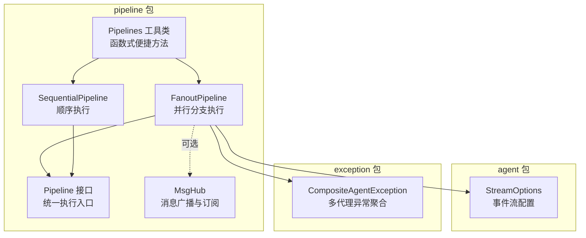
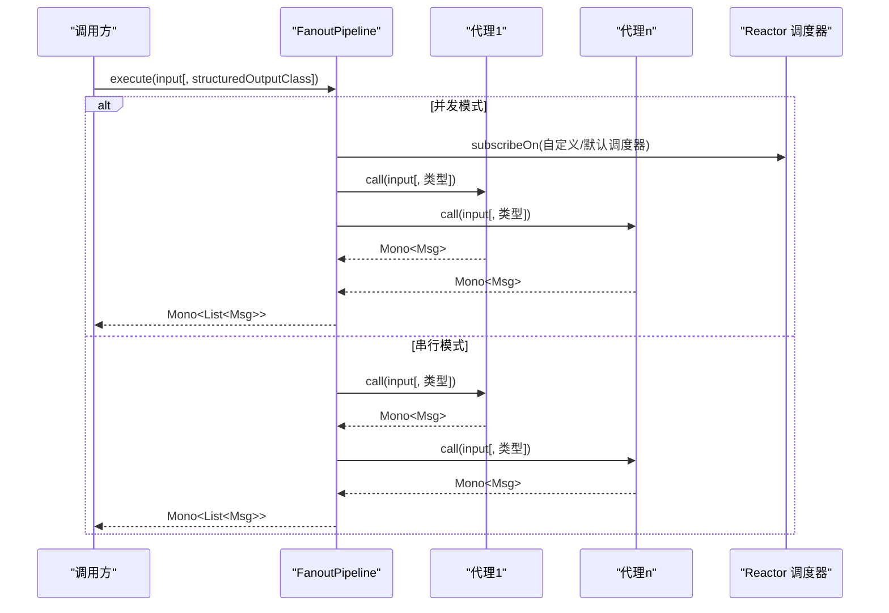
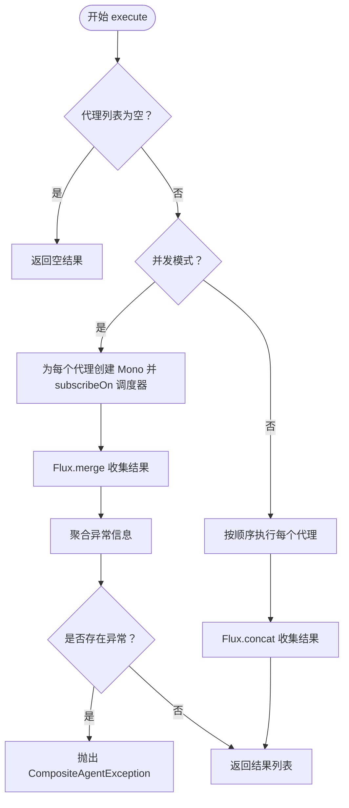
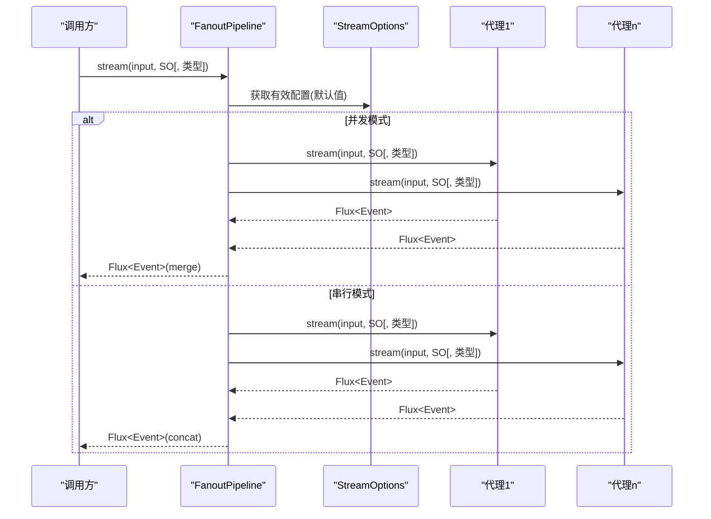
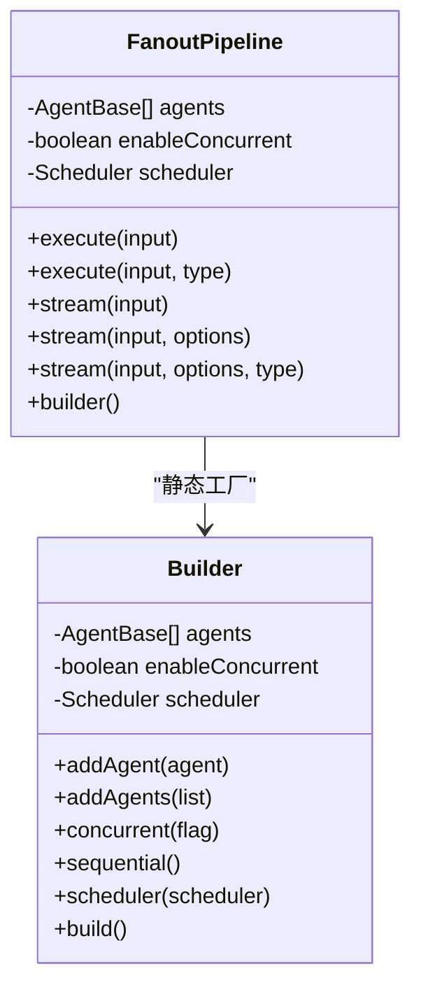
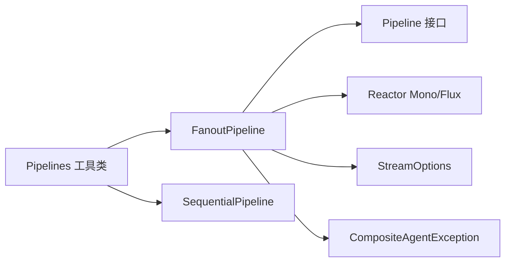

# 分支管道

<cite>
**本文引用的文件**
- [FanoutPipeline.java](file://agentscope-core/src/main/java/io/agentscope/core/pipeline/FanoutPipeline.java)
- [Pipeline.java](file://agentscope-core/src/main/java/io/agentscope/core/pipeline/Pipeline.java)
- [SequentialPipeline.java](file://agentscope-core/src/main/java/io/agentscope/core/pipeline/SequentialPipeline.java)
- [Pipelines.java](file://agentscope-core/src/main/java/io/agentscope/core/pipeline/Pipelines.java)
- [MsgHub.java](file://agentscope-core/src/main/java/io/agentscope/core/pipeline/MsgHub.java)
- [StreamOptions.java](file://agentscope-core/src/main/java/io/agentscope/core/agent/StreamOptions.java)
- [CompositeAgentException.java](file://agentscope-core/src/main/java/io/agentscope/core/exception/CompositeAgentException.java)
- [FanoutPipelineTest.java](file://agentscope-core/src/test/java/io/agentscope/core/pipeline/FanoutPipelineTest.java)
- [FanoutPipelineSchedulerTest.java](file://agentscope-core/src/test/java/io/agentscope/core/pipeline/FanoutPipelineSchedulerTest.java)
- [FanoutPipelineBuilderSchedulerTest.java](file://agentscope-core/src/test/java/io/agentscope/core/pipeline/FanoutPipelineBuilderSchedulerTest.java)
- [FanoutPipelineExample.java](file://agentscope-examples/quickstart/src/main/java/io/agentscope/examples/quickstart/FanoutPipelineExample.java)
</cite>

## 目录
1. [简介](#简介)
2. [项目结构](#项目结构)
3. [核心组件](#核心组件)
4. [架构总览](#架构总览)
5. [详细组件分析](#详细组件分析)
6. [依赖关系分析](#依赖关系分析)
7. [性能考量](#性能考量)
8. [故障排查指南](#故障排查指南)
9. [结论](#结论)
10. [附录](#附录)

## 简介
本文件面向 FanoutPipeline 分支管道，提供全面、系统且可操作的 API 文档与最佳实践指南。内容涵盖：
- 并行执行机制与分支策略
- 配置选项与调度器（Scheduler）使用
- 结果聚合与事件流式输出
- 构建与使用示例
- 并发控制与资源限制建议
- 性能调优与故障恢复实践

## 项目结构
与分支管道直接相关的模块位于 agentscope-core 的 pipeline 包中，并辅以通用的 Agent 事件流配置与异常聚合机制。

图示来源
- [FanoutPipeline.java:49-457](file://agentscope-core/src/main/java/io/agentscope/core/pipeline/FanoutPipeline.java#L49-L457)
- [Pipeline.java:29-75](file://agentscope-core/src/main/java/io/agentscope/core/pipeline/Pipeline.java#L29-L75)
- [SequentialPipeline.java:39-185](file://agentscope-core/src/main/java/io/agentscope/core/pipeline/SequentialPipeline.java#L39-L185)
- [Pipelines.java:32-252](file://agentscope-core/src/main/java/io/agentscope/core/pipeline/Pipelines.java#L32-L252)
- [MsgHub.java:100-434](file://agentscope-core/src/main/java/io/agentscope/core/pipeline/MsgHub.java#L100-L434)
- [StreamOptions.java:62-370](file://agentscope-core/src/main/java/io/agentscope/core/agent/StreamOptions.java#L62-L370)
- [CompositeAgentException.java:22-84](file://agentscope-core/src/main/java/io/agentscope/core/exception/CompositeAgentException.java#L22-L84)

章节来源
- [FanoutPipeline.java:49-457](file://agentscope-core/src/main/java/io/agentscope/core/pipeline/FanoutPipeline.java#L49-L457)
- [Pipelines.java:32-252](file://agentscope-core/src/main/java/io/agentscope/core/pipeline/Pipelines.java#L32-L252)

## 核心组件
- FanoutPipeline：实现“扇出”模式的并行执行，将同一输入分发给多个代理，支持并发或串行执行，收集所有结果并进行异常聚合。
- Pipeline 接口：定义统一的执行入口 execute(...)，支持带结构化输出类型的执行变体。
- Pipelines 工具类：提供一次性使用的函数式方法，便于快速构建顺序/分支管道。
- StreamOptions：控制事件流类型、增量/累积模式以及推理/总结等子事件的包含策略。
- CompositeAgentException：在多代理失败时聚合异常信息，保留每个代理的错误上下文。

章节来源
- [Pipeline.java:29-75](file://agentscope-core/src/main/java/io/agentscope/core/pipeline/Pipeline.java#L29-L75)
- [Pipelines.java:32-252](file://agentscope-core/src/main/java/io/agentscope/core/pipeline/Pipelines.java#L32-L252)
- [StreamOptions.java:62-370](file://agentscope-core/src/main/java/io/agentscope/core/agent/StreamOptions.java#L62-L370)
- [CompositeAgentException.java:22-84](file://agentscope-core/src/main/java/io/agentscope/core/exception/CompositeAgentException.java#L22-L84)

## 架构总览
FanoutPipeline 的执行路径分为两条主线：
- 同步执行（Mono<List<Msg>>）：按配置并发或串行调用各代理，收集结果列表；若出现异常，聚合后抛出复合异常。
- 流式执行（Flux<Event>）：按配置并发或串行发射事件流，支持通过 StreamOptions 过滤事件类型与增量模式。

图示来源
- [FanoutPipeline.java:104-189](file://agentscope-core/src/main/java/io/agentscope/core/pipeline/FanoutPipeline.java#L104-L189)

## 详细组件分析

### FanoutPipeline 并行执行机制与分支策略
- 输入分发：将同一 Msg 输入复制并分发给所有代理，确保输入隔离。
- 执行策略：
  - 并发：每个代理订阅到独立线程（默认 boundedElastic），实现真正的并行 I/O。
  - 串行：按添加顺序依次执行，前一个代理输出作为下一个代理输入（此处为独立输入，但顺序固定）。
- 结果聚合：并发模式下使用 Flux.merge 收集结果；串行模式使用 Flux.concat。
- 异常处理：捕获每个代理的异常并记录，最终以 CompositeAgentException 抛出，保留每个代理的 agentId/name/Throwable 信息。

图示来源
- [FanoutPipeline.java:104-189](file://agentscope-core/src/main/java/io/agentscope/core/pipeline/FanoutPipeline.java#L104-L189)
- [CompositeAgentException.java:22-84](file://agentscope-core/src/main/java/io/agentscope/core/exception/CompositeAgentException.java#L22-L84)

章节来源
- [FanoutPipeline.java:104-189](file://agentscope-core/src/main/java/io/agentscope/core/pipeline/FanoutPipeline.java#L104-L189)
- [FanoutPipelineTest.java:68-176](file://agentscope-core/src/test/java/io/agentscope/core/pipeline/FanoutPipelineTest.java#L68-L176)

### 流式执行与事件过滤
- 并发流式：每个代理的事件流通过 subscribeOn 调度器并行发射，使用 Flux.merge 合并为单一事件流。
- 串行流式：按顺序连接各代理的事件流，保证事件到达顺序。
- 事件过滤：通过 StreamOptions 控制事件类型集合、增量/累积模式，以及推理/总结等子事件的包含策略。

图示来源
- [FanoutPipeline.java:257-355](file://agentscope-core/src/main/java/io/agentscope/core/pipeline/FanoutPipeline.java#L257-L355)
- [StreamOptions.java:127-370](file://agentscope-core/src/main/java/io/agentscope/core/agent/StreamOptions.java#L127-L370)

章节来源
- [FanoutPipeline.java:257-355](file://agentscope-core/src/main/java/io/agentscope/core/pipeline/FanoutPipeline.java#L257-L355)
- [FanoutPipelineTest.java:223-436](file://agentscope-core/src/test/java/io/agentscope/core/pipeline/FanoutPipelineTest.java#L223-L436)

### 配置选项与调度器（Scheduler）
- 默认调度器：未显式传入时使用 Schedulers.boundedElastic()，适合 I/O 密集型并行。
- 自定义调度器：可通过构造函数或 Builder 注入，用于隔离线程池、虚拟时钟测试等场景。
- 串行模式下的调度器行为：不参与实际执行订阅，但仍可作为占位配置。

图示来源
- [FanoutPipeline.java:73-457](file://agentscope-core/src/main/java/io/agentscope/core/pipeline/FanoutPipeline.java#L73-L457)

章节来源
- [FanoutPipeline.java:73-88](file://agentscope-core/src/main/java/io/agentscope/core/pipeline/FanoutPipeline.java#L73-L88)
- [FanoutPipelineSchedulerTest.java:68-149](file://agentscope-core/src/test/java/io/agentscope/core/pipeline/FanoutPipelineSchedulerTest.java#L68-L149)
- [FanoutPipelineBuilderSchedulerTest.java:67-234](file://agentscope-core/src/test/java/io/agentscope/core/pipeline/FanoutPipelineBuilderSchedulerTest.java#L67-L234)

### 结果聚合与合并机制
- 并发：Flux.merge 将多个 Mono<Msg> 合并为 Flux<Msg>，再 collectList() 得到 List<Msg>。
- 串行：Flux.concat 将多个 Mono<Msg> 连接为 Flux<Msg>，保持代理添加顺序。
- 异常聚合：使用 CompositeAgentException 记录每个代理的 agentId/name/Throwable，最终统一抛出。

章节来源
- [FanoutPipeline.java:127-189](file://agentscope-core/src/main/java/io/agentscope/core/pipeline/FanoutPipeline.java#L127-L189)
- [CompositeAgentException.java:22-84](file://agentscope-core/src/main/java/io/agentscope/core/exception/CompositeAgentException.java#L22-L84)

### 构建与使用示例
- 快速开始示例：展示如何使用 FanoutPipeline.builder() 添加多个专家代理，分别对比并发与串行两种执行模式，并输出性能对比。
- 函数式便捷方法：Pipelines 提供 fanout/sequential/fanoutSequential 等静态方法，适合一次性任务。

章节来源
- [FanoutPipelineExample.java:64-126](file://agentscope-examples/quickstart/src/main/java/io/agentscope/examples/quickstart/FanoutPipelineExample.java#L64-L126)
- [Pipelines.java:86-210](file://agentscope-core/src/main/java/io/agentscope/core/pipeline/Pipelines.java#L86-L210)

## 依赖关系分析
- FanoutPipeline 实现 Pipeline 接口，统一了执行入口。
- 与 Reactor 的集成体现在 Mono/Flux 的使用与 subscribeOn 调度器绑定。
- 与 StreamOptions 的耦合体现在流式执行的事件过滤与增量模式控制。
- 与 CompositeAgentException 的耦合体现在异常聚合与传播。

图示来源
- [FanoutPipeline.java:49-457](file://agentscope-core/src/main/java/io/agentscope/core/pipeline/FanoutPipeline.java#L49-L457)
- [Pipeline.java:29-75](file://agentscope-core/src/main/java/io/agentscope/core/pipeline/Pipeline.java#L29-L75)
- [Pipelines.java:32-252](file://agentscope-core/src/main/java/io/agentscope/core/pipeline/Pipelines.java#L32-L252)
- [StreamOptions.java:62-370](file://agentscope-core/src/main/java/io/agentscope/core/agent/StreamOptions.java#L62-L370)
- [CompositeAgentException.java:22-84](file://agentscope-core/src/main/java/io/agentscope/core/exception/CompositeAgentException.java#L22-L84)

## 性能考量
- 并发优势：I/O 密集型任务（如调用外部模型 API）可显著缩短总耗时。
- 资源控制：
  - 使用自定义 Scheduler 限制并发线程数（如 Schedulers.newParallel 或自定义线程池）。
  - 对于 CPU 密集型任务，谨慎启用并发，避免线程争用。
- 调度器选择：
  - 默认 boundedElastic 适合 I/O 密集。
  - 测试场景可用 VirtualTimeScheduler。
- 结果聚合成本：大量代理时，合并与异常收集会带来额外开销，需结合业务需求评估。

## 故障排查指南
- 多代理异常聚合：当部分代理失败时，整体以 CompositeAgentException 抛出，包含每个代理的 agentId/name/Throwable 信息，便于定位问题。
- 单代理失败：并发模式下任一代理异常即触发聚合异常；串行模式下异常会阻断后续代理执行。
- 事件流异常：并发流式执行在 onComplete 时检查是否有错误并抛出复合异常。
- 空代理列表：并发/流式均返回空结果或空流，避免空指针。
- 调度器问题：确认是否正确注入自定义调度器，串行模式不会使用自定义调度器进行订阅。

章节来源
- [FanoutPipelineTest.java:125-176](file://agentscope-core/src/test/java/io/agentscope/core/pipeline/FanoutPipelineTest.java#L125-L176)
- [FanoutPipelineTest.java:421-436](file://agentscope-core/src/test/java/io/agentscope/core/pipeline/FanoutPipelineTest.java#L421-L436)
- [FanoutPipelineSchedulerTest.java:103-126](file://agentscope-core/src/test/java/io/agentscope/core/pipeline/FanoutPipelineSchedulerTest.java#L103-L126)
- [FanoutPipelineBuilderSchedulerTest.java:107-135](file://agentscope-core/src/test/java/io/agentscope/core/pipeline/FanoutPipelineBuilderSchedulerTest.java#L107-L135)

## 结论
FanoutPipeline 通过“扇出”模式将同一输入分发至多个代理，支持并发与串行两种执行策略，并提供统一的结果聚合与事件流能力。借助自定义调度器与 StreamOptions，可在不同场景下灵活控制并发度、事件粒度与资源占用。配合 CompositeAgentException 的异常聚合，能够快速定位问题并保障系统的可观测性与稳定性。

## 附录

### API 概览（方法与用途）
- execute(Msg input)：同步执行，返回 List<Msg>。
- execute(Msg input, Class<?> structuredOutputClass)：支持结构化输出类型。
- stream(Msg input)：并发/串行事件流，合并/连接各代理事件。
- stream(Msg input, StreamOptions options)：按配置过滤事件类型与增量模式。
- stream(Msg input, StreamOptions options, Class<?> structuredOutputClass)：支持结构化输出的事件流。
- builder()：构建器，支持 addAgent/addAgents/concurrent/sequential/scheduler/build。

章节来源
- [FanoutPipeline.java:99-355](file://agentscope-core/src/main/java/io/agentscope/core/pipeline/FanoutPipeline.java#L99-L355)
- [Pipelines.java:86-210](file://agentscope-core/src/main/java/io/agentscope/core/pipeline/Pipelines.java#L86-L210)

### 最佳实践清单
- 并发优先：I/O 密集任务优先使用并发模式。
- 调度器隔离：为不同业务域配置独立线程池，避免相互影响。
- 事件过滤：仅订阅必要事件类型，减少网络与内存压力。
- 异常处理：利用 CompositeAgentException 定位具体代理，必要时对个别代理降级重试。
- 资源限制：根据下游服务限流与延迟特性设置合理的并发度与超时时间。
- 测试验证：使用自定义调度器与虚拟时钟验证并发与串行行为。