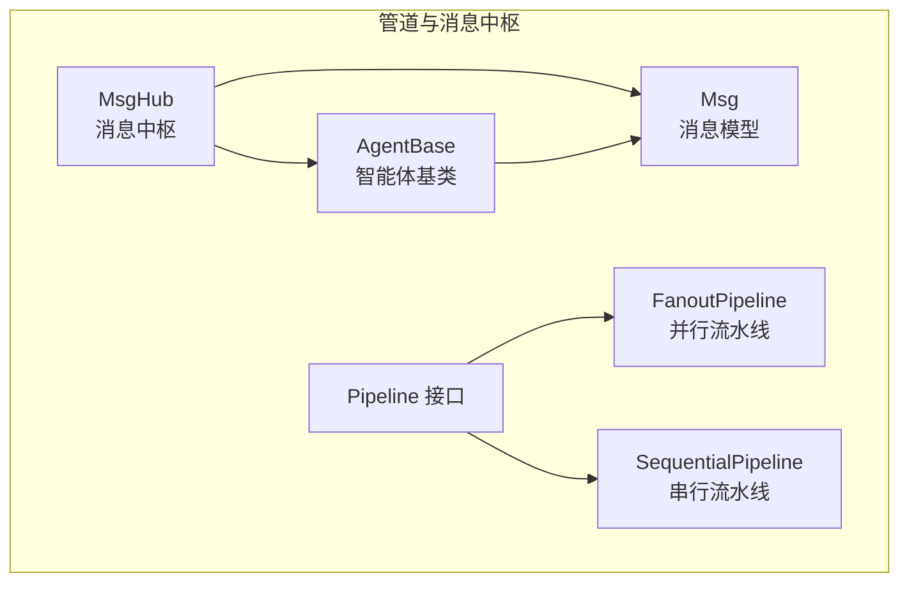
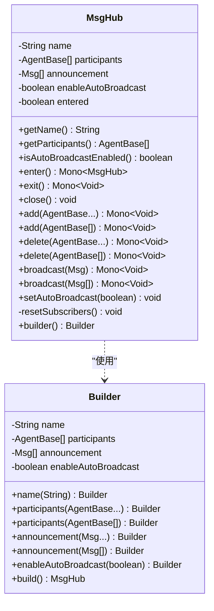
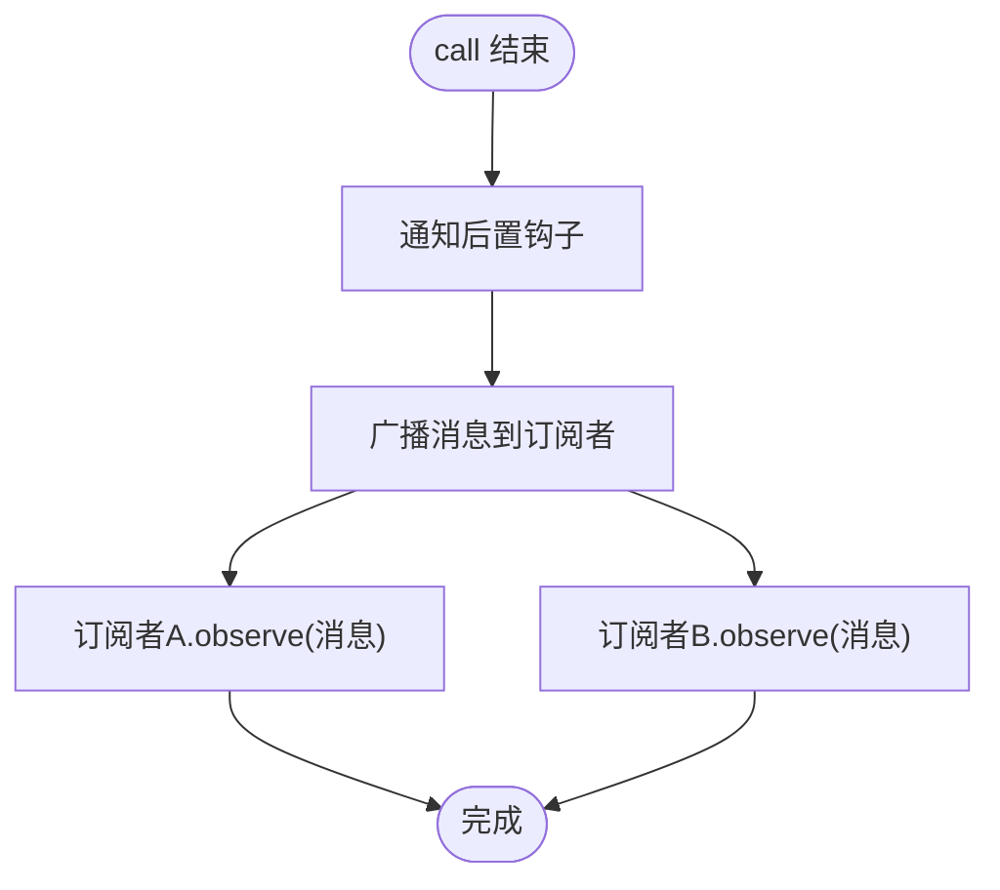
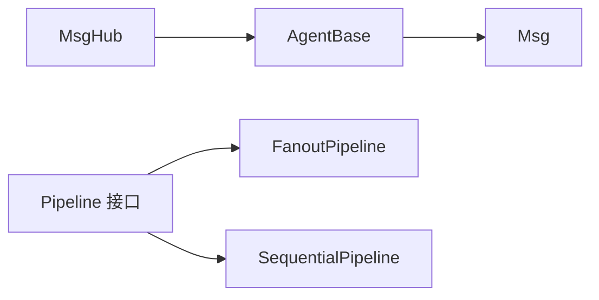

# 消息中枢

<cite>
**本文引用的文件**
- [MsgHub.java](file://agentscope-core/src/main/java/io/agentscope/core/pipeline/MsgHub.java)
- [AgentBase.java](file://agentscope-core/src/main/java/io/agentscope/core/agent/AgentBase.java)
- [Msg.java](file://agentscope-core/src/main/java/io/agentscope/core/message/Msg.java)
- [Pipeline.java](file://agentscope-core/src/main/java/io/agentscope/core/pipeline/Pipeline.java)
- [FanoutPipeline.java](file://agentscope-core/src/main/java/io/agentscope/core/pipeline/FanoutPipeline.java)
- [SequentialPipeline.java](file://agentscope-core/src/main/java/io/agentscope/core/pipeline/SequentialPipeline.java)
- [MsgHubTest.java](file://agentscope-core/src/test/java/io/agentscope/core/pipeline/MsgHubTest.java)
- [MsgHubIntegrationTest.java](file://agentscope-core/src/test/java/io/agentscope/core/pipeline/MsgHubIntegrationTest.java)
- [msghub.md](file://docs/en/task/msghub.md)
- [msghub.md（中文）](file://docs/zh/task/msghub.md)
</cite>

## 目录
1. [简介](#简介)
2. [项目结构](#项目结构)
3. [核心组件](#核心组件)
4. [架构总览](#架构总览)
5. [详细组件分析](#详细组件分析)
6. [依赖分析](#依赖分析)
7. [性能考虑](#性能考虑)
8. [故障排查指南](#故障排查指南)
9. [结论](#结论)
10. [附录](#附录)

## 简介
MsgHub 是 AgentScope 多智能体对话中的消息广播中心，负责在一组智能体之间自动分发消息，消除手动消息传递的复杂性与错误风险。其核心能力包括：
- 自动广播：任一参与者的消息自动广播至其余所有参与者
- 动态参与者：可在对话过程中增删智能体
- 公告消息：进入 Hub 时可一次性广播初始消息
- 手动广播：在需要时手动控制消息分发
- 生命周期管理：通过 try-with-resources 自动清理订阅关系

## 项目结构
与消息中枢相关的核心模块位于 agentscope-core 的 pipeline 包与 agent 包中，并配套有消息模型与管道执行框架。



图示来源
- [MsgHub.java:100-435](file://agentscope-core/src/main/java/io/agentscope/core/pipeline/MsgHub.java#L100-L435)
- [AgentBase.java:93-954](file://agentscope-core/src/main/java/io/agentscope/core/agent/AgentBase.java#L93-L954)
- [Msg.java:52-656](file://agentscope-core/src/main/java/io/agentscope/core/message/Msg.java#L52-L656)
- [Pipeline.java:29-76](file://agentscope-core/src/main/java/io/agentscope/core/pipeline/Pipeline.java#L29-L76)
- [FanoutPipeline.java:49-458](file://agentscope-core/src/main/java/io/agentscope/core/pipeline/FanoutPipeline.java#L49-L458)
- [SequentialPipeline.java:39-186](file://agentscope-core/src/main/java/io/agentscope/core/pipeline/SequentialPipeline.java#L39-L186)

章节来源
- [MsgHub.java:100-435](file://agentscope-core/src/main/java/io/agentscope/core/pipeline/MsgHub.java#L100-L435)
- [AgentBase.java:93-954](file://agentscope-core/src/main/java/io/agentscope/core/agent/AgentBase.java#L93-L954)
- [Msg.java:52-656](file://agentscope-core/src/main/java/io/agentscope/core/message/Msg.java#L52-L656)
- [Pipeline.java:29-76](file://agentscope-core/src/main/java/io/agentscope/core/pipeline/Pipeline.java#L29-L76)
- [FanoutPipeline.java:49-458](file://agentscope-core/src/main/java/io/agentscope/core/pipeline/FanoutPipeline.java#L49-L458)
- [SequentialPipeline.java:39-186](file://agentscope-core/src/main/java/io/agentscope/core/pipeline/SequentialPipeline.java#L39-L186)

## 核心组件
- MsgHub：消息中枢，负责参与者管理、自动/手动广播、生命周期管理与订阅关系维护
- AgentBase：智能体基类，提供 observe/doObserve、订阅管理、自动广播钩子等能力
- Msg：消息模型，承载角色、内容块、元数据与时间戳等
- Pipeline/FanoutPipeline/SequentialPipeline：管道执行框架，支持并行/串行执行与事件流

章节来源
- [MsgHub.java:100-435](file://agentscope-core/src/main/java/io/agentscope/core/pipeline/MsgHub.java#L100-L435)
- [AgentBase.java:93-954](file://agentscope-core/src/main/java/io/agentscope/core/agent/AgentBase.java#L93-L954)
- [Msg.java:52-656](file://agentscope-core/src/main/java/io/agentscope/core/message/Msg.java#L52-L656)
- [Pipeline.java:29-76](file://agentscope-core/src/main/java/io/agentscope/core/pipeline/Pipeline.java#L29-L76)
- [FanoutPipeline.java:49-458](file://agentscope-core/src/main/java/io/agentscope/core/pipeline/FanoutPipeline.java#L49-L458)
- [SequentialPipeline.java:39-186](file://agentscope-core/src/main/java/io/agentscope/core/pipeline/SequentialPipeline.java#L39-L186)

## 架构总览
MsgHub 通过“进入 Hub → 订阅建立 → 消息广播/观察 → 退出清理”的生命周期，实现多智能体间的透明通信。自动广播模式下，每个智能体在 post-call 钩子阶段会将其最终消息广播给所有订阅者；手动广播模式下，可通过 hub.broadcast 显式分发消息。

```mermaid
sequenceDiagram
participant U as "用户"
participant H as "MsgHub"
participant A as "智能体A"
participant B as "智能体B"
U->>H : "enter()"
H->>A : "resetSubscribers(...)"
H->>B : "resetSubscribers(...)"
Note over H,A,B : "订阅关系建立"
U->>A : "call()"
A-->>U : "返回消息"
A->>A : "通知后置钩子"
A->>B : "observe(消息)"
A->>B : "observe(消息)"
U->>H : "broadcast(消息)"
H->>B : "observe(消息)"
H->>A : "observe(消息)"
U->>H : "exit()"
H->>A : "removeSubscribers(...)"
H->>B : "removeSubscribers(...)"
```

图示来源
- [MsgHub.java:158-193](file://agentscope-core/src/main/java/io/agentscope/core/pipeline/MsgHub.java#L158-L193)
- [AgentBase.java:729-814](file://agentscope-core/src/main/java/io/agentscope/core/agent/AgentBase.java#L729-L814)

章节来源
- [MsgHub.java:158-193](file://agentscope-core/src/main/java/io/agentscope/core/pipeline/MsgHub.java#L158-L193)
- [AgentBase.java:729-814](file://agentscope-core/src/main/java/io/agentscope/core/agent/AgentBase.java#L729-L814)

## 详细组件分析

### 组件一：MsgHub（消息中枢）
- 职责
  - 维护参与者列表（线程安全）
  - 在 enter() 时建立订阅关系并广播公告
  - 提供 add/delete 动态参与者管理
  - 提供 broadcast/broadcast(List) 手动广播
  - 支持 setAutoBroadcast 切换自动广播
  - 生命周期管理：enter/exit/close
- 关键流程
  - enter：重置订阅关系，按需广播公告
  - exit：清理订阅关系
  - resetSubscribers：为每个参与者设置其余参与者的订阅列表
  - broadcast：对所有参与者调用 observe



图示来源
- [MsgHub.java:100-435](file://agentscope-core/src/main/java/io/agentscope/core/pipeline/MsgHub.java#L100-L435)

章节来源
- [MsgHub.java:100-435](file://agentscope-core/src/main/java/io/agentscope/core/pipeline/MsgHub.java#L100-L435)

### 组件二：AgentBase（智能体基类）
- 职责
  - 提供 observe/doObserve 观察接口
  - 维护 hubSubscribers 映射（按 HubId 分组）
  - 在 post-call 钩子后自动广播消息到订阅者
  - 提供 resetSubscribers/removeSubscribers 管理订阅关系
- 关键流程
  - notifyPostCall：触发后置钩子并广播消息
  - broadcastToSubscribers：遍历订阅者并调用 observe



图示来源
- [AgentBase.java:729-814](file://agentscope-core/src/main/java/io/agentscope/core/agent/AgentBase.java#L729-L814)

章节来源
- [AgentBase.java:729-814](file://agentscope-core/src/main/java/io/agentscope/core/agent/AgentBase.java#L729-L814)

### 组件三：消息模型 Msg
- 职责
  - 表达一次对话或交互中的消息单元
  - 支持文本、图像、工具调用/结果等内容块
  - 提供结构化输出、用量统计、生成原因等元数据访问
- 关键点
  - 内容块不可变列表，线程安全
  - 元数据键常量便于统一访问

章节来源
- [Msg.java:52-656](file://agentscope-core/src/main/java/io/agentscope/core/message/Msg.java#L52-L656)

### 组件四：管道系统（与 MsgHub 的集成）
- FanoutPipeline：并行/串行执行多个智能体，适合广播式多路分支场景
- SequentialPipeline：顺序执行，适合链式处理
- 与 MsgHub 的关系
  - 可在管道外部使用 MsgHub 进行广播
  - 可在管道内部结合自动广播实现更复杂的编排

章节来源
- [FanoutPipeline.java:49-458](file://agentscope-core/src/main/java/io/agentscope/core/pipeline/FanoutPipeline.java#L49-L458)
- [SequentialPipeline.java:39-186](file://agentscope-core/src/main/java/io/agentscope/core/pipeline/SequentialPipeline.java#L39-L186)
- [Pipeline.java:29-76](file://agentscope-core/src/main/java/io/agentscope/core/pipeline/Pipeline.java#L29-L76)

## 依赖分析
- MsgHub 依赖 AgentBase 的订阅管理与 observe 能力
- AgentBase 依赖 Msg 模型以承载消息内容与元数据
- 管道系统（Fanout/Sequential）与 MsgHub 解耦，可通过 MsgHub 实现广播式编排



图示来源
- [MsgHub.java:100-435](file://agentscope-core/src/main/java/io/agentscope/core/pipeline/MsgHub.java#L100-L435)
- [AgentBase.java:93-954](file://agentscope-core/src/main/java/io/agentscope/core/agent/AgentBase.java#L93-L954)
- [Msg.java:52-656](file://agentscope-core/src/main/java/io/agentscope/core/message/Msg.java#L52-L656)
- [Pipeline.java:29-76](file://agentscope-core/src/main/java/io/agentscope/core/pipeline/Pipeline.java#L29-L76)
- [FanoutPipeline.java:49-458](file://agentscope-core/src/main/java/io/agentscope/core/pipeline/FanoutPipeline.java#L49-L458)
- [SequentialPipeline.java:39-186](file://agentscope-core/src/main/java/io/agentscope/core/pipeline/SequentialPipeline.java#L39-L186)

章节来源
- [MsgHub.java:100-435](file://agentscope-core/src/main/java/io/agentscope/core/pipeline/MsgHub.java#L100-L435)
- [AgentBase.java:93-954](file://agentscope-core/src/main/java/io/agentscope/core/agent/AgentBase.java#L93-L954)
- [Msg.java:52-656](file://agentscope-core/src/main/java/io/agentscope/core/message/Msg.java#L52-L656)
- [Pipeline.java:29-76](file://agentscope-core/src/main/java/io/agentscope/core/pipeline/Pipeline.java#L29-L76)
- [FanoutPipeline.java:49-458](file://agentscope-core/src/main/java/io/agentscope/core/pipeline/FanoutPipeline.java#L49-L458)
- [SequentialPipeline.java:39-186](file://agentscope-core/src/main/java/io/agentscope/core/pipeline/SequentialPipeline.java#L39-L186)

## 性能考虑
- 自动广播开销
  - 启用自动广播时，每次智能体完成 call() 后都会广播消息，订阅者越多，广播成本越高
  - 建议在高并发对话中谨慎启用自动广播，或仅在关键节点使用手动广播
- 订阅拓扑更新
  - 动态增删参与者会触发 resetSubscribers，存在一次性的全量重配成本
  - 建议在对话前集中确定参与者，避免频繁变更
- 线程模型
  - MsgHub 与 AgentBase 均基于响应式（Project Reactor），建议遵循非阻塞与背压策略
- I/O 密集场景
  - 若智能体调用外部模型或工具，建议使用并行流水线（FanoutPipeline）提升吞吐

## 故障排查指南
- 常见问题与定位
  - 未进入 Hub 即调用智能体：消息不会被广播，检查是否先调用 enter()
  - 自动广播无效：确认 enableAutoBroadcast 是否为 true，以及是否在 enter() 后调用
  - 新增参与者未收到历史消息：这是预期行为，新增参与者仅接收加入后的消息
  - 删除参与者后仍收到消息：检查是否已调用 delete 或退出 Hub
  - 空参与者列表：构建 MsgHub 时必须至少有一个参与者
- 单元测试与集成测试参考
  - 单元测试覆盖了订阅关系、生命周期、动态参与者、自动/手动广播等场景
  - 集成测试验证了真实 ReActAgent 的内存同步与消息传播

章节来源
- [MsgHubTest.java:73-383](file://agentscope-core/src/test/java/io/agentscope/core/pipeline/MsgHubTest.java#L73-L383)
- [MsgHubIntegrationTest.java:59-365](file://agentscope-core/src/test/java/io/agentscope/core/pipeline/MsgHubIntegrationTest.java#L59-L365)

## 结论
MsgHub 通过简洁的 API 与响应式设计，将多智能体对话中的消息分发抽象为“进入—广播—退出”的生命周期，既支持自动广播的低代码体验，也支持手动广播的精细控制。配合管道系统与消息模型，可满足从简单对话到复杂编排的多种场景需求。

## 附录

### API 参考（核心方法）
- 构建器
  - name(String)：设置 Hub 名称
  - participants(...)：设置参与者（必填）
  - announcement(...)：设置进入时广播的公告消息
  - enableAutoBroadcast(boolean)：启用/禁用自动广播
- 实例方法
  - enter()：进入 Hub，建立订阅并广播公告
  - exit()：退出 Hub，清理订阅
  - close()：AutoCloseable 实现
  - add(...) / delete(...)：动态增删参与者
  - broadcast(...)：手动广播消息
  - setAutoBroadcast(boolean)：切换自动广播
  - getName() / getParticipants() / isAutoBroadcastEnabled()

章节来源
- [MsgHub.java:347-435](file://agentscope-core/src/main/java/io/agentscope/core/pipeline/MsgHub.java#L347-L435)
- [msghub.md:275-305](file://docs/en/task/msghub.md#L275-L305)
- [msghub.md（中文）:275-305](file://docs/zh/task/msghub.md#L275-L305)

### 使用示例（概览）
- 基本用法：创建 Hub → enter → 多次 call → exit
- 动态参与者：在对话中 add/delete
- 手动广播：disableAutoBroadcast 后使用 broadcast
- 响应式链：enter.then(call).then(exit)

章节来源
- [msghub.md:42-310](file://docs/en/task/msghub.md#L42-L310)
- [msghub.md（中文）:42-310](file://docs/zh/task/msghub.md#L42-L310)