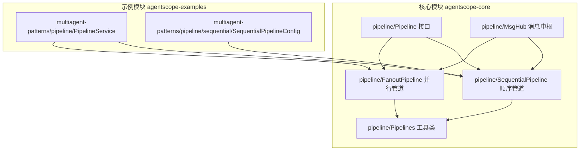
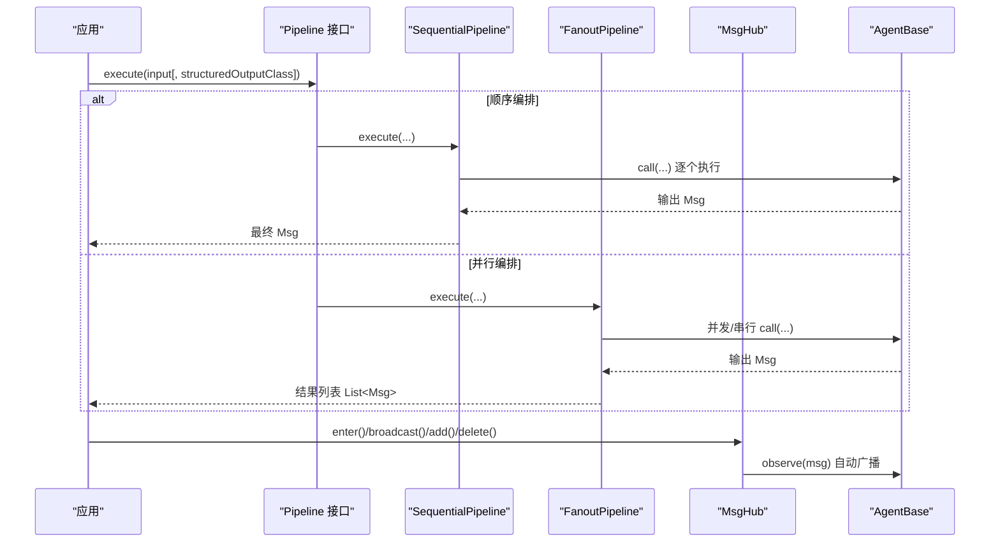
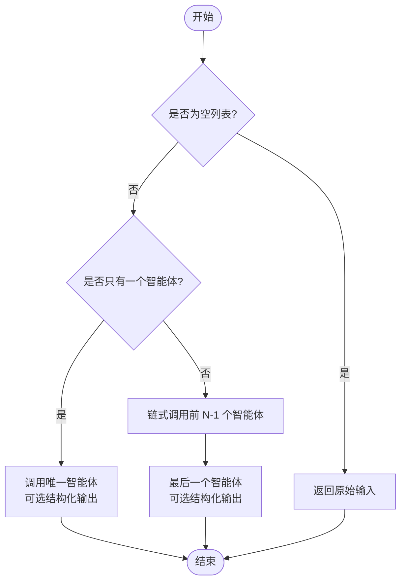
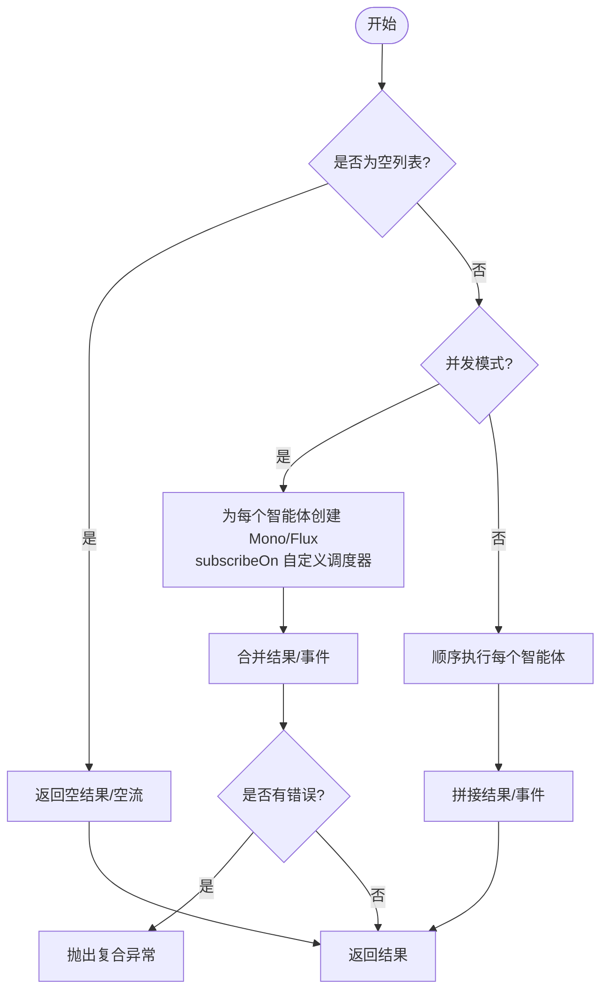
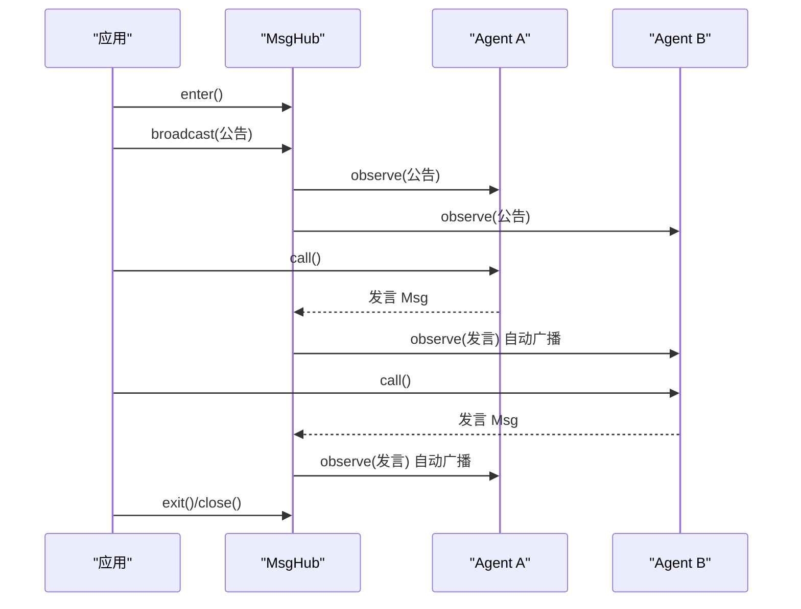
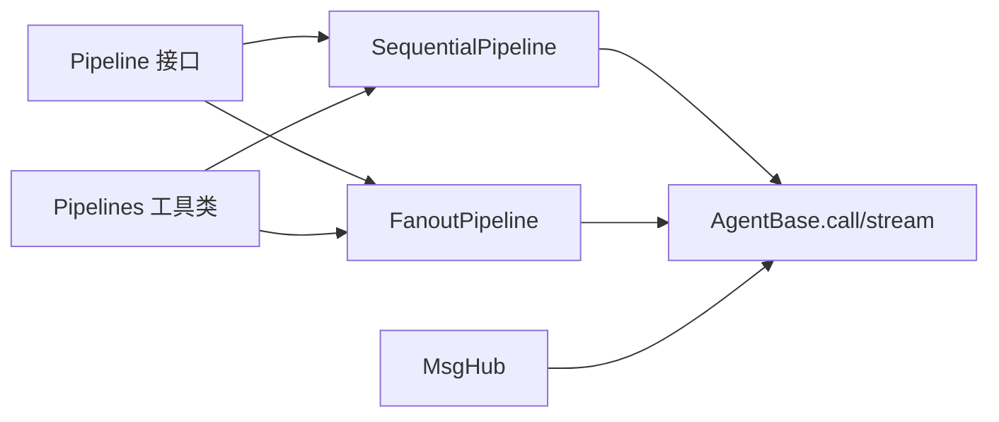

# 管道 API

<cite>
**本文引用的文件**   
- [Pipeline.java](file://agentscope-core/src/main/java/io/agentscope/core/pipeline/Pipeline.java)
- [SequentialPipeline.java](file://agentscope-core/src/main/java/io/agentscope/core/pipeline/SequentialPipeline.java)
- [FanoutPipeline.java](file://agentscope-core/src/main/java/io/agentscope/core/pipeline/FanoutPipeline.java)
- [MsgHub.java](file://agentscope-core/src/main/java/io/agentscope/core/pipeline/MsgHub.java)
- [Pipelines.java](file://agentscope-core/src/main/java/io/agentscope/core/pipeline/Pipelines.java)
- [SequentialPipelineTest.java](file://agentscope-core/src/test/java/io/agentscope/core/pipeline/SequentialPipelineTest.java)
- [FanoutPipelineTest.java](file://agentscope-core/src/test/java/io/agentscope/core/pipeline/FanoutPipelineTest.java)
- [PipelineService.java](file://agentscope-examples/multiagent-patterns/pipeline/src/main/java/com/alibaba/cloud/ai/examples/multiagents/pipeline/PipelineService.java)
- [SequentialPipelineConfig.java](file://agentscope-examples/multiagent-patterns/pipeline/src/main/java/com/alibaba/cloud/ai/examples/multiagents/pipeline/sequential/SequentialPipelineConfig.java)
</cite>

## 目录
1. [简介](#简介)
2. [项目结构](#项目结构)
3. [核心组件](#核心组件)
4. [架构总览](#架构总览)
5. [详细组件分析](#详细组件分析)
6. [依赖分析](#依赖分析)
7. [性能考虑](#性能考虑)
8. [故障排查指南](#故障排查指南)
9. [结论](#结论)
10. [附录](#附录)

## 简介
本文件为 AgentScope Java 管道系统 API 的权威参考文档，聚焦以下主题：
- Pipeline 接口设计与方法签名
- SequentialPipeline 顺序管道的使用与配置
- FanoutPipeline 并行/并发管道的使用与配置
- MsgHub 消息中枢的消息路由与分发机制
- 管道编排与多智能体协作实践
- 流式处理能力与异步执行模式
- 具体示例与最佳实践

## 项目结构
AgentScope 的管道 API 位于 agentscope-core 模块的 pipeline 包中，配套有工具类 Pipelines 提供函数式便捷调用；示例工程 agentscope-examples/multiagent-patterns/pipeline 展示了在 Spring 环境中如何组织顺序、并行与循环等典型编排。

**图表来源**
- [Pipeline.java:29-75](file://agentscope-core/src/main/java/io/agentscope/core/pipeline/Pipeline.java#L29-L75)
- [SequentialPipeline.java:39-185](file://agentscope-core/src/main/java/io/agentscope/core/pipeline/SequentialPipeline.java#L39-L185)
- [FanoutPipeline.java:49-457](file://agentscope-core/src/main/java/io/agentscope/core/pipeline/FanoutPipeline.java#L49-L457)
- [MsgHub.java:100-434](file://agentscope-core/src/main/java/io/agentscope/core/pipeline/MsgHub.java#L100-L434)
- [Pipelines.java:32-252](file://agentscope-core/src/main/java/io/agentscope/core/pipeline/Pipelines.java#L32-L252)
- [PipelineService.java:30-107](file://agentscope-examples/multiagent-patterns/pipeline/src/main/java/com/alibaba/cloud/ai/examples/multiagents/pipeline/PipelineService.java#L30-L107)
- [SequentialPipelineConfig.java:38-99](file://agentscope-examples/multiagent-patterns/pipeline/src/main/java/com/alibaba/cloud/ai/examples/multiagents/pipeline/sequential/SequentialPipelineConfig.java#L38-L99)

**章节来源**
- [Pipeline.java:29-75](file://agentscope-core/src/main/java/io/agentscope/core/pipeline/Pipeline.java#L29-L75)
- [SequentialPipeline.java:39-185](file://agentscope-core/src/main/java/io/agentscope/core/pipeline/SequentialPipeline.java#L39-L185)
- [FanoutPipeline.java:49-457](file://agentscope-core/src/main/java/io/agentscope/core/pipeline/FanoutPipeline.java#L49-L457)
- [MsgHub.java:100-434](file://agentscope-core/src/main/java/io/agentscope/core/pipeline/MsgHub.java#L100-L434)
- [Pipelines.java:32-252](file://agentscope-core/src/main/java/io/agentscope/core/pipeline/Pipelines.java#L32-L252)

## 核心组件
- Pipeline 接口：定义统一的异步执行入口，支持带/不带输入的执行，以及可选的结构化输出类型参数。
- SequentialPipeline：顺序管道，按序将前一个智能体的输出作为下一个智能体的输入，支持单个/多个智能体，支持结构化输出仅作用于最后一个智能体。
- FanoutPipeline：并行/并发管道，将同一输入广播给多个智能体，支持并发与串行两种执行模式，结果聚合为列表；提供事件流式接口以支持实时观测。
- MsgHub：多智能体消息中枢，自动/手动广播消息，动态增删参与者，生命周期管理（enter/exit/close），简化多智能体对话与协作。
- Pipelines：静态工具类，提供一次性使用的函数式 API，便于快速组合顺序/并行/串行并行等模式。

**章节来源**
- [Pipeline.java:29-75](file://agentscope-core/src/main/java/io/agentscope/core/pipeline/Pipeline.java#L29-L75)
- [SequentialPipeline.java:39-185](file://agentscope-core/src/main/java/io/agentscope/core/pipeline/SequentialPipeline.java#L39-L185)
- [FanoutPipeline.java:49-457](file://agentscope-core/src/main/java/io/agentscope/core/pipeline/FanoutPipeline.java#L49-L457)
- [MsgHub.java:100-434](file://agentscope-core/src/main/java/io/agentscope/core/pipeline/MsgHub.java#L100-L434)
- [Pipelines.java:32-252](file://agentscope-core/src/main/java/io/agentscope/core/pipeline/Pipelines.java#L32-L252)

## 架构总览
下图展示了管道 API 的核心交互：应用通过 Pipeline 接口发起执行，SequentialPipeline 与 FanoutPipeline 分别承担顺序与并行编排职责；MsgHub 负责多智能体之间的消息路由；Pipelines 提供便捷的函数式封装。

**图表来源**
- [Pipeline.java:29-75](file://agentscope-core/src/main/java/io/agentscope/core/pipeline/Pipeline.java#L29-L75)
- [SequentialPipeline.java:54-94](file://agentscope-core/src/main/java/io/agentscope/core/pipeline/SequentialPipeline.java#L54-L94)
- [FanoutPipeline.java:99-112](file://agentscope-core/src/main/java/io/agentscope/core/pipeline/FanoutPipeline.java#L99-L112)
- [MsgHub.java:158-193](file://agentscope-core/src/main/java/io/agentscope/core/pipeline/MsgHub.java#L158-L193)

## 详细组件分析

### Pipeline 接口
- 方法
  - execute(Msg input): 异步执行，返回最终结果 Mono<T>
  - execute(Msg input, Class<?> structuredOutputClass): 带结构化输出类型的执行
  - execute(): 无输入执行
  - execute(Class<?> structuredOutputClass): 无输入但带结构化输出
  - getDescription(): 获取人类可读描述，默认返回类名
- 设计要点
  - 统一异步模型（Mono），便于与 Reactor 生态集成
  - 支持结构化输出类型参数，用于需要强类型解析的场景
  - 默认描述便于调试与可观测性

**章节来源**
- [Pipeline.java:29-75](file://agentscope-core/src/main/java/io/agentscope/core/pipeline/Pipeline.java#L29-L75)

### SequentialPipeline 顺序管道
- 执行语义
  - 输入依次经过每个智能体，前一个输出作为下一个输入
  - 单智能体：可直接使用结构化输出类型
  - 多智能体：仅最后一个智能体使用结构化输出类型
- 关键方法
  - execute(Msg input)/execute(Msg input, Class)
  - getAgents()/size()/isEmpty()
  - toString()/getDescription()
  - builder(): 流式构建器，支持追加单个/多个智能体
- 错误处理
  - 链式执行中任一智能体失败即传播异常
  - 空智能体列表直接返回原始输入
- 性能与线程
  - 顺序执行，避免并发开销；适合串行依赖强的流程

**图表来源**
- [SequentialPipeline.java:54-94](file://agentscope-core/src/main/java/io/agentscope/core/pipeline/SequentialPipeline.java#L54-L94)

**章节来源**
- [SequentialPipeline.java:39-185](file://agentscope-core/src/main/java/io/agentscope/core/pipeline/SequentialPipeline.java#L39-L185)
- [SequentialPipelineTest.java:62-126](file://agentscope-core/src/test/java/io/agentscope/core/pipeline/SequentialPipelineTest.java#L62-L126)

### FanoutPipeline 并行/并发管道
- 执行语义
  - 将同一输入同时传递给多个智能体
  - 并发模式：每个智能体在独立调度器线程上执行，合并结果
  - 串行模式：按顺序独立执行，保持输入隔离
- 关键方法
  - execute(Msg input)/execute(Msg input, Class)
  - isConcurrentEnabled()/size()/isEmpty()
  - stream(...): 事件流式接口，支持并发/串行事件合并/拼接
  - builder(): 支持并发/串行切换与自定义调度器
- 错误处理
  - 并发模式：收集各智能体错误，最终抛出复合异常
  - 串行模式：首个失败即终止并抛出异常
- 性能与线程
  - 默认使用 boundedElastic 调度器，适合 I/O 密集型
  - 可注入自定义调度器以适配 CPU 或网络密集型场景

**图表来源**
- [FanoutPipeline.java:104-112](file://agentscope-core/src/main/java/io/agentscope/core/pipeline/FanoutPipeline.java#L104-L112)
- [FanoutPipeline.java:127-169](file://agentscope-core/src/main/java/io/agentscope/core/pipeline/FanoutPipeline.java#L127-L169)
- [FanoutPipeline.java:178-189](file://agentscope-core/src/main/java/io/agentscope/core/pipeline/FanoutPipeline.java#L178-L189)

**章节来源**
- [FanoutPipeline.java:49-457](file://agentscope-core/src/main/java/io/agentscope/core/pipeline/FanoutPipeline.java#L49-L457)
- [FanoutPipelineTest.java:68-123](file://agentscope-core/src/test/java/io/agentscope/core/pipeline/FanoutPipelineTest.java#L68-L123)

### MsgHub 消息中枢
- 功能特性
  - 自动广播：参与者发言后自动广播至其他参与者
  - 动态参与者：运行期添加/移除参与者
  - 手动广播：显式广播消息
  - 入口公告：进入时自动广播初始消息
  - 生命周期管理：enter()/exit()/close()，推荐 try-with-resources
- 关键方法
  - enter()/exit()/close()
  - add()/delete()
  - broadcast()/broadcast(List)
  - setAutoBroadcast()/isAutoBroadcastEnabled()
  - getParticipants()/getName()
  - builder(): 支持命名、参与者、公告、自动广播开关
- 线程安全
  - 参与者列表采用 CopyOnWrite 安全更新
  - 建议避免对同一 AgentBase 实例并发调用

**图表来源**
- [MsgHub.java:158-172](file://agentscope-core/src/main/java/io/agentscope/core/pipeline/MsgHub.java#L158-L172)
- [MsgHub.java:282-284](file://agentscope-core/src/main/java/io/agentscope/core/pipeline/MsgHub.java#L282-L284)
- [MsgHub.java:323-333](file://agentscope-core/src/main/java/io/agentscope/core/pipeline/MsgHub.java#L323-L333)

**章节来源**
- [MsgHub.java:100-434](file://agentscope-core/src/main/java/io/agentscope/core/pipeline/MsgHub.java#L100-L434)

### Pipelines 工具类
- 提供函数式便捷 API，无需显式构造管道对象
- 支持：
  - sequential(agents, input[, structuredOutputClass])
  - fanout/fanoutSequential(agents, input[, structuredOutputClass])
  - createSequential/createFanout/createFanoutSequential
  - compose(SequentialPipeline, SequentialPipeline)
- 适用场景：一次性使用、快速原型；可复用场景建议直接使用类实例

**章节来源**
- [Pipelines.java:32-252](file://agentscope-core/src/main/java/io/agentscope/core/pipeline/Pipelines.java#L32-L252)

## 依赖分析
- 组件耦合
  - SequentialPipeline/FanoutPipeline 均依赖 AgentBase 的 call/stream 能力
  - MsgHub 通过 AgentBase 的 observe/resetSubscribers/removeSubscribers 实现广播与订阅管理
  - Pipelines 作为门面，内部委托具体管道实现
- 外部依赖
  - Reactor Mono/Flux 作为异步基础类型
  - Scheduler 用于并发执行的线程池抽象

**图表来源**
- [SequentialPipeline.java:39-185](file://agentscope-core/src/main/java/io/agentscope/core/pipeline/SequentialPipeline.java#L39-L185)
- [FanoutPipeline.java:49-457](file://agentscope-core/src/main/java/io/agentscope/core/pipeline/FanoutPipeline.java#L49-L457)
- [MsgHub.java:100-434](file://agentscope-core/src/main/java/io/agentscope/core/pipeline/MsgHub.java#L100-L434)
- [Pipelines.java:32-252](file://agentscope-core/src/main/java/io/agentscope/core/pipeline/Pipelines.java#L32-L252)

**章节来源**
- [SequentialPipeline.java:39-185](file://agentscope-core/src/main/java/io/agentscope/core/pipeline/SequentialPipeline.java#L39-L185)
- [FanoutPipeline.java:49-457](file://agentscope-core/src/main/java/io/agentscope/core/pipeline/FanoutPipeline.java#L49-L457)
- [MsgHub.java:100-434](file://agentscope-core/src/main/java/io/agentscope/core/pipeline/MsgHub.java#L100-L434)
- [Pipelines.java:32-252](file://agentscope-core/src/main/java/io/agentscope/core/pipeline/Pipelines.java#L32-L252)

## 性能考虑
- 并发与串行
  - FanoutPipeline 默认并发执行，适合 I/O 密集型（如调用大模型 API）
  - 串行模式避免竞争与上下文切换开销，适合 CPU 密集或严格顺序依赖
- 调度器选择
  - 默认 boundedElastic 适合大多数外部调用场景
  - 可注入自定义 Scheduler 以匹配业务特征
- 结构化输出
  - 顺序管道仅在最后一个智能体使用结构化输出，减少不必要的解析成本
- 流式处理
  - 使用 stream(...) 可实时消费事件，降低端到端延迟
- 内存与线程
  - MsgHub 使用 CopyOnWrite 列表，避免并发修改风险
  - 建议为每个智能体提供独立内存/工具箱实例，避免共享状态导致的竞态

[本节为通用指导，无需特定文件来源]

## 故障排查指南
- 顺序管道
  - 空列表：直接返回输入，确认是否遗漏智能体
  - 单智能体：检查结构化输出类型是否正确传入
  - 多智能体：仅最后一个智能体应用结构化输出
- 并行管道
  - 并发失败：捕获复合异常，查看各智能体错误详情
  - 串行失败：首个失败即终止，定位第一个失败的智能体
  - 事件流：并发模式事件可能交错，串行模式按顺序输出
- 消息中枢
  - 自动广播未生效：确认已 enter() 且 setAutoBroadcast(true)
  - 删除不存在的参与者：会记录告警，检查参与者 ID/名称
  - 生命周期：确保 exit()/close() 正常调用，避免资源泄漏

**章节来源**
- [SequentialPipelineTest.java:82-98](file://agentscope-core/src/test/java/io/agentscope/core/pipeline/SequentialPipelineTest.java#L82-L98)
- [FanoutPipelineTest.java:125-176](file://agentscope-core/src/test/java/io/agentscope/core/pipeline/FanoutPipelineTest.java#L125-L176)
- [FanoutPipelineTest.java:223-278](file://agentscope-core/src/test/java/io/agentscope/core/pipeline/FanoutPipelineTest.java#L223-L278)
- [MsgHub.java:262-266](file://agentscope-core/src/main/java/io/agentscope/core/pipeline/MsgHub.java#L262-L266)

## 结论
AgentScope 管道 API 通过统一的 Pipeline 接口与顺序/并行/消息中枢三大能力，提供了灵活而强大的多智能体编排框架。结合 Pipelines 工具类与示例工程，开发者可以快速搭建从简单顺序流程到复杂并行协作的多智能体应用，并通过流式接口与结构化输出实现高性能与可观测性的平衡。

[本节为总结，无需特定文件来源]

## 附录

### 使用指南与示例路径
- 顺序管道
  - 构建与执行：参考顺序管道单元测试中的断言与调用方式
    - [SequentialPipelineTest.java:64-79](file://agentscope-core/src/test/java/io/agentscope/core/pipeline/SequentialPipelineTest.java#L64-L79)
  - 构建器用法：参考顺序管道构建器测试
    - [SequentialPipelineTest.java:151-174](file://agentscope-core/src/test/java/io/agentscope/core/pipeline/SequentialPipelineTest.java#L151-L174)
- 并行/并发管道
  - 并发执行与结果聚合：参考并行管道单元测试
    - [FanoutPipelineTest.java:68-94](file://agentscope-core/src/test/java/io/agentscope/core/pipeline/FanoutPipelineTest.java#L68-L94)
  - 串行执行与顺序保证：参考并行管道串行测试
    - [FanoutPipelineTest.java:96-123](file://agentscope-core/src/test/java/io/agentscope/core/pipeline/FanoutPipelineTest.java#L96-L123)
  - 事件流式接口：参考并发/串行事件流测试
    - [FanoutPipelineTest.java:223-278](file://agentscope-core/src/test/java/io/agentscope/core/pipeline/FanoutPipelineTest.java#L223-L278)
  - 构建器与调度器：参考并行管道构建器测试
    - [FanoutPipelineTest.java:178-208](file://agentscope-core/src/test/java/io/agentscope/core/pipeline/FanoutPipelineTest.java#L178-L208)
- 消息中枢
  - 自动广播与生命周期：参考消息中枢测试与示例
    - [MsgHub.java:158-172](file://agentscope-core/src/main/java/io/agentscope/core/pipeline/MsgHub.java#L158-L172)
    - [MsgHub.java:282-284](file://agentscope-core/src/main/java/io/agentscope/core/pipeline/MsgHub.java#L282-L284)
- 示例工程
  - 服务层封装与结果提取：参考 PipelineService
    - [PipelineService.java:53-89](file://agentscope-examples/multiagent-patterns/pipeline/src/main/java/com/alibaba/cloud/ai/examples/multiagents/pipeline/PipelineService.java#L53-L89)
  - 顺序管道配置示例：参考顺序管道配置
    - [SequentialPipelineConfig.java:54-98](file://agentscope-examples/multiagent-patterns/pipeline/src/main/java/com/alibaba/cloud/ai/examples/multiagents/pipeline/sequential/SequentialPipelineConfig.java#L54-L98)

**章节来源**
- [SequentialPipelineTest.java:62-174](file://agentscope-core/src/test/java/io/agentscope/core/pipeline/SequentialPipelineTest.java#L62-L174)
- [FanoutPipelineTest.java:68-208](file://agentscope-core/src/test/java/io/agentscope/core/pipeline/FanoutPipelineTest.java#L68-L208)
- [MsgHub.java:158-284](file://agentscope-core/src/main/java/io/agentscope/core/pipeline/MsgHub.java#L158-L284)
- [PipelineService.java:53-89](file://agentscope-examples/multiagent-patterns/pipeline/src/main/java/com/alibaba/cloud/ai/examples/multiagents/pipeline/PipelineService.java#L53-L89)
- [SequentialPipelineConfig.java:54-98](file://agentscope-examples/multiagent-patterns/pipeline/src/main/java/com/alibaba/cloud/ai/examples/multiagents/pipeline/sequential/SequentialPipelineConfig.java#L54-L98)