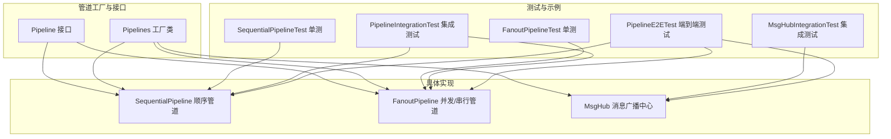
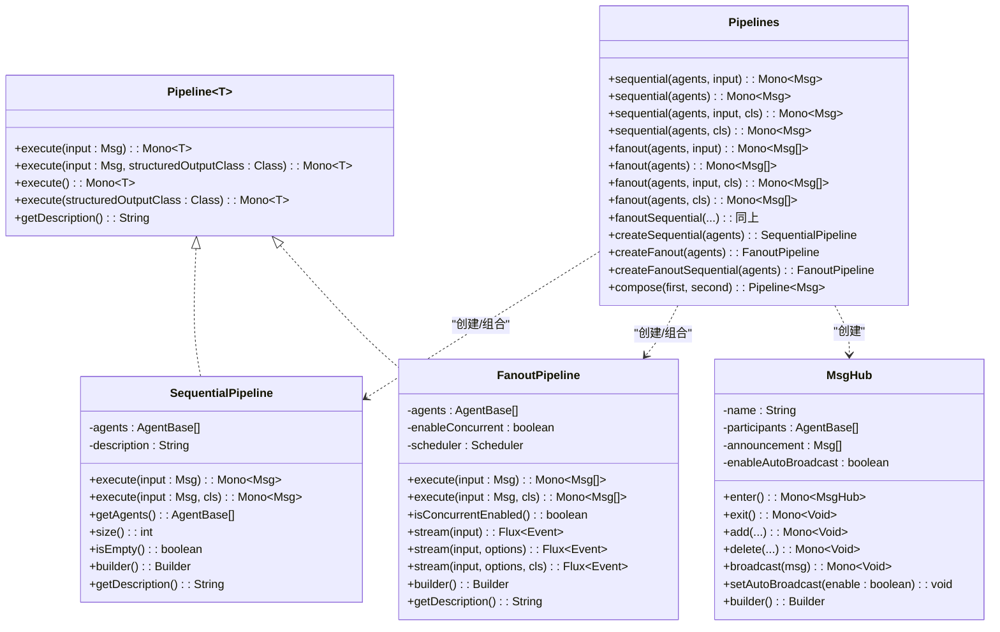
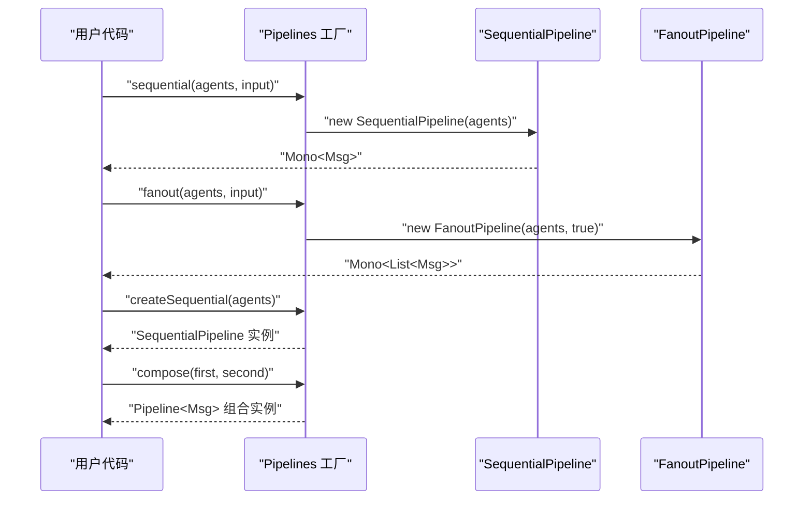
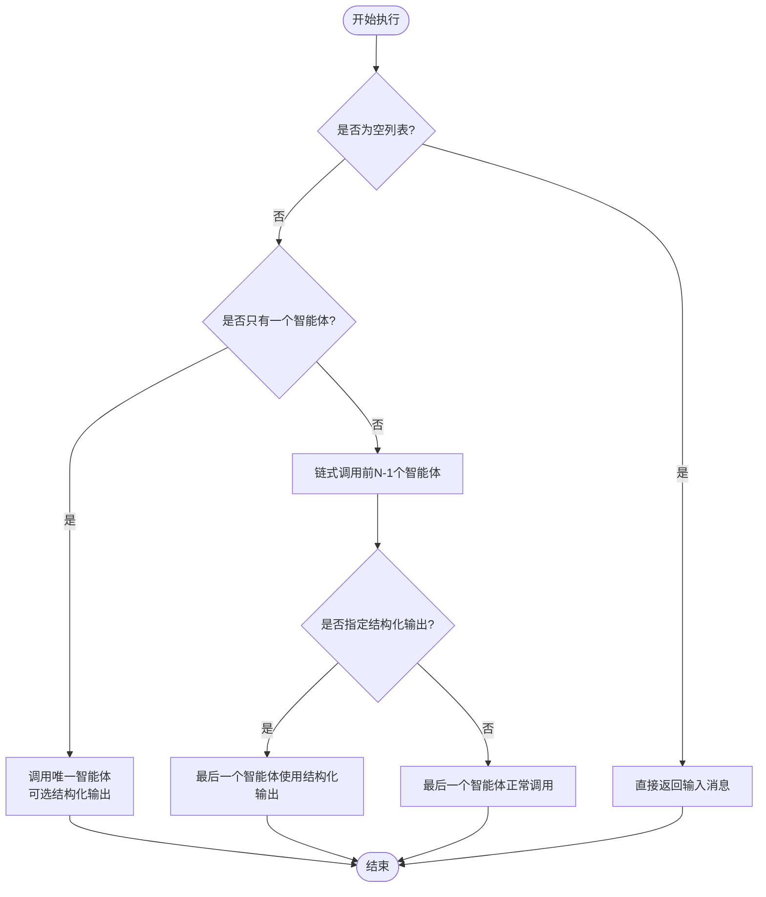
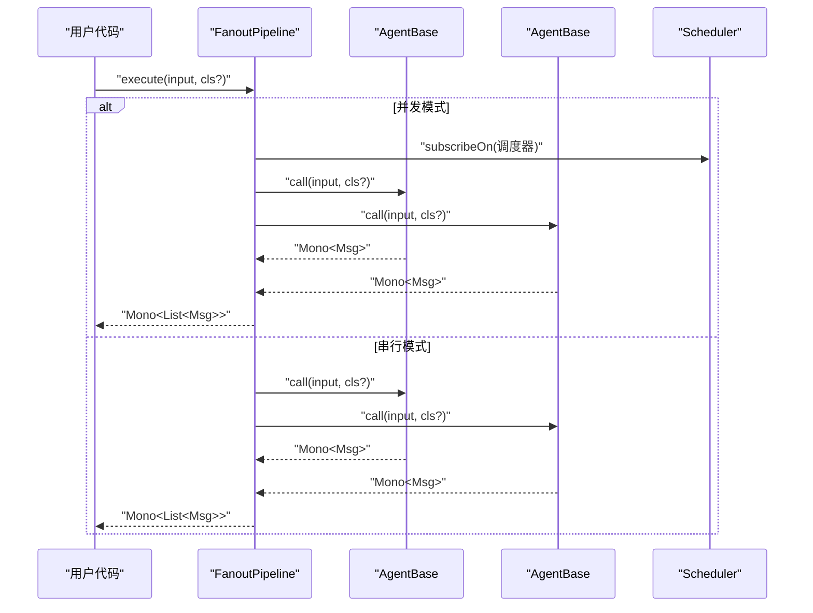
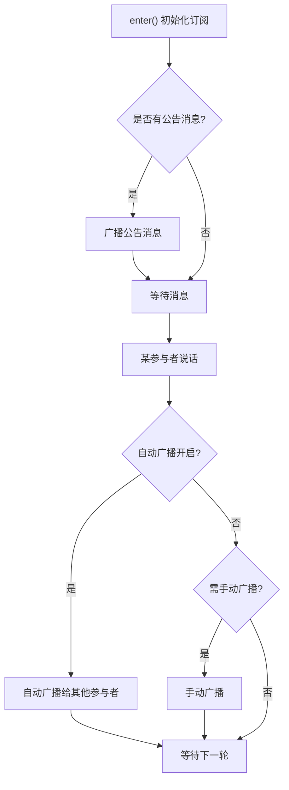
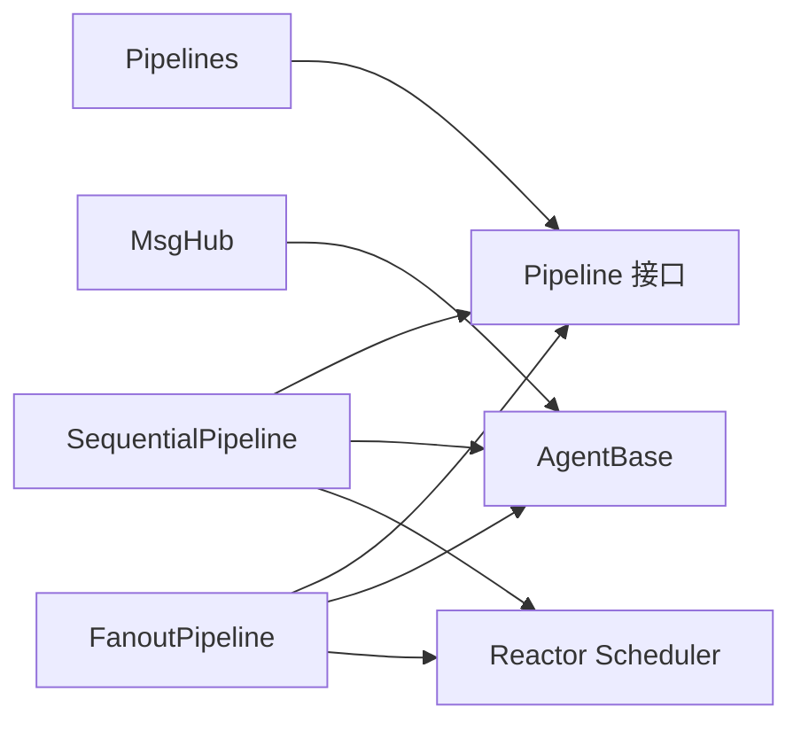

# 管道工厂

<cite>
**本文引用的文件**
- [Pipelines.java](file://agentscope-core/src/main/java/io/agentscope/core/pipeline/Pipelines.java)
- [Pipeline.java](file://agentscope-core/src/main/java/io/agentscope/core/pipeline/Pipeline.java)
- [SequentialPipeline.java](file://agentscope-core/src/main/java/io/agentscope/core/pipeline/SequentialPipeline.java)
- [FanoutPipeline.java](file://agentscope-core/src/main/java/io/agentscope/core/pipeline/FanoutPipeline.java)
- [MsgHub.java](file://agentscope-core/src/main/java/io/agentscope/core/pipeline/MsgHub.java)
- [SequentialPipelineTest.java](file://agentscope-core/src/test/java/io/agentscope/core/pipeline/SequentialPipelineTest.java)
- [FanoutPipelineTest.java](file://agentscope-core/src/test/java/io/agentscope/core/pipeline/FanoutPipelineTest.java)
- [PipelineIntegrationTest.java](file://agentscope-core/src/test/java/io/agentscope/core/pipeline/PipelineIntegrationTest.java)
- [MsgHubIntegrationTest.java](file://agentscope-core/src/test/java/io/agentscope/core/pipeline/MsgHubIntegrationTest.java)
- [PipelineE2ETest.java](file://agentscope-core/src/test/java/io/agentscope/core/e2e/PipelineE2ETest.java)
</cite>

## 目录
1. [简介](#简介)
2. [项目结构](#项目结构)
3. [核心组件](#核心组件)
4. [架构总览](#架构总览)
5. [详细组件分析](#详细组件分析)
6. [依赖分析](#依赖分析)
7. [性能考虑](#性能考虑)
8. [故障排查指南](#故障排查指南)
9. [结论](#结论)
10. [附录](#附录)

## 简介
本文件面向“管道工厂”的使用者与维护者，系统化阐述 AgentScope 中的管道工厂能力：如何通过工厂方法创建、配置与复用不同类型的管道；如何在顺序、并发与组合场景中高效组织多智能体协作；以及如何管理管道实例的生命周期、进行性能监控与调试。本文同时给出最佳实践建议与常见问题排查思路，帮助读者快速上手并稳定落地。

## 项目结构
围绕管道工厂的相关代码主要位于 agentscope-core 模块的 pipeline 包下，并辅以配套的单元测试、集成测试与端到端测试，覆盖顺序执行、并发执行、事件流式输出、消息广播等典型场景。

图表来源
- [Pipeline.java:29-75](file://agentscope-core/src/main/java/io/agentscope/core/pipeline/Pipeline.java#L29-L75)
- [Pipelines.java:32-252](file://agentscope-core/src/main/java/io/agentscope/core/pipeline/Pipelines.java#L32-L252)
- [SequentialPipeline.java:39-185](file://agentscope-core/src/main/java/io/agentscope/core/pipeline/SequentialPipeline.java#L39-L185)
- [FanoutPipeline.java:49-457](file://agentscope-core/src/main/java/io/agentscope/core/pipeline/FanoutPipeline.java#L49-L457)
- [MsgHub.java:100-434](file://agentscope-core/src/main/java/io/agentscope/core/pipeline/MsgHub.java#L100-L434)

章节来源
- [Pipelines.java:32-252](file://agentscope-core/src/main/java/io/agentscope/core/pipeline/Pipelines.java#L32-L252)
- [Pipeline.java:29-75](file://agentscope-core/src/main/java/io/agentscope/core/pipeline/Pipeline.java#L29-L75)
- [SequentialPipeline.java:39-185](file://agentscope-core/src/main/java/io/agentscope/core/pipeline/SequentialPipeline.java#L39-L185)
- [FanoutPipeline.java:49-457](file://agentscope-core/src/main/java/io/agentscope/core/pipeline/FanoutPipeline.java#L49-L457)
- [MsgHub.java:100-434](file://agentscope-core/src/main/java/io/agentscope/core/pipeline/MsgHub.java#L100-L434)

## 核心组件
- 管道接口 Pipeline：统一抽象了执行入口 execute(...) 与描述方法 getDescription()，支持带结构化输出的执行变体。
- 管道工厂 Pipelines：提供静态便捷方法与可复用实例创建方法，涵盖顺序、并发与串行扇出、组合顺序管道等。
- 顺序管道 SequentialPipeline：按序串联多个智能体，前一智能体输出作为后一智能体输入，支持单智能体与空列表边界处理。
- 并发/串行扇出管道 FanoutPipeline：将同一输入分发给多个智能体，支持并发或串行执行，内置错误聚合与事件流式输出。
- 消息广播中心 MsgHub：在一组智能体之间自动广播消息，简化多智能体对话与上下文同步。

章节来源
- [Pipeline.java:29-75](file://agentscope-core/src/main/java/io/agentscope/core/pipeline/Pipeline.java#L29-L75)
- [Pipelines.java:32-252](file://agentscope-core/src/main/java/io/agentscope/core/pipeline/Pipelines.java#L32-L252)
- [SequentialPipeline.java:39-185](file://agentscope-core/src/main/java/io/agentscope/core/pipeline/SequentialPipeline.java#L39-L185)
- [FanoutPipeline.java:49-457](file://agentscope-core/src/main/java/io/agentscope/core/pipeline/FanoutPipeline.java#L49-L457)
- [MsgHub.java:100-434](file://agentscope-core/src/main/java/io/agentscope/core/pipeline/MsgHub.java#L100-L434)

## 架构总览
管道工厂采用“接口 + 工具类 + 具体实现”的分层设计：
- 接口层：Pipeline 定义统一执行契约；
- 工厂层：Pipelines 提供静态便捷方法与可复用实例；
- 实现层：SequentialPipeline 与 FanoutPipeline 分别覆盖顺序与扇出模式；
- 扩展层：MsgHub 提供多智能体广播与订阅管理。

图表来源
- [Pipeline.java:29-75](file://agentscope-core/src/main/java/io/agentscope/core/pipeline/Pipeline.java#L29-L75)
- [Pipelines.java:32-252](file://agentscope-core/src/main/java/io/agentscope/core/pipeline/Pipelines.java#L32-L252)
- [SequentialPipeline.java:39-185](file://agentscope-core/src/main/java/io/agentscope/core/pipeline/SequentialPipeline.java#L39-L185)
- [FanoutPipeline.java:49-457](file://agentscope-core/src/main/java/io/agentscope/core/pipeline/FanoutPipeline.java#L49-L457)
- [MsgHub.java:100-434](file://agentscope-core/src/main/java/io/agentscope/core/pipeline/MsgHub.java#L100-L434)

## 详细组件分析

### 管道接口 Pipeline
- 职责：定义所有管道的统一执行模型，包括带结构化输出的执行变体与默认描述方法。
- 关键点：
  - execute(Msg) 与 execute(Msg, Class) 支持结构化输出类型参数；
  - execute() 与 execute(Class) 提供无输入场景的便捷调用；
  - getDescription() 默认返回简单类名，便于日志与可观测性。

章节来源
- [Pipeline.java:29-75](file://agentscope-core/src/main/java/io/agentscope/core/pipeline/Pipeline.java#L29-L75)

### 管道工厂 Pipelines
- 功能概览：
  - 静态便捷方法：一次性执行顺序/并发/串行扇出管道，支持结构化输出；
  - 可复用实例：创建顺序/并发/串行扇出管道实例；
  - 组合顺序管道：将两个顺序管道组合为一个新管道（仅第二阶段使用结构化输出）。
- 使用建议：
  - 一次性任务优先使用静态便捷方法；
  - 需要多次复用或自定义配置时，使用 createXxx 方法创建实例；
  - 组合顺序管道时，注意只有最终阶段会应用结构化输出类型。

图表来源
- [Pipelines.java:47-221](file://agentscope-core/src/main/java/io/agentscope/core/pipeline/Pipelines.java#L47-L221)

章节来源
- [Pipelines.java:32-252](file://agentscope-core/src/main/java/io/agentscope/core/pipeline/Pipelines.java#L32-L252)

### 顺序管道 SequentialPipeline
- 特性：
  - 严格链式执行，前一智能体输出作为下一智能体输入；
  - 支持单智能体与空列表边界处理；
  - 结构化输出仅在最后一个智能体生效；
  - 提供 Builder 以流畅地添加智能体。
- 生命周期：
  - 构造时冻结智能体列表；
  - 执行时按序调用 call(...)，异常向上传递；
  - toString 与 getDescription 提供调试信息。

图表来源
- [SequentialPipeline.java:60-94](file://agentscope-core/src/main/java/io/agentscope/core/pipeline/SequentialPipeline.java#L60-L94)

章节来源
- [SequentialPipeline.java:39-185](file://agentscope-core/src/main/java/io/agentscope/core/pipeline/SequentialPipeline.java#L39-L185)
- [SequentialPipelineTest.java:62-174](file://agentscope-core/src/test/java/io/agentscope/core/pipeline/SequentialPipelineTest.java#L62-L174)

### 并发/串行扇出管道 FanoutPipeline
- 特性：
  - 将同一输入分发给多个智能体；
  - 并发模式使用 boundedElastic 调度器并行执行，串行模式按顺序连接；
  - 错误处理：收集每个智能体的异常，最终抛出复合异常；
  - 流式事件：支持并发/串行两种模式的事件合并/拼接；
  - 提供 Builder，可配置并发/串行与自定义调度器。
- 生命周期：
  - 构造时记录并发标志与调度器；
  - 执行时根据模式选择 merge 或 concat；
  - 错误聚合在完成阶段统一抛出。

图表来源
- [FanoutPipeline.java:105-189](file://agentscope-core/src/main/java/io/agentscope/core/pipeline/FanoutPipeline.java#L105-L189)

章节来源
- [FanoutPipeline.java:49-457](file://agentscope-core/src/main/java/io/agentscope/core/pipeline/FanoutPipeline.java#L49-L457)
- [FanoutPipelineTest.java:68-208](file://agentscope-core/src/test/java/io/agentscope/core/pipeline/FanoutPipelineTest.java#L68-L208)

### 消息广播中心 MsgHub
- 特性：
  - 自动广播：启用自动广播时，任一参与者的消息会自动广播给其他参与者；
  - 动态参与者：运行期可动态加入/移除参与者；
  - 生命周期：enter()/exit() 或 AutoCloseable 确保订阅关系正确建立与清理；
  - 声明式配置：Builder 支持命名、参与者、公告消息与自动广播开关。
- 使用建议：
  - 多智能体对话首选 MsgHub，避免手动消息传递；
  - 运行期需要灵活增删参与者时，结合 add()/delete() 使用；
  - 关闭时确保 exit() 或 try-with-resources 正常执行，避免悬挂订阅。

图表来源
- [MsgHub.java:158-333](file://agentscope-core/src/main/java/io/agentscope/core/pipeline/MsgHub.java#L158-L333)

章节来源
- [MsgHub.java:100-434](file://agentscope-core/src/main/java/io/agentscope/core/pipeline/MsgHub.java#L100-L434)
- [MsgHubIntegrationTest.java:59-176](file://agentscope-core/src/test/java/io/agentscope/core/pipeline/MsgHubIntegrationTest.java#L59-L176)

### 管道组合与嵌套最佳实践
- 组合顺序管道：
  - 使用 Pipelines.compose(first, second) 将两个顺序管道连接；
  - 仅第二阶段应用结构化输出类型，第一阶段保持通用消息流转。
- 嵌套管道：
  - 内层顺序管道可作为外层管道中的一个步骤；
  - 注意内存与工具箱的隔离，避免共享状态导致竞态。
- 组合扇出+顺序：
  - 先并行分析（扇出），再顺序合成（顺序管道）；
  - 将各分析结果汇总为输入，交由合成智能体处理。

章节来源
- [Pipelines.java:219-251](file://agentscope-core/src/main/java/io/agentscope/core/pipeline/Pipelines.java#L219-L251)
- [PipelineIntegrationTest.java:111-161](file://agentscope-core/src/test/java/io/agentscope/core/pipeline/PipelineIntegrationTest.java#L111-L161)

## 依赖分析
- 组件内聚与耦合：
  - Pipelines 与具体实现解耦，通过 Pipeline 接口向上抽象；
  - SequentialPipeline 与 FanoutPipeline 对 AgentBase 的依赖清晰，便于替换与扩展；
  - MsgHub 与 AgentBase 的订阅/观察机制配合良好。
- 外部依赖：
  - Reactor 生态（Mono/Flux/Scheduler）用于响应式执行与并发控制；
  - 日志框架用于运行期诊断与告警。

图表来源
- [Pipelines.java:32-252](file://agentscope-core/src/main/java/io/agentscope/core/pipeline/Pipelines.java#L32-L252)
- [SequentialPipeline.java:39-185](file://agentscope-core/src/main/java/io/agentscope/core/pipeline/SequentialPipeline.java#L39-L185)
- [FanoutPipeline.java:49-457](file://agentscope-core/src/main/java/io/agentscope/core/pipeline/FanoutPipeline.java#L49-L457)
- [MsgHub.java:100-434](file://agentscope-core/src/main/java/io/agentscope/core/pipeline/MsgHub.java#L100-L434)

章节来源
- [FanoutPipeline.java:80-88](file://agentscope-core/src/main/java/io/agentscope/core/pipeline/FanoutPipeline.java#L80-L88)
- [SequentialPipeline.java:49-52](file://agentscope-core/src/main/java/io/agentscope/core/pipeline/SequentialPipeline.java#L49-L52)

## 性能考虑
- 并发执行：
  - FanoutPipeline 默认使用 boundedElastic 调度器，适合 I/O 密集型（如大模型 API 调用）；
  - 可通过 Builder 注入自定义调度器以适配特定资源限制。
- 资源隔离：
  - 每个智能体应拥有独立的工具箱与内存，避免共享状态引发的锁竞争；
  - 在并发模式下尤为关键。
- 结果聚合：
  - 并发模式下使用 merge 聚合事件，串行模式使用 concat 保证顺序；
  - 注意错误聚合策略，避免部分失败导致整体阻塞。
- 调试与可观测性：
  - 利用 getDescription() 与 toString() 输出管道描述；
  - 使用事件流式输出（stream）定位执行瓶颈与异常来源。

章节来源
- [FanoutPipeline.java:80-88](file://agentscope-core/src/main/java/io/agentscope/core/pipeline/FanoutPipeline.java#L80-L88)
- [FanoutPipelineTest.java:223-348](file://agentscope-core/src/test/java/io/agentscope/core/pipeline/FanoutPipelineTest.java#L223-L348)

## 故障排查指南
- 常见问题与定位：
  - 管道无输出：检查输入消息是否为空、智能体是否被正确添加、是否使用了空列表构造；
  - 并发失败：确认是否启用了自动广播、订阅关系是否正确建立、是否在关闭时清理了订阅；
  - 组合管道异常：确认仅第二阶段传入结构化输出类型、第一阶段保持通用消息。
- 调试技巧：
  - 使用事件流式输出（stream）观察中间事件类型与顺序；
  - 在测试中使用断言验证事件数量与类型；
  - 通过单元测试与集成测试对照定位问题范围。

章节来源
- [SequentialPipelineTest.java:82-98](file://agentscope-core/src/test/java/io/agentscope/core/pipeline/SequentialPipelineTest.java#L82-L98)
- [FanoutPipelineTest.java:125-176](file://agentscope-core/src/test/java/io/agentscope/core/pipeline/FanoutPipelineTest.java#L125-L176)
- [MsgHubIntegrationTest.java:178-254](file://agentscope-core/src/test/java/io/agentscope/core/pipeline/MsgHubIntegrationTest.java#L178-L254)

## 结论
管道工厂提供了从一次性便捷执行到可复用实例与组合编排的完整能力。通过顺序与扇出模式的合理搭配，结合 MsgHub 的消息广播机制，可以高效构建复杂多智能体工作流。建议在生产环境中遵循资源隔离、并发安全与可观测性的最佳实践，以获得稳定且可维护的执行效果。

## 附录

### 使用示例与配置要点
- 顺序管道（一次性）
  - 使用 Pipelines.sequential(...) 直接执行；
  - 支持带结构化输出的版本。
- 顺序管道（可复用）
  - 使用 Pipelines.createSequential(...) 创建实例；
  - 通过 Builder 添加智能体，便于后续复用。
- 扇出管道（并发/串行）
  - 使用 Pipelines.fanout(...) 或 fanoutSequential(...)；
  - 可通过 Builder 设置并发/串行与自定义调度器；
  - 支持结构化输出与事件流式输出。
- 组合顺序管道
  - 使用 Pipelines.compose(...) 将两个顺序管道连接；
  - 仅第二阶段应用结构化输出类型。
- MsgHub
  - 使用 MsgHub.builder() 配置参与者、公告与自动广播；
  - enter()/exit() 或 try-with-resources 管理生命周期。

章节来源
- [Pipelines.java:47-221](file://agentscope-core/src/main/java/io/agentscope/core/pipeline/Pipelines.java#L47-L221)
- [SequentialPipeline.java:140-184](file://agentscope-core/src/main/java/io/agentscope/core/pipeline/SequentialPipeline.java#L140-L184)
- [FanoutPipeline.java:371-456](file://agentscope-core/src/main/java/io/agentscope/core/pipeline/FanoutPipeline.java#L371-L456)
- [MsgHub.java:427-433](file://agentscope-core/src/main/java/io/agentscope/core/pipeline/MsgHub.java#L427-L433)
- [PipelineE2ETest.java:59-140](file://agentscope-core/src/test/java/io/agentscope/core/e2e/PipelineE2ETest.java#L59-L140)
- [PipelineE2ETest.java:144-225](file://agentscope-core/src/test/java/io/agentscope/core/e2e/PipelineE2ETest.java#L144-L225)
- [PipelineE2ETest.java:229-348](file://agentscope-core/src/test/java/io/agentscope/core/e2e/PipelineE2ETest.java#L229-L348)