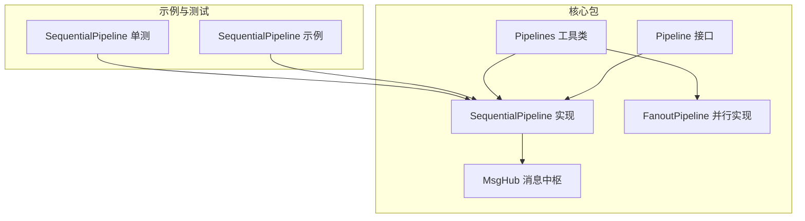
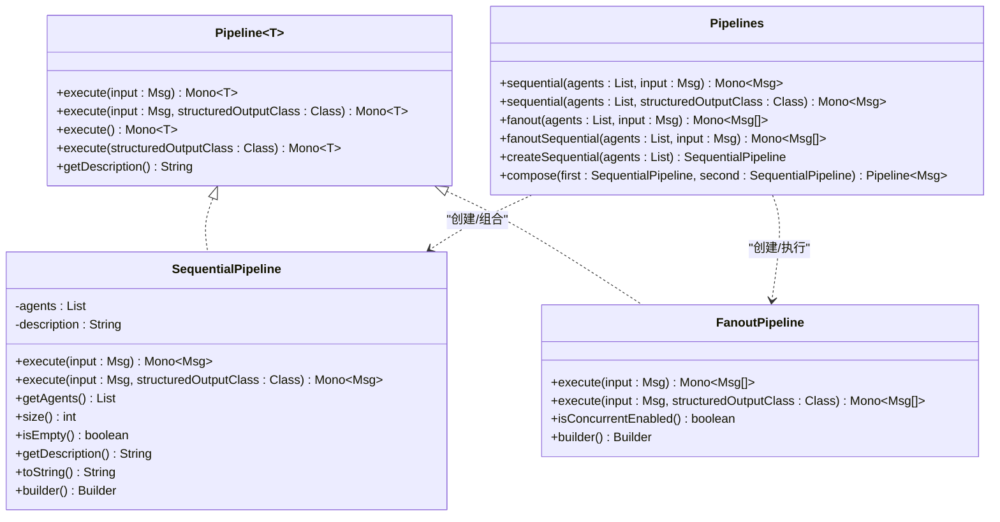
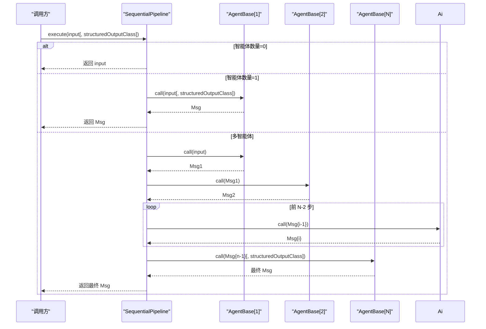
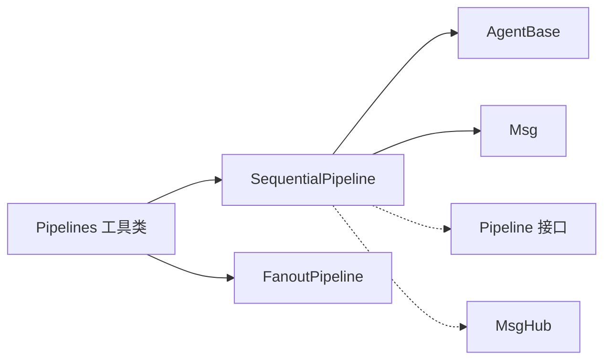
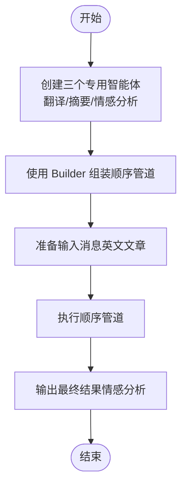

# 顺序管道

<cite>
**本文引用的文件**
- [SequentialPipeline.java](file://agentscope-core/src/main/java/io/agentscope/core/pipeline/SequentialPipeline.java)
- [Pipeline.java](file://agentscope-core/src/main/java/io/agentscope/core/pipeline/Pipeline.java)
- [Pipelines.java](file://agentscope-core/src/main/java/io/agentscope/core/pipeline/Pipelines.java)
- [FanoutPipeline.java](file://agentscope-core/src/main/java/io/agentscope/core/pipeline/FanoutPipeline.java)
- [MsgHub.java](file://agentscope-core/src/main/java/io/agentscope/core/pipeline/MsgHub.java)
- [SequentialPipelineTest.java](file://agentscope-core/src/test/java/io/agentscope/core/pipeline/SequentialPipelineTest.java)
- [SequentialPipelineExample.java](file://agentscope-examples/quickstart/src/main/java/io/agentscope/examples/quickstart/SequentialPipelineExample.java)
- [AgentBase.java](file://agentscope-core/src/main/java/io/agentscope/core/agent/AgentBase.java)
- [CompositeAgentException.java](file://agentscope-core/src/main/java/io/agentscope/core/exception/CompositeAgentException.java)
</cite>

## 目录
1. [简介](#简介)
2. [项目结构](#项目结构)
3. [核心组件](#核心组件)
4. [架构总览](#架构总览)
5. [详细组件分析](#详细组件分析)
6. [依赖分析](#依赖分析)
7. [性能考虑](#性能考虑)
8. [故障排查指南](#故障排查指南)
9. [结论](#结论)
10. [附录：构建与使用示例](#附录构建与使用示例)

## 简介
顺序管道（SequentialPipeline）是 AgentScope 中用于串行编排多个智能体（Agent）的管道实现。其核心特性包括：
- 严格的顺序执行：前一个智能体的输出作为下一个智能体的输入，形成链式调用。
- 结构化输出支持：仅在最后一个智能体上应用结构化输出约束，确保最终结果符合预期的数据形态。
- 错误传播：任一智能体抛出异常时，错误会沿着链路向上传播，中断后续执行。
- 构建器模式：通过 Builder 提供流畅的装配接口，便于动态添加智能体。
- 空管道处理：当智能体列表为空时，直接返回原始输入消息。

顺序管道适用于需要“逐步加工”的工作流，例如翻译、摘要、情感分析等多阶段内容处理场景。

## 项目结构
与顺序管道相关的核心文件位于 agentscope-core 模块的 pipeline 包中，并配套有工具类 Pipelines、对比实现 FanoutPipeline、以及消息中枢 MsgHub。测试与示例分别位于 test 与 examples 模块中。

**图表来源**
- [SequentialPipeline.java:39-186](file://agentscope-core/src/main/java/io/agentscope/core/pipeline/SequentialPipeline.java#L39-L186)
- [Pipeline.java:29-75](file://agentscope-core/src/main/java/io/agentscope/core/pipeline/Pipeline.java#L29-L75)
- [Pipelines.java:32-252](file://agentscope-core/src/main/java/io/agentscope/core/pipeline/Pipelines.java#L32-L252)
- [FanoutPipeline.java:49-458](file://agentscope-core/src/main/java/io/agentscope/core/pipeline/FanoutPipeline.java#L49-L458)
- [MsgHub.java:100-435](file://agentscope-core/src/main/java/io/agentscope/core/pipeline/MsgHub.java#L100-L435)
- [SequentialPipelineExample.java:33-195](file://agentscope-examples/quickstart/src/main/java/io/agentscope/examples/quickstart/SequentialPipelineExample.java#L33-L195)
- [SequentialPipelineTest.java:43-186](file://agentscope-core/src/test/java/io/agentscope/core/pipeline/SequentialPipelineTest.java#L43-L186)

**章节来源**
- [SequentialPipeline.java:1-186](file://agentscope-core/src/main/java/io/agentscope/core/pipeline/SequentialPipeline.java#L1-L186)
- [Pipelines.java:1-252](file://agentscope-core/src/main/java/io/agentscope/core/pipeline/Pipelines.java#L1-L252)

## 核心组件
- Pipeline 接口：定义统一的执行契约，支持带结构化输出的执行重载与无输入执行默认实现。
- SequentialPipeline：顺序管道的具体实现，负责将智能体按序串联，处理空列表、单个智能体与多个智能体的不同分支逻辑。
- Pipelines 工具类：提供函数式风格的便捷执行入口与可复用管道创建，同时包含顺序管道组合器。
- FanoutPipeline：并行管道实现，用于对比说明顺序与并行两种执行模式的差异。
- MsgHub：消息中枢，用于多智能体之间的自动广播与订阅，适合对话或协作场景，但不改变顺序管道的串行特性。

**章节来源**
- [Pipeline.java:29-75](file://agentscope-core/src/main/java/io/agentscope/core/pipeline/Pipeline.java#L29-L75)
- [SequentialPipeline.java:39-186](file://agentscope-core/src/main/java/io/agentscope/core/pipeline/SequentialPipeline.java#L39-L186)
- [Pipelines.java:32-252](file://agentscope-core/src/main/java/io/agentscope/core/pipeline/Pipelines.java#L32-L252)
- [FanoutPipeline.java:49-458](file://agentscope-core/src/main/java/io/agentscope/core/pipeline/FanoutPipeline.java#L49-L458)
- [MsgHub.java:100-435](file://agentscope-core/src/main/java/io/agentscope/core/pipeline/MsgHub.java#L100-L435)

## 架构总览
顺序管道的执行由 Pipeline 接口抽象，SequentialPipeline 实现具体链式调用；Pipelines 工具类提供静态方法与组合器，便于快速构建与复用。FanoutPipeline 作为对比实现，展示并行执行模式下的并发调度与错误聚合策略。

**图表来源**
- [Pipeline.java:29-75](file://agentscope-core/src/main/java/io/agentscope/core/pipeline/Pipeline.java#L29-L75)
- [SequentialPipeline.java:39-186](file://agentscope-core/src/main/java/io/agentscope/core/pipeline/SequentialPipeline.java#L39-L186)
- [Pipelines.java:32-252](file://agentscope-core/src/main/java/io/agentscope/core/pipeline/Pipelines.java#L32-L252)
- [FanoutPipeline.java:49-458](file://agentscope-core/src/main/java/io/agentscope/core/pipeline/FanoutPipeline.java#L49-L458)

## 详细组件分析

### 执行机制与消息传递流程
顺序管道采用响应式链式调用，将每个智能体的输出作为下一个智能体的输入，直至最后一个智能体产生最终结果。其关键行为如下：
- 空智能体列表：直接返回输入消息。
- 单智能体：根据是否指定结构化输出类，选择对应的调用路径。
- 多智能体：前 N-1 个智能体使用普通调用，最后一个智能体可选结构化输出。

**图表来源**
- [SequentialPipeline.java:54-94](file://agentscope-core/src/main/java/io/agentscope/core/pipeline/SequentialPipeline.java#L54-L94)
- [AgentBase.java:182-200](file://agentscope-core/src/main/java/io/agentscope/core/agent/AgentBase.java#L182-L200)

**章节来源**
- [SequentialPipeline.java:54-94](file://agentscope-core/src/main/java/io/agentscope/core/pipeline/SequentialPipeline.java#L54-L94)

### 配置方法与执行顺序控制
- 构造函数：传入智能体列表，内部保存不可变副本，并生成描述性名称。
- Builder 模式：通过 addAgent/addAgents 动态追加智能体，最后 build 生成顺序管道实例。
- 执行顺序：严格遵循添加顺序，前 N-1 个智能体仅进行普通调用，最后一个智能体可选结构化输出。
- 空管道处理：当智能体列表为空时，直接返回输入消息，避免不必要的链路开销。

**章节来源**
- [SequentialPipeline.java:49-52](file://agentscope-core/src/main/java/io/agentscope/core/pipeline/SequentialPipeline.java#L49-L52)
- [SequentialPipeline.java:147-184](file://agentscope-core/src/main/java/io/agentscope/core/pipeline/SequentialPipeline.java#L147-L184)

### 异步执行模式与错误处理机制
- 异步执行：顺序管道基于响应式 Mono 链式组合，天然具备异步非阻塞特性，适合 I/O 密集型任务。
- 错误传播：任一智能体在调用过程中抛出异常，都会中断后续链路并向上游传播，调用方可通过 onErrorResume 或断言捕获。
- 结构化输出：仅对最后一个智能体应用结构化输出参数，避免中间阶段被强制约束。
- 与并行管道对比：FanoutPipeline 支持并发/串行两种模式，并提供复合异常聚合能力；顺序管道则强调确定性的顺序与简洁的链式语义。

**章节来源**
- [SequentialPipeline.java:66-94](file://agentscope-core/src/main/java/io/agentscope/core/pipeline/SequentialPipeline.java#L66-L94)
- [FanoutPipeline.java:127-169](file://agentscope-core/src/main/java/io/agentscope/core/pipeline/FanoutPipeline.java#L127-L169)
- [AgentBase.java:449-457](file://agentscope-core/src/main/java/io/agentscope/core/agent/AgentBase.java#L449-L457)

### 性能特征与资源管理
- 调度与线程模型：顺序管道本身不引入额外调度器，沿用智能体内部的调用与钩子机制；如需并发，建议在智能体层面对外部 I/O 进行调度。
- 内存与状态：顺序管道不持有智能体状态，仅维护智能体列表与描述；状态管理由具体智能体实现负责。
- 资源清理：顺序管道不直接管理资源生命周期，资源释放遵循智能体与模型客户端的生命周期约定。

**章节来源**
- [SequentialPipeline.java:41-42](file://agentscope-core/src/main/java/io/agentscope/core/pipeline/SequentialPipeline.java#L41-L42)
- [AgentBase.java:182-200](file://agentscope-core/src/main/java/io/agentscope/core/agent/AgentBase.java#L182-L200)

### 与其他管道类型的对比分析
- 与并行管道（FanoutPipeline）对比：
  - 执行模式：顺序管道为串行链式；并行管道可选择并发或串行，且对每个智能体独立执行。
  - 错误处理：顺序管道任一失败即中断；并行管道收集所有错误并通过复合异常聚合。
  - 输入隔离：并行管道对每个智能体提供独立输入副本；顺序管道共享同一消息对象。
  - 使用场景：顺序管道适合需要确定性顺序与最终结构化输出的工作流；并行管道适合需要横向扩展与容错的场景。

**章节来源**
- [FanoutPipeline.java:127-189](file://agentscope-core/src/main/java/io/agentscope/core/pipeline/FanoutPipeline.java#L127-L189)
- [Pipelines.java:108-180](file://agentscope-core/src/main/java/io/agentscope/core/pipeline/Pipelines.java#L108-L180)

## 依赖分析
顺序管道与智能体基类、消息类型存在直接依赖关系；与工具类 Pipelines 存在组合与调用关系；与并行管道形成对比实现。

**图表来源**
- [SequentialPipeline.java:18-22](file://agentscope-core/src/main/java/io/agentscope/core/pipeline/SequentialPipeline.java#L18-L22)
- [Pipelines.java:32-252](file://agentscope-core/src/main/java/io/agentscope/core/pipeline/Pipelines.java#L32-L252)
- [FanoutPipeline.java:49-458](file://agentscope-core/src/main/java/io/agentscope/core/pipeline/FanoutPipeline.java#L49-L458)
- [MsgHub.java:100-435](file://agentscope-core/src/main/java/io/agentscope/core/pipeline/MsgHub.java#L100-L435)

**章节来源**
- [SequentialPipeline.java:18-22](file://agentscope-core/src/main/java/io/agentscope/core/pipeline/SequentialPipeline.java#L18-L22)
- [Pipelines.java:32-252](file://agentscope-core/src/main/java/io/agentscope/core/pipeline/Pipelines.java#L32-L252)

## 性能考虑
- 顺序执行的确定性与低耦合：顺序管道适合对时序敏感的任务，避免并发带来的竞态与复杂性。
- I/O 密集优化：若智能体内部涉及远程调用，建议在智能体层面对外部请求进行并发调度，而非在顺序管道层面重复并发。
- 结构化输出的边界：仅在最终智能体启用结构化输出，减少中间阶段的格式约束成本。
- 资源与内存：顺序管道不持有状态，避免额外内存占用；注意智能体自身的内存与缓存策略。

[本节为通用指导，无需特定文件引用]

## 故障排查指南
- 空管道返回输入：当智能体列表为空时，顺序管道直接返回输入消息。若期望有处理逻辑，请检查智能体列表是否正确装配。
- 单智能体与多智能体差异：单智能体时可直接应用结构化输出；多智能体时仅最后一个智能体应用结构化输出。请确认结构化输出参数的传递位置。
- 错误传播：任一智能体抛错会导致链路中断。可通过断言或异常捕获定位问题智能体，并结合智能体日志与钩子事件进行诊断。
- 与并行管道混淆：若需要并发执行与容错聚合，请使用并行管道；顺序管道不提供并发与复合异常聚合能力。

**章节来源**
- [SequentialPipelineTest.java:102-109](file://agentscope-core/src/test/java/io/agentscope/core/pipeline/SequentialPipelineTest.java#L102-L109)
- [SequentialPipelineTest.java:83-98](file://agentscope-core/src/test/java/io/agentscope/core/pipeline/SequentialPipelineTest.java#L83-L98)
- [FanoutPipeline.java:127-169](file://agentscope-core/src/main/java/io/agentscope/core/pipeline/FanoutPipeline.java#L127-L169)
- [CompositeAgentException.java:22-85](file://agentscope-core/src/main/java/io/agentscope/core/exception/CompositeAgentException.java#L22-L85)

## 结论
顺序管道通过简洁的链式调用与明确的执行语义，为需要确定性顺序与最终结构化输出的多智能体工作流提供了稳定可靠的编排能力。配合工具类 Pipelines 与 Builder 模式，可在保证可读性的同时灵活装配与复用。对于需要并发与容错聚合的场景，可参考并行管道实现进行权衡选择。

[本节为总结性内容，无需特定文件引用]

## 附录：构建与使用示例

### 构建顺序管道（Builder 模式）
- 使用 builder() 获取构建器实例。
- 通过 addAgent/addAgents 添加智能体。
- 调用 build() 生成顺序管道实例。

**章节来源**
- [SequentialPipeline.java:147-184](file://agentscope-core/src/main/java/io/agentscope/core/pipeline/SequentialPipeline.java#L147-L184)

### 执行顺序管道
- 基本执行：传入初始消息，返回最终消息。
- 结构化输出：在 execute 重载中传入目标类，仅对最后一个智能体生效。
- 无输入执行：通过 execute() 或 execute(StructuredOutputClass) 形式触发。

**章节来源**
- [SequentialPipeline.java:54-65](file://agentscope-core/src/main/java/io/agentscope/core/pipeline/SequentialPipeline.java#L54-L65)
- [Pipelines.java:38-83](file://agentscope-core/src/main/java/io/agentscope/core/pipeline/Pipelines.java#L38-L83)

### 示例：内容处理工作流
该示例展示了将英文文章依次经过“翻译 → 摘要 → 情感分析”三个阶段的完整流程，体现顺序管道的链式编排能力。

**图表来源**
- [SequentialPipelineExample.java:67-73](file://agentscope-examples/quickstart/src/main/java/io/agentscope/examples/quickstart/SequentialPipelineExample.java#L67-L73)
- [SequentialPipelineExample.java:97-98](file://agentscope-examples/quickstart/src/main/java/io/agentscope/examples/quickstart/SequentialPipelineExample.java#L97-L98)

**章节来源**
- [SequentialPipelineExample.java:33-195](file://agentscope-examples/quickstart/src/main/java/io/agentscope/examples/quickstart/SequentialPipelineExample.java#L33-L195)