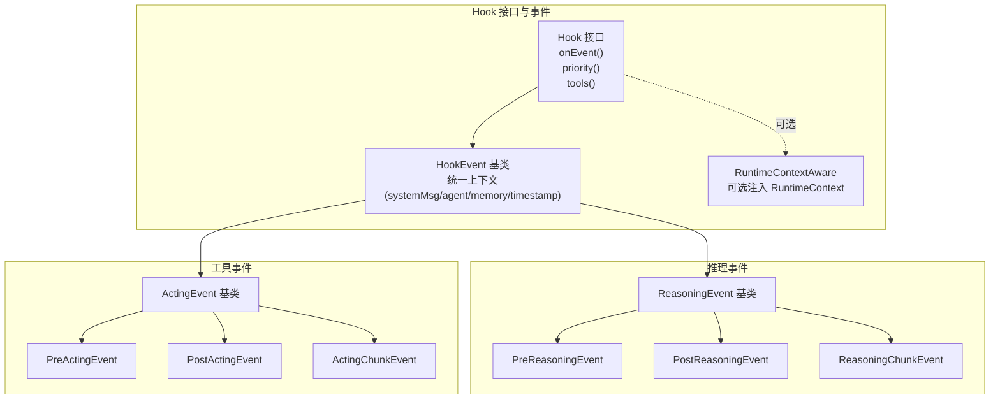
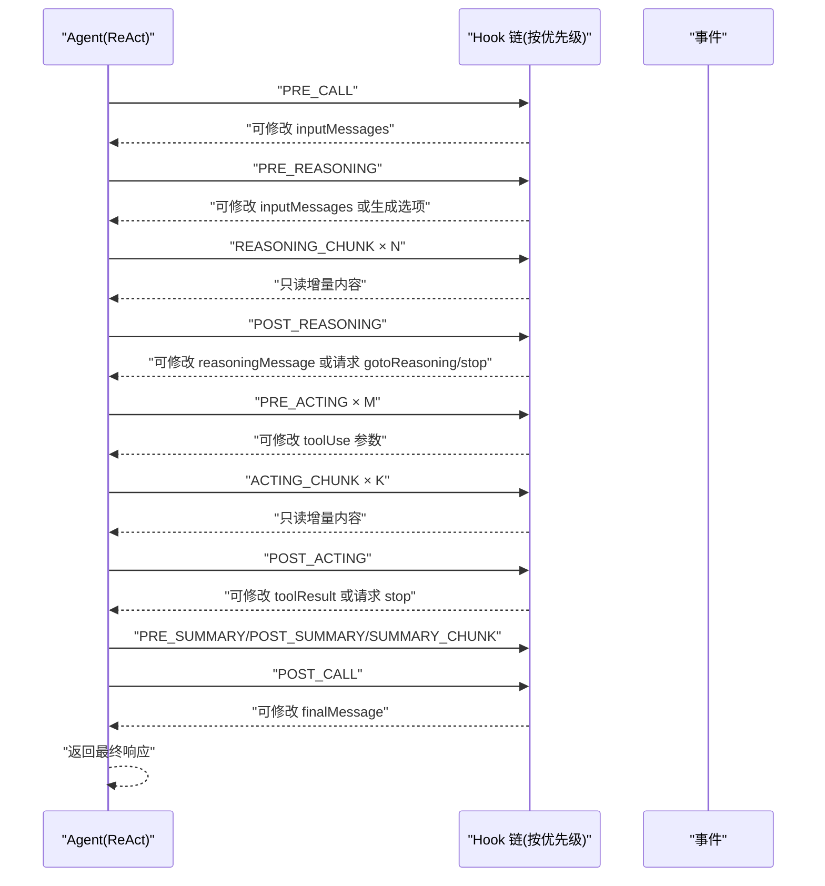
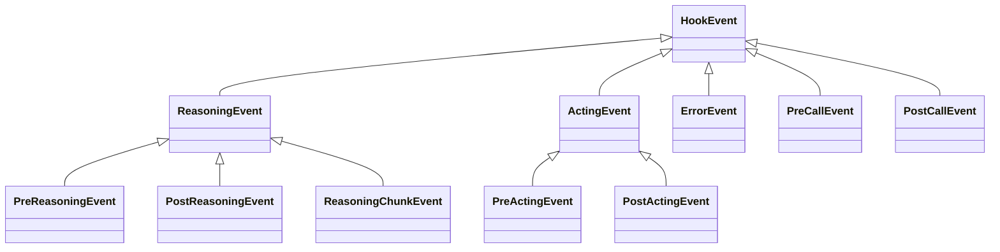
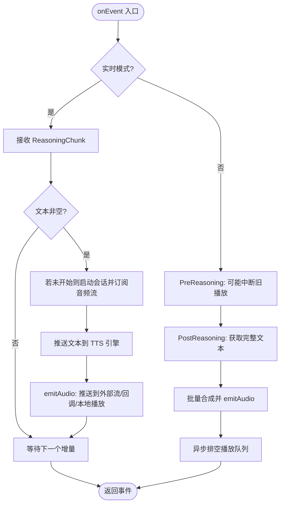
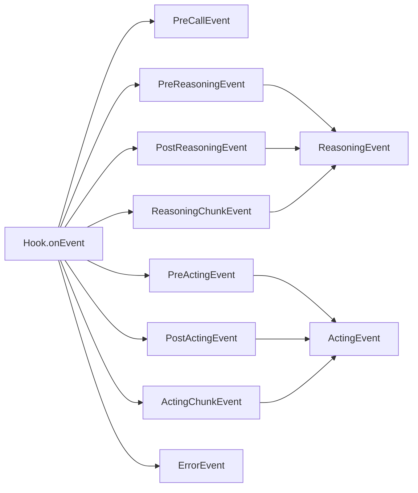

# Hook 扩展系统

<cite>
**本文引用的文件**
- [Hook.java](file://agentscope-core/src/main/java/io/agentscope/core/hook/Hook.java)
- [HookEvent.java](file://agentscope-core/src/main/java/io/agentscope/core/hook/HookEvent.java)
- [HookEventType.java](file://agentscope-core/src/main/java/io/agentscope/core/hook/HookEventType.java)
- [RuntimeContextAware.java](file://agentscope-core/src/main/java/io/agentscope/core/hook/RuntimeContextAware.java)
- [TTSHook.java](file://agentscope-core/src/main/java/io/agentscope/core/hook/TTSHook.java)
- [PreCallEvent.java](file://agentscope-core/src/main/java/io/agentscope/core/hook/PreCallEvent.java)
- [PostCallEvent.java](file://agentscope-core/src/main/java/io/agentscope/core/hook/PostCallEvent.java)
- [PreReasoningEvent.java](file://agentscope-core/src/main/java/io/agentscope/core/hook/PreReasoningEvent.java)
- [PostReasoningEvent.java](file://agentscope-core/src/main/java/io/agentscope/core/hook/PostReasoningEvent.java)
- [ReasoningChunkEvent.java](file://agentscope-core/src/main/java/io/agentscope/core/hook/ReasoningChunkEvent.java)
- [PreActingEvent.java](file://agentscope-core/src/main/java/io/agentscope/core/hook/PreActingEvent.java)
- [PostActingEvent.java](file://agentscope-core/src/main/java/io/agentscope/core/hook/PostActingEvent.java)
- [ErrorEvent.java](file://agentscope-core/src/main/java/io/agentscope/core/hook/ErrorEvent.java)
- [ReasoningEvent.java](file://agentscope-core/src/main/java/io/agentscope/core/hook/ReasoningEvent.java)
- [ActingEvent.java](file://agentscope-core/src/main/java/io/agentscope/core/hook/ActingEvent.java)
</cite>

## 目录
1. [简介](#简介)
2. [项目结构](#项目结构)
3. [核心组件](#核心组件)
4. [架构总览](#架构总览)
5. [详细组件分析](#详细组件分析)
6. [依赖关系分析](#依赖关系分析)
7. [性能与并发特性](#性能与并发特性)
8. [故障排查指南](#故障排查指南)
9. [结论](#结论)
10. [附录：事件时序与使用示例](#附录事件时序与使用示例)

## 简介
本文件系统性阐述 AgentScope Java Hook 扩展体系的设计与实现，覆盖事件模型、生命周期管理、优先级与执行顺序、异常传播、内置 Hook（如 TTSHook）、自定义 Hook 开发指南、性能与最佳实践，以及在监控、审计、调试等场景的应用示例路径。

## 项目结构
Hook 子系统位于 agentscope-core 模块的 hook 包中，采用“统一事件入口 + 分层事件类型”的设计：
- 统一接口：Hook 提供 onEvent 作为唯一事件入口，并支持 priority 与 tools 注册。
- 基类与分层：HookEvent 为所有事件的密封基类；ReasoningEvent/ActingEvent 进一步细分推理与工具调用阶段；各阶段再细分为 PRE/POST/CHUNK 等子事件。
- 生命周期：围绕 ReActAgent 的 call() 流程，贯穿 PRE_CALL → PRE_REASONING/REASONING_CHUNK → POST_REASONING → PRE_ACTING → POST_ACTING/ACTING_CHUNK → PRE_SUMMARY/POST_SUMMARY/SUMMARY_CHUNK → POST_CALL 的完整链路。
- 上下文：HookEvent 提供统一的 systemMsg、Agent、Memory、时间戳等上下文访问能力。

图表来源
- [Hook.java:117-186](file://agentscope-core/src/main/java/io/agentscope/core/hook/Hook.java#L117-L186)
- [HookEvent.java:74-205](file://agentscope-core/src/main/java/io/agentscope/core/hook/HookEvent.java#L74-L205)
- [ReasoningEvent.java:42-82](file://agentscope-core/src/main/java/io/agentscope/core/hook/ReasoningEvent.java#L42-L82)
- [ActingEvent.java:42-79](file://agentscope-core/src/main/java/io/agentscope/core/hook/ActingEvent.java#L42-L79)

章节来源
- [Hook.java:25-186](file://agentscope-core/src/main/java/io/agentscope/core/hook/Hook.java#L25-L186)
- [HookEvent.java:29-73](file://agentscope-core/src/main/java/io/agentscope/core/hook/HookEvent.java#L29-L73)

## 核心组件
- Hook 接口：统一事件入口 onEvent，支持 priority 控制执行顺序，支持 tools() 注册工具。
- HookEvent 基类：提供统一上下文（agent、memory、systemMsg、timestamp），并规范 systemMsg 的读写与注入规则。
- 事件枚举：HookEventType 定义了 PRE_CALL、POST_CALL、PRE_REASONING、POST_REASONING、REASONING_CHUNK、PRE_ACTING、POST_ACTING、ACTING_CHUNK、PRE_SUMMARY、POST_SUMMARY、SUMMARY_CHUNK、ERROR 等。
- 分层事件：
  - ReasoningEvent：推理阶段（PRE/POST/CHUNK）
  - ActingEvent：工具阶段（PRE/POST/CHUNK）
- 内置 Hook：TTSHook 实现“边生成边语音”能力，支持本地播放与服务端回调两种模式。
- 可选上下文：RuntimeContextAware 允许 Hook 获取当前调用的 RuntimeContext。

章节来源
- [Hook.java:117-186](file://agentscope-core/src/main/java/io/agentscope/core/hook/Hook.java#L117-L186)
- [HookEvent.java:74-205](file://agentscope-core/src/main/java/io/agentscope/core/hook/HookEvent.java#L74-L205)
- [HookEventType.java:27-63](file://agentscope-core/src/main/java/io/agentscope/core/hook/HookEventType.java#L27-L63)
- [TTSHook.java:74-457](file://agentscope-core/src/main/java/io/agentscope/core/hook/TTSHook.java#L74-L457)
- [RuntimeContextAware.java:30-39](file://agentscope-core/src/main/java/io/agentscope/core/hook/RuntimeContextAware.java#L30-L39)

## 架构总览
Hook 架构以“事件驱动 + 优先级调度”为核心，遵循以下原则：
- 单一入口：所有事件经由 Hook.onEvent 统一分发。
- 优先级：数值越小优先级越高，默认 100；同优先级按注册顺序执行。
- 可修改性：带 setter 的事件（如 PreReasoningEvent、PostReasoningEvent、PreActingEvent、PostActingEvent、PreCallEvent、PostCallEvent）允许修改输入/输出；不带 setter 的事件（如 ReasoningChunkEvent、ActingChunkEvent、ErrorEvent）仅用于通知。
- systemMsg 生命周期：在 PRE_CALL 之前注入，冻结为本次调用基线；在每次 PRE_REASONING/PRE_SUMMARY 时注入 fresh 基线，确保每轮迭代从同一干净起点开始。

图表来源
- [Hook.java:147-147](file://agentscope-core/src/main/java/io/agentscope/core/hook/Hook.java#L147-L147)
- [HookEventType.java:27-63](file://agentscope-core/src/main/java/io/agentscope/core/hook/HookEventType.java#L27-L63)
- [HookEvent.java:43-66](file://agentscope-core/src/main/java/io/agentscope/core/hook/HookEvent.java#L43-L66)

## 详细组件分析

### Hook 接口与优先级机制
- 单一事件入口：onEvent(T event) 返回 Mono<T>，便于异步/响应式扩展。
- 工具注册：tools() 默认空列表，返回非空时由框架复制 Agent 的 Toolkit 并逐个注册。
- 优先级：priority() 数值越小优先级越高，默认 100；同优先级按注册顺序执行。
- 使用建议：
  - 安全/鉴权类 Hook 设置较低 priority（例如 10-50）。
  - 预处理/校验类 Hook 设置 51-100。
  - 业务逻辑类 Hook 设置 101-500。
  - 日志/指标类 Hook 设置 501-1000。

章节来源
- [Hook.java:147-186](file://agentscope-core/src/main/java/io/agentscope/core/hook/Hook.java#L147-L186)

### HookEvent 基类与 systemMsg 生命周期
- 统一上下文：getAgent()/getMemory()/getTimestamp()。
- systemMsg 管理：
  - PRE_CALL 之前注入，冻结为本次调用基线。
  - 每次 PRE_REASONING/PRE_SUMMARY 注入 fresh 基线，避免跨轮迭代累积。
  - 仅允许通过 setSystemMessage()/appendSystemContent(...) 修改，禁止直接向 inputMessages 注入 SYSTEM 角色消息。
- 建议：在 Per-Iteration Hook 中使用 appendSystemContent(...) 添加临时提示，确保不会累积。

章节来源
- [HookEvent.java:43-66](file://agentscope-core/src/main/java/io/agentscope/core/hook/HookEvent.java#L43-L66)
- [HookEvent.java:140-204](file://agentscope-core/src/main/java/io/agentscope/core/hook/HookEvent.java#L140-L204)

### 事件类型与触发时机
- 调用前/后：PreCallEvent/PostCallEvent
- 推理前/后/流式：PreReasoningEvent/PostReasoningEvent/ReasoningChunkEvent
- 工具前/后/流式：PreActingEvent/PostActingEvent/ActingChunkEvent
- 错误：ErrorEvent
- 摘要前/后/流式：PreSummaryEvent/PostSummaryEvent/SummaryChunkEvent（由 ReActAgent 在达到最大迭代时触发）

章节来源
- [HookEventType.java:27-63](file://agentscope-core/src/main/java/io/agentscope/core/hook/HookEventType.java#L27-L63)
- [PreCallEvent.java:24-80](file://agentscope-core/src/main/java/io/agentscope/core/hook/PreCallEvent.java#L24-L80)
- [PostCallEvent.java:22-76](file://agentscope-core/src/main/java/io/agentscope/core/hook/PostCallEvent.java#L22-L76)
- [PreReasoningEvent.java:25-116](file://agentscope-core/src/main/java/io/agentscope/core/hook/PreReasoningEvent.java#L25-L116)
- [PostReasoningEvent.java:25-172](file://agentscope-core/src/main/java/io/agentscope/core/hook/PostReasoningEvent.java#L25-L172)
- [ReasoningChunkEvent.java:23-106](file://agentscope-core/src/main/java/io/agentscope/core/hook/ReasoningChunkEvent.java#L23-L106)
- [PreActingEvent.java:23-70](file://agentscope-core/src/main/java/io/agentscope/core/hook/PreActingEvent.java#L23-L70)
- [PostActingEvent.java:24-128](file://agentscope-core/src/main/java/io/agentscope/core/hook/PostActingEvent.java#L24-L128)
- [ErrorEvent.java:21-65](file://agentscope-core/src/main/java/io/agentscope/core/hook/ErrorEvent.java#L21-L65)

### 分层事件类关系图

图表来源
- [HookEvent.java:74-75](file://agentscope-core/src/main/java/io/agentscope/core/hook/HookEvent.java#L74-L75)
- [ReasoningEvent.java:42-43](file://agentscope-core/src/main/java/io/agentscope/core/hook/ReasoningEvent.java#L42-L43)
- [ActingEvent.java:42-43](file://agentscope-core/src/main/java/io/agentscope/core/hook/ActingEvent.java#L42-L43)
- [PreReasoningEvent.java:47](file://agentscope-core/src/main/java/io/agentscope/core/hook/PreReasoningEvent.java#L47)
- [PostReasoningEvent.java:51](file://agentscope-core/src/main/java/io/agentscope/core/hook/PostReasoningEvent.java#L51)
- [ReasoningChunkEvent.java:60](file://agentscope-core/src/main/java/io/agentscope/core/hook/ReasoningChunkEvent.java#L60)
- [PreActingEvent.java:47](file://agentscope-core/src/main/java/io/agentscope/core/hook/PreActingEvent.java#L47)
- [PostActingEvent.java:50](file://agentscope-core/src/main/java/io/agentscope/core/hook/PostActingEvent.java#L50)
- [ErrorEvent.java:41](file://agentscope-core/src/main/java/io/agentscope/core/hook/ErrorEvent.java#L41)
- [PreCallEvent.java:44](file://agentscope-core/src/main/java/io/agentscope/core/hook/PreCallEvent.java#L44)
- [PostCallEvent.java:42](file://agentscope-core/src/main/java/io/agentscope/core/hook/PostCallEvent.java#L42)

### TTSHook：实时语音合成 Hook
- 功能概述：在推理流式过程中实时合成语音，支持本地播放与服务端回调两种模式。
- 两种模式：
  - 实时模式（默认）：每个 ReasoningChunk 到达即合成并播放/回调/推送流。
  - 批量模式：等待 PostReasoning 完整结果后再一次性合成。
- 关键行为：
  - 新一轮推理开始时中断当前播放与会话，避免音频串扰。
  - 支持自动启动播放器、异步排空播放队列、停止时清理资源。
  - 提供 getAudioStream() 以便 SSE/WebSocket 推送至前端。
- 配置要点：
  - 必填：ttsModel（实时 TTS 模型）。
  - 可选：audioPlayer（本地播放器）、audioCallback（服务端回调）、realtimeMode（是否实时）、autoStartPlayer（是否自动启动）。

图表来源
- [TTSHook.java:120-197](file://agentscope-core/src/main/java/io/agentscope/core/hook/TTSHook.java#L120-L197)
- [TTSHook.java:202-307](file://agentscope-core/src/main/java/io/agentscope/core/hook/TTSHook.java#L202-L307)

章节来源
- [TTSHook.java:30-457](file://agentscope-core/src/main/java/io/agentscope/core/hook/TTSHook.java#L30-L457)

### 自定义 Hook 开发指南
- 实现步骤：
  - 实现 Hook 接口，重写 onEvent 并使用 switch 表达式匹配具体事件类型。
  - 如需工具：重写 tools() 返回工具实例或带 @Tool 方法的对象。
  - 如需上下文：实现 RuntimeContextAware，在调用期间注入 RuntimeContext。
  - 合理设置 priority，确保安全/鉴权类先于业务类执行。
- 修改点与注意事项：
  - 可修改事件：PreCallEvent、PostCallEvent、PreReasoningEvent、PostReasoningEvent、PreActingEvent、PostActingEvent。
  - 通知事件：ReasoningChunkEvent、ActingChunkEvent、ErrorEvent 不可修改。
  - systemMsg 修改必须通过 HookEvent 提供的方法，避免直接注入 SYSTEM 消息导致异常。
- 最佳实践：
  - 将副作用（如网络/IO）放入 Mono.defer 或异步线程池，避免阻塞主推理流程。
  - 对批量模式下的 TTSHook，注意在 PostReasoning 后进行异步排空播放，保证用户体验。

章节来源
- [Hook.java:117-186](file://agentscope-core/src/main/java/io/agentscope/core/hook/Hook.java#L117-L186)
- [HookEvent.java:140-204](file://agentscope-core/src/main/java/io/agentscope/core/hook/HookEvent.java#L140-L204)
- [RuntimeContextAware.java:30-39](file://agentscope-core/src/main/java/io/agentscope/core/hook/RuntimeContextAware.java#L30-L39)

## 依赖关系分析
- Hook 与事件类型：
  - Hook.onEvent 接收任意 HookEvent 子类，通过类型匹配决定处理逻辑。
  - 事件之间存在继承关系，便于复用上下文（如 ReasoningEvent/ActingEvent 复用 agent、memory、model 等）。
- 事件与 Agent：
  - HookEvent 持有 Agent 引用，可在 Hook 中访问内存与状态。
- 事件与 Toolkit：
  - ActingEvent 持有 Toolkit 与 ToolUseBlock，便于在工具调用前后进行参数/结果拦截与修改。
- 事件与 systemMsg：
  - ReActAgent 在 PRE_CALL 之前注入 systemMsg，并在 PRE_REASONING/PRE_SUMMARY 时注入 fresh 基线，确保 Hook 修改不会跨轮迭代累积。

图表来源
- [Hook.java:147-147](file://agentscope-core/src/main/java/io/agentscope/core/hook/Hook.java#L147-L147)
- [HookEventType.java:27-63](file://agentscope-core/src/main/java/io/agentscope/core/hook/HookEventType.java#L27-L63)
- [ReasoningEvent.java:42-82](file://agentscope-core/src/main/java/io/agentscope/core/hook/ReasoningEvent.java#L42-L82)
- [ActingEvent.java:42-79](file://agentscope-core/src/main/java/io/agentscope/core/hook/ActingEvent.java#L42-L79)

章节来源
- [Hook.java:117-186](file://agentscope-core/src/main/java/io/agentscope/core/hook/Hook.java#L117-L186)
- [HookEvent.java:74-205](file://agentscope-core/src/main/java/io/agentscope/core/hook/HookEvent.java#L74-L205)

## 性能与并发特性
- 异步与背压：
  - Hook 返回 Mono<T>，支持非阻塞处理；TTSHook 使用 Reactor Sink 发布音频流，具备背压缓冲策略。
- 优先级与顺序：
  - 低优先级先执行，同优先级按注册顺序；合理拆分 Hook，避免单个 Hook 承担过多职责。
- I/O 与线程：
  - TTSHook 在合成完成后通过 boundedElastic 线程池异步排空播放队列，避免阻塞主线程。
- systemMsg 注入：
  - ReActAgent 在关键节点注入 systemMsg 基线，减少 Hook 重复计算与内存占用。
- 建议：
  - 将昂贵操作（网络、磁盘、TTS）放入异步任务；对高频事件（ReasoningChunk/ActingChunk）尽量只做轻量处理（如计数/采样）。

章节来源
- [TTSHook.java:283-289](file://agentscope-core/src/main/java/io/agentscope/core/hook/TTSHook.java#L283-L289)

## 故障排查指南
- 常见问题与定位：
  - systemMsg 注入异常：直接向 inputMessages 注入 SYSTEM 角色消息会导致运行时异常；应使用 HookEvent 的 systemMsg API。
  - 事件不可修改：对 ReasoningChunkEvent/ActingChunkEvent/ ErrorEvent 修改无效；如需控制行为，请在 PRE/POST 阶段处理。
  - TTSHook 音频串扰：新一轮推理开始会中断旧播放与会话；若仍有杂音，检查是否正确调用了中断逻辑。
  - 无外部订阅者：TTSHook 的音频流在没有外部订阅时可能返回“零订阅失败”，属预期行为；可通过本地播放器或回调解决。
- 排查步骤：
  - 在 PRE_CALL/POST_CALL 中打印 inputMessages/finalMessage，确认输入输出是否符合预期。
  - 在 PRE_REASONING/POST_REASONING 中打印/修改 systemMsg 与 reasoningMessage，验证提示词与工具调用。
  - 在 PRE_ACTING/POST_ACTING 中打印/修改 toolUse/toolResult，验证参数与结果。
  - 捕获 ErrorEvent，记录错误堆栈与上下文。

章节来源
- [HookEvent.java:43-66](file://agentscope-core/src/main/java/io/agentscope/core/hook/HookEvent.java#L43-L66)
- [HookEvent.java:140-204](file://agentscope-core/src/main/java/io/agentscope/core/hook/HookEvent.java#L140-L204)
- [ErrorEvent.java:21-65](file://agentscope-core/src/main/java/io/agentscope/core/hook/ErrorEvent.java#L21-L65)
- [TTSHook.java:254-274](file://agentscope-core/src/main/java/io/agentscope/core/hook/TTSHook.java#L254-L274)

## 结论
AgentScope 的 Hook 扩展系统通过统一事件入口、严格的可修改性与 systemMsg 生命周期管理，提供了强大的可观测性与可插拔能力。结合优先级调度与响应式异步处理，既满足高吞吐场景，又便于在监控、审计、调试、TTS 等多种业务场景中灵活扩展。

## 附录：事件时序与使用示例
- 事件时序参考：见“架构总览”中的序列图。
- 示例路径（代码片段路径而非内容）：
  - 基础 Hook 使用与优先级设置：[Hook.java:42-112](file://agentscope-core/src/main/java/io/agentscope/core/hook/Hook.java#L42-L112)
  - 修改推理输入与生成选项：[PreReasoningEvent.java:80-115](file://agentscope-core/src/main/java/io/agentscope/core/hook/PreReasoningEvent.java#L80-L115)
  - 修改推理结果与请求回退到推理阶段：[PostReasoningEvent.java:79-171](file://agentscope-core/src/main/java/io/agentscope/core/hook/PostReasoningEvent.java#L79-L171)
  - 修改工具调用参数与结果：[PreActingEvent.java:61-69](file://agentscope-core/src/main/java/io/agentscope/core/hook/PreActingEvent.java#L61-L69), [PostActingEvent.java:74-86](file://agentscope-core/src/main/java/io/agentscope/core/hook/PostActingEvent.java#L74-L86)
  - 服务端实时语音流（SSE/WebSocket）：[TTSHook.java:52-72](file://agentscope-core/src/main/java/io/agentscope/core/hook/TTSHook.java#L52-L72), [TTSHook.java:100-117](file://agentscope-core/src/main/java/io/agentscope/core/hook/TTSHook.java#L100-L117)
  - 批量模式合成与播放排空：[TTSHook.java:176-197](file://agentscope-core/src/main/java/io/agentscope/core/hook/TTSHook.java#L176-L197), [TTSHook.java:294-307](file://agentscope-core/src/main/java/io/agentscope/core/hook/TTSHook.java#L294-L307)