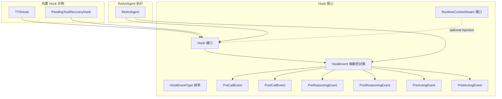
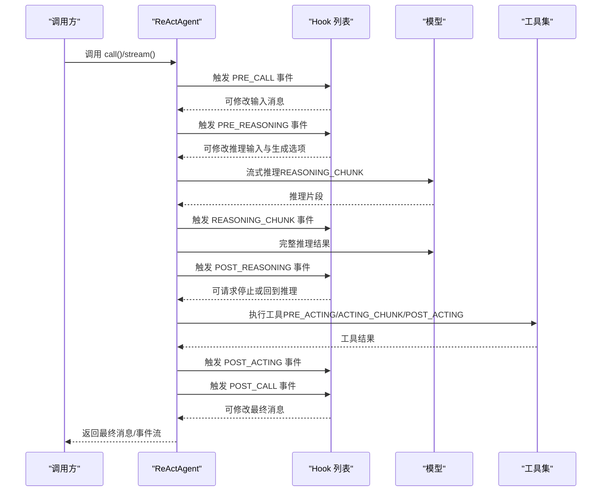
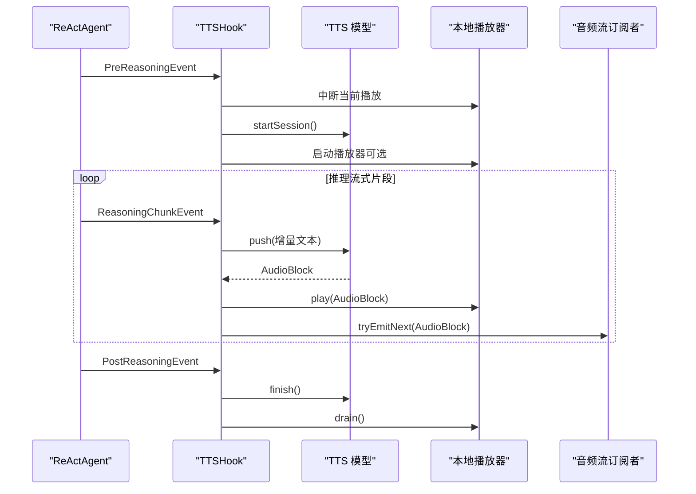
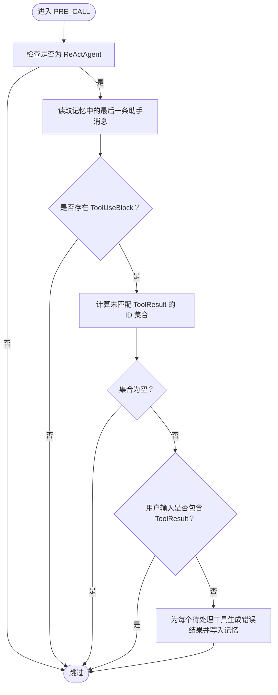
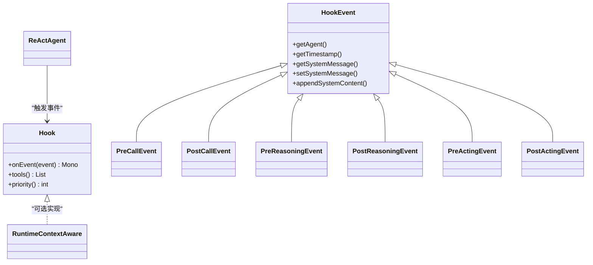

# Hook 概念与架构

<cite>
**本文引用的文件**
- [Hook.java](file://agentscope-core/src/main/java/io/agentscope/core/hook/Hook.java)
- [HookEvent.java](file://agentscope-core/src/main/java/io/agentscope/core/hook/HookEvent.java)
- [HookEventType.java](file://agentscope-core/src/main/java/io/agentscope/core/hook/HookEventType.java)
- [PreCallEvent.java](file://agentscope-core/src/main/java/io/agentscope/core/hook/PreCallEvent.java)
- [PostCallEvent.java](file://agentscope-core/src/main/java/io/agentscope/core/hook/PostCallEvent.java)
- [PreReasoningEvent.java](file://agentscope-core/src/main/java/io/agentscope/core/hook/PreReasoningEvent.java)
- [PostReasoningEvent.java](file://agentscope-core/src/main/java/io/agentscope/core/hook/PostReasoningEvent.java)
- [PreActingEvent.java](file://agentscope-core/src/main/java/io/agentscope/core/hook/PreActingEvent.java)
- [PostActingEvent.java](file://agentscope-core/src/main/java/io/agentscope/core/hook/PostActingEvent.java)
- [RuntimeContextAware.java](file://agentscope-core/src/main/java/io/agentscope/core/hook/RuntimeContextAware.java)
- [TTSHook.java](file://agentscope-core/src/main/java/io/agentscope/core/hook/TTSHook.java)
- [PendingToolRecoveryHook.java](file://agentscope-core/src/main/java/io/agentscope/core/hook/PendingToolRecoveryHook.java)
- [ReActAgent.java](file://agentscope-core/src/main/java/io/agentscope/core/ReActAgent.java)
</cite>

## 目录
1. [引言](#引言)
2. [项目结构](#项目结构)
3. [核心组件](#核心组件)
4. [架构总览](#架构总览)
5. [详细组件分析](#详细组件分析)
6. [依赖关系分析](#依赖关系分析)
7. [性能考量](#性能考量)
8. [故障排查指南](#故障排查指南)
9. [结论](#结论)
10. [附录：典型应用示例路径](#附录典型应用示例路径)

## 引言
本文件系统性阐述 AgentScope Java 中 Hook（钩子）的概念与架构设计，重点覆盖以下主题：
- 统一事件模型的设计理念与优势
- Hook 接口的职责分离与事件驱动机制
- Hook 生命周期管理、优先级机制与执行顺序规则
- Hook 与 ReActAgent 的集成方式及在智能体执行流程中的作用位置
- HookEvent 类型体系与事件分类（可修改事件 vs 只读事件）
- Hook 系统的性能考虑与最佳实践
- 基于仓库中真实实现的代码示例路径

## 项目结构
围绕 Hook 的核心代码位于 agentscope-core 模块的 io.agentscope.core.hook 包内，配合 ReActAgent 的执行流程进行事件分发与拦截。下图给出与 Hook 相关的文件组织概览。

图表来源
- [Hook.java:117-186](file://agentscope-core/src/main/java/io/agentscope/core/hook/Hook.java#L117-L186)
- [HookEvent.java:74-75](file://agentscope-core/src/main/java/io/agentscope/core/hook/HookEvent.java#L74-L75)
- [HookEventType.java:27-63](file://agentscope-core/src/main/java/io/agentscope/core/hook/HookEventType.java#L27-L63)
- [PreCallEvent.java:44-80](file://agentscope-core/src/main/java/io/agentscope/core/hook/PreCallEvent.java#L44-L80)
- [PostCallEvent.java:42-76](file://agentscope-core/src/main/java/io/agentscope/core/hook/PostCallEvent.java#L42-L76)
- [PreReasoningEvent.java:47-116](file://agentscope-core/src/main/java/io/agentscope/core/hook/PreReasoningEvent.java#L47-L116)
- [PostReasoningEvent.java:51-172](file://agentscope-core/src/main/java/io/agentscope/core/hook/PostReasoningEvent.java#L51-L172)
- [PreActingEvent.java:47-70](file://agentscope-core/src/main/java/io/agentscope/core/hook/PreActingEvent.java#L47-L70)
- [PostActingEvent.java:50-128](file://agentscope-core/src/main/java/io/agentscope/core/hook/PostActingEvent.java#L50-L128)
- [RuntimeContextAware.java:30-39](file://agentscope-core/src/main/java/io/agentscope/core/hook/RuntimeContextAware.java#L30-L39)
- [ReActAgent.java:140-194](file://agentscope-core/src/main/java/io/agentscope/core/ReActAgent.java#L140-L194)
- [TTSHook.java:74-457](file://agentscope-core/src/main/java/io/agentscope/core/hook/TTSHook.java#L74-L457)
- [PendingToolRecoveryHook.java:58-224](file://agentscope-core/src/main/java/io/agentscope/core/hook/PendingToolRecoveryHook.java#L58-L224)

章节来源
- [Hook.java:117-186](file://agentscope-core/src/main/java/io/agentscope/core/hook/Hook.java#L117-L186)
- [HookEvent.java:74-205](file://agentscope-core/src/main/java/io/agentscope/core/hook/HookEvent.java#L74-L205)
- [HookEventType.java:27-63](file://agentscope-core/src/main/java/io/agentscope/core/hook/HookEventType.java#L27-L63)
- [ReActAgent.java:140-194](file://agentscope-core/src/main/java/io/agentscope/core/ReActAgent.java#L140-L194)

## 核心组件
- Hook 接口：定义统一事件入口 onEvent(...) 与可选工具注册 tools()、优先级 priority()。所有 Agent 执行事件均通过该接口进入，形成“单一职责”的事件处理入口。
- HookEvent 抽象密封类：作为所有事件类型的基类，提供统一上下文（Agent、时间戳、内存访问），并维护“统一系统消息”systemMsg 的读写 API，确保多轮迭代中系统提示的一致性与可扩展性。
- HookEventType 枚举：定义 Hook 生命周期中的关键节点（如 PRE_CALL、PRE_REASONING、REASONING_CHUNK、POST_REASONING、PRE_ACTING、ACTING_CHUNK、POST_ACTING、PRE_SUMMARY、SUMMARY_CHUNK、POST_SUMMARY、ERROR）。
- 具体事件类：按阶段细分为 PreCallEvent、PostCallEvent、PreReasoningEvent、PostReasoningEvent、PreActingEvent、PostActingEvent 等，分别承载该阶段的输入输出与可修改字段。
- RuntimeContextAware：可选注入接口，用于在每次调用期间向实现了该接口的 Hook 注入或清理 RuntimeContext，便于跨 Hook 协作与状态共享。
- ReActAgent：负责在推理与行动阶段触发各类 Hook 事件，串联模型调用、工具执行与内存更新，是 Hook 的主要触发者与编排者。

章节来源
- [Hook.java:117-186](file://agentscope-core/src/main/java/io/agentscope/core/hook/Hook.java#L117-L186)
- [HookEvent.java:74-205](file://agentscope-core/src/main/java/io/agentscope/core/hook/HookEvent.java#L74-L205)
- [HookEventType.java:27-63](file://agentscope-core/src/main/java/io/agentscope/core/hook/HookEventType.java#L27-L63)
- [PreCallEvent.java:44-80](file://agentscope-core/src/main/java/io/agentscope/core/hook/PreCallEvent.java#L44-L80)
- [PostCallEvent.java:42-76](file://agentscope-core/src/main/java/io/agentscope/core/hook/PostCallEvent.java#L42-L76)
- [PreReasoningEvent.java:47-116](file://agentscope-core/src/main/java/io/agentscope/core/hook/PreReasoningEvent.java#L47-L116)
- [PostReasoningEvent.java:51-172](file://agentscope-core/src/main/java/io/agentscope/core/hook/PostReasoningEvent.java#L51-L172)
- [PreActingEvent.java:47-70](file://agentscope-core/src/main/java/io/agentscope/core/hook/PreActingEvent.java#L47-L70)
- [PostActingEvent.java:50-128](file://agentscope-core/src/main/java/io/agentscope/core/hook/PostActingEvent.java#L50-L128)
- [RuntimeContextAware.java:30-39](file://agentscope-core/src/main/java/io/agentscope/core/hook/RuntimeContextAware.java#L30-L39)
- [ReActAgent.java:140-194](file://agentscope-core/src/main/java/io/agentscope/core/ReActAgent.java#L140-L194)

## 架构总览
下图展示了 ReActAgent 如何在不同阶段触发 Hook 事件，以及 Hook 对事件的拦截与可选修改能力。

图表来源
- [ReActAgent.java:364-800](file://agentscope-core/src/main/java/io/agentscope/core/ReActAgent.java#L364-L800)
- [Hook.java:147-147](file://agentscope-core/src/main/java/io/agentscope/core/hook/Hook.java#L147-L147)
- [PreCallEvent.java:44-80](file://agentscope-core/src/main/java/io/agentscope/core/hook/PreCallEvent.java#L44-L80)
- [PreReasoningEvent.java:47-116](file://agentscope-core/src/main/java/io/agentscope/core/hook/PreReasoningEvent.java#L47-L116)
- [PostReasoningEvent.java:51-172](file://agentscope-core/src/main/java/io/agentscope/core/hook/PostReasoningEvent.java#L51-L172)
- [PreActingEvent.java:47-70](file://agentscope-core/src/main/java/io/agentscope/core/hook/PreActingEvent.java#L47-L70)
- [PostActingEvent.java:50-128](file://agentscope-core/src/main/java/io/agentscope/core/hook/PostActingEvent.java#L50-L128)
- [PostCallEvent.java:42-76](file://agentscope-core/src/main/java/io/agentscope/core/hook/PostCallEvent.java#L42-L76)

## 详细组件分析

### 统一事件模型与职责分离
- 设计思想：以 Hook.onEvent(...) 为唯一入口，集中处理所有 Agent 执行阶段事件；通过事件类型枚举与具体事件类实现“按阶段、按语义”的精确拦截点。
- 职责分离：
  - ReActAgent 负责执行编排与事件触发；
  - Hook 负责对特定阶段的输入/输出进行读取与可选修改；
  - HookEvent 提供统一上下文与系统消息管理，避免各 Hook 自行拼装上下文。
- 优势：降低耦合、提升可扩展性、保证事件一致性与可追踪性。

章节来源
- [Hook.java:25-41](file://agentscope-core/src/main/java/io/agentscope/core/hook/Hook.java#L25-L41)
- [Hook.java:147-147](file://agentscope-core/src/main/java/io/agentscope/core/hook/Hook.java#L147-L147)
- [HookEvent.java:29-73](file://agentscope-core/src/main/java/io/agentscope/core/hook/HookEvent.java#L29-L73)

### Hook 生命周期管理与执行顺序
- 生命周期阶段：PRE_CALL → PRE_REASONING → REASONING_CHUNK* → POST_REASONING → PRE_ACTING → ACTING_CHUNK* → POST_ACTING → PRE_SUMMARY → SUMMARY_CHUNK* → POST_SUMMARY → POST_CALL；以及 ERROR。
- 执行顺序规则：
  - Hook 按 priority() 升序执行（数值越小优先级越高）；priority 相同时按注册顺序执行。
  - 针对同一阶段的多个事件（如 REASONING_CHUNK、ACTING_CHUNK），ReActAgent 会逐个通知，每个事件独立触发一次 onEvent(...)。
- 关键行为：
  - PreCallEvent：可修改输入消息列表；
  - PostCallEvent：可修改最终消息；
  - PreReasoningEvent：可修改推理输入与生成选项；
  - PostReasoningEvent：可修改推理结果、请求停止或回到推理；
  - PreActingEvent：可修改单个工具调用参数；
  - PostActingEvent：可修改单个工具结果、请求停止；
  - ReasoningChunkEvent、ActingChunkEvent、ErrorEvent 为只读事件，用于观察与日志。

章节来源
- [HookEventType.java:27-63](file://agentscope-core/src/main/java/io/agentscope/core/hook/HookEventType.java#L27-L63)
- [Hook.java:167-185](file://agentscope-core/src/main/java/io/agentscope/core/hook/Hook.java#L167-L185)
- [PreCallEvent.java:24-43](file://agentscope-core/src/main/java/io/agentscope/core/hook/PreCallEvent.java#L24-L43)
- [PostCallEvent.java:22-41](file://agentscope-core/src/main/java/io/agentscope/core/hook/PostCallEvent.java#L22-L41)
- [PreReasoningEvent.java:25-46](file://agentscope-core/src/main/java/io/agentscope/core/hook/PreReasoningEvent.java#L25-L46)
- [PostReasoningEvent.java:25-50](file://agentscope-core/src/main/java/io/agentscope/core/hook/PostReasoningEvent.java#L25-L50)
- [PreActingEvent.java:23-46](file://agentscope-core/src/main/java/io/agentscope/core/hook/PreActingEvent.java#L23-L46)
- [PostActingEvent.java:24-49](file://agentscope-core/src/main/java/io/agentscope/core/hook/PostActingEvent.java#L24-L49)

### Hook 与 ReActAgent 的集成
- ReActAgent 在推理与行动阶段主动触发 Hook 事件，并在必要时合并 Hook 修改后的上下文（例如将系统消息注入到推理输入前）。
- ReActAgent 还负责：
  - 绑定/解绑 RuntimeContext 到 Hook（若实现 RuntimeContextAware）；
  - 管理统一系统消息的冻结与注入；
  - 处理中断、人类在回（HITL）、结构化输出等场景下的特殊控制流。

章节来源
- [ReActAgent.java:198-230](file://agentscope-core/src/main/java/io/agentscope/core/ReActAgent.java#L198-L230)
- [ReActAgent.java:211-225](file://agentscope-core/src/main/java/io/agentscope/core/ReActAgent.java#L211-L225)
- [ReActAgent.java:560-650](file://agentscope-core/src/main/java/io/agentscope/core/ReActAgent.java#L560-L650)
- [ReActAgent.java:669-731](file://agentscope-core/src/main/java/io/agentscope/core/ReActAgent.java#L669-L731)
- [RuntimeContextAware.java:20-39](file://agentscope-core/src/main/java/io/agentscope/core/hook/RuntimeContextAware.java#L20-L39)

### HookEvent 类型体系与事件分类
- 分类依据：是否具备 setter 方法决定事件是否可修改。
  - 可修改事件：PreCallEvent、PostCallEvent、PreReasoningEvent、PostReasoningEvent、PreActingEvent、PostActingEvent。
  - 只读事件：ReasoningChunkEvent、ActingChunkEvent、ErrorEvent。
- 统一系统消息管理：
  - HookEvent 维护 systemMsg 字段；
  - ReActAgent 在 PRE_CALL 冻结系统消息，在后续每轮 PRE_REASONING/PreSummary 注入该冻结副本；
  - Hook 应通过 setSystemMessage 或 appendSystemContent 进行修改，避免直接向输入消息注入 SYSTEM 角色消息。

章节来源
- [HookEvent.java:29-73](file://agentscope-core/src/main/java/io/agentscope/core/hook/HookEvent.java#L29-L73)
- [HookEvent.java:140-204](file://agentscope-core/src/main/java/io/agentscope/core/hook/HookEvent.java#L140-L204)
- [PreCallEvent.java:24-43](file://agentscope-core/src/main/java/io/agentscope/core/hook/PreCallEvent.java#L24-L43)
- [PostCallEvent.java:22-41](file://agentscope-core/src/main/java/io/agentscope/core/hook/PostCallEvent.java#L22-L41)
- [PreReasoningEvent.java:25-46](file://agentscope-core/src/main/java/io/agentscope/core/hook/PreReasoningEvent.java#L25-L46)
- [PostReasoningEvent.java:25-50](file://agentscope-core/src/main/java/io/agentscope/core/hook/PostReasoningEvent.java#L25-L50)
- [PreActingEvent.java:23-46](file://agentscope-core/src/main/java/io/agentscope/core/hook/PreActingEvent.java#L23-L46)
- [PostActingEvent.java:24-49](file://agentscope-core/src/main/java/io/agentscope/core/hook/PostActingEvent.java#L24-L49)

### 典型 Hook 实现示例

#### TTSHook：实时语音合成 Hook
- 功能概述：在推理流中实时合成语音，支持本地播放与服务器回调两种模式；在新一轮推理开始时自动中断上一轮播放。
- 关键点：
  - 支持实时模式与批量模式；
  - 提供 getAudioStream() 以供外部订阅音频流；
  - 在 PreReasoningEvent/ReasoningChunkEvent/PostReasoningEvent 之间协调 TTS 会话与播放器状态。

图表来源
- [TTSHook.java:120-171](file://agentscope-core/src/main/java/io/agentscope/core/hook/TTSHook.java#L120-L171)
- [TTSHook.java:176-197](file://agentscope-core/src/main/java/io/agentscope/core/hook/TTSHook.java#L176-L197)
- [TTSHook.java:202-226](file://agentscope-core/src/main/java/io/agentscope/core/hook/TTSHook.java#L202-L226)
- [TTSHook.java:254-274](file://agentscope-core/src/main/java/io/agentscope/core/hook/TTSHook.java#L254-L274)

章节来源
- [TTSHook.java:74-457](file://agentscope-core/src/main/java/io/agentscope/core/hook/TTSHook.java#L74-L457)

#### PendingToolRecoveryHook：待处理工具恢复 Hook
- 功能概述：在 PRE_CALL 阶段检测并自动补全孤儿工具调用（无对应结果），防止因状态不一致导致异常终止。
- 关键点：
  - 仅在 ReActAgent 场景生效；
  - 优先级较高（10），确保在其他依赖内存状态的 Hook 之前运行；
  - 自动生成错误结果并写入记忆，使 Agent 可继续执行。

图表来源
- [PendingToolRecoveryHook.java:84-124](file://agentscope-core/src/main/java/io/agentscope/core/hook/PendingToolRecoveryHook.java#L84-L124)
- [PendingToolRecoveryHook.java:133-161](file://agentscope-core/src/main/java/io/agentscope/core/hook/PendingToolRecoveryHook.java#L133-L161)
- [PendingToolRecoveryHook.java:171-203](file://agentscope-core/src/main/java/io/agentscope/core/hook/PendingToolRecoveryHook.java#L171-L203)

章节来源
- [PendingToolRecoveryHook.java:58-224](file://agentscope-core/src/main/java/io/agentscope/core/hook/PendingToolRecoveryHook.java#L58-L224)

## 依赖关系分析
- ReActAgent 与 Hook 的耦合度低：ReActAgent 仅通过事件类型与事件对象与 Hook 交互，不关心 Hook 的具体实现。
- Hook 之间的耦合由优先级与事件修改能力控制：高优先级 Hook 可影响后续 Hook 的输入上下文；只读事件仅用于观测。
- RuntimeContextAware 为可选扩展，用于跨 Hook 共享可变上下文，避免全局状态污染。

图表来源
- [Hook.java:117-186](file://agentscope-core/src/main/java/io/agentscope/core/hook/Hook.java#L117-L186)
- [HookEvent.java:74-205](file://agentscope-core/src/main/java/io/agentscope/core/hook/HookEvent.java#L74-L205)
- [PreCallEvent.java:44-80](file://agentscope-core/src/main/java/io/agentscope/core/hook/PreCallEvent.java#L44-L80)
- [PostCallEvent.java:42-76](file://agentscope-core/src/main/java/io/agentscope/core/hook/PostCallEvent.java#L42-L76)
- [PreReasoningEvent.java:47-116](file://agentscope-core/src/main/java/io/agentscope/core/hook/PreReasoningEvent.java#L47-L116)
- [PostReasoningEvent.java:51-172](file://agentscope-core/src/main/java/io/agentscope/core/hook/PostReasoningEvent.java#L51-L172)
- [PreActingEvent.java:47-70](file://agentscope-core/src/main/java/io/agentscope/core/hook/PreActingEvent.java#L47-L70)
- [PostActingEvent.java:50-128](file://agentscope-core/src/main/java/io/agentscope/core/hook/PostActingEvent.java#L50-L128)
- [ReActAgent.java:140-194](file://agentscope-core/src/main/java/io/agentscope/core/ReActAgent.java#L140-L194)
- [RuntimeContextAware.java:30-39](file://agentscope-core/src/main/java/io/agentscope/core/hook/RuntimeContextAware.java#L30-L39)

## 性能考量
- 事件处理为非阻塞异步：Hook.onEvent 返回 Mono，ReActAgent 使用响应式链路串接事件，避免阻塞主线程。
- 事件粒度与开销：
  - REASONING_CHUNK/ACTING_CHUNK 事件频繁触发，应避免在 Hook 中执行重 IO 或复杂计算；
  - 对于批量模式（如 TTSHook 批量合成），应在 Hook 内部进行必要的缓冲与背压处理。
- 优先级与顺序：
  - 将关键但轻量的 Hook（如日志、指标）置于较低优先级，减少对主路径的影响；
  - 高优先级 Hook（如安全校验、认证）应尽量短小，避免阻塞后续事件传播。
- 资源管理：
  - 对外设（播放器、网络）的资源需在 Hook 生命周期内正确启动/中断/释放，避免泄漏（参见 TTSHook 的中断与关闭逻辑）。

## 故障排查指南
- 系统消息注入错误：
  - 现象：向输入消息直接注入 SYSTEM 角色消息导致非法状态。
  - 处理：使用 HookEvent 的 setSystemMessage 或 appendSystemContent 修改系统消息。
- 待处理工具恢复：
  - 现象：工具执行失败后出现“存在待处理工具但无结果”的异常。
  - 处理：启用 PendingToolRecoveryHook 或在用户输入中提供 ToolResult；确认其优先级高于依赖内存状态的 Hook。
- 人类在回（HITL）：
  - 现象：需要在推理或行动阶段暂停等待人工确认。
  - 处理：在 PostReasoningEvent/PostActingEvent 上调用 stopAgent() 请求停止；随后通过无参 call() 恢复。
- 事件只读误用：
  - 现象：尝试修改 ReasoningChunkEvent/ActingChunkEvent/ ErrorEvent 的字段。
  - 处理：这些事件为只读，仅用于记录与观察；如需修改，请在对应的可修改事件阶段进行。

章节来源
- [HookEvent.java:43-67](file://agentscope-core/src/main/java/io/agentscope/core/hook/HookEvent.java#L43-L67)
- [PostReasoningEvent.java:98-110](file://agentscope-core/src/main/java/io/agentscope/core/hook/PostReasoningEvent.java#L98-L110)
- [PostActingEvent.java:97-109](file://agentscope-core/src/main/java/io/agentscope/core/hook/PostActingEvent.java#L97-L109)
- [PendingToolRecoveryHook.java:34-53](file://agentscope-core/src/main/java/io/agentscope/core/hook/PendingToolRecoveryHook.java#L34-L53)

## 结论
AgentScope 的 Hook 架构通过统一事件模型与严格的职责分离，实现了对 ReActAgent 执行流程的可观测、可控与可扩展。借助 HookEventType 的清晰阶段划分、HookEvent 的统一上下文与系统消息管理，以及 Hook 的优先级与可修改事件设计，开发者可以在不侵入核心逻辑的前提下，灵活地注入业务规则、监控与增强功能。结合 TTSHook 与 PendingToolRecoveryHook 等内置实现，可以快速构建从语音合成到状态恢复的完整能力闭环。

## 附录：典型应用示例路径
- 实时语音合成（TTSHook）
  - [TTSHook.java:120-171](file://agentscope-core/src/main/java/io/agentscope/core/hook/TTSHook.java#L120-L171)
  - [TTSHook.java:176-197](file://agentscope-core/src/main/java/io/agentscope/core/hook/TTSHook.java#L176-L197)
  - [TTSHook.java:202-226](file://agentscope-core/src/main/java/io/agentscope/core/hook/TTSHook.java#L202-L226)
- 待处理工具恢复（PendingToolRecoveryHook）
  - [PendingToolRecoveryHook.java:84-124](file://agentscope-core/src/main/java/io/agentscope/core/hook/PendingToolRecoveryHook.java#L84-L124)
  - [PendingToolRecoveryHook.java:133-161](file://agentscope-core/src/main/java/io/agentscope/core/hook/PendingToolRecoveryHook.java#L133-L161)
  - [PendingToolRecoveryHook.java:171-203](file://agentscope-core/src/main/java/io/agentscope/core/hook/PendingToolRecoveryHook.java#L171-L203)
- ReActAgent 执行流程与事件触发
  - [ReActAgent.java:560-650](file://agentscope-core/src/main/java/io/agentscope/core/ReActAgent.java#L560-L650)
  - [ReActAgent.java:669-731](file://agentscope-core/src/main/java/io/agentscope/core/ReActAgent.java#L669-L731)